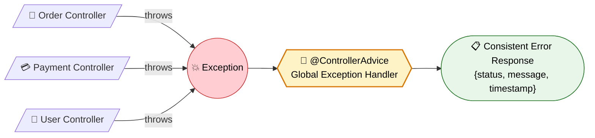
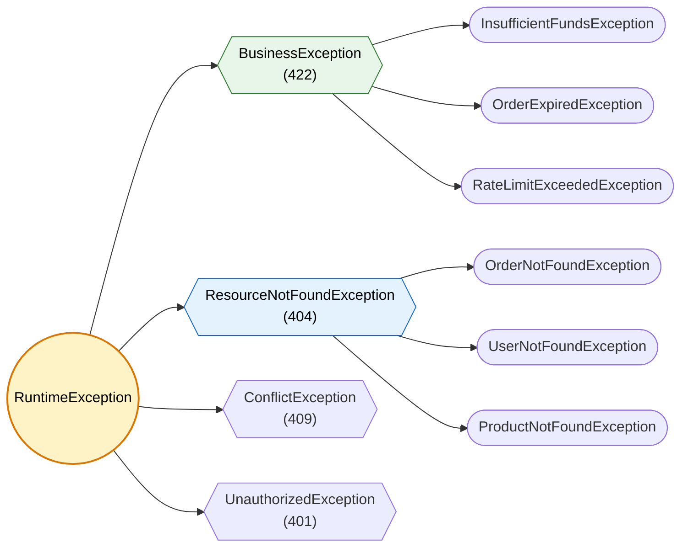

# Global Exception Handling

> Handle errors gracefully across your entire application. Return consistent, meaningful error responses to clients.

---

!!! abstract "Real-World Analogy"
    Think of a **hospital emergency room**. Broken arm, allergic reaction, heart attack — you go to ONE place (ER) that triages and handles appropriately. Without the ER, each department handles emergencies differently. `@ControllerAdvice` is your application's ER — one centralized place for all exceptions.



---

## The Problem: Without Global Handling

```java
// BAD: Try-catch in every controller method
@GetMapping("/{id}")
public ResponseEntity<?> getOrder(@PathVariable Long id) {
    try {
        Order order = orderService.findById(id);
        return ResponseEntity.ok(order);
    } catch (OrderNotFoundException e) {
        return ResponseEntity.status(404).body("Order not found");
    } catch (Exception e) {
        return ResponseEntity.status(500).body("Something went wrong");
    }
}
```

Problems: duplicated error handling, inconsistent responses, cluttered controller code.

---

## The Solution: @ControllerAdvice + @ExceptionHandler

The standard pattern. `@ControllerAdvice` declares a class that intercepts exceptions from all controllers. `@ExceptionHandler` marks methods that handle specific exception types.

### Precedence Rules

| Scope | Behavior |
|-------|----------|
| Controller-level `@ExceptionHandler` | Handles exceptions from **that controller only**. Highest priority. |
| `@ControllerAdvice` with `basePackages` | Handles exceptions from controllers in specified packages. |
| Global `@ControllerAdvice` (no filter) | Catches everything not handled above. Lowest priority. |
| Multiple `@ControllerAdvice` classes | Use `@Order` to control precedence. Lower value = higher priority. |

!!! warning "Precedence Gotcha"
    A controller-level `@ExceptionHandler` always wins over `@ControllerAdvice`. If both define a handler for the same exception type, the controller-local one executes.

---

## Exception Hierarchy Design

Design a hierarchy that maps cleanly to HTTP status codes. Domain exceptions extend base types.



!!! tip "Design Tip"
    Keep base exceptions small. Map each to one HTTP status. Domain exceptions inherit the status. The handler catches the base type — one handler covers all subtypes.

---

## Production-Grade E-Commerce API: Full Setup

### Step 1: Exception Hierarchy

```java
// Base exception — all business errors extend this
public abstract class BusinessException extends RuntimeException {
    private final String errorCode;

    protected BusinessException(String errorCode, String message) {
        super(message);
        this.errorCode = errorCode;
    }

    protected BusinessException(String errorCode, String message, Throwable cause) {
        super(message, cause);
        this.errorCode = errorCode;
    }

    public String getErrorCode() { return errorCode; }
}

// 404 family
public class ResourceNotFoundException extends BusinessException {
    private final String resourceName;
    private final String fieldName;
    private final Object fieldValue;

    public ResourceNotFoundException(String resourceName, String fieldName, Object fieldValue) {
        super("RESOURCE_NOT_FOUND",
              String.format("%s not found with %s: '%s'", resourceName, fieldName, fieldValue));
        this.resourceName = resourceName;
        this.fieldName = fieldName;
        this.fieldValue = fieldValue;
    }
}

public class OrderNotFoundException extends ResourceNotFoundException {
    public OrderNotFoundException(Long orderId) {
        super("Order", "id", orderId);
    }
}

public class ProductNotFoundException extends ResourceNotFoundException {
    public ProductNotFoundException(String sku) {
        super("Product", "sku", sku);
    }
}

// 422 family
public class InsufficientFundsException extends BusinessException {
    public InsufficientFundsException(BigDecimal required, BigDecimal available) {
        super("INSUFFICIENT_FUNDS",
              String.format("Required: %s, Available: %s", required, available));
    }
}

public class OrderExpiredException extends BusinessException {
    public OrderExpiredException(Long orderId) {
        super("ORDER_EXPIRED", String.format("Order %d has expired", orderId));
    }
}
```

### Step 2: Production Error Response DTO

```java
public record ApiError(
    int status,
    String error,
    String errorCode,
    String message,
    String path,
    String traceId,
    Instant timestamp,
    List<FieldError> fieldErrors
) {
    public record FieldError(String field, String message, Object rejectedValue) {}

    public static ApiError of(int status, String error, String errorCode,
                              String message, String path, String traceId) {
        return new ApiError(status, error, errorCode, message, path,
                           traceId, Instant.now(), null);
    }

    public static ApiError withFieldErrors(int status, String error, String message,
                                           String path, String traceId,
                                           List<FieldError> fieldErrors) {
        return new ApiError(status, error, "VALIDATION_FAILED", message, path,
                           traceId, Instant.now(), fieldErrors);
    }
}
```

Sample response:

```json
{
    "status": 404,
    "error": "Not Found",
    "errorCode": "RESOURCE_NOT_FOUND",
    "message": "Order not found with id: '42'",
    "path": "/api/orders/42",
    "traceId": "abc123def456",
    "timestamp": "2024-01-15T10:30:00Z",
    "fieldErrors": null
}
```

Validation error response:

```json
{
    "status": 400,
    "error": "Bad Request",
    "errorCode": "VALIDATION_FAILED",
    "message": "Request validation failed",
    "path": "/api/orders",
    "traceId": "xyz789ghi012",
    "timestamp": "2024-01-15T10:30:00Z",
    "fieldErrors": [
        { "field": "email", "message": "must be a valid email", "rejectedValue": "not-an-email" },
        { "field": "amount", "message": "must be greater than 0", "rejectedValue": -5 }
    ]
}
```

### Step 3: Global Exception Handler with Logging Strategy

```java
@RestControllerAdvice
@Slf4j
@Order(Ordered.LOWEST_PRECEDENCE)
public class GlobalExceptionHandler extends ResponseEntityExceptionHandler {

    // --- 4xx: Log at WARN ---

    @ExceptionHandler(ResourceNotFoundException.class)
    public ResponseEntity<ApiError> handleNotFound(
            ResourceNotFoundException ex, HttpServletRequest request) {
        String traceId = MDC.get("traceId");
        log.warn("[{}] Resource not found: {} | path={}", traceId, ex.getMessage(),
                 request.getRequestURI());

        ApiError error = ApiError.of(404, "Not Found", ex.getErrorCode(),
                                     ex.getMessage(), request.getRequestURI(), traceId);
        return ResponseEntity.status(404).body(error);
    }

    @ExceptionHandler(BusinessException.class)
    public ResponseEntity<ApiError> handleBusinessError(
            BusinessException ex, HttpServletRequest request) {
        String traceId = MDC.get("traceId");
        log.warn("[{}] Business error: code={}, message={} | path={} | method={}",
                 traceId, ex.getErrorCode(), ex.getMessage(),
                 request.getRequestURI(), request.getMethod());

        ApiError error = ApiError.of(422, "Unprocessable Entity", ex.getErrorCode(),
                                     ex.getMessage(), request.getRequestURI(), traceId);
        return ResponseEntity.status(422).body(error);
    }

    // --- Validation errors ---

    @Override
    protected ResponseEntity<Object> handleMethodArgumentNotValid(
            MethodArgumentNotValidException ex,
            HttpHeaders headers, HttpStatusCode status, WebRequest request) {
        String traceId = MDC.get("traceId");
        String path = ((ServletWebRequest) request).getRequest().getRequestURI();

        List<ApiError.FieldError> fieldErrors = ex.getBindingResult().getFieldErrors()
            .stream()
            .map(fe -> new ApiError.FieldError(
                fe.getField(), fe.getDefaultMessage(), fe.getRejectedValue()))
            .toList();

        log.warn("[{}] Validation failed: {} errors | path={}", traceId, fieldErrors.size(), path);

        ApiError error = ApiError.withFieldErrors(400, "Bad Request",
                "Request validation failed", path, traceId, fieldErrors);
        return ResponseEntity.badRequest().body(error);
    }

    // --- 5xx: Log at ERROR with full stack trace ---

    @ExceptionHandler(Exception.class)
    public ResponseEntity<ApiError> handleUnexpected(
            Exception ex, HttpServletRequest request) {
        String traceId = MDC.get("traceId");
        log.error("[{}] Unexpected error | path={} | method={} | query={}",
                  traceId, request.getRequestURI(), request.getMethod(),
                  request.getQueryString(), ex);

        ApiError error = ApiError.of(500, "Internal Server Error", "INTERNAL_ERROR",
                "An unexpected error occurred", request.getRequestURI(), traceId);
        return ResponseEntity.status(500).body(error);
    }
}
```

!!! note "Logging Strategy"
    | Status Range | Log Level | Details |
    |---|---|---|
    | 4xx (client errors) | `WARN` | Message, path, traceId. No stack trace. |
    | 5xx (server errors) | `ERROR` | Full stack trace, request method, query params, traceId. |
    | Validation errors | `WARN` | Field count, path. Not individual field messages (too noisy). |

---

## @ResponseStatus Annotation

Annotate exceptions directly. No handler method needed.

```java
@ResponseStatus(value = HttpStatus.NOT_FOUND, reason = "Order not found")
public class OrderNotFoundException extends RuntimeException {
    public OrderNotFoundException(Long id) {
        super("Order not found: " + id);
    }
}
```

!!! warning "Limitation"
    `@ResponseStatus` returns Spring's default error body. You cannot customize the response format. Use `@ExceptionHandler` for custom error DTOs.

---

## ResponseEntityExceptionHandler

Spring's base class that handles common Spring MVC exceptions. Extend it to customize how standard exceptions are rendered.

| Exception | Default Status | When Thrown |
|-----------|---------------|-------------|
| `MethodArgumentNotValidException` | 400 | `@Valid` fails |
| `HttpRequestMethodNotSupportedException` | 405 | Wrong HTTP method |
| `HttpMediaTypeNotSupportedException` | 415 | Wrong Content-Type |
| `MissingServletRequestParameterException` | 400 | Missing required param |
| `NoHandlerFoundException` | 404 | No mapping found |

Override methods selectively:

```java
@RestControllerAdvice
public class GlobalExceptionHandler extends ResponseEntityExceptionHandler {

    @Override
    protected ResponseEntity<Object> handleHttpRequestMethodNotSupported(
            HttpRequestMethodNotSupportedException ex,
            HttpHeaders headers, HttpStatusCode status, WebRequest request) {
        
        ApiError error = ApiError.of(405, "Method Not Allowed", "METHOD_NOT_SUPPORTED",
            "Supported methods: " + ex.getSupportedHttpMethods(),
            ((ServletWebRequest) request).getRequest().getRequestURI(),
            MDC.get("traceId"));
        return ResponseEntity.status(405).body(error);
    }
}
```

---

## RFC 7807 Problem Details (Spring 6 Native Support)

Spring 6 / Spring Boot 3 has first-class support for RFC 7807 via the `ProblemDetail` class.

### Enable It

```yaml
spring:
  mvc:
    problemdetails:
      enabled: true
```

### Use ProblemDetail Directly

```java
@RestControllerAdvice
public class ProblemDetailExceptionHandler extends ResponseEntityExceptionHandler {

    @ExceptionHandler(OrderNotFoundException.class)
    public ProblemDetail handleOrderNotFound(OrderNotFoundException ex,
                                             HttpServletRequest request) {
        ProblemDetail problem = ProblemDetail.forStatusAndDetail(
            HttpStatus.NOT_FOUND, ex.getMessage());
        problem.setTitle("Order Not Found");
        problem.setType(URI.create("https://api.myshop.com/errors/order-not-found"));
        problem.setInstance(URI.create(request.getRequestURI()));
        problem.setProperty("traceId", MDC.get("traceId"));
        problem.setProperty("timestamp", Instant.now());
        return problem;
    }

    @ExceptionHandler(InsufficientFundsException.class)
    public ProblemDetail handleInsufficientFunds(InsufficientFundsException ex) {
        ProblemDetail problem = ProblemDetail.forStatusAndDetail(
            HttpStatus.UNPROCESSABLE_ENTITY, ex.getMessage());
        problem.setTitle("Insufficient Funds");
        problem.setType(URI.create("https://api.myshop.com/errors/insufficient-funds"));
        problem.setProperty("errorCode", ex.getErrorCode());
        return problem;
    }
}
```

Response (content-type: `application/problem+json`):

```json
{
    "type": "https://api.myshop.com/errors/order-not-found",
    "title": "Order Not Found",
    "status": 404,
    "detail": "Order not found with id: '42'",
    "instance": "/api/orders/42",
    "traceId": "abc123def456",
    "timestamp": "2024-01-15T10:30:00Z"
}
```

!!! info "When to Use ProblemDetail vs Custom DTO"
    Use `ProblemDetail` when building public APIs that need interoperability. Use a custom DTO when you need nested structures (like `fieldErrors` array) or when your clients are all internal.

---

## Validation Errors: MethodArgumentNotValidException

When `@Valid` fails, Spring throws `MethodArgumentNotValidException`. Extract field-level details from `BindingResult`.

```java
public record CreateOrderRequest(
    @NotBlank(message = "Customer ID is required")
    String customerId,

    @NotEmpty(message = "At least one item is required")
    List<@Valid OrderItemRequest> items,

    @Positive(message = "Amount must be positive")
    BigDecimal amount,

    @Email(message = "Must be a valid email")
    String contactEmail
) {}

public record OrderItemRequest(
    @NotBlank(message = "SKU is required")
    String sku,

    @Min(value = 1, message = "Quantity must be at least 1")
    int quantity
) {}
```

```java
@PostMapping("/orders")
public Order createOrder(@Valid @RequestBody CreateOrderRequest request) {
    return orderService.create(request);  // No try-catch needed
}
```

Validation failures are automatically caught by the global handler. Each invalid field appears in the `fieldErrors` array.

---

## 404 Handling: NoHandlerFoundException

By default, Spring returns its own 404 page. To route 404s through your exception handler:

```yaml
spring:
  mvc:
    throw-exception-if-no-handler-found: true
  web:
    resources:
      add-mappings: false
```

Now `NoHandlerFoundException` is thrown when no controller mapping matches. Handle it:

```java
@Override
protected ResponseEntity<Object> handleNoHandlerFoundException(
        NoHandlerFoundException ex,
        HttpHeaders headers, HttpStatusCode status, WebRequest request) {
    
    String path = ((ServletWebRequest) request).getRequest().getRequestURI();
    ApiError error = ApiError.of(404, "Not Found", "ENDPOINT_NOT_FOUND",
        "No endpoint: " + ex.getHttpMethod() + " " + ex.getRequestURL(),
        path, MDC.get("traceId"));
    return ResponseEntity.status(404).body(error);
}
```

!!! warning "Spring Boot 3.2+"
    In Spring Boot 3.2+, `spring.mvc.throw-exception-if-no-handler-found` defaults to `true` when `problemdetails.enabled` is set. No extra config needed.

---

## Handling Errors in Filters (Outside @ControllerAdvice)

`@ControllerAdvice` only catches exceptions thrown from controller methods. Exceptions in servlet filters or Spring Security filters bypass it entirely.

### Solution: Delegating Filter

```java
@Component
@Order(Ordered.HIGHEST_PRECEDENCE)
public class ExceptionHandlerFilter extends OncePerRequestFilter {

    @Autowired
    @Qualifier("handlerExceptionResolver")
    private HandlerExceptionResolver resolver;

    @Override
    protected void doFilterInternal(HttpServletRequest request,
                                    HttpServletResponse response,
                                    FilterChain chain) throws ServletException, IOException {
        try {
            chain.doFilter(request, response);
        } catch (Exception ex) {
            // Delegate to @ControllerAdvice handlers
            resolver.resolveException(request, response, null, ex);
        }
    }
}
```

### Spring Security Filter Exception Handling

```java
@Component
public class CustomAuthenticationEntryPoint implements AuthenticationEntryPoint {

    @Autowired
    private ObjectMapper objectMapper;

    @Override
    public void commence(HttpServletRequest request,
                        HttpServletResponse response,
                        AuthenticationException authException) throws IOException {
        response.setContentType(MediaType.APPLICATION_JSON_VALUE);
        response.setStatus(HttpStatus.UNAUTHORIZED.value());

        ApiError error = ApiError.of(401, "Unauthorized", "AUTH_FAILED",
            "Authentication required", request.getRequestURI(), MDC.get("traceId"));
        objectMapper.writeValue(response.getOutputStream(), error);
    }
}

@Component
public class CustomAccessDeniedHandler implements AccessDeniedHandler {

    @Autowired
    private ObjectMapper objectMapper;

    @Override
    public void handle(HttpServletRequest request,
                      HttpServletResponse response,
                      AccessDeniedException ex) throws IOException {
        response.setContentType(MediaType.APPLICATION_JSON_VALUE);
        response.setStatus(HttpStatus.FORBIDDEN.value());

        ApiError error = ApiError.of(403, "Forbidden", "ACCESS_DENIED",
            "You don't have permission", request.getRequestURI(), MDC.get("traceId"));
        objectMapper.writeValue(response.getOutputStream(), error);
    }
}
```

Register in Security config:

```java
@Bean
public SecurityFilterChain filterChain(HttpSecurity http) throws Exception {
    return http
        .exceptionHandling(ex -> ex
            .authenticationEntryPoint(customAuthenticationEntryPoint)
            .accessDeniedHandler(customAccessDeniedHandler))
        .build();
}
```

---

## WebFlux Exception Handling

Reactive Spring (WebFlux) uses a different mechanism. `@ExceptionHandler` in `@ControllerAdvice` still works, but the underlying infrastructure differs.

### @ExceptionHandler in WebFlux

```java
@RestControllerAdvice
public class ReactiveExceptionHandler {

    @ExceptionHandler(OrderNotFoundException.class)
    @ResponseStatus(HttpStatus.NOT_FOUND)
    public Mono<ApiError> handleNotFound(OrderNotFoundException ex, ServerWebExchange exchange) {
        String path = exchange.getRequest().getPath().value();
        String traceId = exchange.getRequest().getHeaders().getFirst("X-Trace-Id");
        return Mono.just(ApiError.of(404, "Not Found", ex.getErrorCode(),
                                     ex.getMessage(), path, traceId));
    }
}
```

### ErrorWebExceptionHandler (Low-Level)

For errors that occur before reaching a controller (e.g., in WebFilter chains), implement `ErrorWebExceptionHandler`:

```java
@Component
@Order(-2)  // Before DefaultErrorWebExceptionHandler (-1)
public class GlobalErrorWebExceptionHandler implements ErrorWebExceptionHandler {

    private final ObjectMapper objectMapper;

    public GlobalErrorWebExceptionHandler(ObjectMapper objectMapper) {
        this.objectMapper = objectMapper;
    }

    @Override
    public Mono<Void> handle(ServerWebExchange exchange, Throwable ex) {
        ServerHttpResponse response = exchange.getResponse();
        
        if (response.isCommitted()) {
            return Mono.error(ex);
        }

        HttpStatusCode status;
        String errorCode;

        if (ex instanceof ResponseStatusException rse) {
            status = rse.getStatusCode();
            errorCode = "HTTP_ERROR";
        } else if (ex instanceof BusinessException be) {
            status = HttpStatus.UNPROCESSABLE_ENTITY;
            errorCode = be.getErrorCode();
        } else {
            status = HttpStatus.INTERNAL_SERVER_ERROR;
            errorCode = "INTERNAL_ERROR";
        }

        response.setStatusCode(status);
        response.getHeaders().setContentType(MediaType.APPLICATION_JSON);

        ApiError error = ApiError.of(
            status.value(), status.toString(), errorCode,
            ex.getMessage(),
            exchange.getRequest().getPath().value(),
            exchange.getRequest().getHeaders().getFirst("X-Trace-Id"));

        try {
            byte[] bytes = objectMapper.writeValueAsBytes(error);
            DataBuffer buffer = response.bufferFactory().wrap(bytes);
            return response.writeWith(Mono.just(buffer));
        } catch (JsonProcessingException e) {
            return Mono.error(e);
        }
    }
}
```

!!! note "Key Differences: MVC vs WebFlux"
    | Aspect | Spring MVC | Spring WebFlux |
    |--------|-----------|----------------|
    | Request object | `HttpServletRequest` | `ServerWebExchange` |
    | Filter exceptions | `HandlerExceptionResolver` delegation | `ErrorWebExceptionHandler` |
    | Return type | `ResponseEntity<T>` or DTO | `Mono<T>` or `ResponseEntity<Mono<T>>` |
    | Base class | `ResponseEntityExceptionHandler` | `ResponseStatusExceptionResolver` |
    | Default handler | `BasicErrorController` | `DefaultErrorWebExceptionHandler` |

---

## Gotchas and Common Mistakes

!!! danger "Common Pitfalls"

    **1. @ExceptionHandler method signature matters**
    
    The handler method can accept: the exception, `HttpServletRequest`, `WebRequest`, `HttpHeaders`, `Locale`, etc. But it cannot accept arbitrary parameters. Adding `@RequestBody` to a handler method will fail.

    **2. Exception handler ordering within one class**
    
    Spring picks the **most specific** exception type. If you have handlers for both `BusinessException` and `InsufficientFundsException`, the latter wins for `InsufficientFundsException` instances.

    **3. Returning wrong status with @ResponseStatus**
    
    If you use both `@ResponseStatus(BAD_REQUEST)` and `return ResponseEntity.status(422).body(...)`, the `ResponseEntity` wins. Don't mix them.

    **4. Catching Throwable/Error**
    
    Never catch `Error` (like `OutOfMemoryError`). Only catch `Exception` subtypes. Let the JVM handle `Error`.

    **5. Losing the original exception**
    
    Always log the original exception. Don't just return a message — include `ex` in the log call for stack traces on 5xx.

    **6. Multiple @ControllerAdvice without @Order**
    
    Without `@Order`, the precedence is undefined. Always annotate multiple advice classes with `@Order`.

---

## Interview Questions

??? question "1. What is the difference between @ControllerAdvice and @RestControllerAdvice?"
    `@RestControllerAdvice` = `@ControllerAdvice` + `@ResponseBody`. 
    
    - `@ControllerAdvice`: handler methods can return view names (for server-rendered pages) or `ResponseEntity`.
    - `@RestControllerAdvice`: handler return values are serialized to JSON/XML directly.
    
    For REST APIs, always use `@RestControllerAdvice`.

??? question "2. How do you return different error formats for different clients?"
    Use content negotiation. Check the `Accept` header in the handler:
    
    ```java
    @ExceptionHandler(BusinessException.class)
    public ResponseEntity<?> handle(BusinessException ex, HttpServletRequest request) {
        String accept = request.getHeader("Accept");
        if (accept != null && accept.contains("application/xml")) {
            return ResponseEntity.status(422)
                .contentType(MediaType.APPLICATION_XML)
                .body(new XmlError(ex.getMessage()));
        }
        return ResponseEntity.status(422)
            .contentType(MediaType.APPLICATION_JSON)
            .body(ApiError.of(422, "Error", ex.getErrorCode(),
                             ex.getMessage(), request.getRequestURI(), MDC.get("traceId")));
    }
    ```
    
    Alternatively, use `produces` on the handler or register multiple `HttpMessageConverters`.

??? question "3. How do you handle exceptions in Spring Security filters?"
    Spring Security filters execute before the `DispatcherServlet`. `@ControllerAdvice` cannot intercept them.
    
    Solutions:
    
    1. Implement `AuthenticationEntryPoint` for 401 errors.
    2. Implement `AccessDeniedHandler` for 403 errors.
    3. Add a custom filter before the security chain that catches exceptions and delegates to `HandlerExceptionResolver`.
    4. Write the error response directly to `HttpServletResponse` using `ObjectMapper`.

??? question "4. What is RFC 7807 and how does Spring support it?"
    RFC 7807 "Problem Details for HTTP APIs" defines a standard JSON format: `type`, `title`, `status`, `detail`, `instance`. Spring 6 provides `ProblemDetail` class. Enable with `spring.mvc.problemdetails.enabled=true`. Extending `ResponseEntityExceptionHandler` automatically renders standard Spring exceptions in RFC 7807 format.

??? question "5. How does exception handler ordering work with multiple @ControllerAdvice?"
    1. Controller-level `@ExceptionHandler` takes highest priority.
    2. Among `@ControllerAdvice` classes, `@Order` (or `Ordered` interface) determines priority.
    3. Within one class, the most specific exception type wins.
    4. If two handlers match equally, behavior is undefined — avoid this.

??? question "6. Should exceptions be checked or unchecked?"
    Prefer **unchecked** (`RuntimeException`) for business errors:
    
    - No `throws` clause pollution in method signatures.
    - Works with `@Transactional` rollback by default.
    - Cleanly caught by `@ExceptionHandler`.
    
    Use checked exceptions only when the caller **must** handle recovery logic (e.g., retry a connection).

??? question "7. How do you handle validation errors for nested objects?"
    Use `@Valid` on the nested field:
    
    ```java
    public record OrderRequest(
        @Valid @NotNull AddressDto shippingAddress,
        @Valid @NotEmpty List<ItemDto> items
    ) {}
    ```
    
    Field errors come back with dot notation: `shippingAddress.zipCode`, `items[0].quantity`.

??? question "8. What happens if an @ExceptionHandler method itself throws an exception?"
    Spring will not re-invoke the handler. The exception propagates to the servlet container, which renders its default error page. This is why handler methods should be defensive — catch/log internally and always return a response.

??? question "9. How do you test exception handlers?"
    Use `MockMvc`:
    
    ```java
    @WebMvcTest(OrderController.class)
    class OrderControllerTest {
        @Autowired MockMvc mockMvc;
        @MockBean OrderService orderService;
    
        @Test
        void returns404WhenOrderNotFound() throws Exception {
            when(orderService.findById(99L))
                .thenThrow(new OrderNotFoundException(99L));
    
            mockMvc.perform(get("/api/orders/99"))
                .andExpect(status().isNotFound())
                .andExpect(jsonPath("$.errorCode").value("RESOURCE_NOT_FOUND"))
                .andExpect(jsonPath("$.path").value("/api/orders/99"));
        }
    }
    ```

??? question "10. Can @ControllerAdvice target specific controllers?"
    Yes. Use attributes:
    
    ```java
    // Only controllers in this package
    @RestControllerAdvice(basePackages = "com.myshop.orders")
    
    // Only controllers extending this base
    @RestControllerAdvice(assignableTypes = {OrderController.class, PaymentController.class})
    
    // Only controllers with this annotation
    @RestControllerAdvice(annotations = AdminApi.class)
    ```

??? question "11. How do you include a correlation/trace ID in error responses?"
    Use MDC (Mapped Diagnostic Context) with a filter:
    
    ```java
    @Component
    public class TraceIdFilter extends OncePerRequestFilter {
        @Override
        protected void doFilterInternal(HttpServletRequest request,
                HttpServletResponse response, FilterChain chain)
                throws ServletException, IOException {
            String traceId = Optional.ofNullable(request.getHeader("X-Trace-Id"))
                .orElse(UUID.randomUUID().toString());
            MDC.put("traceId", traceId);
            response.setHeader("X-Trace-Id", traceId);
            try {
                chain.doFilter(request, response);
            } finally {
                MDC.clear();
            }
        }
    }
    ```
    
    Then read `MDC.get("traceId")` in your exception handlers. Also integrates with structured logging (Logback, Log4j2).

??? question "12. How do you handle async/reactive exception handling differently from MVC?"
    Key differences:
    
    - In WebFlux, `@ExceptionHandler` works in `@ControllerAdvice` but receives `ServerWebExchange` instead of `HttpServletRequest`.
    - For errors in `WebFilter` (equivalent of servlet filters), implement `ErrorWebExceptionHandler`.
    - Return `Mono<ResponseEntity<T>>` or annotate with `@ResponseStatus`.
    - `onErrorResume` in reactive chains can convert exceptions before they reach the handler.
    - `ResponseStatusException` is idiomatic in WebFlux — throw it with a status and message.

??? question "13. How do you prevent leaking sensitive information in error responses?"
    Rules:
    
    1. Never return raw exception messages for 5xx — use a generic message.
    2. Don't include stack traces in responses (only in logs).
    3. Don't include SQL, internal paths, or class names.
    4. Use an error code (e.g., `INTERNAL_ERROR`) that maps to a user-facing message.
    5. In development, enable detailed errors with a profile flag; disable in production.

??? question "14. How do you handle exceptions in @Async methods?"
    `@ExceptionHandler` does not catch exceptions from `@Async` methods because they run in a different thread.
    
    Solutions:
    
    1. Return `CompletableFuture` and let the caller handle `.exceptionally()`.
    2. Configure a custom `AsyncUncaughtExceptionHandler`:
    
    ```java
    @Configuration
    public class AsyncConfig implements AsyncConfigurer {
        @Override
        public AsyncUncaughtExceptionHandler getAsyncUncaughtExceptionHandler() {
            return (ex, method, params) ->
                log.error("Async error in {}: {}", method.getName(), ex.getMessage(), ex);
        }
    }
    ```

---

## Quick Reference

| Annotation / Class | Purpose |
|---|---|
| `@ControllerAdvice` | Global exception handler for MVC (can return views) |
| `@RestControllerAdvice` | Global exception handler for REST APIs (auto `@ResponseBody`) |
| `@ExceptionHandler` | Marks a method that handles a specific exception type |
| `@ResponseStatus` | Maps exception class to HTTP status directly |
| `ResponseEntityExceptionHandler` | Base class with handlers for standard Spring exceptions |
| `ProblemDetail` | RFC 7807 response object (Spring 6+) |
| `ErrorWebExceptionHandler` | Low-level error handler for WebFlux |
| `AuthenticationEntryPoint` | Handles 401 in Spring Security |
| `AccessDeniedHandler` | Handles 403 in Spring Security |
