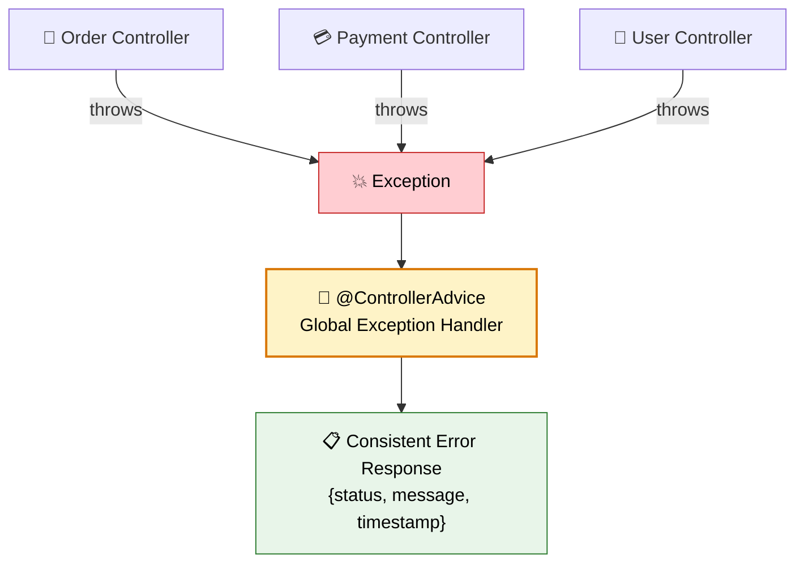
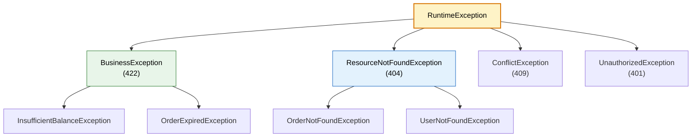

# 🚨 Global Exception Handling

> **Handle errors gracefully across your entire application — return consistent, meaningful error responses to clients.**

---

!!! abstract "Real-World Analogy"
    Think of a **hospital emergency room**. No matter what goes wrong — broken arm, allergic reaction, heart attack — you go to ONE place (ER) that triages and handles it appropriately. Without the ER, each department would handle emergencies differently (chaos!). `@ControllerAdvice` is your application's ER — one centralized place to handle all exceptions consistently.



---

## 🏗️ The Problem: Without Global Handling

```java
// ❌ BAD: Try-catch in every controller method
@GetMapping("/{id}")
public ResponseEntity<?> getOrder(@PathVariable Long id) {
    try {
        Order order = orderService.findById(id);
        return ResponseEntity.ok(order);
    } catch (OrderNotFoundException e) {
        return ResponseEntity.status(404).body("Order not found");
    } catch (Exception e) {
        return ResponseEntity.status(500).body("Something went wrong");
    }
}
```

Problems: duplicated error handling, inconsistent responses, cluttered controller code.

---

## ✅ The Solution: @ControllerAdvice

### Step 1: Define Custom Exceptions

```java
public class ResourceNotFoundException extends RuntimeException {
    private final String resourceName;
    private final String fieldName;
    private final Object fieldValue;

    public ResourceNotFoundException(String resourceName, String fieldName, Object fieldValue) {
        super(String.format("%s not found with %s: '%s'", resourceName, fieldName, fieldValue));
        this.resourceName = resourceName;
        this.fieldName = fieldName;
        this.fieldValue = fieldValue;
    }
}

public class BusinessException extends RuntimeException {
    private final String errorCode;

    public BusinessException(String errorCode, String message) {
        super(message);
        this.errorCode = errorCode;
    }
}
```

### Step 2: Define Error Response DTO

```java
public record ErrorResponse(
    int status,
    String error,
    String message,
    String path,
    LocalDateTime timestamp,
    Map<String, String> validationErrors
) {
    public ErrorResponse(int status, String error, String message, String path) {
        this(status, error, message, path, LocalDateTime.now(), null);
    }
}
```

### Step 3: Create Global Exception Handler

```java
@RestControllerAdvice
@Slf4j
public class GlobalExceptionHandler {

    @ExceptionHandler(ResourceNotFoundException.class)
    @ResponseStatus(HttpStatus.NOT_FOUND)
    public ErrorResponse handleNotFound(ResourceNotFoundException ex, HttpServletRequest request) {
        log.warn("Resource not found: {}", ex.getMessage());
        return new ErrorResponse(404, "Not Found", ex.getMessage(), request.getRequestURI());
    }

    @ExceptionHandler(BusinessException.class)
    @ResponseStatus(HttpStatus.UNPROCESSABLE_ENTITY)
    public ErrorResponse handleBusinessError(BusinessException ex, HttpServletRequest request) {
        log.error("Business error: {}", ex.getMessage());
        return new ErrorResponse(422, "Business Error", ex.getMessage(), request.getRequestURI());
    }

    @ExceptionHandler(MethodArgumentNotValidException.class)
    @ResponseStatus(HttpStatus.BAD_REQUEST)
    public ErrorResponse handleValidation(MethodArgumentNotValidException ex, HttpServletRequest request) {
        Map<String, String> errors = new HashMap<>();
        ex.getBindingResult().getFieldErrors()
            .forEach(err -> errors.put(err.getField(), err.getDefaultMessage()));

        return new ErrorResponse(400, "Validation Failed", "Invalid request body",
            request.getRequestURI(), LocalDateTime.now(), errors);
    }

    @ExceptionHandler(Exception.class)
    @ResponseStatus(HttpStatus.INTERNAL_SERVER_ERROR)
    public ErrorResponse handleGeneral(Exception ex, HttpServletRequest request) {
        log.error("Unexpected error", ex);
        return new ErrorResponse(500, "Internal Server Error",
            "An unexpected error occurred", request.getRequestURI());
    }
}
```

---

## 📋 Consistent Error Response

Every error from your API now looks like:

```json
{
    "status": 404,
    "error": "Not Found",
    "message": "Order not found with id: '42'",
    "path": "/api/orders/42",
    "timestamp": "2024-01-15T10:30:00",
    "validationErrors": null
}
```

Validation errors include field-level details:

```json
{
    "status": 400,
    "error": "Validation Failed",
    "message": "Invalid request body",
    "path": "/api/orders",
    "timestamp": "2024-01-15T10:30:00",
    "validationErrors": {
        "email": "must be a valid email",
        "amount": "must be greater than 0"
    }
}
```

---

## 🔗 Problem Details (RFC 7807) — Spring Boot 3

Spring Boot 3 has built-in support for the RFC 7807 standard error format:

```yaml
spring:
  mvc:
    problemdetails:
      enabled: true
```

```java
@RestControllerAdvice
public class GlobalExceptionHandler extends ResponseEntityExceptionHandler {

    @ExceptionHandler(ResourceNotFoundException.class)
    public ProblemDetail handleNotFound(ResourceNotFoundException ex) {
        ProblemDetail problem = ProblemDetail.forStatusAndDetail(
            HttpStatus.NOT_FOUND, ex.getMessage());
        problem.setTitle("Resource Not Found");
        problem.setProperty("resourceName", ex.getResourceName());
        problem.setProperty("timestamp", Instant.now());
        return problem;
    }
}
```

Response:
```json
{
    "type": "about:blank",
    "title": "Resource Not Found",
    "status": 404,
    "detail": "Order not found with id: '42'",
    "instance": "/api/orders/42",
    "resourceName": "Order",
    "timestamp": "2024-01-15T10:30:00Z"
}
```

---

## 🛡️ Validation with @Valid

```java
public record CreateOrderRequest(
    @NotBlank(message = "User ID is required")
    String userId,

    @NotEmpty(message = "At least one item is required")
    List<@Valid OrderItemRequest> items,

    @Positive(message = "Amount must be positive")
    BigDecimal amount,

    @Email(message = "Must be a valid email")
    String email
) {}

@PostMapping
public Order createOrder(@Valid @RequestBody CreateOrderRequest request) {
    return orderService.create(request);  // No try-catch needed!
}
```

Validation failures are automatically caught by the `MethodArgumentNotValidException` handler.

---

## 📐 Exception Hierarchy



!!! tip "Design Tip"
    Create a small hierarchy of base exceptions (`BusinessException`, `ResourceNotFoundException`, etc.) that map to HTTP status codes. Domain-specific exceptions extend these bases.

---

## 🎯 Interview Questions

??? question "1. What is @ControllerAdvice?"
    A Spring annotation that allows you to handle exceptions globally across all controllers in one place. Combined with `@ExceptionHandler`, it provides centralized error handling with consistent response format.

??? question "2. Difference between @ControllerAdvice and @RestControllerAdvice?"
    `@RestControllerAdvice` = `@ControllerAdvice` + `@ResponseBody`. Use `@RestControllerAdvice` for REST APIs (returns JSON), `@ControllerAdvice` for MVC apps (can return views).

??? question "3. How do you handle validation errors?"
    Use `@Valid` on request body parameters. When validation fails, Spring throws `MethodArgumentNotValidException`. Catch it in your global handler and extract field errors from `BindingResult` to return a detailed error response.

??? question "4. What is RFC 7807 Problem Details?"
    A standard format for HTTP error responses. Spring Boot 3 supports it natively via `ProblemDetail` class. It includes fields like `type`, `title`, `status`, `detail`, and `instance`, plus custom properties.

??? question "5. Should you catch checked or unchecked exceptions?"
    In modern Spring Boot, prefer **unchecked (RuntimeException)** for business errors. They don't pollute method signatures, work naturally with `@Transactional` rollback, and are cleanly caught by `@ExceptionHandler`. Reserve checked exceptions for truly recoverable scenarios.

