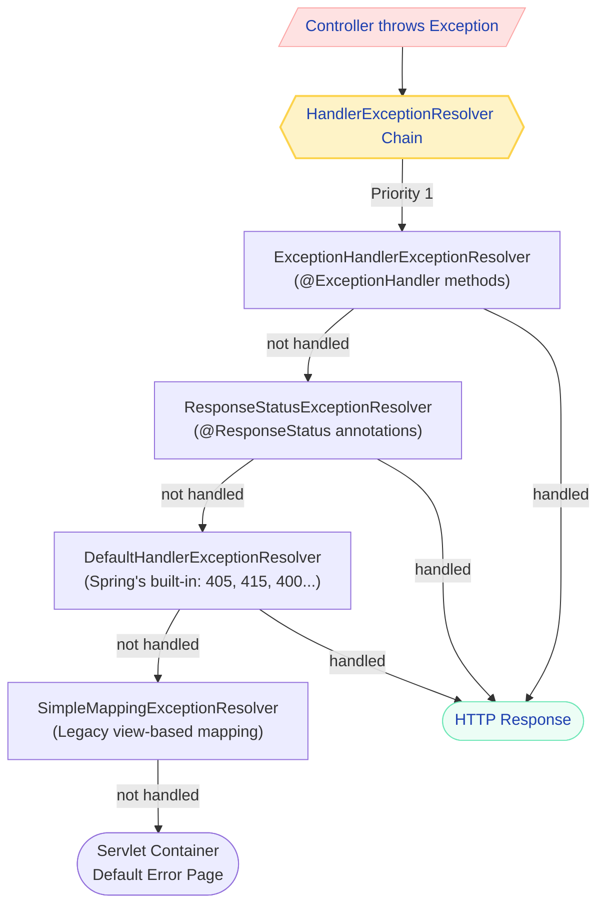
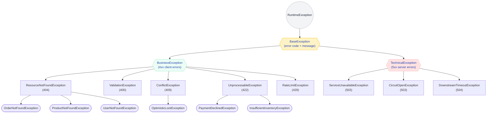
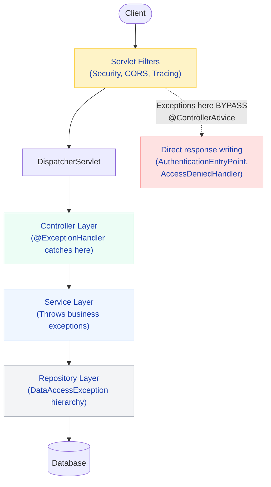

# Spring Boot Exception Handling — The Production Playbook

Exception handling is one of those things that separates a junior developer from a senior one. A junior catches `Exception` and returns 500. A senior designs an error taxonomy that tells the client exactly what went wrong, helps ops debug at 3 AM, and never leaks internal details. Let me show you the production way.

---

## How Spring Resolves Exceptions — The Full Picture

Before writing any code, you need to understand the machinery. When a controller throws an exception, Spring doesn't just "catch it." It walks through a chain of `HandlerExceptionResolver` implementations in a specific order. The first one that handles the exception wins.



| Resolver | What It Does | When It Fires |
|----------|-------------|---------------|
| `ExceptionHandlerExceptionResolver` | Invokes `@ExceptionHandler` methods in controllers and `@ControllerAdvice` classes | You defined a handler for this exception type |
| `ResponseStatusExceptionResolver` | Reads `@ResponseStatus` on the exception class | Exception is annotated with `@ResponseStatus` |
| `DefaultHandlerExceptionResolver` | Handles standard Spring MVC exceptions (type mismatch, method not supported, etc.) | Spring's own framework exceptions |
| `SimpleMappingExceptionResolver` | Maps exception class names to view names | Legacy apps using server-side rendering |

!!! tip "One-liner for interviews"
    "Spring uses a chain of HandlerExceptionResolvers. The ExceptionHandlerExceptionResolver runs first and checks for @ExceptionHandler methods. If none match, it falls through to @ResponseStatus, then Spring's default handling, then the servlet container."

!!! question "Counter-question: What happens if NO resolver handles the exception?"
    It propagates to the servlet container, which renders its default error page (the ugly Whitelabel Error Page in Spring Boot). This is why you always want a catch-all `@ExceptionHandler(Exception.class)` in your `@ControllerAdvice`.

---

## Building a Production Exception Hierarchy

The exception hierarchy is the foundation of your error strategy. Get this wrong, and you'll be fighting your error handling for the life of the project. Get it right, and a single handler covers entire families of errors.

### Design Principles

1. **One base class per HTTP status family** — All "not found" errors share a common ancestor
2. **Error codes are machine-readable** — `ORDER_NOT_FOUND`, not `"Order not found"`
3. **Messages are human-readable** — For logs and debugging, not for end users
4. **Never extend checked exceptions** — Unchecked works with `@Transactional` rollback and `@ExceptionHandler`



!!! example "Interview Tip"
    "I design exception hierarchies so that a single @ExceptionHandler for the base type covers the entire subtree. BusinessException maps to 4xx, TechnicalException to 5xx. Each concrete exception carries an error code for programmatic handling and a message for debugging."

### The Implementation

=== "Base Exception"

    ```java
    public abstract class BaseException extends RuntimeException {
        private final String errorCode;
        private final HttpStatus httpStatus;
    
        protected BaseException(String errorCode, HttpStatus httpStatus, String message) {
            super(message);
            this.errorCode = errorCode;
            this.httpStatus = httpStatus;
        }
    
        protected BaseException(String errorCode, HttpStatus httpStatus, 
                                String message, Throwable cause) {
            super(message, cause);
            this.errorCode = errorCode;
            this.httpStatus = httpStatus;
        }
    
        public String getErrorCode() { return errorCode; }
        public HttpStatus getHttpStatus() { return httpStatus; }
    }
    ```

=== "Business Exceptions (4xx)"

    ```java
    public abstract class BusinessException extends BaseException {
        protected BusinessException(String errorCode, HttpStatus httpStatus, String message) {
            super(errorCode, httpStatus, message);
        }
    }
    
    // --- 404 Family ---
    public class ResourceNotFoundException extends BusinessException {
        private final String resourceType;
        private final String identifier;
    
        public ResourceNotFoundException(String resourceType, String field, Object value) {
            super("RESOURCE_NOT_FOUND", HttpStatus.NOT_FOUND,
                  String.format("%s not found with %s: '%s'", resourceType, field, value));
            this.resourceType = resourceType;
            this.identifier = String.valueOf(value);
        }
    
        public String getResourceType() { return resourceType; }
        public String getIdentifier() { return identifier; }
    }
    
    public class OrderNotFoundException extends ResourceNotFoundException {
        public OrderNotFoundException(Long orderId) {
            super("Order", "id", orderId);
        }
    }
    
    public class ProductNotFoundException extends ResourceNotFoundException {
        public ProductNotFoundException(String sku) {
            super("Product", "sku", sku);
        }
    }
    
    // --- 409 Conflict ---
    public class ConflictException extends BusinessException {
        public ConflictException(String errorCode, String message) {
            super(errorCode, HttpStatus.CONFLICT, message);
        }
    }
    
    public class InsufficientInventoryException extends ConflictException {
        public InsufficientInventoryException(String sku, int requested, int available) {
            super("INSUFFICIENT_INVENTORY",
                  String.format("Product %s: requested %d, available %d", 
                                sku, requested, available));
        }
    }
    
    // --- 422 Unprocessable ---
    public class PaymentDeclinedException extends BusinessException {
        private final String declineReason;
    
        public PaymentDeclinedException(String orderId, String reason) {
            super("PAYMENT_DECLINED", HttpStatus.UNPROCESSABLE_ENTITY,
                  String.format("Payment declined for order %s: %s", orderId, reason));
            this.declineReason = reason;
        }
    
        public String getDeclineReason() { return declineReason; }
    }
    
    // --- 429 Rate Limit ---
    public class RateLimitExceededException extends BusinessException {
        private final int retryAfterSeconds;
    
        public RateLimitExceededException(String clientId, int retryAfter) {
            super("RATE_LIMIT_EXCEEDED", HttpStatus.TOO_MANY_REQUESTS,
                  String.format("Rate limit exceeded for client %s", clientId));
            this.retryAfterSeconds = retryAfter;
        }
    
        public int getRetryAfterSeconds() { return retryAfterSeconds; }
    }
    ```

=== "Technical Exceptions (5xx)"

    ```java
    public abstract class TechnicalException extends BaseException {
        protected TechnicalException(String errorCode, HttpStatus httpStatus, 
                                     String message, Throwable cause) {
            super(errorCode, httpStatus, message, cause);
        }
    }
    
    public class ServiceUnavailableException extends TechnicalException {
        public ServiceUnavailableException(String serviceName, Throwable cause) {
            super("SERVICE_UNAVAILABLE", HttpStatus.SERVICE_UNAVAILABLE,
                  String.format("Downstream service unavailable: %s", serviceName), cause);
        }
    }
    
    public class CircuitOpenException extends TechnicalException {
        public CircuitOpenException(String serviceName) {
            super("CIRCUIT_OPEN", HttpStatus.SERVICE_UNAVAILABLE,
                  String.format("Circuit breaker open for service: %s", serviceName), null);
        }
    }
    
    public class DownstreamTimeoutException extends TechnicalException {
        public DownstreamTimeoutException(String serviceName, Duration timeout) {
            super("DOWNSTREAM_TIMEOUT", HttpStatus.GATEWAY_TIMEOUT,
                  String.format("Timeout calling %s after %dms", 
                                serviceName, timeout.toMillis()), null);
        }
    }
    ```

!!! danger "What breaks if you skip the hierarchy"
    Without a hierarchy, you end up with one `@ExceptionHandler` per concrete exception. A real e-commerce platform has 30-50 exception types. That's 30-50 handler methods, most doing the exact same thing (extract status, build response). With a hierarchy, you need 3-4 handlers that cover everything.

---

## @ExceptionHandler Deep Dive

`@ExceptionHandler` is the method-level annotation that tells Spring "this method handles exceptions of type X." It can live in two places: on a controller (local) or in a `@ControllerAdvice` (global).

### What It Does

When an exception is thrown from a controller method, Spring checks:

1. Does this controller have an `@ExceptionHandler` for this exception type? Use it.
2. Does any `@ControllerAdvice` have one? Use the most specific match.

### Method-Level vs Class-Level

=== "Controller-Level (Local)"

    ```java
    @RestController
    @RequestMapping("/api/orders")
    public class OrderController {
    
        @GetMapping("/{id}")
        public Order getOrder(@PathVariable Long id) {
            return orderService.findById(id)
                .orElseThrow(() -> new OrderNotFoundException(id));
        }
    
        // Only handles exceptions from THIS controller
        @ExceptionHandler(OrderNotFoundException.class)
        public ResponseEntity<ApiError> handleOrderNotFound(OrderNotFoundException ex,
                                                            HttpServletRequest request) {
            ApiError error = ApiError.of(404, "Not Found", ex.getErrorCode(),
                                         ex.getMessage(), request.getRequestURI());
            return ResponseEntity.status(404).body(error);
        }
    }
    ```

=== "ControllerAdvice-Level (Global)"

    ```java
    @RestControllerAdvice
    public class GlobalExceptionHandler {
    
        // Handles this exception from ANY controller
        @ExceptionHandler(ResourceNotFoundException.class)
        public ResponseEntity<ApiError> handleNotFound(ResourceNotFoundException ex,
                                                       HttpServletRequest request) {
            ApiError error = ApiError.of(404, "Not Found", ex.getErrorCode(),
                                         ex.getMessage(), request.getRequestURI());
            return ResponseEntity.status(404).body(error);
        }
    }
    ```

### Parameters It Can Accept

| Parameter Type | What You Get |
|---------------|-------------|
| The exception itself | `OrderNotFoundException ex` |
| `HttpServletRequest` | Full request details (URI, method, headers, params) |
| `WebRequest` | Spring's abstraction over the request |
| `HttpHeaders` | Request headers |
| `Locale` | Client locale (for message localization) |
| `Model` | For adding attributes (MVC view rendering) |
| `HttpServletResponse` | Direct response manipulation |

### Return Types It Supports

| Return Type | Behavior |
|-------------|----------|
| `ResponseEntity<T>` | Full control over status, headers, body |
| `ProblemDetail` | RFC 7807 response (Spring 6+) |
| Any object | Serialized with `@ResponseBody` (in `@RestControllerAdvice`) |
| `void` | You write directly to response |
| `Map<String, Object>` | Quick and dirty (don't do this in production) |

### Matching Rules

Spring uses **most specific exception type wins**:

```java
@RestControllerAdvice
public class GlobalExceptionHandler {

    @ExceptionHandler(OrderNotFoundException.class)  // Most specific — wins for OrderNotFoundException
    public ResponseEntity<ApiError> handleOrderNotFound(OrderNotFoundException ex) { ... }

    @ExceptionHandler(ResourceNotFoundException.class)  // Wins for ProductNotFoundException, UserNotFoundException
    public ResponseEntity<ApiError> handleNotFound(ResourceNotFoundException ex) { ... }

    @ExceptionHandler(BusinessException.class)  // Wins for PaymentDeclinedException, RateLimitExceededException
    public ResponseEntity<ApiError> handleBusiness(BusinessException ex) { ... }

    @ExceptionHandler(Exception.class)  // Catch-all — NEVER leak stack traces here
    public ResponseEntity<ApiError> handleUnexpected(Exception ex) { ... }
}
```

!!! warning "Production War Story"
    A team had `@ExceptionHandler(Exception.class)` returning `ex.getMessage()`. In production, a database connection failure returned: `"Cannot acquire connection from HikariPool-1 (host=prod-db-03.internal, port=5432, database=orders)"`. An attacker now knows your database hostname, port, and schema name. Always return a generic message for 5xx.

---

## @ControllerAdvice — The Production Way

This is where 90% of your exception handling lives in a real application. One class, ordered handlers, consistent responses.

### @RestControllerAdvice vs @ControllerAdvice

| Annotation | Behavior |
|-----------|----------|
| `@ControllerAdvice` | Handler return values need `@ResponseBody` to serialize as JSON |
| `@RestControllerAdvice` | Automatically applies `@ResponseBody` — return value IS the response |

For REST APIs, always use `@RestControllerAdvice`. Period.

### Narrowing Scope

```java
// Only controllers in these packages
@RestControllerAdvice(basePackages = "com.myshop.orders")
public class OrderExceptionHandler { ... }

// Only these specific controller classes
@RestControllerAdvice(assignableTypes = {OrderController.class, PaymentController.class})
public class PaymentExceptionHandler { ... }

// Only controllers annotated with @AdminApi
@RestControllerAdvice(annotations = AdminApi.class)
public class AdminExceptionHandler { ... }
```

### Ordering Multiple @ControllerAdvice Classes

```java
@RestControllerAdvice(basePackages = "com.myshop.payments")
@Order(1)  // Highest priority — handles payment-specific exceptions first
public class PaymentExceptionHandler { ... }

@RestControllerAdvice
@Order(Ordered.LOWEST_PRECEDENCE)  // Catch-all — handles everything else
public class GlobalExceptionHandler { ... }
```

!!! danger "What breaks without @Order"
    Without explicit ordering, Spring picks an arbitrary order. You might have a specific `PaymentDeclinedException` handler in one class and a generic `BusinessException` handler in another. If the generic one gets priority, your specific handler never fires, and you return a generic 422 instead of including payment-specific details like the decline reason.

### Complete Production Implementation

This is the handler you copy into every new microservice on day one:

```java
@RestControllerAdvice
@Slf4j
@Order(Ordered.LOWEST_PRECEDENCE)
public class GlobalExceptionHandler extends ResponseEntityExceptionHandler {

    // ═══════════════════════════════════════════════════════════════
    // 404 — Resource Not Found
    // ═══════════════════════════════════════════════════════════════
    @ExceptionHandler(ResourceNotFoundException.class)
    public ResponseEntity<ApiError> handleNotFound(
            ResourceNotFoundException ex, HttpServletRequest request) {
        
        String traceId = MDC.get("traceId");
        log.warn("[{}] Resource not found: {} | path={}", 
                 traceId, ex.getMessage(), request.getRequestURI());

        ApiError error = ApiError.builder()
            .status(404)
            .error("Not Found")
            .errorCode(ex.getErrorCode())
            .message(ex.getMessage())
            .path(request.getRequestURI())
            .traceId(traceId)
            .build();

        return ResponseEntity.status(404).body(error);
    }

    // ═══════════════════════════════════════════════════════════════
    // 409 — Conflict (optimistic locking, inventory, duplicate)
    // ═══════════════════════════════════════════════════════════════
    @ExceptionHandler(ConflictException.class)
    public ResponseEntity<ApiError> handleConflict(
            ConflictException ex, HttpServletRequest request) {
        
        String traceId = MDC.get("traceId");
        log.warn("[{}] Conflict: code={}, message={} | path={}",
                 traceId, ex.getErrorCode(), ex.getMessage(), request.getRequestURI());

        ApiError error = ApiError.builder()
            .status(409)
            .error("Conflict")
            .errorCode(ex.getErrorCode())
            .message(ex.getMessage())
            .path(request.getRequestURI())
            .traceId(traceId)
            .build();

        return ResponseEntity.status(409).body(error);
    }

    // ═══════════════════════════════════════════════════════════════
    // 422 — Business rule violation
    // ═══════════════════════════════════════════════════════════════
    @ExceptionHandler(BusinessException.class)
    public ResponseEntity<ApiError> handleBusinessError(
            BusinessException ex, HttpServletRequest request) {
        
        String traceId = MDC.get("traceId");
        log.warn("[{}] Business error: code={}, message={} | path={} | method={}",
                 traceId, ex.getErrorCode(), ex.getMessage(),
                 request.getRequestURI(), request.getMethod());

        HttpStatus status = ex.getHttpStatus();
        ApiError error = ApiError.builder()
            .status(status.value())
            .error(status.getReasonPhrase())
            .errorCode(ex.getErrorCode())
            .message(ex.getMessage())
            .path(request.getRequestURI())
            .traceId(traceId)
            .build();

        HttpHeaders headers = new HttpHeaders();
        if (ex instanceof RateLimitExceededException rle) {
            headers.add("Retry-After", String.valueOf(rle.getRetryAfterSeconds()));
        }

        return ResponseEntity.status(status).headers(headers).body(error);
    }

    // ═══════════════════════════════════════════════════════════════
    // 400 — Validation errors (@Valid / @Validated)
    // ═══════════════════════════════════════════════════════════════
    @Override
    protected ResponseEntity<Object> handleMethodArgumentNotValid(
            MethodArgumentNotValidException ex,
            HttpHeaders headers, HttpStatusCode status, WebRequest request) {
        
        String traceId = MDC.get("traceId");
        String path = ((ServletWebRequest) request).getRequest().getRequestURI();

        List<ApiError.FieldError> fieldErrors = ex.getBindingResult()
            .getFieldErrors().stream()
            .map(fe -> new ApiError.FieldError(
                fe.getField(), fe.getDefaultMessage(), fe.getRejectedValue()))
            .toList();

        log.warn("[{}] Validation failed: {} field errors | path={}",
                 traceId, fieldErrors.size(), path);

        ApiError error = ApiError.builder()
            .status(400)
            .error("Bad Request")
            .errorCode("VALIDATION_FAILED")
            .message("Request validation failed")
            .path(path)
            .traceId(traceId)
            .fieldErrors(fieldErrors)
            .build();

        return ResponseEntity.badRequest().body(error);
    }

    // ═══════════════════════════════════════════════════════════════
    // 400 — Constraint violations (path variables, request params)
    // ═══════════════════════════════════════════════════════════════
    @ExceptionHandler(ConstraintViolationException.class)
    public ResponseEntity<ApiError> handleConstraintViolation(
            ConstraintViolationException ex, HttpServletRequest request) {
        
        String traceId = MDC.get("traceId");
        
        List<ApiError.FieldError> fieldErrors = ex.getConstraintViolations().stream()
            .map(cv -> {
                String field = StreamSupport.stream(
                    cv.getPropertyPath().spliterator(), false)
                    .reduce((a, b) -> b)
                    .map(Object::toString)
                    .orElse("unknown");
                return new ApiError.FieldError(field, cv.getMessage(), cv.getInvalidValue());
            })
            .toList();

        log.warn("[{}] Constraint violation: {} violations | path={}",
                 traceId, fieldErrors.size(), request.getRequestURI());

        ApiError error = ApiError.builder()
            .status(400)
            .error("Bad Request")
            .errorCode("CONSTRAINT_VIOLATION")
            .message("Request parameter validation failed")
            .path(request.getRequestURI())
            .traceId(traceId)
            .fieldErrors(fieldErrors)
            .build();

        return ResponseEntity.badRequest().body(error);
    }

    // ═══════════════════════════════════════════════════════════════
    // 401 — Authentication required
    // ═══════════════════════════════════════════════════════════════
    @ExceptionHandler(AuthenticationException.class)
    public ResponseEntity<ApiError> handleAuthentication(
            AuthenticationException ex, HttpServletRequest request) {
        
        String traceId = MDC.get("traceId");
        log.warn("[{}] Authentication failed | path={} | method={}",
                 traceId, request.getRequestURI(), request.getMethod());

        ApiError error = ApiError.builder()
            .status(401)
            .error("Unauthorized")
            .errorCode("AUTHENTICATION_REQUIRED")
            .message("Authentication is required to access this resource")
            .path(request.getRequestURI())
            .traceId(traceId)
            .build();

        return ResponseEntity.status(401).body(error);
    }

    // ═══════════════════════════════════════════════════════════════
    // 403 — Access denied
    // ═══════════════════════════════════════════════════════════════
    @ExceptionHandler(AccessDeniedException.class)
    public ResponseEntity<ApiError> handleAccessDenied(
            AccessDeniedException ex, HttpServletRequest request) {
        
        String traceId = MDC.get("traceId");
        log.warn("[{}] Access denied | path={} | method={} | user={}",
                 traceId, request.getRequestURI(), request.getMethod(),
                 request.getUserPrincipal() != null ? 
                     request.getUserPrincipal().getName() : "anonymous");

        ApiError error = ApiError.builder()
            .status(403)
            .error("Forbidden")
            .errorCode("ACCESS_DENIED")
            .message("You do not have permission to access this resource")
            .path(request.getRequestURI())
            .traceId(traceId)
            .build();

        return ResponseEntity.status(403).body(error);
    }

    // ═══════════════════════════════════════════════════════════════
    // 5xx — Technical exceptions (downstream failures)
    // ═══════════════════════════════════════════════════════════════
    @ExceptionHandler(TechnicalException.class)
    public ResponseEntity<ApiError> handleTechnicalError(
            TechnicalException ex, HttpServletRequest request) {
        
        String traceId = MDC.get("traceId");
        log.error("[{}] Technical error: code={} | path={} | method={}",
                  traceId, ex.getErrorCode(), request.getRequestURI(),
                  request.getMethod(), ex);  // Full stack trace for 5xx

        HttpStatus status = ex.getHttpStatus();
        ApiError error = ApiError.builder()
            .status(status.value())
            .error(status.getReasonPhrase())
            .errorCode(ex.getErrorCode())
            .message("A downstream service error occurred. Please retry.")
            .path(request.getRequestURI())
            .traceId(traceId)
            .build();

        return ResponseEntity.status(status).body(error);
    }

    // ═══════════════════════════════════════════════════════════════
    // 500 — Catch-all (NEVER leak internals)
    // ═══════════════════════════════════════════════════════════════
    @ExceptionHandler(Exception.class)
    public ResponseEntity<ApiError> handleUnexpected(
            Exception ex, HttpServletRequest request) {
        
        String traceId = MDC.get("traceId");
        log.error("[{}] Unexpected error | path={} | method={} | query={}",
                  traceId, request.getRequestURI(), request.getMethod(),
                  request.getQueryString(), ex);  // FULL stack trace in logs

        ApiError error = ApiError.builder()
            .status(500)
            .error("Internal Server Error")
            .errorCode("INTERNAL_ERROR")
            .message("An unexpected error occurred. Please contact support with traceId: " + traceId)
            .path(request.getRequestURI())
            .traceId(traceId)
            .build();

        return ResponseEntity.status(500).body(error);
    }
}
```

---

## The Error Response DTO

Every error from your API should follow the same structure. Clients write ONE error handler. Ops dashboards parse ONE format.

```java
@Builder
public record ApiError(
    int status,
    String error,
    String errorCode,
    String message,
    String path,
    String traceId,
    @Builder.Default Instant timestamp = Instant.now(),
    @JsonInclude(JsonInclude.Include.NON_NULL) List<FieldError> fieldErrors
) {
    public record FieldError(String field, String message, Object rejectedValue) {}
}
```

### Sample Responses

=== "404 — Order Not Found"

    ```json
    {
        "status": 404,
        "error": "Not Found",
        "errorCode": "RESOURCE_NOT_FOUND",
        "message": "Order not found with id: '42'",
        "path": "/api/orders/42",
        "traceId": "a1b2c3d4-e5f6-7890-abcd-ef1234567890",
        "timestamp": "2024-01-15T10:30:00.123Z"
    }
    ```

=== "400 — Validation Errors"

    ```json
    {
        "status": 400,
        "error": "Bad Request",
        "errorCode": "VALIDATION_FAILED",
        "message": "Request validation failed",
        "path": "/api/orders",
        "traceId": "x1y2z3w4-a5b6-7890-cdef-123456789abc",
        "timestamp": "2024-01-15T10:30:00.456Z",
        "fieldErrors": [
            { "field": "email", "message": "must be a valid email", "rejectedValue": "not-an-email" },
            { "field": "items[0].quantity", "message": "must be at least 1", "rejectedValue": 0 },
            { "field": "shippingAddress.zipCode", "message": "must not be blank", "rejectedValue": null }
        ]
    }
    ```

=== "409 — Inventory Conflict"

    ```json
    {
        "status": 409,
        "error": "Conflict",
        "errorCode": "INSUFFICIENT_INVENTORY",
        "message": "Product SKU-12345: requested 10, available 3",
        "path": "/api/orders",
        "traceId": "inv-conflict-trace-001",
        "timestamp": "2024-01-15T10:30:00.789Z"
    }
    ```

=== "422 — Payment Declined"

    ```json
    {
        "status": 422,
        "error": "Unprocessable Entity",
        "errorCode": "PAYMENT_DECLINED",
        "message": "Payment declined for order ORD-1001: card_expired",
        "path": "/api/orders/ORD-1001/pay",
        "traceId": "pay-decline-trace-002",
        "timestamp": "2024-01-15T10:30:01.000Z"
    }
    ```

=== "500 — Unexpected (safe)"

    ```json
    {
        "status": 500,
        "error": "Internal Server Error",
        "errorCode": "INTERNAL_ERROR",
        "message": "An unexpected error occurred. Please contact support with traceId: err-500-trace-003",
        "path": "/api/orders",
        "traceId": "err-500-trace-003",
        "timestamp": "2024-01-15T10:30:01.234Z"
    }
    ```

---

## RFC 7807 Problem Details (Spring 6+)

RFC 7807 defines a standardized error response format that any HTTP client can understand without reading your API docs. Spring 6 / Boot 3 has first-class support via the `ProblemDetail` class.

### What It Is

A machine-readable error format with standardized fields:

| Field | Type | Purpose |
|-------|------|---------|
| `type` | URI | A reference that identifies the error type (link to docs) |
| `title` | String | Short human-readable summary |
| `status` | Integer | HTTP status code |
| `detail` | String | Longer human-readable explanation |
| `instance` | URI | Identifies this specific occurrence (request path) |
| Extension fields | Any | Your custom properties (traceId, errorCode, etc.) |

### Enable It

```yaml
spring:
  mvc:
    problemdetails:
      enabled: true  # All ResponseEntityExceptionHandler methods now return ProblemDetail
```

### Implementation with Custom Extensions

```java
@RestControllerAdvice
public class ProblemDetailExceptionHandler extends ResponseEntityExceptionHandler {

    @ExceptionHandler(OrderNotFoundException.class)
    public ProblemDetail handleOrderNotFound(OrderNotFoundException ex,
                                             HttpServletRequest request) {
        ProblemDetail problem = ProblemDetail.forStatusAndDetail(
            HttpStatus.NOT_FOUND, ex.getMessage());
        
        problem.setTitle("Order Not Found");
        problem.setType(URI.create("https://api.myshop.com/errors/order-not-found"));
        problem.setInstance(URI.create(request.getRequestURI()));
        
        // Extension properties — anything you need
        problem.setProperty("errorCode", ex.getErrorCode());
        problem.setProperty("traceId", MDC.get("traceId"));
        problem.setProperty("timestamp", Instant.now());
        problem.setProperty("resourceType", ex.getResourceType());
        
        return problem;
    }

    @ExceptionHandler(PaymentDeclinedException.class)
    public ProblemDetail handlePaymentDeclined(PaymentDeclinedException ex,
                                               HttpServletRequest request) {
        ProblemDetail problem = ProblemDetail.forStatusAndDetail(
            HttpStatus.UNPROCESSABLE_ENTITY, ex.getMessage());
        
        problem.setTitle("Payment Declined");
        problem.setType(URI.create("https://api.myshop.com/errors/payment-declined"));
        problem.setInstance(URI.create(request.getRequestURI()));
        problem.setProperty("errorCode", ex.getErrorCode());
        problem.setProperty("declineReason", ex.getDeclineReason());
        problem.setProperty("traceId", MDC.get("traceId"));
        
        return problem;
    }
}
```

### Response Format

Content-Type: `application/problem+json`

```json
{
    "type": "https://api.myshop.com/errors/order-not-found",
    "title": "Order Not Found",
    "status": 404,
    "detail": "Order not found with id: '42'",
    "instance": "/api/orders/42",
    "errorCode": "RESOURCE_NOT_FOUND",
    "traceId": "abc123def456",
    "timestamp": "2024-01-15T10:30:00Z",
    "resourceType": "Order"
}
```

!!! tip "One-liner for interviews"
    "RFC 7807 is a standardized error format with type, title, status, detail, and instance fields. Spring 6 supports it natively via ProblemDetail. It lets clients handle errors programmatically without parsing custom error structures."

### When to Use ProblemDetail vs Custom DTO

| Use Case | Choose |
|----------|--------|
| Public API consumed by external teams | ProblemDetail — it's a standard |
| Internal microservice communication | Either — but ProblemDetail is still great |
| Need nested structures (fieldErrors array) | Custom DTO — ProblemDetail extensions are flat |
| Legacy API with existing error contract | Custom DTO — don't break existing clients |
| Greenfield Spring 6+ project | ProblemDetail — embrace the standard |

---

## Validation Error Handling

Validation is the most common source of 400 errors. Spring gives you two mechanisms, and they throw different exceptions.

### @Valid on Request Bodies — MethodArgumentNotValidException

```java
public record CreateOrderRequest(
    @NotBlank(message = "Customer ID is required")
    String customerId,

    @NotEmpty(message = "At least one item is required")
    List<@Valid OrderItemRequest> items,  // @Valid triggers nested validation

    @Positive(message = "Amount must be positive")
    BigDecimal amount,

    @Email(message = "Must be a valid email")
    String contactEmail,

    @Valid  // Nested object validation
    @NotNull(message = "Shipping address is required")
    AddressRequest shippingAddress
) {}

public record OrderItemRequest(
    @NotBlank(message = "SKU is required")
    String sku,

    @Min(value = 1, message = "Quantity must be at least 1")
    @Max(value = 100, message = "Quantity cannot exceed 100")
    int quantity
) {}

public record AddressRequest(
    @NotBlank(message = "Street is required") String street,
    @NotBlank(message = "City is required") String city,
    @NotBlank(message = "Zip code is required") String zipCode,
    @Size(min = 2, max = 2, message = "Country code must be 2 characters") String countryCode
) {}
```

```java
@PostMapping("/orders")
public ResponseEntity<Order> createOrder(@Valid @RequestBody CreateOrderRequest request) {
    // If we get here, validation passed. No try-catch needed.
    Order order = orderService.create(request);
    return ResponseEntity.status(201).body(order);
}
```

Nested validation errors come back with dot-notation paths: `shippingAddress.zipCode`, `items[0].quantity`.

### @Validated on Path Variables / Request Params — ConstraintViolationException

```java
@RestController
@RequestMapping("/api/orders")
@Validated  // Required at class level for method parameter validation
public class OrderController {

    @GetMapping("/{id}")
    public Order getOrder(@PathVariable @Min(1) Long id) { ... }

    @GetMapping
    public Page<Order> listOrders(
            @RequestParam @Min(0) int page,
            @RequestParam @Min(1) @Max(100) int size) { ... }
}
```

This throws `ConstraintViolationException`, NOT `MethodArgumentNotValidException`. You need a separate handler (shown in the production handler above).

!!! question "Counter-question: Why does @Valid on path variables throw a different exception?"
    Because `@Valid` on `@RequestBody` goes through the `RequestResponseBodyMethodProcessor` which catches `BindException` and wraps it as `MethodArgumentNotValidException`. Path variables and request params go through `MethodValidationInterceptor` which throws `ConstraintViolationException` directly from Hibernate Validator. They're two completely different validation entry points.

---

## Exception Handling in Different Layers

Different layers of your application have different exception handling responsibilities. Getting this wrong leads to swallowed errors, leaked abstractions, or useless stack traces.



### Controller Layer

**Responsibility:** Delegate to services, let exceptions propagate to `@ControllerAdvice`.

```java
@RestController
@RequestMapping("/api/orders")
public class OrderController {

    @PostMapping
    public ResponseEntity<OrderResponse> createOrder(@Valid @RequestBody CreateOrderRequest request) {
        // Clean controller — no try-catch. Exceptions propagate to global handler.
        OrderResponse response = orderService.createOrder(request);
        return ResponseEntity.status(HttpStatus.CREATED).body(response);
    }
}
```

### Service Layer

**Responsibility:** Throw meaningful business exceptions. NEVER catch and return null. NEVER catch and log without re-throwing.

```java
@Service
@Transactional
public class OrderService {

    public OrderResponse createOrder(CreateOrderRequest request) {
        // Throw specific, meaningful exceptions
        Customer customer = customerRepository.findById(request.customerId())
            .orElseThrow(() -> new ResourceNotFoundException("Customer", "id", request.customerId()));

        for (OrderItemRequest item : request.items()) {
            int available = inventoryService.getAvailable(item.sku());
            if (available < item.quantity()) {
                throw new InsufficientInventoryException(item.sku(), item.quantity(), available);
            }
        }

        Order order = buildOrder(request);
        
        try {
            paymentService.charge(order);
        } catch (PaymentGatewayException ex) {
            // Translate external exception to YOUR domain exception
            throw new PaymentDeclinedException(order.getId(), ex.getDeclineCode());
        }

        return toResponse(orderRepository.save(order));
    }
}
```

!!! danger "What breaks: Catching and returning null"
    ```java
    // NEVER DO THIS
    public Order findOrder(Long id) {
        try {
            return orderRepository.findById(id).orElse(null);  // Caller gets NPE later
        } catch (Exception e) {
            log.error("Error finding order", e);
            return null;  // Swallowed! Caller has no idea why it's null.
        }
    }
    ```

### Repository Layer

**Responsibility:** Let Spring's `DataAccessException` hierarchy propagate. Translate where needed.

```java
@Repository
public class OrderRepositoryImpl {

    public Order updateWithOptimisticLock(Order order) {
        try {
            return jpaRepository.save(order);
        } catch (OptimisticLockingFailureException ex) {
            // Translate Spring's exception to YOUR domain exception
            throw new ConflictException("ORDER_CONCURRENT_MODIFICATION",
                "Order " + order.getId() + " was modified by another request");
        }
    }
}
```

### Filter Layer — Exceptions BEFORE DispatcherServlet

This is the critical one that trips everyone up. `@ControllerAdvice` ONLY catches exceptions thrown after the request reaches the `DispatcherServlet`. Exceptions in servlet filters bypass it entirely.

```java
@Component
@Order(Ordered.HIGHEST_PRECEDENCE)
public class ExceptionHandlerFilter extends OncePerRequestFilter {

    @Autowired
    @Qualifier("handlerExceptionResolver")
    private HandlerExceptionResolver resolver;

    @Override
    protected void doFilterInternal(HttpServletRequest request,
                                    HttpServletResponse response,
                                    FilterChain chain) throws ServletException, IOException {
        try {
            chain.doFilter(request, response);
        } catch (Exception ex) {
            // Delegates to @ControllerAdvice handlers — same error format everywhere
            resolver.resolveException(request, response, null, ex);
        }
    }
}
```

### Spring Security Exception Handling

Spring Security filters throw `AuthenticationException` and `AccessDeniedException` before reaching your controllers. You must handle them separately:

```java
@Component
public class CustomAuthenticationEntryPoint implements AuthenticationEntryPoint {

    private final ObjectMapper objectMapper;

    @Override
    public void commence(HttpServletRequest request, HttpServletResponse response,
                        AuthenticationException ex) throws IOException {
        response.setContentType(MediaType.APPLICATION_JSON_VALUE);
        response.setStatus(HttpStatus.UNAUTHORIZED.value());

        ApiError error = ApiError.builder()
            .status(401)
            .error("Unauthorized")
            .errorCode("AUTHENTICATION_REQUIRED")
            .message("Authentication is required")
            .path(request.getRequestURI())
            .traceId(MDC.get("traceId"))
            .build();

        objectMapper.writeValue(response.getOutputStream(), error);
    }
}

@Component
public class CustomAccessDeniedHandler implements AccessDeniedHandler {

    private final ObjectMapper objectMapper;

    @Override
    public void handle(HttpServletRequest request, HttpServletResponse response,
                      AccessDeniedException ex) throws IOException {
        response.setContentType(MediaType.APPLICATION_JSON_VALUE);
        response.setStatus(HttpStatus.FORBIDDEN.value());

        ApiError error = ApiError.builder()
            .status(403)
            .error("Forbidden")
            .errorCode("ACCESS_DENIED")
            .message("Insufficient permissions")
            .path(request.getRequestURI())
            .traceId(MDC.get("traceId"))
            .build();

        objectMapper.writeValue(response.getOutputStream(), error);
    }
}
```

Register in Security configuration:

```java
@Bean
public SecurityFilterChain filterChain(HttpSecurity http) throws Exception {
    return http
        .exceptionHandling(ex -> ex
            .authenticationEntryPoint(customAuthenticationEntryPoint)
            .accessDeniedHandler(customAccessDeniedHandler))
        .build();
}
```

!!! warning "Production War Story"
    A team forgot to configure `AuthenticationEntryPoint`. When a JWT token expired, Spring Security returned the default HTML login page (yes, even for a REST API). Their mobile app tried to parse HTML as JSON and crashed for every user whose token expired. Always configure Security's exception handling for APIs.

---

## Logging Strategy

The logging strategy is as important as the error response. Bad logging means 3 AM on-call is hell.

### The Rules

| HTTP Status | Log Level | What to Include | What to NEVER Include |
|-------------|-----------|-----------------|----------------------|
| 4xx | `WARN` | Message, path, traceId, error code | Stack trace (it's the client's fault) |
| 5xx | `ERROR` | Full stack trace, path, method, query params, traceId | Passwords, tokens, PII |
| Validation | `WARN` | Field count, path | Individual field values (could contain PII) |

### Correlation IDs

Every request gets a traceId. It appears in logs AND in the error response. When a user reports an error, they give you the traceId, and you grep the logs.

```java
@Component
public class TraceIdFilter extends OncePerRequestFilter {

    @Override
    protected void doFilterInternal(HttpServletRequest request,
                                    HttpServletResponse response,
                                    FilterChain chain) throws ServletException, IOException {
        String traceId = Optional.ofNullable(request.getHeader("X-Trace-Id"))
            .orElse(UUID.randomUUID().toString());
        
        MDC.put("traceId", traceId);
        response.setHeader("X-Trace-Id", traceId);
        
        try {
            chain.doFilter(request, response);
        } finally {
            MDC.clear();
        }
    }
}
```

### Structured Logging Pattern

```xml
<!-- logback-spring.xml -->
<pattern>
    {"timestamp":"%d","level":"%level","traceId":"%X{traceId}",
     "logger":"%logger","message":"%message","exception":"%exception"}
</pattern>
```

This produces log lines that your ELK/Splunk/Datadog can parse without custom grok patterns:

```json
{"timestamp":"2024-01-15T10:30:00","level":"ERROR","traceId":"abc-123",
 "logger":"c.m.GlobalExceptionHandler","message":"[abc-123] Unexpected error | path=/api/orders | method=POST",
 "exception":"java.lang.NullPointerException: ...full stack trace..."}
```

---

## @ResponseStatus Annotation

The simplest approach — annotate the exception class itself. No handler method needed.

```java
@ResponseStatus(value = HttpStatus.NOT_FOUND, reason = "Order not found")
public class OrderNotFoundException extends RuntimeException {
    public OrderNotFoundException(Long id) {
        super("Order not found: " + id);
    }
}
```

### When to Use It

| Use Case | Verdict |
|----------|---------|
| Quick prototyping | Yes |
| Simple apps with no custom error format | Yes |
| Production APIs that need consistent error responses | No — use `@ExceptionHandler` |
| When you need to include error codes, traceId, or field errors | No |

### How It Works Internally

1. `ResponseStatusExceptionResolver` checks if the exception class has `@ResponseStatus`
2. Reads the `value` (HTTP status) and `reason`
3. Calls `response.sendError(status, reason)` — which triggers the servlet container's error handling
4. Returns Spring Boot's default error body

!!! danger "What breaks"
    You cannot customize the response body. You get Spring's default format: `{"timestamp":"...","status":404,"error":"Not Found","message":"Order not found","path":"/api/orders/42"}`. If your API contract expects `errorCode` or `traceId`, this doesn't work.

### ResponseStatusException (programmatic alternative)

```java
@GetMapping("/{id}")
public Order getOrder(@PathVariable Long id) {
    return orderService.findById(id)
        .orElseThrow(() -> new ResponseStatusException(
            HttpStatus.NOT_FOUND, "Order " + id + " not found"));
}
```

This is better than `@ResponseStatus` on the class because you can set the message dynamically. But it still returns Spring's default format without custom fields.

---

## ResponseEntityExceptionHandler

Spring's base class for `@ControllerAdvice` that already handles 15+ standard Spring MVC exceptions. Extend it to avoid re-implementing handling for common framework exceptions.

### What It Handles

| Exception | Default Status | Triggered By |
|-----------|---------------|-------------|
| `MethodArgumentNotValidException` | 400 | `@Valid` fails on `@RequestBody` |
| `HttpRequestMethodNotSupportedException` | 405 | GET on a POST-only endpoint |
| `HttpMediaTypeNotSupportedException` | 415 | Sending XML to a JSON-only endpoint |
| `MissingServletRequestParameterException` | 400 | Missing required `@RequestParam` |
| `NoHandlerFoundException` | 404 | No controller mapping matches |
| `HttpMediaTypeNotAcceptableException` | 406 | Can't produce the requested content type |
| `MissingPathVariableException` | 500 | Missing path variable (rare) |
| `TypeMismatchException` | 400 | `"abc"` for an `@PathVariable Long` |
| `HttpMessageNotReadableException` | 400 | Malformed JSON body |

### Override to Customize

```java
@RestControllerAdvice
public class GlobalExceptionHandler extends ResponseEntityExceptionHandler {

    @Override
    protected ResponseEntity<Object> handleHttpRequestMethodNotSupported(
            HttpRequestMethodNotSupportedException ex,
            HttpHeaders headers, HttpStatusCode status, WebRequest request) {
        
        String path = ((ServletWebRequest) request).getRequest().getRequestURI();
        ApiError error = ApiError.builder()
            .status(405)
            .error("Method Not Allowed")
            .errorCode("METHOD_NOT_SUPPORTED")
            .message(ex.getMethod() + " is not supported. Supported: " + ex.getSupportedHttpMethods())
            .path(path)
            .traceId(MDC.get("traceId"))
            .build();

        return ResponseEntity.status(405).body(error);
    }

    @Override
    protected ResponseEntity<Object> handleHttpMessageNotReadable(
            HttpMessageNotReadableException ex,
            HttpHeaders headers, HttpStatusCode status, WebRequest request) {
        
        String path = ((ServletWebRequest) request).getRequest().getRequestURI();
        ApiError error = ApiError.builder()
            .status(400)
            .error("Bad Request")
            .errorCode("MALFORMED_REQUEST")
            .message("Request body is malformed or missing")
            .path(path)
            .traceId(MDC.get("traceId"))
            .build();

        return ResponseEntity.badRequest().body(error);
    }
}
```

!!! tip "One-liner for interviews"
    "ResponseEntityExceptionHandler is a base class that provides default handling for Spring MVC's standard exceptions. I extend it in my @ControllerAdvice so I only override the ones I need to customize, and the rest still get reasonable defaults."

---

## Async and Reactive Exception Handling

Exceptions in async and reactive code propagate differently. If you only know the synchronous model, you'll have blind spots.

### @Async Methods

`@ExceptionHandler` does NOT catch exceptions from `@Async` methods. They run in a different thread — the exception has nowhere to propagate.

```java
// This exception will NOT reach your @ControllerAdvice
@Async
public void processOrderAsync(Long orderId) {
    // If this throws, it's lost unless you handle it
    Order order = orderRepository.findById(orderId)
        .orElseThrow(() -> new OrderNotFoundException(orderId));
    // ...
}
```

**Solution 1:** Return `CompletableFuture` and handle in the caller:

```java
@Async
public CompletableFuture<OrderResult> processOrderAsync(Long orderId) {
    Order order = orderRepository.findById(orderId)
        .orElseThrow(() -> new OrderNotFoundException(orderId));
    return CompletableFuture.completedFuture(process(order));
}

// Caller
orderService.processOrderAsync(id)
    .exceptionally(ex -> {
        log.error("Async order processing failed: {}", id, ex);
        return OrderResult.failed(ex.getMessage());
    });
```

**Solution 2:** Configure `AsyncUncaughtExceptionHandler`:

```java
@Configuration
public class AsyncConfig implements AsyncConfigurer {
    @Override
    public AsyncUncaughtExceptionHandler getAsyncUncaughtExceptionHandler() {
        return (ex, method, params) -> {
            log.error("Uncaught async exception in {}.{}: {}",
                method.getDeclaringClass().getSimpleName(),
                method.getName(), ex.getMessage(), ex);
            // Alert, metric, dead letter queue, etc.
        };
    }
}
```

### WebFlux (Reactive)

In reactive Spring, `@ExceptionHandler` in `@ControllerAdvice` still works but receives `ServerWebExchange` instead of `HttpServletRequest`:

```java
@RestControllerAdvice
public class ReactiveExceptionHandler {

    @ExceptionHandler(OrderNotFoundException.class)
    @ResponseStatus(HttpStatus.NOT_FOUND)
    public Mono<ApiError> handleNotFound(OrderNotFoundException ex, ServerWebExchange exchange) {
        String path = exchange.getRequest().getPath().value();
        String traceId = exchange.getRequest().getHeaders().getFirst("X-Trace-Id");
        return Mono.just(ApiError.builder()
            .status(404)
            .error("Not Found")
            .errorCode(ex.getErrorCode())
            .message(ex.getMessage())
            .path(path)
            .traceId(traceId)
            .build());
    }
}
```

For errors in `WebFilter` chains (outside controller scope), implement `ErrorWebExceptionHandler`:

```java
@Component
@Order(-2)  // Before DefaultErrorWebExceptionHandler (which is -1)
public class GlobalErrorWebExceptionHandler implements ErrorWebExceptionHandler {

    private final ObjectMapper objectMapper;

    @Override
    public Mono<Void> handle(ServerWebExchange exchange, Throwable ex) {
        ServerHttpResponse response = exchange.getResponse();
        if (response.isCommitted()) {
            return Mono.error(ex);
        }

        HttpStatusCode status = determineStatus(ex);
        response.setStatusCode(status);
        response.getHeaders().setContentType(MediaType.APPLICATION_JSON);

        ApiError error = ApiError.builder()
            .status(status.value())
            .errorCode(determineErrorCode(ex))
            .message(ex instanceof BusinessException ? ex.getMessage() : "Internal error")
            .path(exchange.getRequest().getPath().value())
            .build();

        byte[] bytes = objectMapper.writeValueAsBytes(error);
        DataBuffer buffer = response.bufferFactory().wrap(bytes);
        return response.writeWith(Mono.just(buffer));
    }
}
```

!!! example "Interview Tip"
    "In WebFlux, @ExceptionHandler still works in @ControllerAdvice for controller-thrown exceptions. But for errors in WebFilter chains, you need an ErrorWebExceptionHandler because there's no DispatcherServlet to catch and delegate. It's the reactive equivalent of the servlet filter exception problem."

---

## Common Anti-Patterns

These are the mistakes I see in code reviews every week. Each one has caused production incidents.

### Anti-Pattern 1: Catching Exception Everywhere

```java
// BAD — swallows the real error
public Order getOrder(Long id) {
    try {
        return orderRepository.findById(id).orElseThrow();
    } catch (Exception e) {
        log.error("Error", e);
        return null;  // Caller gets NPE three layers up. Good luck debugging.
    }
}
```

**Fix:** Let exceptions propagate. Only catch when you can ADD value (translate, retry, or recover).

### Anti-Pattern 2: HTTP 200 for Errors

```java
// BAD — Client has to parse body to detect errors
@PostMapping("/orders")
public ResponseEntity<Map<String, Object>> createOrder(@RequestBody CreateOrderRequest req) {
    try {
        Order order = orderService.create(req);
        return ResponseEntity.ok(Map.of("success", true, "data", order));
    } catch (Exception e) {
        return ResponseEntity.ok(Map.of("success", false, "error", e.getMessage()));  // 200 OK!
    }
}
```

**Fix:** Use proper HTTP status codes. 404 means not found. 422 means business rule violated. That's what they're for.

### Anti-Pattern 3: Throwing RuntimeException with String Messages

```java
// BAD — No error code, no type safety, no hierarchy
if (inventory < requested) {
    throw new RuntimeException("Not enough inventory for " + sku);
}
```

**Fix:** Create a specific exception class with an error code. Clients need machine-readable identifiers, not English sentences.

### Anti-Pattern 4: Leaking Stack Traces

```java
// BAD — Attacker sees your internal class names, library versions, DB schema
@ExceptionHandler(Exception.class)
public ResponseEntity<Map<String, String>> handle(Exception ex) {
    return ResponseEntity.status(500).body(Map.of(
        "error", ex.getMessage(),
        "stackTrace", Arrays.toString(ex.getStackTrace())  // NEVER
    ));
}
```

### Anti-Pattern 5: Not Distinguishing Client vs Server Errors

```java
// BAD — Everything returns 500
@ExceptionHandler(Exception.class)
public ResponseEntity<String> handle(Exception ex) {
    return ResponseEntity.status(500).body(ex.getMessage());
}
```

If a user sends an invalid email, that's 400, not 500. If your database is down, that's 500. Mixing them up makes monitoring useless — you can't alert on 5xx if half your "errors" are client mistakes.

### Anti-Pattern 6: Logging 4xx with Stack Traces

```java
// BAD — Fills your logs with noise from client errors
@ExceptionHandler(ResourceNotFoundException.class)
public ResponseEntity<ApiError> handle(ResourceNotFoundException ex) {
    log.error("Not found!", ex);  // ERROR + stack trace for a 404? That's noise.
    // ...
}
```

**Fix:** `log.warn("Resource not found: {}", ex.getMessage())` — no stack trace for 4xx. Reserve ERROR + full trace for 5xx only.

!!! warning "Production War Story"
    A team logged every 404 at ERROR level with full stack traces. Their log volume was 90% useless 404 traces from bots hitting `/wp-admin`, `/xmlrpc.php`, and other scanner paths. They burned through their Datadog budget in 3 days and couldn't find actual errors in the noise.

---

## Error Response Design

### The Standard Format

Every error response from your API should be predictable. Here's a format that works at scale:

```java
{
    "type": "https://api.myshop.com/errors/order-not-found",  // URI: docs link
    "title": "Order Not Found",                                // Human-readable summary
    "status": 404,                                             // HTTP status (redundant but useful)
    "detail": "Order not found with id: '42'",                 // Specific occurrence detail
    "instance": "/api/orders/42",                              // Request path
    "errorCode": "RESOURCE_NOT_FOUND",                         // Machine-readable code
    "traceId": "abc-123-def-456",                              // Correlation ID
    "timestamp": "2024-01-15T10:30:00Z",                       // When it happened
    "errors": [...]                                            // Field-level errors (validation)
}
```

### Error Code Design

Error codes should be:

- **Machine-readable:** `PAYMENT_DECLINED`, not `"Payment was declined"`
- **Hierarchical:** `ORDER.NOT_FOUND`, `ORDER.EXPIRED`, `PAYMENT.DECLINED`, `PAYMENT.INSUFFICIENT_FUNDS`
- **Stable:** Once published, never change them (clients depend on them)
- **Documented:** Each code maps to a developer documentation page

```java
public enum ErrorCode {
    // Resource errors
    RESOURCE_NOT_FOUND("The requested resource does not exist"),
    RESOURCE_ALREADY_EXISTS("A resource with this identifier already exists"),
    
    // Order errors
    ORDER_EXPIRED("The order has expired and can no longer be processed"),
    ORDER_ALREADY_FULFILLED("The order has already been fulfilled"),
    
    // Payment errors
    PAYMENT_DECLINED("The payment was declined by the payment provider"),
    PAYMENT_INSUFFICIENT_FUNDS("Insufficient funds in the payment method"),
    
    // Validation
    VALIDATION_FAILED("Request validation failed"),
    CONSTRAINT_VIOLATION("A constraint violation occurred"),
    
    // Rate limiting
    RATE_LIMIT_EXCEEDED("Too many requests. Please retry later."),
    
    // Internal
    INTERNAL_ERROR("An internal error occurred"),
    SERVICE_UNAVAILABLE("A required service is temporarily unavailable");

    private final String defaultMessage;
    
    ErrorCode(String defaultMessage) { this.defaultMessage = defaultMessage; }
    public String getDefaultMessage() { return defaultMessage; }
}
```

### Localization

For user-facing messages, separate machine-readable codes from display text:

```java
// Error response includes the code — client looks up the localized message
{
    "errorCode": "PAYMENT_DECLINED",
    "message": "Payment declined: card_expired"  // For developers/logs
}

// Client-side:
// errorCode -> localized display string from their i18n bundle
// "PAYMENT_DECLINED" -> "Seu pagamento foi recusado" (Portuguese)
// "PAYMENT_DECLINED" -> "Your payment was declined" (English)
```

---

## Testing Exception Handlers

Exception handlers are code. They need tests. Here's how to test them properly.

### Unit Testing with MockMvc

```java
@WebMvcTest(OrderController.class)
@Import(GlobalExceptionHandler.class)  // Include your handler
class OrderControllerExceptionTest {

    @Autowired
    private MockMvc mockMvc;

    @MockBean
    private OrderService orderService;

    @Test
    void returns404WithCorrectBodyWhenOrderNotFound() throws Exception {
        when(orderService.findById(99L))
            .thenThrow(new OrderNotFoundException(99L));

        mockMvc.perform(get("/api/orders/99")
                .header("X-Trace-Id", "test-trace-001"))
            .andExpect(status().isNotFound())
            .andExpect(jsonPath("$.status").value(404))
            .andExpect(jsonPath("$.errorCode").value("RESOURCE_NOT_FOUND"))
            .andExpect(jsonPath("$.message").value("Order not found with id: '99'"))
            .andExpect(jsonPath("$.path").value("/api/orders/99"))
            .andExpect(jsonPath("$.traceId").value("test-trace-001"));
    }

    @Test
    void returns400WithFieldErrorsOnValidationFailure() throws Exception {
        String invalidBody = """
            {
                "customerId": "",
                "items": [],
                "amount": -5,
                "contactEmail": "not-an-email"
            }
            """;

        mockMvc.perform(post("/api/orders")
                .contentType(MediaType.APPLICATION_JSON)
                .content(invalidBody))
            .andExpect(status().isBadRequest())
            .andExpect(jsonPath("$.errorCode").value("VALIDATION_FAILED"))
            .andExpect(jsonPath("$.fieldErrors").isArray())
            .andExpect(jsonPath("$.fieldErrors.length()").value(greaterThanOrEqualTo(3)));
    }

    @Test
    void returns500WithoutStackTraceForUnexpectedErrors() throws Exception {
        when(orderService.findById(1L))
            .thenThrow(new NullPointerException("connection pool exhausted"));

        mockMvc.perform(get("/api/orders/1"))
            .andExpect(status().isInternalServerError())
            .andExpect(jsonPath("$.errorCode").value("INTERNAL_ERROR"))
            .andExpect(jsonPath("$.message").value(not(containsString("NullPointerException"))))
            .andExpect(jsonPath("$.message").value(not(containsString("connection pool"))));
    }

    @Test
    void returns409ForInventoryConflict() throws Exception {
        when(orderService.createOrder(any()))
            .thenThrow(new InsufficientInventoryException("SKU-001", 10, 3));

        mockMvc.perform(post("/api/orders")
                .contentType(MediaType.APPLICATION_JSON)
                .content(validOrderJson()))
            .andExpect(status().isConflict())
            .andExpect(jsonPath("$.errorCode").value("INSUFFICIENT_INVENTORY"));
    }
}
```

---

## Interview Questions

??? question "1. How does Spring resolve which exception handler to use?"
    Spring walks the `HandlerExceptionResolver` chain in order:
    
    1. **ExceptionHandlerExceptionResolver** — looks for `@ExceptionHandler` methods, first in the controller, then in `@ControllerAdvice` classes
    2. **ResponseStatusExceptionResolver** — checks for `@ResponseStatus` on the exception class
    3. **DefaultHandlerExceptionResolver** — handles standard Spring MVC exceptions
    4. If nothing handles it, it propagates to the servlet container
    
    Within `@ExceptionHandler` matching, the most specific exception type wins. `OrderNotFoundException` handler beats `ResourceNotFoundException` handler, which beats `Exception` handler.

??? question "2. What's the difference between @ExceptionHandler on a controller vs @ControllerAdvice?"
    **Controller-level:** Only handles exceptions from that one controller. Highest priority.
    
    **@ControllerAdvice-level:** Handles exceptions from ALL controllers (or a subset if narrowed with `basePackages`/`assignableTypes`). Lower priority than controller-level.
    
    If both define a handler for the same exception, the controller-local one wins. This lets you override global behavior for specific controllers.

??? question "3. How do you handle exceptions in filters (outside DispatcherServlet)?"
    Three approaches:
    
    1. **ExceptionHandlerFilter pattern:** Add a custom filter at the top of the chain that wraps `chain.doFilter()` in try-catch and delegates to `HandlerExceptionResolver` — this routes filter exceptions to your `@ControllerAdvice`.
    
    2. **AuthenticationEntryPoint / AccessDeniedHandler:** For Spring Security, implement these interfaces to write error responses directly to `HttpServletResponse`.
    
    3. **Direct response writing:** Manually set status, content-type, and body on `HttpServletResponse` using `ObjectMapper`.
    
    The key insight: `@ControllerAdvice` only intercepts exceptions that reach the `DispatcherServlet`. Filter exceptions happen before that.

??? question "4. What is RFC 7807 and how does Spring 6 support it?"
    RFC 7807 "Problem Details for HTTP APIs" standardizes the error response format with fields: `type` (URI), `title`, `status`, `detail`, `instance`. Plus arbitrary extension properties.
    
    Spring 6 supports it via:
    
    - `ProblemDetail` class — create and return from `@ExceptionHandler` methods
    - `ErrorResponse` interface — exceptions can implement this to define their own ProblemDetail
    - `ResponseStatusException` — already implements `ErrorResponse`
    - `spring.mvc.problemdetails.enabled=true` — makes `ResponseEntityExceptionHandler` return ProblemDetail for all standard Spring exceptions
    
    Content-Type is `application/problem+json`.

??? question "5. How do you prevent stack trace leakage in production?"
    Five rules:
    
    1. **Catch-all handler** returns a generic message: "An unexpected error occurred" — never `ex.getMessage()`
    2. **Log the full trace** to your logging system (for debugging) but never include it in the response
    3. **Validate @ExceptionHandler return values** — review that no handler returns raw exception messages for 5xx
    4. **Configure Spring Boot** to disable trace in error responses: `server.error.include-stacktrace=never`
    5. **Separate profiles** — you might allow detailed errors in dev (`@Profile("dev")`) but never in production

??? question "6. How do you handle validation errors with nested objects?"
    Use `@Valid` on nested fields:
    
    ```java
    public record OrderRequest(
        @Valid @NotNull AddressDto shipping,
        @Valid @NotEmpty List<ItemDto> items
    ) {}
    ```
    
    Spring reports nested errors with dot-notation paths: `shipping.zipCode`, `items[0].quantity`, `items[2].sku`. Your handler extracts these from `BindingResult.getFieldErrors()`. The `getField()` method returns the full path.

??? question "7. What happens if an @ExceptionHandler method throws an exception?"
    Spring does NOT re-invoke the handler chain. The new exception propagates directly to the servlet container, which renders its default error page (Whitelabel in Spring Boot).
    
    This is why handler methods must be defensive:
    
    - Don't call services that might throw
    - Don't do complex parsing of the exception
    - Catch any internal errors and return a minimal 500 response
    - If `MDC.get("traceId")` is null, handle it gracefully

??? question "8. How do you handle exceptions in @Async methods?"
    `@ExceptionHandler` cannot catch them because async methods run in a different thread — there's no request context to return a response to.
    
    Solutions:
    
    1. Return `CompletableFuture<T>` and handle with `.exceptionally()` or `.handle()` in the caller
    2. Configure `AsyncUncaughtExceptionHandler` via `AsyncConfigurer` to log/alert on uncaught async exceptions
    3. Use a messaging pattern — write failures to a dead letter queue for later processing
    
    The key insight: async exceptions are fire-and-forget unless you explicitly handle them.

??? question "9. How does @ControllerAdvice ordering work with multiple advice classes?"
    1. Controller-local `@ExceptionHandler` always has highest priority
    2. Among `@ControllerAdvice` classes, `@Order(value)` determines priority (lower number = higher priority)
    3. Narrowly-scoped advice (e.g., `basePackages`) doesn't automatically get higher priority — you must set `@Order` explicitly
    4. Within a single class, the most specific exception type wins
    5. If two classes at the same `@Order` both handle the same exception, behavior is undefined — avoid this

??? question "10. Should you use checked or unchecked exceptions for business errors?"
    **Unchecked** (extend `RuntimeException`):
    
    - No `throws` clause pollution up the call stack
    - Works with `@Transactional` rollback by default (checked exceptions don't trigger rollback unless configured)
    - Cleanly caught by `@ExceptionHandler` without declaring them
    - Follows modern Java convention (all of Spring's own exceptions are unchecked)
    
    Use checked exceptions only when the **immediate caller** must handle recovery (e.g., retry logic, fallback behavior). In web apps, this is almost never the case.

??? question "11. How do you design error responses for API versioning?"
    Error response format is part of your API contract. Strategies:
    
    1. **Never remove fields** — only add new ones (backward compatible)
    2. **Version the error type URI** — `https://api.myshop.com/v2/errors/order-not-found`
    3. **Error codes are immutable** — once published, `PAYMENT_DECLINED` means the same thing forever
    4. **Content negotiation** — `Accept: application/problem+json` returns RFC 7807, `Accept: application/json` returns your custom format
    5. **Envelope versioning** — include a `version` field in the error response if you must evolve the structure

??? question "12. How do you handle optimistic locking exceptions?"
    Spring's `OptimisticLockingFailureException` (from JPA's `@Version`) should be caught in the repository or service layer and translated to a domain-specific conflict exception:
    
    ```java
    try {
        return orderRepository.save(order);
    } catch (OptimisticLockingFailureException ex) {
        throw new ConflictException("ORDER_CONCURRENT_MODIFICATION",
            "Order was modified by another request. Please refresh and retry.");
    }
    ```
    
    Return 409 Conflict with a message telling the client to retry with fresh data. Include the `Retry-After` header if appropriate.

---

## Quick Reference

| Mechanism | When to Use | Scope |
|-----------|------------|-------|
| `@ExceptionHandler` on controller | Override global handling for one controller | Single controller |
| `@RestControllerAdvice` | Global exception handling for REST APIs | All or scoped controllers |
| `@ResponseStatus` on exception class | Simple cases, no custom body needed | Wherever exception is thrown |
| `ResponseStatusException` | Programmatic status + message, no custom class | Controller methods |
| `ResponseEntityExceptionHandler` | Base class for customizing Spring's built-in exception handling | Extend in your @ControllerAdvice |
| `ProblemDetail` | RFC 7807 standardized responses | Spring 6+ |
| `AuthenticationEntryPoint` | 401 responses for Spring Security | Security filter chain |
| `AccessDeniedHandler` | 403 responses for Spring Security | Security filter chain |
| `ErrorWebExceptionHandler` | Catch-all for WebFlux (reactive) | Before/after controller |
| `AsyncUncaughtExceptionHandler` | Exceptions in @Async void methods | Async thread pool |

---

## The Complete Checklist

Before shipping a new microservice, verify:

- [x] Base exception hierarchy with error codes and HTTP status mapping
- [x] `@RestControllerAdvice` with handlers for each exception family
- [x] Catch-all `Exception.class` handler that NEVER leaks internals
- [x] Validation errors formatted with field-level detail
- [x] `ConstraintViolationException` handled (path params, query params)
- [x] Spring Security exception handling configured (`AuthenticationEntryPoint`, `AccessDeniedHandler`)
- [x] Filter-level exception handling (ExceptionHandlerFilter pattern)
- [x] Correlation IDs in every error response and every log line
- [x] Logging strategy: WARN for 4xx, ERROR with stack trace for 5xx
- [x] Error response format documented in OpenAPI/Swagger
- [x] Tests for every exception type (MockMvc or WebTestClient)
- [x] No stack traces, internal paths, or sensitive data in responses
- [x] Rate limit errors include `Retry-After` header
