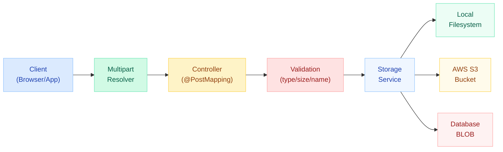
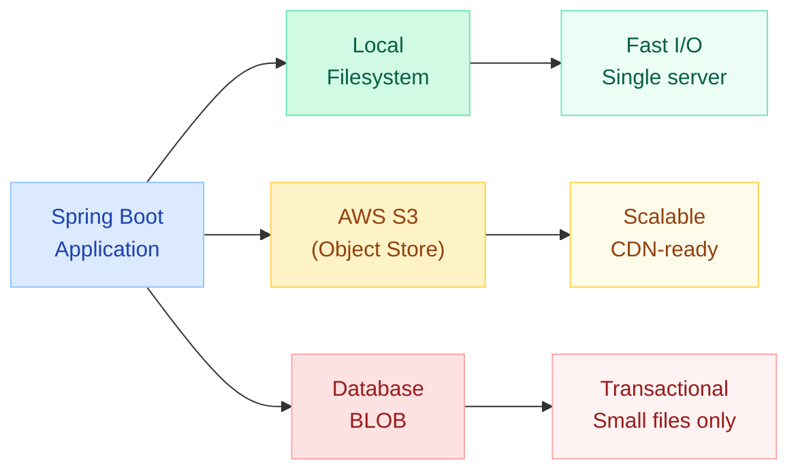
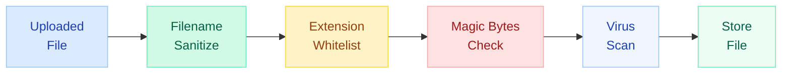

# File Upload & Download in Spring Boot

> **Handle multipart uploads, stream large files efficiently, and serve downloads safely — covering configuration, storage strategies, resumable uploads, and security hardening.**

---

!!! danger "Path Traversal Vulnerability: Never Trust the Original Filename"
    A developer stored uploaded files using the client-supplied filename: `Paths.get(uploadDir, file.getOriginalFilename())`. An attacker uploaded a file named `../../etc/passwd` (or `..\..\windows\system32\config\sam` on Windows). The application resolved the path outside the intended upload directory, overwriting critical system files. **Always sanitize filenames and resolve against the target directory, then verify the canonical path stays within bounds.** This is OWASP #5 (Broken Access Control) and appears in nearly every penetration test.



---

## MultipartFile — Single and Multiple File Upload

Spring's `MultipartFile` interface wraps uploaded file data, providing access to the filename, content type, size, input stream, and bytes.

### Single File Upload

```java
@RestController
@RequestMapping("/api/files")
public class FileUploadController {

    private final Path uploadDir = Paths.get("uploads").toAbsolutePath().normalize();

    @PostMapping("/upload")
    public ResponseEntity<String> uploadFile(
            @RequestParam("file") MultipartFile file) {

        if (file.isEmpty()) {
            return ResponseEntity.badRequest().body("File is empty");
        }

        // Sanitize filename
        String originalName = StringUtils.cleanPath(file.getOriginalFilename());
        String safeFilename = UUID.randomUUID() + "_" + originalName;

        // Resolve and verify path stays within upload directory
        Path targetPath = uploadDir.resolve(safeFilename).normalize();
        if (!targetPath.startsWith(uploadDir)) {
            throw new SecurityException("Path traversal attempt detected");
        }

        Files.createDirectories(uploadDir);
        file.transferTo(targetPath);

        return ResponseEntity.ok("Uploaded: " + safeFilename);
    }
}
```

### Multiple File Upload

```java
@PostMapping("/upload-multiple")
public ResponseEntity<List<String>> uploadMultiple(
        @RequestParam("files") List<MultipartFile> files) {

    List<String> uploadedNames = new ArrayList<>();

    for (MultipartFile file : files) {
        if (!file.isEmpty()) {
            String safeName = UUID.randomUUID() + "_"
                + StringUtils.cleanPath(file.getOriginalFilename());
            Path target = uploadDir.resolve(safeName).normalize();

            if (!target.startsWith(uploadDir)) {
                continue; // Skip path traversal attempts
            }
            file.transferTo(target);
            uploadedNames.add(safeName);
        }
    }

    return ResponseEntity.ok(uploadedNames);
}
```

### Form with Multiple Fields

```java
@PostMapping("/upload-with-metadata")
public ResponseEntity<String> uploadWithMetadata(
        @RequestParam("file") MultipartFile file,
        @RequestParam("description") String description,
        @RequestParam("category") String category) {

    // Process file + metadata together
    FileMetadata metadata = new FileMetadata(
        file.getOriginalFilename(), description, category,
        file.getSize(), file.getContentType()
    );
    storageService.store(file, metadata);

    return ResponseEntity.ok("Stored with metadata");
}
```

---

## Configuration: Max File Size, Request Size, Temp Directory

```yaml
# application.yml
spring:
  servlet:
    multipart:
      enabled: true
      max-file-size: 50MB          # Max size per individual file
      max-request-size: 200MB      # Max total request size (all files combined)
      file-size-threshold: 2KB     # Files above this go to disk (not memory)
      location: /tmp/spring-upload # Temp directory for buffering

server:
  tomcat:
    max-swallow-size: -1           # -1 = unlimited; Tomcat won't reject large bodies early
```

### Key Properties Explained

| Property | Default | Purpose |
|---|---|---|
| `max-file-size` | 1MB | Rejects individual files exceeding this |
| `max-request-size` | 10MB | Rejects entire multipart request exceeding this |
| `file-size-threshold` | 0B | Files smaller than this stay in memory |
| `location` | System temp | Where buffered files are written temporarily |

### Handling Size Exceeded Exceptions

```java
@ControllerAdvice
public class FileExceptionHandler {

    @ExceptionHandler(MaxUploadSizeExceededException.class)
    public ResponseEntity<String> handleMaxSize(MaxUploadSizeExceededException ex) {
        return ResponseEntity.status(HttpStatus.PAYLOAD_TOO_LARGE)
            .body("File too large. Maximum allowed: 50MB per file, 200MB total.");
    }

    @ExceptionHandler(MultipartException.class)
    public ResponseEntity<String> handleMultipart(MultipartException ex) {
        return ResponseEntity.badRequest()
            .body("Invalid multipart request: " + ex.getMessage());
    }
}
```

---

## Streaming Large Files (Without Loading into Memory)

For files exceeding available heap (e.g., 500MB+ videos), avoid `file.getBytes()` or `file.transferTo()` on the full content. Stream directly from the input.


### Streaming Upload to Disk

```java
@PostMapping("/upload-stream")
public ResponseEntity<String> streamUpload(HttpServletRequest request)
        throws IOException, ServletException {

    // Access the raw part without buffering entire file
    Part filePart = request.getPart("file");

    Path target = uploadDir.resolve(
        UUID.randomUUID() + "_" + sanitize(filePart.getSubmittedFileName())
    ).normalize();

    // Stream directly from request to file (8KB buffer)
    try (InputStream in = filePart.getInputStream();
         OutputStream out = Files.newOutputStream(target)) {
        in.transferTo(out); // Java 9+ — streams without loading all into memory
    }

    return ResponseEntity.ok("Streamed to: " + target.getFileName());
}
```

### Streaming Upload to S3 (Multipart Upload API)

```java
public void streamToS3(InputStream inputStream, long contentLength,
                       String key, String contentType) {

    PutObjectRequest putRequest = PutObjectRequest.builder()
        .bucket(bucketName)
        .key(key)
        .contentType(contentType)
        .contentLength(contentLength)
        .build();

    // AWS SDK streams from InputStream — no full byte[] needed
    s3Client.putObject(putRequest,
        RequestBody.fromInputStream(inputStream, contentLength));
}
```

---

## File Download: InputStreamResource & StreamingResponseBody

### InputStreamResource (Simple Downloads)

Suitable for files that fit in memory or when Spring manages the lifecycle.

```java
@GetMapping("/download/{filename}")
public ResponseEntity<InputStreamResource> downloadFile(
        @PathVariable String filename) throws IOException {

    Path filePath = uploadDir.resolve(sanitize(filename)).normalize();
    if (!filePath.startsWith(uploadDir)) {
        throw new AccessDeniedException("Invalid path");
    }

    Resource resource = new UrlResource(filePath.toUri());
    if (!resource.exists()) {
        return ResponseEntity.notFound().build();
    }

    String contentType = Files.probeContentType(filePath);
    if (contentType == null) contentType = "application/octet-stream";

    return ResponseEntity.ok()
        .contentType(MediaType.parseMediaType(contentType))
        .contentLength(resource.contentLength())
        .header(HttpHeaders.CONTENT_DISPOSITION,
            "attachment; filename=\"" + resource.getFilename() + "\"")
        .body(new InputStreamResource(resource.getInputStream()));
}
```

### StreamingResponseBody (Large File Downloads)

Writes directly to the servlet output stream asynchronously. Spring releases the request thread immediately.

```java
@GetMapping("/download-stream/{filename}")
public ResponseEntity<StreamingResponseBody> streamDownload(
        @PathVariable String filename) throws IOException {

    Path filePath = uploadDir.resolve(sanitize(filename)).normalize();
    if (!filePath.startsWith(uploadDir)) {
        throw new AccessDeniedException("Invalid path");
    }

    long fileSize = Files.size(filePath);

    StreamingResponseBody stream = outputStream -> {
        try (InputStream in = Files.newInputStream(filePath)) {
            byte[] buffer = new byte[8192];
            int bytesRead;
            while ((bytesRead = in.read(buffer)) != -1) {
                outputStream.write(buffer, 0, bytesRead);
                outputStream.flush(); // Flush chunks to client immediately
            }
        }
    };

    return ResponseEntity.ok()
        .contentType(MediaType.APPLICATION_OCTET_STREAM)
        .contentLength(fileSize)
        .header(HttpHeaders.CONTENT_DISPOSITION,
            "attachment; filename=\"" + filename + "\"")
        .body(stream);
}
```

!!! tip "StreamingResponseBody and Async Timeout"
    Configure async timeout for large downloads:
    ```java
    @Configuration
    public class AsyncConfig implements WebMvcConfigurer {
        @Override
        public void configureAsyncSupport(AsyncSupportConfigurer configurer) {
            configurer.setDefaultTimeout(300_000); // 5 minutes
        }
    }
    ```

---

## Content-Disposition Header: Inline vs Attachment

The `Content-Disposition` header controls whether the browser displays the file in the browser window or triggers a download dialog.

| Value | Behavior | Use Case |
|---|---|---|
| `inline` | Browser renders file (PDF, image, text) | Preview in browser |
| `attachment` | Browser triggers download dialog | Force download |
| `attachment; filename="report.pdf"` | Download with suggested filename | Named downloads |

```java
// Inline — browser displays the file (e.g., PDF viewer, image)
.header(HttpHeaders.CONTENT_DISPOSITION, "inline; filename=\"report.pdf\"")

// Attachment — browser downloads the file
.header(HttpHeaders.CONTENT_DISPOSITION, "attachment; filename=\"report.pdf\"")

// RFC 5987 encoding for non-ASCII filenames
.header(HttpHeaders.CONTENT_DISPOSITION,
    "attachment; filename=\"fallback.pdf\"; filename*=UTF-8''" +
    URLEncoder.encode("reporte-anual.pdf", StandardCharsets.UTF_8))
```

---

## Storage Strategies



### Local Filesystem

```java
@Service
public class LocalStorageService implements StorageService {

    private final Path rootDir;

    public LocalStorageService(@Value("${app.upload.dir}") String dir) {
        this.rootDir = Paths.get(dir).toAbsolutePath().normalize();
    }

    @Override
    public String store(MultipartFile file) throws IOException {
        String key = UUID.randomUUID() + "/" + sanitize(file.getOriginalFilename());
        Path target = rootDir.resolve(key).normalize();
        Files.createDirectories(target.getParent());
        file.transferTo(target);
        return key;
    }

    @Override
    public InputStream load(String key) throws IOException {
        Path path = rootDir.resolve(key).normalize();
        if (!path.startsWith(rootDir)) {
            throw new SecurityException("Path traversal");
        }
        return Files.newInputStream(path);
    }
}
```

### AWS S3 (AWS SDK v2)

```java
@Service
public class S3StorageService implements StorageService {

    private final S3Client s3;
    private final String bucket;

    public S3StorageService(S3Client s3,
            @Value("${app.s3.bucket}") String bucket) {
        this.s3 = s3;
        this.bucket = bucket;
    }

    @Override
    public String store(MultipartFile file) throws IOException {
        String key = "uploads/" + UUID.randomUUID() + "/"
            + sanitize(file.getOriginalFilename());

        PutObjectRequest request = PutObjectRequest.builder()
            .bucket(bucket)
            .key(key)
            .contentType(file.getContentType())
            .contentLength(file.getSize())
            .build();

        s3.putObject(request,
            RequestBody.fromInputStream(file.getInputStream(), file.getSize()));

        return key;
    }

    @Override
    public InputStream load(String key) {
        GetObjectRequest request = GetObjectRequest.builder()
            .bucket(bucket)
            .key(key)
            .build();

        return s3.getObject(request);
    }

    // Pre-signed URL for direct browser upload (bypass server)
    public String generatePresignedUploadUrl(String key, Duration expiry) {
        PutObjectRequest putReq = PutObjectRequest.builder()
            .bucket(bucket).key(key).build();

        PutObjectPresignRequest presignReq = PutObjectPresignRequest.builder()
            .signatureDuration(expiry)
            .putObjectRequest(putReq)
            .build();

        return s3Presigner.presignPutObject(presignReq).url().toString();
    }
}
```

### Database BLOB

```java
@Entity
@Table(name = "file_storage")
public class FileEntity {

    @Id
    @GeneratedValue(strategy = GenerationType.IDENTITY)
    private Long id;

    private String filename;
    private String contentType;
    private long size;

    @Lob
    @Column(columnDefinition = "LONGBLOB")
    private byte[] data;
}
```

```java
@Service
@Transactional
public class DatabaseStorageService {

    private final FileRepository fileRepository;

    public Long store(MultipartFile file) throws IOException {
        FileEntity entity = new FileEntity();
        entity.setFilename(sanitize(file.getOriginalFilename()));
        entity.setContentType(file.getContentType());
        entity.setSize(file.getSize());
        entity.setData(file.getBytes()); // Only for small files!
        return fileRepository.save(entity).getId();
    }

    public FileEntity load(Long id) {
        return fileRepository.findById(id)
            .orElseThrow(() -> new FileNotFoundException("File not found: " + id));
    }
}
```

!!! warning "BLOB Storage Considerations"
    Database BLOB is suitable only for **small files** (< 1MB) where transactional consistency with metadata is critical. For anything larger, use filesystem or object storage and store only the reference (path/key) in the database. BLOBs increase DB backup size, reduce query performance, and are expensive to replicate.

---

## Resumable Uploads: Range Header & tus Protocol

For large files over unreliable networks, resumable upload protocols let clients continue from where they left off after interruption.


### Range Header Approach (Manual Chunking)

```java
@PatchMapping("/upload/{uploadId}")
public ResponseEntity<Void> resumeUpload(
        @PathVariable String uploadId,
        @RequestHeader("Content-Range") String contentRange,
        HttpServletRequest request) throws IOException {

    // Parse "bytes 5242880-10485759/15728640"
    long[] range = parseContentRange(contentRange);
    long start = range[0];
    long end = range[1];
    long total = range[2];

    Path tempFile = uploadDir.resolve(uploadId + ".part");

    try (RandomAccessFile raf = new RandomAccessFile(tempFile.toFile(), "rw");
         InputStream in = request.getInputStream()) {

        raf.seek(start);
        byte[] buffer = new byte[8192];
        int bytesRead;
        while ((bytesRead = in.read(buffer)) != -1) {
            raf.write(buffer, 0, bytesRead);
        }
    }

    if (end + 1 >= total) {
        // All chunks received — finalize
        finalizeUpload(uploadId, tempFile);
        return ResponseEntity.ok().build();
    }

    return ResponseEntity.status(HttpStatus.ACCEPTED)
        .header("Upload-Offset", String.valueOf(end + 1))
        .build();
}
```

### tus Protocol Integration

The [tus protocol](https://tus.io) is an open standard for resumable uploads. Use the `tus-java-server` library for Spring Boot integration.

```xml
<dependency>
    <groupId>me.desair.tus</groupId>
    <artifactId>tus-java-server</artifactId>
    <version>1.0.0-3.0</version>
</dependency>
```

```java
@Configuration
public class TusConfig {

    @Bean
    public TusFileUploadService tusFileUploadService() {
        return new TusFileUploadService()
            .withStoragePath("/tmp/tus-uploads")
            .withUploadUri("/api/tus/upload")
            .withMaxUploadSize(5L * 1024 * 1024 * 1024); // 5GB
    }
}

@RestController
@RequestMapping("/api/tus/upload")
public class TusController {

    @Autowired
    private TusFileUploadService tusService;

    // Handles POST (create), PATCH (resume), HEAD (offset query), DELETE
    @RequestMapping(method = {RequestMethod.POST, RequestMethod.PATCH,
                              RequestMethod.HEAD, RequestMethod.DELETE})
    public void handleTus(HttpServletRequest request,
                          HttpServletResponse response) throws Exception {
        tusService.process(request, response);
    }
}
```

---

## Security: File Type Validation, Virus Scanning, Filename Sanitization



### Filename Sanitization

```java
public static String sanitize(String filename) {
    if (filename == null) return "unnamed";

    // Strip path components
    String name = Paths.get(filename).getFileName().toString();

    // Remove dangerous characters
    name = name.replaceAll("[^a-zA-Z0-9._-]", "_");

    // Prevent hidden files
    if (name.startsWith(".")) name = "_" + name;

    // Limit length
    if (name.length() > 255) {
        String ext = name.substring(name.lastIndexOf('.'));
        name = name.substring(0, 255 - ext.length()) + ext;
    }

    return name;
}
```

### Extension and MIME Type Validation

```java
private static final Set<String> ALLOWED_EXTENSIONS =
    Set.of("pdf", "jpg", "jpeg", "png", "gif", "doc", "docx", "xlsx");

private static final Set<String> ALLOWED_MIME_TYPES =
    Set.of("application/pdf", "image/jpeg", "image/png", "image/gif",
           "application/msword",
           "application/vnd.openxmlformats-officedocument.wordprocessingml.document");

public void validateFileType(MultipartFile file) {
    String filename = sanitize(file.getOriginalFilename());
    String extension = filename.substring(filename.lastIndexOf('.') + 1)
                               .toLowerCase();

    if (!ALLOWED_EXTENSIONS.contains(extension)) {
        throw new InvalidFileTypeException("Extension not allowed: " + extension);
    }

    // Don't trust Content-Type header alone — it can be spoofed
    if (!ALLOWED_MIME_TYPES.contains(file.getContentType())) {
        throw new InvalidFileTypeException("MIME type not allowed");
    }
}
```

### Magic Bytes Validation (Content Sniffing)

```java
public String detectContentType(InputStream inputStream) throws IOException {
    // Use Apache Tika for accurate file type detection via magic bytes
    Tika tika = new Tika();
    return tika.detect(inputStream);
}

// Or manual magic byte check
public boolean isPdf(byte[] header) {
    // PDF starts with %PDF
    return header.length >= 4
        && header[0] == 0x25  // %
        && header[1] == 0x50  // P
        && header[2] == 0x44  // D
        && header[3] == 0x46; // F
}

public boolean isJpeg(byte[] header) {
    // JPEG starts with FF D8 FF
    return header.length >= 3
        && (header[0] & 0xFF) == 0xFF
        && (header[1] & 0xFF) == 0xD8
        && (header[2] & 0xFF) == 0xFF;
}
```

### Virus Scanning (ClamAV Integration)

```java
@Service
public class VirusScanService {

    private final ClamavClient clamavClient;

    public VirusScanService(@Value("${clamav.host}") String host,
                            @Value("${clamav.port}") int port) {
        this.clamavClient = new ClamavClient(host, port);
    }

    public void scan(InputStream inputStream) {
        ScanResult result = clamavClient.scan(inputStream);

        if (result instanceof ScanResult.VirusFound virusFound) {
            throw new MalwareDetectedException(
                "Virus detected: " + virusFound.getFoundViruses());
        }
    }
}
```

```yaml
# application.yml
clamav:
  host: localhost
  port: 3310
```

---

## Testing File Upload with MockMvc

```java
@WebMvcTest(FileUploadController.class)
class FileUploadControllerTest {

    @Autowired
    private MockMvc mockMvc;

    @MockBean
    private StorageService storageService;

    @Test
    void shouldUploadFile() throws Exception {
        MockMultipartFile file = new MockMultipartFile(
            "file",                    // parameter name
            "test-doc.pdf",            // original filename
            "application/pdf",         // content type
            "PDF content here".getBytes() // file content
        );

        mockMvc.perform(multipart("/api/files/upload")
                .file(file))
            .andExpect(status().isOk())
            .andExpect(content().string(containsString("Uploaded")));

        verify(storageService).store(any(MultipartFile.class));
    }

    @Test
    void shouldRejectEmptyFile() throws Exception {
        MockMultipartFile emptyFile = new MockMultipartFile(
            "file", "empty.pdf", "application/pdf", new byte[0]);

        mockMvc.perform(multipart("/api/files/upload")
                .file(emptyFile))
            .andExpect(status().isBadRequest());
    }

    @Test
    void shouldUploadMultipleFiles() throws Exception {
        MockMultipartFile file1 = new MockMultipartFile(
            "files", "doc1.pdf", "application/pdf", "content1".getBytes());
        MockMultipartFile file2 = new MockMultipartFile(
            "files", "doc2.pdf", "application/pdf", "content2".getBytes());

        mockMvc.perform(multipart("/api/files/upload-multiple")
                .file(file1)
                .file(file2))
            .andExpect(status().isOk())
            .andExpect(jsonPath("$.length()").value(2));
    }

    @Test
    void shouldDownloadFile() throws Exception {
        byte[] content = "file content".getBytes();
        given(storageService.load("test.pdf"))
            .willReturn(new ByteArrayInputStream(content));

        mockMvc.perform(get("/api/files/download/test.pdf"))
            .andExpect(status().isOk())
            .andExpect(header().string(HttpHeaders.CONTENT_DISPOSITION,
                containsString("attachment")))
            .andExpect(content().bytes(content));
    }

    @Test
    void shouldRejectPathTraversalFilename() throws Exception {
        MockMultipartFile malicious = new MockMultipartFile(
            "file", "../../etc/passwd", "text/plain", "hack".getBytes());

        mockMvc.perform(multipart("/api/files/upload")
                .file(malicious))
            .andExpect(status().isForbidden());
    }
}
```

### Integration Test with TestRestTemplate

```java
@SpringBootTest(webEnvironment = SpringBootTest.WebEnvironment.RANDOM_PORT)
class FileUploadIntegrationTest {

    @Autowired
    private TestRestTemplate restTemplate;

    @Test
    void shouldUploadAndDownload() {
        // Upload
        MultiValueMap<String, Object> body = new LinkedMultiValueMap<>();
        body.add("file", new ClassPathResource("test-files/sample.pdf"));

        ResponseEntity<String> uploadResp = restTemplate.postForEntity(
            "/api/files/upload", body, String.class);

        assertThat(uploadResp.getStatusCode()).isEqualTo(HttpStatus.OK);
        String filename = extractFilename(uploadResp.getBody());

        // Download
        ResponseEntity<byte[]> downloadResp = restTemplate.getForEntity(
            "/api/files/download/" + filename, byte[].class);

        assertThat(downloadResp.getStatusCode()).isEqualTo(HttpStatus.OK);
        assertThat(downloadResp.getHeaders().getContentDisposition()
            .getType()).isEqualTo("attachment");
    }
}
```

---

## Quick Recall

| Concept | Key Point |
|---|---|
| **MultipartFile** | Spring abstraction wrapping uploaded file; access via `getInputStream()`, `transferTo()` |
| **max-file-size** | Limits individual file size (default 1MB) |
| **max-request-size** | Limits total multipart request (default 10MB) |
| **Path traversal** | Always sanitize filename + verify canonical path stays within target dir |
| **StreamingResponseBody** | Async download; releases servlet thread, writes to output stream directly |
| **InputStreamResource** | Simple download wrapper; suitable for moderate file sizes |
| **Content-Disposition** | `inline` = display in browser; `attachment` = trigger download dialog |
| **Local storage** | Fast, single-server; use for dev or when one instance is sufficient |
| **S3 storage** | Scalable, CDN-ready, pre-signed URLs for direct upload |
| **BLOB storage** | Transactional consistency; only suitable for small files (< 1MB) |
| **Resumable upload** | tus protocol or manual Content-Range; essential for large files |
| **Magic bytes** | Detect real file type (Apache Tika); don't rely on extension alone |
| **ClamAV** | Open-source virus scanner; connect via socket (port 3310) |
| **MockMultipartFile** | Spring test utility for simulating file uploads in MockMvc |

---

## Interview Template

??? tip "How do you handle file uploads in Spring Boot?"
    Use `@RequestParam("file") MultipartFile file` in a `@PostMapping` controller. Spring's `MultipartResolver` parses the request. Call `file.transferTo(path)` for simple storage. Configure `spring.servlet.multipart.max-file-size` and `max-request-size` to control limits. Always sanitize the filename and validate the file type before storing.

??? tip "How do you prevent path traversal attacks in file uploads?"
    Three defenses: (1) Strip all path components using `Paths.get(filename).getFileName()`. (2) Resolve the filename against the target directory and call `.normalize()`. (3) Verify the resulting canonical path starts with the target directory using `targetPath.startsWith(uploadDir)`. Additionally, generate a server-side UUID filename rather than using the client-supplied name.

??? tip "How do you download large files without running out of memory?"
    Use `StreamingResponseBody` — it writes directly to the servlet output stream on a separate thread, so you never hold the full file in heap. Read the file in chunks (e.g., 8KB buffer) and flush periodically. Configure async timeout appropriately for the expected download duration.

??? tip "What is the difference between inline and attachment Content-Disposition?"
    `inline` tells the browser to render the file directly (e.g., display a PDF in the built-in viewer or show an image). `attachment` tells the browser to open a "Save As" dialog. Both can include a `filename` parameter suggesting the download name. Use `filename*=UTF-8''...` for non-ASCII characters per RFC 5987.

??? tip "How would you implement resumable file uploads?"
    Use the tus protocol (open standard): the client creates an upload resource (POST), then sends file chunks (PATCH) with an offset header. If interrupted, the client queries the server for the current offset (HEAD) and resumes from there. Alternatively, implement manually using Content-Range headers with server-side tracking of received bytes in Redis or a temp file.

??? tip "Compare storage strategies: filesystem vs S3 vs database BLOB."
    **Filesystem**: Fastest I/O, simplest implementation, but tied to a single server and requires shared filesystem (NFS/EFS) for multi-instance. **S3**: Infinitely scalable, 11 nines durability, CDN integration, pre-signed URLs for direct browser upload — best for production at scale. **Database BLOB**: Guarantees transactional consistency with metadata, but bloats backups, degrades query performance, and doesn't scale — only viable for small files (< 1MB) where atomicity is critical.

??? tip "How do you validate uploaded file types securely?"
    Layer three checks: (1) **Extension whitelist** — reject unknown extensions. (2) **MIME type check** — verify Content-Type header matches allowed list (but this can be spoofed). (3) **Magic bytes / content sniffing** — read the first few bytes and compare against known file signatures (e.g., `%PDF` for PDF, `FF D8 FF` for JPEG). Apache Tika provides comprehensive detection. Never rely on extension or Content-Type alone.

??? tip "How do you test file upload endpoints?"
    Use `MockMultipartFile` with MockMvc: create a file with specified name, content type, and byte content, then call `mockMvc.perform(multipart("/endpoint").file(mockFile))`. Assert status, response body, and verify service interactions. For integration tests, use `TestRestTemplate` with a `LinkedMultiValueMap` containing `ClassPathResource` entries.
