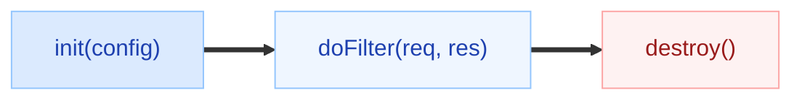
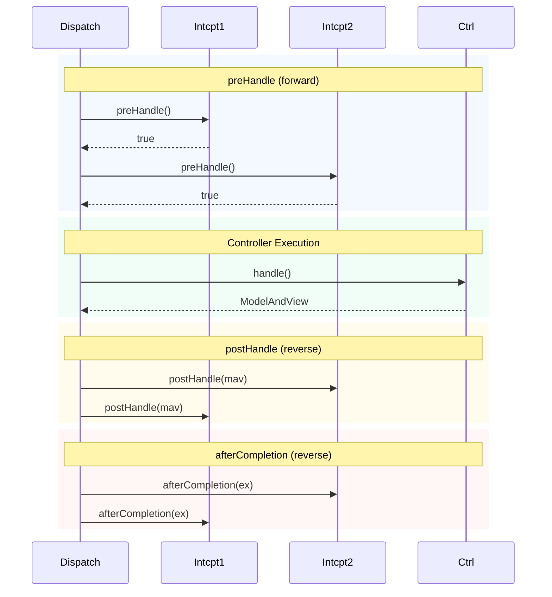
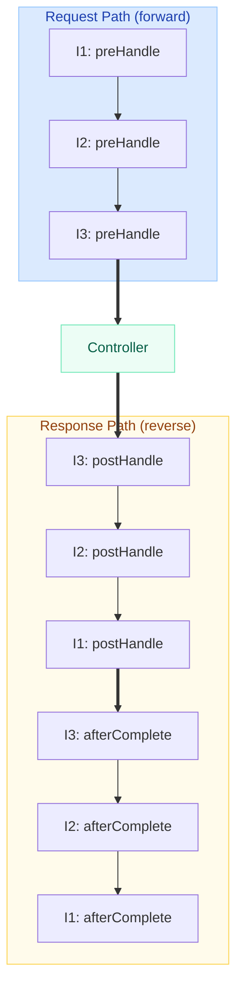
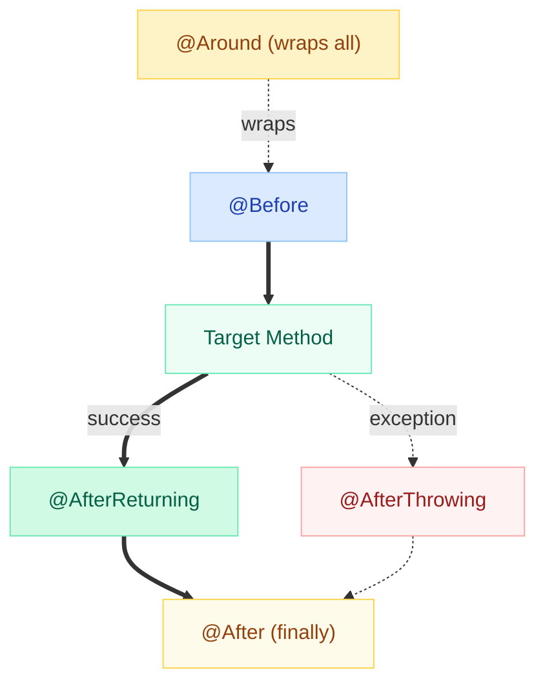
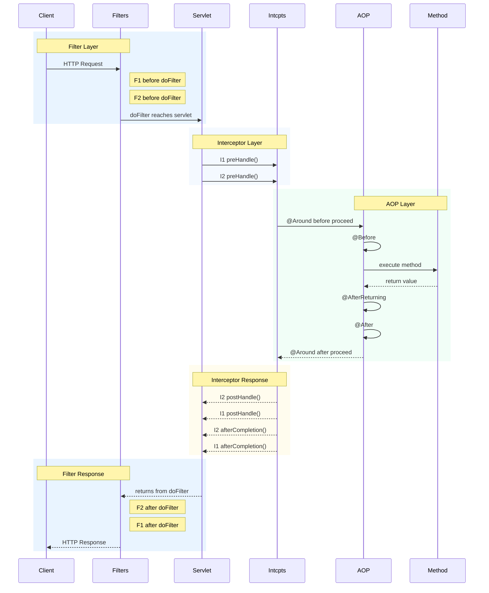
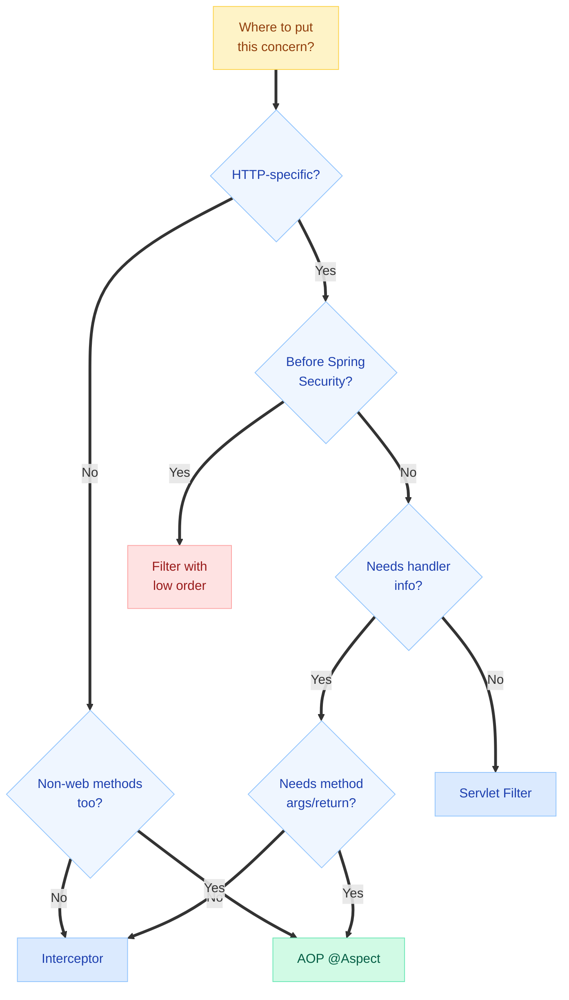
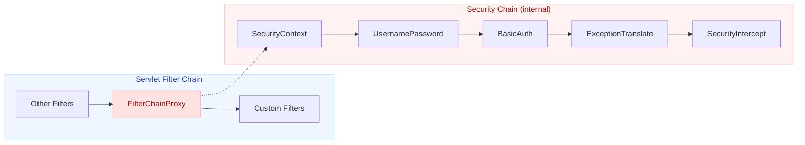

# Filters vs Interceptors vs AOP

> **Cross-cutting concerns live in layers. Put your logic in the wrong layer, and you'll spend days debugging something that should have taken minutes.**

---

!!! danger "Production Incident: Auth Bypass via Filter Ordering"
    A team added a custom `RequestLoggingFilter` using `@Component` (which defaults to `Ordered.LOWEST_PRECEDENCE`). It consumed the request body via `getInputStream()` to log payloads. Problem: Spring Security's filter chain ran AFTER this filter because `@Component` filters without explicit order register unpredictably. Result: the security filter received an **empty body** when validating signed request payloads, threw a silent validation error, and fell through to the default "permit all" path. Production ran for **11 hours** with an effective auth bypass on POST endpoints. Fix: use `FilterRegistrationBean` with explicit ordering and a `ContentCachingRequestWrapper`.

---

## The Big Picture: Request Flow Through All Layers

This is the centerpiece. Every HTTP request passes through these layers in order — and the response flows back in reverse.

```mermaid
flowchart TD
    Client["Client"]
    F1["Filter 1: CORS"]
    F2["Filter 2: Security"]
    F3["Filter 3: Logging"]
    DS["DispatcherServlet"]
    I1_PRE["Intcptr 1<br/>preHandle"]
    I2_PRE["Intcptr 2<br/>preHandle"]
    AOP_B["AOP Before/Around"]
    CTRL["Controller"]
    AOP_A["AOP After/Around"]
    I2_POST["Intcptr 2<br/>postHandle"]
    I1_POST["Intcptr 1<br/>postHandle"]
    I2_AC["Intcptr 2<br/>afterCompletion"]
    I1_AC["Intcptr 1<br/>afterCompletion"]
    F3_R["Filter 3 response"]
    F2_R["Filter 2 response"]
    F1_R["Filter 1 response"]
    RESP["HTTP Response"]

    Client ==>|"HTTP Request"| F1
    F1 ==>|"doFilter"| F2
    F2 ==>|"doFilter"| F3
    F3 ==>|"doFilter"| DS
    DS ==>|"dispatch"| I1_PRE
    I1_PRE ==>|"true"| I2_PRE
    I2_PRE ==>|"true"| AOP_B
    AOP_B ==>|"proceed"| CTRL
    CTRL ==>|"return"| AOP_A
    AOP_A ==> I2_POST
    I2_POST ==> I1_POST
    I1_POST ==> I2_AC
    I2_AC ==> I1_AC
    I1_AC ==> F3_R
    F3_R ==> F2_R
    F2_R ==> F1_R
    F1_R ==>|"Response"| RESP

    style Client fill:#EFF6FF,stroke:#93C5FD,color:#1E40AF
    style F1 fill:#DBEAFE,stroke:#93C5FD,color:#1E40AF
    style F2 fill:#DBEAFE,stroke:#93C5FD,color:#1E40AF
    style F3 fill:#DBEAFE,stroke:#93C5FD,color:#1E40AF
    style DS fill:#FEF3C7,stroke:#FCD34D,color:#92400E
    style I1_PRE fill:#EFF6FF,stroke:#93C5FD,color:#1E40AF
    style I2_PRE fill:#EFF6FF,stroke:#93C5FD,color:#1E40AF
    style AOP_B fill:#D1FAE5,stroke:#6EE7B7,color:#065F46
    style CTRL fill:#ECFDF5,stroke:#6EE7B7,color:#065F46
    style AOP_A fill:#D1FAE5,stroke:#6EE7B7,color:#065F46
    style I2_POST fill:#EFF6FF,stroke:#93C5FD,color:#1E40AF
    style I1_POST fill:#EFF6FF,stroke:#93C5FD,color:#1E40AF
    style I2_AC fill:#FFFBEB,stroke:#FCD34D,color:#92400E
    style I1_AC fill:#FFFBEB,stroke:#FCD34D,color:#92400E
    style F3_R fill:#DBEAFE,stroke:#93C5FD,color:#1E40AF
    style F2_R fill:#DBEAFE,stroke:#93C5FD,color:#1E40AF
    style F1_R fill:#DBEAFE,stroke:#93C5FD,color:#1E40AF
    style RESP fill:#EFF6FF,stroke:#93C5FD,color:#1E40AF
```



!!! tip "Interview Key Insight"
    **Filters** wrap the entire servlet request/response. **Interceptors** wrap the controller handler. **AOP** wraps individual method invocations. Think of it as concentric rings — each layer is more specific and has more context about what's happening.

---

## Servlet Filters (`jakarta.servlet.Filter`)

Filters operate at the **servlet container** level, before Spring even sees the request. They work with raw `HttpServletRequest` and `HttpServletResponse`.

### Lifecycle



| Method | When | Purpose |
|--------|------|---------|
| `init(FilterConfig)` | Container startup (once) | Load config, acquire resources |
| `doFilter(req, res, chain)` | Every matching request | Core logic + call `chain.doFilter()` |
| `destroy()` | Container shutdown (once) | Release resources |

### FilterChain Mechanism

The key concept: `chain.doFilter(request, response)` passes control to the **next** filter (or the servlet if it's the last filter). Code BEFORE this call executes on the **request path**; code AFTER executes on the **response path**.

```java
@Override
public void doFilter(ServletRequest request, ServletResponse response, 
                     FilterChain chain) throws IOException, ServletException {
    // === REQUEST PATH (before servlet) ===
    long start = System.nanoTime();
    
    chain.doFilter(request, response);  // Pass to next filter or servlet
    
    // === RESPONSE PATH (after servlet) ===
    long duration = System.nanoTime() - start;
    log.info("Request took {} ms", duration / 1_000_000);
}
```

### Registration Methods

=== "FilterRegistrationBean (Recommended)"

    ```java
    @Configuration
    public class FilterConfig {
        
        @Bean
        public FilterRegistrationBean<RequestTimingFilter> timingFilter() {
            FilterRegistrationBean<RequestTimingFilter> reg = new FilterRegistrationBean<>();
            reg.setFilter(new RequestTimingFilter());
            reg.addUrlPatterns("/api/*");
            reg.setOrder(1);  // Lower = runs first
            reg.setName("requestTimingFilter");
            return reg;
        }
    }
    ```

=== "@Component"

    ```java
    @Component
    @Order(1)
    public class RequestTimingFilter implements Filter {
        // Applies to ALL URLs — no URL pattern control
        // Order may conflict with other framework filters
    }
    ```

=== "@WebFilter + @ServletComponentScan"

    ```java
    @WebFilter(urlPatterns = "/api/*")
    public class RequestTimingFilter implements Filter {
        // NOTE: @Order does NOT work with @WebFilter!
        // Order is undefined — use FilterRegistrationBean instead
    }
    ```

!!! warning "Ordering Gotcha"
    `@WebFilter` does NOT support `@Order`. If ordering matters (it almost always does), use `FilterRegistrationBean`. This is a common source of production bugs.

### Ordering

| Method | How to Set Order | Predictable? |
|--------|-----------------|:---:|
| `FilterRegistrationBean` | `.setOrder(n)` | Yes |
| `@Component` | `@Order(n)` | Mostly |
| `@WebFilter` | Cannot set order | No |

Lower order number = executes first on request path, last on response path.

### Access & Limitations

| Has Access To | Does NOT Have Access To |
|---|---|
| Raw `HttpServletRequest` / `HttpServletResponse` | Spring beans (unless you fetch from `WebApplicationContext`) |
| Request headers, params, URI | Handler method information |
| Request body (`InputStream` - once!) | Spring's `ModelAndView` |
| Response output stream | Which controller will handle the request |

### Use Cases

- CORS header injection
- Request/response logging
- Character encoding (`CharacterEncodingFilter`)
- Response compression (GZIP)
- Security (Spring Security is a filter chain!)
- Request ID / correlation ID injection
- Rate limiting at the servlet level

### Code Example: Request Timing Filter

```java
public class RequestTimingFilter implements Filter {

    private static final Logger log = LoggerFactory.getLogger(RequestTimingFilter.class);

    @Override
    public void doFilter(ServletRequest request, ServletResponse response, 
                         FilterChain chain) throws IOException, ServletException {
        
        HttpServletRequest httpReq = (HttpServletRequest) request;
        String method = httpReq.getMethod();
        String uri = httpReq.getRequestURI();
        
        long startTime = System.nanoTime();
        
        try {
            chain.doFilter(request, response);  // Continue the chain
        } finally {
            long duration = (System.nanoTime() - startTime) / 1_000_000;
            HttpServletResponse httpRes = (HttpServletResponse) response;
            log.info("{} {} -> {} ({} ms)", method, uri, httpRes.getStatus(), duration);
        }
    }
}
```

---

## HandlerInterceptors (Spring MVC)

Interceptors operate at the **Spring MVC** level, after `DispatcherServlet` has resolved the handler. They have more context than filters — they know WHICH controller method will handle the request.

### Three Callback Methods



| Method | When | Can Short-Circuit? | Has Access To |
|--------|------|----|---|
| `preHandle()` | Before controller | Yes (return `false`) | Request, Response, Handler |
| `postHandle()` | After controller, before view | No | Request, Response, Handler, ModelAndView |
| `afterCompletion()` | After everything (always) | No | Request, Response, Handler, Exception |

!!! tip "Interview: preHandle vs postHandle vs afterCompletion"
    - `preHandle` → validation, auth, rate limiting (can reject requests)
    - `postHandle` → modify model before view rendering (NOT called if exception thrown)
    - `afterCompletion` → cleanup, logging, metrics (ALWAYS called, like `finally`)

### Registration

```java
@Configuration
public class WebConfig implements WebMvcConfigurer {

    @Override
    public void addInterceptors(InterceptorRegistry registry) {
        registry.addInterceptor(new AuthTokenInterceptor())
                .addPathPatterns("/api/**")           // Include
                .excludePathPatterns("/api/public/**", "/api/health")  // Exclude
                .order(1);  // Lower = runs first

        registry.addInterceptor(new RequestLoggingInterceptor())
                .addPathPatterns("/**")
                .order(2);
    }
}
```

### Access & Limitations

| Has Access To | Does NOT Have Access To |
|---|---|
| `HttpServletRequest` / `HttpServletResponse` | Request body (already consumed by argument resolvers) |
| Handler method (`HandlerMethod`) and its annotations | Deserialized `@RequestBody` object |
| `ModelAndView` (in `postHandle`) | Method arguments after binding |
| Spring beans (via `@Autowired` if registered as `@Component`) | Response body after serialization |

### Code Example: Auth Token Validation Interceptor

```java
@Component
public class AuthTokenInterceptor implements HandlerInterceptor {

    private final TokenService tokenService;

    public AuthTokenInterceptor(TokenService tokenService) {
        this.tokenService = tokenService;
    }

    @Override
    public boolean preHandle(HttpServletRequest request, 
                             HttpServletResponse response, 
                             Object handler) throws Exception {
        
        // Skip non-controller handlers (static resources, etc.)
        if (!(handler instanceof HandlerMethod)) {
            return true;
        }

        HandlerMethod handlerMethod = (HandlerMethod) handler;
        
        // Check if method has @PublicEndpoint annotation
        if (handlerMethod.hasMethodAnnotation(PublicEndpoint.class)) {
            return true;  // Skip auth for public endpoints
        }

        String token = request.getHeader("Authorization");
        if (token == null || !token.startsWith("Bearer ")) {
            response.setStatus(HttpServletResponse.SC_UNAUTHORIZED);
            response.getWriter().write("{\"error\": \"Missing or invalid token\"}");
            return false;  // Short-circuit — controller never executes
        }

        // Validate token and set user context
        UserContext user = tokenService.validate(token.substring(7));
        request.setAttribute("currentUser", user);
        return true;
    }

    @Override
    public void afterCompletion(HttpServletRequest request, 
                                HttpServletResponse response,
                                Object handler, Exception ex) {
        // Cleanup ThreadLocal or MDC context
        MDC.remove("userId");
    }
}
```

### Multiple Interceptors: Execution Order



!!! warning "If preHandle returns false"
    If Interceptor 2's `preHandle()` returns `false`, then `postHandle()` is NOT called for ANY interceptor, but `afterCompletion()` IS called for all interceptors whose `preHandle()` already returned `true` (i.e., only Interceptor 1).

---

## AOP (Aspect-Oriented Programming)

AOP operates at the **method invocation** level. It wraps individual method calls using proxies — it has no knowledge of HTTP, servlets, or web concerns.

### Advice Types



| Advice | When | Use Case |
|--------|------|----------|
| `@Before` | Before method executes | Validation, logging entry |
| `@After` | After method (success or failure) | Cleanup (like `finally`) |
| `@AfterReturning` | Only on successful return | Auditing, caching result |
| `@AfterThrowing` | Only on exception | Error logging, alerting |
| `@Around` | Wraps entire method | Timing, retry, transactions, caching |

### Pointcut Expressions

```java
// Match by method signature
@Pointcut("execution(* com.example.service.*.*(..))")
public void allServiceMethods() {}

// Match by annotation on method
@Pointcut("@annotation(com.example.Timed)")
public void timedMethods() {}

// Match by annotation on class
@Pointcut("@within(org.springframework.stereotype.Service)")
public void withinServiceClasses() {}

// Match by class type
@Pointcut("within(com.example.repository..*)")
public void repositoryLayer() {}

// Match by argument type
@Pointcut("args(com.example.dto.OrderRequest, ..)")
public void methodsAcceptingOrderRequest() {}

// Combine pointcuts
@Pointcut("allServiceMethods() && !withinServiceClasses()")
public void nonAnnotatedServiceMethods() {}
```

!!! tip "Interview: Common Pointcut Patterns"
    - `execution(* com.example..*Service.*(..))` — all methods in classes ending with "Service"
    - `@annotation(Transactional)` — all `@Transactional` methods
    - `within(com.example.controller..*)` — everything in controller package
    - `bean(*Service)` — Spring-specific: matches bean names ending with "Service"

### JoinPoint vs ProceedingJoinPoint

| | `JoinPoint` | `ProceedingJoinPoint` |
|---|---|---|
| Used in | `@Before`, `@After`, `@AfterReturning`, `@AfterThrowing` | `@Around` only |
| Can proceed? | No | Yes (`proceed()`) |
| Access to | Method signature, arguments, target object | Same + ability to control execution |
| Can modify args? | No | Yes (pass modified args to `proceed(args)`) |
| Can modify return? | No | Yes (return different value) |

### Spring AOP vs AspectJ

| Dimension | Spring AOP | AspectJ |
|---|---|---|
| **Mechanism** | JDK Dynamic Proxy / CGLIB proxy | Bytecode weaving (compile-time or load-time) |
| **Applies to** | Spring beans only | Any Java class |
| **Join points** | Method execution only | Method, field, constructor, static init |
| **Self-invocation** | NOT intercepted | Intercepted |
| **Performance** | Runtime proxy overhead | No runtime overhead (woven at compile) |
| **Complexity** | Simple (just annotations) | Requires AspectJ compiler/weaver |
| **When to use** | 95% of cases | Need field-level AOP or self-invocation |

### Code Example: Method Execution Timing Aspect

```java
@Aspect
@Component
public class TimingAspect {

    private static final Logger log = LoggerFactory.getLogger(TimingAspect.class);

    @Around("@annotation(timed)")
    public Object measureExecutionTime(ProceedingJoinPoint joinPoint, 
                                        Timed timed) throws Throwable {
        String methodName = joinPoint.getSignature().toShortString();
        long start = System.nanoTime();

        try {
            Object result = joinPoint.proceed();  // Execute the actual method
            return result;
        } catch (Throwable ex) {
            log.error("Method {} threw exception: {}", methodName, ex.getMessage());
            throw ex;  // Re-throw — don't swallow exceptions!
        } finally {
            long duration = (System.nanoTime() - start) / 1_000_000;
            log.info("{}#{} executed in {} ms", 
                     joinPoint.getTarget().getClass().getSimpleName(),
                     methodName, duration);
            
            // Push to metrics (e.g., Micrometer)
            if (duration > timed.warnThresholdMs()) {
                log.warn("SLOW METHOD: {} took {} ms (threshold: {} ms)", 
                         methodName, duration, timed.warnThresholdMs());
            }
        }
    }
}

// Custom annotation to mark methods for timing
@Target(ElementType.METHOD)
@Retention(RetentionPolicy.RUNTIME)
public @interface Timed {
    long warnThresholdMs() default 500;
}

// Usage
@Service
public class OrderService {
    
    @Timed(warnThresholdMs = 200)
    public Order createOrder(OrderRequest request) {
        // Business logic...
    }
}
```

---

## Execution Order: All Three Combined

When a request arrives and all three mechanisms are configured, this is the EXACT execution order:



**Summary of execution order:**

1. Filter 1 (before `chain.doFilter`)
2. Filter 2 (before `chain.doFilter`)
3. Interceptor 1 `preHandle`
4. Interceptor 2 `preHandle`
5. AOP `@Around` (before `proceed`)
6. AOP `@Before`
7. **Controller method executes**
8. AOP `@AfterReturning`
9. AOP `@After`
10. AOP `@Around` (after `proceed`)
11. Interceptor 2 `postHandle`
12. Interceptor 1 `postHandle`
13. Interceptor 2 `afterCompletion`
14. Interceptor 1 `afterCompletion`
15. Filter 2 (after `chain.doFilter`)
16. Filter 1 (after `chain.doFilter`)

---

## Comprehensive Comparison

| Dimension | Servlet Filter | HandlerInterceptor | AOP |
|---|---|---|---|
| **Layer** | Servlet container | Spring MVC | Spring proxy / method |
| **Scope** | All HTTP requests (even static) | Only dispatched handler requests | Any Spring bean method |
| **Interface** | `jakarta.servlet.Filter` | `HandlerInterceptor` | `@Aspect` + advice annotations |
| **Access to** | Raw request/response, headers, body stream | Request, response, handler, ModelAndView | Method args, return value, exceptions, annotations |
| **Spring-aware?** | No (unless manual lookup) | Yes (can inject beans) | Yes (full Spring context) |
| **Applies to** | URL patterns | URL patterns + handler types | Pointcut expressions (method signatures, annotations, packages) |
| **Ordering** | `FilterRegistrationBean.setOrder()` | `InterceptorRegistry.order()` | `@Order` on aspect class |
| **Can short-circuit?** | Yes (don't call `chain.doFilter()`) | Yes (`preHandle` returns `false`) | Yes (`@Around` without calling `proceed()`) |
| **Performance impact** | Minimal (no proxy) | Minimal (direct method call) | Proxy creation cost + reflection per call |
| **Works on non-web?** | No (servlet only) | No (Spring MVC only) | Yes (any Spring bean) |
| **Exception handling** | Try/catch in `doFilter` | `afterCompletion(ex)` | `@AfterThrowing`, `@Around` try/catch |
| **Request body access** | Yes (but consumes stream) | No (already consumed) | Yes (as method parameter) |

---

## Decision Flowchart: Where Should This Logic Go?



**Quick rules of thumb:**

| Concern | Best Layer | Why |
|---------|-----------|-----|
| CORS | Filter | Must run before everything, including security |
| Request logging (raw) | Filter | Needs raw request before anything modifies it |
| Authentication | Filter (Spring Security) | Foundational — must reject early |
| Authorization per endpoint | Interceptor | Needs to know which handler is targeted |
| Rate limiting per user/endpoint | Interceptor | Needs handler info + Spring beans |
| Transaction management | AOP | Per-method, needs to wrap service calls |
| Caching | AOP | Per-method, needs return value |
| Retry logic | AOP | Per-method, needs to re-invoke |
| Auditing | AOP | Needs method args + annotations |
| Metrics/timing | AOP or Filter | Depends on granularity (HTTP vs method) |

---

## Common Pitfalls

!!! danger "Pitfall 1: Filter Consumes Request Body"
    **Problem:** A logging filter reads `request.getInputStream()` to log the body. Downstream, `@RequestBody` gets an EMPTY body because `InputStream` can only be read once.

    **Fix:** Wrap the request in `ContentCachingRequestWrapper`:
    ```java
    @Override
    public void doFilter(ServletRequest request, ServletResponse response, 
                         FilterChain chain) throws IOException, ServletException {
        ContentCachingRequestWrapper wrappedReq = 
            new ContentCachingRequestWrapper((HttpServletRequest) request);
        
        chain.doFilter(wrappedReq, response);  // Use wrapped request
        
        // Now safely read the cached body AFTER the chain completes
        String body = new String(wrappedReq.getContentAsByteArray(), 
                                 wrappedReq.getCharacterEncoding());
        log.info("Request body: {}", body);
    }
    ```

!!! danger "Pitfall 2: Interceptor Cannot Access @RequestBody"
    **Problem:** An interceptor tries to read the request body for validation. But at `preHandle()` time, the body hasn't been deserialized yet (that happens in `HandlerAdapter`). Reading the input stream here will break `@RequestBody` binding.

    **Fix:** Use AOP if you need access to the deserialized request body:
    ```java
    @Before("@annotation(ValidatePayload) && args(request, ..)")
    public void validatePayload(JoinPoint jp, OrderRequest request) {
        // Now you have the deserialized object
        if (request.getAmount() <= 0) {
            throw new IllegalArgumentException("Invalid amount");
        }
    }
    ```

!!! danger "Pitfall 3: AOP Self-Invocation Bypass"
    **Problem:** A `@Transactional` method calls another `@Transactional` method in the SAME class. The second method's transaction annotation is IGNORED because the call bypasses the proxy.

    ```java
    @Service
    public class OrderService {
        
        @Transactional
        public void processOrder(Order order) {
            saveOrder(order);
            sendNotification(order);  // This calls through 'this', NOT the proxy!
        }
        
        @Transactional(propagation = Propagation.REQUIRES_NEW)
        public void sendNotification(Order order) {
            // REQUIRES_NEW is IGNORED here — runs in same transaction
        }
    }
    ```

    **Fix options:**
    
    1. Inject self: `@Lazy @Autowired private OrderService self;` then call `self.sendNotification(order)`
    2. Extract to a separate class: `NotificationService.sendNotification()`
    3. Use `AopContext.currentProxy()` (requires `exposeProxy = true`)

!!! danger "Pitfall 4: Filter Ordering with Spring Security"
    **Problem:** A custom filter registered as `@Component` with no explicit order runs at `Ordered.LOWEST_PRECEDENCE`, which means it runs AFTER Spring Security's `FilterChainProxy`. If you need to set headers or modify the request BEFORE security evaluates it, your filter runs too late.

    **Fix:** Use `FilterRegistrationBean` with an order lower than Spring Security's (which defaults to `-100` / `SecurityProperties.DEFAULT_FILTER_ORDER`):
    ```java
    @Bean
    public FilterRegistrationBean<CorrelationIdFilter> correlationFilter() {
        FilterRegistrationBean<CorrelationIdFilter> reg = new FilterRegistrationBean<>();
        reg.setFilter(new CorrelationIdFilter());
        reg.setOrder(Ordered.HIGHEST_PRECEDENCE);  // Runs before everything
        return reg;
    }
    ```

!!! danger "Pitfall 5: Interceptor afterCompletion vs Exception Handling"
    **Problem:** `postHandle()` is NOT called when the controller throws an exception. If you put cleanup logic in `postHandle()`, it never runs on error paths.

    **Fix:** Always put cleanup logic in `afterCompletion()` which runs regardless of exceptions — it's the `finally` block of interceptors.

---

## Quick Recall Table

| Question | Filter | Interceptor | AOP |
|----------|--------|-------------|-----|
| Where does it live? | Servlet container | Spring MVC | Spring proxy |
| What does it wrap? | Entire request/response | Controller dispatch | Method call |
| Can reject request? | Yes (skip `chain.doFilter()`) | Yes (`preHandle → false`) | Yes (skip `proceed()`) |
| Knows the handler? | No | Yes (`HandlerMethod`) | Yes (method signature) |
| Knows method args? | No | No | Yes (`JoinPoint.getArgs()`) |
| Works outside web? | No | No | Yes |
| Spring Security is a...? | Filter | -- | -- |
| `@Transactional` is...? | -- | -- | AOP |
| `@Cacheable` is...? | -- | -- | AOP |
| Best for raw HTTP work? | Yes | -- | -- |
| Best for endpoint-specific logic? | -- | Yes | -- |
| Best for business method logic? | -- | -- | Yes |

---

## Interview Answer Template

!!! tip "How to structure your answer when asked: 'What's the difference between Filters, Interceptors, and AOP?'"

    **Opening (10 sec):** "They're three concentric layers for cross-cutting concerns, each progressively deeper into the application."

    **Layer explanation (30 sec):**
    
    - "**Filters** operate at the servlet container level. They see raw HTTP — request/response bytes, headers, URL. Spring Security itself is a filter chain. They can't see which controller handles the request."
    - "**Interceptors** operate at the Spring MVC level. They know which `HandlerMethod` will execute, so they're perfect for endpoint-specific logic like per-route auth or rate limiting. But they can't access the deserialized `@RequestBody`."
    - "**AOP** operates at the method level via proxies. It has access to method arguments, return values, and annotations. It works outside web contexts too — `@Transactional`, `@Cacheable`, and `@Retryable` are all AOP."

    **Key differentiator (10 sec):** "The main difference is SCOPE: Filters wrap the HTTP exchange, Interceptors wrap the handler dispatch, AOP wraps method invocations. Choose based on what context you need."

    **Gotcha to mention (10 sec):** "One critical pitfall: AOP in Spring uses proxies, so self-invocation within the same class bypasses the aspect entirely — the most common source of `@Transactional` bugs."

---

## Spring Security: A Special Filter

Spring Security deserves special mention because it's the most important filter in any production application.



Spring Security is a **single servlet filter** (`FilterChainProxy`) that internally maintains its own chain of 15+ security filters. This is why filter ordering relative to Spring Security matters so much.

---

## Summary: One Diagram to Rule Them All

```mermaid
flowchart LR
    subgraph FILTER["Servlet Filters"]
        direction TB
        F_WHAT["Raw HTTP"]
        F_WHEN["Before/after servlet"]
        F_USE["CORS, Security"]
    end

    subgraph INTERCEPT["Interceptors"]
        direction TB
        I_WHAT["Handler dispatch"]
        I_WHEN["Before/after ctrl"]
        I_USE["Auth, Rate limit"]
    end

    subgraph ASPECT["AOP"]
        direction TB
        A_WHAT["Method calls"]
        A_WHEN["Around any method"]
        A_USE["Tx, Cache, Retry"]
    end

    FILTER ==>|"more specific"| INTERCEPT ==>|"most specific"| ASPECT

    style FILTER fill:#DBEAFE,stroke:#93C5FD,color:#1E40AF
    style INTERCEPT fill:#EFF6FF,stroke:#93C5FD,color:#1E40AF
    style ASPECT fill:#D1FAE5,stroke:#6EE7B7,color:#065F46
```



**Remember:** Broad to specific = Filter → Interceptor → AOP. Each inner layer has more context but narrower scope.
