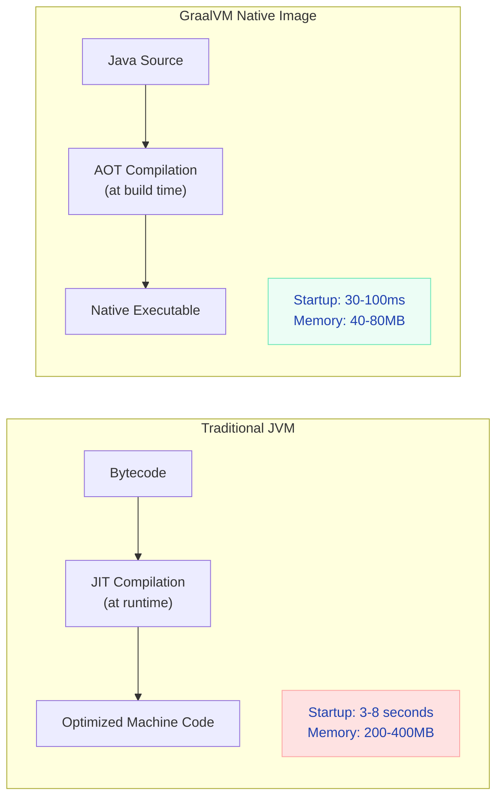
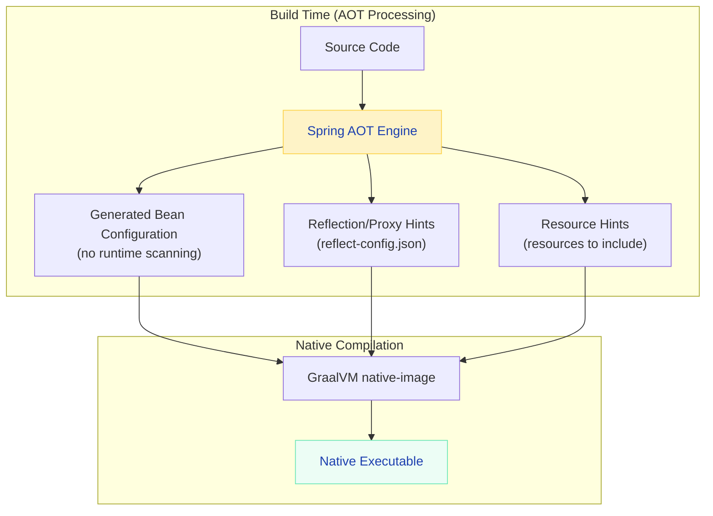
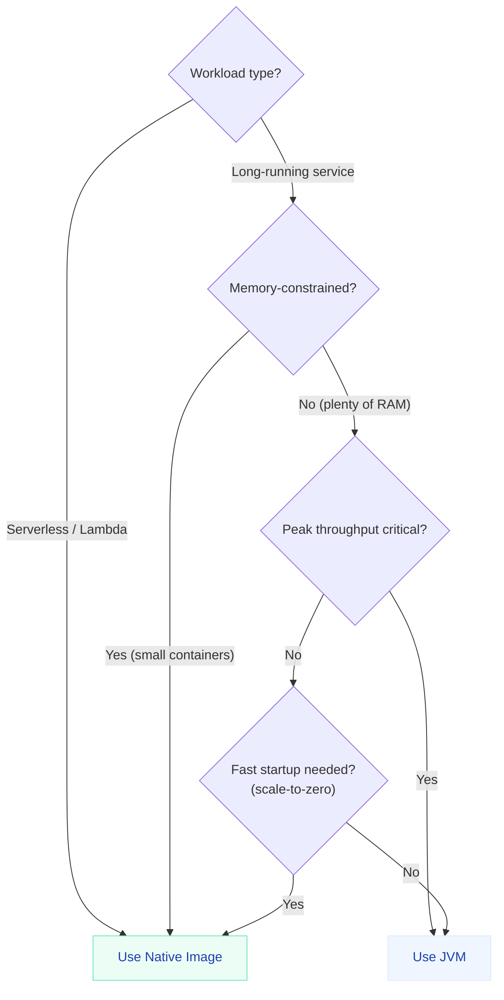

# GraalVM Native Image & Spring AOT

> **Start your Spring Boot app in 50ms with 50MB RAM — the cloud-native game changer for serverless, CLI tools, and high-density deployments.**

---

!!! abstract "Real-World Analogy"
    Traditional JVM is like a **interpreter translating a book in real-time** — flexible, can adapt on the fly, but always has translation overhead. GraalVM Native Image is like **pre-translating the entire book into the reader's language** before handing it over — the reader finishes instantly, but you can't easily add new chapters later (no runtime reflection).



---

## JVM vs Native Image — The Trade-offs

| Aspect | JVM (Traditional) | Native Image |
|--------|-------------------|--------------|
| **Startup time** | 3-8 seconds | 30-100ms |
| **Memory (RSS)** | 200-400MB | 40-80MB |
| **Peak throughput** | Higher (JIT optimizations over time) | Lower (no runtime profiling) |
| **Build time** | 5-30 seconds | 3-10 minutes |
| **Reflection** | Full support | Requires configuration |
| **Dynamic proxies** | Full support | Requires configuration |
| **Classpath scanning** | At runtime | At build time |
| **Debugging** | Full (JDWP, JMX) | Limited |
| **Docker image size** | 200-400MB (with JRE) | 50-100MB (standalone) |

!!! tip "When to Use Native Image"
    - **Serverless functions** (AWS Lambda) — cold start matters
    - **CLI tools** — instant startup expected
    - **High-density deployments** — 5x more instances per node
    - **Sidecar containers** — minimal resource footprint

    **When NOT to use:** Long-running services where JIT optimization gives better steady-state throughput, or when heavy reflection/dynamic proxies are unavoidable.

---

## Spring Boot 3 + GraalVM — Getting Started

### Setup

```xml
<!-- pom.xml — add the native profile -->
<plugin>
    <groupId>org.graalvm.buildtools</groupId>
    <artifactId>native-maven-plugin</artifactId>
</plugin>
```

```bash
# Build native image
./mvnw -Pnative native:compile

# Or build a container with native image
./mvnw -Pnative spring-boot:build-image
```

### Configuration (application.yml)

```yaml
spring:
  main:
    lazy-initialization: false  # irrelevant — everything is resolved at build time
```

---

## Spring AOT (Ahead-of-Time) Processing

Spring AOT is the bridge between Spring's dynamic nature and native image's static requirements.



### What AOT Does

1. **Evaluates `@Conditional` at build time** — decides which beans to include
2. **Generates bean definitions** — no classpath scanning at runtime
3. **Creates reflection hints** — tells native-image which classes need reflection
4. **Resolves proxies** — generates proxy classes at build time
5. **Processes `@Value` and `@ConfigurationProperties`** — static binding

### Runtime Hints (When AOT Can't Infer)

```java
@ImportRuntimeHints(MyHints.class)
@Configuration
public class AppConfig { }

public class MyHints implements RuntimeHintsRegistrar {
    @Override
    public void registerHints(RuntimeHints hints, ClassLoader classLoader) {
        // Register reflection for classes used dynamically
        hints.reflection().registerType(MyDTO.class, 
            MemberCategory.INVOKE_PUBLIC_CONSTRUCTORS,
            MemberCategory.INVOKE_PUBLIC_METHODS);

        // Register resources that must be included in native image
        hints.resources().registerPattern("templates/*.html");

        // Register serialization
        hints.serialization().registerType(MyEvent.class);
    }
}
```

---

## Common Challenges & Solutions

### Challenge 1: Reflection

```java
// ❌ This breaks in native image (Jackson needs reflection for DTOs)
public class OrderDTO {
    private String id;
    private BigDecimal amount;
    // getters/setters — Jackson uses reflection to access these
}

// ✅ Solution 1: Use records (automatically get reflection hints)
public record OrderDTO(String id, BigDecimal amount) {}

// ✅ Solution 2: Register hints explicitly
@RegisterReflectionForBinding(OrderDTO.class)
@Configuration
public class SerializationConfig {}
```

### Challenge 2: Dynamic Proxies

```java
// ❌ Feign clients use JDK dynamic proxies — need hints
@FeignClient(name = "payment-service")
public interface PaymentClient {
    @GetMapping("/payments/{id}")
    Payment getPayment(@PathVariable Long id);
}

// ✅ Spring Cloud already provides native hints for Feign
// Just ensure you're on Spring Cloud 2023.0+ (native-compatible)
```

### Challenge 3: Resources Not Included

```java
// ❌ Native image doesn't include classpath resources by default
InputStream is = getClass().getResourceAsStream("/templates/email.html");

// ✅ Register the resource pattern
hints.resources().registerPattern("templates/*");
```

---

## Building & Deploying

### Multi-Stage Dockerfile

```dockerfile
# Stage 1: Build native image
FROM ghcr.io/graalvm/native-image-community:21 AS builder
WORKDIR /app
COPY . .
RUN ./mvnw -Pnative native:compile -DskipTests

# Stage 2: Minimal runtime image
FROM debian:bookworm-slim
COPY --from=builder /app/target/myapp /app/myapp
EXPOSE 8080
ENTRYPOINT ["/app/myapp"]
```

```bash
# Resulting image size comparison
# JVM:    ~350MB (eclipse-temurin:21-jre + fat JAR)
# Native: ~80MB  (debian-slim + native binary)
```

### Buildpacks (Simpler)

```bash
# Spring Boot buildpack handles everything
./mvnw -Pnative spring-boot:build-image \
    -Dspring-boot.build-image.imageName=myapp:native
```

---

## Performance Benchmarks

| Metric | JVM (G1GC) | Native Image | Improvement |
|--------|-----------|--------------|-------------|
| Startup time | 4.2s | 0.08s | **52x faster** |
| First response | 4.5s | 0.12s | **37x faster** |
| Memory (RSS) at idle | 280MB | 52MB | **5.4x less** |
| Memory under load | 450MB | 120MB | **3.7x less** |
| Docker image size | 340MB | 78MB | **4.3x smaller** |
| Peak throughput (RPS) | 12,000 | 9,500 | 0.8x (20% lower) |
| p99 latency (steady) | 8ms | 12ms | 1.5x higher |

!!! info "The Throughput Trade-off"
    Native image starts faster and uses less memory, but JVM with JIT achieves **higher peak throughput** after warmup. For long-running services handling sustained traffic, JVM still wins on raw performance. For serverless/scale-to-zero workloads, native image wins overwhelmingly.

---

## Testing Native Images

```java
// Run tests in native mode to catch native-specific issues
@SpringBootTest
@DisabledInNativeImage  // skip if running as native (for tests that use mocking)
class MockBasedTest { }

@SpringBootTest
@EnabledInNativeImage  // only run in native mode
class NativeSpecificTest { }
```

```bash
# Run tests as native executable
./mvnw -Pnative -PnativeTest test
```

---

## Decision Framework



---

## Interview Questions

??? question "What's the difference between JIT and AOT compilation?"

    **Answer:**
    
    - **JIT (Just-In-Time):** The JVM compiles bytecode to machine code at runtime, using profiling data to optimize hot paths. Advantage: adapts to actual workload patterns. Disadvantage: startup cost, warmup period.
    - **AOT (Ahead-Of-Time):** Compilation happens at build time. The output is a native executable. Advantage: instant startup, no warmup. Disadvantage: can't optimize based on runtime behavior, no dynamic class loading.
    
    **Spring AOT** specifically refers to Spring's build-time analysis that generates optimized bean definitions and reflection metadata.

??? question "Why can't native images use reflection freely?"

    **Answer:** Native image performs a "closed-world analysis" at build time — it must know ALL classes that will be used. Reflection breaks this assumption because it accesses classes by string name at runtime. The native-image compiler can't know which classes will be reflected on, so it can't include them in the executable unless explicitly told via reflection hints.

??? question "When would you NOT recommend GraalVM Native for a Spring Boot service?"

    **Answer:** When the service is long-running (not serverless), throughput matters more than startup, it uses heavy reflection (many JPA entities, complex Jackson mappings), or it relies on dynamic features like hot-reload, JMX monitoring, or runtime bytecode generation (Mockito in tests). The build time (5-10 min) also makes development feedback loops slower.
