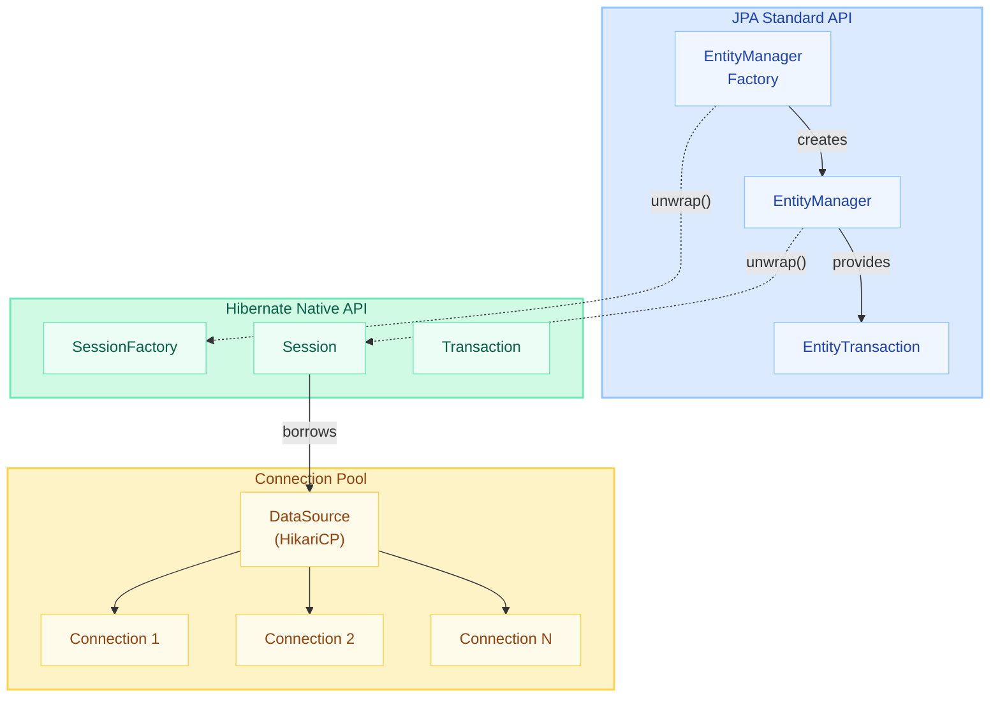
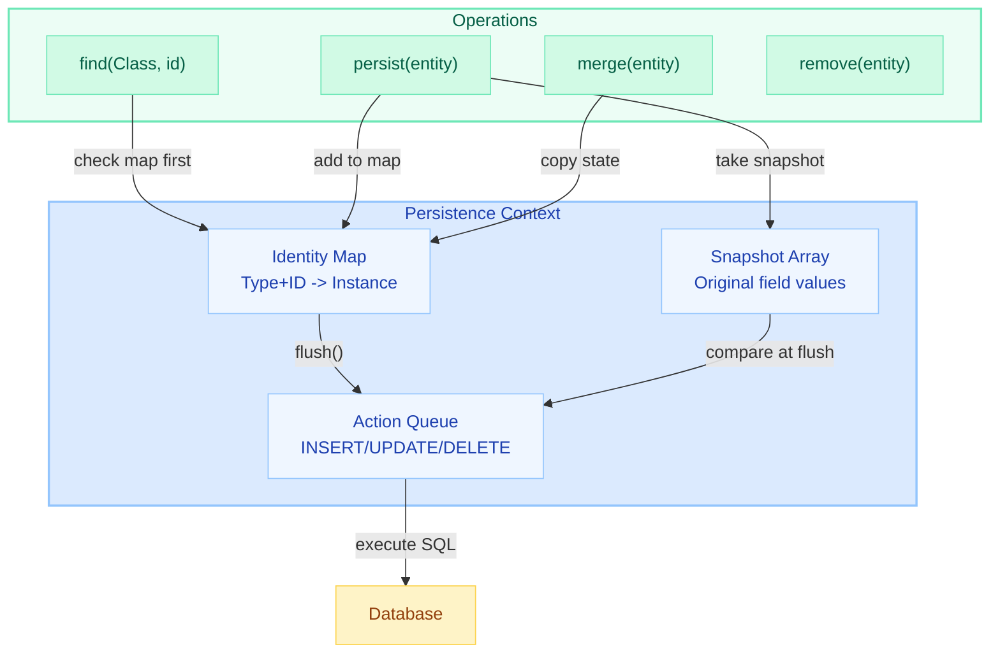
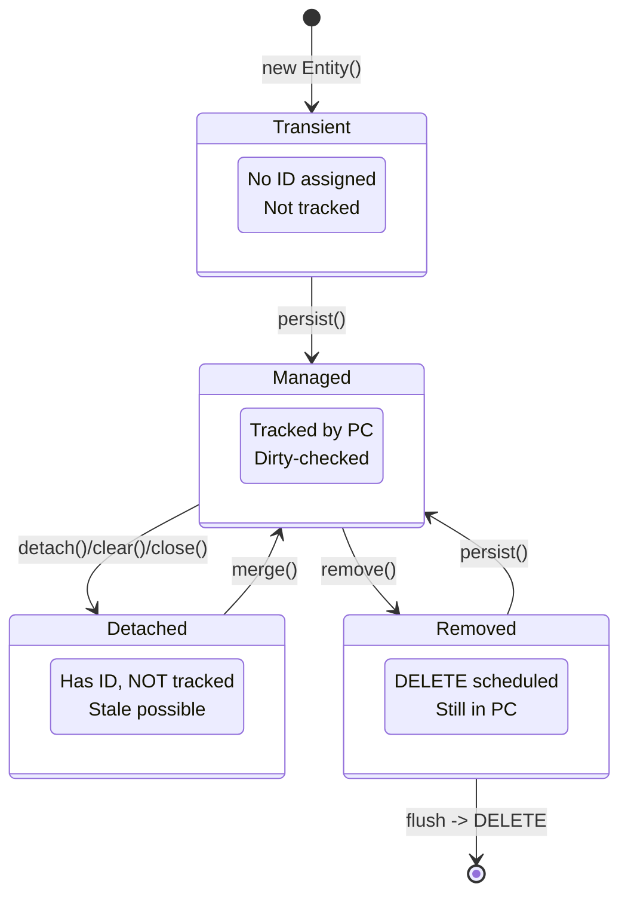
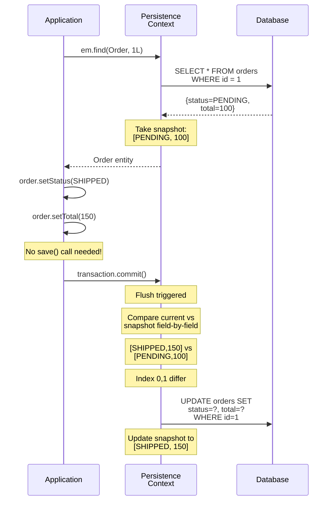
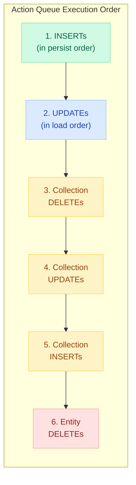
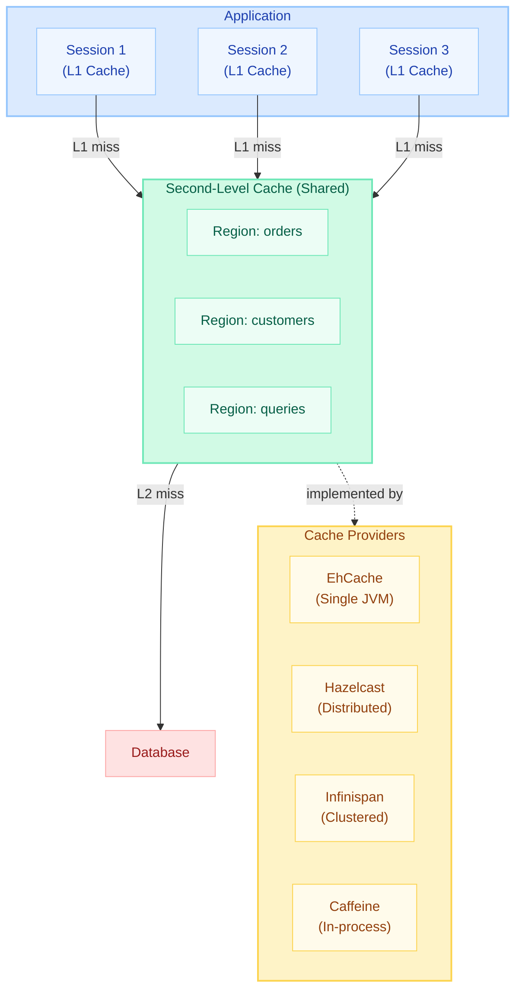
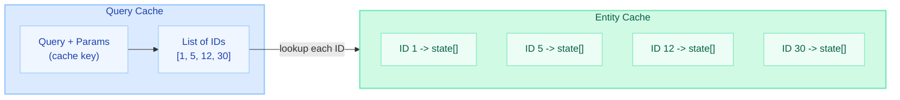
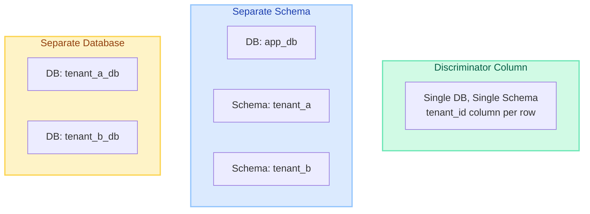
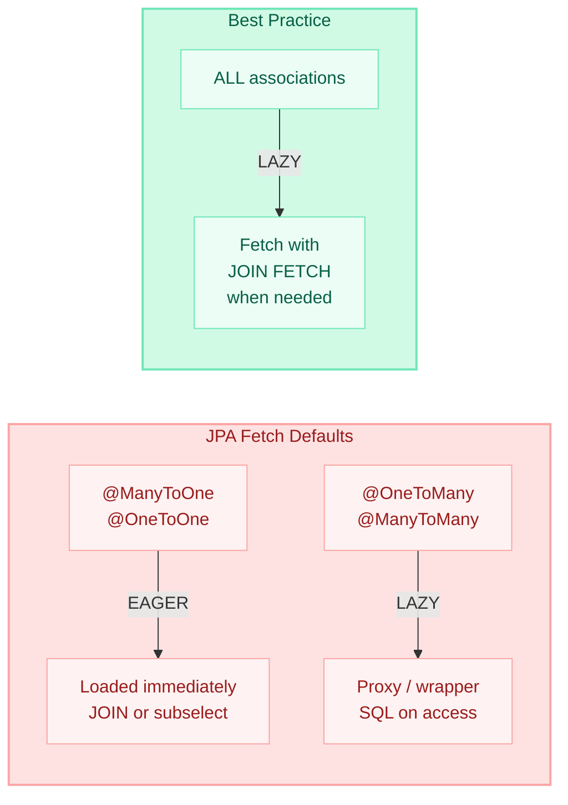
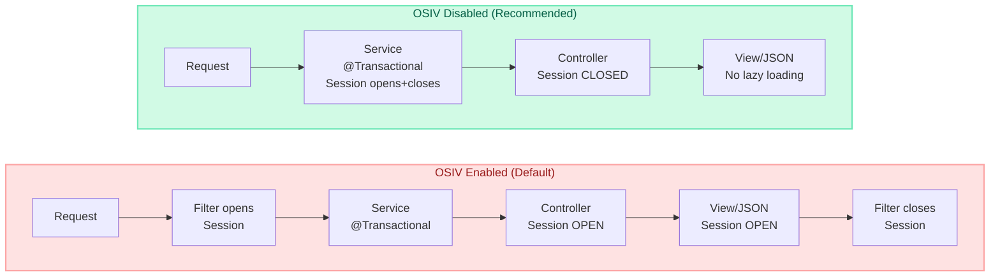

# Hibernate & JPA Internals — Deep Dive

> **Understanding Hibernate's internal machinery separates developers who use JPA from those who master it.**

---

!!! danger "Real-World Incident: Session Leak Causing Connection Pool Exhaustion"
    A production microservice experienced **complete connection pool exhaustion** within 4 hours of deployment. The root cause: a `@Scheduled` method opened an `EntityManager` manually but never closed it on exception paths. Each leaked session held a JDBC connection. With a pool size of 20 and the scheduler running every 30 seconds, the pool was drained in under 10 minutes during error storms. The fix: wrapping all manual `EntityManager` usage in try-with-resources and switching to `@Transactional` declarative management.

    ```java
    // BAD: Session leak on exception
    EntityManager em = emf.createEntityManager();
    em.getTransaction().begin();
    processBatch(em); // throws RuntimeException — em never closed!

    // GOOD: Guaranteed cleanup
    try (EntityManager em = emf.createEntityManager()) {
        em.getTransaction().begin();
        processBatch(em);
        em.getTransaction().commit();
    } // auto-closed even on exception
    ```

---

## EntityManager vs Session vs SessionFactory Hierarchy

Understanding the object hierarchy is fundamental to mastering Hibernate.



| JPA Interface | Hibernate Equivalent | Scope | Responsibility |
|---------------|---------------------|-------|----------------|
| `EntityManagerFactory` | `SessionFactory` | Application-wide singleton | Configuration, connection pooling, 2nd-level cache |
| `EntityManager` | `Session` | Per-request / per-transaction | First-level cache, dirty checking, CRUD |
| `EntityTransaction` | `Transaction` | Single unit of work | Begin, commit, rollback |

```java
// Accessing native Hibernate API from JPA
Session session = entityManager.unwrap(Session.class);
SessionFactory sf = entityManager.getEntityManagerFactory().unwrap(SessionFactory.class);

// Spring Boot auto-configures everything — you rarely create these manually
@PersistenceContext
private EntityManager em; // Injected, transaction-scoped proxy
```

---

## Persistence Context (First-Level Cache)

The **Persistence Context** is the central concept in JPA. It is an in-memory workspace that tracks entity instances and ensures consistency within a unit of work.



### Identity Map Guarantees

The identity map ensures **repeatable reads** within a persistence context:

```java
Order order1 = em.find(Order.class, 1L); // SQL: SELECT ... WHERE id = 1
Order order2 = em.find(Order.class, 1L); // NO SQL — returns cached instance

assert order1 == order2; // true! Same object reference (not just equals)

// JPQL also respects identity map
Order order3 = em.createQuery("SELECT o FROM Order o WHERE o.id = 1", Order.class)
                 .getSingleResult(); // SQL fires, but result is reconciled with map

assert order1 == order3; // true! Even from a query
```

### Snapshot Comparison

When an entity is loaded or persisted, Hibernate takes a **deep copy** of all persistent field values as an `Object[]` array:

```java
// Internal representation (simplified):
// Key: EntityKey(Order.class, id=1)
// Value: Order@7a3b2c1 (the live instance)
// Snapshot: Object[] { "PENDING", BigDecimal(100.00), Timestamp(...) }

// At flush time:
// Current:  Object[] { "SHIPPED", BigDecimal(100.00), Timestamp(...) }
// Snapshot: Object[] { "PENDING", BigDecimal(100.00), Timestamp(...) }
// Diff: index 0 changed → generate UPDATE for status column
```

!!! tip "Performance Consideration"
    Each managed entity consumes **double memory** (the instance + its snapshot). For batch processing with 100,000 entities, call `em.clear()` periodically to release both instances and snapshots.

---

## Entity Lifecycle States

Every JPA entity exists in exactly one of four states at any given time.



### State Transitions in Code

```java
// ========== TRANSIENT ==========
Order order = new Order();           // Transient: no ID, no PC
order.setStatus("NEW");

// ========== MANAGED ==========
em.persist(order);                   // Managed: ID assigned (or will be at flush)
                                     // Snapshot taken, INSERT queued

order.setStatus("CONFIRMED");        // Still managed — change auto-detected

// ========== DETACHED ==========
em.detach(order);                    // Detached: has ID, but no longer tracked
// OR: em.clear();                   // Detaches ALL entities
// OR: em.close();                   // Closes session — all entities detached

order.setStatus("SHIPPED");          // This change is INVISIBLE to Hibernate

// ========== RE-ATTACH ==========
Order managed = em.merge(order);     // Returns NEW managed copy
// WARNING: 'order' is still detached! Use 'managed' going forward.

// ========== REMOVED ==========
em.remove(managed);                  // Removed: DELETE queued for flush
// Entity still in memory, but will be deleted from DB on flush
```

!!! warning "Common Pitfall: merge() vs persist()"
    - `persist()` — makes the **same instance** managed. Fails if entity already has an ID managed elsewhere.
    - `merge()` — returns a **new managed copy**. The original is untouched. Always capture the return value.
    
    ```java
    // WRONG: using the original after merge
    em.merge(detachedOrder);
    detachedOrder.setNote("updated"); // This change is LOST!
    
    // CORRECT:
    Order managed = em.merge(detachedOrder);
    managed.setNote("updated"); // This is tracked
    ```

---

## The equals()/hashCode() Landmine

This is THE interview question that separates intermediate from senior Hibernate developers. Getting it wrong causes silent data corruption with `Set<Entity>` and `Map<Entity, ...>`.

### The Problem: Why Default equals/hashCode Breaks

```java title="BrokenEntity.java"
@Entity
public class Order {
    @Id
    @GeneratedValue(strategy = GenerationType.IDENTITY)
    private Long id;
    
    // No equals()/hashCode() override
    // Uses Object.equals() — compares memory addresses
}
```

```java title="SetCorruptionDemo.java"
Set<Order> orders = new HashSet<>();

Order order = new Order();          // id = null (transient)
orders.add(order);                  // hashCode based on identity

em.persist(order);                  // id = 42 assigned by DB
em.flush();

orders.contains(order);            // TRUE — same object reference
// But if you detach + merge:
Order merged = em.merge(order);    // DIFFERENT object reference!
orders.contains(merged);           // FALSE — different hashCode!
```

### Approach 1: getId() — THE TRAP

```java title="NaiveEqualsWithId.java"
@Entity
public class Order {
    @Id @GeneratedValue
    private Long id;
    
    @Override
    public boolean equals(Object o) {
        if (this == o) return true;
        if (!(o instanceof Order)) return false;
        return id != null && id.equals(((Order) o).id);
    }
    
    @Override
    public int hashCode() {
        return Objects.hash(id);  // BROKEN!
    }
}
```

!!! danger "What Breaks"
    1. **Before persist**: `id` is null, so `hashCode()` returns `Objects.hash(null)` = 0
    2. **After persist**: `id` becomes 42, `hashCode()` returns `Objects.hash(42)` = 73
    3. The entity was stored in a `HashSet` at bucket 0, but now hashes to bucket 73
    4. `set.contains(order)` returns **false** even though the object is in the set!
    5. You now have a **memory leak** — the object is unreachable in the set

### Approach 2: Fixed hashCode with ID equals (Vlad Mihalcea's Recommendation)

```java title="CorrectEqualsHashCode.java"
@Entity
public class Order {
    @Id @GeneratedValue
    private Long id;
    
    @Override
    public boolean equals(Object o) {
        if (this == o) return true;
        if (!(o instanceof Order other)) return false;
        // Only use id if both are non-null (both persisted)
        return id != null && id.equals(other.getId());
    }
    
    @Override
    public int hashCode() {
        // FIXED: return a constant!
        // This degrades HashSet to O(n) but guarantees correctness
        // across persist/detach/merge lifecycle
        return getClass().hashCode();  // same value for all Order instances
    }
}
```

!!! tip "Why constant hashCode works"
    A constant `hashCode()` means all instances land in the same bucket. `HashSet` degrades to a linked list (`O(n)` lookup). For typical entity collections (< 1000 items), this is perfectly acceptable. Correctness > performance.

### Approach 3: Business Key (Natural ID)

```java title="BusinessKeyEquals.java"
@Entity
public class Order {
    @Id @GeneratedValue
    private Long id;
    
    @NaturalId  // Hibernate-specific — marks immutable business key
    @Column(nullable = false, unique = true, updatable = false)
    private String orderNumber;  // assigned at creation, never changes
    
    @Override
    public boolean equals(Object o) {
        if (this == o) return true;
        if (!(o instanceof Order other)) return false;
        return orderNumber != null && orderNumber.equals(other.orderNumber);
    }
    
    @Override
    public int hashCode() {
        return Objects.hash(orderNumber);  // stable — never changes
    }
}
```

### Approach 4: UUID Assigned at Construction

```java title="UuidEquals.java"
@Entity
public class Order {
    @Id @GeneratedValue
    private Long id;
    
    @Column(nullable = false, unique = true, updatable = false)
    private UUID uuid = UUID.randomUUID();  // assigned at new Order()
    
    @Override
    public boolean equals(Object o) {
        if (this == o) return true;
        if (!(o instanceof Order other)) return false;
        return uuid.equals(other.uuid);
    }
    
    @Override
    public int hashCode() {
        return uuid.hashCode();  // stable from construction through entire lifecycle
    }
}
```

### The Proxy Problem with equals()

```java title="ProxyEqualsTrap.java"
Order realOrder = em.find(Order.class, 1L);
Order proxyOrder = em.getReference(Order.class, 1L);  // uninitialized proxy

// realOrder.getClass() = Order.class
// proxyOrder.getClass() = Order$HibernateProxy$abc123

// WRONG equals implementation:
if (o == null || getClass() != o.getClass()) return false;
// This FAILS because proxy class != real class!

// CORRECT: use instanceof
if (!(o instanceof Order)) return false;
// Works because proxy IS-A Order (it extends Order)
```

!!! danger "What Breaks with getClass() in equals()"
    - `order.equals(proxyOrder)` returns `false` even for the same database row
    - `Set<Order>` can contain duplicates — both the real entity and its proxy
    - Hibernate's identity map prevents this within a single session, but across sessions (detach/merge), it causes corruption

### Comparison Table

| Approach | hashCode Stability | Performance | Proxy-Safe | When to Use |
|----------|-------------------|-------------|------------|-------------|
| Default (Object) | Stable but wrong | O(1) | No | Never for entities |
| ID-based (naive) | **Breaks on persist** | O(1) | Depends | Never |
| ID + constant hash | Stable | O(n) in Set | Yes | General recommendation |
| Business key | Stable | O(1) | Yes | When natural key exists |
| UUID at construction | Stable | O(1) | Yes | Best if UUID is acceptable |

---

## Dirty Checking Mechanism

Hibernate's dirty checking uses **snapshot array comparison** at flush time to determine which entities need UPDATE statements.



### How It Works Internally

1. **Load time**: Hibernate creates an `Object[]` snapshot of every persistent property
2. **Flush time**: For each managed entity, compare current values against snapshot
3. **Default behavior**: All columns included in UPDATE (even unchanged ones)
4. **Optimization**: `@DynamicUpdate` generates SQL with only changed columns

```java
@Entity
@DynamicUpdate // Only include changed columns in UPDATE
public class Order {
    // If only 'status' changed, generates:
    // UPDATE orders SET status = ? WHERE id = ?
    // Instead of:
    // UPDATE orders SET status = ?, total = ?, created = ?, ... WHERE id = ?
}
```

### Skipping Dirty Checking

```java
// Read-only transaction: skips dirty checking entirely
@Transactional(readOnly = true)
public List<Order> findRecentOrders() {
    return orderRepo.findByCreatedAfter(cutoff);
    // No snapshots taken, no flush, no dirty check
    // Significant memory + CPU savings for read queries
}
```

---

## Flush Modes

Flushing synchronizes the persistence context with the database by executing queued SQL statements.

| Flush Mode | Trigger | Best For | Risk |
|-----------|---------|----------|------|
| **AUTO** | Before queries + at commit | General use | None (safe default) |
| **COMMIT** | Only at transaction commit | Performance when no mid-tx queries | Stale reads within transaction |
| **ALWAYS** | Before every query | Rare — when AUTO misses native queries | Performance overhead |
| **MANUAL** | Only `em.flush()` | Batch processing, full control | Forgetting to flush = data loss |

```java
// Set flush mode per session
em.unwrap(Session.class).setHibernateFlushMode(FlushMode.MANUAL);

// Batch processing with manual flush
@Transactional
public void importOrders(List<OrderDTO> dtos) {
    Session session = em.unwrap(Session.class);
    session.setHibernateFlushMode(FlushMode.MANUAL);
    
    for (int i = 0; i < dtos.size(); i++) {
        em.persist(toEntity(dtos.get(i)));
        if (i % 50 == 0) {
            em.flush();  // Execute 50 INSERTs
            em.clear();  // Release memory
        }
    }
    em.flush(); // Final batch
}
```

---

## Action Queue Ordering

When Hibernate flushes, it does NOT execute SQL in the order you called persist/merge/remove. It uses a **fixed execution order** to avoid constraint violations.

### The Execution Order



### Why This Order Matters

```java title="ConstraintViolationWithoutOrdering.java"
// Scenario: Replace an order's items (delete old, insert new)
@Transactional
public void replaceItems(Long orderId, List<ItemDTO> newItems) {
    Order order = orderRepo.findById(orderId).orElseThrow();
    
    // Developer writes code in this logical order:
    order.getItems().clear();                    // wants DELETE first
    for (ItemDTO dto : newItems) {
        order.getItems().add(new OrderItem(dto)); // then INSERT
    }
    
    // Hibernate's action queue executes:
    // 1. INSERTs (new OrderItems) — but old items still exist!
    // 2. Collection DELETEs (old items removed from collection)
    // 
    // If there's a UNIQUE constraint on (order_id, sku),
    // the INSERT might violate it because the old item hasn't been deleted yet!
}
```

### Fix: Force Flush Between Operations

```java title="FixedConstraintViolation.java"
@Transactional
public void replaceItems(Long orderId, List<ItemDTO> newItems) {
    Order order = orderRepo.findById(orderId).orElseThrow();
    
    order.getItems().clear();
    em.flush();  // Force DELETEs to execute NOW
    
    for (ItemDTO dto : newItems) {
        order.getItems().add(new OrderItem(dto));
    }
    // INSERTs execute at commit — no constraint violation
}
```

### Entity DELETE Ordering Pitfall

```java title="DeleteOrderingBug.java"
// Scenario: Delete parent, then insert new parent with same natural key
@Transactional
public void replaceCustomer(String email, CustomerDTO newData) {
    Customer old = customerRepo.findByEmail(email);
    em.remove(old);  // DELETE queued (action #6 in queue)
    
    Customer replacement = new Customer(newData);
    replacement.setEmail(email);  // same unique email
    em.persist(replacement);  // INSERT queued (action #1 in queue)
    
    // At flush: INSERT fires first, DELETE fires last
    // UNIQUE constraint violation on email!
}

// Fix: flush after remove
@Transactional
public void replaceCustomer(String email, CustomerDTO newData) {
    Customer old = customerRepo.findByEmail(email);
    em.remove(old);
    em.flush();  // DELETE executes NOW
    
    Customer replacement = new Customer(newData);
    replacement.setEmail(email);
    em.persist(replacement);  // Safe — old row is gone
}
```

!!! danger "What Breaks"
    - Unique constraint violations when replacing entities with same natural key
    - Foreign key violations when inserting child before parent is fully committed
    - Collection operations interleaving with entity operations in unexpected ways

---

## Batch Processing Done Right

### The Problem: Default Behavior is Terrible for Bulk Operations

```java title="NaiveBatchImport.java"
// TERRIBLE: OOM + thousands of individual INSERT statements
@Transactional
public void importOrders(List<OrderDTO> dtos) {
    for (OrderDTO dto : dtos) {
        orderRepo.save(toEntity(dto));
        // Each save: adds to PC, takes snapshot, queues INSERT
        // 100,000 entities = 200,000 Object[] arrays in memory!
    }
    // At commit: 100,000 individual INSERT statements
}
```

### Configuration for JDBC Batching

```yaml title="application.yml"
spring:
  jpa:
    properties:
      hibernate:
        jdbc:
          batch_size: 50              # Group 50 INSERTs into one batch
          batch_versioned_data: true  # Allow batching versioned entities
        order_inserts: true           # Group INSERTs by entity type
        order_updates: true           # Group UPDATEs by entity type
```

### Why order_inserts Matters

```java
// Without order_inserts:
// INSERT INTO orders ...    (Order #1)
// INSERT INTO order_items ... (Item for Order #1)
// INSERT INTO orders ...    (Order #2)
// INSERT INTO order_items ... (Item for Order #2)
// → JDBC batching BROKEN because statements alternate types

// With order_inserts = true:
// INSERT INTO orders ...    (Order #1)
// INSERT INTO orders ...    (Order #2)
// INSERT INTO order_items ... (Item for Order #1)
// INSERT INTO order_items ... (Item for Order #2)
// → JDBC batching groups them into 2 batch calls
```

!!! warning "IDENTITY Generation Kills Batching"
    `@GeneratedValue(strategy = GenerationType.IDENTITY)` disables JDBC batching entirely. Hibernate must execute each INSERT individually to get the generated ID back from the DB. Use `SEQUENCE` or `TABLE` strategy for batch operations.

    ```java
    // BROKEN for batching:
    @Id @GeneratedValue(strategy = GenerationType.IDENTITY)
    private Long id;
    
    // WORKS with batching:
    @Id @GeneratedValue(strategy = GenerationType.SEQUENCE, 
                        generator = "order_seq")
    @SequenceGenerator(name = "order_seq", allocationSize = 50)
    private Long id;
    ```

### Proper Batch Import Pattern

```java title="BatchImportService.java"
@Service
public class BatchImportService {

    @PersistenceContext
    private EntityManager em;
    
    private static final int BATCH_SIZE = 50;

    @Transactional
    public void importOrders(List<OrderDTO> dtos) {
        for (int i = 0; i < dtos.size(); i++) {
            em.persist(toEntity(dtos.get(i)));
            
            if (i > 0 && i % BATCH_SIZE == 0) {
                em.flush();  // Execute batch of 50 INSERTs
                em.clear();  // Release memory (entities + snapshots)
            }
        }
        em.flush();  // Final partial batch
    }
}
```

### StatelessSession for Maximum Throughput

`StatelessSession` bypasses the entire persistence context — no L1 cache, no dirty checking, no cascades, no interceptors.

```java title="StatelessBatchService.java"
@Service
public class StatelessBatchService {

    @Autowired
    private EntityManagerFactory emf;

    public void bulkImport(List<OrderDTO> dtos) {
        SessionFactory sf = emf.unwrap(SessionFactory.class);
        
        try (StatelessSession session = sf.openStatelessSession()) {
            Transaction tx = session.beginTransaction();
            
            for (int i = 0; i < dtos.size(); i++) {
                session.insert(toEntity(dtos.get(i)));
                // No persistence context overhead
                // No snapshot taken
                // Direct SQL execution
            }
            
            tx.commit();
        }
    }
}
```

| Feature | Session | StatelessSession |
|---------|---------|-----------------|
| L1 Cache | Yes | No |
| Dirty Checking | Yes | No |
| Cascades | Yes | No |
| Interceptors/Listeners | Yes | No |
| Lazy Loading | Yes | No |
| Batch size config | Honored | Honored |
| Memory per entity | 2x (instance + snapshot) | 0 (fire-and-forget) |

### ScrollableResults for Large Reads

```java title="ScrollableReadService.java"
@Transactional(readOnly = true)
public void processAllOrders(Consumer<Order> processor) {
    Session session = em.unwrap(Session.class);
    
    try (ScrollableResults<Order> scroll = session
            .createQuery("FROM Order", Order.class)
            .setFetchSize(100)         // JDBC fetch size (rows per network round-trip)
            .setReadOnly(true)         // No snapshots
            .scroll(ScrollMode.FORWARD_ONLY)) {
        
        int count = 0;
        while (scroll.next()) {
            Order order = scroll.get();
            processor.accept(order);
            
            if (++count % 100 == 0) {
                em.clear();  // Prevent memory buildup
            }
        }
    }
}
```

!!! danger "What Breaks Without Batching"
    - 100,000 entities = 100,000 individual INSERT statements = 100,000 network round-trips
    - Persistence context grows unbounded → OutOfMemoryError
    - IDENTITY strategy disables all JDBC batching
    - Without `order_inserts`, alternating entity types break batch grouping

---

## Collection Mapping Gotchas: List vs Set

### @ManyToMany with List (Bag Semantics)

```java title="BagSemanticsTrap.java"
@Entity
public class Student {
    @ManyToMany
    @JoinTable(name = "student_course")
    private List<Course> courses = new ArrayList<>();  // BAG semantics!
}
```

When you **remove one course** from the list:

```sql
-- What Hibernate actually executes:
DELETE FROM student_course WHERE student_id = 1;        -- DELETE ALL links!
INSERT INTO student_course (student_id, course_id) VALUES (1, 2);  -- re-insert remaining
INSERT INTO student_course (student_id, course_id) VALUES (1, 3);  -- re-insert remaining
INSERT INTO student_course (student_id, course_id) VALUES (1, 4);  -- re-insert remaining

-- Instead of the optimal:
DELETE FROM student_course WHERE student_id = 1 AND course_id = 5;  -- delete just one
```

!!! danger "Why Does This Happen?"
    A `List` in JPA is a **bag** (unordered, allows duplicates). Hibernate cannot identify individual rows in the join table because there is no unique identifier for each link. Its only option is to delete ALL and re-insert the survivors.

### Fix: Use Set Instead of List

```java title="SetFix.java"
@Entity
public class Student {
    @ManyToMany
    @JoinTable(name = "student_course")
    private Set<Course> courses = new HashSet<>();  // SET semantics — individual deletes!
}
```

```sql
-- Now removing one course generates:
DELETE FROM student_course WHERE student_id = 1 AND course_id = 5;
-- That's it! One statement instead of N+1.
```

### @OneToMany with List: OrderColumn Fix

```java title="OrderedList.java"
@Entity
public class Order {
    // Without @OrderColumn — bag semantics (DELETE ALL + re-INSERT)
    @OneToMany(mappedBy = "order", cascade = CascadeType.ALL)
    private List<OrderItem> items = new ArrayList<>();
    
    // With @OrderColumn — true indexed list (individual operations)
    @OneToMany(cascade = CascadeType.ALL)
    @JoinColumn(name = "order_id")
    @OrderColumn(name = "item_position")  // extra column stores index
    private List<OrderItem> items = new ArrayList<>();
}
```

### Comparison Table

| Collection Type | Mapping | Add/Remove Behavior | Optimal For |
|----------------|---------|--------------------:|-------------|
| `Set` in @ManyToMany | Individual INSERT/DELETE | Single row affected | **Always use for @ManyToMany** |
| `List` in @ManyToMany | DELETE ALL + re-INSERT survivors | N+1 statements | Never |
| `List` with @OrderColumn | Individual INSERT/DELETE/UPDATE | Maintains ordering | When order matters |
| `List` in @OneToMany (mappedBy) | Individual operations via FK | Normal behavior | Default for @OneToMany |

### Extra Column in Join Table

If your join table has extra columns (e.g., `enrolled_date`), you must model it as an entity:

```java title="ExplicitJoinEntity.java"
@Entity
public class StudentCourse {
    @EmbeddedId
    private StudentCourseId id;
    
    @ManyToOne @MapsId("studentId")
    private Student student;
    
    @ManyToOne @MapsId("courseId")
    private Course course;
    
    private LocalDate enrolledDate;  // extra column
}

// Now use @OneToMany to StudentCourse — no bag semantics issue
@Entity
public class Student {
    @OneToMany(mappedBy = "student", cascade = CascadeType.ALL, orphanRemoval = true)
    private Set<StudentCourse> enrollments = new HashSet<>();
}
```

---

## Proxy Objects and Lazy Loading

Hibernate uses **proxy objects** to implement lazy loading. These are runtime-generated subclasses that intercept method calls.

### How Proxies Work

```java
@Entity
public class Order {
    @ManyToOne(fetch = FetchType.LAZY)
    private Customer customer; // At load time, this is a PROXY, not a real Customer
}

// When you do:
Order order = em.find(Order.class, 1L);
// order.customer is a ByteBuddy-generated subclass of Customer
// It contains only the ID — no other fields loaded

order.getCustomer().getId();    // Returns ID without hitting DB (already in proxy)
order.getCustomer().getName();  // NOW triggers SQL: SELECT * FROM customers WHERE id = ?
```

### LazyInitializationException

```java
@Service
public class OrderService {
    @Transactional
    public Order getOrder(Long id) {
        return orderRepo.findById(id).orElseThrow();
    } // Transaction ends, Session closed
}

@RestController
public class OrderController {
    public OrderDTO getOrder(Long id) {
        Order order = orderService.getOrder(id);
        // Session is CLOSED here
        order.getCustomer().getName(); // LazyInitializationException!
    }
}
```

### Solutions to LazyInitializationException

```java
// Solution 1: JOIN FETCH in repository
@Query("SELECT o FROM Order o JOIN FETCH o.customer WHERE o.id = :id")
Optional<Order> findByIdWithCustomer(@Param("id") Long id);

// Solution 2: @EntityGraph
@EntityGraph(attributePaths = {"customer", "items"})
Optional<Order> findById(Long id);

// Solution 3: Hibernate.initialize() within transaction
@Transactional
public Order getOrderWithCustomer(Long id) {
    Order order = orderRepo.findById(id).orElseThrow();
    Hibernate.initialize(order.getCustomer()); // Force load
    return order;
}

// Solution 4: DTO Projection (best performance)
@Query("SELECT new com.app.OrderDTO(o.id, o.status, c.name) " +
       "FROM Order o JOIN o.customer c WHERE o.id = :id")
OrderDTO findOrderDTOById(@Param("id") Long id);
```

!!! tip "Proxy Detection"
    ```java
    // Check if a proxy is initialized
    boolean loaded = Hibernate.isInitialized(order.getCustomer());
    
    // Get the real class behind a proxy
    Class<?> realClass = Hibernate.getClass(order.getCustomer());
    // Returns Customer.class, not Customer$HibernateProxy$abc123
    ```

---

## Second-Level Cache (L2 Cache)

The L2 cache is a **region-based, shared cache** across all sessions within the same `SessionFactory`.



### Cache Concurrency Strategies

| Strategy | Consistency | Performance | Use Case |
|----------|-------------|-------------|----------|
| **READ_ONLY** | Perfect | Highest | Reference data (countries, enums) |
| **NONSTRICT_READ_WRITE** | Eventual | High | Rarely updated data (user profiles) |
| **READ_WRITE** | Strong (soft locks) | Medium | Frequently read, occasionally updated |
| **TRANSACTIONAL** | Full ACID | Lowest | JTA environments, critical data |

### Configuration

```java
@Entity
@Cache(usage = CacheConcurrencyStrategy.READ_WRITE, region = "orders")
public class Order {
    @Id
    private Long id;
    
    @Cache(usage = CacheConcurrencyStrategy.READ_ONLY) // Collection cache
    @OneToMany(mappedBy = "order")
    private List<OrderItem> items;
}
```

```yaml title="application.yml"
spring:
  jpa:
    properties:
      hibernate:
        cache:
          use_second_level_cache: true
          use_query_cache: true
          region.factory_class: org.hibernate.cache.jcache.JCacheRegionFactory
        javax:
          cache:
            provider: org.ehcache.jsr107.EhcacheCachingProvider
```

### What Gets Cached

!!! info "L2 Cache Stores Dehydrated State"
    The L2 cache does NOT store entity objects. It stores **dehydrated state** — an `Object[]` of column values (similar to snapshots). When a cache hit occurs, Hibernate **rehydrates** the state into a new entity instance and places it in the L1 cache.

```java
// Cache lookup flow:
Order order = em.find(Order.class, 1L);
// 1. Check L1 (Persistence Context) — miss
// 2. Check L2 (Shared Cache) — hit! Returns Object[]{SHIPPED, 150, ...}
// 3. Rehydrate into Order instance
// 4. Place in L1 for remainder of session
// No SQL executed!
```

---

## Query Cache

The **Query Cache** caches the **result set identifiers** (primary keys) of JPQL/HQL queries. It works in tandem with the L2 entity cache.



### Invalidation Problem

```java
// Query cache is INVALIDATED when ANY entity in the target table is modified
@Cacheable // This query is cached
@Query("SELECT o FROM Order o WHERE o.status = 'SHIPPED'")
List<Order> findShippedOrders();

// Now someone inserts a NEW order (status = 'PENDING')
orderRepo.save(new Order("PENDING"));
// The ENTIRE query cache region for "orders" is invalidated!
// Even though the new order wouldn't match the cached query!
```

!!! warning "Query Cache Gotcha"
    Query cache invalidation is **table-level**, not row-level. A single INSERT/UPDATE/DELETE to the `orders` table invalidates ALL cached queries that reference that table. This makes query cache counterproductive for frequently-written tables.

---

## Soft Deletes: @Where, @Filter, @SQLDelete

### @SQLDelete + @Where Pattern

```java title="SoftDeleteEntity.java"
@Entity
@SQLDelete(sql = "UPDATE orders SET deleted = true WHERE id = ?")
@Where(clause = "deleted = false")
public class Order {
    @Id @GeneratedValue
    private Long id;
    
    private String status;
    
    @Column(nullable = false)
    private boolean deleted = false;
}
```

```java
// em.remove(order) executes:
// UPDATE orders SET deleted = true WHERE id = 1  (not DELETE!)

// All JPQL queries automatically append WHERE deleted = false:
// SELECT o FROM Order o WHERE o.status = 'PENDING'
// becomes:
// SELECT * FROM orders WHERE status = 'PENDING' AND deleted = false
```

### @Filter for Conditional Soft Delete

```java title="FilterableEntity.java"
@Entity
@FilterDef(name = "deletedFilter", 
           parameters = @ParamDef(name = "isDeleted", type = Boolean.class))
@Filter(name = "deletedFilter", condition = "deleted = :isDeleted")
public class Order {
    @Id @GeneratedValue
    private Long id;
    private boolean deleted = false;
}
```

```java title="FilterUsage.java"
// Enable filter for the session
Session session = em.unwrap(Session.class);
session.enableFilter("deletedFilter").setParameter("isDeleted", false);

// Now all queries exclude deleted records
List<Order> activeOrders = orderRepo.findAll();  // only non-deleted

// Admin view: see ALL records including deleted
session.disableFilter("deletedFilter");
List<Order> allOrders = orderRepo.findAll();  // includes deleted
```

### L2 Cache Interaction with Soft Deletes

!!! danger "What Breaks: L2 Cache + @Where"
    The L2 cache stores individual entities by ID. When you call `em.find(Order.class, 1L)`, Hibernate checks the L2 cache FIRST. If the entity is cached but soft-deleted, it will be returned from cache **ignoring the @Where clause** because `@Where` only applies to queries, not `find()`.

```java title="L2CacheSoftDeleteBug.java"
// Order #1 is soft-deleted (deleted = true)
// But it's still in the L2 cache from before deletion

Order order = em.find(Order.class, 1L);
// L2 cache hit → returns the entity, @Where NOT applied!
// order.isDeleted() = true — but you have it!

// Fix: evict from L2 cache on soft delete
@Override
@Transactional
public void softDelete(Long id) {
    Order order = orderRepo.findById(id).orElseThrow();
    orderRepo.delete(order);  // triggers @SQLDelete
    
    // Manually evict from L2 cache
    sessionFactory.getCache().evict(Order.class, id);
}
```

### @Filter vs @Where Comparison

| Feature | @Where | @Filter |
|---------|--------|---------|
| Always active | Yes | No — must enable per session |
| Can be toggled | No | Yes |
| Applies to find() | **No** (only queries) | **No** (only queries) |
| Collection loading | Yes | Yes |
| Admin override | Not possible | Disable filter |
| HQL/JPQL | Appended automatically | Appended when enabled |

---

## @Immutable Entities

For entities that are never updated after insertion (reference data, event logs, audit trails):

```java title="ImmutableEntity.java"
@Entity
@Immutable  // Hibernate skips dirty checking for this entity entirely
@Cache(usage = CacheConcurrencyStrategy.READ_ONLY)
public class AuditEvent {
    @Id @GeneratedValue
    private Long id;
    
    @Column(nullable = false, updatable = false)
    private String action;
    
    @Column(nullable = false, updatable = false)
    private Instant timestamp;
    
    @Column(nullable = false, updatable = false)
    private String userId;
}
```

### What @Immutable Does

- **No dirty checking**: Hibernate never compares fields to snapshot — no snapshot taken
- **No UPDATE SQL**: Even if you modify fields, no UPDATE is generated
- **L2 cache safe**: `READ_ONLY` cache strategy works perfectly
- **Collection variant**: `@Immutable` on a collection means elements cannot be added/removed

```java
// Modifications are SILENTLY IGNORED:
AuditEvent event = em.find(AuditEvent.class, 1L);
event.setAction("HACKED");  // No effect — no dirty check, no UPDATE
em.flush();                  // Nothing happens
```

!!! warning "What Breaks"
    If you accidentally mark a mutable entity as `@Immutable`, all updates are silently lost. No exception, no warning. Fields change in memory but are never persisted.

---

## @Formula and Computed Properties

```java title="FormulaExample.java"
@Entity
public class Order {
    @Id @GeneratedValue
    private Long id;
    
    private BigDecimal subtotal;
    private BigDecimal taxRate;
    
    @Formula("subtotal * (1 + tax_rate)")  // SQL expression, NOT Java
    private BigDecimal total;  // computed on every SELECT, not stored
    
    @Formula("(SELECT COUNT(*) FROM order_items oi WHERE oi.order_id = id)")
    private int itemCount;  // subquery formula
}
```

| Feature | @Formula | @Column | @Transient |
|---------|----------|---------|------------|
| Stored in DB | No (computed) | Yes | No |
| In SELECT | Yes (as SQL expr) | Yes (column) | No |
| Updatable | No | Yes | N/A |
| Can use subqueries | Yes | No | N/A |
| In WHERE clause | No (not a real column) | Yes | No |

---

## Multi-Tenancy Strategies

### Strategy Comparison



| Strategy | Isolation | Complexity | Performance | Use Case |
|----------|-----------|------------|-------------|----------|
| **Discriminator** | Low (shared tables) | Low | Best (shared indexes) | SaaS MVP, few tenants |
| **Schema** | Medium | Medium | Good | Moderate isolation needs |
| **Database** | Highest | Highest | Varies | Regulatory compliance, large tenants |

### Discriminator Strategy Implementation

```java title="TenantDiscriminatorConfig.java"
// Hibernate 6+ multi-tenancy with discriminator
@Entity
@TenantId("tenantId")  // Hibernate 6 annotation
public class Order {
    @Id @GeneratedValue
    private Long id;
    
    @Column(nullable = false)
    private String tenantId;  // automatically filtered
    
    private String status;
}

// Tenant resolver
@Component
public class TenantIdentifierResolver implements CurrentTenantIdentifierResolver {
    @Override
    public String resolveCurrentTenantIdentifier() {
        return TenantContext.getCurrentTenant();  // from ThreadLocal/SecurityContext
    }
    
    @Override
    public boolean validateExistingCurrentSessions() {
        return true;
    }
}
```

### Schema Strategy Implementation

```java title="SchemaMultiTenancy.java"
@Configuration
public class MultiTenantConfig {

    @Bean
    public MultiTenantConnectionProvider connectionProvider(DataSource dataSource) {
        return new SchemaMultiTenantConnectionProvider(dataSource);
    }
}

public class SchemaMultiTenantConnectionProvider implements MultiTenantConnectionProvider {
    
    @Override
    public Connection getConnection(String tenantIdentifier) throws SQLException {
        Connection conn = dataSource.getConnection();
        conn.setSchema(tenantIdentifier);  // switch schema
        return conn;
    }
}
```

```yaml title="application.yml"
spring:
  jpa:
    properties:
      hibernate:
        multiTenancy: SCHEMA
        tenant_identifier_resolver: com.app.TenantIdentifierResolver
        multi_tenant_connection_provider: com.app.SchemaMultiTenantConnectionProvider
```

!!! danger "What Breaks: Cross-Tenant Data Leaks"
    - **Discriminator**: Forgetting `@TenantId` on an entity means ALL tenants see it
    - **Schema**: Native queries bypass Hibernate's schema setting — must manually qualify table names
    - **L2 Cache**: Without tenant-aware cache regions, Tenant A can see Tenant B's cached entities

---

## Entity Inheritance Mapping Strategies

| Strategy | Table Count | Polymorphic Queries | Nulls | Performance |
|----------|------------|--------------------:|-------|-------------|
| **SINGLE_TABLE** | 1 | Fast (single table) | Many nullable columns | Best for queries |
| **JOINED** | N+1 | Slow (JOINs required) | No nulls | Normalized, but JOIN cost |
| **TABLE_PER_CLASS** | N | Slowest (UNION ALL) | No nulls | Avoid for polymorphic queries |

```java
// SINGLE_TABLE (default, recommended for most cases)
@Entity
@Inheritance(strategy = InheritanceType.SINGLE_TABLE)
@DiscriminatorColumn(name = "payment_type")
public abstract class Payment {
    @Id @GeneratedValue
    private Long id;
    private BigDecimal amount;
}

@Entity
@DiscriminatorValue("CARD")
public class CardPayment extends Payment {
    private String cardNumber; // NULL for non-card rows
}

@Entity
@DiscriminatorValue("BANK")
public class BankPayment extends Payment {
    private String accountNumber; // NULL for non-bank rows
}
```

---

## Fetch Strategies and N+1 Problem

### @ManyToOne / @OneToMany Fetch Defaults



### Cascade Types

| Cascade Type | Effect | Typical Use |
|-------------|--------|-------------|
| `PERSIST` | Parent persist cascades to children | Parent-child (Order -> Items) |
| `MERGE` | Parent merge cascades to children | Re-attaching object graphs |
| `REMOVE` | Parent delete cascades to children | Composition (delete children with parent) |
| `ALL` | All of the above | Aggregate roots only |

```java
@Entity
public class Order {
    
    @OneToMany(mappedBy = "order", 
               cascade = CascadeType.ALL,
               orphanRemoval = true,
               fetch = FetchType.LAZY)
    private List<OrderItem> items = new ArrayList<>();
    
    @ManyToOne(fetch = FetchType.LAZY)
    @JoinColumn(name = "customer_id")
    private Customer customer;
    
    public void addItem(OrderItem item) {
        items.add(item);
        item.setOrder(this);
    }
    
    public void removeItem(OrderItem item) {
        items.remove(item);
        item.setOrder(null); // orphanRemoval will DELETE this from DB
    }
}
```

!!! danger "CascadeType.REMOVE Pitfall"
    Never use `CascadeType.REMOVE` (or `ALL`) on `@ManyToMany`. Deleting one entity would cascade-delete the related entities, which may be shared with other parents.

---

## Open Session In View (OSIV) Anti-Pattern

OSIV keeps the Hibernate `Session` open for the entire HTTP request lifecycle, including view rendering. It is **enabled by default** in Spring Boot.



### Why OSIV Is Harmful

| Problem | Impact |
|---------|--------|
| **Connection held for entire request** | Under load, connections exhausted waiting for slow views |
| **N+1 queries hidden** | Lazy loads in views fire without developer awareness |
| **Unpredictable SQL** | Template changes can introduce new queries |
| **Service layer leaks** | Entities used outside transactional boundary |

### Disabling OSIV

```yaml title="application.yml"
spring:
  jpa:
    open-in-view: false  # Recommended for production
```

---

## Write-Behind and the Persistence Context Write Order

Hibernate implements a **write-behind** strategy: SQL is not executed immediately when you call persist/merge/remove. Instead, operations are queued and executed at flush time.

### Benefits of Write-Behind

1. **Batch grouping**: Multiple operations grouped into fewer SQL calls
2. **Ordering**: Prevents constraint violations by executing in correct order
3. **Coalescing**: Multiple updates to same entity produce single UPDATE
4. **Short lock windows**: Locks acquired late, released at commit

```java title="WriteCoalescing.java"
@Transactional
public void processOrder(Long orderId) {
    Order order = orderRepo.findById(orderId).orElseThrow();
    
    order.setStatus("PROCESSING");    // dirty
    order.setStatus("VALIDATED");     // dirty again (same field)
    order.setStatus("CONFIRMED");     // dirty again
    
    // At flush: ONLY ONE UPDATE with status = 'CONFIRMED'
    // Not three UPDATEs!
}
```

---

## Quick Recall

| Concept | Key Point |
|---------|-----------|
| **EntityManager vs Session** | Same thing — Session is Hibernate's implementation of EntityManager |
| **Persistence Context** | Identity map + snapshot array, scoped to one session |
| **L1 Cache** | IS the persistence context — cannot be disabled |
| **Entity States** | Transient -> Managed -> Detached -> Removed |
| **Dirty Checking** | Compares current Object[] to snapshot Object[] at flush |
| **Flush Modes** | AUTO (default) flushes before queries and at commit |
| **Proxy** | ByteBuddy-generated subclass, initialized on first non-ID access |
| **LazyInitException** | Accessing proxy after session close — use JOIN FETCH or DTO |
| **L2 Cache** | Shared across sessions, stores dehydrated state, region-based |
| **Query Cache** | Stores query -> ID list; invalidated on ANY table write |
| **equals/hashCode** | Use constant hashCode or business key — NEVER mutable ID |
| **Batch Processing** | flush/clear every N entities; use SEQUENCE not IDENTITY |
| **List vs Set** | Set in @ManyToMany for individual deletes; List causes DELETE ALL |
| **Action Queue** | INSERT → UPDATE → Collection ops → DELETE (fixed order) |
| **@Immutable** | Skips dirty checking; updates silently ignored |
| **Soft Deletes** | @Where + @SQLDelete; beware L2 cache interaction |
| **OSIV** | Anti-pattern — holds connection for full request; disable in prod |

---

## Interview Questions

??? question "1. How should you implement equals() and hashCode() for JPA entities?"
    Never use the generated `@Id` in `hashCode()` because it changes from null to a value on persist — this breaks `HashSet` and `HashMap`. Three correct approaches: (1) Use a constant `hashCode()` (like `getClass().hashCode()`) with ID-based `equals()`. This degrades Set performance to O(n) but guarantees correctness. (2) Use a natural business key (`@NaturalId`) that is assigned at creation and never changes. (3) Assign a `UUID` at construction time and use it for both methods.

    **Follow-up: Why does getClass() != o.getClass() break with proxies?** Hibernate proxies are subclasses of your entity. `proxyOrder.getClass()` returns `Order$HibernateProxy$xyz`, not `Order.class`. Using `getClass()` in equals makes proxy.equals(realEntity) always false. Use `instanceof` instead.

    **Follow-up: What happens if hashCode changes after the entity is in a HashSet?** The entity becomes unreachable in the Set. `contains()` returns false, `remove()` fails, and you have a memory leak. The entity sits in the wrong hash bucket permanently.

??? question "2. Explain Hibernate's action queue ordering. Why does it matter?"
    At flush time, Hibernate executes SQL in a fixed order: (1) INSERTs, (2) UPDATEs, (3) Collection DELETEs, (4) Collection UPDATEs, (5) Collection INSERTs, (6) Entity DELETEs. This order prevents most foreign key constraint violations. However, it can cause UNIQUE constraint violations when you try to delete an entity and insert a replacement with the same natural key — the INSERT fires before the DELETE.

    **Follow-up: How do you fix unique constraint violations caused by action queue ordering?** Call `em.flush()` between the remove and persist operations to force the DELETE to execute before the INSERT.

    **Follow-up: Why are entity DELETEs last?** Because child entities (via CASCADE) might still reference the parent. Children must be disassociated (collection operations) before the parent can be deleted without FK violations.

??? question "3. What is the difference between List and Set in @ManyToMany mappings?"
    A `List` in @ManyToMany has **bag semantics** — Hibernate cannot identify individual rows in the join table. Removing one element triggers DELETE ALL + re-INSERT survivors (N+1 statements). A `Set` uses element identity to generate targeted single-row DELETE statements. Always use `Set` for @ManyToMany.

    **Follow-up: Why doesn't Hibernate optimize List removals?** Without a unique row identifier in the join table, Hibernate cannot generate `DELETE WHERE student_id = ? AND course_id = ?` because duplicates might exist in a bag. It must wipe and rebuild.

    **Follow-up: What about @OrderColumn?** Adding `@OrderColumn` gives each row a position index, making it a true indexed list. Hibernate can then do targeted operations, but at the cost of updating position values for all subsequent elements on insert/remove.

??? question "4. How do you optimize batch inserts with Hibernate?"
    Four steps: (1) Set `hibernate.jdbc.batch_size` (e.g., 50). (2) Enable `order_inserts` and `order_updates` to group statements by type. (3) Use `SEQUENCE` generator (not IDENTITY — it disables batching). (4) Flush and clear the persistence context every batch_size entities to prevent OOM.

    **Follow-up: Why does IDENTITY strategy disable batching?** IDENTITY requires the DB to assign the ID on INSERT. Hibernate must execute each INSERT individually and immediately read back the generated key (via JDBC `getGeneratedKeys()`). It cannot batch multiple INSERTs because it needs each ID immediately for the persistence context identity map.

    **Follow-up: When would you use StatelessSession?** For pure bulk data loading where you do not need cascades, lazy loading, L1 cache, or dirty checking. StatelessSession is essentially a thin JDBC wrapper with entity mapping. Zero memory overhead per entity.

??? question "5. Explain @Immutable. What happens if you modify an immutable entity?"
    `@Immutable` tells Hibernate to skip dirty checking entirely for that entity — no snapshot is taken, no comparison happens at flush. If you modify fields on an @Immutable entity, the changes exist only in memory. No UPDATE SQL is generated. The modifications are **silently lost** — no exception, no warning.

    **Follow-up: When would you use it?** Event logs, audit trails, reference data (countries, currencies), append-only tables. Combine with `@Cache(usage = READ_ONLY)` for maximum cache efficiency.

    **Follow-up: Can you delete an @Immutable entity?** Yes. `@Immutable` only prevents UPDATEs, not DELETEs. `em.remove()` still generates a DELETE statement.

??? question "6. How does dirty checking work internally? How do you skip it?"
    At load/persist time, Hibernate copies all persistent field values into an `Object[]` snapshot. At flush time, for each managed entity, it compares current field values against the snapshot index-by-index. Any difference generates an UPDATE. To skip: use `@Transactional(readOnly = true)` which sets `FlushMode.MANUAL` and prevents snapshot creation. Or use `@Immutable` for specific entities. Or use `StatelessSession`.

    **Follow-up: What is @DynamicUpdate?** By default, Hibernate includes ALL columns in UPDATE statements (even unchanged ones) because it can reuse the prepared statement. `@DynamicUpdate` generates SQL with only changed columns — better for tables with many columns or when triggers/auditing tracks which columns changed.

    **Follow-up: How much memory does dirty checking consume?** Each managed entity requires double memory: the live instance plus an `Object[]` snapshot. For 100,000 managed entities, this can consume significant heap. This is why batch processing MUST call `em.clear()` periodically.

??? question "7. Explain soft deletes. What are the cache implications?"
    Implement with `@SQLDelete` (override DELETE with UPDATE) + `@Where` (filter all queries). @Where appends a condition to all JPQL/HQL queries. However, `em.find(id)` **bypasses @Where** — it hits L1 cache, then L2 cache, then DB by primary key. A soft-deleted entity cached in L2 will be returned by `find()` regardless of @Where.

    **Follow-up: How do you fix the L2 cache problem?** Evict the entity from L2 cache when soft-deleting: `sessionFactory.getCache().evict(Entity.class, id)`. Or use `@Filter` instead of `@Where` — it is session-scoped and can be disabled for admin views.

    **Follow-up: @Filter vs @Where?** @Where is always active, cannot be toggled. @Filter must be enabled per session, can be parameterized, and can be toggled for different views (user vs admin).

??? question "8. What is the N+1 problem and how do you solve it?"
    Loading N parent entities and then accessing a lazy collection on each causes 1 (parent query) + N (child queries) SQL statements. Solutions: (1) `JOIN FETCH` in JPQL. (2) `@EntityGraph` on repository method. (3) `@BatchSize` on the collection (loads children in batches of N). (4) DTO projection (no entities, no lazy loading). (5) Subselect fetching (`@Fetch(FetchMode.SUBSELECT)`).

    **Follow-up: What is the Cartesian product problem with multiple JOIN FETCH?** If you JOIN FETCH two collections (e.g., `order.items` and `order.comments`), the result set is a Cartesian product of both collections. 10 items x 5 comments = 50 rows for one order. Use `@BatchSize` or separate queries for multiple collections.

    **Follow-up: How does @BatchSize work?** Instead of N individual SELECTs, Hibernate uses `WHERE parent_id IN (?, ?, ?, ...)` to load children for multiple parents in one query. With `@BatchSize(size = 25)`, 100 parents need only 4 queries instead of 100.

??? question "9. Explain the persistence context's role in preventing duplicate entities."
    The persistence context maintains an **identity map** keyed by (EntityType, ID). When a query returns a row with an ID that already exists in the identity map, Hibernate **discards the DB values** and returns the existing managed instance. This guarantees: (1) Only one Java object per database row per session. (2) Repeatable reads within a session — even if the DB changed. (3) Reference equality (`==`) for same-row entities.

    **Follow-up: What if the DB row changed between two reads in the same session?** The second read returns the STALE in-memory version. To get fresh data, call `em.refresh(entity)` which forces a SELECT and overwrites the managed state.

    **Follow-up: Does JPQL bypass the identity map?** JPQL executes SQL, but when results come back, each row is reconciled with the identity map. If the entity already exists in the PC, the DB values are DISCARDED and the existing instance is returned.

??? question "10. Compare multi-tenancy strategies in Hibernate."
    **Discriminator column**: All tenants in same tables, filtered by tenant_id. Lowest isolation, simplest. Best for early-stage SaaS. **Schema separation**: Same DB server, different schemas per tenant. Moderate isolation, easy cross-tenant queries. **Database separation**: Completely separate databases. Highest isolation, hardest to manage, best for compliance. Hibernate 6 supports discriminator-based via `@TenantId` annotation with automatic filtering.

    **Follow-up: How does the L2 cache interact with multi-tenancy?** Cache keys must include the tenant identifier. Without tenant-aware cache regions, Tenant A could get Tenant B's cached data. Hibernate handles this automatically for schema/database strategies, but for discriminator strategy you must configure tenant-aware cache keys.

    **Follow-up: What about native queries in schema-based multi-tenancy?** Native queries bypass Hibernate's schema routing. You must explicitly qualify table names (`SELECT * FROM tenant_schema.orders`) or ensure the connection schema is set correctly before native query execution.

??? question "11. What is the difference between find(), getReference(), and query for loading entities?"
    `find(Class, id)`: Immediately loads the entity (or returns null). Checks L1, then L2, then DB. Returns a fully initialized instance. `getReference(Class, id)`: Returns an uninitialized proxy. No DB hit until a non-ID field is accessed. Throws `EntityNotFoundException` on access if not found. Query (JPQL): Always hits the DB but reconciles results with the identity map.

    **Follow-up: When would you use getReference()?** When you only need to set a FK relationship without loading the full entity. `order.setCustomer(em.getReference(Customer.class, 42L))` sets the FK without loading Customer data.

??? question "12. How does the query cache work and when is it counterproductive?"
    The query cache stores (query + params) -> list of entity IDs. On cache hit, it fetches each entity by ID from the L2 entity cache. It is invalidated on ANY modification to tables referenced in the query (table-level invalidation, not row-level). Counterproductive for: frequently-written tables, queries with many parameter variations (each unique combination = new cache entry), queries returning large result sets.

    **Follow-up: Can you have a query cache hit but still generate N SQL statements?** Yes! If the query cache returns IDs [1,2,3,4,5] but those entities are not in the L2 entity cache, Hibernate must load each one individually. Always enable L2 entity cache alongside query cache.

??? question "13. Explain @Formula. How is it different from @Transient?"
    `@Formula` defines a SQL expression that Hibernate includes in every SELECT query. The value is computed by the database, not Java. It is read-only and not stored. `@Transient` excludes a field from persistence entirely — it exists only in Java memory, never in SQL. Key difference: @Formula produces a value from the DB on every load; @Transient is invisible to Hibernate.

    **Follow-up: Can you filter or sort by a @Formula column?** In native SQL, yes. In JPQL/HQL, @Formula fields are not directly addressable because they are not mapped columns. You must use native queries or Criteria API with literal SQL.

??? question "14. What happens when you call em.clear() in the middle of a transaction?"
    All managed entities become **detached**. Their changes are NOT lost (if already flushed). But any UNFLUSHED changes are permanently lost — they were only in the persistence context which is now empty. The L1 cache is gone. Subsequent access to previously-loaded entities requires new DB queries. Lazy proxies associated with cleared entities will throw `LazyInitializationException` on access.

    **Follow-up: When is clear() appropriate?** In batch processing, after every flush-clear cycle. It prevents memory buildup. But NEVER call clear() without flush() first, or you lose all pending changes.
