# Hibernate & JPA Internals — Deep Dive

> **Understanding Hibernate's internal machinery separates developers who use JPA from those who master it.**

---

!!! danger "Real-World Incident: Session Leak Causing Connection Pool Exhaustion"
    A production microservice experienced **complete connection pool exhaustion** within 4 hours of deployment. The root cause: a `@Scheduled` method opened an `EntityManager` manually but never closed it on exception paths. Each leaked session held a JDBC connection. With a pool size of 20 and the scheduler running every 30 seconds, the pool was drained in under 10 minutes during error storms. The fix: wrapping all manual `EntityManager` usage in try-with-resources and switching to `@Transactional` declarative management.

    ```java
    // BAD: Session leak on exception
    EntityManager em = emf.createEntityManager();
    em.getTransaction().begin();
    processBatch(em); // throws RuntimeException — em never closed!

    // GOOD: Guaranteed cleanup
    try (EntityManager em = emf.createEntityManager()) {
        em.getTransaction().begin();
        processBatch(em);
        em.getTransaction().commit();
    } // auto-closed even on exception
    ```

---

## EntityManager vs Session vs SessionFactory Hierarchy

Understanding the object hierarchy is fundamental to mastering Hibernate.

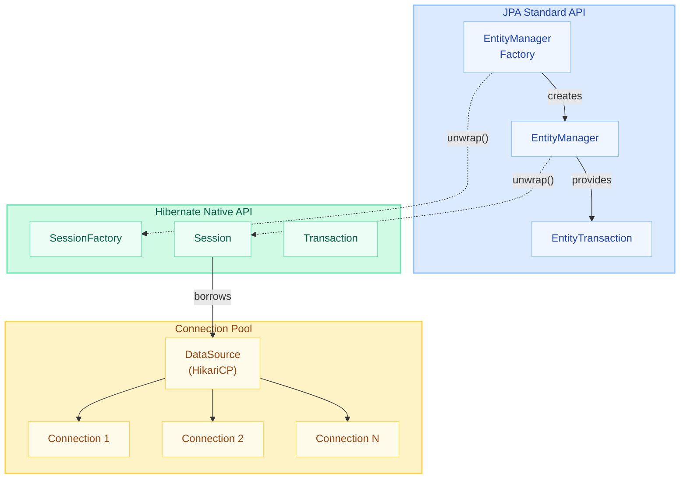

| JPA Interface | Hibernate Equivalent | Scope | Responsibility |
|---------------|---------------------|-------|----------------|
| `EntityManagerFactory` | `SessionFactory` | Application-wide singleton | Configuration, connection pooling, 2nd-level cache |
| `EntityManager` | `Session` | Per-request / per-transaction | First-level cache, dirty checking, CRUD |
| `EntityTransaction` | `Transaction` | Single unit of work | Begin, commit, rollback |

```java
// Accessing native Hibernate API from JPA
Session session = entityManager.unwrap(Session.class);
SessionFactory sf = entityManager.getEntityManagerFactory().unwrap(SessionFactory.class);

// Spring Boot auto-configures everything — you rarely create these manually
@PersistenceContext
private EntityManager em; // Injected, transaction-scoped proxy
```

---

## Persistence Context (First-Level Cache)

The **Persistence Context** is the central concept in JPA. It is an in-memory workspace that tracks entity instances and ensures consistency within a unit of work.

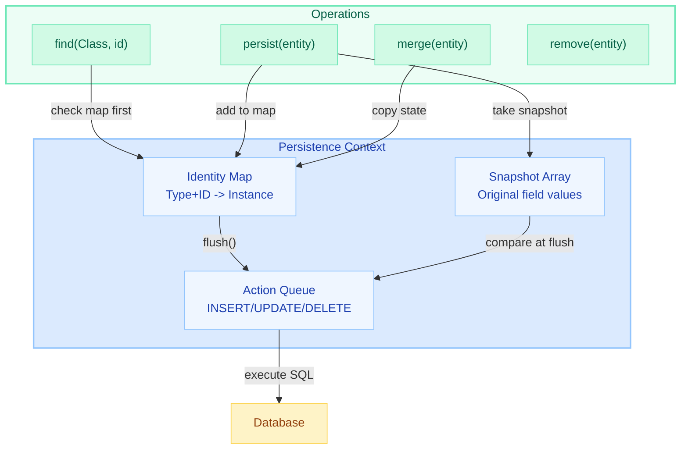

### Identity Map Guarantees

The identity map ensures **repeatable reads** within a persistence context:

```java
Order order1 = em.find(Order.class, 1L); // SQL: SELECT ... WHERE id = 1
Order order2 = em.find(Order.class, 1L); // NO SQL — returns cached instance

assert order1 == order2; // true! Same object reference (not just equals)

// JPQL also respects identity map
Order order3 = em.createQuery("SELECT o FROM Order o WHERE o.id = 1", Order.class)
                 .getSingleResult(); // SQL fires, but result is reconciled with map

assert order1 == order3; // true! Even from a query
```

### Snapshot Comparison

When an entity is loaded or persisted, Hibernate takes a **deep copy** of all persistent field values as an `Object[]` array:

```java
// Internal representation (simplified):
// Key: EntityKey(Order.class, id=1)
// Value: Order@7a3b2c1 (the live instance)
// Snapshot: Object[] { "PENDING", BigDecimal(100.00), Timestamp(...) }

// At flush time:
// Current:  Object[] { "SHIPPED", BigDecimal(100.00), Timestamp(...) }
// Snapshot: Object[] { "PENDING", BigDecimal(100.00), Timestamp(...) }
// Diff: index 0 changed → generate UPDATE for status column
```

!!! tip "Performance Consideration"
    Each managed entity consumes **double memory** (the instance + its snapshot). For batch processing with 100,000 entities, call `em.clear()` periodically to release both instances and snapshots.

---

## Entity Lifecycle States

Every JPA entity exists in exactly one of four states at any given time.

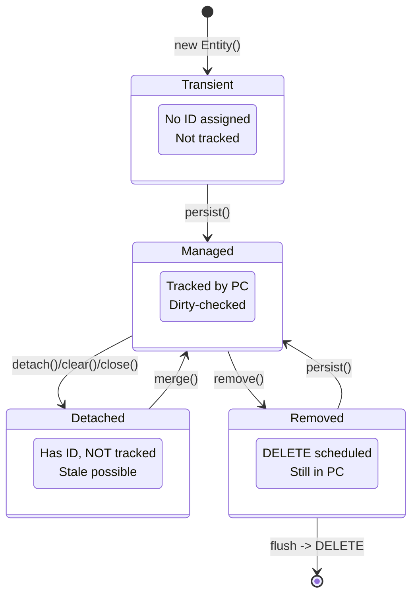

### State Transitions in Code

```java
// ========== TRANSIENT ==========
Order order = new Order();           // Transient: no ID, no PC
order.setStatus("NEW");

// ========== MANAGED ==========
em.persist(order);                   // Managed: ID assigned (or will be at flush)
                                     // Snapshot taken, INSERT queued

order.setStatus("CONFIRMED");        // Still managed — change auto-detected

// ========== DETACHED ==========
em.detach(order);                    // Detached: has ID, but no longer tracked
// OR: em.clear();                   // Detaches ALL entities
// OR: em.close();                   // Closes session — all entities detached

order.setStatus("SHIPPED");          // This change is INVISIBLE to Hibernate

// ========== RE-ATTACH ==========
Order managed = em.merge(order);     // Returns NEW managed copy
// WARNING: 'order' is still detached! Use 'managed' going forward.

// ========== REMOVED ==========
em.remove(managed);                  // Removed: DELETE queued for flush
// Entity still in memory, but will be deleted from DB on flush
```

!!! warning "Common Pitfall: merge() vs persist()"
    - `persist()` — makes the **same instance** managed. Fails if entity already has an ID managed elsewhere.
    - `merge()` — returns a **new managed copy**. The original is untouched. Always capture the return value.
    
    ```java
    // WRONG: using the original after merge
    em.merge(detachedOrder);
    detachedOrder.setNote("updated"); // This change is LOST!
    
    // CORRECT:
    Order managed = em.merge(detachedOrder);
    managed.setNote("updated"); // This is tracked
    ```

---

## Dirty Checking Mechanism

Hibernate's dirty checking uses **snapshot array comparison** at flush time to determine which entities need UPDATE statements.

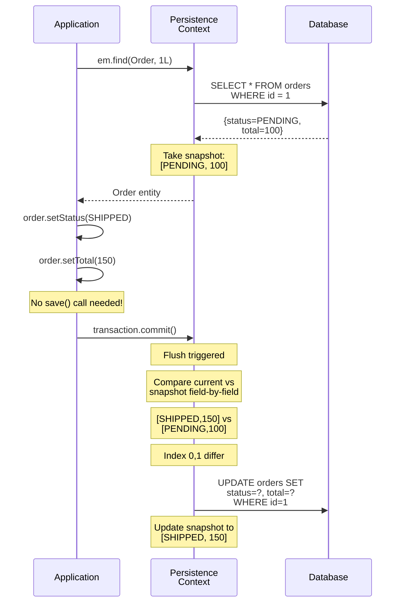

### How It Works Internally

1. **Load time**: Hibernate creates an `Object[]` snapshot of every persistent property
2. **Flush time**: For each managed entity, compare current values against snapshot
3. **Default behavior**: All columns included in UPDATE (even unchanged ones)
4. **Optimization**: `@DynamicUpdate` generates SQL with only changed columns

```java
@Entity
@DynamicUpdate // Only include changed columns in UPDATE
public class Order {
    // If only 'status' changed, generates:
    // UPDATE orders SET status = ? WHERE id = ?
    // Instead of:
    // UPDATE orders SET status = ?, total = ?, created = ?, ... WHERE id = ?
}
```

### Skipping Dirty Checking

```java
// Read-only transaction: skips dirty checking entirely
@Transactional(readOnly = true)
public List<Order> findRecentOrders() {
    return orderRepo.findByCreatedAfter(cutoff);
    // No snapshots taken, no flush, no dirty check
    // Significant memory + CPU savings for read queries
}

// StatelessSession: no persistence context at all
Session session = sf.unwrap(SessionFactory.class).openStatelessSession();
// No caching, no dirty checking, no cascades — raw SQL wrapper
```

---

## Flush Modes

Flushing synchronizes the persistence context with the database by executing queued SQL statements.

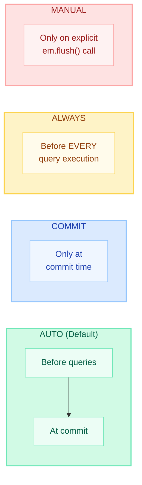

| Flush Mode | Trigger | Best For | Risk |
|-----------|---------|----------|------|
| **AUTO** | Before queries + at commit | General use | None (safe default) |
| **COMMIT** | Only at transaction commit | Performance when no mid-tx queries | Stale reads within transaction |
| **ALWAYS** | Before every query | Rare — when AUTO misses native queries | Performance overhead |
| **MANUAL** | Only `em.flush()` | Batch processing, full control | Forgetting to flush = data loss |

```java
// Set flush mode per session
em.unwrap(Session.class).setHibernateFlushMode(FlushMode.MANUAL);

// Batch processing with manual flush
@Transactional
public void importOrders(List<OrderDTO> dtos) {
    Session session = em.unwrap(Session.class);
    session.setHibernateFlushMode(FlushMode.MANUAL);
    
    for (int i = 0; i < dtos.size(); i++) {
        em.persist(toEntity(dtos.get(i)));
        if (i % 50 == 0) {
            em.flush();  // Execute 50 INSERTs
            em.clear();  // Release memory
        }
    }
    em.flush(); // Final batch
}
```

---

## Proxy Objects and Lazy Loading

Hibernate uses **proxy objects** to implement lazy loading. These are runtime-generated subclasses that intercept method calls.

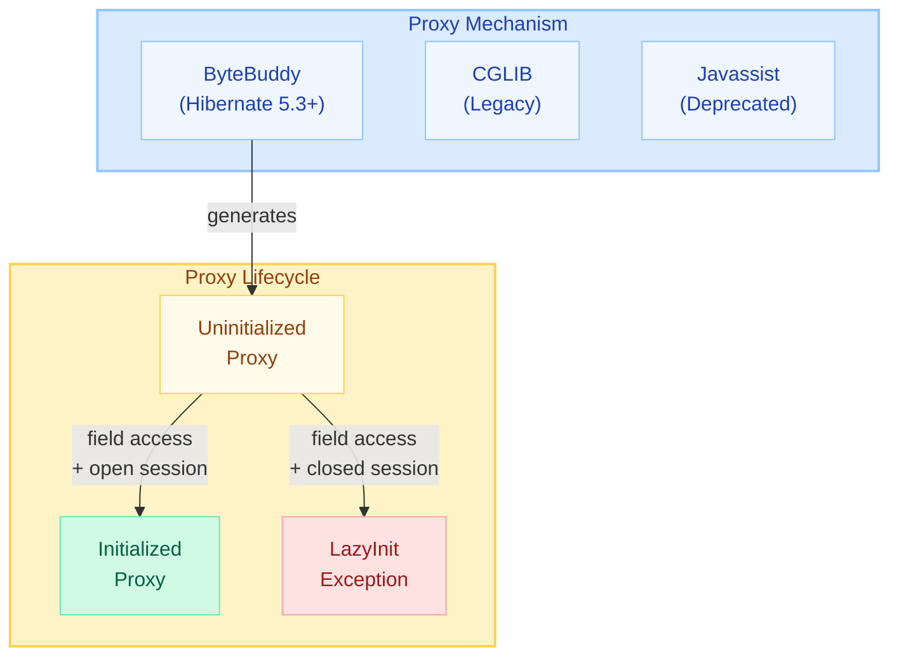

### How Proxies Work

```java
@Entity
public class Order {
    @ManyToOne(fetch = FetchType.LAZY)
    private Customer customer; // At load time, this is a PROXY, not a real Customer
}

// When you do:
Order order = em.find(Order.class, 1L);
// order.customer is a ByteBuddy-generated subclass of Customer
// It contains only the ID — no other fields loaded

order.getCustomer().getId();    // Returns ID without hitting DB (already in proxy)
order.getCustomer().getName();  // NOW triggers SQL: SELECT * FROM customers WHERE id = ?
```

### LazyInitializationException

```java
@Service
public class OrderService {
    @Transactional
    public Order getOrder(Long id) {
        return orderRepo.findById(id).orElseThrow();
    } // Transaction ends, Session closed
}

@RestController
public class OrderController {
    public OrderDTO getOrder(Long id) {
        Order order = orderService.getOrder(id);
        // Session is CLOSED here
        order.getCustomer().getName(); // LazyInitializationException!
    }
}
```

### Solutions to LazyInitializationException

```java
// Solution 1: JOIN FETCH in repository
@Query("SELECT o FROM Order o JOIN FETCH o.customer WHERE o.id = :id")
Optional<Order> findByIdWithCustomer(@Param("id") Long id);

// Solution 2: @EntityGraph
@EntityGraph(attributePaths = {"customer", "items"})
Optional<Order> findById(Long id);

// Solution 3: Hibernate.initialize() within transaction
@Transactional
public Order getOrderWithCustomer(Long id) {
    Order order = orderRepo.findById(id).orElseThrow();
    Hibernate.initialize(order.getCustomer()); // Force load
    return order;
}

// Solution 4: DTO Projection (best performance)
@Query("SELECT new com.app.OrderDTO(o.id, o.status, c.name) " +
       "FROM Order o JOIN o.customer c WHERE o.id = :id")
OrderDTO findOrderDTOById(@Param("id") Long id);
```

!!! tip "Proxy Detection"
    ```java
    // Check if a proxy is initialized
    boolean loaded = Hibernate.isInitialized(order.getCustomer());
    
    // Get the real class behind a proxy
    Class<?> realClass = Hibernate.getClass(order.getCustomer());
    // Returns Customer.class, not Customer$HibernateProxy$abc123
    ```

---

## Second-Level Cache (L2 Cache)

The L2 cache is a **region-based, shared cache** across all sessions within the same `SessionFactory`.

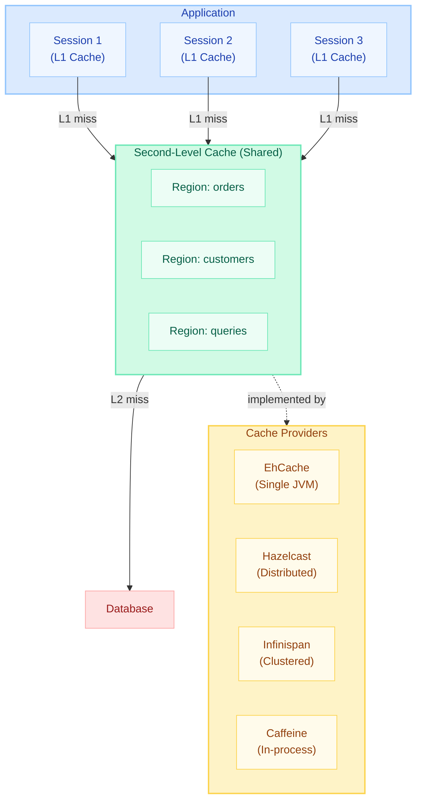

### Cache Concurrency Strategies

| Strategy | Consistency | Performance | Use Case |
|----------|-------------|-------------|----------|
| **READ_ONLY** | Perfect | Highest | Reference data (countries, enums) |
| **NONSTRICT_READ_WRITE** | Eventual | High | Rarely updated data (user profiles) |
| **READ_WRITE** | Strong (soft locks) | Medium | Frequently read, occasionally updated |
| **TRANSACTIONAL** | Full ACID | Lowest | JTA environments, critical data |

### Configuration

```java
@Entity
@Cache(usage = CacheConcurrencyStrategy.READ_WRITE, region = "orders")
public class Order {
    @Id
    private Long id;
    
    @Cache(usage = CacheConcurrencyStrategy.READ_ONLY) // Collection cache
    @OneToMany(mappedBy = "order")
    private List<OrderItem> items;
}
```

```yaml
# application.yml
spring:
  jpa:
    properties:
      hibernate:
        cache:
          use_second_level_cache: true
          use_query_cache: true
          region.factory_class: org.hibernate.cache.jcache.JCacheRegionFactory
        javax:
          cache:
            provider: org.ehcache.jsr107.EhcacheCachingProvider
```

### What Gets Cached

!!! info "L2 Cache Stores Dehydrated State"
    The L2 cache does NOT store entity objects. It stores **dehydrated state** — an `Object[]` of column values (similar to snapshots). When a cache hit occurs, Hibernate **rehydrates** the state into a new entity instance and places it in the L1 cache.

```java
// Cache lookup flow:
Order order = em.find(Order.class, 1L);
// 1. Check L1 (Persistence Context) — miss
// 2. Check L2 (Shared Cache) — hit! Returns Object[]{SHIPPED, 150, ...}
// 3. Rehydrate into Order instance
// 4. Place in L1 for remainder of session
// No SQL executed!
```

---

## Query Cache

The **Query Cache** caches the **result set identifiers** (primary keys) of JPQL/HQL queries. It works in tandem with the L2 entity cache.

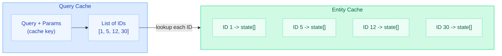

### When Query Cache Is Useful

| Scenario | Use Query Cache? | Why |
|----------|-----------------|-----|
| Lookup tables queried frequently | Yes | Same query, same results, rare updates |
| Dashboard aggregation queries | Maybe | If data changes infrequently |
| User-specific queries with varying params | No | Cache key includes params — too many unique entries |
| Tables with frequent writes | No | Entire region invalidated on ANY write to the table |

### Invalidation Problem

```java
// Query cache is INVALIDATED when ANY entity in the target table is modified
@Cacheable // This query is cached
@Query("SELECT o FROM Order o WHERE o.status = 'SHIPPED'")
List<Order> findShippedOrders();

// Now someone inserts a NEW order (status = 'PENDING')
orderRepo.save(new Order("PENDING"));
// The ENTIRE query cache region for "orders" is invalidated!
// Even though the new order wouldn't match the cached query!
```

!!! warning "Query Cache Gotcha"
    Query cache invalidation is **table-level**, not row-level. A single INSERT/UPDATE/DELETE to the `orders` table invalidates ALL cached queries that reference that table. This makes query cache counterproductive for frequently-written tables.

```java
// Enable query cache for specific queries
@QueryHints(@QueryHint(name = "org.hibernate.cacheable", value = "true"))
List<Country> findAllCountries(); // Good candidate — countries rarely change
```

---

## Entity Inheritance Mapping Strategies

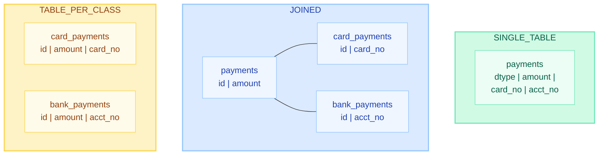

### Strategy Comparison

| Strategy | Table Count | Polymorphic Queries | Nulls | Performance |
|----------|------------|--------------------:|-------|-------------|
| **SINGLE_TABLE** | 1 | Fast (single table) | Many nullable columns | Best for queries |
| **JOINED** | N+1 | Slow (JOINs required) | No nulls | Normalized, but JOIN cost |
| **TABLE_PER_CLASS** | N | Slowest (UNION ALL) | No nulls | Avoid for polymorphic queries |

```java
// SINGLE_TABLE (default, recommended for most cases)
@Entity
@Inheritance(strategy = InheritanceType.SINGLE_TABLE)
@DiscriminatorColumn(name = "payment_type")
public abstract class Payment {
    @Id @GeneratedValue
    private Long id;
    private BigDecimal amount;
}

@Entity
@DiscriminatorValue("CARD")
public class CardPayment extends Payment {
    private String cardNumber; // NULL for non-card rows
}

@Entity
@DiscriminatorValue("BANK")
public class BankPayment extends Payment {
    private String accountNumber; // NULL for non-bank rows
}

// JOINED
@Entity
@Inheritance(strategy = InheritanceType.JOINED)
public abstract class Payment { /* ... */ }
// Each subclass has its own table with FK to payment.id

// TABLE_PER_CLASS
@Entity
@Inheritance(strategy = InheritanceType.TABLE_PER_CLASS)
public abstract class Payment { /* ... */ }
// Each subclass gets ALL columns duplicated — no shared table
```

!!! tip "Interview Recommendation"
    Default to **SINGLE_TABLE** unless you have a compelling reason otherwise. It is the most performant for polymorphic queries and the simplest to manage. Accept the nullable columns trade-off.

---

## Fetch Strategies and Cascade Types

### @ManyToOne / @OneToMany Fetch Defaults

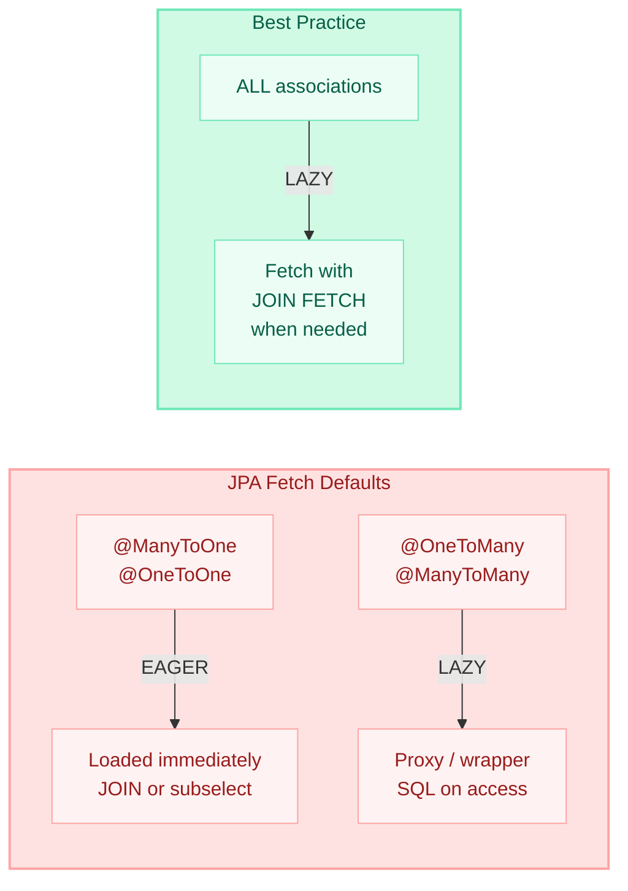

### Cascade Types Explained

| Cascade Type | Effect | Typical Use |
|-------------|--------|-------------|
| `PERSIST` | Parent persist cascades to children | Parent-child (Order -> Items) |
| `MERGE` | Parent merge cascades to children | Re-attaching object graphs |
| `REMOVE` | Parent delete cascades to children | Composition (delete children with parent) |
| `REFRESH` | Parent refresh cascades to children | Rare |
| `DETACH` | Parent detach cascades to children | Rare |
| `ALL` | All of the above | Aggregate roots only |

```java
@Entity
public class Order {
    
    // CORRECT: Lazy fetch + cascade for aggregate root
    @OneToMany(mappedBy = "order", 
               cascade = CascadeType.ALL,    // Order owns items lifecycle
               orphanRemoval = true,          // Delete items removed from collection
               fetch = FetchType.LAZY)
    private List<OrderItem> items = new ArrayList<>();
    
    // CORRECT: Lazy ManyToOne — no cascade (Customer is independent)
    @ManyToOne(fetch = FetchType.LAZY)
    @JoinColumn(name = "customer_id")
    private Customer customer;
    
    // Helper methods to maintain bidirectional consistency
    public void addItem(OrderItem item) {
        items.add(item);
        item.setOrder(this);
    }
    
    public void removeItem(OrderItem item) {
        items.remove(item);
        item.setOrder(null); // orphanRemoval will DELETE this from DB
    }
}
```

!!! danger "CascadeType.REMOVE Pitfall"
    Never use `CascadeType.REMOVE` (or `ALL`) on `@ManyToMany`. Deleting one entity would cascade-delete the related entities, which may be shared with other parents. Use `CascadeType.PERSIST` and `CascadeType.MERGE` only for many-to-many.

---

## Open Session In View (OSIV) Anti-Pattern

OSIV keeps the Hibernate `Session` open for the entire HTTP request lifecycle, including view rendering. It is **enabled by default** in Spring Boot.

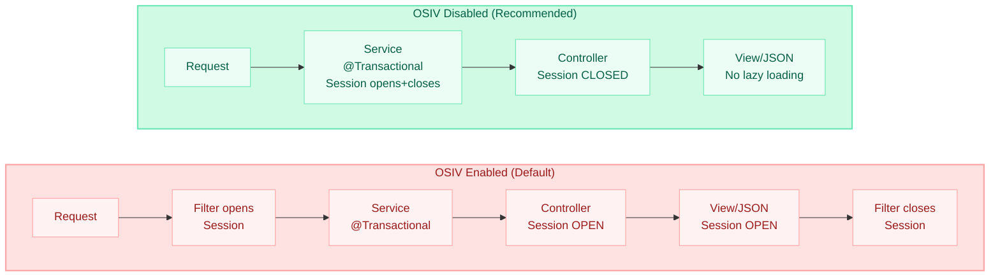

### Why OSIV Is Harmful

| Problem | Impact |
|---------|--------|
| **Connection held for entire request** | Under load, connections exhausted waiting for slow views |
| **N+1 queries hidden** | Lazy loads in views fire without developer awareness |
| **Unpredictable SQL** | Template changes can introduce new queries |
| **Service layer leaks** | Entities used outside transactional boundary |

### Disabling OSIV

```yaml
# application.yml — DISABLE OSIV
spring:
  jpa:
    open-in-view: false  # Recommended for production
```

```java
// With OSIV disabled, use proper data fetching:
@Service
public class OrderService {
    
    @Transactional(readOnly = true)
    public OrderDTO getOrderDetails(Long id) {
        Order order = orderRepo.findByIdWithCustomerAndItems(id); // JOIN FETCH
        return OrderDTO.from(order); // Map to DTO within transaction
    }
}
```

!!! warning "Spring Boot Default"
    Spring Boot enables OSIV by default and logs a warning at startup:
    ```
    WARN: spring.jpa.open-in-view is enabled by default. 
    Therefore, database queries may be performed during view rendering.
    ```
    Always set `spring.jpa.open-in-view=false` in production applications.

---

## Quick Recall

| Concept | Key Point |
|---------|-----------|
| **EntityManager vs Session** | Same thing — Session is Hibernate's implementation of EntityManager |
| **Persistence Context** | Identity map + snapshot array, scoped to one session |
| **L1 Cache** | IS the persistence context — cannot be disabled |
| **Entity States** | Transient -> Managed -> Detached -> Removed |
| **Dirty Checking** | Compares current Object[] to snapshot Object[] at flush |
| **Flush Modes** | AUTO (default) flushes before queries and at commit |
| **Proxy** | ByteBuddy-generated subclass, initialized on first non-ID access |
| **LazyInitException** | Accessing proxy after session close — use JOIN FETCH or DTO |
| **L2 Cache** | Shared across sessions, stores dehydrated state, region-based |
| **Query Cache** | Stores query -> ID list; invalidated on ANY table write |
| **SINGLE_TABLE** | Best inheritance strategy for polymorphic queries (nullable columns) |
| **OSIV** | Anti-pattern — holds connection for full request; disable in prod |
| **CascadeType.ALL** | Only on aggregate roots (parent -> children owned exclusively) |
| **readOnly = true** | Skips dirty checking + snapshot — major perf win for reads |

---

## Interview Cheat Sheet

??? example "Tell me about Hibernate's first-level cache"
    **Answer**: The first-level cache IS the persistence context. It's an identity map (EntityKey -> instance) that guarantees repeatable reads within a session. Same entity loaded twice returns the exact same object reference. It cannot be disabled — it's intrinsic to how Hibernate works. It also stores a snapshot array for dirty checking.

??? example "How does dirty checking work?"
    **Answer**: At load time, Hibernate copies all entity field values into an Object[] snapshot. At flush time, it iterates every managed entity and compares current field values against the snapshot index-by-index. Any differences generate an UPDATE statement. By default, ALL columns are included in the UPDATE. Use `@DynamicUpdate` for partial updates or `readOnly=true` transactions to skip dirty checking entirely.

??? example "Explain the difference between persist() and merge()"
    **Answer**: `persist()` makes the given instance managed in the persistence context and queues an INSERT. The same object reference becomes managed. `merge()` copies the state from a detached entity onto a managed instance (loading from DB if needed) and returns the managed copy. The original detached object remains detached. Always use the return value of merge().

??? example "What is the second-level cache and when would you use it?"
    **Answer**: The L2 cache is shared across all sessions/transactions within a SessionFactory. It stores entity state in dehydrated form (Object[] arrays, not full objects). Best for: reference data (countries, config), read-heavy entities, rarely-updated lookup tables. Use `@Cache` annotation with appropriate concurrency strategy. Providers include EhCache (single JVM), Hazelcast/Infinispan (distributed).

??? example "Why is Open Session In View considered an anti-pattern?"
    **Answer**: OSIV holds a database connection for the entire HTTP request, including view rendering. This leads to: connection pool exhaustion under load, hidden N+1 queries in views, unpredictable SQL from template changes, and service layer abstraction leaks. The fix is disabling OSIV (`spring.jpa.open-in-view=false`) and using JOIN FETCH or DTO projections within transactional service methods.

??? example "Compare inheritance mapping strategies"
    **Answer**: **SINGLE_TABLE** (default): one table, discriminator column, nullable columns for subclass fields — best performance for polymorphic queries. **JOINED**: each class gets its own table with FK relationships — normalized but requires JOINs. **TABLE_PER_CLASS**: each concrete class gets a complete table — avoids nulls but polymorphic queries require UNION ALL. Recommend SINGLE_TABLE unless normalization requirements dictate otherwise.
