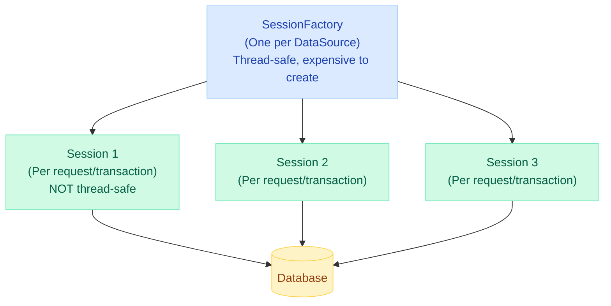
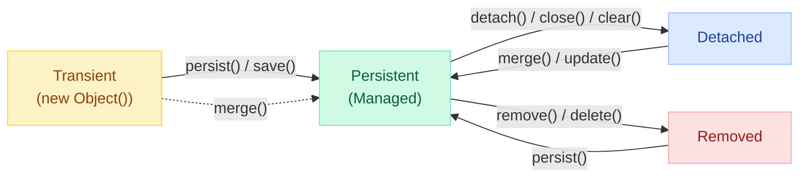
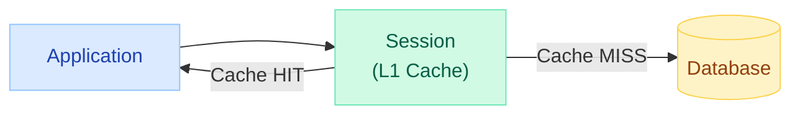
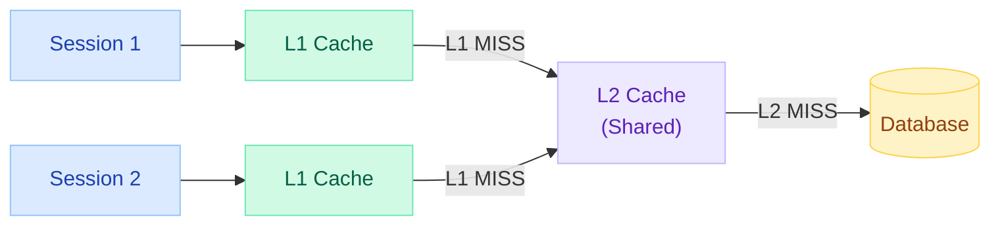
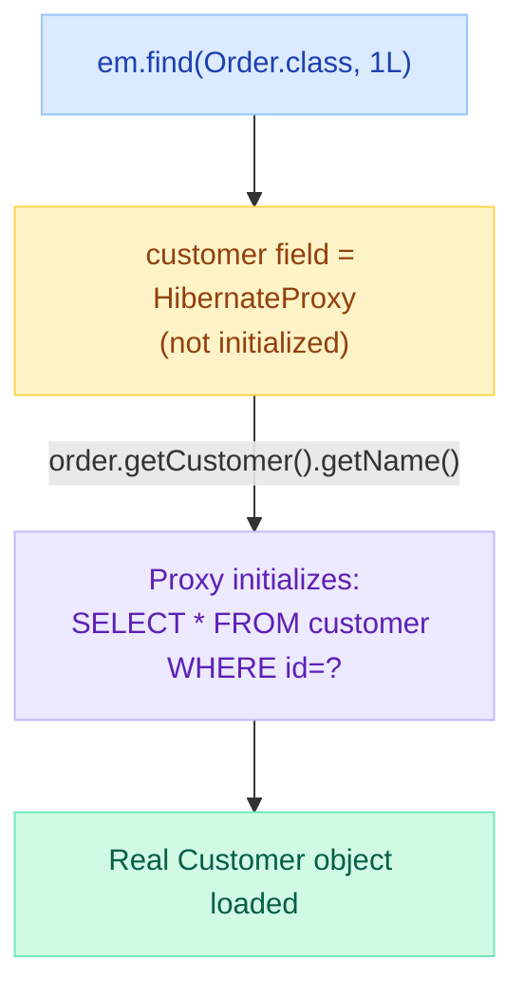
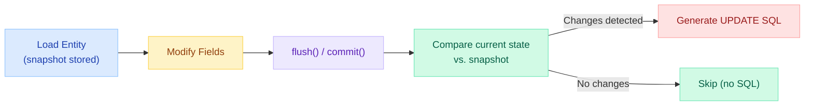
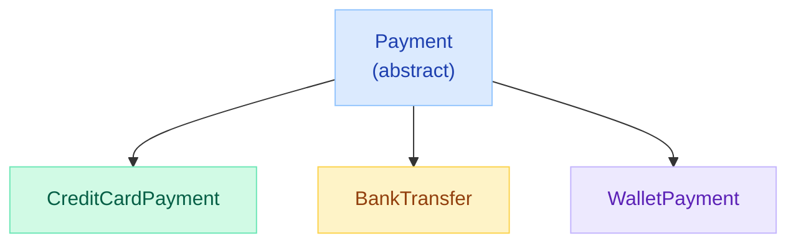

# Hibernate Deep Dive — Sessions, Caching & HQL

> **Production Incident:** An e-commerce platform experienced 10x database load during a flash sale. Root cause: missing second-level cache configuration and N+1 queries loading product images. A single Hibernate configuration change reduced DB calls from 50,000/sec to 5,000/sec.

---

!!! abstract "Why This Matters"
    Hibernate is the most widely used JPA implementation. Understanding its internals — entity lifecycle, caching layers, and query mechanisms — separates developers who write working code from those who write performant code.

---

## SessionFactory vs Session vs EntityManager



| Component | JPA Equivalent | Lifecycle | Thread-Safe? |
|---|---|---|---|
| `SessionFactory` | `EntityManagerFactory` | Application-scoped (singleton) | Yes |
| `Session` | `EntityManager` | Request/transaction-scoped | **No** |
| `Transaction` | `EntityTransaction` | Within a session | No |
| `Configuration` | `persistence.xml` / `Persistence` | Bootstrap only | N/A |

### Creation Example

```java
// Hibernate Native API
SessionFactory sessionFactory = new Configuration()
    .configure("hibernate.cfg.xml")
    .buildSessionFactory();

try (Session session = sessionFactory.openSession()) {
    Transaction tx = session.beginTransaction();
    session.persist(new Order("ORD-001", BigDecimal.valueOf(99.99)));
    tx.commit();
}

// JPA API (Spring manages this)
@PersistenceContext
private EntityManager em; // This wraps a Hibernate Session
```

### Session vs EntityManager Mapping

| Hibernate Session | JPA EntityManager | Purpose |
|---|---|---|
| `session.save(entity)` | `em.persist(entity)` | Insert new entity |
| `session.get(Class, id)` | `em.find(Class, id)` | Load by primary key |
| `session.update(entity)` | `em.merge(entity)` | Reattach detached entity |
| `session.delete(entity)` | `em.remove(entity)` | Delete entity |
| `session.createQuery(hql)` | `em.createQuery(jpql)` | Create query |
| `session.flush()` | `em.flush()` | Sync to DB |
| `session.evict(entity)` | `em.detach(entity)` | Remove from persistence context |
| `session.clear()` | `em.clear()` | Clear all managed entities |

---

## Entity Lifecycle States



| State | In Persistence Context? | Has DB Row? | Dirty Checking? | Description |
|---|---|---|---|---|
| **Transient** | No | No | No | Newly created, not yet persisted |
| **Persistent** | Yes | Yes (or pending INSERT) | Yes | Managed by Session, changes auto-synced |
| **Detached** | No | Yes | No | Was managed, session closed/cleared |
| **Removed** | Yes (marked for deletion) | Yes (pending DELETE) | No | Scheduled for removal on flush |

```java
// State transitions in code
Session session = sessionFactory.openSession();
Transaction tx = session.beginTransaction();

// TRANSIENT: not associated with any session
Order order = new Order("ORD-001", BigDecimal.valueOf(99.99));

// PERSISTENT: managed by session, dirty checking active
session.persist(order);
order.setAmount(BigDecimal.valueOf(109.99)); // Auto-detected at flush!

// REMOVED: scheduled for DELETE
session.remove(order);

tx.commit();
session.close();

// DETACHED: session is closed, entity is no longer managed
order.setAmount(BigDecimal.valueOf(50.00)); // No effect on DB!

// Re-attach to new session
Session session2 = sessionFactory.openSession();
session2.beginTransaction();
Order managed = session2.merge(order); // PERSISTENT again
session2.getTransaction().commit();
```

---

## First-Level Cache (Session Cache)

The first-level cache is **always enabled** and cannot be disabled. It is scoped to the `Session` (persistence context).



### Behavior

```java
Session session = sessionFactory.openSession();

// First call: hits database (SELECT)
Order order1 = session.get(Order.class, 1L);

// Second call: returns SAME instance from L1 cache (no SQL)
Order order2 = session.get(Order.class, 1L);

assert order1 == order2; // Same object reference! Identity guarantee.

// evict removes from L1 cache
session.evict(order1);

// Now hits database again
Order order3 = session.get(Order.class, 1L);
assert order1 != order3; // Different object
```

### Key Properties

| Property | Behavior |
|---|---|
| Scope | Per-Session (not shared across sessions) |
| Disable | Cannot be disabled |
| Clear | `session.clear()` or `session.evict(entity)` |
| Identity | Same ID always returns same object instance |
| Size | Unbounded (can cause OOM for batch operations) |
| Flush | Dirty entities written to DB on `flush()` or `commit()` |

!!! warning "Memory Leak with L1 Cache"
    Loading thousands of entities in a single session fills the L1 cache. For batch operations, call `session.clear()` periodically or use `StatelessSession`.

---

## Second-Level Cache (Shared Cache)

The second-level (L2) cache is **shared across all sessions** in the same SessionFactory. It must be explicitly enabled and configured.



### Configuration

```properties
# application.properties
spring.jpa.properties.hibernate.cache.use_second_level_cache=true
spring.jpa.properties.hibernate.cache.region.factory_class=org.hibernate.cache.jcache.JCacheRegionFactory
spring.jpa.properties.hibernate.javax.cache.provider=org.ehcache.jsr107.EhcacheCachingProvider
spring.jpa.properties.hibernate.javax.cache.uri=classpath:ehcache.xml
```

### Entity Annotation

```java
@Entity
@Cache(usage = CacheConcurrencyStrategy.READ_WRITE)
public class Product {

    @Id
    @GeneratedValue(strategy = GenerationType.IDENTITY)
    private Long id;

    private String name;
    private BigDecimal price;

    @Cache(usage = CacheConcurrencyStrategy.READ_WRITE)
    @OneToMany(mappedBy = "product", fetch = FetchType.LAZY)
    private List<Review> reviews; // Collection cache
}
```

### Cache Concurrency Strategies

| Strategy | Use Case | Consistency | Performance |
|---|---|---|---|
| `READ_ONLY` | Reference data (countries, currencies) | Strong | Best |
| `NONSTRICT_READ_WRITE` | Rarely updated, eventual consistency OK | Weak | Good |
| `READ_WRITE` | Frequently read, occasionally written | Strong (soft lock) | Moderate |
| `TRANSACTIONAL` | Requires JTA transaction manager | Strong (XA) | Slowest |

### Popular L2 Cache Providers

| Provider | Best For | Distributed? |
|---|---|---|
| **Ehcache** | Single-node apps, moderate datasets | No (Ehcache 3 + Terracotta for distributed) |
| **Hazelcast** | Distributed microservices | Yes |
| **Infinispan** | JBoss/WildFly, large clusters | Yes |
| **Redis** (via Redisson) | Cloud-native, already using Redis | Yes |
| **Caffeine** | In-memory, highest performance single node | No |

---

## Query Cache

The query cache stores **query results** (entity IDs, not full entities). It works with L2 cache to avoid redundant SQL.

```java
// Enable query cache
// application.properties
// spring.jpa.properties.hibernate.cache.use_query_cache=true

// Mark query as cacheable
List<Product> products = session.createQuery(
        "FROM Product p WHERE p.category = :cat", Product.class)
    .setParameter("cat", "Electronics")
    .setCacheable(true)
    .setCacheRegion("product-by-category")
    .getResultList();
```

!!! warning "Query Cache Invalidation"
    The query cache is invalidated whenever ANY entity in the related table is modified. For frequently-updated tables, the query cache causes more harm than good (constant invalidation).

---

## HQL vs JPQL vs Criteria API vs Native SQL

| Feature | HQL | JPQL | Criteria API | Native SQL |
|---|---|---|---|---|
| **Syntax** | Hibernate-specific | JPA standard | Programmatic (Java API) | Raw SQL |
| **Portability** | Hibernate only | Any JPA provider | Any JPA provider | Database-specific |
| **Type-safe** | No (strings) | No (strings) | Yes (metamodel) | No |
| **Dynamic queries** | String concatenation | String concatenation | Builder pattern | String concatenation |
| **Complex joins** | Good | Good | Verbose but safe | Full control |
| **DB functions** | Limited | Limited | Limited | Full access |

### HQL Example

```java
// HQL (Hibernate Query Language) - object-oriented SQL
List<Order> orders = session.createQuery(
    "SELECT o FROM Order o " +
    "JOIN FETCH o.customer c " +
    "WHERE c.tier = :tier AND o.total > :minTotal " +
    "ORDER BY o.createdAt DESC", Order.class)
    .setParameter("tier", CustomerTier.PREMIUM)
    .setParameter("minTotal", BigDecimal.valueOf(100))
    .setMaxResults(50)
    .getResultList();
```

### JPQL Example

```java
// JPQL (JPA Query Language) - subset of HQL, portable
@Query("SELECT new com.app.dto.OrderSummary(o.id, o.total, c.name) " +
       "FROM Order o JOIN o.customer c " +
       "WHERE o.status = :status")
List<OrderSummary> findOrderSummaries(@Param("status") OrderStatus status);
```

### Criteria API Example

```java
// Type-safe, dynamic query building
CriteriaBuilder cb = em.getCriteriaBuilder();
CriteriaQuery<Order> cq = cb.createQuery(Order.class);
Root<Order> order = cq.from(Order.class);
Join<Order, Customer> customer = order.join("customer");

List<Predicate> predicates = new ArrayList<>();
if (minTotal != null) {
    predicates.add(cb.greaterThan(order.get("total"), minTotal));
}
if (status != null) {
    predicates.add(cb.equal(order.get("status"), status));
}

cq.where(predicates.toArray(new Predicate[0]));
cq.orderBy(cb.desc(order.get("createdAt")));

List<Order> results = em.createQuery(cq)
    .setMaxResults(50)
    .getResultList();
```

### Native SQL Example

```java
// When you need database-specific features
@Query(value = "SELECT * FROM orders o " +
               "WHERE o.created_at > NOW() - INTERVAL '7 days' " +
               "AND o.total > :minTotal " +
               "FOR UPDATE SKIP LOCKED", nativeQuery = true)
List<Order> findRecentOrdersForProcessing(@Param("minTotal") BigDecimal minTotal);
```

---

## Lazy Loading: Proxies and Collections

### How Lazy Loading Works



```java
@Entity
public class Order {

    @ManyToOne(fetch = FetchType.LAZY)  // Default for @ManyToOne is EAGER!
    private Customer customer; // Loaded as proxy

    @OneToMany(mappedBy = "order", fetch = FetchType.LAZY) // Default
    private List<OrderItem> items; // PersistentBag (lazy collection)
}

// Accessing outside session throws LazyInitializationException
Order order = orderRepository.findById(1L).orElseThrow();
// Session closes after repository call...
order.getCustomer().getName(); // LazyInitializationException!
```

### Solutions for LazyInitializationException

| Approach | Pros | Cons |
|---|---|---|
| `JOIN FETCH` in query | Precise, no extra queries | Must write custom queries |
| `@EntityGraph` | Declarative, reusable | Less flexible |
| `@Transactional` on service | Simple | May keep connection too long |
| DTO projection | Best performance | More code |
| `Hibernate.initialize()` | Quick fix | Still in session |
| Open Session in View | Zero code changes | **Anti-pattern** (N+1, long connections) |

```java
// JOIN FETCH solution
@Query("SELECT o FROM Order o JOIN FETCH o.customer JOIN FETCH o.items WHERE o.id = :id")
Optional<Order> findByIdWithDetails(@Param("id") Long id);

// EntityGraph solution
@EntityGraph(attributePaths = {"customer", "items"})
Optional<Order> findById(Long id);
```

---

## Dirty Checking Mechanism

Hibernate automatically detects changes to persistent entities and generates UPDATE statements at flush time.



### How It Works Internally

1. When an entity is loaded, Hibernate stores a **snapshot** (deep copy of field values)
2. At flush time, Hibernate compares current state to the snapshot
3. If any field changed, an UPDATE is generated
4. By default, ALL columns are included in UPDATE (for PreparedStatement caching)

```java
@Transactional
public void updatePrice(Long productId, BigDecimal newPrice) {
    Product product = em.find(Product.class, productId);
    product.setPrice(newPrice); // NO explicit save/update needed!
    // Hibernate detects the change and generates:
    // UPDATE product SET name=?, price=?, ... WHERE id=?
}
```

### Optimizing Dirty Checking

```java
@Entity
@DynamicUpdate // Only include changed columns in UPDATE
@DynamicInsert // Only include non-null columns in INSERT
public class Product {
    // With @DynamicUpdate:
    // UPDATE product SET price=? WHERE id=?  (only changed column)
}

// Disable dirty checking for read-only operations
@Transactional(readOnly = true) // Skips dirty checking entirely
public List<Product> searchProducts(String keyword) {
    return productRepository.findByNameContaining(keyword);
}
```

---

## Batch Processing

### Standard Batching

```properties
# application.properties
spring.jpa.properties.hibernate.jdbc.batch_size=50
spring.jpa.properties.hibernate.order_inserts=true
spring.jpa.properties.hibernate.order_updates=true
spring.jpa.properties.hibernate.batch_versioned_data=true
```

```java
@Transactional
public void importProducts(List<ProductDTO> dtos) {
    for (int i = 0; i < dtos.size(); i++) {
        Product product = mapper.toEntity(dtos.get(i));
        em.persist(product);

        if (i % 50 == 0) { // Match batch_size
            em.flush();  // Execute batched INSERTs
            em.clear();  // Release L1 cache memory
        }
    }
}
```

### StatelessSession (No L1 Cache, No Dirty Checking)

```java
// For large batch operations where persistence context overhead is unacceptable
StatelessSession stateless = sessionFactory.openStatelessSession();
Transaction tx = stateless.beginTransaction();

ScrollableResults results = stateless.createQuery("FROM Order WHERE status = :s")
    .setParameter("s", OrderStatus.PENDING)
    .scroll(ScrollMode.FORWARD_ONLY);

int count = 0;
while (results.next()) {
    Order order = (Order) results.get(0);
    order.setStatus(OrderStatus.PROCESSING);
    stateless.update(order); // Explicit update required (no dirty checking)
    count++;
}

tx.commit();
stateless.close();
log.info("Updated {} orders", count);
```

| Feature | Session | StatelessSession |
|---|---|---|
| L1 Cache | Yes | No |
| Dirty checking | Yes | No |
| Cascades | Yes | No |
| Interceptors/Events | Yes | No |
| Memory usage | High (large batches) | Minimal |
| Use case | Normal CRUD | Bulk ETL operations |

---

## Inheritance Mapping Strategies



| Strategy | Tables | Polymorphic Query | NULL Columns | Joins | Best For |
|---|---|---|---|---|---|
| `SINGLE_TABLE` | 1 table for all | Fast (no joins) | Many NULLs | None | Few subclasses, performance-critical |
| `JOINED` | 1 per class in hierarchy | Moderate (joins required) | None | Yes | Normalized data, many shared fields |
| `TABLE_PER_CLASS` | 1 per concrete class | Slow (UNION ALL) | None | None | Independent subclasses, no polymorphic queries |

### SINGLE_TABLE (Default)

```java
@Entity
@Inheritance(strategy = InheritanceType.SINGLE_TABLE)
@DiscriminatorColumn(name = "payment_type", discriminatorType = DiscriminatorType.STRING)
public abstract class Payment {
    @Id @GeneratedValue private Long id;
    private BigDecimal amount;
    private LocalDateTime createdAt;
}

@Entity
@DiscriminatorValue("CREDIT_CARD")
public class CreditCardPayment extends Payment {
    private String cardNumber;  // NULL for other types
    private String expiryDate;
}

@Entity
@DiscriminatorValue("BANK_TRANSFER")
public class BankTransfer extends Payment {
    private String iban;        // NULL for other types
    private String bic;
}
// Single table: payment(id, amount, created_at, payment_type, card_number, expiry_date, iban, bic)
```

### JOINED

```java
@Entity
@Inheritance(strategy = InheritanceType.JOINED)
public abstract class Payment {
    @Id @GeneratedValue private Long id;
    private BigDecimal amount;
}

@Entity
public class CreditCardPayment extends Payment {
    private String cardNumber;
    // Table: credit_card_payment(id FK, card_number)
}
// Polymorphic query: SELECT p.*, cc.* FROM payment p LEFT JOIN credit_card_payment cc ON p.id = cc.id
```

### TABLE_PER_CLASS

```java
@Entity
@Inheritance(strategy = InheritanceType.TABLE_PER_CLASS)
public abstract class Payment {
    @Id @GeneratedValue private Long id;
    private BigDecimal amount;
}

@Entity
public class CreditCardPayment extends Payment {
    private String cardNumber;
    // Table: credit_card_payment(id, amount, card_number) -- all fields duplicated
}
// Polymorphic query: SELECT * FROM credit_card_payment UNION ALL SELECT * FROM bank_transfer ...
```

---

## Common N+1 Problem

The N+1 problem occurs when loading a collection triggers N additional queries.

```java
// BAD: N+1 queries
List<Order> orders = orderRepository.findAll(); // 1 query
for (Order order : orders) {
    order.getCustomer().getName(); // N queries (one per order)!
}

// GOOD: JOIN FETCH (1 query)
@Query("SELECT o FROM Order o JOIN FETCH o.customer")
List<Order> findAllWithCustomers();

// GOOD: @EntityGraph
@EntityGraph(attributePaths = {"customer"})
List<Order> findAll();

// GOOD: @BatchSize on collection
@OneToMany(mappedBy = "order")
@BatchSize(size = 25) // Load 25 customers per query instead of 1
private List<OrderItem> items;
```

!!! tip "Detecting N+1 Problems"
    Enable `spring.jpa.properties.hibernate.generate_statistics=true` in dev. Use libraries like `datasource-proxy` or `p6spy` to log actual SQL count per request.

For more details, see [N+1 Problem & JPA Internals](n-plus-one-jpa.md).

---

## Flush Modes

| Mode | When Flushes | Use Case |
|---|---|---|
| `AUTO` (default) | Before query execution, on commit | Normal operations |
| `COMMIT` | Only on commit | Read-heavy operations (skip pre-query flush) |
| `ALWAYS` | Before every query | Rare, for testing |
| `MANUAL` | Only when `flush()` is called explicitly | Full control |

```java
session.setHibernateFlushMode(FlushMode.COMMIT); // Optimize read-heavy session
```

---

## Interview Questions

??? question "Q: Explain the four entity lifecycle states in Hibernate and how an entity transitions between them."
    1. **Transient**: Object created with `new`, not associated with any Session. No database identity.
    2. **Persistent**: Associated with an open Session. Has database identity. Changes are automatically detected (dirty checking) and synced to DB on flush.
    3. **Detached**: Was persistent, but Session was closed/cleared. Has DB identity but changes are NOT tracked.
    4. **Removed**: Scheduled for deletion. Still in persistence context but will be deleted on flush/commit.

    Transitions: `new` -> Transient; `persist()/save()` -> Persistent; `close()/clear()/evict()` -> Detached; `merge()` -> Persistent (from Detached); `remove()/delete()` -> Removed.

??? question "Q: What is the difference between first-level cache and second-level cache in Hibernate?"
    **First-level (L1) cache**: Per-Session, always enabled, cannot be disabled. Guarantees entity identity within a session (same ID = same object reference). Cleared when session closes.

    **Second-level (L2) cache**: Shared across all sessions in a SessionFactory. Must be explicitly enabled. Stores entity data (not objects) in a region-based cache (Ehcache, Hazelcast, etc.). Requires `@Cache` annotation on entities. Survives session boundaries.

    L1 is checked first. On L1 miss, L2 is checked. On L2 miss, database is queried. L2 stores dehydrated state (column values), not entity instances.

??? question "Q: How does Hibernate dirty checking work, and how can you optimize it for read-only operations?"
    Hibernate stores a **snapshot** of entity field values when loaded. At flush time, it compares current state to the snapshot field-by-field. If differences are found, an UPDATE is generated.

    Optimization: (1) Use `@Transactional(readOnly = true)` -- disables dirty checking entirely. (2) Use `@DynamicUpdate` -- only include changed columns in UPDATE. (3) For bulk reads, use DTO projections instead of entities. (4) Use `StatelessSession` for batch operations (no persistence context at all).

??? question "Q: When would you choose SINGLE_TABLE vs JOINED inheritance mapping?"
    **SINGLE_TABLE**: Best for performance. Single table, no joins. Polymorphic queries are fast. Downsides: many NULL columns, cannot enforce NOT NULL on subclass fields. Choose when: few subclass-specific fields, performance is critical, subclasses are similar.

    **JOINED**: Best for data integrity. Normalized, no NULLs, NOT NULL constraints work. Downsides: requires JOINs for polymorphic queries (slower). Choose when: many subclass-specific fields, data integrity matters, subclasses are very different.

    Rule of thumb: prefer SINGLE_TABLE unless you have >5 subclass-specific columns or need strict constraints.

??? question "Q: What is the difference between HQL, JPQL, Criteria API, and Native SQL? When would you use each?"
    - **HQL**: Hibernate-specific query language. Supports all Hibernate features. Use when: Hibernate-only project, need Hibernate-specific features.
    - **JPQL**: JPA standard subset of HQL. Portable across JPA providers. Use when: portability matters, standard queries.
    - **Criteria API**: Type-safe, programmatic query building. Use when: dynamic queries (filters built at runtime), refactoring safety.
    - **Native SQL**: Raw database SQL. Use when: DB-specific features (window functions, CTEs, SKIP LOCKED), performance-critical queries needing specific execution plans.

    In practice with Spring Data JPA: use method names for simple queries, `@Query` with JPQL for moderate queries, Specifications (Criteria API wrapper) for dynamic filters, and `nativeQuery = true` for complex DB-specific operations.

---

## Quick Recall

| Concept | Key Point |
|---|---|
| **SessionFactory** | Singleton, thread-safe, expensive to create |
| **Session** | Per-request, NOT thread-safe, wraps JDBC connection |
| **L1 Cache** | Always ON, per-Session, identity guarantee |
| **L2 Cache** | Optional, shared across sessions, needs `@Cache` |
| **Query Cache** | Stores query result IDs, invalidated on table modification |
| **Dirty Checking** | Snapshot comparison at flush time |
| **Lazy Loading** | Proxy/PersistentBag, triggers on first access |
| **N+1 Fix** | `JOIN FETCH`, `@EntityGraph`, `@BatchSize` |
| **Batch Processing** | `flush()`/`clear()` every N rows, or use `StatelessSession` |
| **Inheritance Default** | `SINGLE_TABLE` (fastest queries, most NULLs) |
| **JPQL vs HQL** | JPQL is portable subset; HQL is Hibernate-specific superset |
| **`readOnly = true`** | Disables dirty checking, improves read performance |

---

## See Also

- [N+1 Problem & JPA Internals](n-plus-one-jpa.md) — Detailed N+1 detection and solutions
- [Spring Data JPA](spring-data-jpa.md) — Repository pattern built on Hibernate
- [Transactions](transactions.md) — Transaction propagation and isolation levels
- [Caching](caching.md) — Spring Cache abstraction over L2 cache
- [Hibernate & JPA Internals](hibernate-internals.md) — Additional JPA internals
