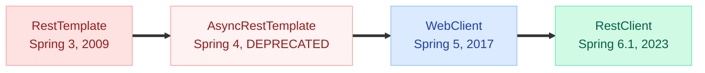
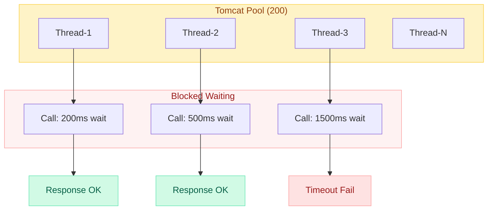
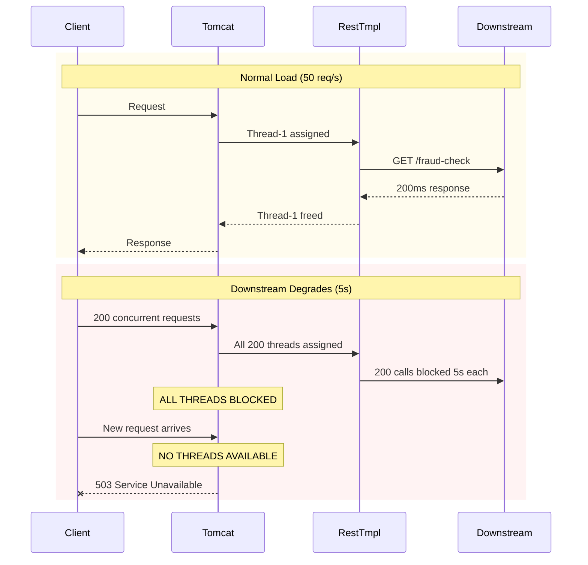
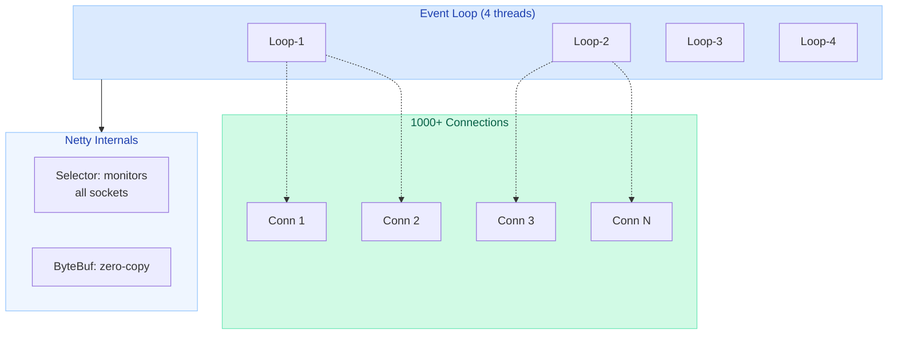
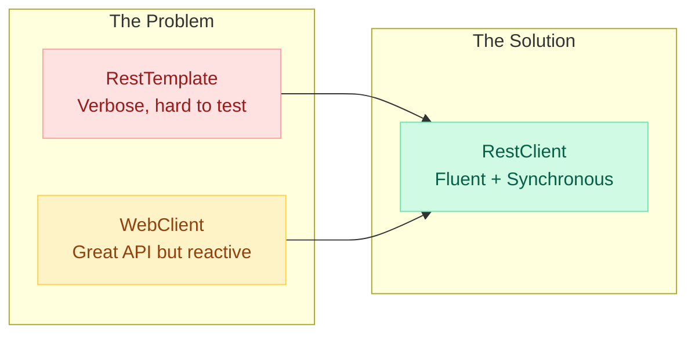
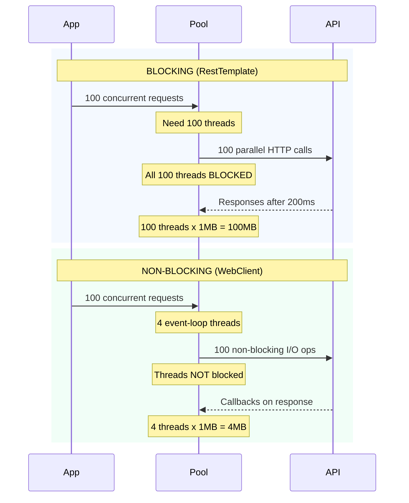
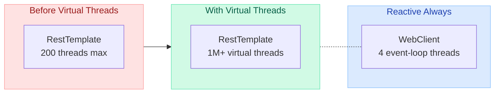

# HTTP Clients: RestTemplate vs WebClient vs RestClient

> "The right HTTP client is the one that matches your application's concurrency model. Choose wrong, and you'll learn about thread pool exhaustion at 3 AM."

---

## The Incident That Changed Everything

!!! danger "Production Incident: RestTemplate Thread Pool Exhaustion"
    **What happened:** A payment service using RestTemplate with default settings called a slow downstream fraud-detection API. Under Black Friday load, all 200 Tomcat threads became blocked waiting for responses (30s timeout). No thread was available to serve ANY request — health checks failed, load balancer marked the service dead, and the entire checkout flow collapsed for 12 minutes.

    **Root cause:** Synchronous blocking + finite thread pool + slow downstream = total service unavailability.

    **Fix:** Migrated critical paths to WebClient with explicit timeouts (2s connect, 5s response), circuit breaker (Resilience4j), and connection pooling. Thread count dropped from 200 to 16 event-loop threads handling 10x the throughput.

---

## Evolution Timeline



| Client | Introduced | Model | Status |
|--------|-----------|-------|--------|
| **RestTemplate** | Spring 3 (2009) | Synchronous, blocking | Maintenance mode (no new features) |
| **AsyncRestTemplate** | Spring 4 (2014) | Async with callbacks | Deprecated since Spring 5 |
| **WebClient** | Spring 5 (2017) | Reactive, non-blocking | Recommended for reactive |
| **RestClient** | Spring 6.1 (2023) | Synchronous, modern API | Recommended for imperative |

---

## RestTemplate (Synchronous, Blocking)

### Architecture: Thread-per-Request Model



### Common Methods

```java
RestTemplate restTemplate = new RestTemplate();

// GET — returns body directly
String result = restTemplate.getForObject(
    "https://api.example.com/users/{id}", String.class, 1);

// GET — returns ResponseEntity (headers + status + body)
ResponseEntity<User> response = restTemplate.getForEntity(
    "https://api.example.com/users/{id}", User.class, 1);

// POST — returns created resource location
URI location = restTemplate.postForLocation(
    "https://api.example.com/users", newUser);

// POST — returns the created object
User created = restTemplate.postForObject(
    "https://api.example.com/users", newUser, User.class);

// Generic exchange — full control over method, headers, body
ResponseEntity<User> entity = restTemplate.exchange(
    "https://api.example.com/users/{id}",
    HttpMethod.GET,
    new HttpEntity<>(headers),
    User.class,
    1
);

// Execute — lowest level, full control with callbacks
restTemplate.execute(url, HttpMethod.GET, 
    requestCallback, responseExtractor);
```

### Error Handling

```java
// Custom error handler
restTemplate.setErrorHandler(new ResponseErrorHandler() {
    @Override
    public boolean hasError(ClientHttpResponse response) throws IOException {
        return response.getStatusCode().isError();
    }

    @Override
    public void handleError(ClientHttpResponse response) throws IOException {
        if (response.getStatusCode() == HttpStatus.NOT_FOUND) {
            throw new ResourceNotFoundException("Resource not found");
        }
        if (response.getStatusCode().is5xxServerError()) {
            throw new ExternalServiceException("Downstream service failed");
        }
    }
});
```

### Connection Pooling with Apache HttpClient

```java
@Bean
public RestTemplate restTemplate() {
    // Connection pool configuration
    PoolingHttpClientConnectionManager connManager = 
        new PoolingHttpClientConnectionManager();
    connManager.setMaxTotal(100);           // max total connections
    connManager.setDefaultMaxPerRoute(20);  // max per host

    CloseableHttpClient httpClient = HttpClients.custom()
        .setConnectionManager(connManager)
        .setDefaultRequestConfig(RequestConfig.custom()
            .setConnectTimeout(Timeout.ofSeconds(3))
            .setResponseTimeout(Timeout.ofSeconds(5))
            .build())
        .build();

    HttpComponentsClientHttpRequestFactory factory = 
        new HttpComponentsClientHttpRequestFactory(httpClient);

    return new RestTemplate(factory);
}
```

### Interceptors (Cross-Cutting Concerns)

```java
// Logging interceptor
public class LoggingInterceptor implements ClientHttpRequestInterceptor {
    @Override
    public ClientHttpResponse intercept(HttpRequest request, byte[] body,
            ClientHttpRequestExecution execution) throws IOException {
        log.info("Request: {} {}", request.getMethod(), request.getURI());
        long start = System.currentTimeMillis();
        
        ClientHttpResponse response = execution.execute(request, body);
        
        log.info("Response: {} in {}ms", 
            response.getStatusCode(), System.currentTimeMillis() - start);
        return response;
    }
}

restTemplate.setInterceptors(List.of(
    new LoggingInterceptor(),
    new AuthTokenInterceptor()
));
```

### Thread Pool Exhaustion — The Danger



!!! warning "Why RestTemplate Is In Maintenance Mode"
    RestTemplate is NOT deprecated — your existing code will continue to work. But Spring team will not add new features. The fundamental issue: **thread-per-request blocking does not scale for I/O-bound microservices.** For new projects, use RestClient (imperative) or WebClient (reactive).

---

## WebClient (Reactive, Non-Blocking)

### Architecture: Event Loop Model



### Builder Pattern & Configuration

```java
@Bean
public WebClient webClient() {
    // Connection provider with pooling
    ConnectionProvider provider = ConnectionProvider.builder("custom")
        .maxConnections(100)
        .maxIdleTime(Duration.ofSeconds(20))
        .maxLifeTime(Duration.ofSeconds(60))
        .pendingAcquireTimeout(Duration.ofSeconds(5))
        .evictInBackground(Duration.ofSeconds(30))
        .build();

    // HTTP client with timeouts
    HttpClient httpClient = HttpClient.create(provider)
        .option(ChannelOption.CONNECT_TIMEOUT_MILLIS, 3000)
        .responseTimeout(Duration.ofSeconds(5))
        .doOnConnected(conn -> conn
            .addHandlerLast(new ReadTimeoutHandler(5))
            .addHandlerLast(new WriteTimeoutHandler(5)));

    return WebClient.builder()
        .baseUrl("https://api.example.com")
        .clientConnector(new ReactorClientHttpConnector(httpClient))
        .defaultHeader(HttpHeaders.CONTENT_TYPE, MediaType.APPLICATION_JSON_VALUE)
        .defaultHeader(HttpHeaders.ACCEPT, MediaType.APPLICATION_JSON_VALUE)
        .filter(logRequest())
        .filter(logResponse())
        .codecs(configurer -> configurer
            .defaultCodecs()
            .maxInMemorySize(16 * 1024 * 1024)) // 16MB buffer
        .build();
}
```

### Mono/Flux Responses

```java
// GET single item — returns Mono<User>
Mono<User> userMono = webClient.get()
    .uri("/users/{id}", 1)
    .retrieve()
    .bodyToMono(User.class);

// GET collection — returns Flux<User>
Flux<User> usersFlux = webClient.get()
    .uri("/users")
    .retrieve()
    .bodyToFlux(User.class);

// POST with body
Mono<User> created = webClient.post()
    .uri("/users")
    .bodyValue(newUser)
    .retrieve()
    .bodyToMono(User.class);

// Subscribe to trigger execution (reactive)
userMono.subscribe(
    user -> log.info("Got user: {}", user),
    error -> log.error("Failed: {}", error.getMessage()),
    () -> log.info("Completed")
);
```

### Using WebClient in Blocking Code (.block())

```java
// When you MUST have the result synchronously (e.g., in a @Service)
User user = webClient.get()
    .uri("/users/{id}", 1)
    .retrieve()
    .bodyToMono(User.class)
    .block(Duration.ofSeconds(5)); // blocks current thread

// Collect Flux to List
List<User> users = webClient.get()
    .uri("/users")
    .retrieve()
    .bodyToFlux(User.class)
    .collectList()
    .block(Duration.ofSeconds(10));
```

!!! warning "When .block() Is OK"
    - In tests
    - In CLI applications
    - In Spring MVC controllers (you still get connection pooling benefits)
    - **NEVER** in a WebFlux reactive pipeline (causes deadlock on event loop)

### Exchange Filter Functions

```java
// Logging filter
private ExchangeFilterFunction logRequest() {
    return ExchangeFilterFunction.ofRequestProcessor(request -> {
        log.info("Request: {} {}", request.method(), request.url());
        return Mono.just(request);
    });
}

// Auth token injection filter
private ExchangeFilterFunction authFilter() {
    return (request, next) -> {
        ClientRequest newRequest = ClientRequest.from(request)
            .header("Authorization", "Bearer " + tokenService.getToken())
            .build();
        return next.exchange(newRequest);
    };
}

// Retry filter with exponential backoff
private ExchangeFilterFunction retryFilter() {
    return (request, next) -> next.exchange(request)
        .flatMap(response -> {
            if (response.statusCode().is5xxServerError()) {
                return Mono.error(new ServerException("Server error"));
            }
            return Mono.just(response);
        })
        .retryWhen(Retry.backoff(3, Duration.ofMillis(500))
            .filter(ex -> ex instanceof ServerException));
}
```

### Error Handling

```java
// Using onStatus (preferred)
Mono<User> user = webClient.get()
    .uri("/users/{id}", 1)
    .retrieve()
    .onStatus(HttpStatusCode::is4xxClientError, response ->
        response.bodyToMono(ErrorResponse.class)
            .flatMap(error -> Mono.error(
                new ResourceNotFoundException(error.getMessage()))))
    .onStatus(HttpStatusCode::is5xxServerError, response ->
        Mono.error(new ExternalServiceException("Downstream failed")))
    .bodyToMono(User.class);

// Using exchangeToMono (full response access)
Mono<User> user = webClient.get()
    .uri("/users/{id}", 1)
    .exchangeToMono(response -> {
        if (response.statusCode().is2xxSuccessful()) {
            return response.bodyToMono(User.class);
        } else if (response.statusCode() == HttpStatus.NOT_FOUND) {
            return Mono.empty();
        } else {
            return response.createError();
        }
    });
```

---

## RestClient (Spring 6.1+ — Modern Synchronous API)

### Why It Was Created



### Fluent API

```java
@Bean
public RestClient restClient() {
    return RestClient.builder()
        .baseUrl("https://api.example.com")
        .defaultHeader(HttpHeaders.CONTENT_TYPE, MediaType.APPLICATION_JSON_VALUE)
        .requestFactory(new HttpComponentsClientHttpRequestFactory(httpClient))
        .requestInterceptor(new LoggingInterceptor())
        .build();
}
```

### CRUD Operations

```java
// GET single item — returns the object directly (no Mono/Flux)
User user = restClient.get()
    .uri("/users/{id}", 1)
    .retrieve()
    .body(User.class);

// GET with ResponseEntity
ResponseEntity<User> response = restClient.get()
    .uri("/users/{id}", 1)
    .retrieve()
    .toEntity(User.class);

// POST with body
User created = restClient.post()
    .uri("/users")
    .contentType(MediaType.APPLICATION_JSON)
    .body(newUser)
    .retrieve()
    .body(User.class);

// DELETE
restClient.delete()
    .uri("/users/{id}", 1)
    .retrieve()
    .toBodilessEntity();

// Exchange — for complex response handling
User user = restClient.get()
    .uri("/users/{id}", 1)
    .exchange((request, response) -> {
        if (response.getStatusCode().is4xxClientError()) {
            throw new ResourceNotFoundException("User not found");
        }
        return objectMapper.readValue(
            response.getBody(), User.class);
    });
```

### Error Handling

```java
User user = restClient.get()
    .uri("/users/{id}", 1)
    .retrieve()
    .onStatus(HttpStatusCode::is4xxClientError, (request, response) -> {
        throw new ResourceNotFoundException(
            "User not found: " + response.getStatusCode());
    })
    .onStatus(HttpStatusCode::is5xxServerError, (request, response) -> {
        throw new ExternalServiceException(
            "Service unavailable: " + response.getStatusCode());
    })
    .body(User.class);
```

!!! tip "When to Use RestClient"
    - **Spring Boot 3.2+** projects
    - You want a **modern, fluent API** without reactive complexity
    - You are writing **imperative/synchronous** code
    - You want easy migration from RestTemplate (same underlying infrastructure)
    - RestClient supports the same `ClientHttpRequestInterceptor` as RestTemplate

---

## Feign Client (Declarative HTTP Client)

### Interface-Based, Annotation-Driven

```java
// Define the client as an interface
@FeignClient(name = "user-service", url = "${user-service.url}",
    configuration = FeignConfig.class,
    fallback = UserClientFallback.class)
public interface UserClient {

    @GetMapping("/users/{id}")
    User getUser(@PathVariable Long id);

    @PostMapping("/users")
    User createUser(@RequestBody User user);

    @GetMapping("/users")
    List<User> getAllUsers(@RequestParam("page") int page);
}

// Use it like any Spring bean
@Service
public class UserService {
    private final UserClient userClient;
    
    public User getUser(Long id) {
        return userClient.getUser(id); // Just call the method!
    }
}
```

### Configuration

```java
@Configuration
public class FeignConfig {
    @Bean
    public RequestInterceptor authInterceptor() {
        return template -> template.header(
            "Authorization", "Bearer " + tokenService.getToken());
    }

    @Bean
    public ErrorDecoder errorDecoder() {
        return new CustomErrorDecoder();
    }

    @Bean
    public Retryer retryer() {
        return new Retryer.Default(100, 1000, 3);
    }
}
```

!!! info "Feign vs Other Clients"
    Feign shines in **microservice-to-microservice** communication where you want a clean contract. It integrates with Spring Cloud LoadBalancer and circuit breakers (Resilience4j). However, it's synchronous and blocking by default — similar limitations to RestTemplate.

---

## Decision Framework

```mermaid
flowchart TD
    Start["Which HTTP Client?"]
    Q1{"Need reactive or<br/>non-blocking?"}
    Q2{"Spring Boot<br/>version?"}
    Q3{"Service-to-service<br/>calls?"}
    Q4{"Need declarative<br/>interface?"}
    Q5{"Legacy project?"}

    WC3["Use WebClient"]
    RC3["Use RestClient"]
    FC["Use Feign Client"]
    RT3["Keep RestTemplate"]

    Start ==> Q1
    Q1 -- "Yes" ==> WC3
    Q1 -- "No" --> Q2
    Q2 -- "3.2+ / Spring 6.1+" ==> RC3
    Q2 -- "Older" --> Q3
    Q3 -- "Yes" --> Q4
    Q3 -- "No" --> Q5
    Q4 -- "Yes" ==> FC
    Q4 -- "No" --> Q5
    Q5 -- "Yes" ==> RT3
    Q5 -- "No, new project" ==> RC3

    style Start fill:#BFDBFE,stroke:#93C5FD,color:#1E40AF
    style Q1 fill:#EFF6FF,stroke:#93C5FD,color:#1E40AF
    style Q2 fill:#EFF6FF,stroke:#93C5FD,color:#1E40AF
    style Q3 fill:#EFF6FF,stroke:#93C5FD,color:#1E40AF
    style Q4 fill:#EFF6FF,stroke:#93C5FD,color:#1E40AF
    style Q5 fill:#EFF6FF,stroke:#93C5FD,color:#1E40AF
    style WC3 fill:#DBEAFE,stroke:#93C5FD,color:#1E40AF
    style RC3 fill:#D1FAE5,stroke:#6EE7B7,color:#065F46
    style FC fill:#FEF3C7,stroke:#FCD34D,color:#92400E
    style RT3 fill:#FEE2E2,stroke:#FCA5A5,color:#991B1B
```

---

## Performance Comparison

### Blocking vs Non-Blocking Under Load



### Numbers at Scale

| Metric | RestTemplate (Blocking) | WebClient (Non-Blocking) |
|--------|------------------------|--------------------------|
| **Threads for 1000 concurrent requests** | 1000 threads | 4-8 threads (event loop) |
| **Memory per 1000 requests** | ~1GB (1MB stack/thread) | ~8MB |
| **Context switching** | Heavy (OS-level) | Minimal |
| **Throughput (I/O-bound)** | Limited by thread pool | Limited by network/downstream |
| **Throughput (CPU-bound)** | Good | No advantage |
| **Latency per request** | Same as downstream | Same as downstream |
| **Max concurrent connections** | Thread pool size | Thousands (limited by OS) |

!!! tip "Interview Insight: When Does WebClient NOT Help?"
    WebClient provides no throughput benefit for **CPU-bound** workloads. If your bottleneck is computation (JSON parsing, encryption, image processing), non-blocking I/O won't help — you still need threads doing CPU work. WebClient shines when threads spend most of their time **waiting for I/O** (network calls, database queries).

---

## Code Comparison: Same Operation, All Clients

### GET Request

=== "RestTemplate"

    ```java
    @Service
    public class UserService {
        private final RestTemplate restTemplate;

        public User getUser(Long id) {
            return restTemplate.getForObject(
                "/users/{id}", User.class, id);
        }

        public List<User> getAllUsers() {
            ResponseEntity<List<User>> response = restTemplate.exchange(
                "/users",
                HttpMethod.GET,
                null,
                new ParameterizedTypeReference<List<User>>() {}
            );
            return response.getBody();
        }
    }
    ```

=== "WebClient"

    ```java
    @Service
    public class UserService {
        private final WebClient webClient;

        public Mono<User> getUser(Long id) {
            return webClient.get()
                .uri("/users/{id}", id)
                .retrieve()
                .bodyToMono(User.class);
        }

        public Flux<User> getAllUsers() {
            return webClient.get()
                .uri("/users")
                .retrieve()
                .bodyToFlux(User.class);
        }
    }
    ```

=== "RestClient"

    ```java
    @Service
    public class UserService {
        private final RestClient restClient;

        public User getUser(Long id) {
            return restClient.get()
                .uri("/users/{id}", id)
                .retrieve()
                .body(User.class);
        }

        public List<User> getAllUsers() {
            return restClient.get()
                .uri("/users")
                .retrieve()
                .body(new ParameterizedTypeReference<List<User>>() {});
        }
    }
    ```

=== "Feign"

    ```java
    @FeignClient(name = "user-service", url = "${user-service.url}")
    public interface UserClient {
        @GetMapping("/users/{id}")
        User getUser(@PathVariable Long id);

        @GetMapping("/users")
        List<User> getAllUsers();
    }
    ```

### POST Request with Error Handling

=== "RestTemplate"

    ```java
    public User createUser(User user) {
        try {
            return restTemplate.postForObject("/users", user, User.class);
        } catch (HttpClientErrorException.Conflict e) {
            throw new UserAlreadyExistsException("Email taken");
        } catch (HttpServerErrorException e) {
            throw new ExternalServiceException("Service unavailable");
        }
    }
    ```

=== "WebClient"

    ```java
    public Mono<User> createUser(User user) {
        return webClient.post()
            .uri("/users")
            .bodyValue(user)
            .retrieve()
            .onStatus(status -> status == HttpStatus.CONFLICT,
                response -> Mono.error(
                    new UserAlreadyExistsException("Email taken")))
            .onStatus(HttpStatusCode::is5xxServerError,
                response -> Mono.error(
                    new ExternalServiceException("Service unavailable")))
            .bodyToMono(User.class);
    }
    ```

=== "RestClient"

    ```java
    public User createUser(User user) {
        return restClient.post()
            .uri("/users")
            .contentType(MediaType.APPLICATION_JSON)
            .body(user)
            .retrieve()
            .onStatus(status -> status == HttpStatus.CONFLICT,
                (req, res) -> {
                    throw new UserAlreadyExistsException("Email taken");
                })
            .onStatus(HttpStatusCode::is5xxServerError,
                (req, res) -> {
                    throw new ExternalServiceException("Service unavailable");
                })
            .body(User.class);
    }
    ```

=== "Feign"

    ```java
    // Error handling is in ErrorDecoder
    @FeignClient(name = "user-service", configuration = FeignConfig.class)
    public interface UserClient {
        @PostMapping("/users")
        User createUser(@RequestBody User user);
    }

    public class CustomErrorDecoder implements ErrorDecoder {
        @Override
        public Exception decode(String methodKey, Response response) {
            return switch (response.status()) {
                case 409 -> new UserAlreadyExistsException("Email taken");
                case 500, 502, 503 -> new ExternalServiceException("Unavailable");
                default -> new Default().decode(methodKey, response);
            };
        }
    }
    ```

---

## Error Handling Comparison

| Feature | RestTemplate | WebClient | RestClient | Feign |
|---------|-------------|-----------|------------|-------|
| **Mechanism** | Try-catch exceptions | `.onStatus()` reactive | `.onStatus()` imperative | `ErrorDecoder` |
| **Default behavior** | Throws `HttpClientErrorException` / `HttpServerErrorException` | Throws `WebClientResponseException` | Throws `RestClientException` | Throws `FeignException` |
| **Granularity** | Per-call or global `ResponseErrorHandler` | Per-call or global `ExchangeFilterFunction` | Per-call or global `StatusHandler` | Global `ErrorDecoder` per client |
| **Access to response body** | Via exception `.getResponseBodyAsString()` | Via `response.bodyToMono()` | Via `response.getBody()` | Via `response.body()` |
| **Retry support** | Manual / Spring Retry | Built-in `.retryWhen()` | Manual / Spring Retry | `Retryer` bean |

---

## Testing Comparison

=== "@RestClientTest (RestTemplate/RestClient)"

    ```java
    @RestClientTest(UserService.class)
    class UserServiceTest {
        @Autowired
        private UserService userService;

        @Autowired
        private MockRestServiceServer server;

        @Test
        void shouldGetUser() {
            server.expect(requestTo("/users/1"))
                .andExpect(method(HttpMethod.GET))
                .andRespond(withSuccess(
                    """
                    {"id": 1, "name": "Vamsi"}
                    """, MediaType.APPLICATION_JSON));

            User user = userService.getUser(1L);
            
            assertThat(user.getName()).isEqualTo("Vamsi");
            server.verify();
        }
    }
    ```

=== "MockWebServer (WebClient)"

    ```java
    class UserServiceTest {
        private MockWebServer mockServer;
        private UserService userService;

        @BeforeEach
        void setup() throws IOException {
            mockServer = new MockWebServer();
            mockServer.start();
            
            WebClient webClient = WebClient.builder()
                .baseUrl(mockServer.url("/").toString())
                .build();
            userService = new UserService(webClient);
        }

        @Test
        void shouldGetUser() {
            mockServer.enqueue(new MockResponse()
                .setBody("""
                    {"id": 1, "name": "Vamsi"}
                    """)
                .setHeader("Content-Type", "application/json"));

            Mono<User> result = userService.getUser(1L);

            StepVerifier.create(result)
                .expectNextMatches(user -> 
                    user.getName().equals("Vamsi"))
                .verifyComplete();
        }

        @AfterEach
        void tearDown() throws IOException {
            mockServer.shutdown();
        }
    }
    ```

=== "WireMock (Any Client)"

    ```java
    @WireMockTest(httpPort = 8089)
    class UserServiceTest {
        private UserService userService;

        @BeforeEach
        void setup() {
            // Works with RestTemplate, WebClient, RestClient, or Feign
            RestClient restClient = RestClient.builder()
                .baseUrl("http://localhost:8089")
                .build();
            userService = new UserService(restClient);
        }

        @Test
        void shouldGetUser() {
            stubFor(get(urlEqualTo("/users/1"))
                .willReturn(aResponse()
                    .withStatus(200)
                    .withHeader("Content-Type", "application/json")
                    .withBody("""
                        {"id": 1, "name": "Vamsi"}
                        """)));

            User user = userService.getUser(1L);
            
            assertThat(user.getName()).isEqualTo("Vamsi");
            verify(getRequestedFor(urlEqualTo("/users/1")));
        }

        @Test
        void shouldHandleTimeout() {
            stubFor(get(urlEqualTo("/users/1"))
                .willReturn(aResponse()
                    .withFixedDelay(10000))); // 10s delay

            assertThrows(ResourceAccessException.class,
                () -> userService.getUser(1L));
        }
    }
    ```

| Testing Approach | Best For | Pros | Cons |
|-----------------|----------|------|------|
| `MockRestServiceServer` | RestTemplate, RestClient | Built into Spring Test; `@RestClientTest` auto-configures it | Only works with Spring HTTP clients |
| `MockWebServer` (OkHttp) | WebClient | Real HTTP server; tests network layer | Requires extra dependency; sequential responses |
| **WireMock** | Any client | Powerful matching; stateful scenarios; fault injection | Slightly more setup |

---

## Quick Recall Table

| Dimension | RestTemplate | WebClient | RestClient | Feign |
|-----------|-------------|-----------|------------|-------|
| **Spring Version** | 3+ | 5+ | 6.1+ | Cloud |
| **Execution** | Blocking | Non-blocking | Blocking | Blocking |
| **API Style** | Template methods | Fluent/reactive | Fluent/imperative | Declarative |
| **Return Type** | `T` or `ResponseEntity<T>` | `Mono<T>` / `Flux<T>` | `T` or `ResponseEntity<T>` | `T` |
| **Thread Model** | Thread-per-request | Event loop | Thread-per-request | Thread-per-request |
| **Backpressure** | No | Yes | No | No |
| **Streaming** | No | Yes (SSE, WebSocket) | No | No |
| **Status** | Maintenance | Active | Active | Active |
| **Learning Curve** | Low | High (reactive) | Low | Low |
| **Best For** | Legacy apps | High-concurrency I/O | New imperative apps | Service contracts |
| **Dependency** | `spring-web` | `spring-webflux` + Netty | `spring-web` | `spring-cloud-openfeign` |

---

## Interview Answer Template

!!! tip "Interview Question: Compare RestTemplate, WebClient, and RestClient"
    **Framework:**

    1. **Evolution:** RestTemplate (2009) is the original synchronous HTTP client. WebClient (2017) introduced reactive non-blocking support. RestClient (2023) provides WebClient's fluent API with synchronous execution.

    2. **Key Difference — Threading:** RestTemplate blocks one thread per HTTP call. Under load with slow downstreams, this exhausts the thread pool (the #1 cause of cascading failures in microservices). WebClient uses Netty's event loop — 4 threads handle thousands of concurrent connections.

    3. **When to Choose:**
        - WebClient → reactive stacks, high-concurrency I/O, streaming
        - RestClient → new Spring Boot 3.2+ projects, imperative code, clean API
        - RestTemplate → existing code, no reason to migrate if it works
        - Feign → declarative microservice-to-microservice contracts

    4. **Production Concerns:**
        - Always configure connection pooling and timeouts (regardless of client)
        - Combine with circuit breakers (Resilience4j) to prevent cascading failures
        - WebClient's `.block()` is safe in MVC controllers but NEVER in reactive pipelines

!!! tip "Follow-up: Why Not Just Use WebClient Everywhere?"
    - Forces reactive paradigm (Mono/Flux) even for simple synchronous operations
    - Debugging reactive stack traces is harder (no sequential stack frames)
    - Requires `spring-webflux` dependency (pulls in Netty/Reactor)
    - Team needs reactive programming expertise
    - RestClient gives the same fluent API without reactive complexity

!!! tip "Follow-up: How Would You Handle a Slow Downstream?"
    1. **Timeouts** — Connect timeout (2-3s) + response timeout (5s). Fail fast.
    2. **Circuit Breaker** — After N failures, stop calling downstream entirely. Return fallback.
    3. **Bulkhead** — Isolate thread pools per downstream. One slow service cannot exhaust all threads.
    4. **Non-blocking** — Use WebClient so blocked I/O doesn't consume threads.
    5. **Retry with backoff** — Exponential backoff prevents thundering herd on recovery.

---

## Advanced: Virtual Threads (Java 21+) Change the Game

!!! info "Virtual Threads + RestTemplate = Best of Both Worlds?"
    With Java 21 Virtual Threads, RestTemplate's blocking model becomes viable again at scale:

    ```java
    // Spring Boot 3.2+ with Virtual Threads
    spring.threads.virtual.enabled=true
    ```

    Now each blocking RestTemplate call runs on a virtual thread (JVM-managed, ~1KB overhead vs ~1MB for platform threads). You can have millions of concurrent blocking calls without thread pool exhaustion.

    **But WebClient still wins for:** streaming, backpressure, SSE, and reactive pipelines.


