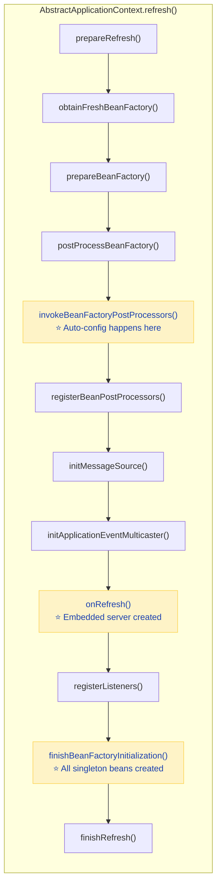
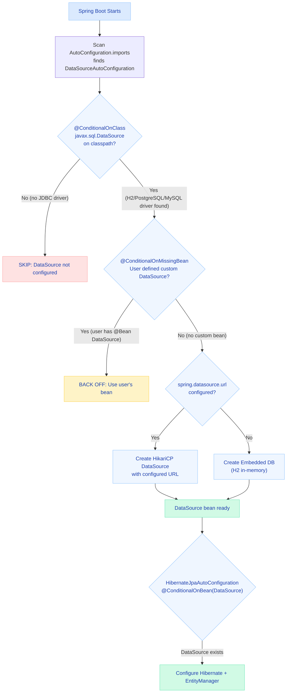
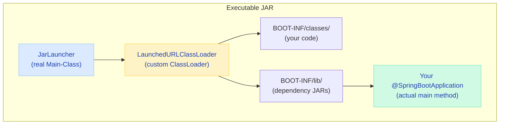

# Spring Boot Internals Deep Dive

> **Understand what happens under the hood — from `SpringApplication.run()` to a fully running application serving requests.**

---

!!! abstract "Real-World Analogy"
    Think of Spring Boot startup like **launching a spacecraft**. Mission Control (SpringApplication) runs through a precise checklist: check environment (fuel, weather), assemble components (payload, boosters), configure systems (navigation, comms), verify everything works together (integration checks), then ignite engines (start embedded server). Each phase must complete before the next begins, and any failure triggers an abort sequence.

---

## The Startup Process

When you call `SpringApplication.run(MyApp.class, args)`, here's the precise sequence:


### Phase Breakdown

#### Phase 1: SpringApplication Initialization

```java
// What happens in new SpringApplication(primarySources)
public SpringApplication(ResourceLoader resourceLoader, Class<?>... primarySources) {
    this.primarySources = new LinkedHashSet<>(Arrays.asList(primarySources));
    // Detects if you have Servlet or Reactive on classpath
    this.webApplicationType = WebApplicationType.deduceFromClasspath();
    // Loads from META-INF/spring.factories
    this.bootstrapRegistryInitializers = getBootstrapRegistryInitializers();
    setInitializers(getSpringFactoriesInstances(ApplicationContextInitializer.class));
    setListeners(getSpringFactoriesInstances(ApplicationListener.class));
    // Finds the class with main() via stack trace inspection
    this.mainApplicationClass = deduceMainApplicationClass();
}
```

!!! info "WebApplicationType Detection"
    Spring Boot checks your classpath to determine the application type:

    - `SERVLET` — if `DispatcherServlet` and `ServletContainer` are present
    - `REACTIVE` — if `DispatcherHandler` is present but NOT `DispatcherServlet`
    - `NONE` — neither (CLI app, batch job)

#### Phase 2: Environment Preparation

The `Environment` is assembled in a specific property source order (later sources override earlier):

| Priority | Source | Example |
|----------|--------|---------|
| 1 (highest) | Command line args | `--server.port=9090` |
| 2 | JNDI attributes | `java:comp/env` |
| 3 | System properties | `-Dserver.port=9090` |
| 4 | OS environment vars | `SERVER_PORT=9090` |
| 5 | `application-{profile}.yml` | `application-prod.yml` |
| 6 | `application.yml` | Default config |
| 7 | `@PropertySource` annotations | Custom property files |
| 8 (lowest) | Default properties | `SpringApplication.setDefaultProperties()` |

#### Phase 3: Context Refresh (The Big One)

The `refresh()` method in `AbstractApplicationContext` is where 90% of the work happens:



---

## Auto-Configuration Machinery

### How Spring Boot "Guesses" What You Need

Auto-configuration is not magic — it's a well-defined loading mechanism with conditional evaluation.

#### Case Study: DataSource Auto-Configuration



!!! tip "Read the diagram above carefully"
    This is exactly how Spring Boot decides whether to auto-configure your database. The key insight: **your custom beans always win** because of `@ConditionalOnMissingBean`. Spring Boot only provides defaults when you haven't defined your own.

#### Loading Mechanism (Spring Boot 3.x)

```
META-INF/spring/org.springframework.boot.autoconfigure.AutoConfiguration.imports
```

This file lists auto-configuration classes, one per line:

```
org.springframework.boot.autoconfigure.web.servlet.WebMvcAutoConfiguration
org.springframework.boot.autoconfigure.jdbc.DataSourceAutoConfiguration
org.springframework.boot.autoconfigure.orm.jpa.HibernateJpaAutoConfiguration
```

!!! warning "Spring Boot 2.x vs 3.x"
    In Spring Boot 2.x, auto-configurations were listed in `META-INF/spring.factories` under the `EnableAutoConfiguration` key. Spring Boot 3.x uses the new `.imports` file format. The old mechanism still works but is deprecated.

#### The @Conditional Family

Every auto-configuration class is wrapped in conditions. Spring Boot evaluates these BEFORE loading the class:

```java
@AutoConfiguration(after = DataSourceAutoConfiguration.class)
@ConditionalOnClass(EntityManager.class)           // Only if JPA is on classpath
@ConditionalOnBean(DataSource.class)               // Only if a DataSource exists
@ConditionalOnProperty(prefix = "spring.jpa", name = "enabled", matchIfMissing = true)
public class HibernateJpaAutoConfiguration {
    // Only loaded if ALL conditions pass
}
```

| Annotation | Evaluates To True When... |
|-----------|--------------------------|
| `@ConditionalOnClass` | Specified class is on classpath |
| `@ConditionalOnMissingClass` | Specified class is NOT on classpath |
| `@ConditionalOnBean` | Specified bean already exists in context |
| `@ConditionalOnMissingBean` | Specified bean does NOT exist (key one!) |
| `@ConditionalOnProperty` | Property has specified value |
| `@ConditionalOnResource` | Resource (file) exists on classpath |
| `@ConditionalOnWebApplication` | Running in a web context |
| `@ConditionalOnExpression` | SpEL expression evaluates to true |

!!! tip "The Golden Rule"
    `@ConditionalOnMissingBean` is why your custom beans always win. If you define your own `DataSource` bean, the auto-configured one backs off because the condition fails.

#### Debugging Auto-Configuration

```bash
# Option 1: Start with --debug flag
java -jar myapp.jar --debug

# Option 2: Add to application.yml
debug: true

# Option 3: Actuator endpoint (if actuator is included)
# GET /actuator/conditions
```

The debug output shows:

```
============================
CONDITIONS EVALUATION REPORT
============================

Positive matches:
-----------------
DataSourceAutoConfiguration matched:
  - @ConditionalOnClass found required classes 'javax.sql.DataSource', 'org.springframework.jdbc.datasource.embedded.EmbeddedDatabaseType'

Negative matches:
-----------------
MongoAutoConfiguration:
  - @ConditionalOnClass did not find required class 'com.mongodb.client.MongoClient'
```

---

## Class Loading & Fat JAR

### The Executable JAR Structure

When you run `mvn package`, Spring Boot creates a "fat JAR" with a special structure:

```
my-app-1.0.0.jar
├── META-INF/
│   └── MANIFEST.MF          → Main-Class: JarLauncher (not your class!)
├── BOOT-INF/
│   ├── classes/              → YOUR compiled code
│   │   └── com/example/...
│   ├── lib/                  → ALL dependency JARs (nested!)
│   │   ├── spring-web-6.1.0.jar
│   │   ├── tomcat-embed-core-10.1.jar
│   │   └── ... (hundreds of JARs)
│   └── classpath.idx         → Classpath ordering
└── org/springframework/boot/loader/
    ├── JarLauncher.class     → The real entry point
    └── launch/
        └── LaunchedURLClassLoader.class
```



!!! info "Why JarLauncher?"
    Standard Java cannot load classes from JARs nested inside JARs. The `LaunchedURLClassLoader` solves this by implementing a custom URL protocol (`jar:nested:`) that reads classes from nested JARs without extracting them to disk.

---

## Bean Lifecycle Internals

### The 11 Steps of Bean Creation

```mermaid
flowchart LR
    B1["1. Definition<br/>Loaded"] --> B2["2. BeanFactory<br/>PostProcessor"]
    B2 --> B3["3. Instantiation"]
    B3 --> B4["4. Populate<br/>Properties"]
    B4 --> B5["5. BeanName<br/>Aware"]
    B5 --> B6["6. BeanFactory<br/>Aware"]
    B6 --> B7["7. AppContext<br/>Aware"]
    B7 --> B8["8. BPP Before<br/>(@PostConstruct)"]
    B8 --> B9["9. afterProperties<br/>Set / init-method"]
    B9 --> B10["10. BPP After<br/>⭐ AOP Proxies"]
    B10 --> B11["11. Bean Ready"]

    style B1 fill:#DBEAFE,stroke:#93C5FD,color:#1E40AF
    style B2 fill:#EFF6FF,stroke:#93C5FD,color:#1E40AF
    style B8 fill:#FEF3C7,stroke:#FCD34D,color:#1E40AF
    style B10 fill:#FEE2E2,stroke:#FCA5A5,color:#1E40AF
    style B11 fill:#D1FAE5,stroke:#6EE7B7,color:#1E40AF
```



### BeanFactoryPostProcessor vs BeanPostProcessor

| Aspect | BeanFactoryPostProcessor | BeanPostProcessor |
|--------|--------------------------|-------------------|
| **When** | Before any bean is created | During each bean's creation |
| **What it sees** | Bean definitions (metadata) | Actual bean instances |
| **Use case** | Modify property values, add definitions | Wrap beans in proxies, validate |
| **Example** | `PropertySourcesPlaceholderConfigurer` | `AutowiredAnnotationBeanPostProcessor` |
| **How many times called** | Once (on the factory) | Once per bean |

### Proxy Creation Decision

```java
// Spring's decision logic (simplified)
if (beanClass.implementsAnyInterface()) {
    // JDK Dynamic Proxy — proxy implements the interface
    // Your bean is accessed through the interface type
    return Proxy.newProxyInstance(interfaces, handler);
} else {
    // CGLIB Proxy — generates a subclass at runtime
    // Works with concrete classes (no interface needed)
    return enhancer.create();  // MyService$$EnhancerBySpringCGLIB
}
```

!!! warning "CGLIB Limitation"
    CGLIB proxies cannot intercept `final` methods or `private` methods. If your `@Transactional` method is `final`, the transaction advice is silently skipped!

---

## Building a Custom Starter

### Project Structure

```
notification-spring-boot-starter/
├── src/main/java/com/example/notification/
│   ├── NotificationAutoConfiguration.java
│   ├── NotificationProperties.java
│   ├── NotificationService.java
│   └── NotificationTemplate.java
├── src/main/resources/
│   ├── META-INF/
│   │   └── spring/
│   │       └── org.springframework.boot.autoconfigure.AutoConfiguration.imports
│   └── META-INF/
│       └── additional-spring-configuration-metadata.json
└── pom.xml
```

### Step 1: Configuration Properties

```java
@ConfigurationProperties(prefix = "notification")
public class NotificationProperties {
    private String provider = "smtp";     // default provider
    private String from = "noreply@app.com";
    private int retryAttempts = 3;
    private Duration timeout = Duration.ofSeconds(5);

    // getters and setters
}
```

### Step 2: Auto-Configuration Class

```java
@AutoConfiguration
@ConditionalOnClass(NotificationService.class)
@EnableConfigurationProperties(NotificationProperties.class)
public class NotificationAutoConfiguration {

    @Bean
    @ConditionalOnMissingBean
    public NotificationTemplate notificationTemplate(NotificationProperties props) {
        return new NotificationTemplate(props.getProvider(), props.getFrom());
    }

    @Bean
    @ConditionalOnMissingBean
    @ConditionalOnProperty(prefix = "notification", name = "enabled", havingValue = "true", matchIfMissing = true)
    public NotificationService notificationService(NotificationTemplate template) {
        return new NotificationService(template);
    }
}
```

### Step 3: Register Auto-Configuration

```
# META-INF/spring/org.springframework.boot.autoconfigure.AutoConfiguration.imports
com.example.notification.NotificationAutoConfiguration
```

### Step 4: Configuration Metadata (IDE support)

```json
{
  "properties": [
    {
      "name": "notification.provider",
      "type": "java.lang.String",
      "description": "Notification provider (smtp, sns, twilio)",
      "defaultValue": "smtp"
    },
    {
      "name": "notification.enabled",
      "type": "java.lang.Boolean",
      "description": "Enable/disable notification auto-configuration",
      "defaultValue": true
    }
  ]
}
```

!!! tip "Naming Convention"
    Official Spring starters: `spring-boot-starter-{name}` (e.g., `spring-boot-starter-web`).  
    Third-party starters: `{name}-spring-boot-starter` (e.g., `mybatis-spring-boot-starter`).

---

## Interview Questions

??? question "Q1: What happens if you put @SpringBootApplication on a class that's NOT in the root package?"

    **Answer:** `@SpringBootApplication` includes `@ComponentScan` which, by default, scans the package of the annotated class and all sub-packages. If your main class is in `com.example.config` but your services are in `com.example.service`, they won't be found.

    **Fix:** Either move the main class to `com.example` (root), or explicitly set `@ComponentScan(basePackages = "com.example")`.

    **Why interviewers ask this:** It tests whether you understand the scanning mechanics vs just knowing annotations exist.

??? question "Q2: Why does calling a @Transactional method from within the same class not start a transaction?"

    **Answer:** Spring's `@Transactional` works via AOP proxies. When you call `this.methodB()` from `methodA()` within the same class, you bypass the proxy — you're calling the actual target object directly. The proxy interceptor never fires, so no transaction is created.

    **Fix:** Inject the bean into itself (via `@Lazy` or `ObjectProvider`), extract to a separate class, or use `AopContext.currentProxy()` (not recommended).

??? question "Q3: How does Spring Boot decide between JDK Dynamic Proxy and CGLIB?"

    **Answer:** Since Spring Boot 2.0, CGLIB is the default (`spring.aop.proxy-target-class=true`). JDK Dynamic Proxies are used only when explicitly configured AND the bean implements an interface. CGLIB generates a subclass, so it works with concrete classes.

    **Key gotcha:** CGLIB cannot proxy `final` classes or intercept `final` methods. Spring will silently skip AOP advice on final methods.

??? question "Q4: What is the difference between @AutoConfiguration and @Configuration?"

    **Answer:** `@AutoConfiguration` (Spring Boot 3.x) is specifically for auto-configuration classes. Unlike `@Configuration`:

    - It supports ordering via `before` and `after` attributes
    - It's loaded from the `.imports` file, not component scanning
    - It's processed AFTER user-defined `@Configuration` classes (so `@ConditionalOnMissingBean` works correctly)

??? question "Q5: How would you debug a bean that's not being auto-configured?"

    **Answer:** Systematic approach:

    1. Run with `--debug` and check the CONDITIONS EVALUATION REPORT
    2. Look for the auto-configuration class in "Negative matches"
    3. Read which `@Conditional` failed (usually `OnClass` or `OnMissingBean`)
    4. Verify the dependency is on the classpath (`mvn dependency:tree`)
    5. Check if another configuration is defining the bean first (causing `OnMissingBean` to fail)
    6. Use `/actuator/conditions` at runtime for a live view

??? question "Q6: Explain the difference between BeanFactoryPostProcessor and BeanPostProcessor with a real example."

    **Answer:**

    - **BeanFactoryPostProcessor** operates on bean *definitions* before any bean exists. Example: `PropertySourcesPlaceholderConfigurer` resolves `${...}` placeholders in bean definitions.
    - **BeanPostProcessor** operates on bean *instances* after creation. Example: `AutowiredAnnotationBeanPostProcessor` injects `@Autowired` dependencies.

    **Key insight:** If you need to modify what beans will be created or change their metadata → BFPP. If you need to wrap or modify actual bean objects → BPP.
