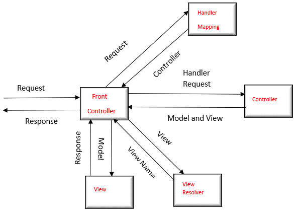

# SpringBoot

## References
* <https://docs.spring.io/spring-boot/docs/current/reference/htmlsingle/>
* <https://github.com/spring-projects/spring-boot>
* <https://github.com/spring-io/start.spring.io>
* <https://github.com/spring-io/initializr>

Spring:

- It is a java EE framework for building applications.
- Simplify development that makes developers more productive.
- Dependency Injection.
- Loose coupling

  Spring Boot:

- It is designed upon Spring framework
- Mainly used for Rest Apis development.
- Primary feature of spring boot is Auto Configuration. It automatically configures the classes based on Requirement.
- Inbuild servers like tomcat and Jetty etc

Differences b/w Spring and Spring Boot

- Starter POMs ---- maven configuration will be simplified like spring boot starter web
- Version Management --- for each dependency version is important ,but in boot it is not required
- Auto Configuration (web.xml in spring , but not required in spring boot)
- Component Scanning
- Embedded Server
- In Memory DB
- Actuators

SPRING MVC FLOW

1. Client(Browser) requests for a Resource in the web Application.
2. The Spring front controller i.e, DispatcherServlet first receives the request.
3. DispatcherServlet consults the HandlerMapping to identify the particular controller for the given URL.
4. HandlerMapping identifies the controller for the given request and sends to the DispatcherServlet.
5. DispatcherServlet will call the handleRequest(request,response) method on Controller. A Controller is developed by writing a simple java class which implements Controller interface or extends its adapter class.
6. Controller will call the business method according to business requirement.
7. Service class will call the DAO class method for business data.
8. DAO interacts with DB to get data.
9. DAO returns same data to service.
10. Fetched data will be processed according to business requirement and return results to Controller.
11. The Controller returns the Model and View in the form of Object back to the Controller i.e, DispatcherServlet.
12. The front controller i.e, DispatcherServlet then tries to resolve the actual View which may be JSP,velocity or Free Marker by consulting the View Resolver Object.
13. ViewResolver selected view is rendred back to the DispatcherServlet.
14. DispatcherServletconsult the particular view with the model.
15. View executes and returns HTML output to the DispatcherServlet.
16. DispatcherServlet will sends the output to the Browser.

SPRING BOOT ACTUATORS:

Actuators is one of the feature available in Spring Boot

Actuators are used for providing Production Ready Features for the application

By Using Actuators we can monitor and manage our application.

What is health of our application?

How many beans loaded by our application?

What config props loaded by our application

What is heap info

How many threads are running in our application

How many url mappings available ?

We need a need dependency in pom.xml

<dependency>

<groupId>org.springframework.boot</groupId>

<artifactId>spring-boot-starter-actuator</artifactId>

</dependency>

management:

endpoints:

web:

exposure:

include: '*'
endpoint:health:show-details: alwaysbeans:enabled: true

- -> Once our application started we can use below URL to see actuator endpoints which are exposed

       http://localhost:8090/actuator

       {

        "_links":{

        "self":{

         "href":"http://localhost:8090/actuator",

          "templated":false

          },

         "auditevents":{

         "href":"http://localhost:8090/actuator/auditevents",

         "templated":false

          },

        "beans":{

        "href":"http://localhost:8090/actuator/beans",

        "templated":false

            },

          "caches-cache":{

          "href":"http://localhost:8090/actuator/caches/{cache}",

          "templated":true

           }

How @Request Mapping works?

@RequestMapping(value =””)

@PutMapping

@DeleteMapping

@GetMapping

@PostMapping

When the application starts those end points get registered with the dispatcher servelet . When the request comes from the client to the dispatcher servelet, it redirects to the end point.
