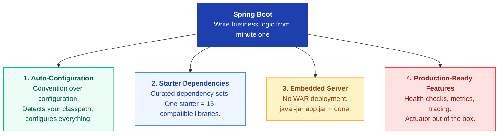
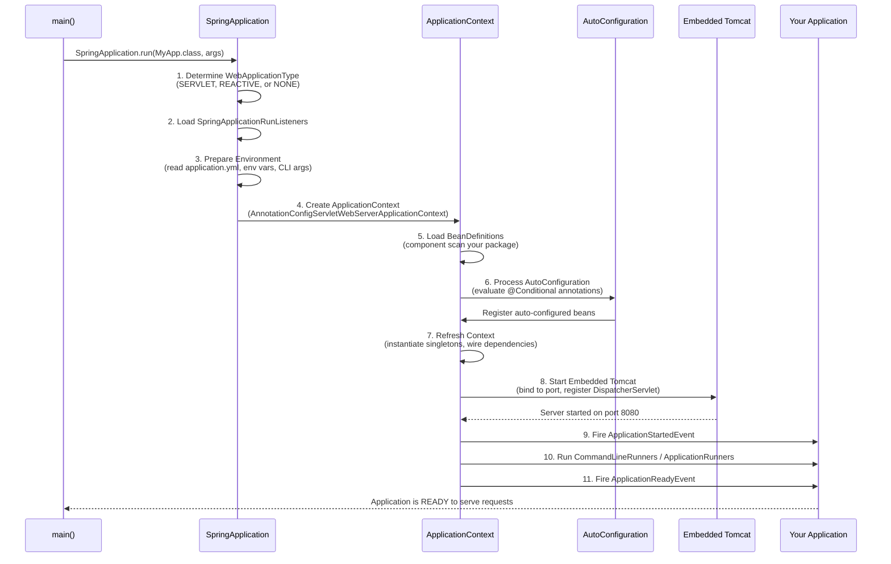
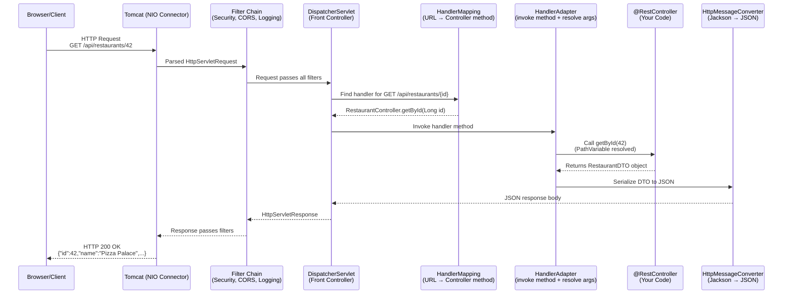
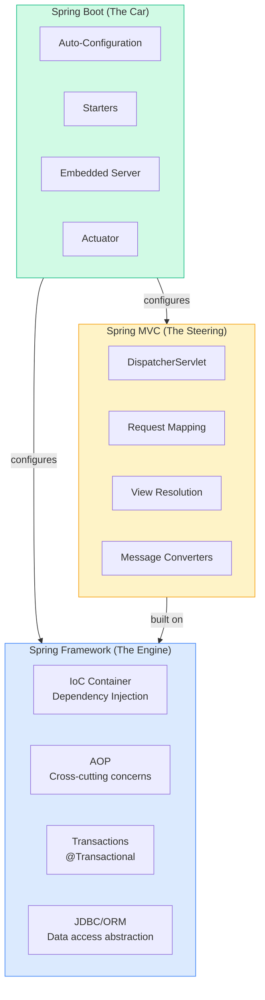

# Introduction to Spring Boot

You've written Java programs. You know how to create objects, manage databases, handle HTTP requests. But doing all that manually for a production application? You'd spend 2 weeks just on configuration — XML files, dependency version conflicts, external server setup, connection pool tuning.

Spring Boot gives you all of that in 30 seconds. One annotation, one `main()` method, and you have a running production-ready application. Let me show you how.

---

## What is Spring Boot?

Spring Boot is **not** just "opinionated Spring." It is a complete application framework built on 4 pillars:


```mermaid
flowchart TB
    SB["<b>Spring Boot</b><br/>Write business logic from minute one"]
    SB --> AC["<b>1. Auto-Configuration</b><br/>Convention over configuration.<br/>Detects your classpath, configures everything."]
    SB --> SD["<b>2. Starter Dependencies</b><br/>Curated dependency sets.<br/>One starter = 15 compatible libraries."]
    SB --> ES["<b>3. Embedded Server</b><br/>No WAR deployment.<br/>java -jar app.jar = done."]
    SB --> PR["<b>4. Production-Ready Features</b><br/>Health checks, metrics, tracing.<br/>Actuator out of the box."]

    style SB fill:#1E40AF,stroke:#1E40AF,color:#FFFFFF
    style AC fill:#ECFDF5,stroke:#10B981,color:#065F46
    style SD fill:#EFF6FF,stroke:#3B82F6,color:#1E40AF
    style ES fill:#FEF3C7,stroke:#F59E0B,color:#92400E
    style PR fill:#FEE2E2,stroke:#EF4444,color:#991B1B
```

| Pillar | What It Does | Why It Matters |
|--------|-------------|----------------|
| **Auto-Configuration** | Scans your classpath, creates beans you need | Zero boilerplate for 90% of use cases |
| **Starter Dependencies** | One dependency pulls in a tested set of libraries | No more version conflict hell |
| **Embedded Server** | Tomcat/Jetty/Undertow inside your JAR | Deploy anywhere with `java -jar` |
| **Production-Ready Features** | Health, metrics, env, loggers endpoints | Operations team loves you on day one |

!!! tip "One-liner for interviews"
    "Spring Boot is a framework that eliminates boilerplate configuration so you can write business logic from minute one. It auto-configures your application based on classpath detection, packages an embedded server into your JAR, and provides production monitoring out of the box."

---

## What Problem Does It Solve?

### The BEFORE World (Spring without Boot)

To get a "Hello World" web application running with raw Spring Framework, you needed **three XML files** before writing a single line of business logic:

=== "web.xml (Deployment Descriptor)"

    ```xml
    <?xml version="1.0" encoding="UTF-8"?>
    <web-app xmlns="http://java.sun.com/xml/ns/javaee" version="3.0">

        <!-- Load Spring context -->
        <context-param>
            <param-name>contextConfigLocation</param-name>
            <param-value>/WEB-INF/applicationContext.xml</param-value>
        </context-param>

        <listener>
            <listener-class>org.springframework.web.context.ContextLoaderListener</listener-class>
        </listener>

        <!-- Front controller -->
        <servlet>
            <servlet-name>dispatcher</servlet-name>
            <servlet-class>org.springframework.web.servlet.DispatcherServlet</servlet-class>
            <init-param>
                <param-name>contextConfigLocation</param-name>
                <param-value>/WEB-INF/dispatcher-servlet.xml</param-value>
            </init-param>
            <load-on-startup>1</load-on-startup>
        </servlet>

        <servlet-mapping>
            <servlet-name>dispatcher</servlet-name>
            <url-pattern>/</url-pattern>
        </servlet-mapping>
    </web-app>
    ```

=== "dispatcher-servlet.xml"

    ```xml
    <?xml version="1.0" encoding="UTF-8"?>
    <beans xmlns="http://www.springframework.org/schema/beans"
           xmlns:mvc="http://www.springframework.org/schema/mvc"
           xmlns:context="http://www.springframework.org/schema/context">

        <context:component-scan base-package="com.company.app"/>
        <mvc:annotation-driven/>

        <bean class="org.springframework.web.servlet.view.InternalResourceViewResolver">
            <property name="prefix" value="/WEB-INF/views/"/>
            <property name="suffix" value=".jsp"/>
        </bean>
    </beans>
    ```

=== "applicationContext.xml"

    ```xml
    <?xml version="1.0" encoding="UTF-8"?>
    <beans xmlns="http://www.springframework.org/schema/beans">

        <bean id="dataSource" class="org.apache.commons.dbcp.BasicDataSource">
            <property name="driverClassName" value="org.postgresql.Driver"/>
            <property name="url" value="jdbc:postgresql://localhost:5432/mydb"/>
            <property name="username" value="postgres"/>
            <property name="password" value="secret"/>
        </bean>

        <bean id="entityManagerFactory"
              class="org.springframework.orm.jpa.LocalContainerEntityManagerFactoryBean">
            <property name="dataSource" ref="dataSource"/>
            <property name="packagesToScan" value="com.company.app.model"/>
            <property name="jpaVendorAdapter">
                <bean class="org.springframework.orm.jpa.vendor.HibernateJpaVendorAdapter"/>
            </property>
        </bean>

        <bean id="transactionManager"
              class="org.springframework.orm.jpa.JpaTransactionManager">
            <property name="entityManagerFactory" ref="entityManagerFactory"/>
        </bean>
    </beans>
    ```

That is **100+ lines of XML** — and you still need to download Tomcat, configure it, package a WAR file, and deploy manually.

### The AFTER World (Spring Boot)

```java
@SpringBootApplication
public class OrderServiceApplication {
    public static void main(String[] args) {
        SpringApplication.run(OrderServiceApplication.class, args);
    }
}
```

That's it. **3 lines.** Spring Boot detects you want a web app, embeds Tomcat, configures Jackson for JSON, sets up HikariCP for database connections, and starts everything on port 8080.

!!! danger "What breaks"
    People who learn Spring Boot without understanding what it replaces often can't debug configuration issues. When auto-configuration fails (and it will), you need to know what Spring Boot is doing under the hood. That's why this page explains the internals.

### Comparison Table: Spring Framework vs Spring Boot

| Aspect | Spring Framework | Spring Boot |
|--------|-----------------|-------------|
| **Configuration** | Manual XML or `@Configuration` classes | Auto-configuration from classpath |
| **Server** | External Tomcat/WildFly required | Embedded Tomcat in your JAR |
| **Dependencies** | You manage versions manually | Starter BOMs with tested compatibility |
| **Setup time** | Hours before first endpoint | Minutes (start.spring.io) |
| **Deployment** | WAR file to external server | `java -jar app.jar` anywhere |
| **Monitoring** | Build it yourself | Actuator out of the box |
| **Learning curve** | Steep (must know everything) | Gentle (just works, learn internals later) |

!!! question "Counter-questions"
    **Q: "Can you use Spring without Boot?"**
    A: Yes. Spring Boot uses Spring Framework internally. You can still write raw Spring apps with manual configuration. But nobody does this for new projects since 2014.

    **Q: "Is Spring Boot a different framework from Spring?"**
    A: No. Spring Boot IS Spring Framework + auto-configuration + embedded server + starters. Every Spring concept (DI, AOP, transactions) works identically in Spring Boot.

---

## How a Spring Boot App Starts (Internal Flow)

This is the most asked interview question about Spring Boot internals. Here is exactly what happens when you call `SpringApplication.run()`:


```mermaid
sequenceDiagram
    participant M as main()
    participant SA as SpringApplication
    participant CTX as ApplicationContext
    participant AC as AutoConfiguration
    participant T as Embedded Tomcat
    participant APP as Your Application

    M->>SA: SpringApplication.run(MyApp.class, args)
    SA->>SA: 1. Determine WebApplicationType<br/>(SERVLET, REACTIVE, or NONE)
    SA->>SA: 2. Load SpringApplicationRunListeners
    SA->>SA: 3. Prepare Environment<br/>(read application.yml, env vars, CLI args)
    SA->>CTX: 4. Create ApplicationContext<br/>(AnnotationConfigServletWebServerApplicationContext)
    CTX->>CTX: 5. Load BeanDefinitions<br/>(component scan your package)
    CTX->>AC: 6. Process AutoConfiguration<br/>(evaluate @Conditional annotations)
    AC->>CTX: Register auto-configured beans
    CTX->>CTX: 7. Refresh Context<br/>(instantiate singletons, wire dependencies)
    CTX->>T: 8. Start Embedded Tomcat<br/>(bind to port, register DispatcherServlet)
    T-->>CTX: Server started on port 8080
    CTX->>APP: 9. Fire ApplicationStartedEvent
    CTX->>APP: 10. Run CommandLineRunners / ApplicationRunners
    CTX->>APP: 11. Fire ApplicationReadyEvent
    APP-->>M: Application is READY to serve requests
```

### Step-by-Step Breakdown

| Step | What Happens | Key Class |
|------|-------------|-----------|
| 1 | Checks if `Servlet` or `Reactive` classes are on classpath | `WebApplicationType.deduceFromClasspath()` |
| 2 | Loads listeners from `META-INF/spring.factories` | `SpringApplicationRunListener` |
| 3 | Merges properties from 17+ sources (env vars > CLI > yml > defaults) | `ConfigurableEnvironment` |
| 4 | Creates the right context type for your app | `AnnotationConfigServletWebServerApplicationContext` |
| 5 | Scans your root package + sub-packages for `@Component` classes | `ClassPathBeanDefinitionScanner` |
| 6 | Evaluates all auto-configuration classes and their conditions | `AutoConfigurationImportSelector` |
| 7 | Creates all singleton beans, resolves dependencies, injects them | `DefaultListableBeanFactory` |
| 8 | Starts Tomcat, registers `DispatcherServlet` on `/` | `TomcatWebServer` |
| 9-11 | Signals that the app is started and ready | `ApplicationEvent` |

!!! example "Interview Tip"
    When asked "What happens when you run a Spring Boot application?", walk through this flow. Mention the **ApplicationContext type** (most candidates don't know it's `AnnotationConfigServletWebServerApplicationContext`), the **order of events** (Started before Ready), and that **auto-configuration evaluates AFTER component scanning** (your beans override auto-configured ones).

!!! question "Counter-questions"
    **Q: "What's the difference between ApplicationStartedEvent and ApplicationReadyEvent?"**
    A: `ApplicationStartedEvent` fires after the context is refreshed but BEFORE `CommandLineRunner`/`ApplicationRunner` beans execute. `ApplicationReadyEvent` fires AFTER runners complete — meaning the app is fully ready to serve traffic.

    **Q: "How does Spring Boot decide between SERVLET and REACTIVE?"**
    A: If `DispatcherServlet` is on classpath → SERVLET. If `DispatcherHandler` (WebFlux) is on classpath → REACTIVE. If neither → NONE (no web server started).

---

## The Request Lifecycle (HTTP to Response)

When a browser hits `GET /api/restaurants/42`, here is every component the request passes through:


```mermaid
sequenceDiagram
    participant B as Browser/Client
    participant T as Tomcat (NIO Connector)
    participant F as Filter Chain<br/>(Security, CORS, Logging)
    participant DS as DispatcherServlet<br/>(Front Controller)
    participant HM as HandlerMapping<br/>(URL → Controller method)
    participant HA as HandlerAdapter<br/>(invoke method + resolve args)
    participant C as @RestController<br/>(Your Code)
    participant MC as HttpMessageConverter<br/>(Jackson → JSON)

    B->>T: HTTP Request<br/>GET /api/restaurants/42
    T->>F: Parsed HttpServletRequest
    F->>DS: Request passes all filters
    DS->>HM: Find handler for GET /api/restaurants/{id}
    HM-->>DS: RestaurantController.getById(Long id)
    DS->>HA: Invoke handler method
    HA->>C: Call getById(42)<br/>(PathVariable resolved)
    C-->>HA: Returns RestaurantDTO object
    HA->>MC: Serialize DTO to JSON
    MC-->>DS: JSON response body
    DS-->>F: HttpServletResponse
    F-->>T: Response passes filters
    T-->>B: HTTP 200 OK<br/>{"id":42,"name":"Pizza Palace",...}
```

### What Each Component Does

| Component | Responsibility | What Happens If It Fails |
|-----------|---------------|--------------------------|
| **Tomcat NIO Connector** | Accept TCP connections, parse HTTP | Connection refused / timeout |
| **Filter Chain** | Cross-cutting: auth, CORS, request logging | 401/403 before controller is reached |
| **DispatcherServlet** | Route request to correct handler | 404 — no handler found |
| **HandlerMapping** | Match URL pattern + HTTP method to controller method | 404 or 405 Method Not Allowed |
| **HandlerAdapter** | Resolve `@PathVariable`, `@RequestBody`, `@Valid` | 400 Bad Request (validation failure) |
| **Your Controller** | Business logic delegation | 500 (or your custom exception → proper status) |
| **HttpMessageConverter** | Serialize response object to JSON/XML | 500 — serialization failure |

!!! tip "One-liner for interviews"
    "Every request goes through: Tomcat → Filters → DispatcherServlet → HandlerMapping → HandlerAdapter → Controller → MessageConverter → Response. The DispatcherServlet is the front controller pattern — one entry point that dispatches to the correct handler."

---

## Spring Boot vs Spring Framework vs Spring MVC

This is one of the most confused topics in interviews. Let me make it crystal clear:


```mermaid
flowchart TB
    subgraph SF["Spring Framework (The Engine)"]
        direction LR
        IOC["IoC Container<br/>Dependency Injection"]
        AOP["AOP<br/>Cross-cutting concerns"]
        TX["Transactions<br/>@Transactional"]
        JDBC["JDBC/ORM<br/>Data access abstraction"]
    end

    subgraph MVC["Spring MVC (The Steering)"]
        direction LR
        DS2["DispatcherServlet"]
        RM["Request Mapping"]
        VR["View Resolution"]
        MC2["Message Converters"]
    end

    subgraph SB2["Spring Boot (The Car)"]
        direction LR
        AUTO["Auto-Configuration"]
        STAR["Starters"]
        EMB["Embedded Server"]
        ACT["Actuator"]
    end

    SB2 -->|"configures"| MVC
    SB2 -->|"configures"| SF
    MVC -->|"built on"| SF

    style SF fill:#DBEAFE,stroke:#3B82F6
    style MVC fill:#FEF3C7,stroke:#F59E0B
    style SB2 fill:#D1FAE5,stroke:#10B981
```

| | Spring Framework | Spring MVC | Spring Boot |
|---|---|---|---|
| **What** | Core container — IoC, AOP, abstractions | Web module — controllers, request mapping, REST | Scaffolding — auto-configures everything |
| **Scope** | Foundation for ALL Spring projects | Only web layer (HTTP handling) | Orchestrator that ties everything together |
| **Requires** | Nothing (it IS the base) | Spring Framework | Spring Framework + your choice of modules |
| **Standalone?** | Yes, but manual config | No, needs Spring Framework | No, IS Spring Framework + extras |

**Analogy:** Spring Framework is the engine. Spring MVC is the steering wheel and transmission. Spring Boot is buying a fully assembled car instead of sourcing parts from a junkyard.

!!! example "Interview Tip"
    Never say "Spring Boot is a replacement for Spring" — that's wrong. Say: "Spring Boot is a layer on top of Spring Framework that auto-configures Spring modules (including Spring MVC) based on classpath detection, eliminating manual configuration while keeping full customization capability."

---

## Project Structure (Production-Grade)

Here's how a real food delivery backend service is organized — not a tutorial project, a production one:

```
com.company.orderservice/
├── OrderServiceApplication.java         ← Main class (MUST be at root package!)
├── config/                              ← @Configuration classes
│   ├── SecurityConfig.java              ← CORS, JWT filter, endpoint security
│   ├── AsyncConfig.java                 ← Thread pool for @Async methods
│   └── SwaggerConfig.java              ← OpenAPI documentation (dev only)
├── controller/                          ← @RestController (THIN! No business logic)
│   ├── OrderController.java             ← HTTP concerns only
│   └── RestaurantController.java
├── service/                             ← @Service (ALL business logic lives HERE)
│   ├── OrderService.java                ← Order creation, status transitions
│   ├── PricingService.java              ← Delivery fee calculation
│   └── NotificationService.java         ← Push notifications, emails
├── repository/                          ← @Repository (data access)
│   ├── OrderRepository.java             ← Spring Data JPA interface
│   └── RestaurantRepository.java
├── model/
│   ├── entity/                          ← JPA entities (map to DB tables)
│   │   ├── Order.java
│   │   └── Restaurant.java
│   └── dto/                             ← Request/Response objects (API contract)
│       ├── CreateOrderRequest.java
│       ├── OrderResponse.java
│       └── RestaurantDTO.java
├── exception/                           ← Custom exceptions + global handler
│   ├── OrderNotFoundException.java
│   ├── RestaurantClosedException.java
│   └── GlobalExceptionHandler.java      ← @ControllerAdvice
└── util/                                ← Helpers (use SPARINGLY)
    └── DistanceCalculator.java
```

### Why This Structure?

**Layered architecture + component scanning:**

1. **Main class at root package** — `@ComponentScan` scans the package of `@SpringBootApplication` and ALL sub-packages. If `OrderServiceApplication` is in `com.company.orderservice`, everything in sub-packages gets picked up automatically. Put it in `com.company.orderservice.app`? Your controllers won't be found.

2. **Controllers are THIN** — They handle HTTP concerns only: extract path variables, validate request bodies, set response status codes, call the service. Zero business logic. Why? Because controllers are hard to unit test (they need MockMvc), but services are trivial to test.

3. **Services own the logic** — All business rules, calculations, orchestration between repositories, transaction boundaries. This is where your interview answer "separation of concerns" actually lives.

4. **DTOs separate API from database** — Never return JPA entities from controllers. Your database schema is NOT your API contract. Add a column? That shouldn't break your mobile app.

!!! danger "What breaks"
    **Main class in wrong package:** If your main class is in `com.company.orderservice.app` but your controllers are in `com.company.orderservice.controller`, they will NOT be scanned. You'll get 404 on every endpoint with no error message. This is the #1 Spring Boot debugging headache for beginners.

---

## application.yml — Essential Properties

Here's a production-ready configuration for our food delivery Order Service, grouped by concern:

```yaml
# ═══════════════════════════════════════════════════════════════
# SERVER
# ═══════════════════════════════════════════════════════════════
server:
  port: 8080                              # Default: 8080. Change for multiple services on same host.
  shutdown: graceful                      # Wait for active requests to finish on shutdown
  tomcat:
    max-threads: 200                      # Default: 200. Tune based on load testing.
    connection-timeout: 5s                # Drop idle connections after 5 seconds
    accept-count: 100                     # Queue size when all threads are busy

# ═══════════════════════════════════════════════════════════════
# DATABASE
# ═══════════════════════════════════════════════════════════════
spring:
  datasource:
    url: jdbc:postgresql://${DB_HOST:localhost}:5432/orderservice
    username: ${DB_USER:postgres}
    password: ${DB_PASSWORD}              # NEVER hardcode. Use env var or secrets manager.
    hikari:
      maximum-pool-size: 20              # Default: 10. Formula: connections = (core_count * 2) + disk_spindles
      minimum-idle: 5
      connection-timeout: 30000          # 30s — fail fast if pool is exhausted
      idle-timeout: 600000               # 10min — release idle connections

  # ═══════════════════════════════════════════════════════════════
  # JPA / HIBERNATE
  # ═══════════════════════════════════════════════════════════════
  jpa:
    open-in-view: false                  # ⚠️  DEFAULT IS TRUE. Set to FALSE always!
    hibernate:
      ddl-auto: validate                 # NEVER 'update' in prod! Use Flyway/Liquibase.
    properties:
      hibernate:
        dialect: org.hibernate.dialect.PostgreSQLDialect
        default_batch_fetch_size: 16     # Reduce N+1 queries
        order_inserts: true              # Batch inserts for performance
        order_updates: true
    show-sql: false                      # true only in dev

# ═══════════════════════════════════════════════════════════════
# LOGGING
# ═══════════════════════════════════════════════════════════════
logging:
  level:
    com.company.orderservice: INFO       # Your app
    org.springframework.web: WARN        # Framework noise
    org.hibernate.SQL: WARN              # Set to DEBUG to see queries (dev only)
    org.hibernate.type.descriptor: WARN  # Set to TRACE to see bind parameters
  pattern:
    console: "%d{HH:mm:ss.SSS} [%thread] %-5level %logger{36} - %msg%n"

# ═══════════════════════════════════════════════════════════════
# ACTUATOR
# ═══════════════════════════════════════════════════════════════
management:
  endpoints:
    web:
      exposure:
        include: health,info,metrics,prometheus
  endpoint:
    health:
      show-details: when-authorized       # Don't leak internals to public
      probes:
        enabled: true                     # Kubernetes liveness/readiness
  metrics:
    tags:
      application: order-service          # Tag all metrics with service name
```

### Critical Properties Explained

| Property | Default | Why You Should Care |
|----------|---------|-------------------|
| `spring.jpa.open-in-view` | `true` | **Set to `false`!** When true, keeps a DB connection open for the ENTIRE HTTP request, including JSON serialization. Lazy-loaded collections fire queries in your controller layer. This hides N+1 bugs and exhausts your connection pool under load. |
| `spring.jpa.hibernate.ddl-auto` | `none` | Options: `none`, `validate`, `update`, `create`, `create-drop`. In production, ONLY use `validate` (verifies schema matches entities) or `none`. The `update` option modifies your production schema without migration history! |
| `server.shutdown` | `immediate` | Set to `graceful`. Without this, active requests get killed during deployment. Graceful shutdown waits for in-flight requests to complete (up to 30s by default). |
| `spring.datasource.hikari.maximum-pool-size` | `10` | Most apps need 15-30. Too few = threads waiting for connections. Too many = database overwhelmed. Profile first, tune second. |

!!! danger "What breaks"
    **`ddl-auto=update` in production:** Hibernate will ALTER your production tables. It can add columns but NEVER removes them. It doesn't handle data migration. It doesn't create indexes. One day it'll lock a table with 10M rows for 30 minutes. Use Flyway.

    **`open-in-view=true` (the default!):** Your controller returns an entity with a lazy `List<OrderItem>`. Jackson serializes it, triggering a SELECT for every order item. You get N+1 queries, a connection held for 200ms instead of 20ms, and eventually `HikariPool-1 - Connection is not available, request timed out after 30000ms`.

---

## Profiles

### What

Profiles let you run the same application with different configurations for different environments. Your dev machine uses H2 in-memory database, but production uses PostgreSQL with a connection pool.

### Why

You don't want to comment/uncomment database URLs every time you deploy. You don't want Swagger exposed in production. You don't want debug logging flooding your prod logs.

### How

=== "application-dev.yml"

    ```yaml
    spring:
      datasource:
        url: jdbc:h2:mem:orderservice       # In-memory DB, fast, no setup
        driver-class-name: org.h2.Driver
      jpa:
        hibernate:
          ddl-auto: create-drop             # Recreate schema every restart
        show-sql: true                      # See all SQL in console
      h2:
        console:
          enabled: true                     # H2 web console at /h2-console

    logging:
      level:
        com.company.orderservice: DEBUG     # Verbose logging for development
        org.hibernate.SQL: DEBUG

    springdoc:
      swagger-ui:
        enabled: true                       # Swagger UI available
    ```

=== "application-prod.yml"

    ```yaml
    spring:
      datasource:
        url: jdbc:postgresql://${DB_HOST}:5432/orderservice
        username: ${DB_USER}
        password: ${DB_PASSWORD}
      jpa:
        hibernate:
          ddl-auto: validate                # Only verify schema matches entities
        show-sql: false

    logging:
      level:
        com.company.orderservice: WARN      # Only warnings and errors
        org.springframework: WARN

    springdoc:
      swagger-ui:
        enabled: false                      # No Swagger in production!

    management:
      endpoints:
        web:
          exposure:
            include: health,info,prometheus  # Locked down actuator
    ```

=== "Activation"

    ```bash
    # Option 1: Environment variable (recommended for containers)
    export SPRING_PROFILES_ACTIVE=prod
    java -jar order-service.jar

    # Option 2: Command-line argument
    java -jar order-service.jar --spring.profiles.active=prod

    # Option 3: In application.yml (for default profile)
    # spring.profiles.active: dev
    ```

### Profile-Specific Beans

```java
@Configuration
@Profile("dev")
public class DevConfig {

    // Mock external payment service in dev — no real charges
    @Bean
    public PaymentGateway paymentGateway() {
        return new MockPaymentGateway(); // Always returns success
    }
}

@Configuration
@Profile("prod")
public class ProdConfig {

    @Bean
    public PaymentGateway paymentGateway(
            @Value("${stripe.api-key}") String apiKey) {
        return new StripePaymentGateway(apiKey); // Real Stripe integration
    }
}
```

!!! tip "One-liner for interviews"
    "Profiles provide environment-specific configuration. Profile-specific YAML files override base properties, and `@Profile` annotations conditionally create beans. Activated via `SPRING_PROFILES_ACTIVE` environment variable — the most container-friendly approach."

---

## Starters — What They Actually Do

Starters are not magic. Each one is just a `pom.xml` that pulls in a curated set of dependencies. Here is what you actually get:

### `spring-boot-starter-web`

| Dependency | Purpose |
|-----------|---------|
| Spring MVC | `@RestController`, `@RequestMapping`, `DispatcherServlet` |
| Embedded Tomcat | Web server inside your JAR |
| Jackson (`jackson-databind`) | JSON serialization/deserialization |
| Bean Validation (Hibernate Validator) | `@Valid`, `@NotNull`, `@Size` |
| SLF4J + Logback | Logging framework |
| Spring Boot AutoConfigure | Auto-config for all the above |

### `spring-boot-starter-data-jpa`

| Dependency | Purpose |
|-----------|---------|
| Hibernate (JPA implementation) | ORM — map objects to tables |
| HikariCP | Connection pool (fastest in Java) |
| Spring Data JPA | Repository interfaces, query derivation |
| Spring JDBC | Low-level database access |
| Spring Transaction | `@Transactional` support |

### Switching Embedded Servers

Want Jetty instead of Tomcat? Exclude one, add the other:

```xml
<dependency>
    <groupId>org.springframework.boot</groupId>
    <artifactId>spring-boot-starter-web</artifactId>
    <exclusions>
        <exclusion>
            <groupId>org.springframework.boot</groupId>
            <artifactId>spring-boot-starter-tomcat</artifactId>
        </exclusion>
    </exclusions>
</dependency>

<dependency>
    <groupId>org.springframework.boot</groupId>
    <artifactId>spring-boot-starter-jetty</artifactId>
</dependency>
```

Spring Boot's auto-configuration detects Jetty on classpath (not Tomcat), and starts Jetty instead. Zero code changes. This is the power of classpath-based auto-configuration.

!!! question "Counter-questions"
    **Q: "How does Spring Boot know to start Jetty instead of Tomcat?"**
    A: `ServletWebServerFactoryAutoConfiguration` has `@ConditionalOnClass` checks. It looks for `Tomcat.class`, `Server.class` (Jetty), or `Undertow.class` — whichever is on classpath gets configured.

---

## Common Mistakes (With Fixes)

### 1. Main Class in Wrong Package

```java
// ❌ WRONG — controllers in com.company.order.controller won't be found!
package com.company.order.app;

@SpringBootApplication
public class OrderServiceApplication { ... }
```

```java
// ✅ CORRECT — main class at the ROOT of your package hierarchy
package com.company.order;

@SpringBootApplication
public class OrderServiceApplication { ... }
```

**Why:** `@ComponentScan` scans the package of `@SpringBootApplication` and sub-packages. `com.company.order.app` does NOT scan `com.company.order.controller`.

### 2. `open-in-view=true` (The Silent Killer)

```java
// This looks innocent...
@GetMapping("/orders/{id}")
public Order getOrder(@PathVariable Long id) {
    return orderRepository.findById(id).orElseThrow();
    // But Order has @OneToMany List<OrderItem> items (LAZY)
    // Jackson serializes it → triggers SELECT for items
    // Connection held during entire serialization!
}
```

**Fix:** Use DTOs. Fetch everything you need in the service layer with explicit joins:

```java
@Service
public class OrderService {
    public OrderResponse getOrder(Long id) {
        Order order = orderRepository.findByIdWithItems(id); // JOIN FETCH
        return OrderResponse.from(order); // Map to DTO in service layer
    }
}
```

### 3. `ddl-auto=update` in Production

```yaml
# ❌ This will ALTER your production database!
spring.jpa.hibernate.ddl-auto: update
```

**What happens:** You add a `@Column` to an entity. Hibernate issues `ALTER TABLE orders ADD COLUMN discount DECIMAL(19,2)`. On a table with 50M rows, this locks the table for minutes. No migration history. No rollback. No review.

**Fix:** Use Flyway:

```sql
-- V3__add_discount_to_orders.sql
ALTER TABLE orders ADD COLUMN discount DECIMAL(10,2) DEFAULT 0.00;
CREATE INDEX idx_orders_discount ON orders(discount) WHERE discount > 0;
```

### 4. Circular Dependencies

```java
// ❌ ServiceA needs ServiceB, ServiceB needs ServiceA
@Service
public class OrderService {
    private final PaymentService paymentService; // → needs OrderService
}

@Service
public class PaymentService {
    private final OrderService orderService; // → needs PaymentService → BOOM
}
```

**Fix:** Don't `@Lazy`-patch it. Redesign. Extract the shared logic into a third service, or use events:

```java
@Service
public class OrderService {
    private final ApplicationEventPublisher events;

    public void completeOrder(Long orderId) {
        // ... business logic
        events.publishEvent(new OrderCompletedEvent(orderId));
    }
}

@Service
public class PaymentService {
    @EventListener
    public void handleOrderCompleted(OrderCompletedEvent event) {
        // Process payment after order is complete
    }
}
```

### 5. Not Closing Resources (Connection Pool Exhaustion)

```java
// ❌ Long-running operation holds connection
@Transactional
public void generateMonthlyReport() {
    List<Order> orders = orderRepository.findAllByMonth(month); // Holds connection
    pdfService.generatePdf(orders); // Takes 30 seconds!
    emailService.send(pdf); // Takes 5 seconds!
    // Connection held for 35 seconds. Pool size is 10. 10 concurrent requests = deadlock.
}
```

**Fix:** Separate data fetch from processing:

```java
public void generateMonthlyReport() {
    List<Order> orders = orderRepository.findAllByMonth(month); // Connection released here
    byte[] pdf = pdfService.generatePdf(orders); // No connection needed
    emailService.send(pdf); // No connection needed
}
```

---

## Real Example: Food Delivery Order Service

Let's build a real endpoint for our Swiggy/DoorDash-style Order Service. This is production code — validation, error handling, proper layering:

=== "Controller (Thin)"

    ```java
    @RestController
    @RequestMapping("/api/v1/orders")
    @RequiredArgsConstructor
    public class OrderController {

        private final OrderService orderService;

        @PostMapping
        @ResponseStatus(HttpStatus.CREATED)
        public OrderResponse createOrder(@Valid @RequestBody CreateOrderRequest request) {
            return orderService.createOrder(request);
        }

        @GetMapping("/{orderId}")
        public OrderResponse getOrder(@PathVariable UUID orderId) {
            return orderService.getOrder(orderId);
        }

        @PatchMapping("/{orderId}/status")
        public OrderResponse updateStatus(
                @PathVariable UUID orderId,
                @Valid @RequestBody UpdateStatusRequest request) {
            return orderService.updateStatus(orderId, request.getStatus());
        }
    }
    ```

=== "Service (Business Logic)"

    ```java
    @Service
    @RequiredArgsConstructor
    @Transactional(readOnly = true)
    public class OrderService {

        private final OrderRepository orderRepository;
        private final RestaurantRepository restaurantRepository;
        private final PricingService pricingService;
        private final ApplicationEventPublisher events;

        @Transactional
        public OrderResponse createOrder(CreateOrderRequest request) {
            // 1. Validate restaurant is open
            Restaurant restaurant = restaurantRepository
                    .findById(request.getRestaurantId())
                    .orElseThrow(() -> new RestaurantNotFoundException(request.getRestaurantId()));

            if (!restaurant.isOpen()) {
                throw new RestaurantClosedException(restaurant.getName());
            }

            // 2. Calculate pricing
            Money deliveryFee = pricingService.calculateDeliveryFee(
                    restaurant.getLocation(), request.getDeliveryAddress());
            Money subtotal = pricingService.calculateSubtotal(request.getItems());

            // 3. Create order
            Order order = Order.builder()
                    .id(UUID.randomUUID())
                    .restaurantId(restaurant.getId())
                    .customerId(request.getCustomerId())
                    .items(mapToOrderItems(request.getItems()))
                    .subtotal(subtotal)
                    .deliveryFee(deliveryFee)
                    .status(OrderStatus.PLACED)
                    .createdAt(Instant.now())
                    .build();

            Order saved = orderRepository.save(order);

            // 4. Publish event (notify restaurant, start delivery matching)
            events.publishEvent(new OrderPlacedEvent(saved.getId()));

            return OrderResponse.from(saved);
        }

        public OrderResponse getOrder(UUID orderId) {
            return orderRepository.findById(orderId)
                    .map(OrderResponse::from)
                    .orElseThrow(() -> new OrderNotFoundException(orderId));
        }
    }
    ```

=== "Repository (Data Access)"

    ```java
    public interface OrderRepository extends JpaRepository<Order, UUID> {

        // Spring Data generates the query from the method name
        List<Order> findByCustomerIdAndStatus(UUID customerId, OrderStatus status);

        // Custom query when method name gets too complex
        @Query("""
            SELECT o FROM Order o
            JOIN FETCH o.items
            WHERE o.restaurantId = :restaurantId
            AND o.status IN :statuses
            AND o.createdAt > :since
            ORDER BY o.createdAt DESC
            """)
        List<Order> findRecentByRestaurant(
                @Param("restaurantId") UUID restaurantId,
                @Param("statuses") List<OrderStatus> statuses,
                @Param("since") Instant since);
    }
    ```

=== "Exception Handler (Global)"

    ```java
    @RestControllerAdvice
    public class GlobalExceptionHandler {

        @ExceptionHandler(OrderNotFoundException.class)
        public ResponseEntity<ProblemDetail> handleOrderNotFound(OrderNotFoundException ex) {
            ProblemDetail detail = ProblemDetail.forStatus(HttpStatus.NOT_FOUND);
            detail.setTitle("Order Not Found");
            detail.setDetail("Order with ID " + ex.getOrderId() + " does not exist");
            return ResponseEntity.status(HttpStatus.NOT_FOUND).body(detail);
        }

        @ExceptionHandler(RestaurantClosedException.class)
        public ResponseEntity<ProblemDetail> handleRestaurantClosed(RestaurantClosedException ex) {
            ProblemDetail detail = ProblemDetail.forStatus(HttpStatus.CONFLICT);
            detail.setTitle("Restaurant Closed");
            detail.setDetail(ex.getMessage());
            return ResponseEntity.status(HttpStatus.CONFLICT).body(detail);
        }

        @ExceptionHandler(MethodArgumentNotValidException.class)
        public ResponseEntity<ProblemDetail> handleValidation(MethodArgumentNotValidException ex) {
            ProblemDetail detail = ProblemDetail.forStatus(HttpStatus.BAD_REQUEST);
            detail.setTitle("Validation Failed");
            detail.setDetail(ex.getBindingResult().getFieldErrors().stream()
                    .map(e -> e.getField() + ": " + e.getDefaultMessage())
                    .collect(Collectors.joining(", ")));
            return ResponseEntity.status(HttpStatus.BAD_REQUEST).body(detail);
        }
    }
    ```

---

## Interview Q&A — 10 Questions With Follow-ups

### 1. What is Spring Boot?

??? question "What is Spring Boot and how is it different from Spring?"
    **Answer:** Spring Boot is a framework built on top of Spring Framework that eliminates boilerplate configuration through auto-configuration, provides curated starter dependencies, embeds a web server into your JAR, and includes production-ready monitoring via Actuator. It is NOT a different framework — it IS Spring Framework with an opinionated auto-configuration layer on top.

    **Follow-up: "Can you use Spring without Boot?"**
    Yes. You can write a raw Spring Framework application with manual XML or Java configuration, deploy it as a WAR to an external Tomcat, and manage all dependency versions yourself. But no new project has done this since 2014 because Spring Boot handles all of that automatically.

### 2. How does auto-configuration work?

??? question "Explain Spring Boot auto-configuration internally."
    **Answer:** When `@EnableAutoConfiguration` is processed, Spring Boot loads all classes listed in `META-INF/spring/org.springframework.boot.autoconfigure.AutoConfiguration.imports` from every JAR on classpath. Each class has `@Conditional` annotations — conditions like `@ConditionalOnClass` (library present?), `@ConditionalOnMissingBean` (you haven't defined your own?), `@ConditionalOnProperty` (property set?). Only if ALL conditions pass does that auto-configuration activate.

    **Follow-up: "How do you override auto-configuration?"**
    Define your own `@Bean` of the same type. Auto-configuration uses `@ConditionalOnMissingBean`, which means it backs off if you've already defined that bean. You can also exclude specific auto-configurations: `@SpringBootApplication(exclude = {DataSourceAutoConfiguration.class})`.

    **Follow-up: "How do you debug what's auto-configured?"**
    Run with `--debug` flag or set `debug=true`. Spring Boot prints a CONDITIONS EVALUATION REPORT showing positive matches (applied), negative matches (skipped), and exclusions.

### 3. What happens when you run a Spring Boot app?

??? question "Walk through the Spring Boot startup process."
    **Answer:**

    1. `main()` calls `SpringApplication.run()`
    2. Determines web application type (SERVLET/REACTIVE/NONE) by checking classpath
    3. Creates the `Environment` — loads properties from 17+ sources in priority order
    4. Creates `ApplicationContext` (specifically `AnnotationConfigServletWebServerApplicationContext` for web apps)
    5. Performs component scan on root package + sub-packages, registering bean definitions
    6. Processes auto-configuration — evaluates `@Conditional` annotations on all auto-config classes
    7. Refreshes context — instantiates all singleton beans, resolves and injects dependencies
    8. Starts embedded Tomcat, binds to port, registers `DispatcherServlet`
    9. Fires `ApplicationStartedEvent`
    10. Executes `CommandLineRunner` and `ApplicationRunner` beans
    11. Fires `ApplicationReadyEvent` — app is ready for traffic

    **Follow-up: "What's the first event fired?"**
    `ApplicationStartingEvent` — fired immediately when `run()` is called, before anything else. Then `ApplicationEnvironmentPreparedEvent` (environment ready), then `ApplicationContextInitializedEvent` (context created), then `ApplicationPreparedEvent` (beans loaded, not refreshed), then `ApplicationStartedEvent` (context refreshed), and finally `ApplicationReadyEvent`.

### 4. What is @SpringBootApplication?

??? question "What does @SpringBootApplication do?"
    **Answer:** It's a meta-annotation combining three annotations:

    - `@Configuration` — marks this class as a source of bean definitions
    - `@EnableAutoConfiguration` — activates Spring Boot's auto-configuration mechanism
    - `@ComponentScan` — scans the current package and all sub-packages for `@Component`, `@Service`, `@Repository`, `@Controller`

    **Follow-up: "Why must it be in the root package?"**
    Because `@ComponentScan` without explicit `basePackages` scans from the annotated class's package downward. If your main class is in `com.company.app.main` but controllers are in `com.company.app.controller`, the scan starts at `.main` and never finds `.controller`.

### 5. Explain the DispatcherServlet.

??? question "What is DispatcherServlet and how does it work?"
    **Answer:** DispatcherServlet is the Front Controller pattern implementation in Spring MVC. It's the single servlet that receives ALL HTTP requests and dispatches them to the appropriate handler. Flow: receives request → consults HandlerMapping to find controller method → uses HandlerAdapter to invoke it (resolving @PathVariable, @RequestBody, etc.) → takes the return value → passes to HttpMessageConverter (Jackson) to serialize the response.

    **Follow-up: "How does Spring Boot register it?"**
    `DispatcherServletAutoConfiguration` creates the DispatcherServlet bean and registers it with the embedded Tomcat's ServletContext on the "/" URL pattern. This happens automatically when `spring-boot-starter-web` is on classpath.

### 6. What are profiles?

??? question "How do profiles work and when would you use them?"
    **Answer:** Profiles provide environment-specific configuration. You create `application-{profile}.yml` files with overrides. Activate with `SPRING_PROFILES_ACTIVE=prod`. Profile-specific properties override base `application.yml`. You can also use `@Profile("dev")` on `@Configuration` classes or `@Bean` methods to conditionally create beans.

    **Use case:** Dev uses H2 + debug logging + Swagger enabled + mock payment service. Prod uses PostgreSQL + warn logging + Swagger disabled + real Stripe integration + Actuator locked down.

### 7. How do starters work?

??? question "What is a Spring Boot starter and why does it matter?"
    **Answer:** A starter is a Maven/Gradle dependency that pulls in a curated, tested set of libraries for a specific feature. `spring-boot-starter-web` brings in Tomcat + Spring MVC + Jackson + Validation. The Spring Boot BOM (Bill of Materials) ensures all versions are compatible — you never specify versions for starter transitive dependencies.

    **Follow-up: "What if two starters have conflicting dependencies?"**
    The BOM prevents this for official starters. For third-party libraries, Maven's "nearest definition wins" rule applies. You can use `<exclusions>` or dependency management to force a specific version.

### 8. How do you handle exceptions globally?

??? question "What's the best way to handle exceptions in Spring Boot?"
    **Answer:** Use `@RestControllerAdvice` (or `@ControllerAdvice`) with `@ExceptionHandler` methods. This creates a centralized handler that catches exceptions thrown by any controller. Each method handles a specific exception type and returns a proper HTTP response. Spring Boot 3 supports RFC 7807 `ProblemDetail` for standardized error responses.

    **Follow-up: "What's the order of exception handler resolution?"**
    Most specific first. `@ExceptionHandler(OrderNotFoundException.class)` takes priority over `@ExceptionHandler(RuntimeException.class)`. Handler methods in the same `@ControllerAdvice` are ordered by exception class hierarchy specificity.

### 9. What is open-in-view and why disable it?

??? question "What is spring.jpa.open-in-view and why should you set it to false?"
    **Answer:** Open Session In View (OSIV) keeps the Hibernate Session (and therefore the database connection) open for the entire HTTP request lifecycle — including view rendering and JSON serialization. Default is `true` in Spring Boot. You should disable it because:

    1. It holds connections from the pool far longer than needed
    2. It masks lazy loading bugs — collections load in the controller/view layer without explicit fetches
    3. Under load, you'll exhaust HikariCP's connection pool because every request holds a connection during JSON serialization

    **Fix:** Set `spring.jpa.open-in-view=false` and fetch all needed data eagerly in the service layer using `JOIN FETCH` or DTOs.

### 10. How do you choose between Tomcat, Jetty, and Undertow?

??? question "When would you choose Jetty or Undertow over Tomcat?"
    **Answer:**

    - **Tomcat** (default): General purpose, excellent documentation, most teams use it, good enough for 95% of apps
    - **Jetty**: Better for applications with many long-lived connections (WebSocket, SSE), lower memory footprint, async-first architecture
    - **Undertow**: Highest throughput in benchmarks, non-blocking by default, best for high-performance use cases where every millisecond counts

    In practice, Tomcat with virtual threads (Java 21+) eliminates most reasons to switch. Choose based on your specific bottleneck, not benchmarks.

---

## Quick Start Checklist

When starting a new Spring Boot project, do these things immediately:

- [ ] Place `@SpringBootApplication` class at the root package
- [ ] Set `spring.jpa.open-in-view=false`
- [ ] Set `spring.jpa.hibernate.ddl-auto=validate` (use Flyway for migrations)
- [ ] Add `server.shutdown=graceful`
- [ ] Create `application-dev.yml` and `application-prod.yml`
- [ ] Add `spring-boot-starter-actuator` with `/health` exposed
- [ ] Use constructor injection everywhere (no `@Autowired` on fields)
- [ ] Return DTOs from controllers, never JPA entities
- [ ] Add a `@RestControllerAdvice` global exception handler
- [ ] Set up structured logging with correlation IDs

---

## Next Steps

| Topic | Link | Why Read It |
|-------|------|-------------|
| Auto Configuration internals | [Auto Configuration](AutoConfiguration.md) | Understand `@Conditional` mechanism |
| All Spring Boot Annotations | [Annotations](Annotations.md) | Quick reference for every annotation |
| IoC & Dependency Injection | [Spring IoC](SpringIOC.md) | How the container manages your objects |
| Bean Lifecycle & Scopes | [Bean Lifecycle](bean-lifecycle.md) | `@PostConstruct`, `@PreDestroy`, prototype vs singleton |
| REST API Best Practices | [REST APIs](restapibestpractices.md) | Versioning, pagination, HATEOAS |
| Exception Handling | [Exception Handling](exceptionhandling.md) | `@ControllerAdvice` patterns |
| Spring Boot 3 features | [Spring Boot 3](SpringBoot3.md) | Jakarta EE, native images, virtual threads |
| Spring Security | [Security](security.md) | JWT, OAuth2, method-level security |
