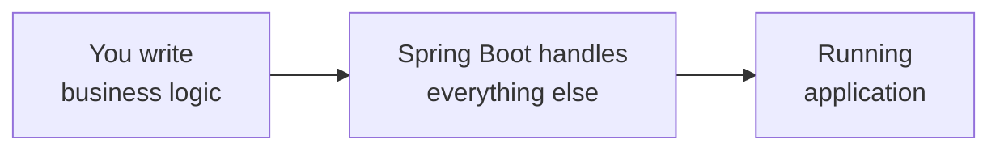
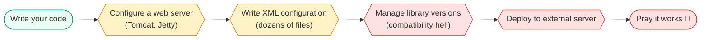
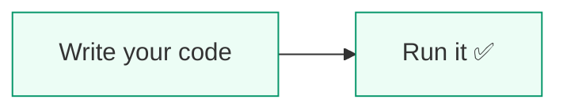
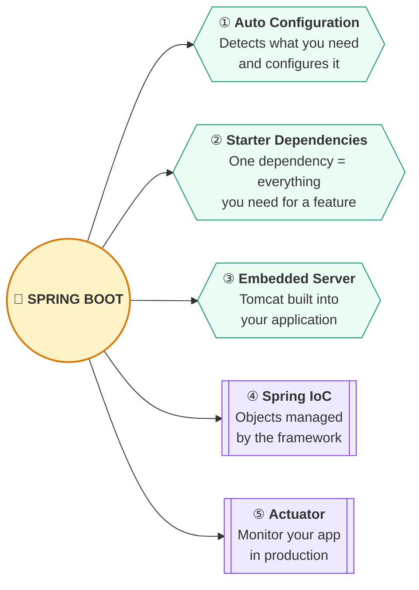
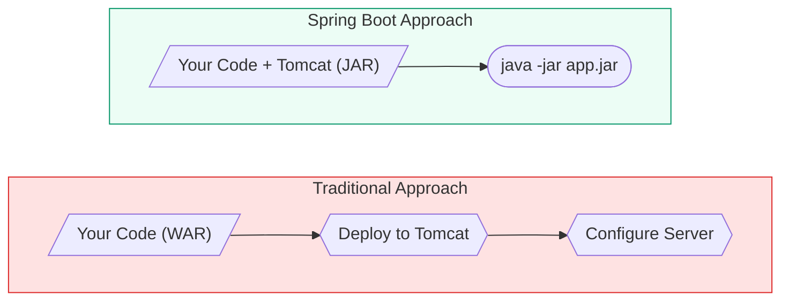
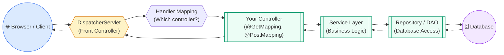

# Spring Boot

## What is Spring Boot?


```mermaid
flowchart LR
    A["You write<br/>business logic"] --> B["Spring Boot handles<br/>everything else"]
    B --> C["Running<br/>application"]
```

!!! abstract "In Simple Words"
    **Spring Boot** is a framework that lets you build production-ready Java applications with minimal setup. Think of it as a "smart assistant" — you tell it what you want to build, and it configures everything for you automatically.

Spring Boot is not a replacement for the Spring Framework — it sits **on top** of it. The Spring Framework provides powerful capabilities like dependency injection, AOP, transaction management, and web MVC. But configuring all of that manually requires extensive XML or Java configuration, careful dependency management, and deep knowledge of the framework internals.

Spring Boot eliminates that friction. It provides **opinionated defaults** — sensible configuration choices that work for 90% of use cases — while still letting you override anything when needed. The philosophy is **convention over configuration**: if you follow the conventions, everything just works.

!!! info "The Origin Story"
    Spring Boot was created in 2014 by Pivotal (now VMware) in response to developer frustration with Spring's configuration complexity. The goal was simple: make it possible to build a production-ready Spring application in minutes, not hours. Today, it is the most widely used Java framework for building backend services, REST APIs, and microservices.

---

## The Problem Spring Boot Solves

Imagine you want to build a web application in Java. Without Spring Boot, you'd need to:


```mermaid
flowchart LR
    A(["Write your code"]) --> B{{"Configure a web server<br/>(Tomcat, Jetty)"}}
    B --> C{{"Write XML configuration<br/>(dozens of files)"}}
    C --> D{{"Manage library versions<br/>(compatibility hell)"}}
    D --> E{{"Deploy to external server"}}
    E --> F(["Pray it works 🙏"])

    style A fill:#ECFDF5,stroke:#059669
    style B fill:#FEF3C7,stroke:#D97706
    style C fill:#FEF3C7,stroke:#D97706
    style D fill:#FEE2E2,stroke:#DC2626
    style E fill:#FEE2E2,stroke:#DC2626
    style F fill:#FEE2E2,stroke:#DC2626
```

Each of these steps introduces its own set of problems:

- **Web server configuration** — You need to download Tomcat or Jetty, configure `server.xml`, set up connection pools, thread pools, and SSL certificates.
- **XML configuration** — Spring's `applicationContext.xml` can grow to hundreds of lines. You need to declare every bean, every dependency, every datasource manually.
- **Dependency management** — Spring Framework 5.3.x works with Hibernate 5.6.x but not 6.0. Jackson 2.13 is compatible but 2.14 breaks serialization. Getting all libraries to work together is a full-time job.
- **External deployment** — You package a WAR file, deploy it to an external server, configure context paths, and hope the server's classloader doesn't conflict with your application's libraries.

**With Spring Boot**, all of that disappears:


```mermaid
flowchart LR
    A["Write your code"] --> B["Run it ✅"]

    style A fill:#ECFDF5,stroke:#059669
    style B fill:#ECFDF5,stroke:#059669
```

You add one dependency (`spring-boot-starter-web`), write your controller, and run `java -jar app.jar`. Spring Boot figures out that you want a web application, embeds Tomcat, configures a connection pool, sets up JSON serialization, and starts everything on port 8080.

!!! example "Real-World Impact"
    A typical Spring MVC project in 2013 had **50-80 lines of XML configuration** before writing a single line of business logic. A Spring Boot project in 2024 has **zero configuration files** for the same functionality. The `application.yml` file is optional and only needed when you want to override defaults.

---

## Spring vs Spring Boot — What's the Difference?

| Aspect | **Spring Framework** | **Spring Boot** |
|---|---|---|
| **Relationship** | The core framework with DI, AOP, MVC | A layer on top of Spring that removes boilerplate |
| **Configuration** | Manual XML or Java-based `@Configuration` classes | Auto-configuration — detects your classpath and configures beans |
| **Server** | Requires external application server (Tomcat, WildFly) | Embedded server — Tomcat, Jetty, or Undertow built into the JAR |
| **Dependency management** | You manually ensure all library versions are compatible | Starter POMs with pre-tested, compatible dependency sets |
| **Setup time** | Hours of configuration before writing business logic | Minutes — generate project at start.spring.io and start coding |
| **Production readiness** | You build monitoring, health checks, and metrics yourself | Actuator provides health checks, metrics, and monitoring out of the box |
| **Analogy** | Building a car from individual parts | Buying a car that's ready to drive, with the option to customize every part |

!!! tip "Key Insight"
    Spring Boot **is** Spring — it just removes the boring parts. Every Spring feature (DI, AOP, transactions, security, data access) works exactly the same in Spring Boot. The difference is that Spring Boot auto-configures them based on what's on your classpath, so you only write configuration for the things you want to customize.

---

## Core Concepts (The 5 Pillars)


```mermaid
flowchart LR
    SB(("🚀 <b>SPRING BOOT</b>"))
    SB --> P1{{"① <b>Auto Configuration</b><br/>Detects what you need<br/>and configures it"}}
    SB --> P2{{"② <b>Starter Dependencies</b><br/>One dependency = everything<br/>you need for a feature"}}
    SB --> P3{{"③ <b>Embedded Server</b><br/>Tomcat built into<br/>your application"}}
    SB --> P4[["④ <b>Spring IoC</b><br/>Objects managed<br/>by the framework"]]
    SB --> P5[["⑤ <b>Actuator</b><br/>Monitor your app<br/>in production"]]

    style SB fill:#FEF3C7,stroke:#D97706,stroke-width:2px
    style P1 fill:#ECFDF5,stroke:#059669
    style P2 fill:#ECFDF5,stroke:#059669
    style P3 fill:#ECFDF5,stroke:#059669
    style P4 fill:#EDE9FE,stroke:#7C3AED
    style P5 fill:#EDE9FE,stroke:#7C3AED
```

---

### ① Auto Configuration

Auto-configuration is the heart of Spring Boot. When your application starts, Spring Boot scans the classpath to see which libraries are present, then automatically creates and configures the beans those libraries need.

**How it works internally:**

1. Spring Boot loads all classes listed in `META-INF/spring/org.springframework.boot.autoconfigure.AutoConfiguration.imports` from every JAR on the classpath.
2. Each auto-configuration class has `@Conditional` annotations — conditions that must be true for that configuration to activate.
3. If the conditions are met, the beans defined in that class are created and added to the application context.

```java
// This is what Spring Boot does behind the scenes for DataSource
@AutoConfiguration
@ConditionalOnClass(DataSource.class) // Only if DataSource is on classpath
@ConditionalOnProperty(name = "spring.datasource.url") // Only if URL is configured
public class DataSourceAutoConfiguration {

    @Bean
    @ConditionalOnMissingBean // Only if you haven't defined your own
    public DataSource dataSource(DataSourceProperties properties) {
        return properties.initializeDataSourceBuilder().build();
    }
}
```

The `@ConditionalOnMissingBean` annotation is critical — it means auto-configuration **backs off** if you define your own bean. This is how Spring Boot provides sensible defaults while remaining fully customizable.

!!! tip "Debugging Auto-Configuration"
    Add `--debug` to your startup command or set `debug=true` in `application.properties`. Spring Boot will print a detailed report showing which auto-configurations were applied and which were skipped, along with the reason.

    ```
    Positive matches:    (applied)
    DataSourceAutoConfiguration matched:
       - @ConditionalOnClass found required class 'javax.sql.DataSource'
    
    Negative matches:    (skipped)
    MongoAutoConfiguration:
       - @ConditionalOnClass did not find 'com.mongodb.client.MongoClient'
    ```

**Example:** If you add `spring-boot-starter-data-jpa` to your `pom.xml`, Spring Boot will automatically:

- Create a `DataSource` connection pool (HikariCP by default)
- Configure Hibernate as the JPA provider
- Set up a `PlatformTransactionManager` for `@Transactional` support
- Create Spring Data JPA repositories from your interfaces
- Run schema generation or Flyway/Liquibase migrations

You write **zero** configuration for any of this. If you want to change the pool size or the dialect, you set a property in `application.yml`.

→ Deep dive: [Auto Configuration](AutoConfiguration.md)

---

### ② Starter Dependencies

Starters are curated dependency descriptors. Instead of researching which 15 libraries you need for web development (and which versions are compatible), you add one starter and get everything.

```xml
<!-- This single dependency gives you:
     - Spring MVC (web framework)
     - Embedded Tomcat (server)
     - Jackson (JSON serialization/deserialization)
     - Bean Validation (input validation)
     - Logging (SLF4J + Logback) -->
<dependency>
    <groupId>org.springframework.boot</groupId>
    <artifactId>spring-boot-starter-web</artifactId>
</dependency>
```

| Starter | What You Get | Typical Use Case |
|---------|-------------|-----------------|
| `spring-boot-starter-web` | Spring MVC, Tomcat, Jackson, Validation | REST APIs, web applications |
| `spring-boot-starter-data-jpa` | Hibernate, HikariCP, Spring Data JPA | Database access with ORM |
| `spring-boot-starter-security` | Spring Security, authentication filters | Authentication, authorization, OAuth2 |
| `spring-boot-starter-test` | JUnit 5, Mockito, Spring Test, AssertJ | Unit and integration testing |
| `spring-boot-starter-validation` | Hibernate Validator, Jakarta Validation | Input validation with `@Valid` |
| `spring-boot-starter-actuator` | Micrometer, health endpoints | Production monitoring |
| `spring-boot-starter-cache` | Spring Cache abstraction | Method-level caching |
| `spring-boot-starter-mail` | JavaMail, Spring Mail | Sending emails |

!!! warning "Version Management"
    Never specify versions for starter dependencies manually. The Spring Boot parent POM (`spring-boot-starter-parent`) manages all versions through a BOM (Bill of Materials). This guarantees that all libraries are tested together and compatible. If you override a version, you take responsibility for compatibility.

---

### ③ Embedded Server

Traditional Java web applications are packaged as WAR files and deployed to an external application server. This creates a tight coupling between your application and the server's configuration, classloader, and lifecycle.

Spring Boot **inverts** this model — the server is embedded inside your application. Your application is a self-contained JAR that includes everything it needs to run.


```mermaid
flowchart LR
    subgraph Traditional["Traditional Approach"]
        direction LR
        A1[/"Your Code (WAR)"/] --> A2{{"Deploy to Tomcat"}}
        A2 --> A3{{"Configure Server"}}
    end

    subgraph SpringBoot["Spring Boot Approach"]
        direction LR
        B1[/"Your Code + Tomcat (JAR)"/] --> B2(["java -jar app.jar"])
    end

    style Traditional fill:#FEE2E2,stroke:#DC2626
    style SpringBoot fill:#ECFDF5,stroke:#059669
```

Just run: `java -jar myapp.jar` — done.

| Server | Default? | Best For | Performance |
|--------|----------|----------|-------------|
| **Tomcat** | Yes | General purpose, most teams | Good all-around |
| **Jetty** | No | Lightweight, async-heavy apps | Better for long-lived connections |
| **Undertow** | No | High-performance, non-blocking | Best throughput in benchmarks |

To switch servers, exclude Tomcat and add the alternative:

```xml
<dependency>
    <groupId>org.springframework.boot</groupId>
    <artifactId>spring-boot-starter-web</artifactId>
    <exclusions>
        <exclusion>
            <groupId>org.springframework.boot</groupId>
            <artifactId>spring-boot-starter-tomcat</artifactId>
        </exclusion>
    </exclusions>
</dependency>
<dependency>
    <groupId>org.springframework.boot</groupId>
    <artifactId>spring-boot-starter-undertow</artifactId>
</dependency>
```

!!! info "Container Deployment"
    The embedded server model is perfect for containers (Docker/Kubernetes). Each container runs a single JAR — no need to install and configure Tomcat inside the container image. This makes your Docker images smaller, faster to build, and easier to manage.

---

### ④ Spring IoC (Inversion of Control)

Instead of **you** creating objects and managing their dependencies, Spring creates and manages them for you. This is called **Inversion of Control** — the framework controls the object lifecycle, not your code.

```java
// ❌ Without Spring — you manage everything manually
// Every time you need PaymentService, you create all its dependencies
PaymentService paymentService = new PaymentService(
    new StripePaymentGateway(new HttpClient(), new RetryTemplate()),
    new EmailNotificationService(new SmtpMailSender("smtp.gmail.com")),
    new DatabaseAuditLogger(new JdbcTemplate(dataSource))
);

// ✅ With Spring — just declare the dependency
@Service
public class OrderService {

    private final PaymentService paymentService;

    // Spring automatically injects the right PaymentService instance
    // along with all of ITS dependencies, recursively
    public OrderService(PaymentService paymentService) {
        this.paymentService = paymentService;
    }
}
```

Spring manages all your objects (called **beans**) in an **Application Context** — a container that holds every bean and knows how to wire them together. When your application starts:

1. Spring scans your packages for classes annotated with `@Component`, `@Service`, `@Repository`, `@Controller`
2. It creates instances of these classes (beans)
3. It resolves their dependencies by looking at constructor parameters
4. It injects the right bean into each dependency

!!! tip "Constructor Injection is Preferred"
    Always use **constructor injection** (not `@Autowired` on fields). Constructor injection makes dependencies explicit, supports immutability (`final` fields), and makes testing easier — you can pass mocks directly through the constructor without reflection.

→ Deep dive: [IoC & Dependency Injection](SpringIOC.md) | [Types of DI](TypesOfDi.md)

---

### ⑤ Actuator — Monitor Your App

In production, you need visibility into your application's health, performance, and behavior. Actuator provides this out of the box — no custom code required.

```xml
<dependency>
    <groupId>org.springframework.boot</groupId>
    <artifactId>spring-boot-starter-actuator</artifactId>
</dependency>
```

```yaml
# application.yml
management:
  endpoints:
    web:
      exposure:
        include: health, info, metrics, env, beans
  endpoint:
    health:
      show-details: always
```

| Endpoint | What It Shows | Production Use |
|----------|--------------|----------------|
| `/actuator/health` | App status, DB connection, disk space | Load balancer health checks, Kubernetes liveness/readiness probes |
| `/actuator/metrics` | JVM memory, CPU, HTTP request counts, response times | Prometheus scraping → Grafana dashboards |
| `/actuator/env` | All configuration properties and their sources | Debugging which config file overrode which property |
| `/actuator/beans` | Every bean in the application context | Debugging dependency injection issues |
| `/actuator/info` | Build info, git commit, custom app info | Identifying which version is deployed |
| `/actuator/loggers` | Logger levels — can change at runtime | Enabling DEBUG logging in production without restart |

!!! warning "Security"
    Never expose all actuator endpoints in production without authentication. Endpoints like `/env` and `/beans` reveal sensitive internal details. In production, expose only `/health` and `/info` publicly, and protect everything else behind Spring Security.

→ Deep dive: [Actuator & Monitoring](actuator.md)

---

## Your First Spring Boot App (5 Minutes)

=== "Step 1: Create Project"

    Go to [start.spring.io](https://start.spring.io) and select:

    - **Project:** Maven
    - **Language:** Java 17+
    - **Spring Boot:** 3.x (latest stable)
    - **Dependencies:** Spring Web

    Click **Generate** → Download → Unzip → Open in your IDE

=== "Step 2: Understand the Entry Point"

    ```java
    @SpringBootApplication // Combines @Configuration + @EnableAutoConfiguration + @ComponentScan
    public class MyAppApplication {

        public static void main(String[] args) {
            // This single line starts Tomcat, loads all configs, creates all beans
            SpringApplication.run(MyAppApplication.class, args);
        }
    }
    ```

    `@SpringBootApplication` is a convenience annotation that combines three annotations:

    - `@Configuration` — This class can define beans via `@Bean` methods
    - `@EnableAutoConfiguration` — Turn on auto-configuration
    - `@ComponentScan` — Scan this package and sub-packages for components

=== "Step 3: Write a Controller"

    ```java
    @RestController
    @RequestMapping("/api")
    public class HelloController {

        @GetMapping("/hello")
        public String hello() {
            return "Hello, World!";
        }

        @GetMapping("/hello/{name}")
        public Map<String, String> greet(@PathVariable String name) {
            return Map.of("message", "Hello, " + name + "!");
        }
    }
    ```

=== "Step 4: Run It"

    ```bash
    ./mvnw spring-boot:run
    ```

    Open browser → `http://localhost:8080/api/hello` → You'll see `Hello, World!`

    Try `http://localhost:8080/api/hello/Vamsi` → You'll see `{"message":"Hello, Vamsi!"}`

That's it. No XML. No external server. No complex setup.

---

## How a Request Flows Through Spring Boot


```mermaid
flowchart LR
    Client(("🌐 Browser / Client")) --> DS{{"DispatcherServlet<br/>(Front Controller)"}}
    DS --> HM{{"Handler Mapping<br/>(Which controller?)"}}
    HM --> C[["Your Controller<br/>(@GetMapping, @PostMapping)"]]
    C --> S[["Service Layer<br/>(Business Logic)"]]
    S --> R[["Repository / DAO<br/>(Database Access)"]]
    R --> DB(("🗄️ Database"))
    DB --> R
    R --> S
    S --> C
    C --> DS
    DS --> Client

    style Client fill:#DBEAFE,stroke:#2563EB
    style DS fill:#FEF3C7,stroke:#D97706
    style C fill:#ECFDF5,stroke:#059669
    style S fill:#ECFDF5,stroke:#059669
    style R fill:#ECFDF5,stroke:#059669
    style DB fill:#F3E8FF,stroke:#9333EA
```

Every HTTP request in a Spring Boot application follows this path:

1. **Client** sends a request (e.g., `GET /api/users/42`)
2. **Embedded Tomcat** receives the raw HTTP request and forwards it to the `DispatcherServlet`
3. **DispatcherServlet** is the front controller — the single entry point for all requests. It consults the `HandlerMapping` to find which controller method handles this URL pattern.
4. **Handler Mapping** matches `/api/users/{id}` with `@GetMapping("/{id}")` to find `UserController.getById()`. It also resolves path variables, request parameters, and headers.
5. **Controller** receives the request with parameters already extracted and validated. It delegates business logic to the service layer. Controllers should be thin — no business logic here.
6. **Service Layer** contains all business rules, validation, and orchestration. It coordinates between multiple repositories if needed, handles transactions, and applies domain logic.
7. **Repository** translates method calls into database queries. Spring Data JPA generates the SQL automatically from method names like `findByEmailAndStatus()`.
8. **Response flows back** — the repository returns entities, the service transforms them into DTOs, the controller returns the DTO, and Spring's `HttpMessageConverter` (Jackson) serializes it to JSON.

!!! tip "Layered Architecture"
    Each layer has a specific responsibility:

    - **Controller** → HTTP concerns (request mapping, validation, response codes)
    - **Service** → Business logic (rules, calculations, orchestration)
    - **Repository** → Data access (queries, persistence)

    Never skip layers. A controller should never call a repository directly — always go through the service, even if the service just delegates. This keeps your code testable and maintainable as complexity grows.

---

## Request Mapping — Routing URLs to Code

```java
@RestController
@RequestMapping("/api/users")
public class UserController {

    private final UserService userService;

    public UserController(UserService userService) {
        this.userService = userService;
    }

    @GetMapping                    // GET /api/users
    public List<UserDTO> getAll() {
        return userService.findAll();
    }

    @GetMapping("/{id}")           // GET /api/users/123
    public UserDTO getById(@PathVariable Long id) {
        return userService.findById(id);
    }

    @PostMapping                   // POST /api/users
    @ResponseStatus(HttpStatus.CREATED)
    public UserDTO create(@Valid @RequestBody CreateUserRequest request) {
        return userService.create(request);
    }

    @PutMapping("/{id}")           // PUT /api/users/123
    public UserDTO update(@PathVariable Long id, @Valid @RequestBody UpdateUserRequest request) {
        return userService.update(id, request);
    }

    @DeleteMapping("/{id}")        // DELETE /api/users/123
    @ResponseStatus(HttpStatus.NO_CONTENT)
    public void delete(@PathVariable Long id) {
        userService.delete(id);
    }
}
```

| Annotation | HTTP Method | Typical Use |
|-----------|-------------|-------------|
| `@GetMapping` | GET | Fetch data (idempotent, cacheable) |
| `@PostMapping` | POST | Create a new resource |
| `@PutMapping` | PUT | Full update of an existing resource |
| `@PatchMapping` | PATCH | Partial update of an existing resource |
| `@DeleteMapping` | DELETE | Remove a resource |

---

## Project Structure

```
my-app/
├── src/main/java/com/example/myapp/
│   ├── MyAppApplication.java          ← Entry point (@SpringBootApplication)
│   ├── controller/                    ← REST endpoints (thin, HTTP-only concerns)
│   │   └── UserController.java
│   ├── service/                       ← Business logic (rules, orchestration)
│   │   └── UserService.java
│   ├── repository/                    ← Database access (Spring Data interfaces)
│   │   └── UserRepository.java
│   ├── model/                         ← JPA entities (database tables)
│   │   └── User.java
│   ├── dto/                           ← Data transfer objects (API contracts)
│   │   ├── UserDTO.java
│   │   └── CreateUserRequest.java
│   ├── exception/                     ← Custom exceptions + global handler
│   │   └── GlobalExceptionHandler.java
│   └── config/                        ← Custom configuration classes
│       └── SecurityConfig.java
├── src/main/resources/
│   ├── application.yml                ← Main configuration
│   ├── application-dev.yml            ← Dev profile overrides
│   ├── application-prod.yml           ← Production profile overrides
│   └── db/migration/                  ← Flyway database migrations
├── src/test/java/                     ← Tests (mirror the main structure)
└── pom.xml                            ← Dependencies and build config
```

!!! info "Package Naming Convention"
    Spring Boot scans the package of your `@SpringBootApplication` class and all sub-packages. If your main class is in `com.example.myapp`, then all controllers, services, and repositories must be in `com.example.myapp.*` sub-packages. Beans in `com.example.other` will NOT be found unless you explicitly add `@ComponentScan`.

---

## Configuration — application.yml

Spring Boot uses a hierarchical configuration system. The most common properties:

```yaml
# Server configuration
server:
  port: 8080
  servlet:
    context-path: /api

# Database
spring:
  datasource:
    url: jdbc:postgresql://localhost:5432/mydb
    username: ${DB_USER:postgres}    # Environment variable with default
    password: ${DB_PASS:password}
  jpa:
    hibernate:
      ddl-auto: validate             # Never use 'update' or 'create' in production
    show-sql: false
    open-in-view: false              # Disable OSIV — it's an anti-pattern

# Logging
logging:
  level:
    com.example.myapp: DEBUG
    org.springframework.web: INFO
    org.hibernate.SQL: DEBUG
```

!!! warning "Common Configuration Mistakes"
    - **`ddl-auto: update` in production** — Hibernate will attempt to alter your production database schema. Use Flyway or Liquibase for migrations instead.
    - **`open-in-view: true` (the default)** — Keeps a database connection open for the entire HTTP request, including view rendering. This can exhaust your connection pool under load. Always set it to `false`.
    - **Hardcoded credentials** — Use environment variables (`${DB_PASS}`) or a secrets manager, never plain text in `application.yml`.

---

## Spring Boot 3 — What's New?

| Feature | Details | Impact |
|---------|---------|--------|
| **Java 17+ required** | Minimum Java version is 17 — records, sealed classes, text blocks available | Modernized codebase, better performance |
| **Jakarta EE 10** | `javax.*` → `jakarta.*` package change across all APIs | One-time migration — find/replace in imports |
| **GraalVM Native Images** | Compile to native binary — starts in milliseconds, uses fraction of memory | Ideal for serverless (AWS Lambda) and CLI tools |
| **Observability** | Built-in Micrometer + OpenTelemetry tracing support | Distributed tracing without adding third-party libraries |
| **Virtual Threads (Java 21)** | Set `spring.threads.virtual.enabled=true` — every request runs on a virtual thread | Massive throughput improvement for I/O-heavy applications |
| **Problem Details (RFC 7807)** | Standardized error response format | Consistent error handling across APIs |

→ Deep dive: [Spring Boot 3](SpringBoot3.md)

---

## Common Mistakes and Anti-Patterns

| Mistake | Problem | Solution |
|---------|---------|----------|
| Business logic in controllers | Hard to test, violates single responsibility | Move logic to `@Service` classes |
| Field injection (`@Autowired` on fields) | Hidden dependencies, harder to test | Use constructor injection |
| Returning JPA entities from controllers | Exposes database schema, lazy loading issues | Use DTOs for API responses |
| Catching `Exception` everywhere | Swallows important errors silently | Use `@ControllerAdvice` global exception handler |
| Not using profiles | Same config for dev and prod | Use `application-dev.yml` and `application-prod.yml` |
| `spring.jpa.open-in-view=true` (default) | Holds DB connections too long, N+1 queries hidden | Set to `false`, fetch data explicitly in service layer |
| No connection pool tuning | Default HikariCP pool size (10) may be too small or large | Tune `spring.datasource.hikari.maximum-pool-size` based on load |

---

## When to Use Spring Boot

| Use Case | Spring Boot? | Reason |
|----------|:---:|--------|
| REST APIs and backend services | ✅ | Built for this — embedded server, auto-config, actuator |
| Microservices | ✅ | Spring Cloud ecosystem, lightweight JARs, container-friendly |
| Web applications (server-rendered) | ✅ | Thymeleaf/Freemarker integration, Spring MVC |
| Batch processing | ✅ | Spring Batch integration with starter |
| Event-driven applications | ✅ | Spring for Apache Kafka, RabbitMQ starters |
| Serverless functions | ✅ | Spring Cloud Function + GraalVM native images |
| Simple scripts or CLI tools | ❌ | Overkill — use plain Java or a lightweight framework |
| Android / iOS apps | ❌ | Not designed for mobile |
| Frontend-only projects | ❌ | Use React, Angular, or Vue instead |

---

## Interview Q&A

??? question "What is Spring Boot and how is it different from Spring Framework?"
    Spring Boot is an opinionated layer on top of the Spring Framework that eliminates boilerplate configuration. Spring Framework provides the core capabilities (DI, AOP, MVC, data access), but requires extensive manual configuration. Spring Boot auto-configures everything based on your classpath — if you add a JPA starter, it sets up DataSource, EntityManager, and transaction management automatically. The key difference is **convention over configuration**: Spring Boot provides sensible defaults that work for most applications, while Spring Framework requires you to configure everything explicitly.

??? question "How does Spring Boot auto-configuration work internally?"
    When the application starts, `@EnableAutoConfiguration` triggers Spring Boot to load all auto-configuration classes listed in `META-INF/spring/org.springframework.boot.autoconfigure.AutoConfiguration.imports`. Each class uses `@Conditional` annotations (like `@ConditionalOnClass`, `@ConditionalOnMissingBean`, `@ConditionalOnProperty`) to determine whether it should activate. For example, `DataSourceAutoConfiguration` only activates if `javax.sql.DataSource` is on the classpath AND you haven't already defined your own DataSource bean. This "back-off" behavior means your explicit configuration always takes precedence.

??? question "What is the purpose of @SpringBootApplication?"
    It's a convenience annotation that combines three annotations: `@Configuration` (this class can define `@Bean` methods), `@EnableAutoConfiguration` (activate auto-configuration), and `@ComponentScan` (scan the current package and sub-packages for Spring components). It must be placed on the main class and should be in the root package of your application so that `@ComponentScan` finds all your beans.

??? question "How does Spring Boot's embedded server work?"
    Spring Boot includes a server (Tomcat by default) as a dependency inside your JAR. When you run `java -jar app.jar`, the `main()` method calls `SpringApplication.run()`, which creates the application context, detects that you have web dependencies, starts the embedded server, and registers your `DispatcherServlet`. The server runs in the same JVM process as your application. You can switch to Jetty or Undertow by excluding the Tomcat starter and adding the alternative.

??? question "Explain the Spring Boot application startup process."
    1. `main()` calls `SpringApplication.run()`
    2. Spring creates the `ApplicationContext` (the bean container)
    3. `@ComponentScan` finds all `@Component`, `@Service`, `@Repository`, `@Controller` classes
    4. `@EnableAutoConfiguration` loads and evaluates all auto-configuration classes
    5. All beans are created and their dependencies are injected
    6. `ApplicationRunner` and `CommandLineRunner` beans execute
    7. Embedded server starts and begins accepting requests
    8. Application is ready — `ApplicationReadyEvent` is published

??? question "What is the difference between @Controller and @RestController?"
    `@Controller` is used for traditional MVC controllers that return view names (HTML templates). `@RestController` is `@Controller` + `@ResponseBody` — every method's return value is serialized directly to the HTTP response body (typically JSON). In modern API development, you almost always use `@RestController`.

??? question "How do Spring Boot profiles work?"
    Profiles let you define different configurations for different environments. You create `application-dev.yml` and `application-prod.yml` with environment-specific settings. Activate a profile with `spring.profiles.active=dev` (via environment variable, command line, or properties file). Profile-specific properties override the base `application.yml`. You can also use `@Profile("dev")` on beans to conditionally create them only in specific environments.

??? question "What is Spring Boot Actuator and how is it used in production?"
    Actuator exposes operational endpoints for monitoring and managing your application. The `/health` endpoint is used by load balancers and Kubernetes for health checks. The `/metrics` endpoint exposes JVM and application metrics that Prometheus can scrape for Grafana dashboards. The `/loggers` endpoint lets you change log levels at runtime without restarting. In production, you should secure actuator endpoints with Spring Security and only expose `/health` and `/info` publicly.

??? question "How do you handle exceptions globally in Spring Boot?"
    Use `@ControllerAdvice` with `@ExceptionHandler` methods. This creates a centralized exception handler that catches exceptions from all controllers. Each handler method maps to a specific exception type and returns an appropriate HTTP response. Spring Boot 3 supports RFC 7807 Problem Details for standardized error responses.

    ```java
    @RestControllerAdvice
    public class GlobalExceptionHandler {

        @ExceptionHandler(ResourceNotFoundException.class)
        @ResponseStatus(HttpStatus.NOT_FOUND)
        public ProblemDetail handleNotFound(ResourceNotFoundException ex) {
            ProblemDetail detail = ProblemDetail.forStatus(HttpStatus.NOT_FOUND);
            detail.setTitle("Resource Not Found");
            detail.setDetail(ex.getMessage());
            return detail;
        }
    }
    ```

→ Deep dive: [Exception Handling](exceptionhandling.md)

---

## Next Steps

| Topic | Link |
|-------|------|
| Auto Configuration — how it works internally | [Auto Configuration](AutoConfiguration.md) |
| All Spring Boot Annotations explained | [Annotations](Annotations.md) |
| IoC & Dependency Injection deep dive | [Spring IoC](SpringIOC.md) |
| Types of Dependency Injection | [Types of DI](TypesOfDi.md) |
| Bean Lifecycle & Scopes | [Bean Lifecycle](bean-lifecycle.md) |
| REST API Best Practices | [REST APIs](restapibestpractices.md) |
| Exception Handling | [Exception Handling](exceptionhandling.md) |
| Spring Boot 3 features | [Spring Boot 3](SpringBoot3.md) |
