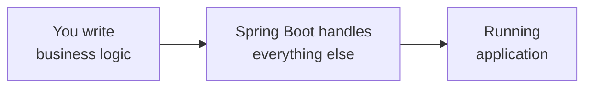
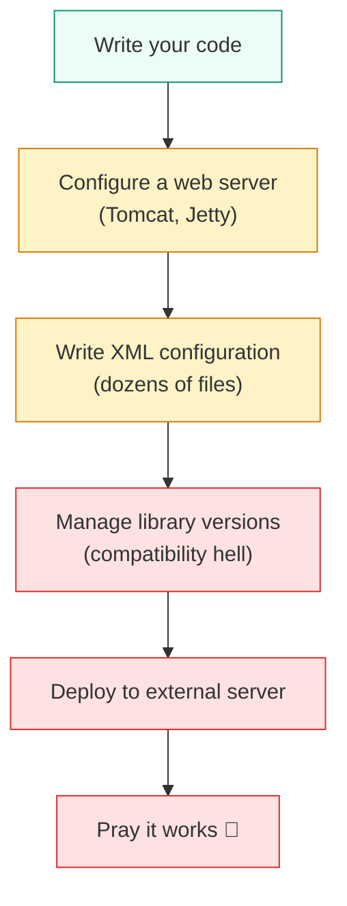
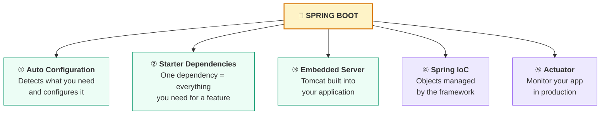
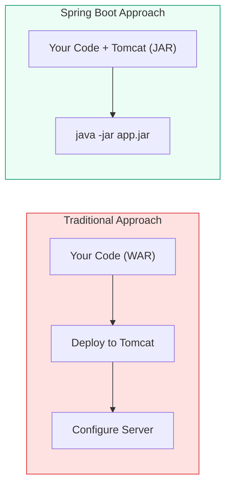
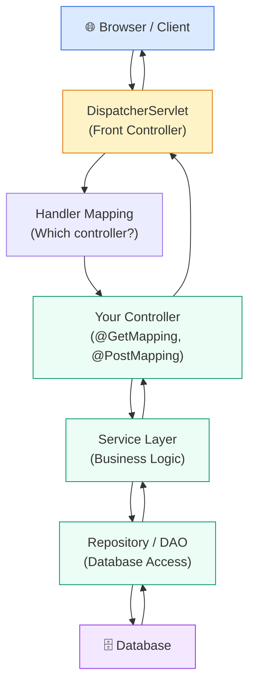

# Spring Boot

## What is Spring Boot?


```mermaid
flowchart LR
    A["You write<br/>business logic"] --> B["Spring Boot handles<br/>everything else"]
    B --> C["Running<br/>application"]
```

!!! abstract "In Simple Words"
    **Spring Boot** is a framework that lets you build production-ready Java applications with minimal setup. Think of it as a "smart assistant" — you tell it what you want to build, and it configures everything for you automatically.

---

## The Problem Spring Boot Solves

Imagine you want to build a web application in Java. Without Spring Boot, you'd need to:


```mermaid
flowchart TD
    A["Write your code"] --> B["Configure a web server<br/>(Tomcat, Jetty)"]
    B --> C["Write XML configuration<br/>(dozens of files)"]
    C --> D["Manage library versions<br/>(compatibility hell)"]
    D --> E["Deploy to external server"]
    E --> F["Pray it works 🙏"]

    style A fill:#ECFDF5,stroke:#059669
    style B fill:#FEF3C7,stroke:#D97706
    style C fill:#FEF3C7,stroke:#D97706
    style D fill:#FEE2E2,stroke:#DC2626
    style E fill:#FEE2E2,stroke:#DC2626
    style F fill:#FEE2E2,stroke:#DC2626
```

**With Spring Boot**, all of that disappears:


```mermaid
flowchart LR
    A["Write your code"] --> B["Run it ✅"]

    style A fill:#ECFDF5,stroke:#059669
    style B fill:#ECFDF5,stroke:#059669
```

---

## Spring vs Spring Boot — What's the Difference?

| | **Spring Framework** | **Spring Boot** |
|---|---|---|
| **What** | A powerful but complex Java framework | A layer on top of Spring that removes complexity |
| **Configuration** | Manual XML or Java config | Auto-configuration (zero XML) |
| **Server** | Need external server (Tomcat) | Embedded server — just run the JAR |
| **Setup time** | Hours | Minutes |
| **Analogy** | Building a car from parts | Buying a car that's ready to drive |

!!! tip "Key Insight"
    Spring Boot **is** Spring — it just removes the boring parts. Everything Spring can do, Spring Boot can do with less code.

---

## Core Concepts (The 5 Pillars)


```mermaid
flowchart TD
    SB["🚀 <b>SPRING BOOT</b>"]
    SB --> P1["① <b>Auto Configuration</b><br/>Detects what you need<br/>and configures it"]
    SB --> P2["② <b>Starter Dependencies</b><br/>One dependency = everything<br/>you need for a feature"]
    SB --> P3["③ <b>Embedded Server</b><br/>Tomcat built into<br/>your application"]
    SB --> P4["④ <b>Spring IoC</b><br/>Objects managed<br/>by the framework"]
    SB --> P5["⑤ <b>Actuator</b><br/>Monitor your app<br/>in production"]

    style SB fill:#FEF3C7,stroke:#D97706,stroke-width:2px
    style P1 fill:#ECFDF5,stroke:#059669
    style P2 fill:#ECFDF5,stroke:#059669
    style P3 fill:#ECFDF5,stroke:#059669
    style P4 fill:#EDE9FE,stroke:#7C3AED
    style P5 fill:#EDE9FE,stroke:#7C3AED
```

---

### ① Auto Configuration

Spring Boot looks at what libraries are in your project and configures them automatically.

**Example:** If you add a database library, Spring Boot will:

- Create a connection pool
- Configure the data source
- Set up transaction management

You write **zero** configuration for this.

---

### ② Starter Dependencies

Instead of adding 10 separate libraries for web development, you add ONE:

```xml
<!-- This single dependency gives you: -->
<!-- Tomcat, Spring MVC, Jackson (JSON), Validation -->
<dependency>
    <groupId>org.springframework.boot</groupId>
    <artifactId>spring-boot-starter-web</artifactId>
</dependency>
```

| Starter | What You Get |
|---------|-------------|
| `spring-boot-starter-web` | REST APIs, Tomcat, JSON |
| `spring-boot-starter-data-jpa` | Database access, Hibernate |
| `spring-boot-starter-security` | Authentication, Authorization |
| `spring-boot-starter-test` | JUnit, Mockito, Test utilities |

---

### ③ Embedded Server

Traditional Java apps require you to install and configure a server separately. Spring Boot **embeds** the server inside your application.


```mermaid
flowchart LR
    subgraph Traditional["Traditional Approach"]
        direction TB
        A1["Your Code (WAR)"] --> A2["Deploy to Tomcat"]
        A2 --> A3["Configure Server"]
    end

    subgraph SpringBoot["Spring Boot Approach"]
        direction TB
        B1["Your Code + Tomcat (JAR)"] --> B2["java -jar app.jar"]
    end

    style Traditional fill:#FEE2E2,stroke:#DC2626
    style SpringBoot fill:#ECFDF5,stroke:#059669
```

Just run: `java -jar myapp.jar` — done.

---

### ④ Spring IoC (Inversion of Control)

Instead of YOU creating objects, Spring creates and manages them for you.

```java
// ❌ Without Spring — you manage everything
PaymentService paymentService = new PaymentService(
    new PaymentGateway(),
    new NotificationService(),
    new AuditLogger()
);

// ✅ With Spring — just ask for it
@Autowired
PaymentService paymentService;
```

Spring handles object creation, lifecycle, and wiring.

→ Deep dive: [IoC & Dependency Injection](SpringIOC.md)

---

### ⑤ Actuator — Monitor Your App

Actuator gives you production-ready monitoring endpoints out of the box.

```xml
<dependency>
    <groupId>org.springframework.boot</groupId>
    <artifactId>spring-boot-starter-actuator</artifactId>
</dependency>
```

```yaml
# application.yml
management:
  endpoints:
    web:
      exposure:
        include: '*'
  endpoint:
    health:
      show-details: always
```

| Endpoint | What It Shows |
|----------|--------------|
| `/actuator/health` | Is the app running? DB connected? |
| `/actuator/beans` | All Spring-managed objects |
| `/actuator/metrics` | Memory, CPU, request counts |
| `/actuator/env` | Configuration properties |

---

## Your First Spring Boot App (5 Minutes)

=== "Step 1: Create Project"

    Go to [start.spring.io](https://start.spring.io) and select:

    - **Project:** Maven
    - **Language:** Java
    - **Spring Boot:** 3.x (latest)
    - **Dependencies:** Spring Web

    Click **Generate** → Download → Unzip

=== "Step 2: Write a Controller"

    ```java
    @RestController
    public class HelloController {

        @GetMapping("/hello")
        public String hello() {
            return "Hello, World!";
        }
    }
    ```

=== "Step 3: Run It"

    ```bash
    ./mvnw spring-boot:run
    ```

    Open browser → `http://localhost:8080/hello` → You'll see "Hello, World!"

That's it. No XML. No external server. No complex setup.

---

## How a Request Flows Through Spring Boot


```mermaid
flowchart TD
    Client["🌐 Browser / Client"] --> DS["DispatcherServlet<br/>(Front Controller)"]
    DS --> HM["Handler Mapping<br/>(Which controller?)"]
    HM --> C["Your Controller<br/>(@GetMapping, @PostMapping)"]
    C --> S["Service Layer<br/>(Business Logic)"]
    S --> R["Repository / DAO<br/>(Database Access)"]
    R --> DB["🗄️ Database"]
    DB --> R
    R --> S
    S --> C
    C --> DS
    DS --> Client

    style Client fill:#DBEAFE,stroke:#2563EB
    style DS fill:#FEF3C7,stroke:#D97706
    style C fill:#ECFDF5,stroke:#059669
    style S fill:#ECFDF5,stroke:#059669
    style R fill:#ECFDF5,stroke:#059669
    style DB fill:#F3E8FF,stroke:#9333EA
```

**Simplified explanation:**

1. Client sends a request (e.g., `GET /users`)
2. **DispatcherServlet** receives it (the "traffic cop")
3. It finds the right **Controller** method
4. Controller calls **Service** (business logic)
5. Service calls **Repository** (database)
6. Response flows back to the client

---

## Request Mapping — Routing URLs to Code

```java
@RestController
@RequestMapping("/api/users")
public class UserController {

    @GetMapping          // GET /api/users
    public List<User> getAll() { ... }

    @GetMapping("/{id}") // GET /api/users/123
    public User getById(@PathVariable Long id) { ... }

    @PostMapping         // POST /api/users
    public User create(@RequestBody User user) { ... }

    @PutMapping("/{id}") // PUT /api/users/123
    public User update(@PathVariable Long id, @RequestBody User user) { ... }

    @DeleteMapping("/{id}") // DELETE /api/users/123
    public void delete(@PathVariable Long id) { ... }
}
```

---

## Project Structure

```
my-app/
├── src/main/java/com/example/myapp/
│   ├── MyAppApplication.java      ← Entry point
│   ├── controller/                ← REST endpoints
│   ├── service/                   ← Business logic
│   ├── repository/                ← Database access
│   └── model/                     ← Data classes
├── src/main/resources/
│   ├── application.yml            ← Configuration
│   └── static/                    ← Static files
├── src/test/java/                 ← Tests
└── pom.xml                        ← Dependencies
```

---

## Spring Boot 3 — What's New?

| Feature | Details |
|---------|---------|
| **Java 17+ required** | Minimum Java version is 17 |
| **Jakarta EE** | `javax.*` → `jakarta.*` package change |
| **Native Images** | GraalVM support for instant startup |
| **Observability** | Built-in Micrometer + tracing |
| **Virtual Threads** | Java 21 lightweight thread support |

→ Deep dive: [Spring Boot 3](SpringBoot3.md)

---

## When to Use Spring Boot

| Use Case | Spring Boot? |
|----------|:---:|
| REST APIs | ✅ |
| Microservices | ✅ |
| Web applications | ✅ |
| Batch processing | ✅ |
| Simple scripts | ❌ (overkill) |
| Android apps | ❌ |
| Frontend-only | ❌ |

---

## Next Steps

| Topic | Link |
|-------|------|
| Auto Configuration (how it works internally) | [Auto Configuration](AutoConfiguration.md) |
| All Spring Boot Annotations explained | [Annotations](Annotations.md) |
| IoC & Dependency Injection deep dive | [Spring IoC](SpringIOC.md) |
| Types of Dependency Injection | [Types of DI](TypesOfDi.md) |
| REST API Best Practices | [REST APIs](restapibestpractices.md) |
| Spring Boot 3 features | [Spring Boot 3](SpringBoot3.md) |
