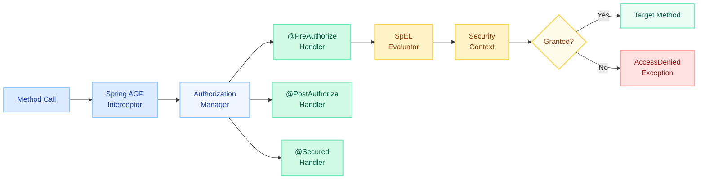
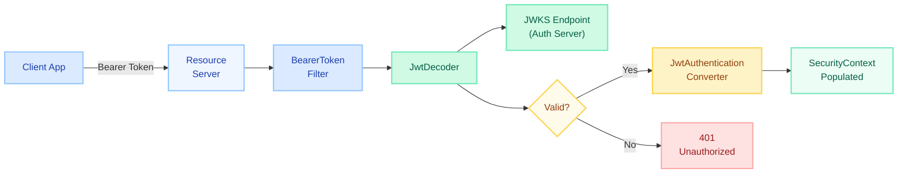
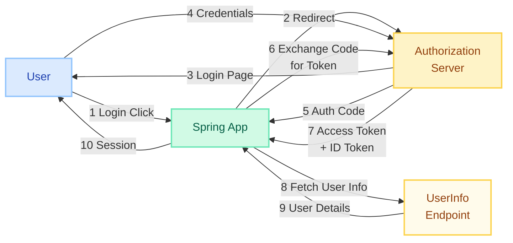

# Method Security & OAuth2

> "URL-based security tells you *where* the gate is; method security tells you *who* is allowed through each door inside the building."

---

!!! danger "Real Incident: IDOR via Missing Method-Level Authorization"
    A SaaS platform secured endpoints with URL patterns: `.requestMatchers("/api/accounts/{id}/**").authenticated()`. Any logged-in user could change the `{id}` in the URL and **access another user's account data** — classic **Insecure Direct Object Reference (IDOR)**. The root cause: no `@PreAuthorize` check verifying that `#id` belonged to the authenticated principal. URL-level security only confirms *authentication*; **method-level security enforces *authorization* per resource.**

---

## Method Security

### Enabling Method Security

```java
@Configuration
@EnableMethodSecurity // Spring Security 6+ (replaces @EnableGlobalMethodSecurity)
public class MethodSecurityConfig {
    // Enables @PreAuthorize, @PostAuthorize, @PreFilter, @PostFilter by default
    // For @Secured support, use @EnableMethodSecurity(securedEnabled = true)
}
```

!!! info "Migration Note"
    `@EnableGlobalMethodSecurity` is deprecated since Spring Security 6.0. Use `@EnableMethodSecurity` which uses proxy-based AOP by default and supports meta-annotations.

---

### @PreAuthorize — Before Method Execution

Evaluates a **SpEL expression** before the method runs. If the expression returns `false`, an `AccessDeniedException` is thrown.

```java
@Service
public class AccountService {

    // Role-based
    @PreAuthorize("hasRole('ADMIN')")
    public void deleteAccount(Long accountId) { ... }

    // Permission-based with method argument access
    @PreAuthorize("#accountId == authentication.principal.id or hasRole('ADMIN')")
    public Account getAccount(Long accountId) { ... }

    // Custom bean-based check
    @PreAuthorize("@accountSecurity.isOwner(#accountId, authentication)")
    public void updateAccount(Long accountId, AccountDto dto) { ... }
}
```

**Common SpEL Expressions:**

| Expression | Description |
|---|---|
| `hasRole('ADMIN')` | User has ROLE_ADMIN |
| `hasAnyRole('ADMIN','MANAGER')` | User has any listed role |
| `hasAuthority('account:write')` | User has exact authority |
| `#paramName == authentication.principal.id` | Method arg matches principal |
| `@beanName.method(args)` | Delegates to a Spring bean |
| `authentication.principal.claims['tenant_id']` | JWT claim access |

---

### @PostAuthorize — After Method Execution

Evaluates **after** the method returns. Use when the authorization decision depends on the **return value**.

```java
@PostAuthorize("returnObject.owner == authentication.name")
public Document getDocument(Long docId) {
    return documentRepository.findById(docId).orElseThrow();
}
```

!!! warning "Performance Consideration"
    `@PostAuthorize` executes the full method body before checking authorization. Avoid on expensive operations — prefer `@PreAuthorize` with a repository lookup when possible.

---

### @PreFilter and @PostFilter — Collection Filtering

Filter collections **before** (input) or **after** (output) method execution without throwing exceptions.

```java
// Filter input: only keep items the user owns
@PreFilter("filterObject.owner == authentication.name")
public void batchDelete(List<Document> documents) {
    documentRepository.deleteAll(documents); // only user's own docs reach here
}

// Filter output: remove items the user shouldn't see
@PostFilter("filterObject.department == authentication.principal.department")
public List<Report> getAllReports() {
    return reportRepository.findAll(); // non-matching items silently removed
}
```

---

### @Secured — Simple Role-Based

Simpler than `@PreAuthorize` — no SpEL, only role checks.

```java
@Secured({"ROLE_ADMIN", "ROLE_MANAGER"})
public void approveExpense(Long expenseId) { ... }
```

Must be explicitly enabled: `@EnableMethodSecurity(securedEnabled = true)`

---

### Custom Permission Evaluator

For complex domain-specific authorization logic:

```java
@Component
public class CustomPermissionEvaluator implements PermissionEvaluator {

    @Override
    public boolean hasPermission(Authentication auth, Object target, Object permission) {
        if (target instanceof Document doc) {
            return switch (permission.toString()) {
                case "READ"  -> doc.isPublic() || doc.getOwner().equals(auth.getName());
                case "WRITE" -> doc.getOwner().equals(auth.getName());
                case "DELETE" -> hasRole(auth, "ADMIN") || doc.getOwner().equals(auth.getName());
                default -> false;
            };
        }
        return false;
    }

    @Override
    public boolean hasPermission(Authentication auth, Serializable targetId,
                                  String targetType, Object permission) {
        // Load target from DB by id and type, then delegate to above
        return false;
    }
}
```

Usage in annotations:

```java
@PreAuthorize("hasPermission(#doc, 'WRITE')")
public void updateDocument(Document doc) { ... }

@PreAuthorize("hasPermission(#docId, 'Document', 'DELETE')")
public void deleteDocument(Long docId) { ... }
```

---

### Authorization Architecture



---

## OAuth2 Resource Server

A **Resource Server** validates tokens and extracts authorities — it does **not** handle login flows.

### JWT Validation Flow



### Configuration

```yaml
# application.yml
spring:
  security:
    oauth2:
      resourceserver:
        jwt:
          issuer-uri: https://auth.example.com/realms/myapp
          # OR specify JWK Set URI directly:
          # jwk-set-uri: https://auth.example.com/.well-known/jwks.json
```

### JwtDecoder and Custom Validation

```java
@Bean
public JwtDecoder jwtDecoder() {
    NimbusJwtDecoder decoder = NimbusJwtDecoder
        .withJwkSetUri("https://auth.example.com/.well-known/jwks.json")
        .build();

    // Add custom validators
    OAuth2TokenValidator<Jwt> audienceValidator = token -> {
        if (token.getAudience().contains("my-api")) {
            return OAuth2TokenValidatorResult.success();
        }
        return OAuth2TokenValidatorResult.failure(
            new OAuth2Error("invalid_audience", "Expected audience 'my-api'", null)
        );
    };

    OAuth2TokenValidator<Jwt> withIssuer = JwtValidators.createDefaultWithIssuer(
        "https://auth.example.com/realms/myapp"
    );

    decoder.setJwtValidator(new DelegatingOAuth2TokenValidator<>(withIssuer, audienceValidator));
    return decoder;
}
```

### JwtAuthenticationConverter — Custom Claim to Authority Mapping

```java
@Bean
public JwtAuthenticationConverter jwtAuthenticationConverter() {
    JwtGrantedAuthoritiesConverter grantedAuthorities = new JwtGrantedAuthoritiesConverter();
    // Default reads "scope" or "scp" claim and prefixes with "SCOPE_"

    // For custom roles claim (e.g., from Keycloak realm_access.roles):
    JwtAuthenticationConverter converter = new JwtAuthenticationConverter();
    converter.setJwtGrantedAuthoritiesConverter(jwt -> {
        Collection<GrantedAuthority> authorities = new ArrayList<>(
            grantedAuthorities.convert(jwt) // keep scope-based authorities
        );

        // Extract roles from nested claim
        Map<String, Object> realmAccess = jwt.getClaimAsMap("realm_access");
        if (realmAccess != null) {
            List<String> roles = (List<String>) realmAccess.get("roles");
            roles.stream()
                .map(role -> new SimpleGrantedAuthority("ROLE_" + role.toUpperCase()))
                .forEach(authorities::add);
        }
        return authorities;
    });
    return converter;
}
```

### Security Configuration for Resource Server

```java
@Configuration
@EnableWebSecurity
@EnableMethodSecurity
public class ResourceServerConfig {

    @Bean
    public SecurityFilterChain filterChain(HttpSecurity http) throws Exception {
        return http
            .authorizeHttpRequests(auth -> auth
                .requestMatchers("/api/public/**").permitAll()
                .requestMatchers("/api/admin/**").hasRole("ADMIN")
                .anyRequest().authenticated()
            )
            .oauth2ResourceServer(oauth2 -> oauth2
                .jwt(jwt -> jwt.jwtAuthenticationConverter(jwtAuthenticationConverter()))
            )
            .sessionManagement(session ->
                session.sessionCreationPolicy(SessionCreationPolicy.STATELESS)
            )
            .build();
    }
}
```

### Opaque Token Introspection

For tokens that are **not self-contained** (not JWT) — the resource server calls the auth server's introspection endpoint on every request.

```yaml
spring:
  security:
    oauth2:
      resourceserver:
        opaquetoken:
          introspection-uri: https://auth.example.com/oauth2/introspect
          client-id: my-resource-server
          client-secret: ${INTROSPECT_SECRET}
```

```java
@Bean
public SecurityFilterChain filterChain(HttpSecurity http) throws Exception {
    return http
        .oauth2ResourceServer(oauth2 -> oauth2
            .opaqueToken(opaque -> opaque
                .introspector(new NimbusOpaqueTokenIntrospector(
                    "https://auth.example.com/oauth2/introspect",
                    "client-id", "client-secret"
                ))
            )
        )
        .build();
}
```

!!! tip "JWT vs Opaque Tokens"
    | | JWT | Opaque Token |
    |---|---|---|
    | Validation | Local (no network call) | Remote introspection call |
    | Revocation | Hard (wait for expiry) | Instant |
    | Payload | Self-contained claims | Server-side lookup |
    | Performance | Better (no roundtrip) | Extra latency per request |
    | Best for | Microservices, high throughput | High-security, immediate revoke |

---

## OAuth2 Login (Social Login)

### Authorization Code Flow



### Provider Configuration (Google & GitHub)

```yaml
spring:
  security:
    oauth2:
      client:
        registration:
          google:
            client-id: ${GOOGLE_CLIENT_ID}
            client-secret: ${GOOGLE_CLIENT_SECRET}
            scope: openid, profile, email
          github:
            client-id: ${GITHUB_CLIENT_ID}
            client-secret: ${GITHUB_CLIENT_SECRET}
            scope: read:user, user:email
        provider:
          # Google and GitHub are auto-configured — custom providers need explicit config:
          custom-idp:
            authorization-uri: https://idp.example.com/authorize
            token-uri: https://idp.example.com/token
            user-info-uri: https://idp.example.com/userinfo
            user-name-attribute: sub
```

### Security Config for OAuth2 Login

```java
@Configuration
@EnableWebSecurity
public class OAuth2LoginConfig {

    @Bean
    public SecurityFilterChain filterChain(HttpSecurity http) throws Exception {
        return http
            .authorizeHttpRequests(auth -> auth
                .requestMatchers("/", "/login", "/error").permitAll()
                .anyRequest().authenticated()
            )
            .oauth2Login(oauth2 -> oauth2
                .loginPage("/login")
                .defaultSuccessUrl("/dashboard", true)
                .userInfoEndpoint(userInfo -> userInfo
                    .userService(customOAuth2UserService())
                    .oidcUserService(customOidcUserService())
                )
            )
            .build();
    }
}
```

### Custom OAuth2UserService

Map external provider user info into your domain model:

```java
@Service
public class CustomOAuth2UserService extends DefaultOAuth2UserService {

    @Autowired
    private UserRepository userRepository;

    @Override
    public OAuth2User loadUser(OAuth2UserRequest request) throws OAuth2AuthenticationException {
        OAuth2User oauth2User = super.loadUser(request);

        String provider = request.getClientRegistration().getRegistrationId(); // "google", "github"
        String providerId = oauth2User.getAttribute("sub"); // or "id" for GitHub
        String email = oauth2User.getAttribute("email");
        String name = oauth2User.getAttribute("name");

        // Upsert user in local DB
        User user = userRepository.findByProviderAndProviderId(provider, providerId)
            .orElseGet(() -> User.builder()
                .provider(provider)
                .providerId(providerId)
                .email(email)
                .name(name)
                .role("USER")
                .build()
            );
        user.setLastLogin(Instant.now());
        userRepository.save(user);

        // Return with local roles as authorities
        Set<GrantedAuthority> authorities = Set.of(
            new SimpleGrantedAuthority("ROLE_" + user.getRole())
        );

        return new DefaultOAuth2User(authorities, oauth2User.getAttributes(), "email");
    }
}
```

### User Info Endpoint Customization

```java
@Bean
public OAuth2UserService<OidcUserRequest, OidcUser> customOidcUserService() {
    OidcUserService delegate = new OidcUserService();

    return request -> {
        OidcUser oidcUser = delegate.loadUser(request);

        // Add custom authorities based on org membership, email domain, etc.
        Set<GrantedAuthority> authorities = new HashSet<>(oidcUser.getAuthorities());
        String email = oidcUser.getEmail();
        if (email != null && email.endsWith("@mycompany.com")) {
            authorities.add(new SimpleGrantedAuthority("ROLE_INTERNAL"));
        }

        return new DefaultOidcUser(authorities, oidcUser.getIdToken(), oidcUser.getUserInfo());
    };
}
```

---

## Comparison: @PreAuthorize vs @Secured vs URL-based Security

| Feature | `@PreAuthorize` | `@Secured` | URL-based (`requestMatchers`) |
|---|---|---|---|
| **SpEL Support** | Full SpEL | None | None |
| **Granularity** | Method-level | Method-level | URL pattern-level |
| **Access to method args** | Yes (`#paramName`) | No | No |
| **Access to return value** | Via `@PostAuthorize` | No | No |
| **Custom expressions** | Yes (bean refs, custom evaluators) | No | No |
| **Role checks** | `hasRole(...)` | `@Secured("ROLE_X")` | `.hasRole("X")` |
| **Collection filtering** | `@PreFilter`/`@PostFilter` | No | No |
| **IDOR Protection** | Yes (match arg to principal) | No | No |
| **Performance** | Slight AOP overhead | Slight AOP overhead | Filter-level (earliest) |
| **Best for** | Fine-grained domain authorization | Simple role gates | Broad URL patterns, public endpoints |

!!! tip "Defense in Depth — Use Both"
    ```java
    // URL-level: broad strokes
    .requestMatchers("/api/admin/**").hasRole("ADMIN")
    .requestMatchers("/api/**").authenticated()

    // Method-level: fine-grained ownership checks
    @PreAuthorize("#userId == authentication.principal.id")
    public UserProfile getProfile(Long userId) { ... }
    ```

---

## Quick Recall

| Concept | Key Point |
|---|---|
| `@EnableMethodSecurity` | Replaces deprecated `@EnableGlobalMethodSecurity`; enables `@PreAuthorize` by default |
| `@PreAuthorize` | SpEL before execution; prevents IDOR |
| `@PostAuthorize` | SpEL after execution; checks return value |
| `@PreFilter`/`@PostFilter` | Silently filters collections |
| `@Secured` | Simple, no SpEL, role-only |
| `PermissionEvaluator` | Domain-specific `hasPermission()` logic |
| Resource Server JWT | Stateless; validates token locally via JWKS |
| Opaque Token | Calls introspection endpoint; supports instant revocation |
| `JwtAuthenticationConverter` | Maps JWT claims to `GrantedAuthority` |
| OAuth2 Login | Authorization Code flow; creates session |
| `OAuth2UserService` | Customizes user loading from provider |
| Audience validation | Custom `OAuth2TokenValidator` on `JwtDecoder` |

---

## Interview Template

???+ example "Tell me about Method Security vs URL-based security"
    **Situation:** "Our multi-tenant SaaS had URL security only — `authenticated()` on `/api/tenants/{id}/**`."

    **Problem:** "Any authenticated user could access other tenants' data by changing the URL path parameter — a classic IDOR vulnerability discovered in a pen test."

    **Solution:** "We added `@PreAuthorize` annotations that verified `#tenantId == authentication.principal.tenantId` at the service layer. We also implemented a custom `PermissionEvaluator` for complex cross-entity checks."

    **Result:** "Zero IDOR findings in subsequent pen tests. Method security caught 12 unauthorized access attempts in the first week of monitoring."

???+ example "How do you configure a Resource Server with JWT?"
    **Setup:** "We use `spring-boot-starter-oauth2-resource-server` with `issuer-uri` pointing to our Keycloak instance."

    **Validation:** "Spring auto-fetches the JWKS from the well-known endpoint. We add custom validators for audience and tenant claims."

    **Authority Mapping:** "Keycloak puts roles in `realm_access.roles`, so we configure a custom `JwtAuthenticationConverter` that extracts these into `ROLE_` prefixed authorities."

    **Result:** "Stateless, horizontally scalable microservices. Token validation adds less than 1ms per request."

???+ example "OAuth2 Login vs Resource Server — when to use which?"
    **OAuth2 Login:** "For server-rendered apps or BFF (Backend-for-Frontend) that need to log users in via browser redirects. Creates an HTTP session."

    **Resource Server:** "For stateless APIs consumed by SPAs or other services that already have a token. No session, no login page."

    **Combination:** "Our architecture uses OAuth2 Login in the BFF Gateway, which then forwards the JWT to downstream Resource Server microservices."
