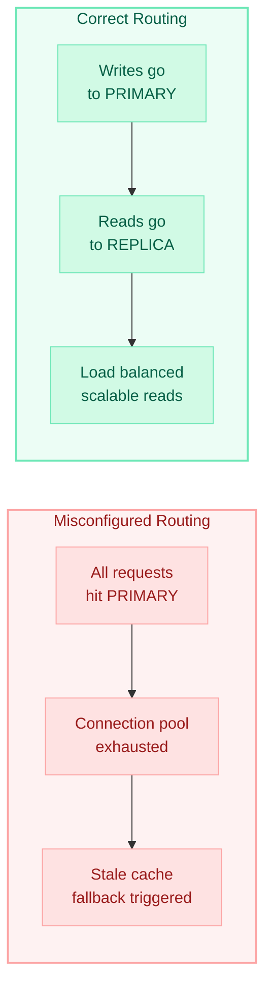
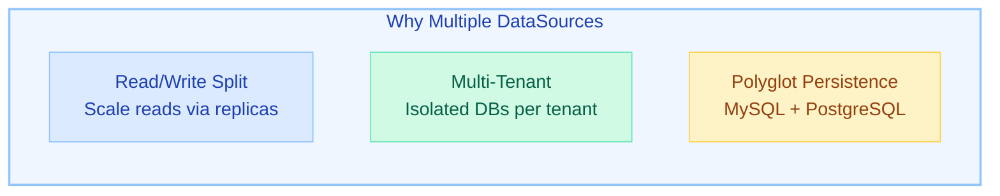
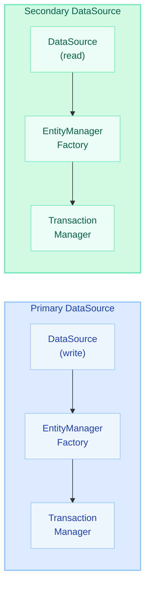
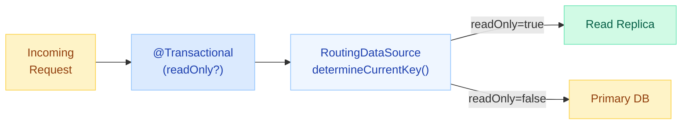
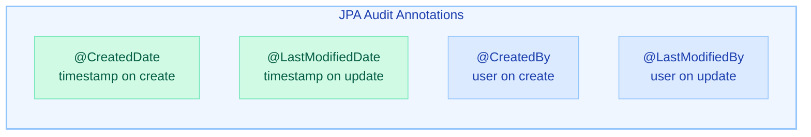
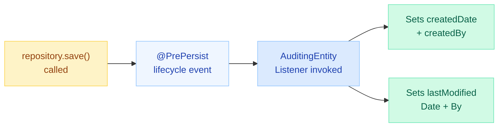
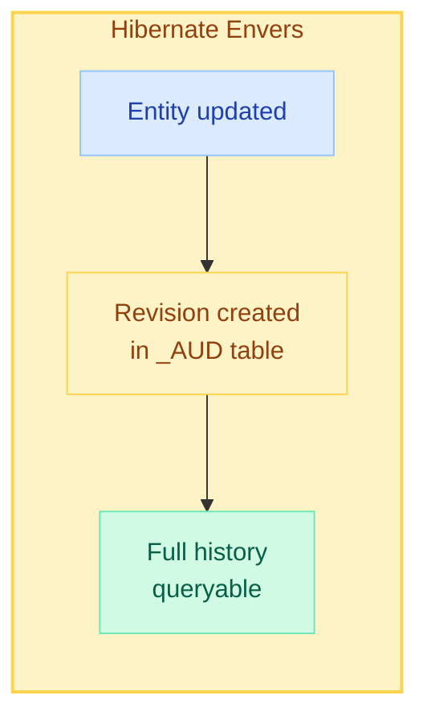

# Multiple DataSources & JPA Auditing

> **Configure multiple databases and automatically track who changed what, when — essential for enterprise applications with read-write split, multi-tenancy, or compliance requirements.**

---

!!! danger "Real-World Incident"
    A production e-commerce service returned **stale product prices** to customers during peak traffic. Root cause: read-replica routing wasn't configured properly — the `AbstractRoutingDataSource` was evaluating the routing key **after** the transaction had already bound a connection from the primary datasource. Writes went to primary, but reads also hit primary instead of replicas, causing connection pool exhaustion. Customers saw prices from a stale cache fallback. Fix: ensure routing key is resolved **before** `getConnection()` via `@Transactional(readOnly = true)`.



---

## Multiple DataSources

### Why Multiple DataSources?



| Use Case | Description | Example |
|---|---|---|
| **Read/Write Split** | Writes to primary, reads from replicas | High-traffic APIs with read-heavy workloads |
| **Multi-Tenant** | Separate database per tenant for isolation | SaaS platforms with strict data isolation |
| **Polyglot Persistence** | Different DB engines for different domains | Orders in PostgreSQL, Analytics in ClickHouse |

---

### Configuration: Primary + Secondary DataSource

```yaml
# application.yml
spring:
  datasource:
    primary:
      url: jdbc:postgresql://primary-host:5432/orders
      username: app_user
      password: ${PRIMARY_DB_PASSWORD}
      driver-class-name: org.postgresql.Driver
    secondary:
      url: jdbc:postgresql://replica-host:5432/orders
      username: readonly_user
      password: ${SECONDARY_DB_PASSWORD}
      driver-class-name: org.postgresql.Driver
```

```java
@Configuration
public class DataSourceConfig {

    @Primary
    @Bean(name = "primaryDataSource")
    @ConfigurationProperties(prefix = "spring.datasource.primary")
    public DataSource primaryDataSource() {
        return DataSourceBuilder.create().build();
    }

    @Bean(name = "secondaryDataSource")
    @ConfigurationProperties(prefix = "spring.datasource.secondary")
    public DataSource secondaryDataSource() {
        return DataSourceBuilder.create().build();
    }
}
```

!!! info "@Primary Annotation"
    The `@Primary` datasource is used by default whenever Spring needs to inject a `DataSource` without an explicit `@Qualifier`. Always mark your main read-write datasource as `@Primary`.

---

### Separate EntityManagerFactory & TransactionManager

Each datasource requires its own `EntityManagerFactory` and `TransactionManager`. This ensures JPA operations target the correct database.



```java
@Configuration
@EnableJpaRepositories(
    basePackages = "com.example.repository.primary",
    entityManagerFactoryRef = "primaryEntityManagerFactory",
    transactionManagerRef = "primaryTransactionManager"
)
public class PrimaryJpaConfig {

    @Primary
    @Bean(name = "primaryEntityManagerFactory")
    public LocalContainerEntityManagerFactoryBean primaryEntityManagerFactory(
            @Qualifier("primaryDataSource") DataSource dataSource,
            EntityManagerFactoryBuilder builder) {
        return builder
            .dataSource(dataSource)
            .packages("com.example.entity.primary")
            .persistenceUnit("primary")
            .build();
    }

    @Primary
    @Bean(name = "primaryTransactionManager")
    public PlatformTransactionManager primaryTransactionManager(
            @Qualifier("primaryEntityManagerFactory") EntityManagerFactory emf) {
        return new JpaTransactionManager(emf);
    }
}

@Configuration
@EnableJpaRepositories(
    basePackages = "com.example.repository.secondary",
    entityManagerFactoryRef = "secondaryEntityManagerFactory",
    transactionManagerRef = "secondaryTransactionManager"
)
public class SecondaryJpaConfig {

    @Bean(name = "secondaryEntityManagerFactory")
    public LocalContainerEntityManagerFactoryBean secondaryEntityManagerFactory(
            @Qualifier("secondaryDataSource") DataSource dataSource,
            EntityManagerFactoryBuilder builder) {
        return builder
            .dataSource(dataSource)
            .packages("com.example.entity.secondary")
            .persistenceUnit("secondary")
            .build();
    }

    @Bean(name = "secondaryTransactionManager")
    public PlatformTransactionManager secondaryTransactionManager(
            @Qualifier("secondaryEntityManagerFactory") EntityManagerFactory emf) {
        return new JpaTransactionManager(emf);
    }
}
```

---

### AbstractRoutingDataSource for Dynamic Routing

`AbstractRoutingDataSource` enables runtime datasource switching based on context (e.g., read-only vs read-write, or tenant ID).



```java
public class ReadWriteRoutingDataSource extends AbstractRoutingDataSource {

    @Override
    protected Object determineCurrentLookupKey() {
        return TransactionSynchronizationManager.isCurrentTransactionReadOnly()
            ? DataSourceType.REPLICA
            : DataSourceType.PRIMARY;
    }
}

public enum DataSourceType {
    PRIMARY, REPLICA
}
```

```java
@Configuration
public class RoutingDataSourceConfig {

    @Bean
    public DataSource routingDataSource(
            @Qualifier("primaryDataSource") DataSource primary,
            @Qualifier("secondaryDataSource") DataSource replica) {

        ReadWriteRoutingDataSource routing = new ReadWriteRoutingDataSource();

        Map<Object, Object> dataSources = Map.of(
            DataSourceType.PRIMARY, primary,
            DataSourceType.REPLICA, replica
        );

        routing.setTargetDataSources(dataSources);
        routing.setDefaultTargetDataSource(primary);
        return routing;
    }
}
```

!!! warning "LazyConnectionDataSourceProxy"
    The routing key is resolved at `getConnection()` time. If Spring grabs the connection **before** the `@Transactional` annotation sets the read-only flag, routing fails silently. Wrap your routing datasource in `LazyConnectionDataSourceProxy` to defer connection acquisition until the first SQL statement.

```java
@Bean
@Primary
public DataSource dataSource(DataSource routingDataSource) {
    return new LazyConnectionDataSourceProxy(routingDataSource);
}
```

---

### @Transactional with Specific Transaction Manager

When you have multiple transaction managers, specify which one to use explicitly.

```java
@Service
public class OrderService {

    // Uses primary transaction manager (default due to @Primary)
    @Transactional
    public Order createOrder(OrderRequest request) {
        return orderRepository.save(new Order(request));
    }

    // Explicitly uses secondary transaction manager
    @Transactional(transactionManager = "secondaryTransactionManager", readOnly = true)
    public List<OrderReport> getReports() {
        return reportRepository.findAll();
    }
}
```

!!! tip "Best Practice"
    For read-write split, prefer `AbstractRoutingDataSource` over manual transaction manager selection. Manual selection is better suited for truly separate databases (e.g., orders DB vs analytics DB).

---

## JPA Auditing

### Core Audit Annotations

JPA Auditing automatically populates timestamp and user fields on entity creation and modification.



```java
@Entity
@EntityListeners(AuditingEntityListener.class)
public class Order {

    @Id
    @GeneratedValue(strategy = GenerationType.IDENTITY)
    private Long id;

    private String product;
    private BigDecimal amount;

    @CreatedDate
    @Column(updatable = false)
    private Instant createdAt;

    @LastModifiedDate
    private Instant updatedAt;

    @CreatedBy
    @Column(updatable = false)
    private String createdBy;

    @LastModifiedBy
    private String updatedBy;
}
```

---

### Enabling JPA Auditing + AuditorAware

```java
@Configuration
@EnableJpaAuditing(auditorAwareRef = "auditorAware")
public class AuditConfig {

    @Bean
    public AuditorAware<String> auditorAware() {
        return new SecurityAuditorAware();
    }
}

public class SecurityAuditorAware implements AuditorAware<String> {

    @Override
    public Optional<String> getCurrentAuditor() {
        return Optional.ofNullable(SecurityContextHolder.getContext())
            .map(SecurityContext::getAuthentication)
            .filter(Authentication::isAuthenticated)
            .map(Authentication::getName);
    }
}
```

!!! info "How It Works"
    `@EnableJpaAuditing` registers a `AuditingEntityListener` that hooks into JPA lifecycle events (`@PrePersist`, `@PreUpdate`). Before each persist/update, it calls `AuditorAware.getCurrentAuditor()` and the date/time provider to populate the audit fields.

---

### @EntityListeners(AuditingEntityListener.class)

The `@EntityListeners` annotation registers JPA lifecycle callbacks on the entity. `AuditingEntityListener` is Spring's built-in listener that fills `@CreatedDate`, `@LastModifiedDate`, `@CreatedBy`, and `@LastModifiedBy`.



You can also apply `@EntityListeners` at the package level via `orm.xml` to avoid repeating it on every entity:

```xml
<!-- META-INF/orm.xml -->
<entity-mappings>
    <persistence-unit-metadata>
        <persistence-unit-defaults>
            <entity-listeners>
                <entity-listener
                    class="org.springframework.data.jpa.domain.support.AuditingEntityListener"/>
            </entity-listeners>
        </persistence-unit-defaults>
    </persistence-unit-metadata>
</entity-mappings>
```

---

### Base Audit Entity Pattern (AbstractAuditable)

Extract audit fields into a `@MappedSuperclass` to avoid duplication across entities.

```java
@MappedSuperclass
@EntityListeners(AuditingEntityListener.class)
public abstract class BaseAuditEntity {

    @CreatedDate
    @Column(updatable = false, nullable = false)
    private Instant createdAt;

    @LastModifiedDate
    @Column(nullable = false)
    private Instant updatedAt;

    @CreatedBy
    @Column(updatable = false)
    private String createdBy;

    @LastModifiedBy
    private String updatedBy;

    // Getters and setters
    public Instant getCreatedAt() { return createdAt; }
    public Instant getUpdatedAt() { return updatedAt; }
    public String getCreatedBy() { return createdBy; }
    public String getUpdatedBy() { return updatedBy; }
}
```

```java
@Entity
public class Order extends BaseAuditEntity {

    @Id
    @GeneratedValue(strategy = GenerationType.IDENTITY)
    private Long id;

    private String product;
    private BigDecimal amount;
    private OrderStatus status;

    // Business fields only — audit fields inherited
}

@Entity
public class Customer extends BaseAuditEntity {

    @Id
    @GeneratedValue(strategy = GenerationType.IDENTITY)
    private Long id;

    private String name;
    private String email;

    // Business fields only — audit fields inherited
}
```

!!! tip "Spring Data's AbstractAuditable"
    Spring Data provides `AbstractAuditable<U, PK>` out of the box. However, it uses `@ManyToOne` for the auditor (User entity), which adds JOINs. Most teams prefer a custom `@MappedSuperclass` with a simple `String` auditor field for performance.

---

### Hibernate Envers for Full Audit Trail

When you need a complete **history** of every change (not just the latest), use Hibernate Envers. It creates revision tables automatically.



**Add dependency:**

```xml
<dependency>
    <groupId>org.hibernate.orm</groupId>
    <artifactId>hibernate-envers</artifactId>
</dependency>
```

**Annotate entity:**

```java
@Entity
@Audited
public class Order extends BaseAuditEntity {

    @Id
    @GeneratedValue(strategy = GenerationType.IDENTITY)
    private Long id;

    private String product;
    private BigDecimal amount;

    @NotAudited  // Skip fields you don't need history for
    private String internalNotes;
}
```

**Envers creates these tables automatically:**

| Table | Purpose |
|---|---|
| `REVINFO` | Stores revision metadata (ID, timestamp) |
| `order_AUD` | Stores every historical version of Order |
| `REVTYPE` column | 0 = INSERT, 1 = UPDATE, 2 = DELETE |

**Query audit history:**

```java
@Service
public class OrderAuditService {

    @PersistenceContext
    private EntityManager entityManager;

    public List<Order> getOrderHistory(Long orderId) {
        AuditReader reader = AuditReaderFactory.get(entityManager);

        List<Number> revisions = reader.getRevisions(Order.class, orderId);

        return revisions.stream()
            .map(rev -> reader.find(Order.class, orderId, rev))
            .toList();
    }

    public Order getOrderAtRevision(Long orderId, int revision) {
        AuditReader reader = AuditReaderFactory.get(entityManager);
        return reader.find(Order.class, orderId, revision);
    }
}
```

!!! warning "Envers vs JPA Auditing"
    JPA Auditing (`@CreatedDate`, `@LastModifiedDate`) only tracks the **latest** state. Envers tracks **every** state change. Use JPA Auditing for "who changed this last?" and Envers for "show me every change ever made."

---

## Quick Recall

| Topic | Key Takeaway |
|---|---|
| `@Primary` DataSource | Default datasource when no `@Qualifier` specified |
| `@Qualifier` | Select a specific named datasource bean |
| Separate EMF/TM | Each datasource needs its own `EntityManagerFactory` + `TransactionManager` |
| `AbstractRoutingDataSource` | Dynamic runtime routing based on context (read-only flag, tenant, etc.) |
| `LazyConnectionDataSourceProxy` | Defers connection acquisition until first SQL — ensures routing key is resolved |
| `@Transactional(readOnly=true)` | Signals read intent; routing datasource uses this to pick replica |
| `@CreatedDate` / `@LastModifiedDate` | Auto-populated timestamps via `AuditingEntityListener` |
| `@CreatedBy` / `@LastModifiedBy` | Auto-populated from `AuditorAware` implementation |
| `@EnableJpaAuditing` | Activates the auditing infrastructure |
| `BaseAuditEntity` | `@MappedSuperclass` with audit fields — all entities extend it |
| `@EntityListeners` | Registers JPA lifecycle callbacks (can also be set globally in `orm.xml`) |
| Hibernate Envers `@Audited` | Full revision history in `_AUD` tables; queryable via `AuditReader` |

---

## Interview Questions

??? question "1. How do you configure multiple datasources in Spring Boot?"
    Define multiple `DataSource` beans with `@ConfigurationProperties` pointing to different prefixes. Mark the primary one with `@Primary`. Each datasource needs its own `LocalContainerEntityManagerFactoryBean` and `PlatformTransactionManager`. Use `@EnableJpaRepositories` with `basePackages`, `entityManagerFactoryRef`, and `transactionManagerRef` to wire repositories to the correct datasource.

??? question "2. What is AbstractRoutingDataSource and how does read-write split work?"
    `AbstractRoutingDataSource` is a Spring class that routes to different target datasources based on a lookup key determined at runtime. For read-write split, override `determineCurrentLookupKey()` to check `TransactionSynchronizationManager.isCurrentTransactionReadOnly()`. Methods annotated with `@Transactional(readOnly = true)` route to replicas; others route to primary. Wrap with `LazyConnectionDataSourceProxy` to ensure the routing key is evaluated after the transaction context is established.

??? question "3. Why do you need LazyConnectionDataSourceProxy with routing datasources?"
    Without it, the JDBC connection is fetched eagerly when the transaction begins — but the transaction's `readOnly` flag might not be set yet at that point. `LazyConnectionDataSourceProxy` defers the actual `getConnection()` call until the first SQL statement executes, by which time `@Transactional(readOnly = true)` has properly set the flag in `TransactionSynchronizationManager`.

??? question "4. How does @EnableJpaAuditing work internally?"
    It registers an `AuditingHandler` bean that listens for JPA lifecycle events via `AuditingEntityListener`. On `@PrePersist`, it populates `@CreatedDate`, `@CreatedBy`, `@LastModifiedDate`, and `@LastModifiedBy`. On `@PreUpdate`, it updates only `@LastModifiedDate` and `@LastModifiedBy`. The `AuditorAware` bean provides the current user, and `DateTimeProvider` (default: `CurrentDateTimeProvider`) provides the timestamp.

??? question "5. What is the difference between JPA Auditing and Hibernate Envers?"
    JPA Auditing stores only the **current** audit metadata (created/modified timestamps and users) on the entity itself. Envers creates shadow `_AUD` tables that store a complete historical record of every insert, update, and delete, with revision numbers and timestamps. Use JPA Auditing for simple "last modified" tracking; use Envers when you need a full compliance audit trail or the ability to query past states.

??? question "6. How would you implement multi-tenant datasource routing?"
    Extend `AbstractRoutingDataSource` and resolve the lookup key from a `ThreadLocal` or request header (e.g., `X-Tenant-ID`). Populate the tenant context via a servlet filter or `HandlerInterceptor`. Each tenant maps to a different datasource. For dynamic tenant onboarding, override `afterPropertiesSet()` to lazily create and cache datasources from a tenant registry.

??? question "7. What happens if you forget @EntityListeners on an audited entity?"
    The audit fields (`@CreatedDate`, `@LastModifiedDate`, etc.) will remain `null`. The `AuditingEntityListener` is never triggered because JPA has no registered listener for that entity's lifecycle events. Either add `@EntityListeners(AuditingEntityListener.class)` per entity, use a `@MappedSuperclass` that includes it, or register it globally in `META-INF/orm.xml`.

??? question "8. How do you handle transactions spanning multiple datasources?"
    Options: (1) **JTA/XA** — use `JtaTransactionManager` with Atomikos or Narayana for true distributed transactions (heavy, rarely used in microservices). (2) **ChainedTransactionManager** — best-effort, commits in order (not truly atomic). (3) **Saga pattern** — sequence of local transactions with compensating actions. For read-write split with the same logical database, `AbstractRoutingDataSource` avoids this problem entirely since it's one transaction manager over one logical datasource.
