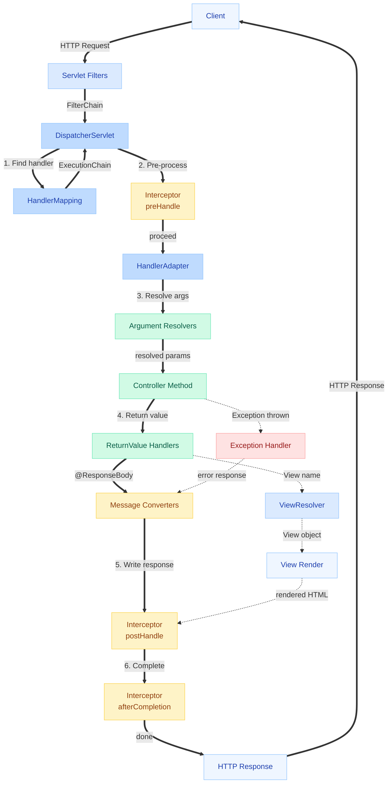
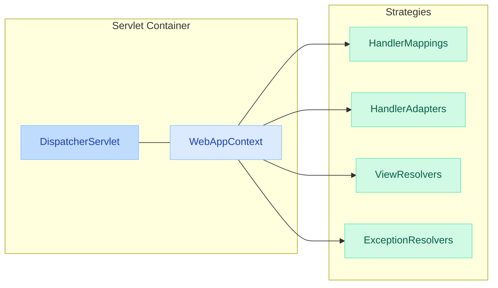
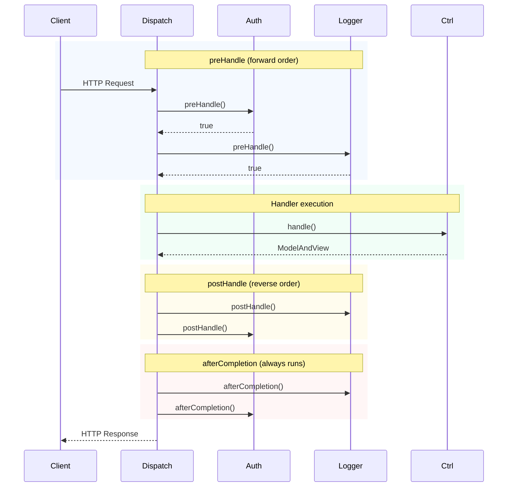
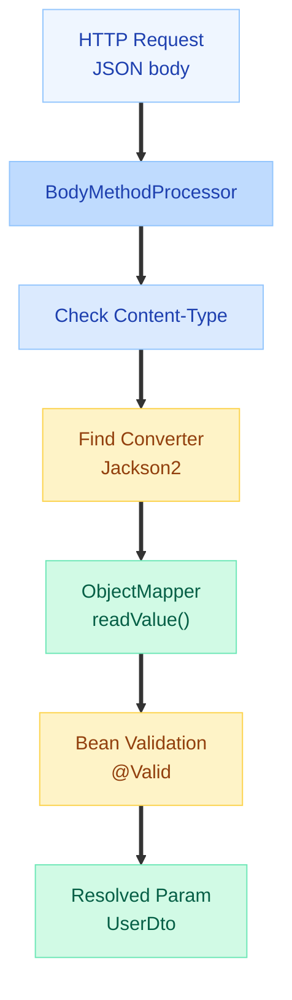
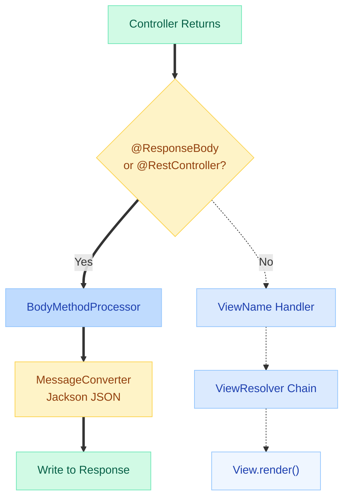
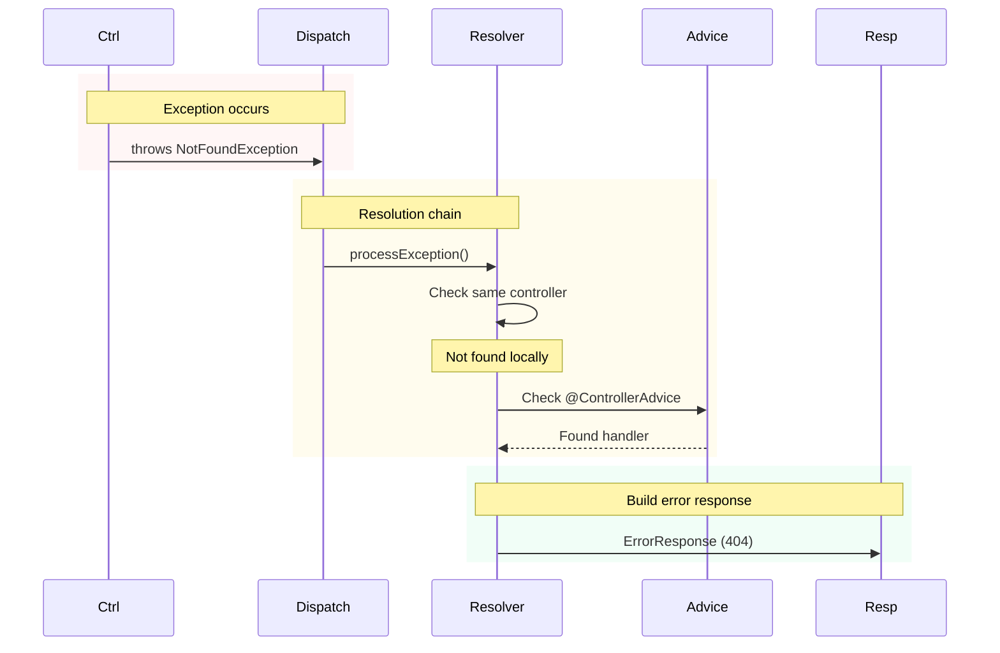
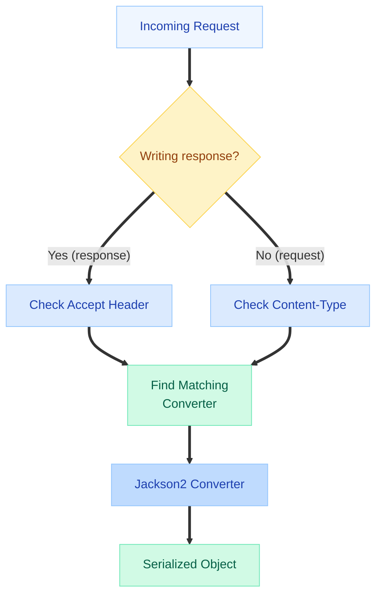
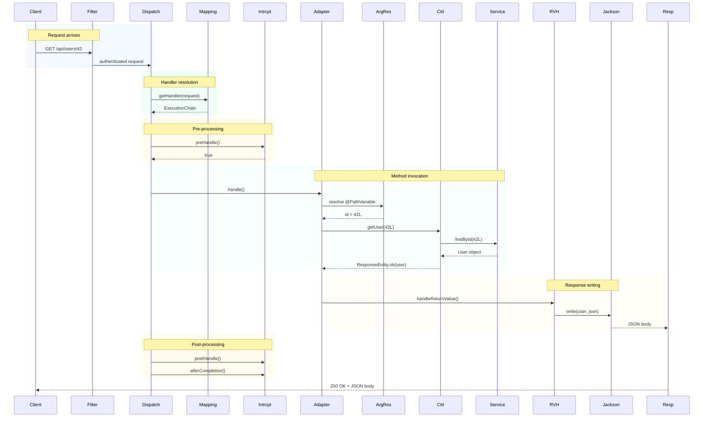
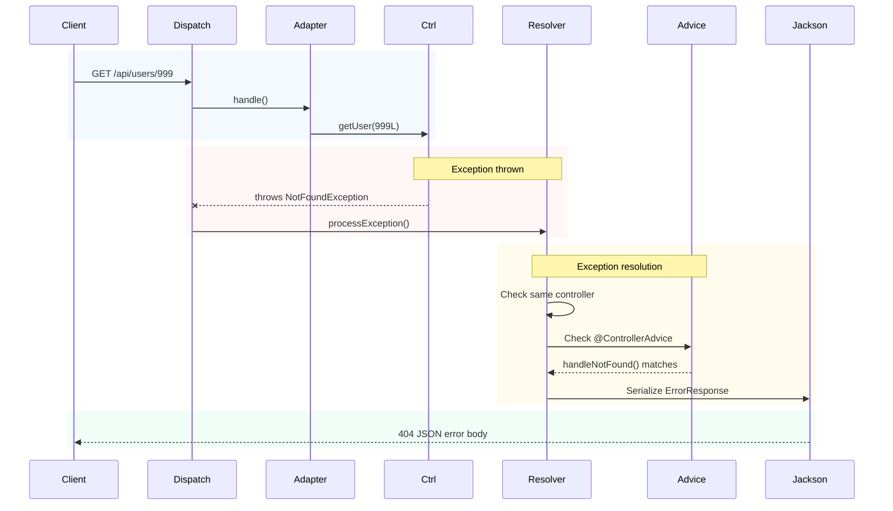

# Spring MVC Request Lifecycle

> **Every HTTP request walks the same red carpet through Spring MVC. Know the exact path, and you'll debug 10x faster than those who guess.**

---

!!! danger "Production Incident: The Invisible 404"
    A team deployed a new `@RestController` endpoint but kept getting 404 responses. No errors in logs, no exceptions — just a silent 404. Root cause: they had TWO `DispatcherServlet` instances registered (one from auto-config, one manually). The manual one mapped to `/` was intercepting requests but had no `HandlerMapping` configured for the new controller. Took 3 hours to diagnose because the team didn't understand the request lifecycle. Understanding which `HandlerMapping` picks up which controller — and in what ORDER — is non-negotiable for Spring developers.

---

## The Complete Request Lifecycle

This is the centerpiece. Every HTTP request through Spring MVC walks this exact path:



---

## 1. DispatcherServlet — The Front Controller

The `DispatcherServlet` is the single entry point for ALL requests. It delegates to specialized components rather than handling logic itself.



### How It Initializes

When `DispatcherServlet.init()` runs (on first request or at startup), it calls `initStrategies()`:

```java
protected void initStrategies(ApplicationContext context) {
    initMultipartResolver(context);
    initLocaleResolver(context);
    initThemeResolver(context);
    initHandlerMappings(context);      // Find all HandlerMapping beans
    initHandlerAdapters(context);      // Find all HandlerAdapter beans
    initHandlerExceptionResolvers(context);
    initRequestToViewNameTranslator(context);
    initViewResolvers(context);        // Find all ViewResolver beans
    initFlashMapManager(context);
}
```

### The Core doDispatch() Method

This is the heart of Spring MVC — simplified for clarity:

```java
protected void doDispatch(HttpServletRequest request, HttpServletResponse response) {
    HandlerExecutionChain mappedHandler = null;
    ModelAndView mv = null;

    try {
        // 1. Find the handler (controller method)
        mappedHandler = getHandler(request);
        if (mappedHandler == null) {
            noHandlerFound(request, response);  // → 404
            return;
        }

        // 2. Find the adapter that can invoke this handler
        HandlerAdapter ha = getHandlerAdapter(mappedHandler.getHandler());

        // 3. Execute pre-interceptors
        if (!mappedHandler.applyPreHandle(request, response)) {
            return;  // Interceptor vetoed the request
        }

        // 4. Actually invoke the handler (controller method)
        mv = ha.handle(request, response, mappedHandler.getHandler());

        // 5. Execute post-interceptors
        mappedHandler.applyPostHandle(request, response, mv);

    } catch (Exception ex) {
        // 6. Exception handling
        mv = processHandlerException(request, response, mappedHandler, ex);
    }

    // 7. Render the view (if ModelAndView returned)
    if (mv != null) {
        render(mv, request, response);
    }

    // 8. afterCompletion always runs (like finally block)
    mappedHandler.triggerAfterCompletion(request, response, null);
}
```

!!! tip "Interview Insight"
    The `DispatcherServlet` implements the **Front Controller** design pattern. This is a frequently asked question. The key insight: it centralizes cross-cutting concerns (security, logging, exception handling) while delegating actual work to specialized components. Without it, every servlet would need to implement its own routing, error handling, and view resolution.

---

## 2. HandlerMapping — URL to Controller Resolution

`HandlerMapping` answers: "Which controller method handles this request?"

### Resolution Order

Spring Boot auto-configures multiple `HandlerMapping` beans, evaluated in order:

| Order | HandlerMapping | Handles |
|-------|---------------|---------|
| 0 | `RequestMappingHandlerMapping` | `@RequestMapping`, `@GetMapping`, etc. |
| 1 | `BeanNameUrlHandlerMapping` | Beans with names starting with `/` |
| 2 | `RouterFunctionMapping` | Functional endpoints (`RouterFunction`) |
| 3 | `SimpleUrlHandlerMapping` | Static resources, default servlet |
| 4 | `WelcomePageHandlerMapping` | Index page (`/`) |

The FIRST mapping that returns a non-null handler wins. No further mappings are checked.

### How RequestMappingHandlerMapping Works

At startup, it scans all `@Controller` and `@RestController` beans:

```java
// Internally, it builds a registry of RequestMappingInfo → HandlerMethod
// Each @RequestMapping annotation produces a RequestMappingInfo with:
//   - patterns: URL patterns (/api/users/{id})
//   - methods: HTTP methods (GET, POST)
//   - params: required params (?type=admin)
//   - headers: required headers (Accept: application/json)
//   - consumes: content types (application/json)
//   - produces: response types (application/json)
```

At request time, it matches based on:

1. **URL pattern** — `/api/users/42` matches `/api/users/{id}`
2. **HTTP method** — GET, POST, PUT, DELETE
3. **Content-Type** — `consumes` attribute
4. **Accept header** — `produces` attribute
5. **Parameters** — `params` attribute
6. **Headers** — `headers` attribute

```java
@RestController
@RequestMapping("/api/orders")
public class OrderController {

    // Matched by: GET /api/orders/123
    @GetMapping("/{id}")
    public Order getOrder(@PathVariable Long id) { ... }

    // Matched by: GET /api/orders?status=PENDING
    @GetMapping(params = "status")
    public List<Order> getByStatus(@RequestParam String status) { ... }

    // Matched by: POST /api/orders with Content-Type: application/json
    @PostMapping(consumes = MediaType.APPLICATION_JSON_VALUE)
    public Order createOrder(@RequestBody OrderRequest req) { ... }
}
```

!!! warning "Ambiguous Mapping"
    If two handler methods match the same request equally well, Spring throws `IllegalStateException` at startup: "Ambiguous handler methods mapped for..." — this crashes your application during initialization, not at request time.

---

## 3. HandlerInterceptor — Pre/Post Processing

Interceptors run BEFORE and AFTER the controller method. Think of them as AOP for HTTP requests.



### The Three Methods

```java
public interface HandlerInterceptor {

    // Runs BEFORE controller. Return false = request stops here.
    default boolean preHandle(HttpServletRequest request,
                              HttpServletResponse response,
                              Object handler) throws Exception {
        return true;
    }

    // Runs AFTER controller but BEFORE view rendering.
    // NOT called if controller threw an exception.
    default void postHandle(HttpServletRequest request,
                            HttpServletResponse response,
                            Object handler,
                            @Nullable ModelAndView modelAndView) throws Exception {
    }

    // ALWAYS runs (like finally). Even if exception occurred.
    // Use for cleanup: close resources, clear ThreadLocal, etc.
    default void afterCompletion(HttpServletRequest request,
                                 HttpServletResponse response,
                                 Object handler,
                                 @Nullable Exception ex) throws Exception {
    }
}
```

### Practical Example: Request Timing

```java
@Component
public class RequestTimingInterceptor implements HandlerInterceptor {

    @Override
    public boolean preHandle(HttpServletRequest request,
                             HttpServletResponse response,
                             Object handler) {
        request.setAttribute("startTime", System.nanoTime());
        return true;
    }

    @Override
    public void afterCompletion(HttpServletRequest request,
                                HttpServletResponse response,
                                Object handler, Exception ex) {
        long start = (Long) request.getAttribute("startTime");
        long duration = TimeUnit.NANOSECONDS.toMillis(System.nanoTime() - start);
        log.info("{} {} completed in {}ms (status={})",
            request.getMethod(), request.getRequestURI(), duration, response.getStatus());
    }
}
```

!!! tip "Filter vs Interceptor"
    **Servlet Filter**: operates at the servlet container level. Sees raw request/response. Cannot access Spring beans easily. Use for: CORS, compression, security (Spring Security uses filters).
    **HandlerInterceptor**: operates inside DispatcherServlet. Has access to the handler (controller method). Can inspect `@RequestMapping` metadata. Use for: logging, auth checks, request timing, tenant resolution.

---

## 4. HandlerAdapter — Invoking the Controller

The `HandlerAdapter` knows HOW to invoke a particular handler type. The primary one is `RequestMappingHandlerAdapter`.

### What It Does

1. **Resolves method arguments** — calls `ArgumentResolver` for each parameter
2. **Invokes the method** — via reflection
3. **Processes return value** — calls `ReturnValueHandler` for the result


---

## 5. Argument Resolvers — How Parameters Get Populated

Every parameter in your controller method is resolved by a specific `HandlerMethodArgumentResolver`.

| Annotation | Resolver | Source | Example |
|-----------|----------|--------|---------|
| `@RequestBody` | `RequestResponseBodyMethodProcessor` | HTTP body (JSON/XML) | `@RequestBody UserDto user` |
| `@PathVariable` | `PathVariableMethodArgumentResolver` | URL path segment | `@PathVariable Long id` |
| `@RequestParam` | `RequestParamMethodArgumentResolver` | Query string / form data | `@RequestParam String name` |
| `@RequestHeader` | `RequestHeaderMethodArgumentResolver` | HTTP header | `@RequestHeader("X-Token") String token` |
| `@ModelAttribute` | `ModelAttributeMethodProcessor` | Form data bound to object | `@ModelAttribute UserForm form` |
| `@CookieValue` | `ServletCookieValueMethodArgumentResolver` | Cookie | `@CookieValue("session") String s` |
| `@RequestPart` | `RequestPartMethodArgumentResolver` | Multipart file | `@RequestPart MultipartFile file` |
| (none) | `ServletRequestMethodArgumentResolver` | Raw servlet objects | `HttpServletRequest request` |

### How @RequestBody Resolution Works Internally



### Custom Argument Resolver

```java
// Resolve the current tenant from a header
public class TenantArgumentResolver implements HandlerMethodArgumentResolver {

    @Override
    public boolean supportsParameter(MethodParameter parameter) {
        return parameter.hasParameterAnnotation(CurrentTenant.class);
    }

    @Override
    public Object resolveArgument(MethodParameter parameter,
                                  ModelAndViewContainer mavContainer,
                                  NativeWebRequest webRequest,
                                  WebDataBinderFactory binderFactory) {
        String tenantId = webRequest.getHeader("X-Tenant-ID");
        if (tenantId == null) throw new MissingTenantException();
        return new Tenant(tenantId);
    }
}

// Usage in controller:
@GetMapping("/data")
public ResponseEntity<Data> getData(@CurrentTenant Tenant tenant) { ... }
```

---

## 6. Return Value Handlers — Processing Controller Output

After your controller method returns, a `HandlerMethodReturnValueHandler` converts it to an HTTP response.

| Return Type | Handler | Behavior |
|------------|---------|----------|
| `ResponseEntity<T>` | `HttpEntityMethodProcessor` | Full control: status + headers + body |
| `@ResponseBody` + Object | `RequestResponseBodyMethodProcessor` | Object → JSON via MessageConverter |
| `String` (no @ResponseBody) | `ViewNameMethodReturnValueHandler` | Treated as view name → ViewResolver |
| `ModelAndView` | `ModelAndViewMethodReturnValueHandler` | Model data + view name |
| `void` | `VoidMethodReturnValueHandler` | Response already written (or 204) |
| `DeferredResult<T>` | `DeferredResultMethodReturnValueHandler` | Async processing |
| `CompletableFuture<T>` | `CallableMethodReturnValueHandler` | Async on separate thread |

### The @ResponseBody Path vs View Path



---

## 7. ViewResolver Chain

When a controller returns a view name (not `@ResponseBody`), the ViewResolver chain resolves it to a `View` object.

| ViewResolver | Purpose | Example |
|-------------|---------|---------|
| `ContentNegotiatingViewResolver` | Delegates based on Accept header / extension | `.json` → Jackson, `.html` → Thymeleaf |
| `ThymeleafViewResolver` | Thymeleaf templates | `"users/list"` → `templates/users/list.html` |
| `InternalResourceViewResolver` | JSP pages | `"users/list"` → `/WEB-INF/views/users/list.jsp` |
| `BeanNameViewResolver` | View beans by name | Custom PDF/Excel views |

```java
// Controller returning a view name
@Controller
public class PageController {

    @GetMapping("/users")
    public String listUsers(Model model) {
        model.addAttribute("users", userService.findAll());
        return "users/list";  // → ViewResolver finds the template
    }
}
```

!!! info "REST APIs Skip ViewResolver"
    With `@RestController` (or `@ResponseBody`), the ViewResolver is NEVER invoked. The response body is written directly by `HttpMessageConverter`. This is why modern REST APIs don't need ViewResolver configuration at all.

---

## 8. Exception Handling Flow

When a controller throws an exception, Spring MVC has a structured resolution chain:



### HandlerExceptionResolver Chain

| Order | Resolver | Handles |
|-------|----------|---------|
| 1 | `ExceptionHandlerExceptionResolver` | `@ExceptionHandler` methods |
| 2 | `ResponseStatusExceptionResolver` | `@ResponseStatus` on exceptions |
| 3 | `DefaultHandlerExceptionResolver` | Standard Spring exceptions (MethodNotAllowed, etc.) |

### Complete @ControllerAdvice Example

```java
@RestControllerAdvice
public class GlobalExceptionHandler {

    @ExceptionHandler(ResourceNotFoundException.class)
    @ResponseStatus(HttpStatus.NOT_FOUND)
    public ErrorResponse handleNotFound(ResourceNotFoundException ex,
                                        HttpServletRequest request) {
        return new ErrorResponse(
            HttpStatus.NOT_FOUND.value(),
            ex.getMessage(),
            request.getRequestURI(),
            Instant.now()
        );
    }

    @ExceptionHandler(MethodArgumentNotValidException.class)
    @ResponseStatus(HttpStatus.BAD_REQUEST)
    public ErrorResponse handleValidation(MethodArgumentNotValidException ex) {
        List<String> errors = ex.getBindingResult().getFieldErrors().stream()
            .map(e -> e.getField() + ": " + e.getDefaultMessage())
            .toList();
        return new ErrorResponse(400, "Validation failed", errors, Instant.now());
    }

    @ExceptionHandler(Exception.class)
    @ResponseStatus(HttpStatus.INTERNAL_SERVER_ERROR)
    public ErrorResponse handleAll(Exception ex) {
        log.error("Unhandled exception", ex);
        return new ErrorResponse(500, "Internal server error", null, Instant.now());
    }
}
```

!!! tip "Interview Insight"
    The resolution order matters: `@ExceptionHandler` in the SAME controller class takes priority over `@ControllerAdvice`. This lets you have general error handling globally while overriding it per controller. Also, `@ControllerAdvice` classes can be ordered with `@Order` annotation.

---

## 9. Message Converters — Object to Wire Format

`HttpMessageConverter` handles the serialization (write) and deserialization (read) of HTTP message bodies.

### Built-in Converters (in order)

| Converter | Media Type | Reads | Writes |
|-----------|-----------|-------|--------|
| `ByteArrayHttpMessageConverter` | `*/*` | byte[] | byte[] |
| `StringHttpMessageConverter` | `text/plain` | String | String |
| `FormHttpMessageConverter` | `application/x-www-form-urlencoded` | MultiValueMap | MultiValueMap |
| `MappingJackson2HttpMessageConverter` | `application/json` | Java objects | Java objects |
| `MappingJackson2XmlHttpMessageConverter` | `application/xml` | Java objects (if jackson-xml on classpath) | Java objects |

### Content Negotiation: How Spring Picks the Converter



### Customizing Jackson ObjectMapper

```java
@Configuration
public class JacksonConfig {

    @Bean
    public ObjectMapper objectMapper() {
        return JsonMapper.builder()
            .addModule(new JavaTimeModule())
            .disable(SerializationFeature.WRITE_DATES_AS_TIMESTAMPS)
            .disable(DeserializationFeature.FAIL_ON_UNKNOWN_PROPERTIES)
            .serializationInclusion(JsonInclude.Include.NON_NULL)
            .build();
    }
}
```

---

## 10. Complete Happy-Path Sequence

End-to-end request flow for `GET /api/users/42`:



---

## 11. Exception Flow Sequence

What happens when `GET /api/users/999` throws `UserNotFoundException`:



---

## 12. @Controller vs @RestController — Lifecycle Differences

| Aspect | @Controller | @RestController |
|--------|-------------|-----------------|
| **Meta-annotations** | `@Component` | `@Controller` + `@ResponseBody` |
| **Default return handling** | View name → ViewResolver | Object → MessageConverter → JSON |
| **ViewResolver involved?** | Yes | No |
| **MessageConverter used for response?** | Only if `@ResponseBody` on method | Always |
| **Typical use case** | Server-rendered HTML (Thymeleaf, JSP) | REST APIs returning JSON/XML |
| **Content negotiation** | Via ViewResolver chain | Via Accept header + MessageConverter |
| **Model attribute** | Added to view model | Ignored (no view) |
| **Redirect** | `return "redirect:/path"` | Must use `ResponseEntity` with 302 |

```java
// @Controller — returns view name, ViewResolver kicks in
@Controller
public class WebPageController {
    @GetMapping("/dashboard")
    public String dashboard(Model model) {
        model.addAttribute("stats", statsService.get());
        return "dashboard";  // → Thymeleaf renders dashboard.html
    }
}

// @RestController — @ResponseBody implied on every method
@RestController
@RequestMapping("/api")
public class ApiController {
    @GetMapping("/stats")
    public Stats getStats() {
        return statsService.get();  // → Jackson converts to JSON
    }
}
```

!!! warning "Common Mistake"
    Using `@Controller` (without `@ResponseBody`) for a REST endpoint returns the string as a VIEW NAME, not as a response body. Spring looks for a template file matching that string. If not found: `404` or `TemplateNotFoundException`. This is the #1 beginner mistake.

---

## Common Pitfalls

### 1. Returning String from @Controller Without @ResponseBody

```java
// WRONG — Spring treats "hello" as a VIEW NAME, not response body
@Controller
public class MyController {
    @GetMapping("/greet")
    public String greet() {
        return "hello";  // Looks for hello.html template → 404 if not found
    }
}

// FIX — either add @ResponseBody or use @RestController
@Controller
public class MyController {
    @GetMapping("/greet")
    @ResponseBody
    public String greet() {
        return "hello";  // Written directly to response body
    }
}
```

### 2. Wrong Content-Type = 415 Unsupported Media Type

```java
// Endpoint expects JSON
@PostMapping(value = "/users", consumes = "application/json")
public User create(@RequestBody UserDto dto) { ... }

// Client sends form data → 415 error
// curl -X POST /users -d "name=Alice"  ← WRONG
// curl -X POST /users -H "Content-Type: application/json" -d '{"name":"Alice"}'  ← CORRECT
```

### 3. Missing @RequestBody = Null Object

```java
// WRONG — without @RequestBody, Spring tries to bind from query params
@PostMapping("/users")
public User create(UserDto dto) {  // dto fields will be null!
    return userService.save(dto);
}

// FIX
@PostMapping("/users")
public User create(@RequestBody UserDto dto) {
    return userService.save(dto);
}
```

### 4. ViewResolver Not Found

```java
// If no ViewResolver is configured and you return a view name:
@Controller
public class PageController {
    @GetMapping("/home")
    public String home() {
        return "home";  // javax.servlet.ServletException: Could not resolve view
    }
}
// FIX: add Thymeleaf/FreeMarker dependency, or use @ResponseBody
```

### 5. Interceptor Order Matters

```java
@Configuration
public class WebConfig implements WebMvcConfigurer {
    @Override
    public void addInterceptors(InterceptorRegistry registry) {
        // Order matters! Auth should run before rate limiting
        registry.addInterceptor(authInterceptor).order(1);
        registry.addInterceptor(rateLimitInterceptor).order(2);
        registry.addInterceptor(loggingInterceptor).order(3);
    }
}
```

---

## Quick Recall Table

| Component | Question It Answers | Key Class |
|-----------|-------------------|-----------|
| DispatcherServlet | "Who coordinates everything?" | `DispatcherServlet.doDispatch()` |
| HandlerMapping | "Which controller handles this URL?" | `RequestMappingHandlerMapping` |
| HandlerInterceptor | "What runs before/after the controller?" | `HandlerInterceptor` interface |
| HandlerAdapter | "How do I invoke this handler?" | `RequestMappingHandlerAdapter` |
| ArgumentResolver | "How does @PathVariable get populated?" | `HandlerMethodArgumentResolver` |
| ReturnValueHandler | "How does the return value become a response?" | `HandlerMethodReturnValueHandler` |
| MessageConverter | "How does an Object become JSON?" | `MappingJackson2HttpMessageConverter` |
| ViewResolver | "How does a view name become HTML?" | `ThymeleafViewResolver` |
| ExceptionResolver | "What happens when the controller throws?" | `ExceptionHandlerExceptionResolver` |

---

## Interview Answer Template

!!! tip "When Asked: 'Explain the Spring MVC request lifecycle'"

    **Structure your answer in 7 steps:**

    1. **Client sends request** → hits Servlet Filters (Security, CORS) → reaches `DispatcherServlet`
    2. **DispatcherServlet asks HandlerMapping**: "Who handles `GET /api/users/42`?" → returns `HandlerExecutionChain` (controller method + interceptors)
    3. **Interceptors run preHandle()** — if any return false, request stops
    4. **HandlerAdapter invokes controller method** — ArgumentResolvers populate each parameter (@PathVariable, @RequestBody, etc.)
    5. **Return value is processed** — for `@ResponseBody`, MessageConverter serializes to JSON. For view names, ViewResolver finds the template
    6. **Interceptors run postHandle()** then **afterCompletion()**
    7. **If exception occurs** — ExceptionHandlerResolver finds matching `@ExceptionHandler` (first in same controller, then in `@ControllerAdvice`)

    **Key design patterns**: Front Controller (DispatcherServlet), Strategy (HandlerMapping, ViewResolver), Chain of Responsibility (Filters, Interceptors), Adapter (HandlerAdapter).

    **Follow-up differentiator**: mention that `@RestController` skips ViewResolver entirely, that interceptor afterCompletion() ALWAYS runs (like a finally block), and that multiple HandlerMappings are tried in order until one matches.

---

## Further Reading

- [Spring MVC Documentation](https://docs.spring.io/spring-framework/reference/web/webmvc.html)
- [DispatcherServlet Source Code](https://github.com/spring-projects/spring-framework/blob/main/spring-webmvc/src/main/java/org/springframework/web/servlet/DispatcherServlet.java)
- [HandlerMethodArgumentResolver Javadoc](https://docs.spring.io/spring-framework/docs/current/javadoc-api/org/springframework/web/method/support/HandlerMethodArgumentResolver.html)
