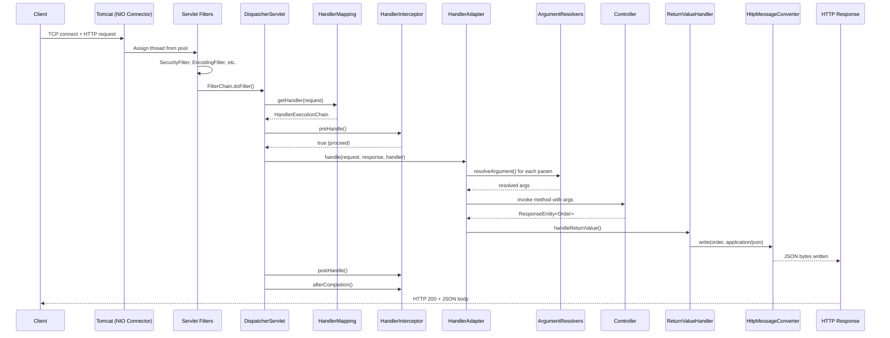
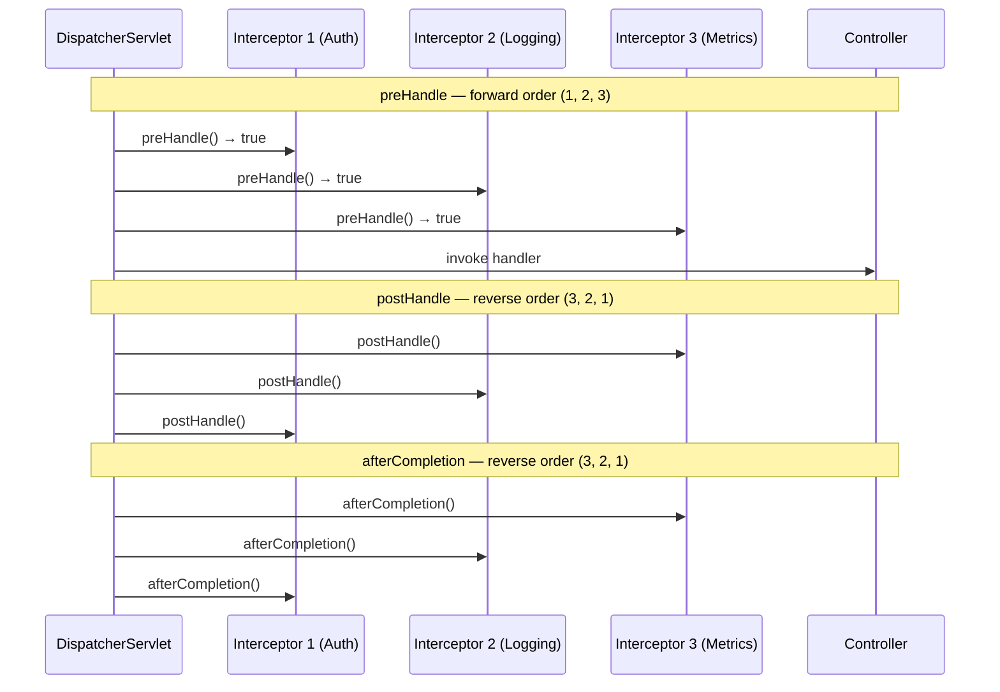
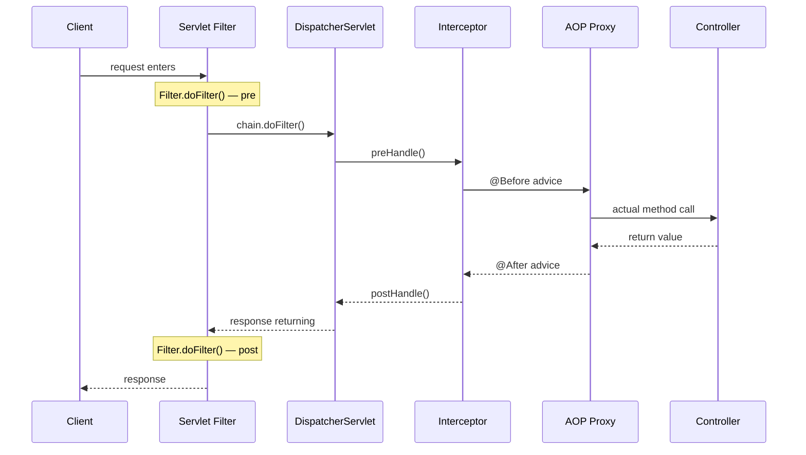
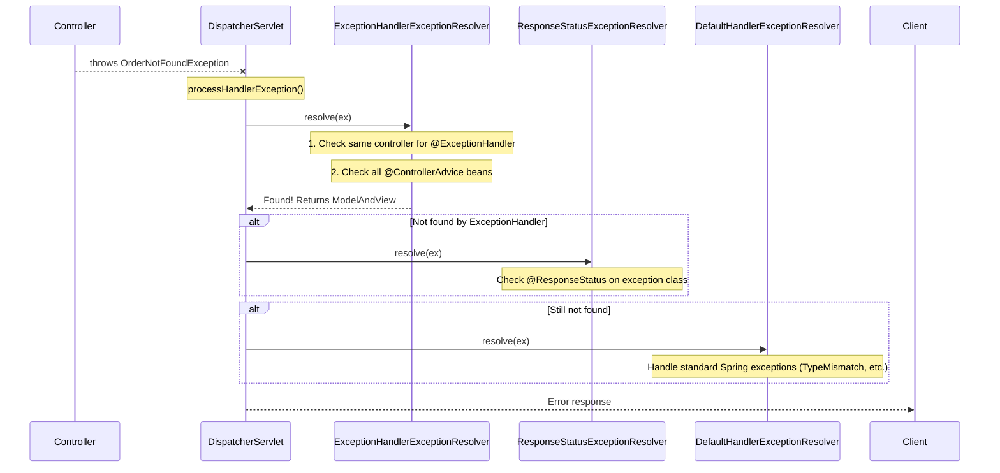
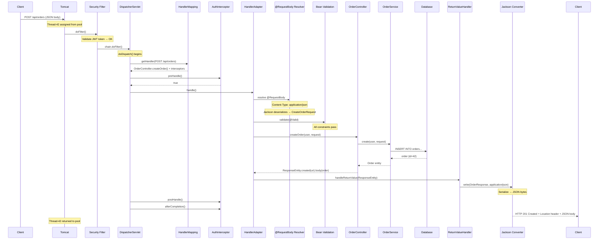
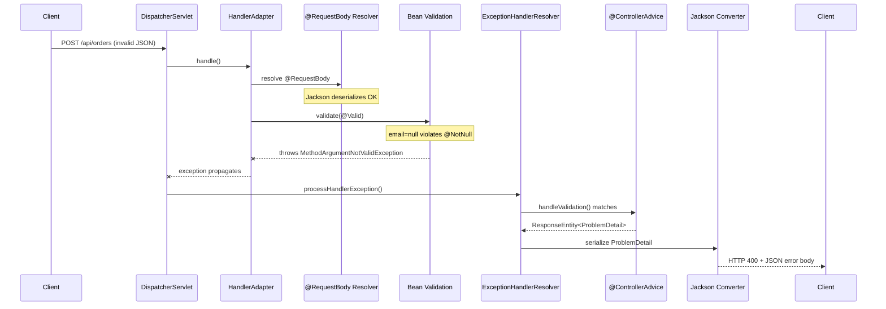

# Spring MVC Request Lifecycle

Every single HTTP request that hits your Spring Boot application goes through the same pipeline. In interviews, when they ask "what happens when a request hits `/api/orders`?" — they want you to trace it from the TCP socket to the JSON response. Most candidates say "DispatcherServlet routes it to the controller." That's like saying "the car drives to the destination" — technically true, but tells me you've never looked under the hood.

This page takes you through every single component, in order, with the actual source code that executes at each step. After reading this, you'll be able to trace any HTTP request through the entire Spring MVC pipeline — and explain it in an interview with the confidence of someone who's debugged it at 2 AM in production.

---

## The Complete Request Journey

Here's the full pipeline — every request walks this exact path:



---

## 1. Tomcat / Embedded Server — The Socket Layer

**What it does:** Accepts TCP connections, parses raw HTTP bytes into `HttpServletRequest`/`HttpServletResponse` objects, and assigns a worker thread.

**Why it exists:** Someone has to listen on port 8080, manage the TCP handshake, and turn raw bytes into something Java can work with. That's Tomcat's job.

**When you'd customize it:**

- Thread pool exhaustion under load (increase `server.tomcat.threads.max`)
- Slow clients holding threads (configure `server.tomcat.connection-timeout`)
- Large file uploads (adjust `server.tomcat.max-http-form-post-size`)

**How it works internally:**

```
Client → TCP Socket (port 8080)
       → NIO Connector (non-blocking I/O for connection accept)
       → Worker Thread from pool (default: 200 threads)
       → Http11Processor parses HTTP/1.1
       → Creates Request/Response objects
       → Passes to Engine → Host → Context → Servlet
```

**Key configuration:**

```yaml
server:
  tomcat:
    threads:
      max: 200          # Max worker threads
      min-spare: 10     # Min idle threads kept alive
    max-connections: 8192  # Max simultaneous connections
    accept-count: 100     # Queue when all threads busy
    connection-timeout: 20000  # 20s timeout
```

!!! tip "One-liner for interviews"
    "Tomcat's NIO connector accepts connections without blocking, then hands off to a worker thread pool (default 200 threads) where each thread handles one request synchronously through the full servlet pipeline."

!!! danger "What breaks"
    **Thread pool exhaustion:** If your controller calls a slow external service (3s response time), 200 threads serve only ~66 requests/second. Once the pool is empty, new requests queue up (up to `accept-count`), then get rejected with connection refused. This is why you see "all threads busy" in production under moderate load.

---

## 2. Servlet Filters — The Security Checkpoint

**What it does:** Filters are a chain of components that can inspect, modify, or reject the request/response BEFORE it reaches DispatcherServlet.

**Why it exists:** Cross-cutting concerns that apply to ALL requests (including static resources, error pages, non-Spring endpoints) need to live outside Spring MVC. Filters operate at the servlet container level — they don't know about controllers or Spring beans.

**When you'd customize it:** Custom authentication, request logging, rate limiting, CORS headers, request wrapping.

**Order in the chain:** Filters execute in registration order:

| Order | Filter | Purpose |
|-------|--------|---------|
| -105 | `CharacterEncodingFilter` | Sets UTF-8 encoding on request/response |
| -100 | `FormContentFilter` | Parses PUT/PATCH form data (normally only POST is parsed) |
| -100 | `HiddenHttpMethodFilter` | Converts `_method=DELETE` form field to actual DELETE request |
| 0 | Spring Security `FilterChainProxy` | Authentication + authorization (15+ internal filters) |
| 0 | `RequestContextFilter` | Binds request to ThreadLocal for `RequestContextHolder` |
| custom | Your custom filters | Whatever you register |

### How FilterChain Works

```java
// Simplified — this is what happens inside the container
public void doFilter(ServletRequest request, ServletResponse response,
                     FilterChain chain) throws IOException, ServletException {

    // --- Your pre-processing ---
    long startTime = System.nanoTime();

    // Pass to next filter (or DispatcherServlet if last in chain)
    chain.doFilter(request, response);

    // --- Your post-processing (response is now committed) ---
    long duration = TimeUnit.NANOSECONDS.toMillis(System.nanoTime() - startTime);
    log.info("Request took {}ms", duration);
}
```

### Production Example: Request Correlation ID Filter

```java
@Component
@Order(Ordered.HIGHEST_PRECEDENCE)
public class CorrelationIdFilter extends OncePerRequestFilter {

    private static final String CORRELATION_HEADER = "X-Correlation-ID";

    @Override
    protected void doFilterInternal(HttpServletRequest request,
                                    HttpServletResponse response,
                                    FilterChain filterChain)
            throws ServletException, IOException {

        String correlationId = request.getHeader(CORRELATION_HEADER);
        if (correlationId == null) {
            correlationId = UUID.randomUUID().toString();
        }

        // Add to MDC for logging
        MDC.put("correlationId", correlationId);
        // Add to response so client can reference it
        response.setHeader(CORRELATION_HEADER, correlationId);

        try {
            filterChain.doFilter(request, response);
        } finally {
            MDC.remove("correlationId");  // CRITICAL: clean up ThreadLocal
        }
    }
}
```

!!! warning "Production War Story"
    A team forgot the `MDC.remove()` in a finally block. Under Tomcat's thread pool reuse, correlation IDs leaked between requests. When debugging a production issue, log traces showed request A's correlation ID on request B's logs. It took two days to find because the bug was intermittent — it only manifested when the same thread was reused. Always clean up ThreadLocal state in `finally`.

---

## 3. DispatcherServlet — The Front Controller

**What it does:** The single entry point for ALL Spring MVC requests. It orchestrates the entire lifecycle by delegating to specialized components.

**Why it exists:** Without a front controller, every endpoint would need its own routing, error handling, content negotiation, and interceptor logic. DispatcherServlet centralizes this orchestration — your controllers stay clean and focused on business logic.

**When you'd customize it:** Almost never. But you might register a second one for legacy servlet integration, or override `noHandlerFound()` for custom 404 behavior.

**How it works internally — the `doDispatch()` method:**

This is the single most important method in Spring MVC. Every request passes through it:

```java
protected void doDispatch(HttpServletRequest request,
                          HttpServletResponse response) throws Exception {
    HandlerExecutionChain mappedHandler = null;
    ModelAndView mv = null;
    Exception dispatchException = null;

    try {
        // STEP 1: Check if multipart (file upload)
        request = checkMultipart(request);

        // STEP 2: Find the handler (controller method) for this request
        mappedHandler = getHandler(request);
        if (mappedHandler == null) {
            noHandlerFound(request, response);  // → 404
            return;
        }

        // STEP 3: Find the adapter that knows how to invoke this handler type
        HandlerAdapter ha = getHandlerAdapter(mappedHandler.getHandler());

        // STEP 4: Run interceptor preHandle() methods
        if (!mappedHandler.applyPreHandle(request, response)) {
            return;  // An interceptor said "stop" — request ends here
        }

        // STEP 5: Actually invoke the controller method
        mv = ha.handle(request, response, mappedHandler.getHandler());

        // STEP 6: Run interceptor postHandle() methods
        mappedHandler.applyPostHandle(request, response, mv);

    } catch (Exception ex) {
        dispatchException = ex;
    }

    // STEP 7: Process result — render view or handle exception
    processDispatchResult(request, response, mappedHandler, mv, dispatchException);
}
```

### Initialization — What Happens at Startup

When the application starts, `DispatcherServlet.initStrategies()` loads all its delegates:

```java
protected void initStrategies(ApplicationContext context) {
    initMultipartResolver(context);       // File upload handling
    initLocaleResolver(context);          // i18n
    initThemeResolver(context);           // Theming (deprecated in Spring 6)
    initHandlerMappings(context);         // URL → Controller resolution
    initHandlerAdapters(context);         // Controller invocation
    initHandlerExceptionResolvers(context); // Error handling
    initRequestToViewNameTranslator(context);
    initViewResolvers(context);           // View name → HTML
    initFlashMapManager(context);         // Redirect attributes
}
```

!!! tip "One-liner for interviews"
    "DispatcherServlet implements the Front Controller pattern — it receives every request and delegates to HandlerMapping for routing, HandlerAdapter for invocation, and ExceptionResolver for errors. It's the orchestrator, not the executor."

!!! example "Interview Tip"
    If asked "what design patterns does Spring MVC use?" — DispatcherServlet alone gives you four: **Front Controller** (single entry point), **Strategy** (swappable HandlerMapping/ViewResolver implementations), **Chain of Responsibility** (filter chain, interceptor chain), and **Adapter** (HandlerAdapter abstracts over different handler types).

---

## 4. HandlerMapping — URL to Controller Resolution

**What it does:** Given an HTTP request, determines which controller method should handle it.

**Why it exists:** You need a registry that maps URL patterns + HTTP methods + headers to specific Java methods. HandlerMapping is that registry.

**When you'd customize it:** Custom URL routing strategies, versioned APIs via headers, or routing based on custom request attributes.

**How it works internally:**

At startup, `RequestMappingHandlerMapping` scans every `@Controller` and `@RestController` bean, finds all methods annotated with `@RequestMapping` (or `@GetMapping`, `@PostMapping`, etc.), and builds a lookup registry:

```java
// What the registry looks like internally (simplified)
Map<RequestMappingInfo, HandlerMethod> registry = {
    {GET /api/orders/{id}}      → OrderController.getOrder(Long),
    {GET /api/orders}           → OrderController.listOrders(Pageable),
    {POST /api/orders}          → OrderController.createOrder(OrderRequest),
    {PUT /api/orders/{id}}      → OrderController.updateOrder(Long, OrderRequest),
    {DELETE /api/orders/{id}}   → OrderController.deleteOrder(Long)
}
```

### Multiple HandlerMappings — Evaluation Order

Spring Boot registers several HandlerMappings, evaluated in order:

| Priority | HandlerMapping | What It Handles |
|----------|---------------|-----------------|
| 0 | `RequestMappingHandlerMapping` | `@RequestMapping` annotated methods |
| 1 | `BeanNameUrlHandlerMapping` | Beans named like `/path` (legacy) |
| 2 | `RouterFunctionMapping` | Functional endpoints (`RouterFunction`) |
| 3 | `SimpleUrlHandlerMapping` | Static resources (`/static/**`, `/webjars/**`) |
| 4 | `WelcomePageHandlerMapping` | Index page (`/`) |

**The first mapping that returns a non-null handler wins.** No further mappings are checked.

### The Matching Algorithm — More Than Just URL

```java
@RestController
@RequestMapping("/api/orders")
public class OrderController {

    // Matches: GET /api/orders/42
    @GetMapping("/{id}")
    public Order getOrder(@PathVariable Long id) { ... }

    // Matches: GET /api/orders?status=PENDING
    @GetMapping(params = "status")
    public List<Order> getByStatus(@RequestParam OrderStatus status) { ... }

    // Matches: POST /api/orders with Content-Type: application/json
    @PostMapping(consumes = MediaType.APPLICATION_JSON_VALUE)
    public Order createOrder(@RequestBody CreateOrderRequest request) { ... }

    // Matches: GET /api/orders with Accept: text/csv
    @GetMapping(produces = "text/csv")
    public String exportOrders() { ... }
}
```

Matching considers (in order of specificity):

1. **URL pattern** — `/api/orders/42` matches `/api/orders/{id}`
2. **HTTP method** — GET vs POST vs PUT
3. **`consumes`** — Request Content-Type header
4. **`produces`** — Request Accept header
5. **`params`** — Required query parameters
6. **`headers`** — Required HTTP headers

!!! danger "What breaks"
    **Ambiguous mappings:** If two handler methods match equally well, Spring throws `IllegalStateException` at **startup** — not at request time. Your app won't even start. Example: two methods both mapped to `GET /api/orders` without differentiating params, headers, or media types.

!!! question "Counter-questions"
    **Q: What happens if NO HandlerMapping matches?**
    A: `DispatcherServlet.noHandlerFound()` is called. By default, it throws `NoHandlerFoundException` (if `spring.mvc.throw-exception-if-no-handler-found=true`) or sends a 404 directly. With Spring Boot's default error handling, you get the whitelabel error page.

    **Q: What if the URL matches but the HTTP method doesn't?**
    A: You get 405 Method Not Allowed, not 404. Spring found the URL pattern but no method mapping matched. The response includes an `Allow` header listing valid methods.

---

## 5. HandlerInterceptor — Pre/Post Processing

**What it does:** Runs logic before the controller (preHandle), after the controller but before view rendering (postHandle), and after everything completes (afterCompletion).

**Why it exists:** Cross-cutting concerns that need access to the Spring MVC handler (controller method info) — things like timing, auth checks on specific endpoints, tenant resolution, audit logging.

**When you'd customize it:** Request timing, per-endpoint authorization, rate limiting per handler, multi-tenant context setup, API versioning headers.

**Order in the chain:** Forward order for preHandle, reverse order for postHandle and afterCompletion.



### The Three Lifecycle Methods

```java
public interface HandlerInterceptor {

    // BEFORE controller. Return false = request stops here.
    // The 'handler' parameter IS the controller method — you can inspect annotations.
    default boolean preHandle(HttpServletRequest request,
                              HttpServletResponse response,
                              Object handler) throws Exception {
        return true;
    }

    // AFTER controller, BEFORE view rendering.
    // NOT called if controller threw an exception.
    // NOT called if preHandle returned false.
    default void postHandle(HttpServletRequest request,
                            HttpServletResponse response,
                            Object handler,
                            @Nullable ModelAndView modelAndView) throws Exception {
    }

    // ALWAYS runs — even if exception occurred. Like a finally block.
    // Use for: resource cleanup, ThreadLocal removal, metrics recording.
    default void afterCompletion(HttpServletRequest request,
                                 HttpServletResponse response,
                                 Object handler,
                                 @Nullable Exception ex) throws Exception {
    }
}
```

### Production Example: Rate Limiting Interceptor

```java
@Component
public class RateLimitInterceptor implements HandlerInterceptor {

    private final RateLimiterService rateLimiter;

    @Override
    public boolean preHandle(HttpServletRequest request,
                             HttpServletResponse response,
                             Object handler) throws Exception {

        // Only rate-limit annotated endpoints
        if (handler instanceof HandlerMethod handlerMethod) {
            RateLimit annotation = handlerMethod.getMethodAnnotation(RateLimit.class);
            if (annotation != null) {
                String clientId = request.getHeader("X-Client-ID");
                if (!rateLimiter.tryAcquire(clientId, annotation.value())) {
                    response.setStatus(429);
                    response.getWriter().write("{\"error\":\"Rate limit exceeded\"}");
                    return false;  // Stop the request here
                }
            }
        }
        return true;
    }
}
```

### Registration

```java
@Configuration
public class WebConfig implements WebMvcConfigurer {

    @Override
    public void addInterceptors(InterceptorRegistry registry) {
        registry.addInterceptor(authInterceptor)
                .order(1)
                .addPathPatterns("/api/**")
                .excludePathPatterns("/api/health", "/api/public/**");

        registry.addInterceptor(rateLimitInterceptor)
                .order(2)
                .addPathPatterns("/api/**");

        registry.addInterceptor(loggingInterceptor)
                .order(3);
    }
}
```

!!! tip "One-liner for interviews"
    "Interceptors are Spring MVC's hook into the handler lifecycle — preHandle can veto requests, postHandle can modify the ModelAndView, and afterCompletion always runs for cleanup. Unlike filters, they have access to the handler method and its annotations."

---

## 6. Filters vs Interceptors vs AOP — When to Use Each

This is one of the most commonly asked interview questions. Here's the definitive answer:

| Aspect | Servlet Filter | HandlerInterceptor | Spring AOP |
|--------|---------------|-------------------|------------|
| **Layer** | Servlet container | Spring MVC (inside DispatcherServlet) | Spring bean proxy |
| **Scope** | ALL requests (including static, error) | Only DispatcherServlet-handled requests | Any Spring bean method |
| **Access to handler** | No | Yes (can cast to HandlerMethod) | Yes (via JoinPoint) |
| **Access to Spring beans** | Indirectly (via WebApplicationContext) | Full (it's a Spring bean) | Full |
| **Can modify request/response** | Yes (wrap with decorator) | Limited (can set attributes) | No |
| **Runs on exception** | Yes (wraps entire pipeline) | afterCompletion() only | @AfterThrowing |
| **Best for** | Security, encoding, CORS, compression | Timing, auth, rate limit, tenant | Business logic, transactions, caching |

### Execution Order Diagram



### Decision Framework

- **Security (authentication/authorization)** → Filter (Spring Security already does this)
- **CORS, compression, encoding** → Filter (operates on raw request/response)
- **Request timing, audit logging** → Interceptor (needs handler info for metrics)
- **Rate limiting per endpoint** → Interceptor (can read handler annotations)
- **Transaction management** → AOP (`@Transactional`)
- **Method-level caching** → AOP (`@Cacheable`)
- **Business rule validation** → AOP (custom aspect)

!!! example "Interview Tip"
    The killer differentiator: "Filters wrap the entire DispatcherServlet — they see the request before Spring MVC even touches it. Interceptors live inside DispatcherServlet — they only run for requests that actually map to a handler. And AOP lives inside your bean proxies — it triggers on method calls regardless of whether they came from HTTP, messaging, or scheduled tasks."

---

## 7. HandlerAdapter — The Invocation Bridge

**What it does:** Given a handler object (found by HandlerMapping), the HandlerAdapter knows how to actually invoke it and produce a `ModelAndView`.

**Why it exists:** There are multiple handler types in Spring MVC — annotated controllers (`@RequestMapping`), functional endpoints (`RouterFunction`), plain `HttpRequestHandler` implementations. The HandlerAdapter abstracts over these differences so DispatcherServlet doesn't need to know which type it's dealing with.

**When you'd customize it:** Almost never. But understanding it explains why Spring can support completely different programming models (annotation-based vs functional) through the same DispatcherServlet.

**The primary adapter — `RequestMappingHandlerAdapter`:**

```java
// What happens inside ha.handle():
public ModelAndView handle(HttpServletRequest request,
                           HttpServletResponse response,
                           Object handler) throws Exception {

    HandlerMethod handlerMethod = (HandlerMethod) handler;

    // 1. Create argument array — one entry per method parameter
    Object[] args = new Object[handlerMethod.getMethodParameters().length];
    for (int i = 0; i < args.length; i++) {
        MethodParameter param = handlerMethod.getMethodParameters()[i];
        // Find the right ArgumentResolver and resolve this parameter
        args[i] = argumentResolvers.resolveArgument(param, mavContainer,
                                                     webRequest, binderFactory);
    }

    // 2. Invoke the method via reflection
    Object returnValue = handlerMethod.getMethod().invoke(
        handlerMethod.getBean(), args);

    // 3. Process the return value
    returnValueHandlers.handleReturnValue(returnValue, handlerMethod.getReturnType(),
                                          mavContainer, webRequest);
}
```

!!! tip "One-liner for interviews"
    "HandlerAdapter is the Adapter pattern — it adapts different handler types (annotated controllers, functional endpoints, raw servlets) to a uniform interface that DispatcherServlet can call."

---

## 8. Argument Resolvers — How Parameters Get Populated

**What it does:** For each parameter in your controller method, an `HandlerMethodArgumentResolver` figures out where to get the value.

**Why it exists:** Your controller method might need data from the URL path, query string, request body, headers, cookies, or session. Argument resolvers decouple the "where does this value come from?" logic from your business code.

**When you'd customize it:** Custom annotations like `@CurrentUser`, `@TenantId`, `@ClientIP` — extracting commonly-needed values without repeating boilerplate.

### The Full Resolver Table

| Annotation | Resolver | Data Source | Example |
|-----------|----------|-------------|---------|
| `@PathVariable` | `PathVariableMethodArgumentResolver` | URL path segment | `/orders/{id}` → `id=42` |
| `@RequestParam` | `RequestParamMethodArgumentResolver` | Query string or form data | `?page=2` → `page=2` |
| `@RequestBody` | `RequestResponseBodyMethodProcessor` | HTTP body via MessageConverter | JSON → Java object |
| `@RequestHeader` | `RequestHeaderMethodArgumentResolver` | HTTP header value | `Authorization: Bearer xyz` |
| `@CookieValue` | `ServletCookieValueMethodArgumentResolver` | Cookie value | `session=abc123` |
| `@ModelAttribute` | `ModelAttributeMethodProcessor` | Form fields bound to object | HTML form → POJO |
| `@RequestPart` | `RequestPartMethodArgumentResolver` | Multipart file part | File upload |
| (none) | `ServletRequestMethodArgumentResolver` | Raw servlet objects | `HttpServletRequest` |
| (none) | `PrincipalMethodArgumentResolver` | Security principal | `Principal` parameter |
| `@AuthenticationPrincipal` | Spring Security resolver | Current user details | `UserDetails` |

### How @RequestBody Resolution Works Step by Step

```
1. RequestResponseBodyMethodProcessor.resolveArgument() is called
2. Reads Content-Type header → "application/json"
3. Iterates through registered HttpMessageConverters
4. MappingJackson2HttpMessageConverter.canRead(targetType, "application/json") → true
5. Jackson ObjectMapper.readValue(inputStream, OrderRequest.class)
6. If @Valid present → run Bean Validation (Hibernate Validator)
7. If validation fails → throw MethodArgumentNotValidException
8. Return the deserialized object
```

### Custom Argument Resolver: @CurrentUser from JWT

This is the example interviewers love — it shows you understand the resolver mechanism:

```java
// Step 1: Define the annotation
@Target(ElementType.PARAMETER)
@Retention(RetentionPolicy.RUNTIME)
public @interface CurrentUser {
}

// Step 2: Implement the resolver
@Component
public class CurrentUserArgumentResolver implements HandlerMethodArgumentResolver {

    private final JwtTokenProvider tokenProvider;
    private final UserRepository userRepository;

    @Override
    public boolean supportsParameter(MethodParameter parameter) {
        return parameter.hasParameterAnnotation(CurrentUser.class)
            && parameter.getParameterType().equals(User.class);
    }

    @Override
    public Object resolveArgument(MethodParameter parameter,
                                  ModelAndViewContainer mavContainer,
                                  NativeWebRequest webRequest,
                                  WebDataBinderFactory binderFactory) {

        HttpServletRequest request = webRequest.getNativeRequest(HttpServletRequest.class);
        String token = extractBearerToken(request);

        if (token == null) {
            throw new UnauthorizedException("Missing Bearer token");
        }

        Long userId = tokenProvider.getUserIdFromToken(token);
        return userRepository.findById(userId)
            .orElseThrow(() -> new UnauthorizedException("User not found"));
    }

    private String extractBearerToken(HttpServletRequest request) {
        String header = request.getHeader("Authorization");
        if (header != null && header.startsWith("Bearer ")) {
            return header.substring(7);
        }
        return null;
    }
}

// Step 3: Register it
@Configuration
public class WebConfig implements WebMvcConfigurer {
    @Override
    public void addArgumentResolvers(List<HandlerMethodArgumentResolver> resolvers) {
        resolvers.add(currentUserArgumentResolver);
    }
}

// Step 4: Use it — clean controller methods
@RestController
@RequestMapping("/api/orders")
public class OrderController {

    @PostMapping
    public ResponseEntity<Order> createOrder(@CurrentUser User user,
                                             @Valid @RequestBody CreateOrderRequest request) {
        Order order = orderService.create(user, request);
        return ResponseEntity.status(201).body(order);
    }
}
```

!!! example "Interview Tip"
    Custom argument resolvers are a senior-level differentiator. When asked "how would you avoid repeating user extraction logic across 50 endpoints?" — the answer is a custom ArgumentResolver with a `@CurrentUser` annotation. It's cleaner than using an interceptor to set a request attribute.

---

## 9. Controller Execution — Your Business Logic

**What it does:** Executes your code — the actual business logic of handling the request.

**Why it exists:** This is the whole point. Everything before and after is framework infrastructure.

### The E-Commerce Order API — Full Example

```java
@RestController
@RequestMapping("/api/orders")
@RequiredArgsConstructor
public class OrderController {

    private final OrderService orderService;
    private final OrderMapper orderMapper;

    @GetMapping("/{id}")
    public ResponseEntity<OrderResponse> getOrder(@PathVariable Long id) {
        Order order = orderService.findById(id)
            .orElseThrow(() -> new ResourceNotFoundException("Order", id));
        return ResponseEntity.ok(orderMapper.toResponse(order));
    }

    @GetMapping
    public ResponseEntity<Page<OrderSummaryResponse>> listOrders(
            @CurrentUser User user,
            @RequestParam(defaultValue = "0") int page,
            @RequestParam(defaultValue = "20") int size,
            @RequestParam(defaultValue = "createdAt,desc") String sort) {

        Pageable pageable = PageRequest.of(page, size, Sort.by(parseSortOrders(sort)));
        Page<Order> orders = orderService.findByUser(user.getId(), pageable);
        return ResponseEntity.ok(orders.map(orderMapper::toSummary));
    }

    @PostMapping
    public ResponseEntity<OrderResponse> createOrder(
            @CurrentUser User user,
            @Valid @RequestBody CreateOrderRequest request) {

        Order order = orderService.create(user, request);
        URI location = URI.create("/api/orders/" + order.getId());
        return ResponseEntity.created(location).body(orderMapper.toResponse(order));
    }

    @PutMapping("/{id}")
    public ResponseEntity<OrderResponse> updateOrder(
            @PathVariable Long id,
            @CurrentUser User user,
            @Valid @RequestBody UpdateOrderRequest request) {

        Order order = orderService.update(id, user, request);
        return ResponseEntity.ok(orderMapper.toResponse(order));
    }

    @DeleteMapping("/{id}")
    @ResponseStatus(HttpStatus.NO_CONTENT)
    public void cancelOrder(@PathVariable Long id, @CurrentUser User user) {
        orderService.cancel(id, user);
    }
}
```

---

## 10. Return Value Handlers — Processing Controller Output

**What it does:** Takes whatever your controller method returns and turns it into an HTTP response.

**Why it exists:** Controllers can return many different types — `ResponseEntity`, plain objects, `String` view names, `void`, `CompletableFuture`. ReturnValueHandlers know how to convert each type appropriately.

**When you'd customize it:** Custom response wrapper types, streaming responses, Server-Sent Events.

| Return Type | Handler | What Happens |
|------------|---------|--------------|
| `ResponseEntity<T>` | `HttpEntityMethodProcessor` | Status code + headers + body (via MessageConverter) |
| `@ResponseBody Object` | `RequestResponseBodyMethodProcessor` | Object → JSON/XML via MessageConverter |
| `String` (no @ResponseBody) | `ViewNameMethodReturnValueHandler` | Treated as view name → ViewResolver |
| `ModelAndView` | `ModelAndViewMethodReturnValueHandler` | Model data + view name |
| `void` | `VoidMethodReturnValueHandler` | Response already written, or 204 No Content |
| `DeferredResult<T>` | `DeferredResultMethodReturnValueHandler` | Async — releases thread, completes later |
| `CompletableFuture<T>` | `CallableMethodReturnValueHandler` | Async on a different thread pool |
| `ResponseBodyEmitter` | `ResponseBodyEmitterReturnValueHandler` | Streaming response (Server-Sent Events) |

### ResponseEntity — Full Control

```java
@GetMapping("/{id}")
public ResponseEntity<OrderResponse> getOrder(@PathVariable Long id) {
    return orderService.findById(id)
        .map(order -> ResponseEntity.ok()
            .header("X-Order-Version", String.valueOf(order.getVersion()))
            .cacheControl(CacheControl.maxAge(30, TimeUnit.SECONDS))
            .body(orderMapper.toResponse(order)))
        .orElse(ResponseEntity.notFound().build());
}
```

---

## 11. HttpMessageConverter — Object to Wire Format

**What it does:** Serializes Java objects to HTTP response bodies (writing) and deserializes HTTP request bodies to Java objects (reading).

**Why it exists:** Your controller works with Java objects. HTTP works with bytes. Something needs to translate between them based on Content-Type and Accept headers.

**When you'd customize it:** Custom serialization formats (CSV, Protocol Buffers, Avro), custom Jackson modules, handling legacy XML formats.

### Built-in Converters (in priority order)

| Converter | Media Type | Reads/Writes |
|-----------|-----------|--------------|
| `ByteArrayHttpMessageConverter` | `*/*` | byte[] |
| `StringHttpMessageConverter` | `text/plain` | String |
| `FormHttpMessageConverter` | `application/x-www-form-urlencoded` | MultiValueMap |
| `MappingJackson2HttpMessageConverter` | `application/json` | Java objects ↔ JSON |
| `MappingJackson2XmlHttpMessageConverter` | `application/xml` | Java objects ↔ XML (if jackson-xml on classpath) |

### Content Negotiation — How Spring Picks the Right Converter

When writing a response, Spring determines the output format by:

1. **Check `produces` attribute** on @RequestMapping — if specified, that's the format
2. **Check request `Accept` header** — `Accept: application/json`
3. **Check URL path extension** (disabled by default in Spring Boot 2.6+)
4. **Check `format` query parameter** (if configured) — `?format=json`
5. **Fall back to default** — usually `application/json`

```java
// Supporting multiple formats from the same endpoint
@GetMapping(value = "/orders/{id}",
            produces = {MediaType.APPLICATION_JSON_VALUE, MediaType.APPLICATION_XML_VALUE})
public Order getOrder(@PathVariable Long id) {
    return orderService.findById(id).orElseThrow();
}
// Client sends Accept: application/xml → gets XML
// Client sends Accept: application/json → gets JSON
```

### Custom MessageConverter — CSV Export

```java
public class CsvHttpMessageConverter extends AbstractHttpMessageConverter<List<?>> {

    public CsvHttpMessageConverter() {
        super(new MediaType("text", "csv"));
    }

    @Override
    protected boolean supports(Class<?> clazz) {
        return List.class.isAssignableFrom(clazz);
    }

    @Override
    protected void writeInternal(List<?> objects, HttpOutputMessage outputMessage)
            throws IOException {
        OutputStreamWriter writer = new OutputStreamWriter(outputMessage.getBody());
        // Use OpenCSV or Apache Commons CSV to write
        StatefulBeanToCsv<Object> beanToCsv = new StatefulBeanToCsvBuilder<>(writer).build();
        beanToCsv.write((List<Object>) objects);
        writer.flush();
    }

    @Override
    protected List<?> readInternal(Class<? extends List<?>> clazz,
                                   HttpInputMessage inputMessage) {
        throw new UnsupportedOperationException("CSV reading not supported");
    }
}

// Register it
@Configuration
public class WebConfig implements WebMvcConfigurer {
    @Override
    public void extendMessageConverters(List<HttpMessageConverter<?>> converters) {
        converters.add(new CsvHttpMessageConverter());
    }
}

// Now this works:
// GET /api/orders with Accept: text/csv → returns CSV file
```

### Customizing Jackson ObjectMapper

```java
@Configuration
public class JacksonConfig {

    @Bean
    public ObjectMapper objectMapper() {
        return JsonMapper.builder()
            .addModule(new JavaTimeModule())
            .addModule(new Jdk8Module())
            .disable(SerializationFeature.WRITE_DATES_AS_TIMESTAMPS)
            .disable(DeserializationFeature.FAIL_ON_UNKNOWN_PROPERTIES)
            .enable(DeserializationFeature.FAIL_ON_NULL_FOR_PRIMITIVES)
            .serializationInclusion(JsonInclude.Include.NON_NULL)
            .propertyNamingStrategy(PropertyNamingStrategies.SNAKE_CASE)
            .build();
    }
}
```

!!! warning "Production War Story"
    A team had `FAIL_ON_UNKNOWN_PROPERTIES` set to true (the default). A partner team added a new field to their API response. Every single downstream call started failing with `UnrecognizedPropertyException`. The fix is simple — disable it — but it caused a 30-minute outage because the property was added to a response body consumed by `@RequestBody` in a webhook handler. Always set `FAIL_ON_UNKNOWN_PROPERTIES = false` for external API consumption.

---

## 12. ViewResolver — Template to HTML (When Applicable)

**What it does:** Resolves a logical view name (returned by a `@Controller` method) to an actual `View` object that renders HTML.

**Why it exists:** Separation of concerns — controllers return logical names ("orders/list"), ViewResolvers find the actual template file.

**When it's used:** Only for server-rendered HTML (Thymeleaf, Freemarker, JSP). REST APIs with `@RestController` skip ViewResolver entirely.

| ViewResolver | Template Engine | Resolution Pattern |
|-------------|----------------|-------------------|
| `ThymeleafViewResolver` | Thymeleaf | `"orders/list"` → `classpath:/templates/orders/list.html` |
| `InternalResourceViewResolver` | JSP | `"orders/list"` → `/WEB-INF/views/orders/list.jsp` |
| `FreeMarkerViewResolver` | Freemarker | `"orders/list"` → `classpath:/templates/orders/list.ftl` |
| `ContentNegotiatingViewResolver` | Delegates | Routes to correct resolver by Accept header |

```java
// Server-rendered controller — ViewResolver IS invoked
@Controller
public class OrderPageController {

    @GetMapping("/orders")
    public String listOrders(Model model, @CurrentUser User user) {
        model.addAttribute("orders", orderService.findByUser(user.getId()));
        model.addAttribute("totalCount", orderService.countByUser(user.getId()));
        return "orders/list";  // → Thymeleaf renders templates/orders/list.html
    }
}
```

!!! tip "One-liner for interviews"
    "ViewResolver translates logical view names to actual template files. But with @RestController, it's never invoked — the response goes directly through HttpMessageConverter to the client as JSON/XML."

---

## 13. Exception Handling — The Error Pipeline

**What it does:** When a controller method (or any component in the pipeline) throws an exception, the exception handling chain catches it and produces an appropriate error response.

**Why it exists:** Without centralized exception handling, every controller method would need try-catch blocks. `@ControllerAdvice` + `@ExceptionHandler` gives you a single place to translate exceptions to HTTP responses.

**How it works internally — the resolution chain:**



### HandlerExceptionResolver Chain (in order)

| Priority | Resolver | What It Handles |
|----------|----------|-----------------|
| 1 | `ExceptionHandlerExceptionResolver` | `@ExceptionHandler` methods in controllers and `@ControllerAdvice` |
| 2 | `ResponseStatusExceptionResolver` | Exceptions annotated with `@ResponseStatus` |
| 3 | `DefaultHandlerExceptionResolver` | Built-in Spring exceptions (MethodNotAllowed, TypeMismatch, etc.) |

### Complete Production @ControllerAdvice

```java
@RestControllerAdvice
@Slf4j
public class GlobalExceptionHandler {

    // --- Business exceptions ---

    @ExceptionHandler(ResourceNotFoundException.class)
    public ResponseEntity<ProblemDetail> handleNotFound(ResourceNotFoundException ex,
                                                        HttpServletRequest request) {
        ProblemDetail problem = ProblemDetail.forStatus(HttpStatus.NOT_FOUND);
        problem.setTitle("Resource Not Found");
        problem.setDetail(ex.getMessage());
        problem.setInstance(URI.create(request.getRequestURI()));
        problem.setProperty("timestamp", Instant.now());
        problem.setProperty("resourceType", ex.getResourceType());
        problem.setProperty("resourceId", ex.getResourceId());
        return ResponseEntity.status(404).body(problem);
    }

    @ExceptionHandler(BusinessRuleViolationException.class)
    public ResponseEntity<ProblemDetail> handleBusinessRule(BusinessRuleViolationException ex) {
        ProblemDetail problem = ProblemDetail.forStatus(HttpStatus.UNPROCESSABLE_ENTITY);
        problem.setTitle("Business Rule Violation");
        problem.setDetail(ex.getMessage());
        problem.setProperty("ruleCode", ex.getRuleCode());
        return ResponseEntity.status(422).body(problem);
    }

    // --- Validation errors ---

    @ExceptionHandler(MethodArgumentNotValidException.class)
    public ResponseEntity<ProblemDetail> handleValidation(MethodArgumentNotValidException ex) {
        ProblemDetail problem = ProblemDetail.forStatus(HttpStatus.BAD_REQUEST);
        problem.setTitle("Validation Failed");
        problem.setDetail("One or more fields have invalid values");

        List<Map<String, String>> fieldErrors = ex.getBindingResult().getFieldErrors()
            .stream()
            .map(error -> Map.of(
                "field", error.getField(),
                "rejected", String.valueOf(error.getRejectedValue()),
                "message", error.getDefaultMessage()
            ))
            .toList();
        problem.setProperty("errors", fieldErrors);
        return ResponseEntity.badRequest().body(problem);
    }

    @ExceptionHandler(ConstraintViolationException.class)
    public ResponseEntity<ProblemDetail> handleConstraintViolation(ConstraintViolationException ex) {
        ProblemDetail problem = ProblemDetail.forStatus(HttpStatus.BAD_REQUEST);
        problem.setTitle("Constraint Violation");

        List<String> violations = ex.getConstraintViolations().stream()
            .map(v -> v.getPropertyPath() + ": " + v.getMessage())
            .toList();
        problem.setProperty("violations", violations);
        return ResponseEntity.badRequest().body(problem);
    }

    // --- Catch-all ---

    @ExceptionHandler(Exception.class)
    public ResponseEntity<ProblemDetail> handleUnexpected(Exception ex,
                                                          HttpServletRequest request) {
        log.error("Unhandled exception at {} {}", request.getMethod(),
                  request.getRequestURI(), ex);

        ProblemDetail problem = ProblemDetail.forStatus(HttpStatus.INTERNAL_SERVER_ERROR);
        problem.setTitle("Internal Server Error");
        problem.setDetail("An unexpected error occurred. Please contact support.");
        // NEVER expose stack trace or internal details to client
        return ResponseEntity.internalServerError().body(problem);
    }
}
```

### ProblemDetail (RFC 7807) — Spring 6+ Standard

Spring 6 introduced native support for RFC 7807 Problem Details:

```json
{
    "type": "about:blank",
    "title": "Resource Not Found",
    "status": 404,
    "detail": "Order with id 999 not found",
    "instance": "/api/orders/999",
    "timestamp": "2026-06-02T10:30:00Z",
    "resourceType": "Order",
    "resourceId": 999
}
```

### ResponseStatusException vs Custom Exceptions

=== "ResponseStatusException (quick & simple)"

    ```java
    @GetMapping("/{id}")
    public Order getOrder(@PathVariable Long id) {
        return orderService.findById(id)
            .orElseThrow(() -> new ResponseStatusException(
                HttpStatus.NOT_FOUND, "Order " + id + " not found"));
    }
    ```

=== "Custom Exception + @ControllerAdvice (production-grade)"

    ```java
    // Exception class
    public class ResourceNotFoundException extends RuntimeException {
        private final String resourceType;
        private final Object resourceId;

        public ResourceNotFoundException(String resourceType, Object resourceId) {
            super(resourceType + " with id " + resourceId + " not found");
            this.resourceType = resourceType;
            this.resourceId = resourceId;
        }
    }

    // Controller — clean and expressive
    @GetMapping("/{id}")
    public Order getOrder(@PathVariable Long id) {
        return orderService.findById(id)
            .orElseThrow(() -> new ResourceNotFoundException("Order", id));
    }
    ```

!!! danger "What breaks"
    **Exception in a filter (before DispatcherServlet):** `@ControllerAdvice` won't catch it — it only handles exceptions thrown within the DispatcherServlet pipeline. If Spring Security's filter throws `AccessDeniedException`, it's handled by Spring Security's own `ExceptionTranslationFilter`, NOT by your `@ControllerAdvice`. This catches people off guard.

!!! question "Counter-questions"
    **Q: What if two @ControllerAdvice classes both handle the same exception type?**
    A: The one with higher `@Order` priority wins. If same priority, the one in the same package as the controller takes precedence. Always define explicit `@Order` to avoid surprises.

    **Q: Does @ExceptionHandler in the controller itself override @ControllerAdvice?**
    A: Yes. Local `@ExceptionHandler` in the same controller class has higher priority than any `@ControllerAdvice`. This lets you override global handling for specific controllers.

---

## 14. Thread Model — One Thread Per Request

**What it does:** Each HTTP request is handled by a single thread from Tomcat's thread pool, from start to finish.

**Why this matters:** ThreadLocal is safe within a request. But thread pool reuse means you MUST clean up ThreadLocal state, or it leaks to the next request on that thread.

### ThreadLocal Propagation in Spring MVC

| What | ThreadLocal Class | Populated By | Cleaned Up By |
|------|------------------|--------------|---------------|
| Security context | `SecurityContextHolder` | Spring Security filter | Spring Security filter |
| Request attributes | `RequestContextHolder` | `RequestContextFilter` | `RequestContextFilter` |
| Locale | `LocaleContextHolder` | `DispatcherServlet` | `DispatcherServlet` |
| MDC (logging) | `org.slf4j.MDC` | Your filter/interceptor | Your filter/interceptor |
| Transaction context | TransactionSynchronizationManager | `@Transactional` AOP | `@Transactional` AOP |

### The Implications

```java
// This works because SecurityContext is on the same thread
@GetMapping("/me")
public User getCurrentUser() {
    Authentication auth = SecurityContextHolder.getContext().getAuthentication();
    return (User) auth.getPrincipal();  // Same thread → same SecurityContext
}

// THIS BREAKS — new thread doesn't have SecurityContext
@GetMapping("/async-broken")
public CompletableFuture<User> getBrokenAsync() {
    return CompletableFuture.supplyAsync(() -> {
        // Different thread! SecurityContextHolder is empty here!
        Authentication auth = SecurityContextHolder.getContext().getAuthentication();
        return (User) auth.getPrincipal();  // NullPointerException
    });
}

// FIX — propagate context manually or use DelegatingSecurityContextExecutor
@GetMapping("/async-fixed")
public CompletableFuture<User> getFixedAsync() {
    Authentication auth = SecurityContextHolder.getContext().getAuthentication();
    return CompletableFuture.supplyAsync(() -> {
        SecurityContextHolder.getContext().setAuthentication(auth);
        try {
            return (User) auth.getPrincipal();
        } finally {
            SecurityContextHolder.clearContext();
        }
    });
}
```

!!! warning "Production War Story"
    A team used `@Async` to send notification emails after order creation. The email service needed the current user's tenant ID from `SecurityContextHolder`. It worked in development (low concurrency, same thread pool) but failed in production under load. The async thread had a stale SecurityContext from a previous request — meaning user A's notification contained user B's data. Fix: `SecurityContextHolder.setStrategyName(SecurityContextHolder.MODE_INHERITABLETHREADLOCAL)` or explicitly propagate context.

### Why Async/Reactive Changes Everything

| Aspect | Servlet (Blocking) | WebFlux (Reactive) |
|--------|-------------------|-------------------|
| Thread per request | Yes (1:1) | No (event loop) |
| ThreadLocal safe | Yes | No — multiple requests share threads |
| Thread pool size | 200 (default) | CPU cores (e.g., 8) |
| Blocking I/O | Fine (thread waits) | Fatal (blocks event loop) |
| SecurityContext | ThreadLocal | `ReactiveSecurityContextHolder` (Context) |
| Max concurrent requests | ~200 | ~tens of thousands |

---

## 15. Content Negotiation Deep Dive

**What it does:** Determines what format to use for the response based on what the client can accept.

**Why it exists:** The same endpoint might need to serve JSON to a JavaScript frontend, XML to a legacy SOAP client, and CSV to an analytics dashboard.

### The Negotiation Strategy

```java
@Configuration
public class ContentNegotiationConfig implements WebMvcConfigurer {

    @Override
    public void configureContentNegotiation(ContentNegotiationConfigurer configurer) {
        configurer
            .favorParameter(true)          // Enable ?format=json
            .parameterName("format")
            .defaultContentType(MediaType.APPLICATION_JSON)
            .mediaType("json", MediaType.APPLICATION_JSON)
            .mediaType("xml", MediaType.APPLICATION_XML)
            .mediaType("csv", new MediaType("text", "csv"));
    }
}
```

**Resolution order:**

1. URL path extension (disabled by default — security risk)
2. `format` query parameter (if configured) — `?format=xml`
3. `Accept` header — `Accept: application/xml`
4. Default content type — `application/json`

### Multiple Representations from One Endpoint

```java
@RestController
@RequestMapping("/api/orders")
public class OrderController {

    @GetMapping(value = "/{id}", produces = {
        MediaType.APPLICATION_JSON_VALUE,
        MediaType.APPLICATION_XML_VALUE,
        "text/csv"
    })
    public Order getOrder(@PathVariable Long id) {
        return orderService.findById(id).orElseThrow();
    }
}
```

```bash
# JSON (default)
curl -H "Accept: application/json" http://localhost:8080/api/orders/42

# XML
curl -H "Accept: application/xml" http://localhost:8080/api/orders/42

# CSV (requires custom MessageConverter)
curl -H "Accept: text/csv" http://localhost:8080/api/orders/42

# Using query parameter
curl http://localhost:8080/api/orders/42?format=xml
```

!!! question "Counter-questions"
    **Q: What happens if the client sends Accept: text/html but the endpoint only produces application/json?**
    A: Spring returns 406 Not Acceptable. The response body is empty (or a default error page). The `produces` attribute acts as a filter — if no converter can produce the requested media type, the request is rejected.

---

## 16. Complete Happy-Path Trace: POST /api/orders

Let's trace a real request end-to-end — creating an order:



---

## 17. Complete Error-Path Trace: Validation Failure

What happens when the request body fails validation:



**The response:**

```json
{
    "type": "about:blank",
    "title": "Validation Failed",
    "status": 400,
    "detail": "One or more fields have invalid values",
    "errors": [
        {
            "field": "email",
            "rejected": "null",
            "message": "must not be null"
        },
        {
            "field": "items",
            "rejected": "[]",
            "message": "must not be empty"
        }
    ]
}
```

---

## 18. Common Interview Questions

### Q: What is DispatcherServlet and what does it do?

!!! tip "One-liner for interviews"
    "DispatcherServlet is the Front Controller — the single entry point for all Spring MVC requests. It doesn't handle requests itself; it delegates to HandlerMapping (find the controller), HandlerAdapter (invoke it), and ExceptionResolver (handle errors). Think of it as an orchestra conductor — it doesn't play instruments, but nothing happens without it."

---

### Q: What's the difference between a Filter and an Interceptor?

!!! tip "One-liner for interviews"
    "Filters live in the servlet container and wrap the entire DispatcherServlet — they can't access Spring MVC internals. Interceptors live inside DispatcherServlet and have access to the handler method, its annotations, and the ModelAndView. Use filters for security and request wrapping, interceptors for handler-aware logic like rate limiting per endpoint."

---

### Q: How does @RequestBody get converted to a Java object?

!!! tip "One-liner for interviews"
    "The `RequestResponseBodyMethodProcessor` reads the Content-Type header, finds a matching `HttpMessageConverter` (usually Jackson for JSON), and calls `objectMapper.readValue()` to deserialize the stream. If `@Valid` is present, Bean Validation runs immediately after — and throws `MethodArgumentNotValidException` on failure."

---

### Q: What happens if two @RequestMapping annotations match the same URL?

!!! tip "One-liner for interviews"
    "If they're on different methods and equally specific, Spring throws `IllegalStateException` at **startup** — your app won't start. But if one is more specific (has `params`, `consumes`, or `produces` that the other doesn't), the more specific one wins at request time. Specificity ranking: exact path > path variable > wildcard."

---

### Q: How does Spring handle exceptions in controllers?

!!! tip "One-liner for interviews"
    "Three resolvers in chain: first, `ExceptionHandlerExceptionResolver` looks for `@ExceptionHandler` methods (local controller first, then `@ControllerAdvice`). Second, `ResponseStatusExceptionResolver` checks for `@ResponseStatus` on the exception class. Third, `DefaultHandlerExceptionResolver` handles standard Spring exceptions like `TypeMismatchException`. First resolver that handles it wins."

---

### Q: What's the order of execution for filters, interceptors, and AOP?

!!! tip "One-liner for interviews"
    "Outside-in: Filter (wraps everything) → Interceptor preHandle → AOP @Before → Controller → AOP @After → Interceptor postHandle → Interceptor afterCompletion → Filter returns. Key insight: if the controller throws, postHandle is SKIPPED but afterCompletion ALWAYS runs."

---

### Q: How does Spring resolve which controller method to call?

!!! tip "One-liner for interviews"
    "RequestMappingHandlerMapping builds a registry at startup by scanning all @Controller/@RestController beans. At request time, it matches by: URL pattern, HTTP method, Content-Type (consumes), Accept header (produces), params, and headers — in that specificity order. First HandlerMapping in the chain that returns non-null wins."

---

### Q: What happens when you return ResponseEntity vs a plain object?

!!! tip "One-liner for interviews"
    "Plain objects go through `RequestResponseBodyMethodProcessor` which uses the default 200 status. `ResponseEntity` goes through `HttpEntityMethodProcessor` which lets you set any status code, custom headers, and cache-control directives. Use `ResponseEntity` when you need control over status/headers — like 201 Created with a Location header for POST endpoints."

---

## Quick Recall Table

| # | Component | Question It Answers | Key Class |
|---|-----------|-------------------|-----------|
| 1 | Tomcat | "Who accepts the TCP connection?" | `NioEndpoint`, `Http11Processor` |
| 2 | Servlet Filter | "What runs before Spring MVC?" | `OncePerRequestFilter`, `FilterChain` |
| 3 | DispatcherServlet | "Who orchestrates everything?" | `DispatcherServlet.doDispatch()` |
| 4 | HandlerMapping | "Which controller handles this URL?" | `RequestMappingHandlerMapping` |
| 5 | HandlerInterceptor | "What runs before/after the controller?" | `HandlerInterceptor` interface |
| 6 | HandlerAdapter | "How do I invoke this handler type?" | `RequestMappingHandlerAdapter` |
| 7 | ArgumentResolver | "How does @PathVariable get populated?" | `HandlerMethodArgumentResolver` |
| 8 | Controller | "Where's my business logic?" | Your `@RestController` class |
| 9 | ReturnValueHandler | "How does the return value become a response?" | `HandlerMethodReturnValueHandler` |
| 10 | MessageConverter | "How does an Object become JSON?" | `MappingJackson2HttpMessageConverter` |
| 11 | ViewResolver | "How does a view name become HTML?" | `ThymeleafViewResolver` |
| 12 | ExceptionResolver | "What happens when the controller throws?" | `ExceptionHandlerExceptionResolver` |

---

## The 60-Second Interview Answer

!!! example "Interview Tip"
    When asked "explain the Spring MVC request lifecycle" — structure your answer in 7 steps:

    1. **Tomcat accepts the connection** → assigns a worker thread → parses HTTP
    2. **Servlet Filters run** → Security validates the token → encoding is set → passes to DispatcherServlet
    3. **DispatcherServlet asks HandlerMapping**: "Who handles GET /api/orders/42?" → returns HandlerExecutionChain (controller method + interceptors)
    4. **Interceptors run preHandle()** → if any return false, request stops
    5. **HandlerAdapter invokes the controller** → ArgumentResolvers populate each parameter (@PathVariable, @RequestBody) → your method runs → return value is processed
    6. **ReturnValueHandler + MessageConverter** → for @ResponseBody, Jackson serializes to JSON
    7. **Interceptors run postHandle()** then **afterCompletion()** (always, like finally)

    **If exception occurs**: ExceptionHandlerExceptionResolver finds the matching @ExceptionHandler (first in the same controller, then in @ControllerAdvice) and produces an error response.

    **Design patterns**: Front Controller (DispatcherServlet), Strategy (HandlerMapping, ViewResolver), Chain of Responsibility (Filters, Interceptors), Adapter (HandlerAdapter).

---

## Further Reading

- [DispatcherServlet Source Code](https://github.com/spring-projects/spring-framework/blob/main/spring-webmvc/src/main/java/org/springframework/web/servlet/DispatcherServlet.java) — Read `doDispatch()`. It's ~100 lines and you'll understand everything.
- [Spring MVC Reference Documentation](https://docs.spring.io/spring-framework/reference/web/webmvc.html)
- [RFC 7807 — Problem Details for HTTP APIs](https://www.rfc-editor.org/rfc/rfc7807)
- [HandlerMethodArgumentResolver Javadoc](https://docs.spring.io/spring-framework/docs/current/javadoc-api/org/springframework/web/method/support/HandlerMethodArgumentResolver.html)
