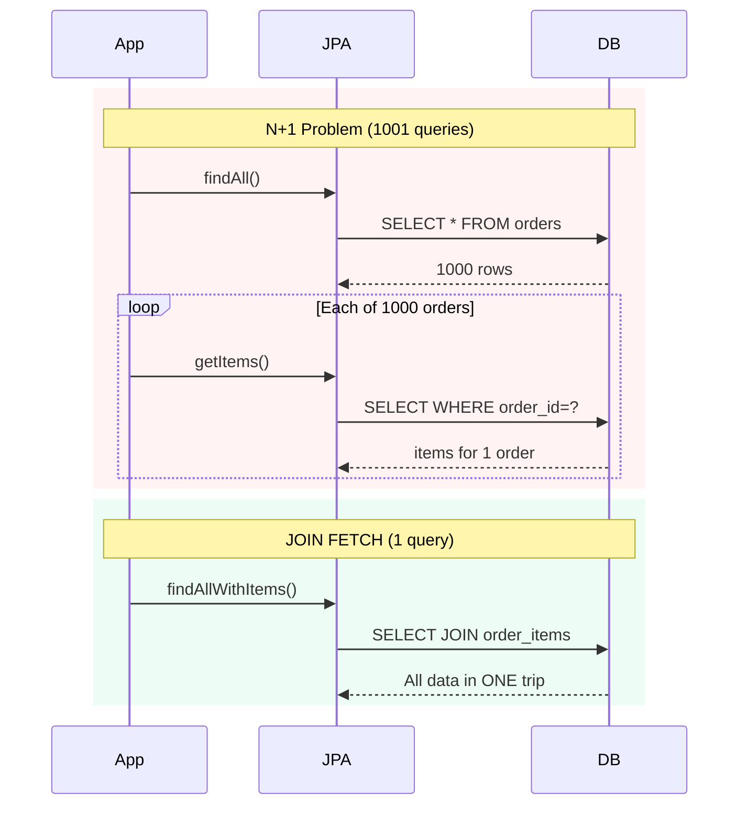
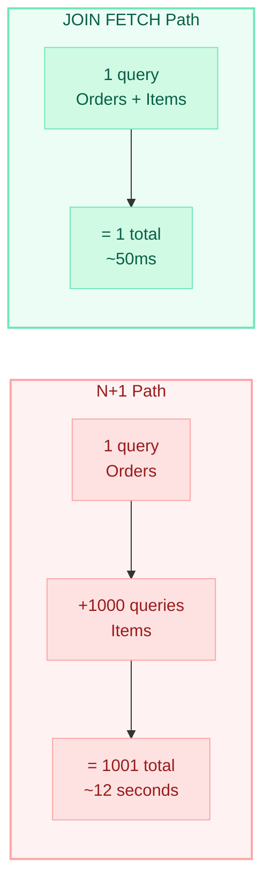
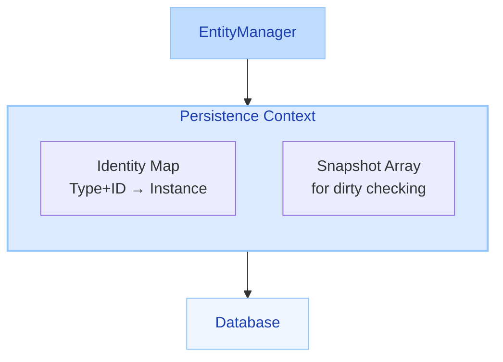
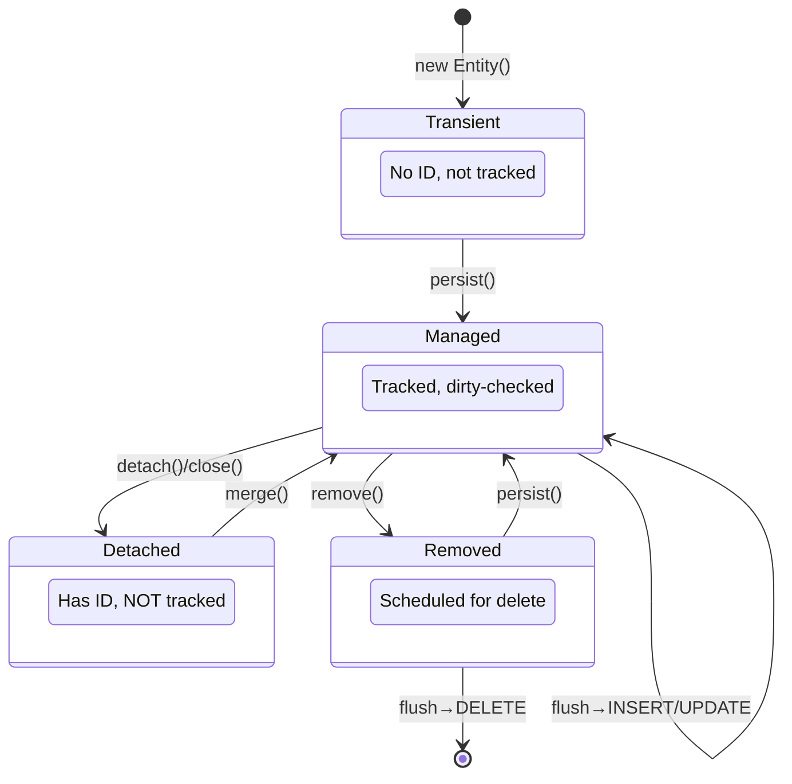
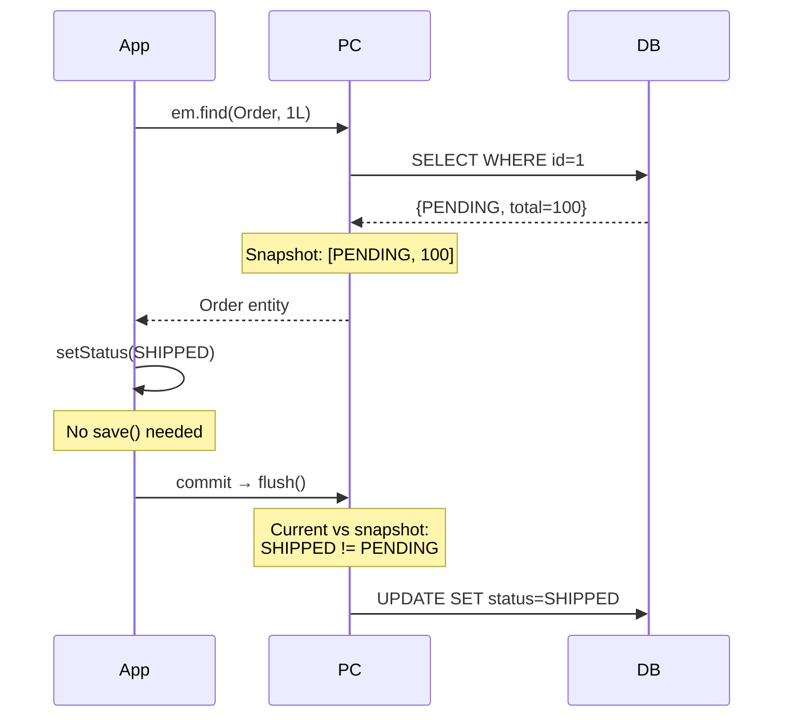
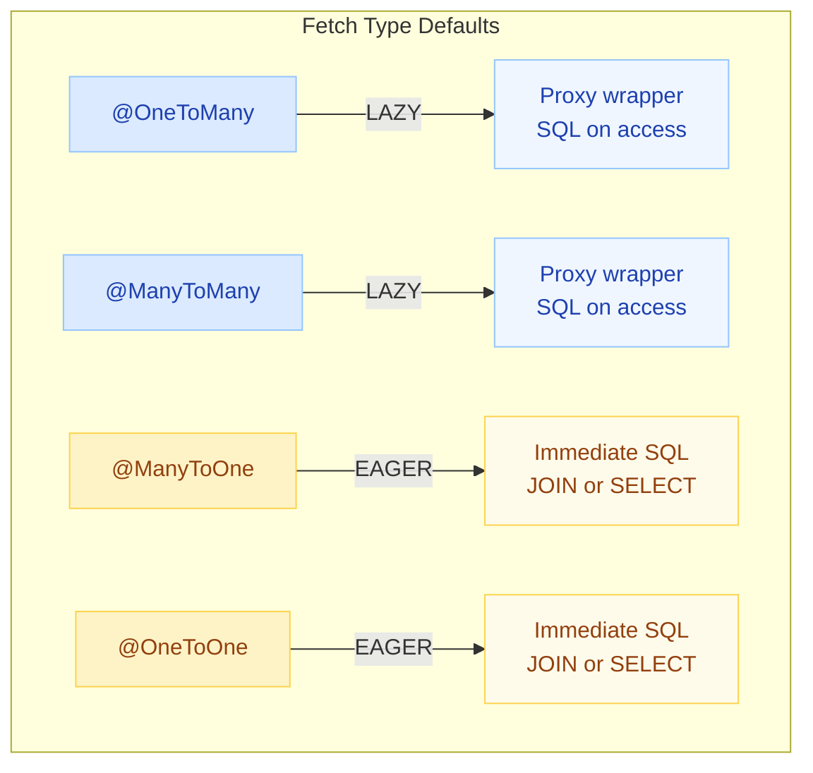
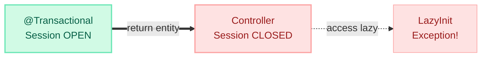
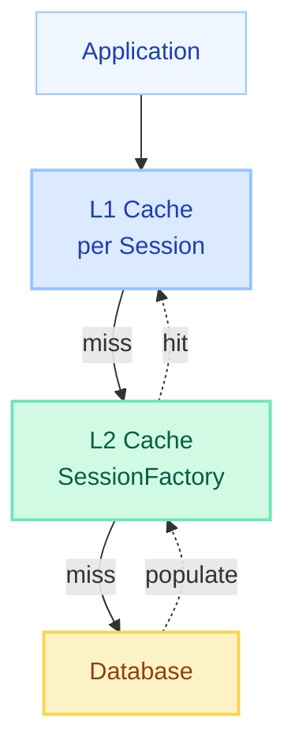
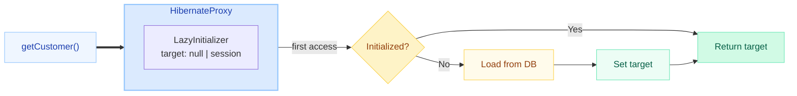
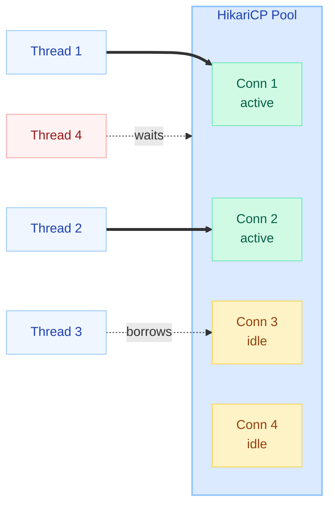

# N+1 Problem & JPA/Hibernate Internals

> **The difference between a 50ms response and a 12-second timeout is often just one missing JOIN FETCH.**

---

!!! danger "Real-World Incident"
    A production API response time went from **50ms to 12 seconds** after a developer added a `@OneToMany` relationship to the `Order` entity. Root cause: **1001 SQL queries** fired for a list of 1000 orders — 1 query to fetch orders, then 1 query per order to fetch its items. The fix was a single `JOIN FETCH` clause.

---

## The N+1 Problem — Visualized

The N+1 problem is the **most common JPA performance killer**. It happens when your code triggers 1 query for the parent entity, then N additional queries to load a related collection — one per parent row.

### The Explosion of Queries



### The Math



---

## JPA/Hibernate Persistence Context

The **Persistence Context** (also called the **First-Level Cache**) is the heart of JPA. It is a Map of entity identity to entity instance, scoped to a single `EntityManager` (or Hibernate `Session`).



### Key Guarantees

| Guarantee | Description |
|-----------|-------------|
| **Repeatable Read** | `em.find(Order.class, 1L)` called twice returns the **same object reference** |
| **Automatic Dirty Checking** | No explicit `update()` needed — Hibernate detects changes at flush time |
| **Write-Behind** | SQL is batched and delayed until flush — reduces round trips |
| **Identity Scope** | Only one instance per entity identity exists in a persistence context |

---

## Entity Lifecycle States

Every JPA entity exists in one of four states. Understanding these is critical for interviews.



```java
// Transient — just created, no persistence context awareness
Order order = new Order();              // Transient

// Managed — tracked by persistence context
em.persist(order);                      // Managed (INSERT queued)

// Detached — was managed, now disconnected
em.detach(order);                       // Detached
// OR: EntityManager closed / cleared

// Removed — scheduled for deletion
em.remove(order);                       // Removed (DELETE queued)

// Re-attach a detached entity
Order merged = em.merge(detachedOrder); // Returns NEW managed instance!
```

!!! warning "merge() Pitfall"
    `merge()` does NOT make the passed object managed. It returns a **new managed copy**. The original detached instance remains detached. Always use the returned reference.

---

## Dirty Checking — How Hibernate Knows What Changed

Hibernate uses a **snapshot comparison** mechanism. At load time, it takes a snapshot of all field values. At flush time, it compares current values to the snapshot.



### Performance Implication

!!! tip "Interview Insight"
    Dirty checking compares **every field** of **every managed entity** at flush time. With 10,000 managed entities, this can be expensive. Solutions: `@DynamicUpdate` (only update changed columns), `readOnly=true` transactions (skip dirty checking entirely), or clear the persistence context periodically for batch operations.

---

## Flush Modes

Flushing is when Hibernate synchronizes the persistence context with the database (executes queued SQL).

| Flush Mode | When It Flushes | Use Case |
|------------|----------------|----------|
| `AUTO` (default) | Before queries + at commit | Safe default — prevents stale reads |
| `COMMIT` | Only at transaction commit | Performance boost if you don't query mid-transaction |
| `ALWAYS` | Before every query | Rarely needed — `AUTO` handles most cases |
| `MANUAL` | Only when you call `em.flush()` | Batch processing — full control |

```java
// Change flush mode for a session
em.unwrap(Session.class).setHibernateFlushMode(FlushMode.COMMIT);

// Or per-query
Query query = em.createQuery("SELECT o FROM Order o");
query.setFlushMode(FlushModeType.COMMIT); // Skip auto-flush for this query
```

---

## Lazy vs Eager Loading



!!! tip "Interview Best Practice"
    **Always use `FetchType.LAZY` for all associations.** Override `@ManyToOne` and `@OneToOne` defaults:
    ```java
    @ManyToOne(fetch = FetchType.LAZY)
    private Author author;
    ```
    Then use `JOIN FETCH` or `@EntityGraph` to eagerly load only when needed.

---

## LazyInitializationException

The most common Hibernate exception in web applications.

```java
@Transactional
public Order getOrder(Long id) {
    return orderRepository.findById(id).orElseThrow();
    // Transaction ends here — EntityManager is closed
}

// In controller (outside transaction):
order.getItems().size(); // 💥 LazyInitializationException!
// The proxy cannot initialize — no active Session
```

### Why It Happens



### Solutions

| Approach | Pros | Cons |
|----------|------|------|
| `JOIN FETCH` in query | Precise, single query | Must write custom query |
| `@EntityGraph` | Declarative, reusable | Can lead to Cartesian products |
| `@Transactional` on controller | Quick fix | Bad architecture — leaks persistence to web layer |
| Open Session in View | Zero code changes | **Anti-pattern** — N+1 hidden, connection held longer |
| DTO Projection | Best performance | More code to maintain |

---

## Solutions to N+1

### 1. JOIN FETCH (JPQL)

The most common and recommended fix.

```java
public interface OrderRepository extends JpaRepository<Order, Long> {

    @Query("SELECT o FROM Order o JOIN FETCH o.items WHERE o.status = :status")
    List<Order> findByStatusWithItems(@Param("status") OrderStatus status);

    // For multiple collections — use separate queries to avoid Cartesian product
    @Query("SELECT DISTINCT o FROM Order o JOIN FETCH o.items")
    List<Order> findAllWithItems();

    @Query("SELECT DISTINCT o FROM Order o JOIN FETCH o.payments")
    List<Order> findAllWithPayments();
}
```

!!! warning "Cartesian Product Trap"
    Never JOIN FETCH two collections simultaneously:
    ```java
    // BAD — MultipleBagFetchException or Cartesian product!
    SELECT o FROM Order o JOIN FETCH o.items JOIN FETCH o.payments
    ```
    Solution: Fetch one collection with JOIN FETCH, the other with `@BatchSize` or a separate query.

### 2. @EntityGraph (Named & Ad-Hoc)

```java
// Ad-hoc EntityGraph — defined inline
public interface OrderRepository extends JpaRepository<Order, Long> {

    @EntityGraph(attributePaths = {"items", "items.product"})
    List<Order> findByStatus(OrderStatus status);
}

// Named EntityGraph — defined on entity
@Entity
@NamedEntityGraph(
    name = "Order.withItemsAndProduct",
    attributeNodes = {
        @NamedAttributeNode(value = "items", subgraph = "items-product")
    },
    subgraphs = {
        @NamedSubgraph(name = "items-product",
            attributeNodes = @NamedAttributeNode("product"))
    }
)
public class Order { ... }

// Usage
@EntityGraph("Order.withItemsAndProduct")
List<Order> findAll();
```

### 3. @BatchSize (Batch Fetching)

Instead of N queries, Hibernate loads lazy collections in batches using `IN` clauses.

```java
@Entity
public class Order {

    @OneToMany(mappedBy = "order")
    @BatchSize(size = 25)  // Load 25 collections at a time
    private List<OrderItem> items;
}
```

**Result:** Instead of 1000 queries, you get `1 + ceil(1000/25) = 41` queries.

```sql
-- Without @BatchSize: 1000 queries
SELECT * FROM order_items WHERE order_id = 1;
SELECT * FROM order_items WHERE order_id = 2;
... (998 more)

-- With @BatchSize(size=25): 40 queries
SELECT * FROM order_items WHERE order_id IN (1,2,3,...,25);
SELECT * FROM order_items WHERE order_id IN (26,27,...,50);
... (38 more)
```

### 4. @Fetch(FetchMode.SUBSELECT)

Loads ALL lazy collections in a single subselect query.

```java
@Entity
public class Order {

    @OneToMany(mappedBy = "order")
    @Fetch(FetchMode.SUBSELECT)
    private List<OrderItem> items;
}
```

```sql
-- Original query
SELECT * FROM orders WHERE status = 'PENDING';

-- When any order.getItems() is accessed:
SELECT * FROM order_items WHERE order_id IN (
    SELECT id FROM orders WHERE status = 'PENDING'
);
```

**Result:** Always exactly 2 queries regardless of N.

### 5. DTO Projections (Skip Entities Entirely)

The highest-performance approach — bypasses the persistence context completely.

```java
// Interface-based projection
public interface OrderSummary {
    Long getId();
    String getCustomerName();
    BigDecimal getTotal();
    Integer getItemCount();
}

@Query("""
    SELECT o.id as id, c.name as customerName, 
           o.total as total, COUNT(i) as itemCount
    FROM Order o 
    JOIN o.customer c 
    LEFT JOIN o.items i
    GROUP BY o.id, c.name, o.total
    """)
List<OrderSummary> findOrderSummaries();

// Record-based projection (Java 17+)
public record OrderDTO(Long id, String customerName, BigDecimal total) {}

@Query("SELECT new com.example.OrderDTO(o.id, c.name, o.total) FROM Order o JOIN o.customer c")
List<OrderDTO> findOrderDTOs();
```

---

## Performance Comparison

| Strategy | Queries for 1000 parents | Memory | Complexity | Best For |
|----------|--------------------------|--------|-----------|----------|
| **N+1 (no fix)** | 1001 | High (entities) | None | Never acceptable |
| **JOIN FETCH** | 1 | High (full entity graph) | Low | Single collection, always needed |
| **@EntityGraph** | 1 | High | Low | Dynamic graph selection |
| **@BatchSize(25)** | 41 | Medium (on-demand) | Minimal | Collections sometimes accessed |
| **SUBSELECT** | 2 | Medium | Minimal | Collections always accessed |
| **DTO Projection** | 1 | Low (no entities) | Medium | Read-only views, APIs |

---

## Caching Architecture

### 1st Level Cache (Session/EntityManager Scope)

- **Scope:** Single transaction / EntityManager
- **Enabled:** Always (cannot be disabled)
- **Eviction:** Session close, `em.clear()`, `em.detach(entity)`
- **Benefit:** Repeatable reads, identity guarantee, write-behind

```java
// Same SQL executed only ONCE within a transaction
Order o1 = em.find(Order.class, 1L);  // SQL: SELECT ...
Order o2 = em.find(Order.class, 1L);  // NO SQL — returns cached instance
assert o1 == o2;  // true — same object reference!
```

### 2nd Level Cache (SessionFactory Scope)

- **Scope:** Shared across all sessions/transactions
- **Enabled:** Opt-in per entity
- **Providers:** EhCache, Hazelcast, Infinispan, Caffeine
- **Strategy:** READ_ONLY, READ_WRITE, NONSTRICT_READ_WRITE, TRANSACTIONAL



```java
@Entity
@Cache(usage = CacheConcurrencyStrategy.READ_WRITE)
public class Product {
    // Frequently read, rarely modified — good L2 cache candidate
}
```

```yaml
# application.yml
spring:
  jpa:
    properties:
      hibernate:
        cache:
          use_second_level_cache: true
          region.factory_class: org.hibernate.cache.jcache.JCacheRegionFactory
        javax:
          cache:
            provider: org.ehcache.jsr107.EhcacheCachingProvider
```

### Query Cache

Caches **query results** (list of entity IDs) — useful for queries that run frequently with same parameters.

```java
@QueryHints(@QueryHint(name = "org.hibernate.cacheable", value = "true"))
List<Product> findByCategory(String category);
```

!!! warning "Query Cache Invalidation"
    The query cache is invalidated whenever **any entity in the target table** is modified. It's only beneficial for tables that are read-heavy and rarely updated.

---

## Proxy Objects — How Lazy Loading Works

When you access a lazy association, Hibernate doesn't return the real entity. It returns a **proxy** — a dynamically generated subclass (via ByteBuddy/CGLIB) that intercepts method calls.



```java
Order order = em.find(Order.class, 1L);

// order.getCustomer() returns a PROXY, not the real Customer
Customer proxy = order.getCustomer();
System.out.println(proxy.getClass());
// Output: com.example.Customer$HibernateProxy$abc123

// getId() may NOT trigger loading (if @Access(AccessType.FIELD))
proxy.getId();  // May return ID without SQL

// Any other method WILL trigger loading
proxy.getName();  // SQL: SELECT * FROM customers WHERE id = ?
```

!!! tip "Interview Question: How to check if a proxy is initialized?"
    ```java
    Hibernate.isInitialized(order.getCustomer())  // false if not loaded
    PersistenceUnitUtil util = emf.getPersistenceUnitUtil();
    util.isLoaded(order, "customer")  // same check via JPA API
    ```

---

## HikariCP Connection Pool

Every JPA query needs a database connection. HikariCP is Spring Boot's default connection pool.



### Pool Size Formula

```
Pool Size = Tn × (Cm - 1) + 1
```

Where:

- **Tn** = Maximum number of threads that can execute concurrently
- **Cm** = Maximum number of simultaneous connections a single thread can hold

!!! tip "Rule of Thumb"
    For most applications: `pool size = (2 × CPU cores) + effective_spindle_count`. For SSDs, start with **10** and benchmark. A pool of **10** connections can often handle 10,000 concurrent users.

### Key Configuration

```yaml
spring:
  datasource:
    hikari:
      maximum-pool-size: 10          # Max connections
      minimum-idle: 5                # Min idle connections
      connection-timeout: 30000      # Wait for connection (ms)
      idle-timeout: 600000           # Close idle connections after 10min
      max-lifetime: 1800000          # Retire connections after 30min
      leak-detection-threshold: 2000 # Log warning if connection held > 2s
```

!!! danger "Connection Leak Detection"
    If `leak-detection-threshold` logs warnings, you have a thread holding a connection without returning it — often caused by a long-running transaction or missing `@Transactional` (connection acquired but never committed/released).

---

## Common Pitfalls

### 1. toString() Triggering Lazy Loading

```java
@Entity
public class Order {
    @OneToMany(mappedBy = "order", fetch = FetchType.LAZY)
    private List<OrderItem> items;

    @Override
    public String toString() {
        // DANGER: This triggers lazy loading of ALL items!
        return "Order{id=" + id + ", items=" + items + "}";
    }
}
```

**Fix:** Exclude lazy collections from `toString()`, or use `@ToString.Exclude` with Lombok.

### 2. Jackson Serialization Loading Everything

```java
@RestController
public class OrderController {

    @GetMapping("/orders/{id}")
    public Order getOrder(@PathVariable Long id) {
        // Jackson calls EVERY getter → triggers ALL lazy associations!
        return orderRepository.findById(id).orElseThrow();
    }
}
```

**Fix:** Use DTOs, `@JsonIgnore`, or Jackson's Hibernate module:

```java
// Option 1: DTO (recommended)
return orderMapper.toDTO(order);

// Option 2: Jackson Hibernate Module
@Bean
public Module hibernateModule() {
    Hibernate5JakartaModule module = new Hibernate5JakartaModule();
    module.configure(FORCE_LAZY_LOADING, false);
    return module;
}
```

### 3. Open Session in View (OSIV) Anti-Pattern

```yaml
# Spring Boot enables this BY DEFAULT — disable it!
spring:
  jpa:
    open-in-view: false  # Disable OSIV
```

**Why it's bad:**

- Database connection held for the **entire HTTP request** (including view rendering)
- N+1 problems are hidden — lazy loads succeed but fire queries from the controller/view layer
- Connection pool exhaustion under load

### 4. Equals/HashCode with Lazy Proxies

```java
// WRONG — breaks with proxies
@Override
public boolean equals(Object o) {
    if (o == null || getClass() != o.getClass()) return false;
    // Proxy class != Entity class!
}

// CORRECT — use instanceof
@Override
public boolean equals(Object o) {
    if (this == o) return true;
    if (!(o instanceof Order other)) return false;
    return id != null && id.equals(other.getId());
}
```

---

## Quick Recall Table

| Concept | Key Point | Interview Trigger |
|---------|-----------|-------------------|
| **N+1 Problem** | 1 query for parent + N queries for children | "How do you detect/fix performance issues in JPA?" |
| **Persistence Context** | 1st level cache, identity map, unit of work | "What happens when you call find() twice?" |
| **Entity States** | Transient → Managed → Detached → Removed | "What is a detached entity?" |
| **Dirty Checking** | Snapshot comparison at flush time | "How does Hibernate know what to update?" |
| **JOIN FETCH** | Solves N+1 in one query via JPQL join | "How do you fix N+1?" |
| **@EntityGraph** | Declarative fetch plan, overrides FetchType | "How to dynamically control eager loading?" |
| **@BatchSize** | Loads N collections with IN clause | "What if JOIN FETCH isn't possible?" |
| **LazyInitializationException** | Accessing proxy outside Session | "Why does this exception happen?" |
| **2nd Level Cache** | Shared across sessions, opt-in | "How does Hibernate caching work?" |
| **Proxy Objects** | ByteBuddy subclass, intercepts getters | "How does lazy loading work internally?" |
| **OSIV** | Anti-pattern, keeps connection open | "What is Open Session in View?" |
| **HikariCP** | Default pool, `2×cores + spindles` formula | "How do you size connection pools?" |

---

## Interview Answer Template

!!! success "When Asked: 'What is the N+1 problem and how do you solve it?'"

    **Structure your answer:**

    1. **Define:** "N+1 is when loading N parent entities triggers N additional queries for their associations — turning 1 expected query into N+1 total queries."

    2. **Root Cause:** "It happens because JPA uses LAZY fetching by default for collections. When you iterate and access the lazy association, each access fires a separate SELECT."

    3. **Detection:** "I use Hibernate statistics (`hibernate.generate_statistics=true`), log SQL (`show_sql` or p6spy), or tools like Hypersistence Optimizer."

    4. **Solutions (in order of preference):**
        - "**JOIN FETCH** in JPQL for known access patterns"
        - "**@EntityGraph** for dynamic/conditional fetching"
        - "**@BatchSize** when collections are accessed conditionally"
        - "**DTO Projections** for read-only views — best performance"

    5. **Prevention:** "I disable OSIV, set all associations to LAZY, use integration tests that assert query counts, and monitor slow query logs."

---

!!! tip "Detecting N+1 in Tests"
    ```java
    @Test
    void shouldNotHaveNPlusOne() {
        // Using datasource-proxy or Hibernate statistics
        SQLStatementCountValidator.reset();
        
        List<Order> orders = orderService.findAllWithItems();
        orders.forEach(o -> o.getItems().size()); // Force initialization
        
        assertSelectCount(2); // Fail if more than expected queries
    }
    ```

!!! tip "Hibernate Statistics"
    ```yaml
    spring:
      jpa:
        properties:
          hibernate:
            generate_statistics: true
    ```
    ```
    # Output includes:
    # - Queries executed
    # - L2 cache hit/miss ratio
    # - Flush count
    # - Entity load/fetch counts
    ```
