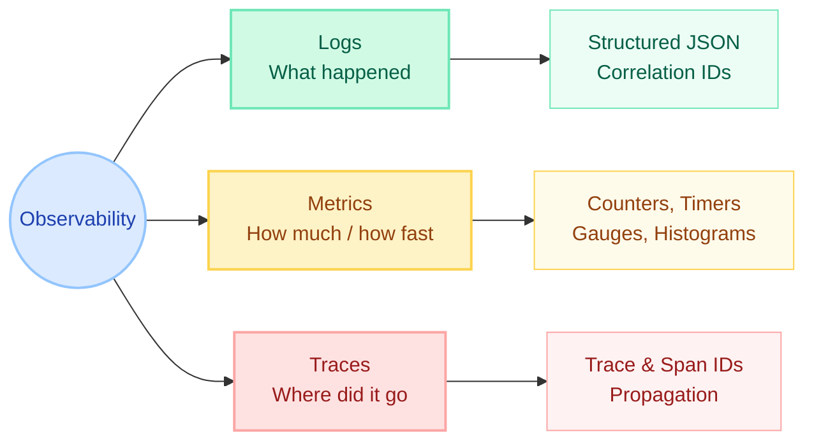
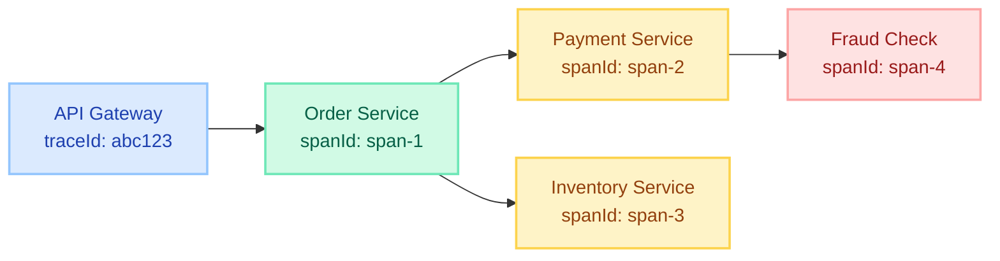
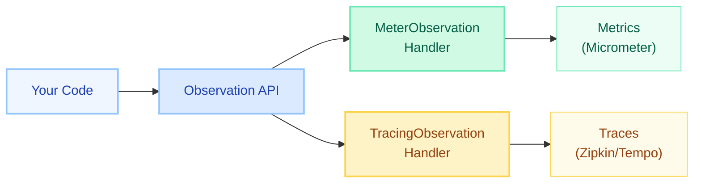
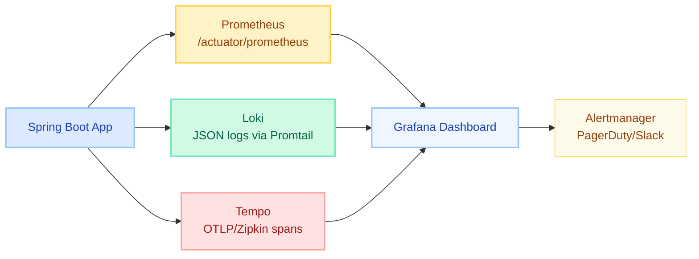

# Spring Boot Observability

> **Logging, Metrics, and Distributed Tracing — the three pillars that let you understand what your system is doing in production without attaching a debugger.**

---

!!! failure "The Pain"
    Spent **4 hours** finding a single bug that bounced across **12 microservices**. No trace correlation, no structured logs, no metrics dashboards. Just `grep` and tears. Never again.

---

## The Three Pillars of Observability



---

## 1. Structured Logging

### Why Structured Logs?

Plain text logs (`INFO: order processed`) are impossible to query at scale. **Structured JSON logs** let you filter, aggregate, and correlate in Loki, Elasticsearch, or CloudWatch.

### Logback JSON with logstash-logback-encoder

```xml
<dependency>
    <groupId>net.logstash.logback</groupId>
    <artifactId>logstash-logback-encoder</artifactId>
    <version>7.4</version>
</dependency>
```

`logback-spring.xml`:

```xml
<configuration>
    <appender name="JSON" class="ch.qos.logback.core.ConsoleAppender">
        <encoder class="net.logstash.logback.encoder.LogstashEncoder">
            <includeMdcKeyName>traceId</includeMdcKeyName>
            <includeMdcKeyName>spanId</includeMdcKeyName>
            <includeMdcKeyName>correlationId</includeMdcKeyName>
        </encoder>
    </appender>

    <root level="INFO">
        <appender-ref ref="JSON"/>
    </root>
</configuration>
```

Output:

```json
{
  "@timestamp": "2024-03-15T10:23:45.123Z",
  "level": "INFO",
  "logger_name": "com.example.OrderService",
  "message": "Order created",
  "traceId": "abc123def456",
  "spanId": "789ghi",
  "correlationId": "order-42",
  "orderId": "ORD-12345",
  "userId": "USR-789"
}
```

### MDC for Correlation IDs

```java
@Component
public class CorrelationFilter implements Filter {

    @Override
    public void doFilter(ServletRequest req, ServletResponse res,
                         FilterChain chain) throws IOException, ServletException {
        String correlationId = Optional
            .ofNullable(((HttpServletRequest) req).getHeader("X-Correlation-ID"))
            .orElse(UUID.randomUUID().toString());

        MDC.put("correlationId", correlationId);
        try {
            chain.doFilter(req, res);
        } finally {
            MDC.clear();
        }
    }
}
```

### Spring Boot Auto-Configuration

Spring Boot 3+ automatically:

- Puts `traceId` and `spanId` into MDC (when Micrometer Tracing is on the classpath)
- Configures log correlation via `logging.pattern.correlation`
- Supports `logging.structured.format.console=ecs` or `logstash` (Boot 3.4+)

```yaml
logging:
  structured:
    format:
      console: logstash
  pattern:
    correlation: "[${spring.application.name:},%mdc{traceId:-},%mdc{spanId:-}]"
```

---

## 2. Micrometer Metrics

### Core Meter Types

| Meter Type | Purpose | Example |
|---|---|---|
| **Counter** | Monotonically increasing count | Total orders placed |
| **Timer** | Duration + count of events | HTTP request latency |
| **Gauge** | Current value (can go up/down) | Active connections, queue size |
| **DistributionSummary** | Distribution of values (no time) | Request payload sizes |

### Dimensional Tags

Every metric carries **tags** (key-value pairs) for slicing and filtering:

```java
@Component
@RequiredArgsConstructor
public class OrderMetrics {

    private final MeterRegistry registry;

    public void recordOrderPlaced(String region, String paymentMethod) {
        registry.counter("orders.placed",
            "region", region,
            "payment_method", paymentMethod
        ).increment();
    }

    public void recordOrderLatency(String endpoint, Duration duration) {
        registry.timer("orders.processing.time",
            "endpoint", endpoint
        ).record(duration);
    }

    public void registerQueueSize(BlockingQueue<?> queue) {
        Gauge.builder("orders.queue.size", queue, BlockingQueue::size)
            .description("Pending orders in queue")
            .tag("type", "processing")
            .register(registry);
    }
}
```

### Distribution Summary

```java
DistributionSummary summary = DistributionSummary.builder("http.request.size")
    .description("Request payload size in bytes")
    .baseUnit("bytes")
    .tag("endpoint", "/api/orders")
    .publishPercentiles(0.5, 0.95, 0.99)
    .publishPercentileHistogram()
    .register(registry);

summary.record(requestBody.length());
```

### Prometheus + Grafana Integration

```xml
<dependency>
    <groupId>io.micrometer</groupId>
    <artifactId>micrometer-registry-prometheus</artifactId>
</dependency>
```

```yaml
management:
  endpoints:
    web:
      exposure:
        include: health,metrics,prometheus
  prometheus:
    metrics:
      export:
        enabled: true
```

Prometheus scrapes `/actuator/prometheus` and Grafana visualizes it. Common auto-instrumented metrics:

- `http.server.requests` (timer) -- request duration by URI, method, status
- `jvm.memory.used` (gauge) -- heap/non-heap by area
- `jvm.gc.pause` (timer) -- GC pause duration
- `system.cpu.usage` (gauge) -- process CPU
- `hikaricp.connections.active` (gauge) -- DB pool usage

### Custom Metric with @Timed

```java
@Service
public class PaymentService {

    @Timed(value = "payment.process.time",
           description = "Time to process payment",
           extraTags = {"gateway", "stripe"})
    public PaymentResult processPayment(PaymentRequest request) {
        // business logic
    }
}
```

!!! warning "Enable TimedAspect"
    `@Timed` requires a `TimedAspect` bean:
    ```java
    @Bean
    public TimedAspect timedAspect(MeterRegistry registry) {
        return new TimedAspect(registry);
    }
    ```

---

## 3. Distributed Tracing

### Micrometer Tracing (formerly Spring Cloud Sleuth)

Spring Cloud Sleuth is **deprecated** since Spring Boot 3. Micrometer Tracing is the replacement.

```xml
<!-- Bridge to Brave (Zipkin-compatible) -->
<dependency>
    <groupId>io.micrometer</groupId>
    <artifactId>micrometer-tracing-bridge-brave</artifactId>
</dependency>

<!-- Reporter: send spans to Zipkin/Tempo -->
<dependency>
    <groupId>io.zipkin.reporter2</groupId>
    <artifactId>zipkin-reporter-brave</artifactId>
</dependency>
```

OR for OpenTelemetry:

```xml
<dependency>
    <groupId>io.micrometer</groupId>
    <artifactId>micrometer-tracing-bridge-otel</artifactId>
</dependency>
<dependency>
    <groupId>io.opentelemetry</groupId>
    <artifactId>opentelemetry-exporter-otlp</artifactId>
</dependency>
```

### Trace and Span IDs



- **Trace ID** -- single ID shared across ALL services for one request
- **Span ID** -- unique per operation within the trace
- **Parent Span ID** -- links spans into a tree

### Context Propagation

Trace context is automatically propagated via HTTP headers:

| Header | Format |
|---|---|
| `traceparent` | W3C Trace Context (default in Boot 3) |
| `X-B3-TraceId` / `X-B3-SpanId` | Zipkin B3 format |

Spring Boot auto-propagates through:

- RestTemplate / WebClient / RestClient (auto-instrumented)
- Kafka headers
- Spring Integration channels
- @Async thread boundaries

```yaml
management:
  tracing:
    sampling:
      probability: 1.0  # 100% in dev, lower in prod (0.1 = 10%)
    propagation:
      type: w3c  # or b3 for Zipkin-native
  zipkin:
    tracing:
      endpoint: http://tempo:9411/api/v2/spans
```

### Custom Spans

```java
@Service
@RequiredArgsConstructor
public class OrderService {

    private final Tracer tracer;

    public Order createOrder(OrderRequest request) {
        Span span = tracer.nextSpan().name("create-order").start();
        try (Tracer.SpanInScope ws = tracer.withSpan(span)) {
            span.tag("orderId", request.getOrderId());
            span.tag("userId", request.getUserId());

            Order order = processOrder(request);

            span.event("order-persisted");
            return order;
        } catch (Exception e) {
            span.error(e);
            throw e;
        } finally {
            span.end();
        }
    }
}
```

---

## 4. Observation API (Spring 6)

The **Observation API** unifies metrics and tracing into a single abstraction. One observation produces both a timer metric AND a trace span.

### How It Works



### @Observed Annotation

```java
@Service
public class InventoryService {

    @Observed(name = "inventory.check",
              contextualName = "check-stock",
              lowCardinalityKeyValues = {"warehouse", "us-east"})
    public StockResult checkStock(String sku) {
        // This method automatically:
        // 1. Creates a Timer metric named "inventory.check"
        // 2. Creates a Trace span named "check-stock"
        return repository.findBySku(sku);
    }
}
```

!!! note "Enable @Observed"
    Requires `ObservedAspect` bean:
    ```java
    @Bean
    ObservedAspect observedAspect(ObservationRegistry registry) {
        return new ObservedAspect(registry);
    }
    ```

### Programmatic Observation

```java
@Service
@RequiredArgsConstructor
public class NotificationService {

    private final ObservationRegistry registry;

    public void sendNotification(Notification notification) {
        Observation.createNotStarted("notification.send", registry)
            .lowCardinalityKeyValue("type", notification.getType())
            .lowCardinalityKeyValue("channel", notification.getChannel())
            .highCardinalityKeyValue("recipientId", notification.getRecipientId())
            .observe(() -> doSend(notification));
    }
}
```

**Key concepts:**

- `lowCardinalityKeyValue` -- finite set of values (used as metric tags AND span tags)
- `highCardinalityKeyValue` -- unbounded values like user IDs (span tags only, NOT metric tags)

---

## 5. Custom Health Indicators & Info Contributors

### Custom Health Indicator

```java
@Component
public class ExternalApiHealthIndicator implements HealthIndicator {

    private final RestClient restClient;

    @Override
    public Health health() {
        try {
            ResponseEntity<Void> response = restClient
                .get().uri("/health")
                .retrieve()
                .toBodilessEntity();

            if (response.getStatusCode().is2xxSuccessful()) {
                return Health.up()
                    .withDetail("responseTime", "45ms")
                    .build();
            }
            return Health.down()
                .withDetail("status", response.getStatusCode())
                .build();
        } catch (Exception e) {
            return Health.down(e).build();
        }
    }
}
```

### Custom Info Contributor

```java
@Component
public class ServiceInfoContributor implements InfoContributor {

    @Override
    public void contribute(Info.Builder builder) {
        builder.withDetail("deployment", Map.of(
            "region", "us-east-1",
            "cluster", "production-a",
            "version", "2.3.1",
            "lastDeploy", Instant.now().toString()
        ));
        builder.withDetail("features", Map.of(
            "newCheckout", true,
            "darkMode", false
        ));
    }
}
```

---

## 6. The Grafana Stack (Prometheus + Loki + Tempo)



### Docker Compose (Local Dev)

```yaml
services:
  prometheus:
    image: prom/prometheus:latest
    ports: ["9090:9090"]
    volumes:
      - ./prometheus.yml:/etc/prometheus/prometheus.yml

  loki:
    image: grafana/loki:latest
    ports: ["3100:3100"]

  tempo:
    image: grafana/tempo:latest
    ports: ["3200:3200", "9411:9411"]
    command: ["-config.file=/etc/tempo.yaml"]

  grafana:
    image: grafana/grafana:latest
    ports: ["3000:3000"]
    environment:
      GF_AUTH_ANONYMOUS_ENABLED: "true"
      GF_AUTH_ANONYMOUS_ORG_ROLE: Admin
```

`prometheus.yml`:

```yaml
scrape_configs:
  - job_name: 'spring-boot'
    metrics_path: '/actuator/prometheus'
    scrape_interval: 15s
    static_configs:
      - targets: ['host.docker.internal:8080']
```

---

## 7. Configuration Properties Reference

| Property | Default | Description |
|---|---|---|
| `management.tracing.sampling.probability` | `0.1` | Fraction of requests traced (1.0 = all) |
| `management.tracing.propagation.type` | `w3c` | Header format: `w3c`, `b3`, `b3_multi` |
| `management.zipkin.tracing.endpoint` | `http://localhost:9411/api/v2/spans` | Zipkin/Tempo endpoint |
| `management.otlp.tracing.endpoint` | `http://localhost:4318/v1/traces` | OTLP collector endpoint |
| `management.endpoints.web.exposure.include` | `health` | Endpoints exposed over HTTP |
| `management.metrics.tags.*` | -- | Common tags applied to all metrics |
| `management.metrics.distribution.percentiles-histogram.*` | `false` | Enable histogram buckets |
| `management.metrics.distribution.percentiles.*` | -- | Client-side percentiles |
| `logging.pattern.correlation` | -- | Log pattern for trace/span in logs |
| `logging.structured.format.console` | -- | `logstash` or `ecs` (Boot 3.4+) |

### Common Tags (applied to every metric)

```yaml
management:
  metrics:
    tags:
      application: ${spring.application.name}
      environment: ${spring.profiles.active:default}
      region: us-east-1
```

---

## Quick Recall

| Concept | Key Point |
|---|---|
| Three Pillars | Logs + Metrics + Traces |
| Structured Logging | logstash-logback-encoder, MDC, JSON output |
| Micrometer Meters | Counter, Timer, Gauge, DistributionSummary |
| Dimensional Tags | Key-value pairs on every metric for filtering |
| Sleuth Replacement | Micrometer Tracing (Spring Boot 3+) |
| Trace Propagation | W3C `traceparent` header (default) |
| Observation API | One abstraction -> metrics + traces |
| @Observed | Annotation for auto metrics + spans |
| Low vs High Cardinality | Low = metric tags, High = span-only |
| Grafana Stack | Prometheus (metrics) + Loki (logs) + Tempo (traces) |
| Sampling | `management.tracing.sampling.probability` |

---

## Interview Template

!!! tip "How would you implement observability in a Spring Boot microservices system?"
    **Opening:** "I structure observability around the three pillars -- logs, metrics, and traces -- using Spring Boot's native integrations with Micrometer."

    **Structured Logging:**
    "For logs, I use logstash-logback-encoder to emit JSON. MDC propagates correlation IDs and trace context automatically into every log line. This lets us query by traceId in Loki or Elasticsearch to see all logs for a single request across services."

    **Metrics:**
    "Micrometer provides dimensional metrics -- Counters, Timers, Gauges -- with tags for slicing. Prometheus scrapes `/actuator/prometheus`, and we visualize in Grafana. We add custom business metrics like orders placed, payment failures, using `@Timed` or the programmatic API."

    **Distributed Tracing:**
    "Micrometer Tracing replaces Sleuth in Boot 3. It assigns a traceId that propagates across services via W3C traceparent headers. Spans are exported to Tempo or Zipkin. We can trace a request from API Gateway through all downstream services."

    **Observation API:**
    "Spring 6's Observation API unifies metrics and tracing. A single `@Observed` annotation creates both a timer metric and a trace span. Low-cardinality values become metric tags; high-cardinality values go only to traces."

    **Production setup:**
    "We run the Grafana stack: Prometheus for metrics, Loki for logs, Tempo for traces. Grafana dashboards correlate all three -- click a spike in latency metric, jump to the trace, see the relevant logs. Alertmanager fires alerts to Slack/PagerDuty."

---

!!! abstract "Key Takeaway"
    Observability is not optional in microservices. **Structured logs** give you the "what", **metrics** give you the "how much", and **traces** give you the "where". Spring Boot 3 with Micrometer Tracing and the Observation API makes all three first-class citizens with minimal configuration.
