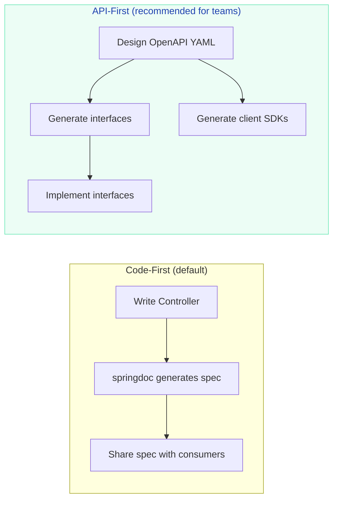

# OpenAPI & API Documentation (springdoc)

> **Auto-generate interactive API documentation from your code — the industry standard for API-first development.**

---

!!! abstract "Real-World Analogy"
    OpenAPI is like the **menu at a restaurant**. Without it, customers (API consumers) have to ask the waiter (developer) what's available, how to order, and what the portion sizes are. With it, they can browse the menu (Swagger UI), see photos (examples), check allergens (validation rules), and even order directly (Try It Out button) — all self-service.

---

## Setup (Spring Boot 3.x)

```xml
<dependency>
    <groupId>org.springdoc</groupId>
    <artifactId>springdoc-openapi-starter-webmvc-ui</artifactId>
    <version>2.5.0</version>
</dependency>
```

```yaml
# application.yml
springdoc:
  api-docs:
    path: /v3/api-docs           # OpenAPI spec JSON
  swagger-ui:
    path: /swagger-ui.html       # Interactive UI
    operations-sorter: method
    tags-sorter: alpha
  info:
    title: Order Service API
    version: 1.0.0
    description: "REST API for managing customer orders"
```

That's it. Visit `http://localhost:8080/swagger-ui.html` — your entire API is documented automatically.

---

## Annotating Your API

### Basic Controller

```java
@RestController
@RequestMapping("/api/v1/orders")
@Tag(name = "Orders", description = "Order management operations")
public class OrderController {

    @Operation(
        summary = "Create a new order",
        description = "Places a new order for the authenticated customer. " +
                      "Inventory is reserved immediately."
    )
    @ApiResponses({
        @ApiResponse(responseCode = "201", description = "Order created successfully",
            content = @Content(schema = @Schema(implementation = OrderResponse.class))),
        @ApiResponse(responseCode = "400", description = "Invalid order request",
            content = @Content(schema = @Schema(implementation = ErrorResponse.class))),
        @ApiResponse(responseCode = "409", description = "Insufficient inventory")
    })
    @PostMapping
    public ResponseEntity<OrderResponse> createOrder(
            @Valid @RequestBody OrderRequest request) {
        Order order = orderService.create(request);
        return ResponseEntity.status(HttpStatus.CREATED).body(OrderResponse.from(order));
    }

    @Operation(summary = "Get order by ID")
    @GetMapping("/{id}")
    public OrderResponse getOrder(
            @Parameter(description = "Order ID", example = "ord_2xKj9f")
            @PathVariable String id) {
        return OrderResponse.from(orderService.findById(id));
    }

    @Operation(summary = "Search orders with filters")
    @GetMapping
    public Page<OrderResponse> searchOrders(
            @Parameter(description = "Filter by status") @RequestParam(required = false) OrderStatus status,
            @Parameter(description = "Filter by date range start") @RequestParam(required = false) LocalDate from,
            @Parameter(description = "Filter by date range end") @RequestParam(required = false) LocalDate to,
            @ParameterObject Pageable pageable) {
        return orderService.search(status, from, to, pageable).map(OrderResponse::from);
    }
}
```

### Schema Documentation (DTOs)

```java
@Schema(description = "Request to create a new order")
public record OrderRequest(
    @Schema(description = "Customer ID", example = "cust_abc123", requiredMode = REQUIRED)
    @NotBlank String customerId,

    @Schema(description = "Order items (1-50 items)", minLength = 1, maxLength = 50)
    @NotEmpty @Size(max = 50) List<OrderItemRequest> items,

    @Schema(description = "Shipping address")
    @Valid @NotNull Address shippingAddress,

    @Schema(description = "Special instructions", example = "Leave at front door", nullable = true)
    String notes
) {}

@Schema(description = "Individual item in an order")
public record OrderItemRequest(
    @Schema(description = "Product SKU", example = "SKU-LAPTOP-001")
    @NotBlank String sku,

    @Schema(description = "Quantity to order", minimum = "1", maximum = "100", example = "2")
    @Min(1) @Max(100) int quantity
) {}
```

---

## API-First Development

Design the API spec FIRST, then generate code — the opposite of code-first.



### API-First with openapi-generator

```yaml
# openapi.yaml — design this first
openapi: 3.0.3
info:
  title: Order Service
  version: 1.0.0
paths:
  /orders:
    post:
      operationId: createOrder
      requestBody:
        content:
          application/json:
            schema:
              $ref: '#/components/schemas/OrderRequest'
      responses:
        '201':
          content:
            application/json:
              schema:
                $ref: '#/components/schemas/OrderResponse'
```

```xml
<!-- Generate Spring interfaces from spec -->
<plugin>
    <groupId>org.openapitools</groupId>
    <artifactId>openapi-generator-maven-plugin</artifactId>
    <configuration>
        <inputSpec>${project.basedir}/src/main/resources/openapi.yaml</inputSpec>
        <generatorName>spring</generatorName>
        <configOptions>
            <interfaceOnly>true</interfaceOnly>
            <useSpringBoot3>true</useSpringBoot3>
            <useTags>true</useTags>
        </configOptions>
    </configuration>
</plugin>
```

---

## Security Documentation

```java
@Configuration
public class OpenApiConfig {

    @Bean
    public OpenAPI customOpenAPI() {
        return new OpenAPI()
            .info(new Info().title("Order Service").version("1.0"))
            .addSecurityItem(new SecurityRequirement().addList("Bearer Auth"))
            .components(new Components()
                .addSecuritySchemes("Bearer Auth",
                    new SecurityScheme()
                        .type(SecurityScheme.Type.HTTP)
                        .scheme("bearer")
                        .bearerFormat("JWT")
                        .description("Enter JWT token")));
    }
}
```

```java
// Mark endpoints that require auth
@SecurityRequirement(name = "Bearer Auth")
@PostMapping("/orders")
public ResponseEntity<OrderResponse> createOrder(...) { }

// Mark public endpoints
@Operation(security = {})  // empty = no auth required
@GetMapping("/products")
public List<Product> listProducts() { }
```

---

## Grouping APIs (Multiple Specs)

```yaml
# Separate specs for internal vs public APIs
springdoc:
  group-configs:
    - group: public
      paths-to-match: /api/v1/**
      packages-to-scan: com.example.controller.pub
    - group: internal
      paths-to-match: /internal/**
      packages-to-scan: com.example.controller.internal
    - group: admin
      paths-to-match: /admin/**
```

---

## Best Practices

| Practice | Why |
|----------|-----|
| Use `@Schema` with examples | Consumers understand expected values without reading code |
| Document ALL error responses | API consumers need to handle errors gracefully |
| Version your API (`/v1/`, `/v2/`) | Breaking changes don't surprise consumers |
| Include `operationId` | Client SDK generation uses this as method names |
| Use `@ParameterObject` for Pageable | Swagger shows page, size, sort params correctly |
| Disable in production | Security — don't expose your API structure publicly |

### Disable in Production

```yaml
# application-prod.yml
springdoc:
  api-docs:
    enabled: false
  swagger-ui:
    enabled: false
```

---

## Interview Questions

??? question "What's the difference between Swagger and OpenAPI?"

    **Answer:** Swagger was the original name for the specification (Swagger 2.0). In 2016, it was donated to the OpenAPI Initiative and renamed OpenAPI Specification (OAS 3.0+). "Swagger" now refers to the tooling (Swagger UI, Swagger Editor, Swagger Codegen), not the spec itself.

    - **OpenAPI** = the specification (YAML/JSON format)
    - **Swagger UI** = the interactive documentation viewer
    - **springdoc** = the Spring Boot library that generates OpenAPI specs from code

??? question "Code-first vs API-first — when would you choose each?"

    **Answer:**
    
    - **Code-first** when: solo developer, rapid prototyping, internal APIs where you control all consumers
    - **API-first** when: multiple teams consuming your API, mobile + web + third-party clients, need to agree on contracts before implementation, want to generate client SDKs automatically
    
    In mature organizations with multiple teams, API-first prevents the "API was designed by whoever happened to write the controller first" problem.

??? question "How do you handle API versioning in OpenAPI?"

    **Answer:** Three common strategies:
    
    1. **URL path** (`/v1/orders`, `/v2/orders`) — most common, simplest
    2. **Header** (`Accept: application/vnd.company.v2+json`) — cleanest but harder to test
    3. **Query parameter** (`/orders?version=2`) — easy but ugly
    
    In OpenAPI spec, document each version as a separate path or use separate spec files per version.
