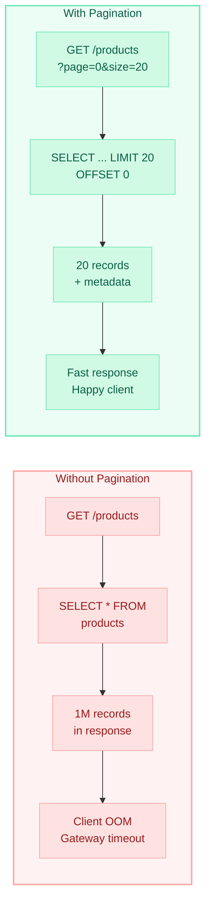
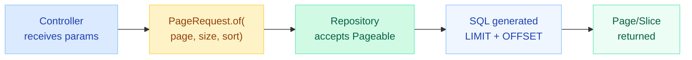
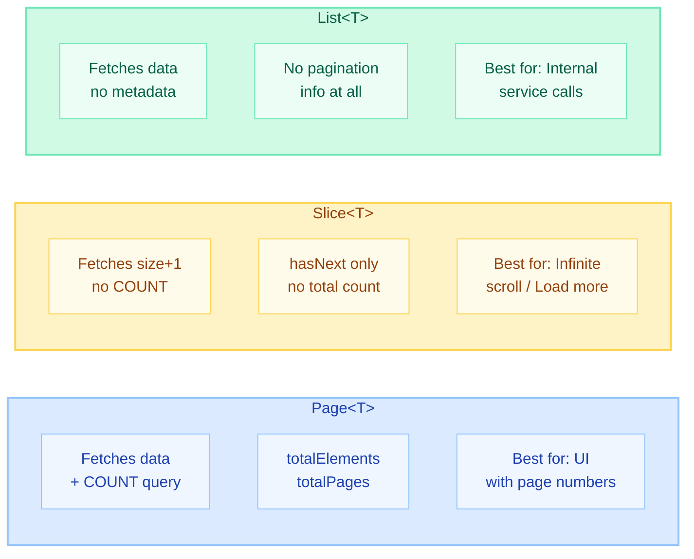
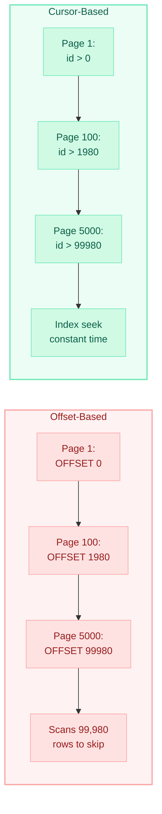
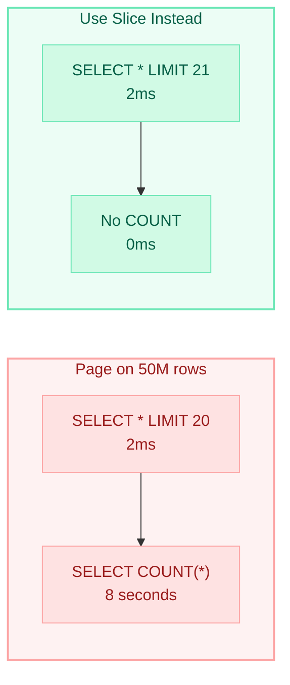

```mermaid
flowchart LR
    Client["Client Request\npage=2&size=20"] --> Controller["Controller\nPageable resolved"]
    Controller --> Service["Service Layer"]
    Service --> Repo["Repository\nfindAll(pageable)"]
    Repo --> SQL["SQL: SELECT ...\nLIMIT 20 OFFSET 40"]
    SQL --> Result["Page object\nwith metadata"]
    Result --> JSON["JSON Response\ntotalPages, hasNext"]

    style Client fill:#DBEAFE,stroke:#93C5FD,color:#1E40AF
    style Controller fill:#EFF6FF,stroke:#93C5FD,color:#1E40AF
    style Service fill:#FEF3C7,stroke:#FCD34D,color:#92400E
    style Repo fill:#D1FAE5,stroke:#6EE7B7,color:#065F46
    style SQL fill:#ECFDF5,stroke:#6EE7B7,color:#065F46
    style Result fill:#FEF3C7,stroke:#FCD34D,color:#92400E
    style JSON fill:#DBEAFE,stroke:#93C5FD,color:#1E40AF
```

# Pagination & Sorting with Spring Data

> **Never return unbounded result sets. Paginate everything. Your mobile clients and database will thank you.**

---

!!! danger "Real-World Incident"
    A product catalog API returned **1 million records** in a single JSON response. The mobile client crashed, the gateway timed out, and the database connection pool was exhausted for 8 minutes. Root cause: no pagination. The fix was adding `Pageable` to one repository method.



---

## The Pageable Interface

`Pageable` is the core abstraction for pagination requests. It encapsulates page number, page size, and sort information.



### Key Parameters

| Parameter | Description | Default |
|-----------|-------------|---------|
| `page` | Zero-based page index | `0` |
| `size` | Number of items per page | `20` |
| `sort` | Sorting criteria (field,direction) | unsorted |

```java
// Spring auto-resolves Pageable from query params
@GetMapping("/products")
public Page<Product> list(Pageable pageable) {
    return productRepository.findAll(pageable);
}

// Request: GET /products?page=0&size=20&sort=price,desc&sort=name,asc
```

---

## Page vs Slice vs List — Return Types

Spring Data offers three return types with different trade-offs:



| Return Type | COUNT Query? | Knows Total? | Use Case |
|-------------|:---:|:---:|----------|
| `Page<T>` | Yes | Yes | Traditional pagination with page numbers |
| `Slice<T>` | No | No (only `hasNext`) | Infinite scroll, "Load more" button |
| `List<T>` | No | No | Internal services, batch processing |

```java
// Page — runs COUNT(*) automatically
Page<Product> findByCategory(String category, Pageable pageable);

// Slice — fetches size+1 to determine hasNext, no COUNT
Slice<Product> findByStatus(Status status, Pageable pageable);

// List — just applies LIMIT/OFFSET, no metadata
List<Product> findByPriceBetween(BigDecimal min, BigDecimal max, Pageable pageable);
```

!!! warning "Performance Impact of Page vs Slice"
    `Page` triggers a `SELECT COUNT(*)` on every request. For tables with millions of rows, this count query can take **seconds**. Use `Slice` when you do not need exact totals.

---

## PagingAndSortingRepository & JpaRepository

Both interfaces provide built-in pagination support:

```java
// PagingAndSortingRepository — minimal pagination
public interface PagingAndSortingRepository<T, ID> extends CrudRepository<T, ID> {
    Iterable<T> findAll(Sort sort);
    Page<T> findAll(Pageable pageable);
}

// JpaRepository — extends PagingAndSortingRepository + adds more
public interface JpaRepository<T, ID> extends 
        ListCrudRepository<T, ID>,
        ListPagingAndSortingRepository<T, ID>,
        QueryByExampleExecutor<T> {
    
    List<T> findAll(Sort sort);           // Returns List
    Page<T> findAll(Pageable pageable);   // Full page with metadata
    void flush();
    // ... more JPA-specific methods
}
```

!!! tip "Use JpaRepository"
    In production apps, always extend `JpaRepository`. It gives you pagination, sorting, batch operations, and flush control — everything `PagingAndSortingRepository` offers plus more.

```java
public interface ProductRepository extends JpaRepository<Product, Long> {
    // Inherits findAll(Pageable) automatically
    // Add custom paginated methods:
    Page<Product> findByCategoryAndPriceGreaterThan(
        String category, BigDecimal price, Pageable pageable);
}
```

---

## Sort — Single & Multi-Field Sorting

### Building Sort Objects

```java
// Single field ascending
Sort sort = Sort.by("name");  // defaults to ASC

// Single field descending
Sort sort = Sort.by(Sort.Direction.DESC, "price");

// Multiple fields
Sort sort = Sort.by("category").ascending()
               .and(Sort.by("price").descending());

// Type-safe with JPA metamodel
Sort sort = Sort.by(Sort.Order.asc("category"),
                    Sort.Order.desc("price"),
                    Sort.Order.asc("name"));

// Null handling
Sort sort = Sort.by(Sort.Order.asc("price").nullsLast());
```

### Using Sort with PageRequest

```java
// Combine pagination + sorting
Pageable pageable = PageRequest.of(0, 20, Sort.by("price").descending());

// Multiple sort fields in PageRequest
Pageable pageable = PageRequest.of(0, 20, 
    Sort.by(Sort.Order.desc("createdAt"), Sort.Order.asc("name")));
```

### Sort in REST Requests

```
GET /products?page=0&size=20&sort=price,desc
GET /products?page=0&size=20&sort=price,desc&sort=name,asc
```

Spring automatically parses the `sort` parameter into a `Sort` object when `Pageable` is a controller method parameter.

---

## PageRequest.of() — Building Pageable

`PageRequest` is the primary implementation of `Pageable`:

```java
// Basic — page 0, size 20, unsorted
Pageable p = PageRequest.of(0, 20);

// With sort
Pageable p = PageRequest.of(0, 20, Sort.by("name"));

// With direction + field
Pageable p = PageRequest.of(0, 20, Sort.Direction.DESC, "price");

// Unpaged (returns all results — use carefully)
Pageable p = Pageable.unpaged();

// Offset-based (Spring Boot 3+)
Pageable p = PageRequest.ofSize(25).withPage(3);
```

### Controller Pattern

```java
@RestController
@RequestMapping("/api/products")
public class ProductController {

    private final ProductRepository repository;

    @GetMapping
    public Page<ProductDTO> list(
            @RequestParam(defaultValue = "0") int page,
            @RequestParam(defaultValue = "20") int size,
            @RequestParam(defaultValue = "createdAt,desc") String[] sort) {

        // Build Sort from string array
        List<Sort.Order> orders = new ArrayList<>();
        for (String s : sort) {
            String[] parts = s.split(",");
            Sort.Direction dir = parts.length > 1 
                ? Sort.Direction.fromString(parts[1]) 
                : Sort.Direction.ASC;
            orders.add(new Sort.Order(dir, parts[0]));
        }

        Pageable pageable = PageRequest.of(page, size, Sort.by(orders));
        return repository.findAll(pageable).map(this::toDTO);
    }
}
```

!!! tip "Simpler Alternative — Let Spring Handle It"
    If you declare `Pageable` directly as a method parameter, Spring Boot auto-resolves it from `page`, `size`, and `sort` query params. No manual parsing needed.

    ```java
    @GetMapping
    public Page<ProductDTO> list(Pageable pageable) {
        return repository.findAll(pageable).map(this::toDTO);
    }
    ```

---

## Custom Queries with Pageable

Add `Pageable` as the last parameter to any `@Query` method:

```java
public interface ProductRepository extends JpaRepository<Product, Long> {

    // JPQL with Pageable
    @Query("SELECT p FROM Product p WHERE p.category = :cat AND p.active = true")
    Page<Product> findActiveByCategory(@Param("cat") String category, Pageable pageable);

    // Native query — MUST provide countQuery for Page<T>
    @Query(
        value = "SELECT * FROM products WHERE tsv @@ to_tsquery(:query)",
        countQuery = "SELECT COUNT(*) FROM products WHERE tsv @@ to_tsquery(:query)",
        nativeQuery = true)
    Page<Product> fullTextSearch(@Param("query") String query, Pageable pageable);

    // Slice — no countQuery needed
    @Query("SELECT p FROM Product p WHERE p.price > :min ORDER BY p.price")
    Slice<Product> findExpensive(@Param("min") BigDecimal min, Pageable pageable);

    // Projection with pagination
    @Query("SELECT new com.app.dto.ProductSummary(p.id, p.name, p.price) " +
           "FROM Product p WHERE p.status = 'ACTIVE'")
    Page<ProductSummary> findActiveSummaries(Pageable pageable);

    // Specification + Pageable (via JpaSpecificationExecutor)
    // Inherited: Page<T> findAll(Specification<T> spec, Pageable pageable);
}
```

!!! warning "Native Query + Page Requires countQuery"
    For native queries returning `Page<T>`, you **must** specify a separate `countQuery`. Spring cannot derive the count query from native SQL automatically.

---

## REST API Pagination Pattern

### Standard Request Format

```
GET /api/products?page=0&size=20&sort=price,desc&sort=name,asc
```

### Response Structure

```json
{
  "content": [
    {"id": 1, "name": "Laptop", "price": 999.99},
    {"id": 2, "name": "Mouse", "price": 29.99}
  ],
  "pageable": {
    "pageNumber": 0,
    "pageSize": 20,
    "sort": {"sorted": true, "orders": [{"property": "price", "direction": "DESC"}]}
  },
  "totalElements": 1542,
  "totalPages": 78,
  "size": 20,
  "number": 0,
  "first": true,
  "last": false,
  "hasNext": true,
  "hasPrevious": false,
  "numberOfElements": 20
}
```

### Configuration Defaults

```yaml
# application.yml
spring:
  data:
    web:
      pageable:
        default-page-size: 20
        max-page-size: 100          # Prevent clients requesting 10,000 rows
        one-indexed-parameters: false  # page=0 is first page
        page-parameter: page
        size-parameter: size
        sort-parameter: sort
```



---

## Cursor-Based vs Offset-Based Pagination

### Offset-Based (Traditional)

```sql
SELECT * FROM products ORDER BY id LIMIT 20 OFFSET 10000;
```

**Problem:** The database must scan and discard 10,000 rows to get to page 501. Performance degrades linearly with page depth.

### Cursor-Based (Seek Method)

```sql
SELECT * FROM products WHERE id > :lastSeenId ORDER BY id LIMIT 20;
```

**Advantage:** Constant-time performance regardless of page depth. The database uses an index to jump directly to the cursor position.



| Aspect | Offset-Based | Cursor-Based |
|--------|:---:|:---:|
| Performance at depth | Degrades O(n) | Constant O(1) |
| Jump to arbitrary page | Yes | No |
| Stable under inserts/deletes | No (rows shift) | Yes |
| Implementation complexity | Simple | Moderate |
| Use case | Admin panels, small datasets | Feeds, timelines, large datasets |

### Cursor-Based Implementation in Spring

```java
@Repository
public interface ProductRepository extends JpaRepository<Product, Long> {

    // Cursor-based: fetch next page after a given ID
    @Query("SELECT p FROM Product p WHERE p.id > :cursor ORDER BY p.id")
    Slice<Product> findNextPage(@Param("cursor") Long lastSeenId, Pageable pageable);
}

// Controller
@GetMapping("/products")
public CursorPageResponse<ProductDTO> list(
        @RequestParam(required = false) Long cursor,
        @RequestParam(defaultValue = "20") int size) {

    Pageable pageable = PageRequest.of(0, size); // page is always 0 with cursor
    Slice<Product> slice = repository.findNextPage(
        cursor != null ? cursor : 0L, pageable);

    List<ProductDTO> items = slice.map(this::toDTO).getContent();
    Long nextCursor = items.isEmpty() ? null : items.get(items.size() - 1).getId();

    return new CursorPageResponse<>(items, nextCursor, slice.hasNext());
}
```

---

## Keyset Pagination for Millions of Rows

Keyset pagination (also called **seek method**) generalizes cursor-based pagination to composite sort keys. It is the gold standard for paginating large datasets.

### The Problem with Offset at Scale

```
-- Page 50,000 of 10M rows: database scans 999,980 rows just to skip them
SELECT * FROM orders ORDER BY created_at DESC LIMIT 20 OFFSET 999980;
-- Execution time: 8.2 seconds
```

### Keyset Solution

```sql
-- Same page, using keyset: instant via index
SELECT * FROM orders
WHERE (created_at, id) < (:last_created_at, :last_id)
ORDER BY created_at DESC, id DESC
LIMIT 20;
-- Execution time: 2ms (regardless of page depth)
```

### Spring Data Implementation

```java
// Entity with composite keyset
@Entity
public class Order {
    @Id private Long id;
    private LocalDateTime createdAt;
    private BigDecimal amount;
    // ...
}

// Repository
public interface OrderRepository extends JpaRepository<Order, Long> {

    @Query("""
        SELECT o FROM Order o
        WHERE (o.createdAt < :createdAt) 
           OR (o.createdAt = :createdAt AND o.id < :id)
        ORDER BY o.createdAt DESC, o.id DESC
        """)
    Slice<Order> findNextPageByKeyset(
        @Param("createdAt") LocalDateTime lastCreatedAt,
        @Param("id") Long lastId,
        Pageable pageable);
}

// Service
public CursorPageResponse<OrderDTO> getOrders(String cursor, int size) {
    Pageable pageable = PageRequest.of(0, size);
    Slice<Order> slice;

    if (cursor == null) {
        slice = orderRepository.findAll(pageable); // First page
    } else {
        KeysetCursor decoded = KeysetCursor.decode(cursor);
        slice = orderRepository.findNextPageByKeyset(
            decoded.getCreatedAt(), decoded.getId(), pageable);
    }

    List<OrderDTO> items = slice.map(this::toDTO).getContent();
    String nextCursor = items.isEmpty() ? null :
        KeysetCursor.encode(items.get(items.size() - 1));

    return new CursorPageResponse<>(items, nextCursor, slice.hasNext());
}
```

### Spring Data JPA 3.1+ — Built-in ScrollPosition

Spring Data 3.1 introduced `ScrollPosition` for native keyset pagination:

```java
// Using Window and ScrollPosition (Spring Data 3.1+)
public interface ProductRepository extends JpaRepository<Product, Long> {
    Window<Product> findByCategory(String category, ScrollPosition position, Pageable pageable);
}

// Usage
ScrollPosition startPosition = ScrollPosition.keyset(); // Start from beginning
Window<Product> window = repository.findByCategory(
    "electronics", startPosition, PageRequest.of(0, 20, Sort.by("price")));

// Next page — use the last item's keyset
if (window.hasNext()) {
    ScrollPosition nextPosition = window.positionAt(window.getContent().size() - 1);
    Window<Product> nextWindow = repository.findByCategory(
        "electronics", nextPosition, PageRequest.of(0, 20, Sort.by("price")));
}
```

---

## Frontend Integration — HATEOAS & Link Headers

### Spring HATEOAS PagedModel

```java
@RestController
@RequestMapping("/api/products")
public class ProductController {

    private final ProductRepository repository;
    private final PagedResourcesAssembler<Product> assembler;

    @GetMapping
    public PagedModel<EntityModel<ProductDTO>> list(Pageable pageable) {
        Page<Product> page = repository.findAll(pageable);
        return assembler.toModel(page, product -> 
            EntityModel.of(toDTO(product)));
    }
}
```

**Response with HATEOAS links:**

```json
{
  "_embedded": {
    "products": [{"id": 1, "name": "Laptop", "price": 999.99}]
  },
  "_links": {
    "first": {"href": "/api/products?page=0&size=20"},
    "self":  {"href": "/api/products?page=2&size=20"},
    "next":  {"href": "/api/products?page=3&size=20"},
    "last":  {"href": "/api/products?page=77&size=20"}
  },
  "page": {
    "size": 20,
    "totalElements": 1542,
    "totalPages": 78,
    "number": 2
  }
}
```

### HTTP Link Headers (RFC 8288)

```java
@GetMapping
public ResponseEntity<List<ProductDTO>> list(Pageable pageable) {
    Page<Product> page = repository.findAll(pageable);
    
    HttpHeaders headers = new HttpHeaders();
    headers.add("X-Total-Count", String.valueOf(page.getTotalElements()));
    headers.add("X-Total-Pages", String.valueOf(page.getTotalPages()));
    
    // Link header for navigation
    StringBuilder links = new StringBuilder();
    if (page.hasNext()) {
        links.append(String.format("</api/products?page=%d&size=%d>; rel=\"next\", ",
            page.getNumber() + 1, page.getSize()));
    }
    if (page.hasPrevious()) {
        links.append(String.format("</api/products?page=%d&size=%d>; rel=\"prev\", ",
            page.getNumber() - 1, page.getSize()));
    }
    headers.add("Link", links.toString());

    return ResponseEntity.ok().headers(headers).body(
        page.map(this::toDTO).getContent());
}
```

---

## Performance Pitfalls

### Pitfall 1: COUNT Query on Large Tables



**Solutions:**

```java
// 1. Use Slice instead of Page when you don't need total count
Slice<Product> findByCategory(String category, Pageable pageable);

// 2. Cache the count separately (refresh periodically)
@Cacheable("product-count")
@Query("SELECT COUNT(p) FROM Product p WHERE p.category = :cat")
long countByCategory(@Param("cat") String category);

// 3. Use estimated count for large tables (PostgreSQL)
@Query(value = "SELECT reltuples::bigint FROM pg_class WHERE relname = 'products'",
       nativeQuery = true)
long estimatedCount();
```

### Pitfall 2: N+1 in Paginated Results

```java
// BAD: Fetching page of orders, then lazy-loading items for each
Page<Order> orders = orderRepository.findAll(pageable);
orders.forEach(o -> o.getItems().size()); // N+1!

// GOOD: Use @EntityGraph or JOIN FETCH
@EntityGraph(attributePaths = {"items", "customer"})
Page<Order> findAll(Pageable pageable);

// Or with @Query
@Query("SELECT o FROM Order o JOIN FETCH o.items WHERE o.status = :status")
Slice<Order> findByStatusWithItems(@Param("status") Status status, Pageable pageable);
```

!!! warning "JOIN FETCH + Page = Warning"
    Hibernate cannot apply `LIMIT` in SQL when using `JOIN FETCH` with collections (due to cartesian product). It fetches ALL rows and paginates in memory. Use `@BatchSize` or `@EntityGraph` for collections, or paginate the parent and batch-load children separately.

### Pitfall 3: Offset Pagination with Concurrent Writes

```java
// Problem: User on page 5, new record inserted on page 1
// Result: User sees a duplicate record (shifted forward)

// Fix: Use keyset/cursor-based pagination for feeds/timelines
// Or accept the trade-off for admin panels where it's less noticeable
```

### Pitfall 4: Missing Index on Sort Column

```sql
-- Without index on 'created_at': full table scan + sort
SELECT * FROM products ORDER BY created_at DESC LIMIT 20;
-- Plan: Seq Scan → Sort → Limit (slow)

-- With index: index-only scan
CREATE INDEX idx_products_created_at ON products(created_at DESC);
-- Plan: Index Scan Backward → Limit (fast)
```

---

## Quick Recall

| Concept | Key Point |
|---------|-----------|
| `Pageable` | Interface: page + size + sort |
| `PageRequest.of()` | Primary Pageable implementation |
| `Page<T>` | Data + COUNT query (totalElements, totalPages) |
| `Slice<T>` | Data + hasNext (no count, fetches size+1) |
| `List<T>` | Just data, no pagination metadata |
| Sort.by() | Build Sort with direction, multiple fields |
| Native + Page | Must provide separate `countQuery` |
| Offset pagination | Degrades at depth (scans skipped rows) |
| Cursor/Keyset | Constant time at any depth (index seek) |
| `ScrollPosition` | Spring Data 3.1+ native keyset support |
| COUNT pitfall | Use Slice or cache count for large tables |
| JOIN FETCH + Page | Paginates in memory — use @BatchSize instead |
| Max page size | Always cap via `max-page-size` config |

---

## Interview Template

???+ tip "Common Interview Questions"

    **Q: What is the difference between Page and Slice in Spring Data?**

    `Page` executes an additional `COUNT(*)` query to provide `totalElements` and `totalPages`. `Slice` only fetches `size+1` records to determine `hasNext` — no count query. Use `Page` for numbered pagination UIs, `Slice` for infinite scroll or when total count is expensive.

    ---

    **Q: How does offset pagination degrade with large datasets?**

    `OFFSET N` forces the database to scan and discard N rows before returning results. At page 50,000, the DB scans ~1M rows just to skip them. Keyset/cursor pagination avoids this by using a WHERE clause with an indexed column (`WHERE id > :lastId`), giving constant-time performance.

    ---

    **Q: How do you implement pagination in a Spring Boot REST API?**

    Declare `Pageable` as a controller method parameter. Spring auto-resolves `page`, `size`, and `sort` query parameters. Pass `Pageable` to repository methods that return `Page<T>` or `Slice<T>`. Configure `max-page-size` to prevent abuse.

    ---

    **Q: What happens when you use JOIN FETCH with Page?**

    Hibernate cannot apply SQL `LIMIT` when JOIN FETCH produces a cartesian product with collections. It logs a warning, fetches ALL matching rows into memory, and paginates in-memory. For large datasets this causes OOM. Solutions: use `@BatchSize`, `@EntityGraph`, or paginate parents and batch-load children.

    ---

    **Q: When would you use cursor-based pagination over offset-based?**

    Use cursor-based when: (1) dataset is large (millions of rows), (2) data changes frequently (inserts/deletes shift offsets), (3) you don't need arbitrary page jumping, (4) you need consistent performance regardless of page depth. Common examples: social feeds, activity timelines, log viewers.

    ---

    **Q: How do you handle sorting with multiple fields in Spring Data?**

    Use `Sort.by(Sort.Order.desc("field1"), Sort.Order.asc("field2"))` or pass multiple `sort` query params: `?sort=price,desc&sort=name,asc`. Spring parses these into a `Sort` object automatically when `Pageable` is declared as a controller parameter.
