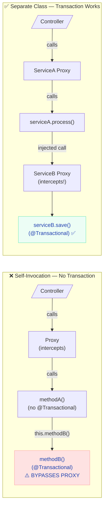
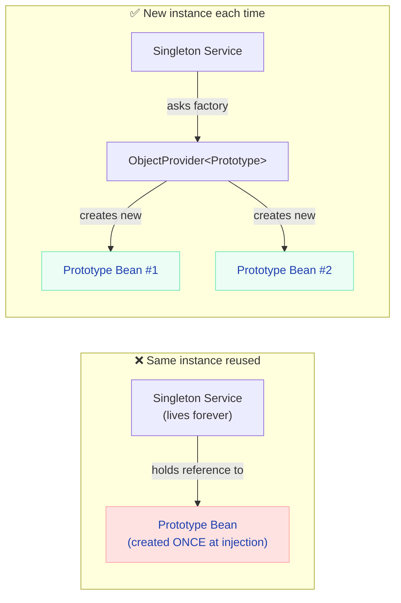

# Common Pitfalls & Debugging Guide

> **The bugs that burn hours in production — know them before they burn you.**

---

!!! abstract "Real-World Analogy"
    Think of these pitfalls like **hidden potholes on a highway**. The road looks smooth, your tests pass, and everything works in dev. But under production load or specific timing conditions, your car hits a pothole and the wheel comes off. This guide is your pothole map.

---

## @Transactional Gotchas

The #1 source of subtle bugs in Spring Boot applications.

### Pitfall 1: Self-Invocation (The Proxy Bypass)



```java
// ❌ WRONG — transaction never starts
@Service
public class OrderService {
    public void processOrder(Order order) {
        validate(order);
        saveOrder(order);  // this.saveOrder() — bypasses proxy!
    }

    @Transactional
    public void saveOrder(Order order) {
        orderRepository.save(order);
        paymentRepository.charge(order);  // NOT in a transaction!
    }
}
```

```java
// ✅ CORRECT — extract to separate bean
@Service
@RequiredArgsConstructor
public class OrderService {
    private final OrderPersistenceService persistenceService;

    public void processOrder(Order order) {
        validate(order);
        persistenceService.saveOrder(order);  // goes through proxy
    }
}

@Service
public class OrderPersistenceService {
    @Transactional
    public void saveOrder(Order order) {
        orderRepository.save(order);
        paymentRepository.charge(order);  // IN a transaction ✅
    }
}
```

### Pitfall 2: Checked Exceptions Don't Trigger Rollback

```java
// ❌ WRONG — transaction commits despite exception!
@Transactional
public void transferMoney(Long from, Long to, BigDecimal amount) throws InsufficientFundsException {
    accountRepository.debit(from, amount);
    if (getBalance(from).compareTo(BigDecimal.ZERO) < 0) {
        throw new InsufficientFundsException();  // Checked exception — NO rollback!
    }
    accountRepository.credit(to, amount);
}
```

```java
// ✅ CORRECT — explicitly declare rollback for checked exceptions
@Transactional(rollbackFor = InsufficientFundsException.class)
public void transferMoney(Long from, Long to, BigDecimal amount) throws InsufficientFundsException {
    // now rolls back on InsufficientFundsException
}

// OR better — use unchecked exceptions for business logic errors
@Transactional
public void transferMoney(Long from, Long to, BigDecimal amount) {
    // ...
    throw new InsufficientFundsRuntimeException();  // RuntimeException — auto rollback ✅
}
```

!!! danger "The Default Rollback Rule"
    Spring only auto-rolls back on **unchecked exceptions** (`RuntimeException` and `Error`). Checked exceptions COMMIT the transaction by default. This catches almost everyone at least once.

### Pitfall 3: Wrong Propagation Level

| Propagation | Behavior | Common Mistake |
|-------------|----------|---------------|
| `REQUIRED` (default) | Join existing TX or create new | Assumes a new TX is always created |
| `REQUIRES_NEW` | Always create new, suspend existing | Nested rollback doesn't affect outer |
| `SUPPORTS` | Use existing TX if present, else non-TX | Data inconsistency in mixed contexts |
| `NOT_SUPPORTED` | Suspend TX and run non-transactional | Reads stale data |

---

## N+1 Query Problem

### The Problem

```java
// Entity
@Entity
public class Author {
    @OneToMany(mappedBy = "author", fetch = FetchType.LAZY)
    private List<Book> books;
}

// Service — looks innocent
public List<AuthorDTO> getAllAuthors() {
    List<Author> authors = authorRepository.findAll();  // 1 query
    return authors.stream()
        .map(a -> new AuthorDTO(a.getName(), a.getBooks().size()))  // N queries!
        .toList();
}
```

**Generated SQL (for 100 authors):**
```sql
SELECT * FROM author;                          -- 1 query
SELECT * FROM book WHERE author_id = 1;        -- query 2
SELECT * FROM book WHERE author_id = 2;        -- query 3
...
SELECT * FROM book WHERE author_id = 100;      -- query 101
-- Total: 101 queries instead of 1-2!
```

### Detection

```yaml
# application.yml — enable Hibernate statistics
spring:
  jpa:
    properties:
      hibernate:
        generate_statistics: true
logging:
  level:
    org.hibernate.stat: DEBUG
    org.hibernate.SQL: DEBUG
```

### Solutions

```java
// Solution 1: JOIN FETCH in JPQL
@Query("SELECT a FROM Author a JOIN FETCH a.books")
List<Author> findAllWithBooks();

// Solution 2: @EntityGraph
@EntityGraph(attributePaths = {"books"})
List<Author> findAll();

// Solution 3: @BatchSize on the collection (fetches in groups)
@OneToMany(mappedBy = "author")
@BatchSize(size = 50)  // fetches books for 50 authors at once
private List<Book> books;
```

| Solution | Queries Generated | Best For |
|----------|------------------|----------|
| No fix (N+1) | 101 | Never acceptable |
| `JOIN FETCH` | 1 | Known single use case |
| `@EntityGraph` | 1 | Multiple query methods need eager |
| `@BatchSize(50)` | 3 (1 + 100/50) | When you don't always need the association |

---

## Circular Dependencies

### The Problem

```java
@Service
public class OrderService {
    @Autowired private PaymentService paymentService;  // needs PaymentService
}

@Service
public class PaymentService {
    @Autowired private OrderService orderService;  // needs OrderService — circular!
}
```

!!! warning "Spring Boot 3.x Behavior"
    Since Spring Boot 2.6+, circular dependencies cause startup failure by default:
    ```
    The dependencies of some of the beans form a cycle:
    orderService → paymentService → orderService
    ```
    You can re-enable the old behavior with `spring.main.allow-circular-references=true`, but **don't** — fix the design.

### Solutions (Best to Worst)

```java
// ✅ BEST: Redesign — extract shared logic
@Service
public class OrderService {
    private final OrderPaymentCoordinator coordinator;
}

@Service
public class PaymentService {
    private final OrderPaymentCoordinator coordinator;
}

@Service
public class OrderPaymentCoordinator {
    // shared logic that both needed from each other
}
```

```java
// ⚠️ OK: Use @Lazy to break the cycle
@Service
public class OrderService {
    @Autowired @Lazy private PaymentService paymentService;
}
```

```java
// ⚠️ OK: Use ObjectProvider for lazy resolution
@Service
public class OrderService {
    private final ObjectProvider<PaymentService> paymentProvider;

    public void process() {
        paymentProvider.getObject().charge(...);  // resolved at call time
    }
}
```

---

## Bean Scope Bugs

### Pitfall: Injecting Prototype into Singleton



```java
// ❌ WRONG — prototype acts like singleton
@Service  // singleton by default
public class ReportService {
    @Autowired
    private ReportGenerator generator;  // injected ONCE, same instance always used

    public Report generate() {
        return generator.build();  // stale state from previous call!
    }
}

@Component
@Scope("prototype")
public class ReportGenerator {
    private List<String> data = new ArrayList<>();  // accumulates across calls!
}
```

```java
// ✅ CORRECT — use ObjectProvider
@Service
public class ReportService {
    private final ObjectProvider<ReportGenerator> generatorProvider;

    public Report generate() {
        ReportGenerator generator = generatorProvider.getObject();  // new instance!
        return generator.build();
    }
}
```

---

## Memory Leaks in Production

### ThreadLocal Not Cleaned in Pooled Threads

```java
// ❌ DANGEROUS — ThreadLocal leaks in Tomcat thread pool
public class RequestContext {
    private static final ThreadLocal<UserInfo> context = new ThreadLocal<>();

    public static void set(UserInfo user) { context.set(user); }
    public static UserInfo get() { return context.get(); }
    // Missing: public static void clear() { context.remove(); }
}
```

Tomcat reuses threads. If you set a ThreadLocal and never clear it, the next request on that thread sees the previous user's data — a **security vulnerability** AND a memory leak.

```java
// ✅ CORRECT — always clear in a filter/interceptor
@Component
public class RequestContextFilter extends OncePerRequestFilter {
    @Override
    protected void doFilterInternal(HttpServletRequest req, HttpServletResponse res,
                                     FilterChain chain) throws ServletException, IOException {
        try {
            RequestContext.set(extractUser(req));
            chain.doFilter(req, res);
        } finally {
            RequestContext.clear();  // ALWAYS in finally block
        }
    }
}
```

### Connection Pool Exhaustion

```yaml
# Symptom: application hangs, requests timeout
# Cause: connections borrowed but never returned (missing @Transactional close, or long-running query)

spring:
  datasource:
    hikari:
      maximum-pool-size: 10
      connection-timeout: 30000   # fail fast after 30s if no connection available
      leak-detection-threshold: 60000  # log warning if connection held > 60s
```

!!! tip "Leak Detection"
    Set `leak-detection-threshold` to slightly above your longest expected query time. HikariCP will log a stack trace showing WHERE the connection was borrowed but never returned.

---

## Lazy Initialization Traps

### LazyInitializationException

```java
// ❌ Accessing lazy collection outside the Hibernate session
@GetMapping("/authors/{id}")
public AuthorDTO getAuthor(@PathVariable Long id) {
    Author author = authorService.findById(id);  // session closes here
    return new AuthorDTO(
        author.getName(),
        author.getBooks().size()  // 💥 LazyInitializationException!
    );
}
```

```java
// ✅ Solution 1: Fetch eagerly in the query
@Query("SELECT a FROM Author a JOIN FETCH a.books WHERE a.id = :id")
Optional<Author> findByIdWithBooks(@Param("id") Long id);

// ✅ Solution 2: Use DTO projection in the query
@Query("SELECT new com.example.AuthorDTO(a.name, SIZE(a.books)) FROM Author a WHERE a.id = :id")
Optional<AuthorDTO> findAuthorDTOById(@Param("id") Long id);
```

!!! danger "Don't Use open-in-view"
    `spring.jpa.open-in-view=true` (the default!) keeps the Hibernate session open through the entire request, masking `LazyInitializationException`. This leads to N+1 queries firing in the controller layer without you noticing. Always set it to `false` in production.

---

## Auto-Configuration Conflicts

### Multiple DataSource Configuration

```java
// ❌ Problem: Spring doesn't know which DataSource to auto-configure
@Configuration
public class DatabaseConfig {
    @Bean
    public DataSource primaryDataSource() { ... }

    @Bean
    public DataSource reportingDataSource() { ... }
    // Startup error: expected single matching bean but found 2
}
```

```java
// ✅ Solution: Mark one as @Primary
@Configuration
public class DatabaseConfig {
    @Bean
    @Primary  // auto-configuration will use this one
    public DataSource primaryDataSource() { ... }

    @Bean
    @Qualifier("reporting")
    public DataSource reportingDataSource() { ... }
}
```

---

## Debugging Toolkit

### Quick Reference Commands

```bash
# See all auto-configuration decisions
java -jar myapp.jar --debug

# See all registered beans
curl http://localhost:8080/actuator/beans | jq '.contexts[].beans | keys[]'

# See all conditions evaluated
curl http://localhost:8080/actuator/conditions | jq '.contexts[].positiveMatches'

# Heap dump (when you suspect memory leak)
jcmd <PID> GC.heap_dump /tmp/heapdump.hprof

# Thread dump (when you suspect deadlock or pool exhaustion)
jcmd <PID> Thread.print

# Remote debugging
java -agentlib:jdwp=transport=dt_socket,server=y,suspend=n,address=*:5005 -jar myapp.jar
```

### Actuator Endpoints for Debugging

| Endpoint | What It Shows |
|----------|--------------|
| `/actuator/health` | Component health (DB, disk, custom) |
| `/actuator/beans` | All beans and their dependencies |
| `/actuator/conditions` | Auto-config positive/negative matches |
| `/actuator/env` | All properties and their sources |
| `/actuator/metrics` | Micrometer metrics (request count, timings) |
| `/actuator/threaddump` | Live thread dump |
| `/actuator/heapdump` | Downloads heap dump (⚠️ large!) |
| `/actuator/mappings` | All HTTP endpoints and their handlers |

---

## Quick Reference: Symptom → Pitfall → Fix

| Symptom | Likely Pitfall | Fix |
|---------|---------------|-----|
| Data not saved / partial commit | @Transactional self-invocation | Extract to separate bean |
| Checked exception but no rollback | Default rollback rule | Add `rollbackFor = Exception.class` |
| Startup fails with circular reference | Circular dependency | Redesign or use @Lazy |
| Entity fields are null after save | Prototype injected into singleton | Use `ObjectProvider<T>` |
| `LazyInitializationException` | Session closed before access | JOIN FETCH or DTO projection |
| Application hangs under load | Connection pool exhausted | Check leak-detection, fix missing close |
| Wrong user data on request | ThreadLocal not cleared | Always clear in finally block |
| 100x more SQL than expected | N+1 query problem | JOIN FETCH, @EntityGraph, @BatchSize |
| Bean not found at runtime | Auto-config condition failed | Run with `--debug`, check conditions |
| `@Transactional` on final method | CGLIB can't proxy final | Remove `final` keyword |
| Startup slow (30s+) | Too many beans loaded eagerly | Lazy init or profile-based exclusion |
