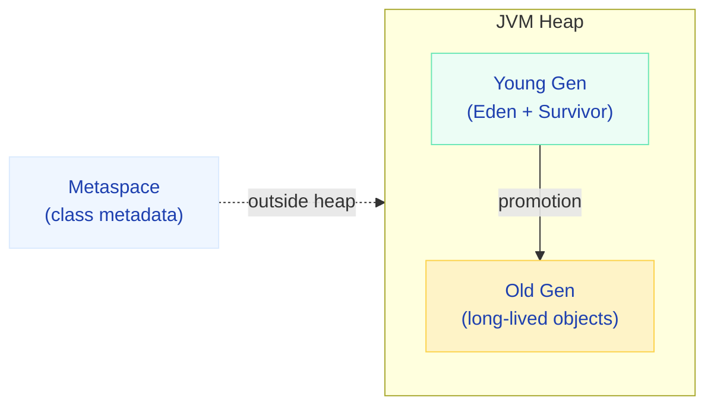
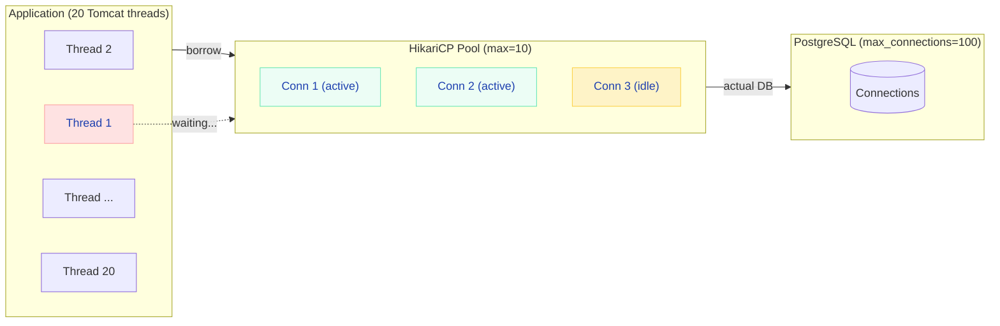
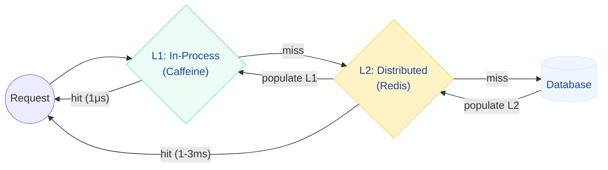
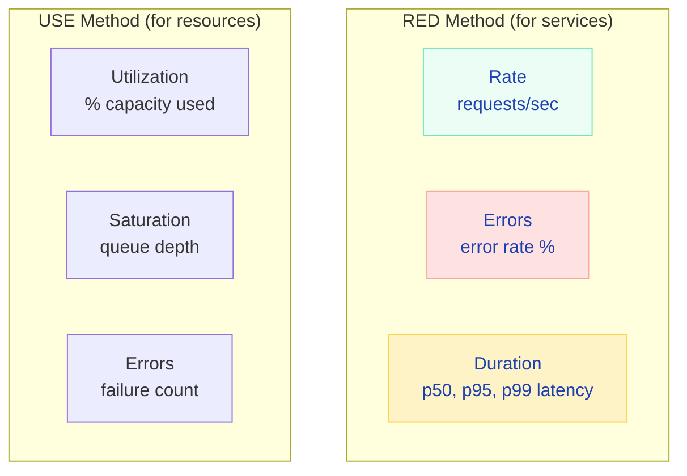

# Production Performance Tuning

> **The difference between "works in dev" and "survives Black Friday" — real numbers, real formulas, real configs.**

---

!!! abstract "Real-World Analogy"
    Tuning a production Spring Boot app is like **tuning a race car**. The engine (JVM) needs the right fuel mixture (heap size), the transmission (thread pool) needs proper gear ratios for the track (workload type), the cooling system (GC) must prevent overheating under sustained load, and the tires (connection pool) must match road conditions. Tuning one component without understanding the others makes things worse.

---

## JVM Tuning for Spring Boot

### Heap Sizing



| Setting | Recommendation | Why |
|---------|---------------|-----|
| `-Xms` = `-Xmx` | Set both equal | Avoids heap resize pauses (costly GC during growth) |
| Heap size | 50-75% of container memory | Leave room for metaspace, thread stacks, native memory, OS |
| Container 2GB | `-Xmx1400m` | Leaves ~600MB for non-heap |
| Container 4GB | `-Xmx3g` | Sweet spot for most microservices |

!!! danger "Container Memory Kills"
    If JVM uses more memory than the container limit, Kubernetes OOMKills the pod — no graceful shutdown, no heap dump, just gone. Always leave 25-30% headroom.

```bash
# Container-aware JVM settings (Java 17+)
java -XX:+UseContainerSupport \
     -XX:MaxRAMPercentage=75.0 \
     -XX:InitialRAMPercentage=75.0 \
     -XX:+UseG1GC \
     -jar app.jar
```

### GC Algorithm Selection

| GC Algorithm | Latency (p99) | Throughput | Heap Range | Best For |
|-------------|---------------|------------|------------|----------|
| **G1GC** | 50-200ms pauses | Good | 2-8GB | General purpose APIs (default) |
| **ZGC** | <1ms pauses | Slightly lower | 8GB-16TB | Low-latency (trading, real-time) |
| **Shenandoah** | <10ms pauses | Good | 2-16GB | Similar to ZGC, RedHat JDKs |
| **Parallel GC** | 200-500ms pauses | Highest | 2-8GB | Batch jobs, throughput-critical |

```bash
# For a typical REST API microservice (G1GC with tuning)
java -XX:+UseG1GC \
     -XX:MaxGCPauseMillis=100 \
     -XX:G1HeapRegionSize=16m \
     -XX:+ParallelRefProcEnabled \
     -Xmx3g -Xms3g \
     -jar app.jar

# For low-latency service (ZGC — Java 21+)
java -XX:+UseZGC \
     -XX:+ZGenerational \
     -Xmx4g -Xms4g \
     -jar app.jar
```

!!! tip "Rule of Thumb"
    If your p99 latency SLA is <50ms → use ZGC. If it's <200ms → G1GC is fine. If you're running batch jobs → Parallel GC gives best throughput.

---

## Connection Pool Tuning (HikariCP)

### The Golden Formula

!!! info "Pool Size Formula"
    ```
    pool_size = (core_count * 2) + effective_spindle_count
    ```
    For SSDs (spindle_count = 0): a 4-core machine needs a pool of **~10** connections.  
    For most microservices: **10-20 connections** is the sweet spot.



### Production Configuration

```yaml
spring:
  datasource:
    hikari:
      # Pool sizing
      maximum-pool-size: 10          # max connections in pool
      minimum-idle: 5                # keep 5 ready connections
      # Timeouts
      connection-timeout: 30000      # fail fast if no connection in 30s
      idle-timeout: 600000           # close idle connections after 10min
      max-lifetime: 1800000          # recycle connections every 30min
      # Leak detection
      leak-detection-threshold: 60000  # warn if held > 60s
      # Validation
      connection-test-query: SELECT 1
      validation-timeout: 5000
```

!!! warning "The Biggest Mistake: Pool Too Large"
    **More connections ≠ more performance.** Each PostgreSQL connection costs ~10MB of RAM. 100 connections across 10 pods = 1000 connections, potentially exhausting the database's `max_connections`. Keep pools small and let threads queue.

### Pool Sizing by Workload

| Workload | Pool Size | Reasoning |
|----------|-----------|-----------|
| Simple CRUD API | 5-10 | Quick queries, low contention |
| Report generation | 3-5 | Long queries, fewer concurrent |
| Mixed (API + batch) | 10-15 | Separate pools recommended |
| High-throughput event processor | 15-20 | Many concurrent writes |

---

## Thread Pool Configuration

### Tomcat Thread Pool

```yaml
server:
  tomcat:
    threads:
      max: 200         # max worker threads (default: 200)
      min-spare: 25    # keep 25 threads ready
    max-connections: 8192  # max TCP connections queued
    accept-count: 100      # OS-level backlog queue
    connection-timeout: 20000  # close idle connections after 20s
```

### Sizing Formula

```
Optimal threads = Number of CPUs * Target CPU utilization * (1 + Wait time / Service time)
```

| Workload Type | Wait/Service Ratio | Formula (4 cores) | Threads |
|--------------|-------------------|-------------------|---------|
| CPU-bound (computation) | 0 | 4 * 1.0 * (1 + 0) | 4-8 |
| Balanced (typical API) | 1 | 4 * 0.8 * (1 + 1) | ~6-12 |
| I/O-bound (DB calls) | 5-10 | 4 * 0.8 * (1 + 5) | ~20-50 |
| Highly I/O-bound (external APIs) | 10-50 | 4 * 0.8 * (1 + 20) | ~70-200 |

### Virtual Threads (Java 21+ / Spring Boot 3.2+)

```yaml
# Enable virtual threads — replaces Tomcat thread pool with virtual threads
spring:
  threads:
    virtual:
      enabled: true
```

```java
// Before: @Async with bounded thread pool
@Async("taskExecutor")
public CompletableFuture<Result> processAsync() { ... }

// After: Virtual threads — unbounded, lightweight, cheap to create
// No pool sizing needed — each request gets its own virtual thread
```

!!! tip "When to Use Virtual Threads"
    **Use when:** Your workload is I/O-bound (HTTP calls, database queries, file I/O). Virtual threads shine because blocking is cheap.  
    **Avoid when:** Your workload is CPU-bound (encryption, compression, computation). Virtual threads won't help here — you're limited by cores.

---

## Startup Time Optimization

### Benchmark Comparison

| Optimization | Startup Time | Memory | Trade-off |
|-------------|-------------|--------|-----------|
| Default Spring Boot | 3-8s | ~250MB | None |
| + Lazy initialization | 1.5-4s | ~200MB | First request slower |
| + Class Data Sharing (CDS) | 2-5s | ~220MB | Requires warmup step |
| + AppCDS | 1.5-3s | ~180MB | Rebuild on dependency change |
| + Spring AOT (ahead-of-time) | 1-3s | ~180MB | Less dynamic features |
| GraalVM Native Image | 0.05-0.5s | ~50-80MB | Longer build, limited reflection |

### Configuration

```yaml
# Lazy initialization — beans created on first use
spring:
  main:
    lazy-initialization: true

# Exclude auto-configurations you don't need
  autoconfigure:
    exclude:
      - org.springframework.boot.autoconfigure.mail.MailSenderAutoConfiguration
      - org.springframework.boot.autoconfigure.quartz.QuartzAutoConfiguration
```

```bash
# Class Data Sharing (CDS) — dump class list, then use archive
# Step 1: Generate class list
java -XX:DumpLoadedClassList=classes.lst -jar app.jar &
# Wait for startup, then kill

# Step 2: Create shared archive
java -Xshare:dump -XX:SharedClassListFile=classes.lst \
     -XX:SharedArchiveFile=app-cds.jsa -jar app.jar

# Step 3: Use archive on startup
java -Xshare:on -XX:SharedArchiveFile=app-cds.jsa -jar app.jar
```

---

## Caching Strategy

### Multi-Layer Cache Architecture



### Caffeine Configuration (L1)

```yaml
spring:
  cache:
    type: caffeine
    caffeine:
      spec: maximumSize=10000,expireAfterWrite=5m,recordStats
```

```java
@Configuration
@EnableCaching
public class CacheConfig {

    @Bean
    public CacheManager cacheManager() {
        CaffeineCacheManager manager = new CaffeineCacheManager();
        manager.setCaffeine(Caffeine.newBuilder()
            .maximumSize(10_000)
            .expireAfterWrite(Duration.ofMinutes(5))
            .recordStats());  // exposes hit/miss metrics
        return manager;
    }
}
```

### When NOT to Cache

| Scenario | Why |
|----------|-----|
| Frequently updated data (< 5s) | Cache invalidation complexity exceeds benefit |
| User-specific data with high cardinality | Cache fills with millions of entries, low hit rate |
| Data that MUST be real-time (stock prices) | Stale data = wrong business decisions |
| Large objects (> 1MB per entry) | Eats heap space, causes GC pressure |

---

## HTTP & Network Optimization

### WebClient vs RestTemplate

```java
// ✅ WebClient with connection pooling (non-blocking)
@Bean
public WebClient webClient() {
    HttpClient httpClient = HttpClient.create()
        .option(ChannelOption.CONNECT_TIMEOUT_MILLIS, 5000)
        .responseTimeout(Duration.ofSeconds(10))
        .doOnConnected(conn -> conn
            .addHandlerLast(new ReadTimeoutHandler(10))
            .addHandlerLast(new WriteTimeoutHandler(5)));

    return WebClient.builder()
        .clientConnector(new ReactorClientHttpConnector(httpClient))
        .build();
}
```

### Response Compression

```yaml
server:
  compression:
    enabled: true
    mime-types: application/json,application/xml,text/html,text/plain
    min-response-size: 1024  # only compress responses > 1KB
```

### HTTP/2

```yaml
server:
  http2:
    enabled: true  # multiplexing, header compression, server push
```

---

## Monitoring & Alerting

### Key Metrics to Watch



### Alert Thresholds That Matter

| Metric | Warning | Critical | Action |
|--------|---------|----------|--------|
| p99 latency | > 500ms | > 2s | Check DB, downstream services |
| Error rate | > 1% | > 5% | Check logs, recent deployments |
| CPU utilization | > 70% | > 90% | Scale horizontally |
| Heap utilization | > 80% | > 95% | GC tuning, memory leak hunt |
| Connection pool active | > 80% | > 95% | Increase pool or fix leaks |
| Thread pool queue depth | > 50 | > 200 | More threads or backpressure |
| GC pause time | > 200ms | > 1s | Switch to ZGC or tune G1 |

### Micrometer + Prometheus Setup

```java
// Custom business metrics
@Component
@RequiredArgsConstructor
public class OrderMetrics {
    private final MeterRegistry registry;

    public void recordOrderPlaced(String region, double amount) {
        registry.counter("orders.placed", "region", region).increment();
        registry.summary("orders.amount", "region", region).record(amount);
    }

    public void recordOrderLatency(String operation, Duration duration) {
        registry.timer("orders.latency", "operation", operation)
                .record(duration);
    }
}
```

---

## Production Checklist

| Category | Setting | Recommended | Why |
|----------|---------|-------------|-----|
| **JVM** | Heap size | 50-75% container RAM | Avoid OOMKill |
| **JVM** | GC algorithm | G1GC (general) / ZGC (low-latency) | Latency requirements |
| **JVM** | `-Xms` = `-Xmx` | Yes | No resize pauses |
| **Pool** | HikariCP `maximum-pool-size` | 10-20 | More connections ≠ more perf |
| **Pool** | `leak-detection-threshold` | 60s | Catch connection leaks early |
| **Threads** | Tomcat `max-threads` | 200 (I/O) / CPU*2 (compute) | Match workload type |
| **Threads** | Virtual Threads (Java 21+) | Enable for I/O | Removes thread pool sizing |
| **Cache** | L1 (Caffeine) | 5min TTL, 10K entries | Reduce DB calls |
| **Network** | Compression | Enable for JSON > 1KB | 60-80% smaller responses |
| **Network** | HTTP/2 | Enable | Multiplexing, less overhead |
| **Startup** | Lazy init | Enable in containers | Faster pod scaling |
| **Monitoring** | Actuator + Prometheus | Expose `/metrics` | Know before users complain |
| **Resilience** | Graceful shutdown | `server.shutdown=graceful` | Drain in-flight requests |
| **Security** | Actuator endpoints | Secure with Spring Security | Don't expose `/heapdump` publicly |
| **Logging** | Log level | WARN in prod, DEBUG via env | Reduce I/O overhead |
| **JPA** | `open-in-view` | **false** | Prevent N+1 in controllers |
| **JPA** | Show SQL | **false** in prod | Logging overhead |
