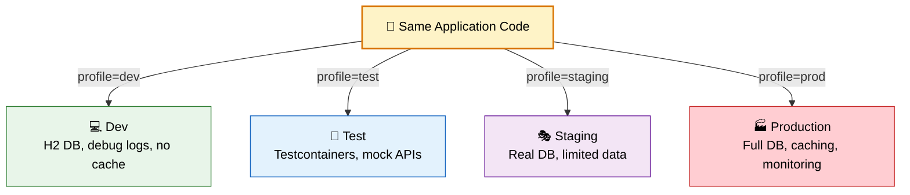
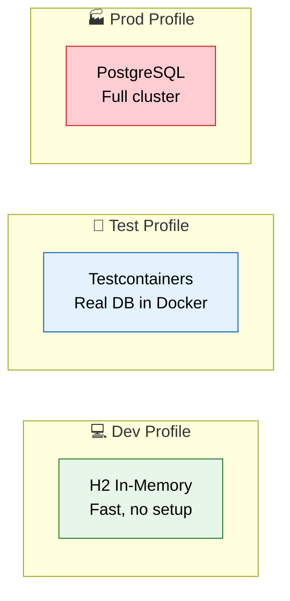

# 🎭 Spring Profiles

> **Run different configurations for different environments — dev, test, staging, production — without changing code.**

---

!!! abstract "Real-World Analogy"
    Think of a **TV remote with modes**. Same TV, but "Movie Mode" dims lights and boosts bass, "Game Mode" reduces lag, "Night Mode" lowers volume. Spring Profiles work the same way — same application, different behavior based on which "mode" (profile) is active.



---

## 🏗️ How Profiles Work

### Profile-Specific Property Files

```
src/main/resources/
├── application.yml              ← always loaded (defaults)
├── application-dev.yml          ← loaded when profile = dev
├── application-test.yml         ← loaded when profile = test
├── application-prod.yml         ← loaded when profile = prod
```

Profile-specific files **override** values in the base `application.yml`.

### Example Configuration

=== "application.yml (base)"

    ```yaml
    spring:
      application:
        name: order-service
    server:
      port: 8080
    ```

=== "application-dev.yml"

    ```yaml
    spring:
      datasource:
        url: jdbc:h2:mem:devdb
        driver-class-name: org.h2.Driver
      jpa:
        show-sql: true
        hibernate:
          ddl-auto: create-drop
    logging:
      level:
        root: DEBUG
        com.example: TRACE
    ```

=== "application-prod.yml"

    ```yaml
    spring:
      datasource:
        url: jdbc:postgresql://prod-db:5432/orders
        username: ${DB_USERNAME}
        password: ${DB_PASSWORD}
      jpa:
        show-sql: false
        hibernate:
          ddl-auto: validate
    logging:
      level:
        root: WARN
        com.example: INFO
    ```

---

## 🚀 Activating Profiles

| Method | Example | Priority |
|--------|---------|----------|
| **Environment variable** | `SPRING_PROFILES_ACTIVE=prod` | High |
| **Command line** | `java -jar app.jar --spring.profiles.active=prod` | High |
| **application.yml** | `spring.profiles.active: dev` | Low |
| **Docker / K8s** | `env: SPRING_PROFILES_ACTIVE: prod` | High |
| **Programmatic** | `SpringApplication.setAdditionalProfiles("dev")` | Medium |

!!! tip "Best Practice"
    Never set `spring.profiles.active` in `application.yml` for production. Use environment variables or command-line args so the same JAR works everywhere.

---

## 🎯 @Profile Annotation

Conditionally register beans based on active profile:

```java
// Only available in 'dev' profile
@Configuration
@Profile("dev")
public class DevConfig {

    @Bean
    public DataSource dataSource() {
        return new EmbeddedDatabaseBuilder()
            .setType(EmbeddedDatabaseType.H2)
            .build();
    }
}

// Only in production
@Configuration
@Profile("prod")
public class ProdConfig {

    @Bean
    public DataSource dataSource() {
        HikariDataSource ds = new HikariDataSource();
        ds.setJdbcUrl("jdbc:postgresql://prod-db:5432/orders");
        ds.setMaximumPoolSize(20);
        return ds;
    }
}
```

### Negation and Combination

```java
@Profile("!prod")          // Active in any profile EXCEPT prod
@Profile({"dev", "test"})  // Active in dev OR test
```

---

## 🔀 Profile Groups (Spring Boot 2.4+)

Combine multiple profiles under one name:

```yaml
spring:
  profiles:
    group:
      production:
        - prod
        - monitoring
        - caching
      development:
        - dev
        - debug
        - swagger
```

Now `--spring.profiles.active=production` activates `prod`, `monitoring`, AND `caching`.

---

## 📐 Common Profile Patterns

### Pattern 1: Different Databases



### Pattern 2: Feature Flags via Profiles

```java
@Service
@Profile("cache-enabled")
public class RedisCacheService implements CacheService { ... }

@Service
@Profile("!cache-enabled")
public class NoOpCacheService implements CacheService { ... }
```

### Pattern 3: External Services (Mock vs Real)

```java
@Service
@Profile("dev")
public class MockPaymentGateway implements PaymentGateway {
    public PaymentResult charge(BigDecimal amount) {
        return PaymentResult.success("MOCK-TXN-" + UUID.randomUUID());
    }
}

@Service
@Profile("prod")
public class StripePaymentGateway implements PaymentGateway {
    public PaymentResult charge(BigDecimal amount) {
        // Real Stripe API call
    }
}
```

---

## ⚠️ Profile Pitfalls

!!! warning "Common Mistakes"
    - **Too many profiles**: Don't create profiles for every minor variation. Use properties instead.
    - **Profile-specific logic in code**: Avoid `if (profile == "prod")` in service code. Use `@Profile` on beans.
    - **Forgetting defaults**: Always have sensible defaults in `application.yml` so the app runs even without a profile.
    - **Secrets in profile files**: Never commit `application-prod.yml` with real passwords. Use environment variables or a secrets manager.

---

## 🎯 Interview Questions

??? question "1. What are Spring Profiles used for?"
    Spring Profiles allow you to define different configurations for different environments (dev, test, prod) using the same codebase. You can activate profile-specific property files and conditionally register beans with `@Profile`.

??? question "2. How do you activate a profile?"
    Multiple ways: environment variable (`SPRING_PROFILES_ACTIVE=prod`), command-line arg (`--spring.profiles.active=prod`), in `application.yml`, or programmatically. Environment variables and command-line have highest priority.

??? question "3. What happens when multiple profiles are active?"
    All profile-specific property files are loaded. If there's a conflict (same key in multiple profiles), the last profile listed wins. Base `application.yml` is always loaded first, then profiles override it.

??? question "4. How does @Profile annotation work?"
    It marks a bean or configuration class to only be registered when a specific profile is active. Supports negation (`@Profile("!prod")`), and multiple profiles (`@Profile({"dev", "test"})`).

??? question "5. What are profile groups?"
    Introduced in Spring Boot 2.4+, profile groups let you activate multiple profiles with a single name. For example, activating "production" can automatically enable "prod", "monitoring", and "caching" profiles.

