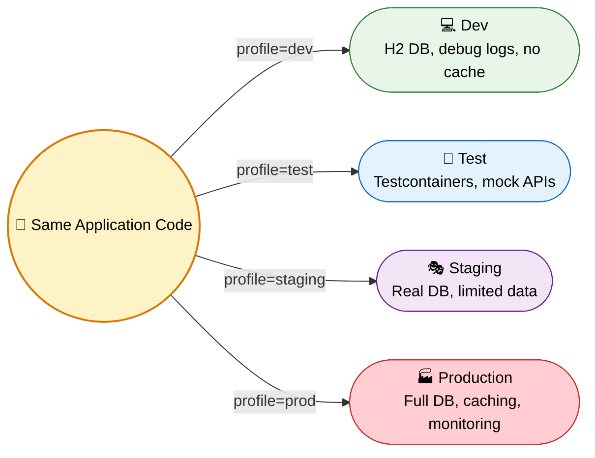
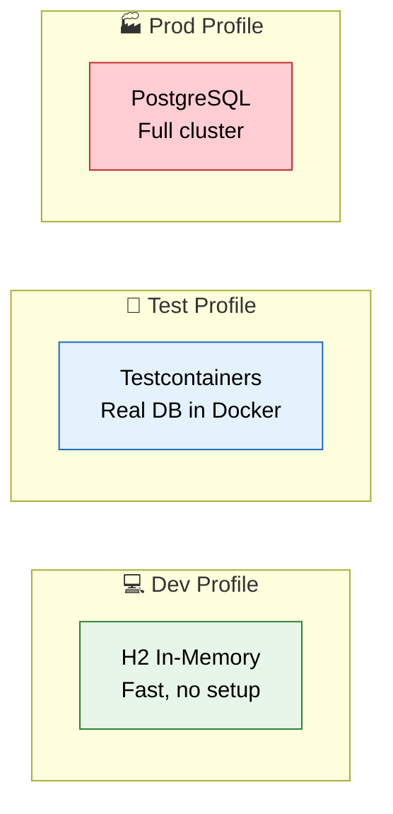

# Spring Profiles

> Configure once, deploy anywhere. Profiles let one JAR behave differently across dev, test, staging, and production without code changes.

---

## Core Concept

A profile is a named logical grouping of configuration. Spring activates beans and loads property sources based on which profiles are active at runtime.



---

## Profile-Specific Configuration Files

```
src/main/resources/
├── application.yml              ← always loaded (defaults)
├── application-dev.yml          ← loaded when profile = dev
├── application-test.yml         ← loaded when profile = test
├── application-prod.yml         ← loaded when profile = prod
```

Profile-specific files **override** matching keys in base `application.yml`. Non-conflicting keys **merge**.

=== "application.yml (base)"

    ```yaml
    spring:
      application:
        name: order-service
    server:
      port: 8080
    app:
      retry:
        max-attempts: 3
    ```

=== "application-dev.yml"

    ```yaml
    spring:
      datasource:
        url: jdbc:h2:mem:devdb
        driver-class-name: org.h2.Driver
      jpa:
        show-sql: true
        hibernate:
          ddl-auto: create-drop
    logging:
      level:
        root: DEBUG
        com.example: TRACE
    ```

=== "application-prod.yml"

    ```yaml
    spring:
      datasource:
        url: jdbc:postgresql://prod-db:5432/orders
        username: ${DB_USERNAME}
        password: ${DB_PASSWORD}
      jpa:
        show-sql: false
        hibernate:
          ddl-auto: validate
    logging:
      level:
        root: WARN
        com.example: INFO
    ```

---

## Multi-Document YAML

Since Spring Boot 2.4, a single `application.yml` can contain multiple documents separated by `---`. Each document activates conditionally.

```yaml
# Default (always applied)
spring:
  application:
    name: order-service
server:
  port: 8080
---
# Activated only when profile = dev
spring:
  config:
    activate:
      on-profile: dev
  datasource:
    url: jdbc:h2:mem:devdb
logging:
  level:
    root: DEBUG
---
# Activated only when profile = prod
spring:
  config:
    activate:
      on-profile: prod
  datasource:
    url: jdbc:postgresql://prod-db:5432/orders
logging:
  level:
    root: WARN
```

The key is `spring.config.activate.on-profile`. Documents without it apply unconditionally.

---

## Activating Profiles

### Via application.yml

```yaml
spring:
  profiles:
    active: dev
```

### Via Command Line

```bash
java -jar app.jar --spring.profiles.active=prod
```

### Via Environment Variable

```bash
export SPRING_PROFILES_ACTIVE=prod
java -jar app.jar
```

### Via JVM System Property

```bash
java -Dspring.profiles.active=prod -jar app.jar
```

### Programmatic Activation

```java
@SpringBootApplication
public class OrderServiceApplication {
    public static void main(String[] args) {
        SpringApplication app = new SpringApplication(OrderServiceApplication.class);
        app.setAdditionalProfiles("metrics", "swagger");
        app.run(args);
    }
}
```

### Activation Priority

| Method | Priority |
|--------|----------|
| Command-line arg (`--spring.profiles.active`) | Highest |
| JVM system property (`-Dspring.profiles.active`) | High |
| Environment variable (`SPRING_PROFILES_ACTIVE`) | High |
| `application.yml` (`spring.profiles.active`) | Low |
| Programmatic (`setAdditionalProfiles`) | Additive (does not override) |

---

## Default Profile

If no profile is explicitly active, Spring uses the `default` profile.

```yaml
spring:
  profiles:
    default: dev
```

This means `application-dev.yml` loads when nothing else is specified. Once you explicitly activate any profile, the `default` profile is deactivated.

You can target the default profile with `@Profile("default")`.

---

## Profile Groups (Spring Boot 2.4+)

Activate multiple sub-profiles with a single name.

```yaml
spring:
  profiles:
    group:
      production:
        - proddb
        - prodmq
        - monitoring
      development:
        - dev
        - debug
        - swagger
```

Command: `--spring.profiles.active=production` activates `proddb`, `prodmq`, and `monitoring` together.

---

## Profile Expressions

Spring Framework 5.1+ supports logical operators in `@Profile`.

| Operator | Meaning | Example |
|----------|---------|---------|
| `!` | NOT | `@Profile("!prod")` |
| `&` | AND | `@Profile("cloud & eu")` |
| `\|` | OR | `@Profile("dev \| test")` |

```java
@Configuration
@Profile("cloud & us-east")
public class UsEastCloudConfig { }

@Component
@Profile("!prod & !staging")
public class DevToolsInitializer { }
```

Parentheses are supported: `@Profile("(dev | test) & metrics")`.

---

## @Profile on @Configuration

The annotation on a `@Configuration` class gates all `@Bean` methods inside it.

```java
@Configuration
@Profile("dev")
public class DevConfig {

    @Bean
    public DataSource dataSource() {
        return new EmbeddedDatabaseBuilder()
            .setType(EmbeddedDatabaseType.H2)
            .build();
    }

    @Bean
    public CacheManager cacheManager() {
        return new NoOpCacheManager();
    }
}
```

When `dev` is not active, neither `dataSource` nor `cacheManager` are created.

---

## @Profile on @Bean

You can mix profiles within a single `@Configuration`.

```java
@Configuration
public class DataSourceConfig {

    @Bean
    @Profile("dev")
    public DataSource devDataSource() {
        return new EmbeddedDatabaseBuilder()
            .setType(EmbeddedDatabaseType.H2)
            .build();
    }

    @Bean
    @Profile("test")
    public DataSource testDataSource() {
        // Testcontainers PostgreSQL
        PostgreSQLContainer<?> pg = new PostgreSQLContainer<>("postgres:15");
        pg.start();
        HikariDataSource ds = new HikariDataSource();
        ds.setJdbcUrl(pg.getJdbcUrl());
        ds.setUsername(pg.getUsername());
        ds.setPassword(pg.getPassword());
        return ds;
    }

    @Bean
    @Profile("prod")
    public DataSource prodDataSource() {
        HikariDataSource ds = new HikariDataSource();
        ds.setJdbcUrl("jdbc:postgresql://prod-cluster:5432/orders");
        ds.setMaximumPoolSize(20);
        ds.setMinimumIdle(5);
        return ds;
    }
}
```

---

## @Profile on @Component

```java
@Component
@Profile("dev")
public class MockPaymentGateway implements PaymentGateway {
    @Override
    public PaymentResult charge(BigDecimal amount) {
        return PaymentResult.success("MOCK-TXN-" + UUID.randomUUID());
    }
}

@Component
@Profile("prod")
public class StripePaymentGateway implements PaymentGateway {
    private final StripeClient client;

    public StripePaymentGateway(StripeClient client) {
        this.client = client;
    }

    @Override
    public PaymentResult charge(BigDecimal amount) {
        return client.createCharge(amount);
    }
}
```

---

## Profile-Specific Beans: DataSource Example



Each profile provides the same `DataSource` bean type. The container picks exactly one based on active profile.

---

## Environment Abstraction

Spring's `Environment` object is the unified API for accessing properties and checking active profiles.

### Using @Value

```java
@Service
public class NotificationService {

    @Value("${app.notification.sender:noreply@example.com}")
    private String sender;

    @Value("${app.notification.enabled:true}")
    private boolean enabled;
}
```

### Using the Environment Object

```java
@Service
public class FeatureToggleService {

    private final Environment env;

    public FeatureToggleService(Environment env) {
        this.env = env;
    }

    public boolean isCacheEnabled() {
        return env.acceptsProfiles(Profiles.of("prod | staging"));
    }

    public String getDbUrl() {
        return env.getProperty("spring.datasource.url");
    }
}
```

### Using @ConfigurationProperties (Type-Safe Config)

Define a POJO bound to a prefix:

```java
@ConfigurationProperties(prefix = "app.retry")
@Validated
public class RetryProperties {

    @Min(1) @Max(10)
    private int maxAttempts = 3;

    @DurationUnit(ChronoUnit.MILLIS)
    private Duration backoff = Duration.ofMillis(500);

    private boolean exponential = true;

    // getters and setters
}
```

Enable it:

```java
@SpringBootApplication
@EnableConfigurationProperties(RetryProperties.class)
public class OrderServiceApplication { }
```

Use it:

```java
@Service
public class OrderRetryService {

    private final RetryProperties props;

    public OrderRetryService(RetryProperties props) {
        this.props = props;
    }

    public void retryOrder(Order order) {
        int attempts = props.getMaxAttempts();
        Duration wait = props.getBackoff();
        // retry logic
    }
}
```

YAML:

```yaml
app:
  retry:
    max-attempts: 5
    backoff: 1000ms
    exponential: true
```

`@Validated` triggers JSR-303 validation at startup. Misconfiguration fails fast.

---

## Configuration Precedence

From highest to lowest priority:

1. Command-line arguments (`--key=value`)
2. JVM system properties (`-Dkey=value`)
3. OS environment variables (`KEY=value`)
4. Profile-specific files (`application-{profile}.yml`)
5. Base `application.yml`
6. `@PropertySource` annotations
7. Default values (`@Value("${key:default}")`)

Higher priority sources override lower ones. Within the same priority level, later-loaded profiles override earlier ones.

---

## Fun Example: Multi-Environment Microservice

A notification microservice that behaves differently across environments:

```java
@ConfigurationProperties(prefix = "app.notification")
@Validated
public class NotificationProperties {

    @NotBlank
    private String sender;
    private boolean async = true;
    private int rateLimit = 100;

    // getters/setters
}
```

```yaml
# application.yml
app:
  notification:
    sender: noreply@orders.example.com
    async: true
    rate-limit: 100
---
spring:
  config:
    activate:
      on-profile: dev
app:
  notification:
    sender: dev@localhost
    async: false
    rate-limit: 9999
---
spring:
  config:
    activate:
      on-profile: prod
app:
  notification:
    sender: notifications@orders.example.com
    rate-limit: 50
```

```java
@Configuration
public class NotificationConfig {

    @Bean
    @Profile("dev")
    public NotificationSender devSender() {
        // Logs to console, never sends email
        return new ConsoleNotificationSender();
    }

    @Bean
    @Profile("test")
    public NotificationSender testSender() {
        // Captures messages in-memory for assertions
        return new InMemoryNotificationSender();
    }

    @Bean
    @Profile("prod")
    public NotificationSender prodSender(SesClient ses, NotificationProperties props) {
        return new AwsSesNotificationSender(ses, props);
    }
}
```

One codebase. Three behaviors. Zero `if` statements.

---

## Gotchas

!!! warning "Profile Pitfalls"

    **Override vs Merge**: Profile-specific files override matching keys only. Non-conflicting keys from `application.yml` still apply. Lists are replaced entirely, not appended.

    **@Profile on @Bean inside @Configuration**: If the outer `@Configuration` has `@Profile("dev")`, inner `@Bean` methods cannot override it. A `@Profile("prod")` bean inside a `@Profile("dev")` config is never created.

    **Missing profile = bean not created**: If you define `@Profile("payments")` on a bean and never activate `payments`, the bean does not exist. Injecting it causes `NoSuchBeanDefinitionException`.

    **Multiple active profiles conflict**: If both `dev` and `prod` profiles provide the same bean type without `@Primary`, you get `NoUniqueBeanDefinitionException`.

    **`spring.profiles.active` in application.yml**: Setting this is overridden by CLI/env. It also replaces (not appends to) the default profile.

    **Profile-specific files outside classpath**: Spring only auto-loads `application-{profile}.yml` from standard locations (`classpath:/`, `classpath:/config/`, `file:./`, `file:./config/`).

---

## Interview Questions

??? question "1. What is the purpose of Spring Profiles?"
    Profiles let you segregate configuration and bean registration by environment. A single deployable artifact behaves differently in dev, test, staging, and production based on which profile is active at runtime.

??? question "2. How do you activate a profile from the command line?"
    `java -jar app.jar --spring.profiles.active=prod`. You can also use `-Dspring.profiles.active=prod` as a JVM system property. Both override values set in `application.yml`.

??? question "3. What is the default profile?"
    When no profile is explicitly activated, Spring uses the `default` profile. You can change it with `spring.profiles.default=dev`. Activating any explicit profile deactivates `default`.

??? question "4. How do profile-specific files interact with application.yml?"
    Base `application.yml` is always loaded. Profile-specific files override matching keys. Non-matching keys merge. Lists are replaced entirely, not appended.

??? question "5. What are profile groups?"
    Introduced in Spring Boot 2.4. They map one profile name to multiple sub-profiles. `spring.profiles.group.production=proddb,prodmq` means activating `production` also activates `proddb` and `prodmq`.

??? question "6. Explain profile expressions with examples."
    `@Profile("!prod")` — active when prod is NOT active. `@Profile("cloud & eu")` — requires both. `@Profile("dev | test")` — either one. Parentheses group sub-expressions.

??? question "7. What happens if @Profile is on a @Configuration class?"
    All `@Bean` methods inside that class are gated by the profile. If the profile is inactive, none of the beans inside are registered regardless of their own annotations.

??? question "8. What is the configuration property precedence order?"
    Command line > JVM system properties > environment variables > profile-specific files > application.yml > @PropertySource > hardcoded defaults. Higher wins.

??? question "9. How does @ConfigurationProperties differ from @Value?"
    `@ConfigurationProperties` binds an entire prefix to a type-safe POJO with validation support. `@Value` injects individual properties. `@ConfigurationProperties` is preferred for structured config with multiple related keys.

??? question "10. What is multi-document YAML and how does it relate to profiles?"
    A single YAML file can contain multiple documents separated by `---`. Each document can specify `spring.config.activate.on-profile` to apply conditionally. Documents without that key apply unconditionally.

??? question "11. What happens when a profiled bean is missing?"
    If you annotate a bean with `@Profile("x")` and `x` is never activated, the bean is not created. Any `@Autowired` dependency on it throws `NoSuchBeanDefinitionException` at startup unless marked `@Autowired(required = false)`.

??? question "12. How do you test with a specific profile?"
    Use `@ActiveProfiles("test")` on test classes. This activates the profile for the test application context. Combined with `@SpringBootTest`, it loads `application-test.yml` and registers beans marked `@Profile("test")`.

??? question "13. Can you activate multiple profiles simultaneously?"
    Yes. `--spring.profiles.active=prod,metrics,cloud` activates all three. All corresponding beans and property files are loaded. Conflicts are resolved by last-wins ordering.

??? question "14. How do you provide different DataSources per profile?"
    Define multiple `@Bean` methods returning `DataSource`, each annotated with a different `@Profile`. Dev uses H2 in-memory, test uses Testcontainers, prod uses a connection-pooled PostgreSQL. Only one is instantiated per runtime.

??? question "15. What is Environment abstraction in Spring?"
    The `Environment` interface provides access to profiles and properties. It unifies property sources (files, env vars, system props) into a single queryable API. Use `env.getProperty()` to read values and `env.acceptsProfiles()` to check active profiles programmatically.
