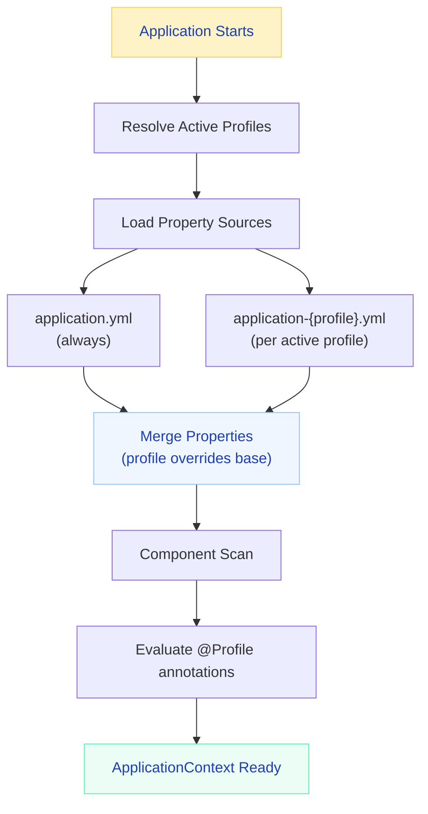
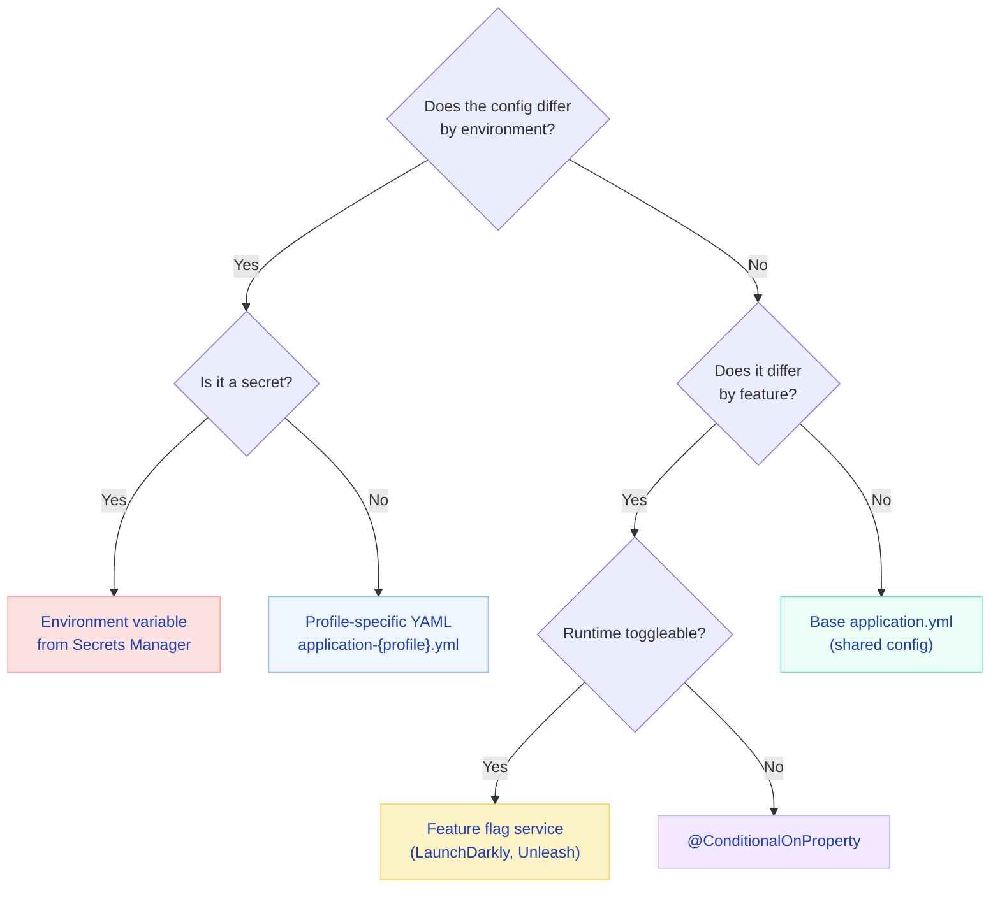

# Spring Boot Profiles

Profiles are how Spring Boot says "run this config in dev, that config in prod." Sounds simple. But then you get questions like "what happens when two profiles are active and both define the same property?" or "how do you activate a profile inside a test without affecting other tests?" — and suddenly it's not so simple anymore.

This page covers everything: the internals, the gotchas, the production patterns, and the interview ammunition you need to nail any Spring Boot configuration question.

!!! tip "💡 One-liner for interviews"
    "Profiles are Spring's mechanism for conditional configuration — same JAR, different behavior based on where it runs. They enable the 'build once, deploy everywhere' philosophy by externalizing environment-specific decisions from code into configuration."

---

## What Are Profiles?

### The Problem They Solve

Without profiles, you'd be doing one of these terrible things:

- Maintaining separate branches per environment (merge hell)
- Using `if/else` blocks checking environment variables in your code
- Building separate JARs for dev and prod (defeats CI/CD)
- Hardcoding connection strings and praying nobody deploys the wrong one

Profiles eliminate all of this. You build **one JAR**, and the runtime environment tells it how to behave.

### How It Works Internally

When Spring Boot starts, the `Environment` abstraction does three things:

1. **Determines active profiles** — checks command-line args, system properties, environment variables, and config files (in that priority order)
2. **Loads property sources** — `application.yml` always loads, then `application-{profile}.yml` for each active profile
3. **Evaluates `@Profile` annotations** — beans and configurations are included or excluded from the ApplicationContext



### When to Use Profiles

| Use Case | Example |
|----------|---------|
| Environment-specific infrastructure | H2 in dev, PostgreSQL in prod |
| Feature toggles (coarse-grained) | Enable Swagger in dev only |
| Cloud-specific behavior | AWS config vs GCP config |
| Testing isolation | Mock external services in test |
| Regional configuration | EU data residency vs US |

!!! example "🎯 Interview Tip"
    Don't just say "profiles separate environments." Explain **why**: they enable immutable deployments where the same artifact moves through environments without rebuilding. This aligns with 12-factor app principles (Factor III: Store config in the environment).

---

## Activating Profiles

There are five ways to activate profiles, and the priority order matters.

### 1. Command-Line Argument (Highest Priority)

```bash
java -jar order-service.jar --spring.profiles.active=prod,metrics
```

### 2. JVM System Property

```bash
java -Dspring.profiles.active=prod -jar order-service.jar
```

### 3. Environment Variable

```bash
export SPRING_PROFILES_ACTIVE=prod,metrics
java -jar order-service.jar
```

This is the most common approach in containerized deployments (Docker, Kubernetes).

### 4. In application.yml (Lowest Priority)

```yaml
spring:
  profiles:
    active: dev
```

### 5. Programmatic (Additive Only)

```java
@SpringBootApplication
public class OrderServiceApplication {
    public static void main(String[] args) {
        SpringApplication app = new SpringApplication(OrderServiceApplication.class);
        app.setAdditionalProfiles("metrics", "swagger");
        app.run(args);
    }
}
```

!!! danger "⚠️ What breaks"
    `setAdditionalProfiles()` is **additive** — it doesn't replace profiles set by other methods. But `spring.profiles.active` in `application.yml` is **replaced** entirely by command-line or environment variable activation. If your YAML says `active: dev,swagger` and you pass `--spring.profiles.active=prod`, you lose `swagger`.

### Priority Order Table

| Method | Priority | Behavior |
|--------|----------|----------|
| `--spring.profiles.active=prod` (CLI) | **Highest** | Replaces all lower |
| `-Dspring.profiles.active=prod` (JVM) | High | Replaces YAML |
| `SPRING_PROFILES_ACTIVE=prod` (env var) | High | Replaces YAML |
| `spring.profiles.active: dev` (YAML) | Low | Default if nothing above |
| `setAdditionalProfiles("metrics")` (code) | N/A | **Always additive** |

!!! question "❓ Counter-questions"
    **Q: "What if I set both the environment variable AND the command-line arg?"**

    A: Command-line wins. The priority is: command-line > JVM property > OS environment variable > config file. Spring Boot's `ConfigDataEnvironmentPostProcessor` processes these in order, and higher-priority sources override lower ones.

    **Q: "Can I activate profiles conditionally based on another property?"**

    A: Not directly via `spring.profiles.active`. But you can use `spring.config.activate.on-profile` in multi-document YAML to load specific config blocks only when certain profiles are already active.

---

## Profile-Specific Configuration Files

### The Naming Convention

```
src/main/resources/
├── application.yml                 ← ALWAYS loaded (shared defaults)
├── application-dev.yml             ← loaded when profile = dev
├── application-staging.yml         ← loaded when profile = staging
├── application-prod.yml            ← loaded when profile = prod
├── application-test.yml            ← loaded when profile = test
├── application-metrics.yml         ← loaded when profile = metrics
└── application-local.yml           ← loaded when profile = local
```

### Property Resolution Order

This is critical to understand. Properties are resolved bottom-up, with later sources overriding earlier ones:

1. `application.yml` loads first (the base, shared across all environments)
2. `application-{profile}.yml` loads next and **overrides matching keys**
3. If multiple profiles are active, they load in the order listed — **last profile wins** for conflicts
4. Command-line arguments override everything

!!! tip "💡 One-liner for interviews"
    "Profile-specific files don't replace the base file — they overlay it. A property defined only in `application.yml` is still available in prod. Profile files only override what they explicitly redefine."

### Real Example: E-Commerce Platform

=== "application.yml (shared defaults)"

    ```yaml
    spring:
      application:
        name: order-service
      jackson:
        default-property-inclusion: non_null
        deserialization:
          fail-on-unknown-properties: false
    server:
      port: 8080
      shutdown: graceful
    management:
      endpoints:
        web:
          exposure:
            include: health,info,metrics
      endpoint:
        health:
          show-details: when-authorized
    app:
      order:
        max-items: 50
        payment-timeout: 30s
      retry:
        max-attempts: 3
        backoff: 500ms
    ```

=== "application-dev.yml"

    ```yaml
    spring:
      datasource:
        url: jdbc:h2:mem:orders;DB_CLOSE_DELAY=-1
        driver-class-name: org.h2.Driver
        username: sa
        password:
      h2:
        console:
          enabled: true
      jpa:
        show-sql: true
        hibernate:
          ddl-auto: create-drop
      data:
        redis:
          host: localhost
          port: 6379
      kafka:
        bootstrap-servers: localhost:9092
    logging:
      level:
        root: INFO
        com.example.orders: DEBUG
        org.springframework.web: DEBUG
    app:
      order:
        payment-timeout: 120s  # longer timeout for debugging
    ```

=== "application-staging.yml"

    ```yaml
    spring:
      datasource:
        url: jdbc:postgresql://staging-aurora.cluster-abc.us-east-1.rds.amazonaws.com:5432/orders
        username: ${DB_USERNAME}
        password: ${DB_PASSWORD}
        hikari:
          maximum-pool-size: 10
          minimum-idle: 2
      jpa:
        show-sql: false
        hibernate:
          ddl-auto: validate
      data:
        redis:
          cluster:
            nodes: staging-redis.abc.cache.amazonaws.com:6379
      kafka:
        bootstrap-servers: staging-kafka-1:9092,staging-kafka-2:9092
    logging:
      level:
        root: INFO
        com.example.orders: INFO
    ```

=== "application-prod.yml"

    ```yaml
    spring:
      datasource:
        url: jdbc:postgresql://prod-aurora.cluster-xyz.us-east-1.rds.amazonaws.com:5432/orders
        username: ${DB_USERNAME}
        password: ${DB_PASSWORD}
        hikari:
          maximum-pool-size: 30
          minimum-idle: 10
          connection-timeout: 3000
          max-lifetime: 1800000
      jpa:
        show-sql: false
        hibernate:
          ddl-auto: validate
        open-in-view: false
      data:
        redis:
          cluster:
            nodes:
              - prod-redis-001.abc.cache.amazonaws.com:6379
              - prod-redis-002.abc.cache.amazonaws.com:6379
              - prod-redis-003.abc.cache.amazonaws.com:6379
          timeout: 2000ms
      kafka:
        bootstrap-servers: ${MSK_BOOTSTRAP_SERVERS}
        producer:
          acks: all
          retries: 3
        consumer:
          auto-offset-reset: earliest
          enable-auto-commit: false
    logging:
      level:
        root: WARN
        com.example.orders: INFO
    management:
      endpoints:
        web:
          exposure:
            include: health,info,metrics,prometheus
    ```

---

## Multi-Document YAML

Since Spring Boot 2.4, you can put everything in a single `application.yml` using `---` separators. Each document can target a specific profile.

```yaml
# Default — always applied
spring:
  application:
    name: order-service
server:
  port: 8080
app:
  feature:
    new-checkout: false
---
spring:
  config:
    activate:
      on-profile: dev
  datasource:
    url: jdbc:h2:mem:orders
  jpa:
    show-sql: true
    hibernate:
      ddl-auto: create-drop
app:
  feature:
    new-checkout: true  # test new features in dev
---
spring:
  config:
    activate:
      on-profile: prod
  datasource:
    url: jdbc:postgresql://prod-db:5432/orders
    username: ${DB_USERNAME}
    password: ${DB_PASSWORD}
  jpa:
    show-sql: false
    hibernate:
      ddl-auto: validate
```

!!! danger "⚠️ What breaks"
    **You cannot set `spring.profiles.active` inside a document that has `spring.config.activate.on-profile`.** This creates a circular dependency — "activate this profile only when this profile is active, and also activate this other profile." Spring Boot 2.4+ throws `InactiveConfigDataAccessException`.

    ```yaml
    # THIS WILL FAIL
    ---
    spring:
      config:
        activate:
          on-profile: dev
      profiles:
        active: swagger  # ERROR — can't set active profiles from a profile-conditional doc
    ```

---

## Profile Groups (Spring Boot 2.4+)

Profile groups let you activate multiple sub-profiles with a single name. This is essential for production where you need database config, cache config, security config, and monitoring config — all activated together.

```yaml
spring:
  profiles:
    group:
      production:
        - prod-db
        - prod-cache
        - prod-security
        - prod-monitoring
      development:
        - dev
        - swagger
        - debug-logging
      staging:
        - staging-db
        - staging-cache
        - prod-security  # reuse prod security in staging
```

Now `--spring.profiles.active=production` activates four profiles at once.

!!! example "🎯 Interview Tip"
    Profile groups solve the "profile explosion" problem. Without them, you'd need `--spring.profiles.active=prod-db,prod-cache,prod-security,prod-monitoring` on every deployment command. Groups create semantic names that map to implementation details.

### How Group Ordering Works

Profiles within a group are activated in the order listed. For property conflicts, **later profiles in the group override earlier ones**. The group profile itself (`production`) is also active and its properties are loaded first, before the group members.

---

## @Profile Annotation

### On @Configuration Classes

When `@Profile` is on a `@Configuration` class, **all beans inside are gated** — none of them register if the profile is inactive.

```java
@Configuration
@Profile("dev")
public class DevInfrastructureConfig {

    @Bean
    public DataSource dataSource() {
        return new EmbeddedDatabaseBuilder()
            .setType(EmbeddedDatabaseType.H2)
            .addScript("schema.sql")
            .addScript("dev-data.sql")
            .build();
    }

    @Bean
    public CacheManager cacheManager() {
        // Simple in-memory cache — no Redis needed in dev
        return new ConcurrentMapCacheManager("orders", "products", "users");
    }

    @Bean
    public JavaMailSender mailSender() {
        // Logs emails to console instead of sending
        return new MockMailSender();
    }
}
```

### On Individual @Bean Methods

Mix profiles within a single configuration class for related beans that vary by environment:

```java
@Configuration
public class DataSourceConfig {

    @Bean
    @Profile("dev")
    public DataSource devDataSource() {
        HikariDataSource ds = new HikariDataSource();
        ds.setJdbcUrl("jdbc:h2:mem:orders;DB_CLOSE_DELAY=-1");
        ds.setDriverClassName("org.h2.Driver");
        ds.setUsername("sa");
        ds.setMaximumPoolSize(5);
        return ds;
    }

    @Bean
    @Profile("staging")
    public DataSource stagingDataSource(
            @Value("${spring.datasource.url}") String url,
            @Value("${spring.datasource.username}") String username,
            @Value("${spring.datasource.password}") String password) {
        HikariDataSource ds = new HikariDataSource();
        ds.setJdbcUrl(url);
        ds.setUsername(username);
        ds.setPassword(password);
        ds.setMaximumPoolSize(10);
        ds.setMinimumIdle(2);
        return ds;
    }

    @Bean
    @Profile("prod")
    public DataSource prodDataSource(
            @Value("${spring.datasource.url}") String url,
            @Value("${spring.datasource.username}") String username,
            @Value("${spring.datasource.password}") String password) {
        HikariDataSource ds = new HikariDataSource();
        ds.setJdbcUrl(url);
        ds.setUsername(username);
        ds.setPassword(password);
        ds.setMaximumPoolSize(30);
        ds.setMinimumIdle(10);
        ds.setConnectionTimeout(3000);
        ds.setMaxLifetime(1800000);
        ds.setLeakDetectionThreshold(60000);
        return ds;
    }
}
```

### On @Component / @Service Classes

```java
public interface NotificationSender {
    void send(String to, String subject, String body);
}

@Component
@Profile("dev")
public class ConsoleNotificationSender implements NotificationSender {
    private static final Logger log = LoggerFactory.getLogger(ConsoleNotificationSender.class);

    @Override
    public void send(String to, String subject, String body) {
        log.info("=== DEV EMAIL ===\nTo: {}\nSubject: {}\nBody: {}\n================", to, subject, body);
    }
}

@Component
@Profile("prod")
public class SesNotificationSender implements NotificationSender {
    private final SesClient sesClient;
    private final MeterRegistry meterRegistry;

    public SesNotificationSender(SesClient sesClient, MeterRegistry meterRegistry) {
        this.sesClient = sesClient;
        this.meterRegistry = meterRegistry;
    }

    @Override
    public void send(String to, String subject, String body) {
        sesClient.sendEmail(SendEmailRequest.builder()
            .destination(d -> d.toAddresses(to))
            .message(m -> m
                .subject(s -> s.data(subject))
                .body(b -> b.html(c -> c.data(body))))
            .source("notifications@ecommerce.example.com")
            .build());
        meterRegistry.counter("notifications.sent", "channel", "email").increment();
    }
}
```

### Profile Negation and Expressions

Spring Framework 5.1+ supports logical operators in `@Profile`:

| Operator | Meaning | Example |
|----------|---------|---------|
| `!` | NOT | `@Profile("!prod")` — active in everything except prod |
| `&` | AND | `@Profile("cloud & eu")` — requires both |
| `\|` | OR | `@Profile("dev \| test")` — either works |
| `()` | Grouping | `@Profile("(dev \| test) & metrics")` |

```java
@Configuration
@Profile("!prod")
public class DevToolsConfig {
    // Swagger, H2 console, debug endpoints — everywhere EXCEPT production
    @Bean
    public OpenAPI customOpenAPI() {
        return new OpenAPI()
            .info(new Info().title("Order Service API").version("dev"));
    }
}

@Component
@Profile("prod & !maintenance")
public class ScheduledOrderProcessor {
    // Only runs in prod when maintenance mode is off
    @Scheduled(fixedDelay = 5000)
    public void processOrders() { /* ... */ }
}
```

!!! question "❓ Counter-questions"
    **Q: "What's the difference between `@Profile("dev", "test")` and `@Profile("dev | test")`?"**

    A: They're equivalent! The multi-value array form (`@Profile({"dev", "test"})`) is implicitly OR. The expression form (`@Profile("dev | test")`) is more readable and supports combining with AND/NOT.

    **Q: "Can I use `@Profile` expressions in YAML?"**

    A: No. `spring.config.activate.on-profile` in YAML only supports simple profile names, not expressions. For complex conditional loading, use separate profile-specific files.

---

## Property Resolution Deep Dive

This is where interviews get tricky. Let's trace exactly what happens.

### Scenario: Multiple Active Profiles

```bash
java -jar app.jar --spring.profiles.active=prod,metrics
```

**Property files loaded (in order):**

1. `application.yml` (base)
2. `application-prod.yml` (first active profile)
3. `application-metrics.yml` (second active profile)

**Conflict resolution:** If both `application-prod.yml` and `application-metrics.yml` define `server.port`, **metrics wins** because it's listed later in the activation order.

### What Gets Merged vs Replaced

```yaml
# application.yml
app:
  allowed-origins:
    - http://localhost:3000
    - http://localhost:8080
  cache:
    ttl: 60s
    max-size: 1000
```

```yaml
# application-prod.yml
app:
  allowed-origins:
    - https://ecommerce.example.com
  cache:
    ttl: 300s
```

**Result in prod:**

- `app.allowed-origins` = `["https://ecommerce.example.com"]` — **LIST REPLACED** (not appended!)
- `app.cache.ttl` = `300s` — overridden
- `app.cache.max-size` = `1000` — **inherited from base** (not cleared)

!!! danger "⚠️ What breaks"
    **Lists are REPLACED entirely, not merged.** This catches everyone at least once. If your base `application.yml` has 5 CORS origins and `application-prod.yml` defines 2, you get exactly 2 in prod — the base list is gone. Scalar properties and map keys merge; lists don't.

### The "Last Active Profile Wins" Rule

```bash
SPRING_PROFILES_ACTIVE=fast,safe java -jar app.jar
```

```yaml
# application-fast.yml
app:
  connection-pool-size: 50
  timeout: 1s

# application-safe.yml  
app:
  connection-pool-size: 10
  timeout: 30s
```

Result: `connection-pool-size=10`, `timeout=30s` because `safe` is listed after `fast`.

!!! tip "💡 One-liner for interviews"
    "For properties, the last active profile wins. For beans, if multiple profiles provide the same bean type without `@Primary`, you get `NoUniqueBeanDefinitionException`."

---

## Production Patterns

### Pattern 1: Secrets via Environment Variables

**Never** put secrets in profile YAML files. Even `application-prod.yml` shouldn't contain passwords — it's still in your git repo.

```yaml
# application-prod.yml — references, not values
spring:
  datasource:
    url: jdbc:postgresql://${DB_HOST}:${DB_PORT:5432}/${DB_NAME}
    username: ${DB_USERNAME}
    password: ${DB_PASSWORD}
  data:
    redis:
      password: ${REDIS_PASSWORD}
app:
  jwt:
    secret: ${JWT_SECRET}
  stripe:
    api-key: ${STRIPE_API_KEY}
```

In Kubernetes, these come from Secrets mounted as environment variables:

```yaml
# kubernetes/deployment.yaml
env:
  - name: SPRING_PROFILES_ACTIVE
    value: "prod"
  - name: DB_HOST
    valueFrom:
      secretKeyRef:
        name: order-service-db
        key: host
  - name: DB_PASSWORD
    valueFrom:
      secretKeyRef:
        name: order-service-db
        key: password
```

!!! warning "🔥 Production War Story"
    A team committed `application-prod.yml` with the actual database password because "it's just the staging DB password reused for prod." An intern pushed the repo to a public GitHub for a demo. The password was rotated within 4 hours, but not before 3 unauthorized queries hit the production database. **Rule: No secrets in source control. Ever. Not even "temporary" ones.**

### Pattern 2: Profile Groups for Deployment Tiers

```yaml
# application.yml
spring:
  profiles:
    group:
      production:
        - prod-db
        - prod-cache
        - prod-messaging
        - prod-monitoring
        - prod-security
      staging:
        - staging-db
        - staging-cache
        - prod-messaging    # same Kafka config
        - prod-monitoring   # same metrics config
        - staging-security
```

This makes deployments clean:

```bash
# Kubernetes ConfigMap
SPRING_PROFILES_ACTIVE=production
```

One word activates five configs. And staging reuses production messaging/monitoring configs — no drift.

### Pattern 3: Cloud-Specific Profiles

```java
@Configuration
@Profile("aws")
public class AwsInfrastructureConfig {

    @Bean
    public SqsClient sqsClient() {
        return SqsClient.builder()
            .region(Region.of(System.getenv("AWS_REGION")))
            .build();
    }

    @Bean
    public S3Client s3Client() {
        return S3Client.builder()
            .region(Region.of(System.getenv("AWS_REGION")))
            .build();
    }
}

@Configuration
@Profile("gcp")
public class GcpInfrastructureConfig {

    @Bean
    public PubSubTemplate pubSubTemplate(PubSubPublisherTemplate publisherTemplate) {
        return new PubSubTemplate(publisherTemplate);
    }

    @Bean
    public Storage gcsStorage() {
        return StorageOptions.getDefaultInstance().getService();
    }
}
```

Activate with `SPRING_PROFILES_ACTIVE=prod,aws` or `SPRING_PROFILES_ACTIVE=prod,gcp`.

### Pattern 4: Feature Flags vs Profiles

| Use Profiles When... | Use Feature Flags When... |
|---------------------|--------------------------|
| Config differs per **environment** | Feature differs per **user/cohort** |
| Change requires restart | Change is dynamic (no restart) |
| Affects infrastructure (DB, cache) | Affects business logic |
| Known at deploy time | Toggled at runtime |

```java
// GOOD: Profile for infrastructure
@Bean
@Profile("prod")
public CacheManager redisCacheManager(RedisConnectionFactory factory) { ... }

// BAD: Profile for business logic (use feature flags instead)
@Profile("new-checkout")  // Anti-pattern — this should be a feature flag
public class NewCheckoutService { ... }
```

!!! example "🎯 Interview Tip"
    If an interviewer asks "how would you roll out a new feature to 10% of users?", don't say profiles. Say feature flags (LaunchDarkly, Unleash, or Spring's `@ConditionalOnProperty` with a dynamic source). Profiles are deploy-time, not runtime.

---

## Testing with Profiles

### Basic Test Profile

```java
@SpringBootTest
@ActiveProfiles("test")
class OrderServiceIntegrationTest {

    @Autowired
    private OrderService orderService;

    @Test
    void shouldCreateOrder() {
        Order order = orderService.create(new CreateOrderRequest("SKU-001", 2));
        assertThat(order.getStatus()).isEqualTo(OrderStatus.CREATED);
    }
}
```

`@ActiveProfiles("test")` loads `application-test.yml` and registers beans marked `@Profile("test")`.

### Test-Specific Configuration

```yaml
# application-test.yml
spring:
  datasource:
    url: jdbc:h2:mem:testdb;DB_CLOSE_DELAY=-1
    driver-class-name: org.h2.Driver
  jpa:
    hibernate:
      ddl-auto: create-drop
    show-sql: true
  kafka:
    bootstrap-servers: ${spring.embedded.kafka.brokers:localhost:9092}
app:
  external-api:
    base-url: http://localhost:${wiremock.server.port}
    timeout: 5s
```

### Testcontainers + Profile

```java
@SpringBootTest
@ActiveProfiles("integration")
@Testcontainers
class OrderRepositoryIntegrationTest {

    @Container
    static PostgreSQLContainer<?> postgres = new PostgreSQLContainer<>("postgres:15")
        .withDatabaseName("orders_test")
        .withUsername("test")
        .withPassword("test");

    @DynamicPropertySource
    static void configureProperties(DynamicPropertyRegistry registry) {
        registry.add("spring.datasource.url", postgres::getJdbcUrl);
        registry.add("spring.datasource.username", postgres::getUsername);
        registry.add("spring.datasource.password", postgres::getPassword);
    }

    @Autowired
    private OrderRepository orderRepository;

    @Test
    void shouldPersistOrder() {
        Order saved = orderRepository.save(new Order("SKU-001", 2, BigDecimal.TEN));
        assertThat(saved.getId()).isNotNull();
    }
}
```

### @TestPropertySource Overrides

`@TestPropertySource` has higher priority than profile files — it overrides even active profile properties:

```java
@SpringBootTest
@ActiveProfiles("test")
@TestPropertySource(properties = {
    "app.order.payment-timeout=1s",   // faster timeout for tests
    "app.retry.max-attempts=1"         // don't retry in tests
})
class OrderPaymentTimeoutTest { ... }
```

!!! danger "⚠️ What breaks"
    **`@ActiveProfiles` doesn't compose across class inheritance.**

    ```java
    @SpringBootTest
    @ActiveProfiles("test")
    abstract class BaseIntegrationTest { }

    @ActiveProfiles("kafka")  // This REPLACES "test", not adds to it!
    class KafkaOrderTest extends BaseIntegrationTest { }
    ```

    To combine profiles across inheritance, you must list all of them: `@ActiveProfiles({"test", "kafka"})`. This is a common source of "works in parent class, breaks in subclass" bugs.

---

## Profile Pitfalls

### Pitfall 1: Profile Explosion

```
application-dev.yml
application-dev-local.yml
application-dev-docker.yml
application-test.yml
application-test-integration.yml
application-test-contract.yml
application-staging.yml
application-staging-eu.yml
application-staging-us.yml
application-prod.yml
application-prod-eu.yml
application-prod-us.yml
application-prod-canary.yml
```

Thirteen profile files — and counting. The mental model collapses.

**Fix:** Use profile groups and environment variables for variation within a tier:

```yaml
spring:
  profiles:
    group:
      prod-eu: [prod, eu-region]
      prod-us: [prod, us-region]
```

### Pitfall 2: Secrets in Version Control

```yaml
# application-prod.yml — NEVER DO THIS
spring:
  datasource:
    password: P@ssw0rd123!
```

Even in private repos. Even "temporarily." People leave companies, repos get forked, backups get leaked.

### Pitfall 3: Profile Logic in Code

```java
// ANTI-PATTERN: Checking profile in service code
@Service
public class OrderService {
    @Value("${spring.profiles.active}")
    private String activeProfile;

    public void processOrder(Order order) {
        if ("prod".equals(activeProfile)) {
            chargePayment(order);  // only charge in prod?!
        }
        // This means dev/test never exercise the payment path
    }
}
```

**Fix:** Use profile-specific beans that implement the same interface. The service shouldn't know which profile it's running in.

### Pitfall 4: Dev Profile Hiding Prod Bugs

```yaml
# application-dev.yml
spring:
  jpa:
    hibernate:
      ddl-auto: create-drop  # auto-creates tables
```

Your entity has a missing column mapping. In dev, Hibernate recreates the schema every start — no error. In prod with `ddl-auto: validate` — instant crash.

**Fix:** Run integration tests with `ddl-auto: validate` against a real database (Testcontainers). Don't let H2 + `create-drop` mask schema issues.

### Pitfall 5: Missing Properties in Prod

```java
@Value("${app.feature.new-checkout.enabled}")
private boolean newCheckoutEnabled;
```

You added this property to `application-dev.yml` but forgot to add it to `application-prod.yml`. Dev works fine. Prod startup fails with `Could not resolve placeholder`.

**Fix:** Always define properties with defaults: `@Value("${app.feature.new-checkout.enabled:false}")` or define all properties in the base `application.yml` and only override in profile files.

!!! warning "🔥 Production War Story"
    A team added `app.rate-limit.requests-per-second=100` to `application-dev.yml` and used `@Value("${app.rate-limit.requests-per-second}")` without a default. The deploy to prod failed at 3 AM during a maintenance window because the property didn't exist in `application-prod.yml`. The rollback took 20 minutes. **Lesson: Always provide defaults for non-critical properties, or use `@ConfigurationProperties` with `@Validated` to fail fast during CI, not during deployment.**

---

## @Profile vs @ConditionalOnProperty

This comparison comes up in interviews constantly.

| Aspect | `@Profile` | `@ConditionalOnProperty` |
|--------|-----------|--------------------------|
| Granularity | Environment-level | Feature-level |
| Activation | `spring.profiles.active` | Any property value |
| Typical use | Infrastructure beans | Optional features |
| Supports negation | `@Profile("!prod")` | `havingValue="false"` / `matchIfMissing` |
| Multiple conditions | Profile expressions | Multiple annotations |

```java
// Profile: "this bean exists only in dev"
@Bean
@Profile("dev")
public DataSource devDataSource() { ... }

// ConditionalOnProperty: "this bean exists when caching is enabled"
@Bean
@ConditionalOnProperty(name = "app.cache.enabled", havingValue = "true", matchIfMissing = false)
public CacheManager cacheManager() { ... }
```

!!! example "🎯 Interview Tip"
    Use `@Profile` when the bean depends on **where** the app runs (dev/prod). Use `@ConditionalOnProperty` when the bean depends on **what's enabled** regardless of environment. You might want caching in both staging and prod but not dev — that's a property, not a profile.

---

## Spring Boot 3.x Changes

### Config Data Migration (from 2.4+)

The old `spring.profiles` property was replaced:

| Old (pre-2.4) | New (2.4+) |
|---|---|
| `spring.profiles: dev` (inside multi-doc YAML) | `spring.config.activate.on-profile: dev` |
| `spring.profiles.include: metrics` | `spring.profiles.group.dev: dev,metrics` |

### Config Data Import

Spring Boot 3.x supports importing configuration from external sources:

```yaml
spring:
  config:
    import:
      - optional:configserver:http://config-server:8888
      - optional:aws-parameterstore:/config/order-service/
      - optional:vault://secret/order-service
```

This integrates with profiles — the config server can return different values based on the active profile label.

### Profile-Specific Config Trees (Kubernetes)

```yaml
spring:
  config:
    import: optional:configtree:/etc/config/
```

Kubernetes mounts ConfigMaps and Secrets as file trees. Spring Boot 3.x reads them directly:

```
/etc/config/
├── spring.datasource.url          → file content becomes property value
├── spring.datasource.username
└── spring.datasource.password
```

---

## The Default Profile

If no profile is explicitly activated, Spring uses the `default` profile. You can target it:

```java
@Configuration
@Profile("default")
public class FallbackConfig {
    // Only active when NO explicit profile is set
    @Bean
    public DataSource dataSource() {
        return new EmbeddedDatabaseBuilder()
            .setType(EmbeddedDatabaseType.H2)
            .build();
    }
}
```

You can change what "default" means:

```yaml
spring:
  profiles:
    default: local
```

Now `application-local.yml` loads when nothing else is specified.

!!! danger "⚠️ What breaks"
    Once you explicitly activate ANY profile, the `default` profile is completely deactivated. If you have beans annotated `@Profile("default")`, they vanish the moment someone sets `SPRING_PROFILES_ACTIVE=anything`. Don't rely on `default` for critical infrastructure.

---

## Bean Conflict Resolution

What happens when the same bean type is provided by multiple active profiles?

### Scenario: Two Profiles Active, Both Define DataSource

```bash
java -jar app.jar --spring.profiles.active=primary-db,replica-db
```

```java
@Bean
@Profile("primary-db")
public DataSource primaryDataSource() { ... }

@Bean
@Profile("replica-db")
public DataSource replicaDataSource() { ... }
```

**Result:** `NoUniqueBeanDefinitionException` — Spring finds two `DataSource` beans and doesn't know which to inject.

**Fixes:**

1. **`@Primary`** — mark one as the default choice
2. **`@Qualifier`** — name them and inject by qualifier
3. **Different bean names** — use both with `@Qualifier` at injection sites

```java
@Bean
@Profile("primary-db")
@Primary
public DataSource primaryDataSource() { ... }

@Bean
@Profile("replica-db")
@Qualifier("replica")
public DataSource replicaDataSource() { ... }
```

### No @Profile vs With @Profile

```java
@Bean
public DataSource defaultDataSource() { ... }  // no @Profile — ALWAYS registered

@Bean
@Profile("prod")
public DataSource prodDataSource() { ... }  // only in prod
```

If `prod` is active, BOTH beans register. You get `NoUniqueBeanDefinitionException` unless one is `@Primary`. **A bean without `@Profile` is unconditional — it doesn't disappear when a profiled alternative exists.**

!!! tip "💡 One-liner for interviews"
    "A bean without `@Profile` is always registered regardless of active profiles. It doesn't act as a fallback that disappears when a profiled bean exists — both coexist, causing ambiguity."

---

## Kubernetes Deployment Pattern

A complete example of how profiles work in a real Kubernetes deployment:

```yaml
# k8s/base/configmap.yaml
apiVersion: v1
kind: ConfigMap
metadata:
  name: order-service-config
data:
  SPRING_PROFILES_ACTIVE: "prod"
  DB_HOST: "prod-aurora.cluster-xyz.us-east-1.rds.amazonaws.com"
  DB_PORT: "5432"
  DB_NAME: "orders"
  KAFKA_BOOTSTRAP: "b-1.prod-msk.xyz.kafka.us-east-1.amazonaws.com:9092"
---
# k8s/base/secret.yaml
apiVersion: v1
kind: Secret
metadata:
  name: order-service-secrets
type: Opaque
data:
  DB_USERNAME: cHJvZF91c2Vy          # base64 encoded
  DB_PASSWORD: c3VwZXJfc2VjcmV0      # base64 encoded
  JWT_SECRET: bXlfc2VjcmV0X2tleQ==
---
# k8s/base/deployment.yaml
apiVersion: apps/v1
kind: Deployment
metadata:
  name: order-service
spec:
  replicas: 3
  template:
    spec:
      containers:
        - name: order-service
          image: registry.example.com/order-service:1.2.3
          envFrom:
            - configMapRef:
                name: order-service-config
            - secretRef:
                name: order-service-secrets
          env:
            - name: JAVA_OPTS
              value: "-Xmx512m -Xms256m"
```

The application JAR never changes. The environment (ConfigMap + Secret) determines all behavior.

---

## Common Interview Questions

!!! question "❓ Counter-questions"
    **Q: "How do you handle environment-specific secrets safely?"**

    A: Never in config files. Use environment variables populated from: Kubernetes Secrets, AWS Secrets Manager, HashiCorp Vault, or Spring Cloud Config Server with encryption. The `application-prod.yml` references `${DB_PASSWORD}` — the actual value is injected at runtime by the platform.

    **Q: "What's the difference between `spring.profiles.active` and `spring.profiles.default`?"**

    A: `active` explicitly activates profiles (overrides default). `default` specifies which profile to use when NO explicit activation happens. Once any profile is explicitly activated, the default profile is deactivated entirely.

    **Q: "How do profiles work with Spring Cloud Config Server?"**

    A: The config server uses the profile as a label when serving properties. A request to `http://config-server/order-service/prod` returns prod-specific properties. The client sets its profile, and the config server responds with matching configuration.

    **Q: "What happens if you define the same bean with and without @Profile?"**

    A: Both register, causing `NoUniqueBeanDefinitionException`. The non-profiled bean is always present — it's not a "default fallback" that yields to a profiled version. You need `@Primary` or `@Qualifier` to resolve the ambiguity.

    **Q: "How do you test a specific profile without affecting other test classes?"**

    A: Use `@ActiveProfiles("test")` on the test class. Each test class gets its own ApplicationContext (or shares via caching). `@ActiveProfiles` only affects the context for that class. Combine with `@TestPropertySource` for per-test overrides.

    **Q: "Profiles vs @ConditionalOnProperty — when do you use which?"**

    A: Profiles: environment-level differences (dev/staging/prod). ConditionalOnProperty: feature-level differences (caching enabled/disabled) that might apply across environments. A feature might be enabled in both staging and prod — that's a property condition, not a profile.

    **Q: "What happens if a profiled bean's dependency is missing?"**

    A: If a `@Profile("prod")` bean depends on another bean that only exists in a different profile, you get `NoSuchBeanDefinitionException` at startup. Always ensure that profiled beans have their dependencies satisfied within the same profile scope.

    **Q: "Can you change the active profile at runtime?"**

    A: No. Profiles are resolved once during startup and are immutable afterward. The `Environment.getActiveProfiles()` array doesn't change. If you need runtime behavior changes, use feature flags with a dynamic source (database, config server), not profiles.

---

## Decision Framework

When designing your profile strategy:



---

## Summary: The Rules

1. **One JAR, many environments.** Build once, configure at deploy time.
2. **Base file always loads.** Profile files overlay, they don't replace.
3. **Last active profile wins.** For conflicting properties across profiles.
4. **Lists replace, maps merge.** YAML arrays are overwritten entirely.
5. **No secrets in source control.** Use environment variables from a secrets manager.
6. **`@Profile` gates registration.** No profile match = bean doesn't exist.
7. **No-profile beans are unconditional.** They don't yield to profiled alternatives.
8. **Profiles are immutable at runtime.** Resolved once at startup.
9. **Test with the real profile.** Don't let `create-drop` mask schema bugs.
10. **Prefer fewer profiles.** Use groups and env vars to avoid explosion.
