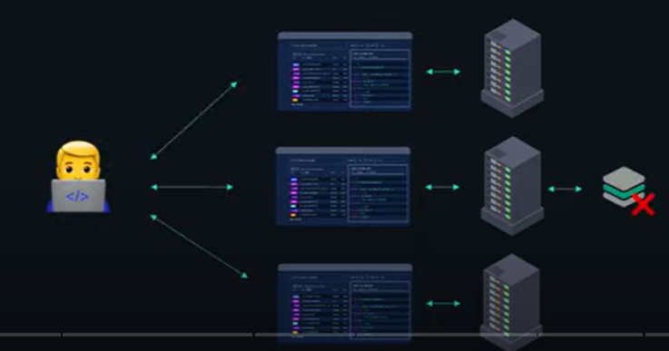

Rest - Representational State Transfer

* A rest api should be Restful and Stateless.

## What does Stateless mean ?

* In a distributed environment stateless mean that a client request is not bound to a particular server.
* So, the servers don't maintain any state with the clients. 
* Therefore, the client is free to interact with any server in a load balanced fashion without being tied to a specific server.
* In a single server environment, stateless mean that the server can process any request without any knowledge of the previous requests from a certain client.

## Why Stateless ?

* This makes the API more scalable as requests can be processed by any available server without relying on a specific state from the server. also,
* This makes the API more available, if a web server fails then incoming requests can be routed to another instance while the failed server is restarted with no bad effects on the client application   

## Best Practices

* Use Contract First Approach
* Make Great use of HTTP.
* HTTP Request methods
* HTTP Response status , if resource not found send 404 instead of exception.
* HTTP request headers
* Use Nouns for resources
        /accounts/10 , instead of /getaccounts/10
   There are some exceptional scenarios. Define a consistent approach.
             /search
             PUT /accounts/{id}/star 
* Representation , i.e in xml or json.
* Use Plurals  like /users
* Have a great documentation.
* Versioning  like v1/person , v2/person
* Error Handling

   **RESPONSE STATUS CODE**
    
    * 200 - SUCCESS
    * 201 - CREATED
    * 400 - BAD REQUEST
    * 401 - UNAUTHORIZED
    * 500 - SERVER ERROR
  
* Implement Rate Limiting:
  Protect your API from abuse by implementing rate limiting mechanisms to control the number of requests from a single client.
* Use Pagination for Large Data Sets:
  * Implement pagination to retrieve large data sets in smaller chunks.
  * Provide parameters like page and pageSize to control the number of results returned.
