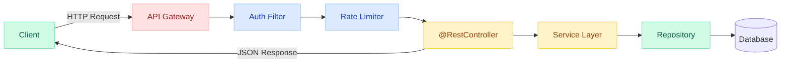
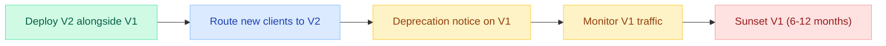
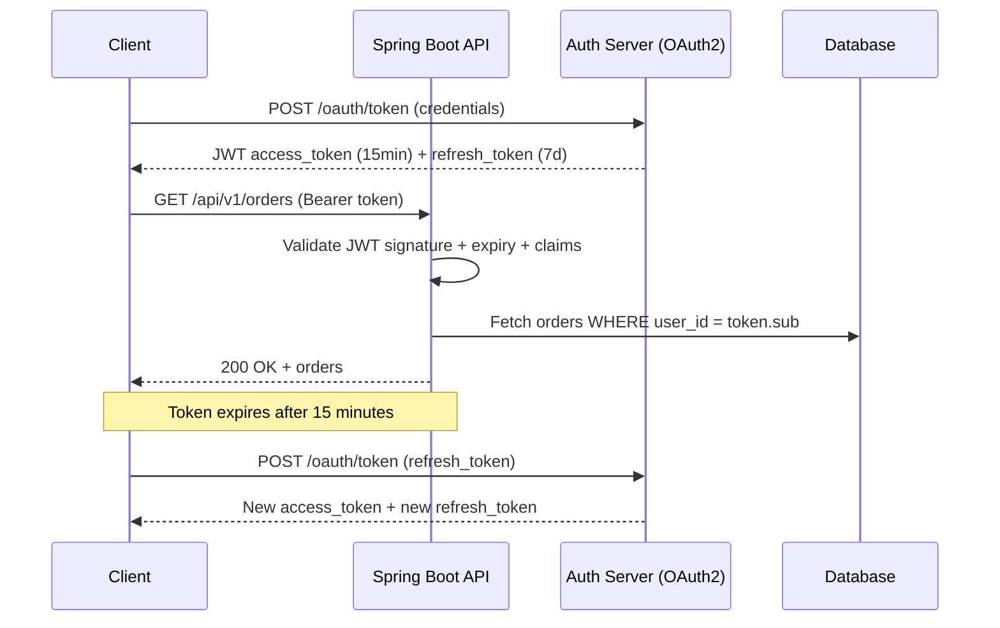

# REST API Best Practices for Spring Boot

> I've reviewed 200+ API designs in code reviews. The same 10 mistakes keep showing up. Most engineers know REST "basics" but crack under pressure when asked "why PUT over PATCH?" or "how do you version a breaking change without downtime?" Let me walk you through what production-grade REST actually looks like.


```mermaid
flowchart LR
    Client -->|"HTTP Request"| Gateway["API Gateway"]
    Gateway --> Auth["Auth Filter"]
    Auth --> RateLimit["Rate Limiter"]
    RateLimit --> Controller["@RestController"]
    Controller --> Service["Service Layer"]
    Service --> Repo["Repository"]
    Repo --> DB[(Database)]
    Controller -->|"JSON Response"| Client

    style Auth fill:#DBEAFE,stroke:#93C5FD,color:#1E40AF
    style Client fill:#D1FAE5,stroke:#6EE7B7,color:#065F46
    style Controller fill:#FEF3C7,stroke:#FCD34D,color:#92400E
    style Gateway fill:#FEE2E2,stroke:#FCA5A5,color:#991B1B
    style RateLimit fill:#DBEAFE,stroke:#93C5FD,color:#1E40AF
    style Repo fill:#D1FAE5,stroke:#6EE7B7,color:#065F46
    style Service fill:#FEF3C7,stroke:#FCD34D,color:#92400E
```

---

## URL Design — The Foundation

The URL is your API's front door. Get it wrong and every consumer pays the price forever.

### The Rules

1. **Nouns, not verbs** — the HTTP method IS the verb
2. **Plural nouns** — `/orders` not `/order` (even for a single resource: `GET /orders/42`)
3. **Kebab-case** — `/order-items` not `/orderItems` or `/order_items`
4. **Hierarchy for relationships** — `/users/42/orders`
5. **Max 2 levels of nesting** — beyond that, flatten to top-level with query params

| Bad | Good | Why |
|-----|------|-----|
| `GET /getUsers` | `GET /users` | Method already says GET |
| `POST /createOrder` | `POST /orders` | Redundant verb |
| `DELETE /users/1/remove` | `DELETE /users/1` | URL verb is noise |
| `/users/1/orders/5/items/3/reviews` | `/reviews?itemId=3` | Too deep — impossible to cache |
| `/user/1` | `/users/1` | Always plural, even for singleton |

!!! tip "💡 One-liner for interviews"
    "Resources are nouns, HTTP methods are verbs. The URL tells you WHAT, the method tells you the ACTION."

### Nested vs Flat — The Real Debate

When should `/users/42/orders` exist vs just `/orders?userId=42`?

| Use Nested When | Use Flat When |
|----------------|---------------|
| Child cannot exist without parent | Resource has independent identity |
| You always access child through parent | You query across all parents |
| The nesting is max 2 levels | You need flexible filtering |

```java
// Nested — order belongs to user, always accessed through user context
@GetMapping("/users/{userId}/orders")
public List<OrderResponse> getUserOrders(@PathVariable Long userId) { ... }

// Flat — search orders across all users (admin dashboard)
@GetMapping("/orders")
public Page<OrderResponse> searchOrders(
        @RequestParam(required = false) Long userId,
        @RequestParam(required = false) String status,
        Pageable pageable) { ... }
```

!!! example "🎯 Interview Tip"
    "I nest when there is a strong ownership relationship AND the nesting is shallow. If I need cross-cutting queries, I keep it flat with query params. Stripe does both — `/customers/cus_123/charges` AND `/charges?customer=cus_123`."

### Actions That Don't Map to CRUD

Some operations are inherently RPC-like. Use a verb sub-resource:

```
POST /orders/99/cancel        -- state transition
POST /users/42/activate       -- lifecycle action
POST /payments/123/refund     -- domain operation
POST /reports/generate        -- trigger a process
```

!!! warning "🔥 Production War Story"
    A team modeled "cancel order" as `DELETE /orders/99`. Clients started calling it expecting it to actually remove the order from the database. Cancellation is a business operation, not resource deletion. The fix: `POST /orders/99/cancel` with a reason in the body. Stripe uses this exact pattern: `POST /v1/charges/{id}/refund`.

---

## HTTP Methods — The Real Story

This is where 80% of interview questions live. Know the nuances cold.

| Method | Semantics | Idempotent | Safe | Has Body |
|--------|-----------|:----------:|:----:|:--------:|
| GET | Read resource(s) | Yes | Yes | No |
| POST | Create / trigger action | **No** | No | Yes |
| PUT | Full replacement | Yes | No | Yes |
| PATCH | Partial update | **No*** | No | Yes |
| DELETE | Remove resource | Yes | No | Optional |
| HEAD | GET without body (metadata only) | Yes | Yes | No |
| OPTIONS | Discover allowed methods | Yes | Yes | No |

### GET — Simple But Subtle

- **Idempotent**: calling it 10 times returns the same result (barring concurrent writes)
- **Cacheable**: CDNs, browsers, and proxies cache GET responses by default
- **No body**: technically allowed by HTTP spec, but most frameworks reject it

!!! danger "⚠️ What breaks"
    A team used `GET /search` with a JSON body for complex queries. Worked in Postman. Broke in production — AWS ALB stripped the body from GET requests. Fix: use `POST /search` for complex query payloads, or encode filters as query params.

### POST — Not Just "Create"

POST is the Swiss Army knife. Use it for:

- **Creating resources** (primary use) — returns 201 + Location header
- **Complex queries** that exceed URL length limits
- **Actions/operations** that are not CRUD (cancel, refund, notify)
- **Bulk operations** (create/update multiple resources)

```java
// Creation — returns 201 with Location header
@PostMapping("/orders")
public ResponseEntity<OrderResponse> createOrder(@Valid @RequestBody CreateOrderRequest request) {
    OrderResponse created = orderService.create(request);
    URI location = ServletUriComponentsBuilder.fromCurrentRequest()
        .path("/{id}").buildAndExpand(created.id()).toUri();
    return ResponseEntity.created(location).body(created);
}
```

### PUT vs PATCH — The Interview Killer

This question eliminates 50% of candidates. Know it deeply.

=== "PUT — Full Replacement"

    ```java
    // PUT /api/v1/products/42
    // Client MUST send ALL fields. Missing fields become null.
    @PutMapping("/{id}")
    public ResponseEntity<ProductResponse> replaceProduct(
            @PathVariable Long id,
            @Valid @RequestBody UpdateProductRequest request) {
        // Every field in request overwrites the entity
        Product product = productRepo.findById(id)
            .orElseThrow(() -> new ResourceNotFoundException("Product", id));
        product.setName(request.name());       // required
        product.setPrice(request.price());     // required
        product.setDescription(request.description()); // null if not sent
        product.setCategory(request.category());       // null if not sent
        return ResponseEntity.ok(mapper.toResponse(productRepo.save(product)));
    }
    ```

=== "PATCH — Partial Update"

    ```java
    // PATCH /api/v1/products/42
    // Client sends ONLY changed fields. Null means "don't change".
    @PatchMapping("/{id}")
    public ResponseEntity<ProductResponse> patchProduct(
            @PathVariable Long id,
            @RequestBody PatchProductRequest request) {
        Product product = productRepo.findById(id)
            .orElseThrow(() -> new ResourceNotFoundException("Product", id));
        if (request.name() != null) product.setName(request.name());
        if (request.price() != null) product.setPrice(request.price());
        if (request.description() != null) product.setDescription(request.description());
        return ResponseEntity.ok(mapper.toResponse(productRepo.save(product)));
    }
    ```

!!! question "❓ Counter-questions"
    **Q: "Is PATCH idempotent?"**

    A: Not guaranteed. `PATCH /users/1 {"name": "Alice"}` is idempotent in practice. But `PATCH /accounts/1 {"balance": "+10"}` increments every time — that is NOT idempotent. The HTTP spec says PATCH MAY be idempotent, but does not require it.

    **Q: "When does PUT create a resource?"**

    A: When the client controls the ID. `PUT /configs/dark-mode {"enabled": true}` — if it does not exist, create it. If it does, replace it. This is common for configuration or singleton resources.

!!! danger "⚠️ What breaks"
    A team used PUT for "update user profile" but only sent the fields the user changed in the form. Result: every PUT request nulled out fields the user did not edit. 200 users lost their profile pictures in one deploy. PATCH was the correct choice.

### DELETE — Soft vs Hard

```java
// Hard delete — gone forever
@DeleteMapping("/{id}")
@ResponseStatus(HttpStatus.NO_CONTENT)
public void deleteProduct(@PathVariable Long id) {
    productRepo.deleteById(id);
}

// Soft delete — mark as deleted, keep the data
@DeleteMapping("/{id}")
@ResponseStatus(HttpStatus.NO_CONTENT)
public void deleteProduct(@PathVariable Long id) {
    Product product = productRepo.findById(id)
        .orElseThrow(() -> new ResourceNotFoundException("Product", id));
    product.setDeletedAt(Instant.now());
    productRepo.save(product);
}
```

!!! tip "💡 One-liner for interviews"
    "DELETE is idempotent — calling it twice yields the same result (resource is gone). The second call returns 204 or 404 depending on your convention. Both are acceptable."

### Idempotency Keys — Making POST Safe to Retry

For non-idempotent operations (payments, order creation), use an `Idempotency-Key` header:

```java
@PostMapping("/payments")
public ResponseEntity<PaymentResponse> createPayment(
        @RequestHeader("Idempotency-Key") String idempotencyKey,
        @Valid @RequestBody PaymentRequest request) {

    // Check cache — return stored response if key exists
    return idempotencyStore.findByKey(idempotencyKey)
        .map(cached -> ResponseEntity.status(cached.statusCode()).body(cached.body()))
        .orElseGet(() -> {
            PaymentResponse result = paymentService.process(request);
            idempotencyStore.save(idempotencyKey, result, Duration.ofHours(24));
            return ResponseEntity.status(CREATED).body(result);
        });
}
```

!!! example "🎯 Interview Tip"
    "Stripe requires an `Idempotency-Key` header on all POST requests. The client generates a UUID, and the server caches the response keyed by it. On network retry, the client resends with the same key and gets the original response — no double-charge."

---

## Status Codes That Actually Matter

Don't memorize all 60+ codes. Know these 15 cold and you will cover 99% of interview questions.

### Success (2xx)

| Code | When to Use | Spring Boot |
|------|-------------|-------------|
| **200** OK | GET succeeded, PUT/PATCH succeeded | `ResponseEntity.ok(body)` |
| **201** Created | POST created a new resource | `ResponseEntity.created(uri).body(dto)` |
| **202** Accepted | Async job started, not done yet | `ResponseEntity.accepted().body(jobStatus)` |
| **204** No Content | DELETE succeeded, nothing to return | `ResponseEntity.noContent().build()` |

### Client Errors (4xx)

| Code | When | Common Mistake |
|------|------|----------------|
| **400** Bad Request | Malformed JSON, missing required field, type mismatch | Using 400 for everything |
| **401** Unauthorized | No credentials or expired token | Confusing with 403 |
| **403** Forbidden | Authenticated but lacks permission | Accidentally leaking resource existence |
| **404** Not Found | Resource does not exist | Returning 200 with empty body |
| **409** Conflict | Duplicate email, optimistic lock failure, state conflict | Using 400 instead |
| **410** Gone | Resource existed but was permanently deleted | Using 404 for everything |
| **422** Unprocessable Entity | Valid JSON but violates business rule | Not using it at all |
| **429** Too Many Requests | Rate limit exceeded | Forgetting the `Retry-After` header |

### Server Errors (5xx)

| Code | When |
|------|------|
| **500** Internal Server Error | Unhandled exception — YOUR bug |
| **502** Bad Gateway | Upstream service returned invalid response |
| **503** Service Unavailable | Overloaded or in maintenance (include Retry-After) |
| **504** Gateway Timeout | Upstream service took too long |

!!! question "❓ Counter-questions"
    **Q: "400 vs 422 — which do you use for validation errors?"**

    A: It depends on your convention. Strict interpretation: 400 = syntactically invalid (malformed JSON, wrong type). 422 = syntactically valid but semantically wrong (email already taken, insufficient balance). In practice, many APIs (GitHub) use 422 for all validation errors. Pick one and be consistent.

    **Q: "401 vs 403 — the user hits a protected endpoint?"**

    A: 401 = "I don't know who you are. Authenticate yourself." 403 = "I know who you are. You are not allowed." A missing/expired token is 401. A valid token without the ADMIN role hitting an admin endpoint is 403.

!!! warning "🔥 Production War Story"
    A team returned `200 OK` with `{"data": null}` when a resource was not found. Their mobile client crashed on null pointer exceptions in production because it assumed 200 always meant success with data. The fix: return 404 with a proper error body. Status codes exist so clients do not have to inspect the body to know if the request succeeded.

---

## Request/Response Design

### DTOs Over Entities — Non-Negotiable

Never expose JPA entities directly. This is the #1 security and stability mistake in Spring Boot APIs.

```java
// REQUEST DTO — only fields the client is allowed to set
public record CreateOrderRequest(
    @NotNull Long productId,
    @Min(1) @Max(100) int quantity,
    @NotBlank String shippingAddress
) {}

// RESPONSE DTO — only fields the client should see
public record OrderResponse(
    Long id,
    String productName,
    int quantity,
    BigDecimal totalPrice,
    String status,
    Instant createdAt
) {}

// ENTITY — internal, never exposed
@Entity
public class Order {
    @Id @GeneratedValue private Long id;
    @ManyToOne private Product product;
    @ManyToOne private User user;        // never leak to client
    private int quantity;
    private BigDecimal totalPrice;
    private BigDecimal costPrice;         // internal margin data
    private String internalNotes;         // ops team notes
    @Enumerated private OrderStatus status;
    private Instant createdAt;
    @Version private Long version;        // optimistic locking
}
```

!!! danger "⚠️ What breaks"
    **Mass Assignment Attack**: If you bind JSON directly to a JPA entity, an attacker sends `{"role": "ADMIN", "verified": true}` and escalates privileges. DTOs prevent this entirely — fields not in the DTO cannot be set.

    **Lazy Loading Exception**: Entity has `@OneToMany(fetch = LAZY)`. Jackson tries to serialize it outside a transaction. Boom — `LazyInitializationException` in production.

    **Schema Coupling**: You rename a DB column, and your API contract breaks. DTOs decouple internal schema from external contract.

### Response Envelope Pattern

=== "Envelope (Recommended for public APIs)"

    ```json
    {
      "data": { "id": 42, "name": "Wireless Mouse", "price": 29.99 },
      "meta": { "requestId": "req_abc123", "timestamp": "2025-03-15T10:30:00Z" }
    }
    ```

=== "Flat (Common for internal APIs)"

    ```json
    { "id": 42, "name": "Wireless Mouse", "price": 29.99 }
    ```

=== "Error Envelope"

    ```json
    {
      "type": "https://api.example.com/errors/validation-failed",
      "title": "Validation Error",
      "status": 400,
      "errors": [
        { "field": "email", "message": "must be a valid email address" },
        { "field": "quantity", "message": "must be greater than 0" }
      ]
    }
    ```

### HATEOAS — When It Matters, When It's Overkill

```java
@GetMapping("/{id}")
public EntityModel<OrderResponse> getOrder(@PathVariable Long id) {
    OrderResponse order = orderService.findById(id);
    return EntityModel.of(order,
        linkTo(methodOn(OrderController.class).getOrder(id)).withSelfRel(),
        linkTo(methodOn(OrderController.class).cancelOrder(id)).withRel("cancel"),
        linkTo(methodOn(PaymentController.class).pay(order.id())).withRel("pay")
    );
}
```

| Use HATEOAS | Skip HATEOAS |
|-------------|--------------|
| Public API with many external consumers | Internal microservice-to-microservice calls |
| API needs to evolve URLs without breaking clients | Small team, tight coupling acceptable |
| Discoverable workflows (state machines) | Performance-sensitive (adds payload size) |

!!! tip "💡 One-liner for interviews"
    "HATEOAS makes the API self-documenting — the response tells you what you can do next, like links on a web page. It decouples clients from URL structure. In practice, most teams skip it for internal APIs and adopt it selectively for public-facing ones."

---

## Pagination — Offset vs Cursor

### The Tradeoff Table

| | Offset (`?page=5&size=20`) | Cursor (`?after=eyJpZCI6MTAwfQ&limit=20`) |
|---|---|---|
| **Random access** | Yes — jump to page 42 | No — sequential only |
| **Concurrent safety** | Breaks — inserts cause duplicates/skips | Stable — always picks up from last seen |
| **Performance at depth** | Degrades — `OFFSET 100000` scans all rows | Constant — uses index seek `WHERE id > ?` |
| **Use case** | Admin dashboards, small datasets | User feeds, infinite scroll, large datasets |

!!! danger "⚠️ What breaks"
    `SELECT * FROM orders OFFSET 500000 LIMIT 20` — the database reads and discards 500,000 rows before returning 20. At scale, this query takes 10+ seconds and holds locks. Cursor pagination with `WHERE id > :lastId ORDER BY id LIMIT 20` uses an index seek — constant time regardless of depth.

### Spring Boot — Offset Pagination

```java
@GetMapping("/products")
public ResponseEntity<Page<ProductResponse>> listProducts(
        @PageableDefault(size = 20, sort = "createdAt", direction = DESC) Pageable pageable) {
    Page<ProductResponse> page = productService.findAll(pageable);
    return ResponseEntity.ok(page);
}
// Request: GET /api/v1/products?page=0&size=20&sort=price,asc
```

### Spring Boot — Cursor Pagination

```java
public record CursorPage<T>(List<T> data, String nextCursor, boolean hasMore) {}

@GetMapping("/feed")
public ResponseEntity<CursorPage<PostResponse>> getFeed(
        @RequestParam(required = false) String after,
        @RequestParam(defaultValue = "20") @Max(100) int limit) {

    Long afterId = (after != null) ? decodeCursor(after) : null;

    List<Post> posts = (afterId == null)
        ? postRepo.findAllByOrderByCreatedAtDesc(Limit.of(limit + 1))
        : postRepo.findByIdLessThanOrderByCreatedAtDesc(afterId, Limit.of(limit + 1));

    boolean hasMore = posts.size() > limit;
    if (hasMore) posts = posts.subList(0, limit);

    String nextCursor = hasMore ? encodeCursor(posts.getLast().getId()) : null;
    List<PostResponse> data = posts.stream().map(mapper::toResponse).toList();
    return ResponseEntity.ok(new CursorPage<>(data, nextCursor, hasMore));
}

private String encodeCursor(Long id) {
    return Base64.getEncoder().encodeToString(id.toString().getBytes());
}

private Long decodeCursor(String cursor) {
    return Long.parseLong(new String(Base64.getDecoder().decode(cursor)));
}
```

!!! example "🎯 Interview Tip"
    "I default to cursor pagination for any user-facing list endpoint. Offset is fine for admin UIs with less than 100K records. The key insight is that offset pagination does not scale — it is O(n) where n is the offset, while cursor is O(1)."

---

## Filtering, Sorting, and Field Selection

### Filtering — Keep It Flat and Composable

```
GET /api/v1/products?category=electronics&minPrice=10&maxPrice=100&inStock=true
GET /api/v1/orders?status=PENDING&createdAfter=2025-01-01&userId=42
```

Spring Boot with the Specification pattern:

```java
@GetMapping("/products")
public Page<ProductResponse> search(
        @RequestParam(required = false) String category,
        @RequestParam(required = false) BigDecimal minPrice,
        @RequestParam(required = false) BigDecimal maxPrice,
        @RequestParam(required = false) Boolean inStock,
        @PageableDefault(size = 20) Pageable pageable) {

    Specification<Product> spec = Specification.where(null);
    if (category != null) spec = spec.and(hasCategory(category));
    if (minPrice != null) spec = spec.and(priceGreaterThan(minPrice));
    if (maxPrice != null) spec = spec.and(priceLessThan(maxPrice));
    if (inStock != null) spec = spec.and(isInStock(inStock));

    return productRepo.findAll(spec, pageable).map(mapper::toResponse);
}

// Specifications — reusable, composable, type-safe
public class ProductSpecs {
    public static Specification<Product> hasCategory(String cat) {
        return (root, query, cb) -> cb.equal(root.get("category").get("name"), cat);
    }
    public static Specification<Product> priceGreaterThan(BigDecimal min) {
        return (root, query, cb) -> cb.greaterThanOrEqualTo(root.get("price"), min);
    }
}
```

### Sorting — Whitelist Allowed Fields

```
GET /api/v1/products?sort=price,asc&sort=name,desc
```

!!! danger "⚠️ What breaks"
    Allowing arbitrary sort fields lets attackers trigger full table scans on un-indexed columns. Always whitelist sortable fields:

    ```java
    private static final Set<String> ALLOWED_SORT_FIELDS = Set.of("price", "name", "createdAt", "rating");

    @GetMapping("/products")
    public Page<ProductResponse> list(Pageable pageable) {
        pageable.getSort().forEach(order -> {
            if (!ALLOWED_SORT_FIELDS.contains(order.getProperty())) {
                throw new BadRequestException("Cannot sort by: " + order.getProperty());
            }
        });
        return productRepo.findAll(pageable).map(mapper::toResponse);
    }
    ```

### Sparse Fieldsets — Return Only What's Needed

```
GET /api/v1/products?fields=id,name,price
```

```java
@GetMapping("/products")
public List<Map<String, Object>> list(@RequestParam(required = false) Set<String> fields) {
    List<Product> products = productRepo.findAll();
    if (fields == null || fields.isEmpty()) {
        return products.stream().map(mapper::toFullMap).toList();
    }
    return products.stream().map(p -> mapper.toPartialMap(p, fields)).toList();
}
```

!!! tip "💡 One-liner for interviews"
    "Sparse fieldsets reduce payload size and bandwidth. GraphQL does this natively, but REST APIs can support it with a `fields` query param. JSON:API spec formalizes this pattern."

---

## Versioning Strategies

### The Options

| Strategy | Example | Pros | Cons |
|----------|---------|------|------|
| **URI Path** | `/api/v1/users` | Explicit, cacheable, visible in logs | URL changes on version bump |
| **Custom Header** | `X-API-Version: 2` | Clean URLs | Hidden, harder to debug, not cacheable |
| **Media Type** | `Accept: application/vnd.app.v2+json` | RESTful purist choice | Complex, poor tooling support |
| **Query Param** | `?version=2` | Simple to add | Ugly, caching issues |
| **No versioning** | Additive changes only | No breaking changes ever | Requires extreme discipline |

=== "URI Path (Industry Standard)"

    ```java
    @RestController
    @RequestMapping("/api/v1/orders")
    public class OrderControllerV1 {
        @GetMapping("/{id}")
        public OrderV1Response getOrder(@PathVariable Long id) { ... }
    }

    @RestController
    @RequestMapping("/api/v2/orders")
    public class OrderControllerV2 {
        // V2 adds shipping tracking, changes address format
        @GetMapping("/{id}")
        public OrderV2Response getOrder(@PathVariable Long id) { ... }
    }
    ```

=== "Media Type Versioning"

    ```java
    @GetMapping(value = "/{id}", produces = "application/vnd.myapp.v1+json")
    public OrderV1Response getOrderV1(@PathVariable Long id) { ... }

    @GetMapping(value = "/{id}", produces = "application/vnd.myapp.v2+json")
    public OrderV2Response getOrderV2(@PathVariable Long id) { ... }
    ```

=== "Header-Based"

    ```java
    @GetMapping(value = "/{id}", headers = "X-API-Version=1")
    public OrderV1Response getOrderV1(@PathVariable Long id) { ... }

    @GetMapping(value = "/{id}", headers = "X-API-Version=2")
    public OrderV2Response getOrderV2(@PathVariable Long id) { ... }
    ```

### Breaking Changes Without Downtime


```mermaid
flowchart LR
    A["Deploy V2 alongside V1"] --> B["Route new clients to V2"]
    B --> C["Deprecation notice on V1"]
    C --> D["Monitor V1 traffic"]
    D --> E["Sunset V1 (6-12 months)"]

    style A fill:#D1FAE5,stroke:#6EE7B7,color:#065F46
    style B fill:#DBEAFE,stroke:#93C5FD,color:#1E40AF
    style C fill:#FEF3C7,stroke:#FCD34D,color:#92400E
    style D fill:#FEF3C7,stroke:#FCD34D,color:#92400E
    style E fill:#FEE2E2,stroke:#FCA5A5,color:#991B1B
```

!!! example "🎯 Interview Tip"
    "I use URI path versioning because it is explicit, cacheable, and visible in every log line and curl command. Stripe, Google, GitHub, and Twilio all use it. The key strategy for breaking changes: deploy V2 alongside V1, migrate clients gradually, deprecate with a `Sunset` header, and decommission V1 only when traffic hits zero."

!!! question "❓ Counter-questions"
    **Q: "How do you avoid versioning entirely?"**

    A: Additive-only changes. Never remove or rename fields — only add new ones. Use nullable types for new response fields. Old clients ignore unknown fields (Postel's Law). This works for small teams but breaks down when you need to fundamentally restructure a resource.

---

## Error Handling — RFC 7807 Problem Details

Spring Boot 3+ supports RFC 7807 natively. No more inventing custom error formats.

### Standard Error Response

```json
{
  "type": "https://api.example.com/errors/out-of-stock",
  "title": "Product Out of Stock",
  "status": 409,
  "detail": "Product 'Wireless Mouse' (SKU: WM-001) has 0 units available. Requested: 5.",
  "instance": "/api/v1/orders",
  "timestamp": "2025-03-15T10:30:00Z",
  "traceId": "abc123def456",
  "errors": [
    { "field": "items[0].quantity", "message": "requested 5 but only 0 available" }
  ]
}
```

### Global Exception Handler

```java
@RestControllerAdvice
public class GlobalExceptionHandler extends ResponseEntityExceptionHandler {

    @ExceptionHandler(ResourceNotFoundException.class)
    public ProblemDetail handleNotFound(ResourceNotFoundException ex, HttpServletRequest req) {
        ProblemDetail pd = ProblemDetail.forStatusAndDetail(HttpStatus.NOT_FOUND, ex.getMessage());
        pd.setTitle("Resource Not Found");
        pd.setType(URI.create("https://api.example.com/errors/not-found"));
        pd.setInstance(URI.create(req.getRequestURI()));
        pd.setProperty("timestamp", Instant.now());
        pd.setProperty("traceId", MDC.get("traceId"));
        return pd;
    }

    @ExceptionHandler(MethodArgumentNotValidException.class)
    public ProblemDetail handleValidation(MethodArgumentNotValidException ex) {
        ProblemDetail pd = ProblemDetail.forStatusAndDetail(
            HttpStatus.BAD_REQUEST, "Request validation failed");
        pd.setTitle("Validation Error");

        List<Map<String, String>> fieldErrors = ex.getBindingResult().getFieldErrors().stream()
            .map(fe -> Map.of(
                "field", fe.getField(),
                "rejected", String.valueOf(fe.getRejectedValue()),
                "message", fe.getDefaultMessage()))
            .toList();
        pd.setProperty("errors", fieldErrors);
        return pd;
    }

    @ExceptionHandler(OptimisticLockingFailureException.class)
    public ProblemDetail handleConflict(OptimisticLockingFailureException ex) {
        ProblemDetail pd = ProblemDetail.forStatusAndDetail(HttpStatus.CONFLICT,
            "Resource was modified by another request. Please re-fetch and retry.");
        pd.setTitle("Conflict — Concurrent Modification");
        pd.setProperty("suggestion", "Re-fetch the resource and retry your update");
        return pd;
    }

    @ExceptionHandler(DuplicateResourceException.class)
    public ProblemDetail handleDuplicate(DuplicateResourceException ex) {
        ProblemDetail pd = ProblemDetail.forStatusAndDetail(HttpStatus.CONFLICT, ex.getMessage());
        pd.setTitle("Duplicate Resource");
        pd.setProperty("conflictingField", ex.getField());
        return pd;
    }

    // Catch-all: NEVER leak stack traces in production
    @ExceptionHandler(Exception.class)
    public ProblemDetail handleUnexpected(Exception ex) {
        log.error("Unhandled exception", ex);
        ProblemDetail pd = ProblemDetail.forStatusAndDetail(
            HttpStatus.INTERNAL_SERVER_ERROR, "An unexpected error occurred");
        pd.setProperty("traceId", MDC.get("traceId"));
        return pd;
    }
}
```

!!! tip "💡 One-liner for interviews"
    "I use RFC 7807 Problem Details for all error responses. It is a standard format with `type`, `title`, `status`, `detail`, and `instance`. Spring Boot 3 supports it natively. Add `spring.mvc.problemdetails.enabled=true` and extend `ResponseEntityExceptionHandler`."

### Enable RFC 7807 Globally

```yaml
spring:
  mvc:
    problemdetails:
      enabled: true
```

---

## Security Best Practices

### The Security Checklist

| Practice | Implementation | What Breaks Without It |
|----------|---------------|----------------------|
| Always HTTPS | TLS termination at load balancer | Credentials transmitted in plaintext |
| Short-lived JWTs | 15 min access + refresh token | Stolen tokens valid forever |
| Validate ALL input | `@Valid` + Bean Validation | Injection attacks, data corruption |
| Rate limit auth endpoints | 5 attempts/min on `/login` | Brute force attacks succeed |
| CORS restrictions | Explicit origins, never `*` | Cross-site request attacks |
| No secrets in URLs | Tokens in headers/body only | Secrets logged in access logs |
| Mass assignment protection | Separate DTOs per operation | Privilege escalation |
| Audit logging | Who did what, when, from where | No forensics after breach |

### Input Validation

```java
public record CreateUserRequest(
    @NotBlank @Size(min = 2, max = 50)
    String name,

    @NotBlank @Email
    String email,

    @NotBlank @Size(min = 8, max = 100)
    @Pattern(regexp = "^(?=.*[A-Z])(?=.*[0-9])(?=.*[!@#$%]).+$",
             message = "must contain uppercase, digit, and special character")
    String password,

    @Past
    LocalDate dateOfBirth,

    @NotNull @Size(max = 5)
    List<@NotBlank String> roles  // validate nested collections too
) {}
```

!!! danger "⚠️ What breaks"
    "But the frontend validates!" — Never trust client-side validation. Attackers bypass frontends entirely with curl/Postman. EVERY input that touches your server MUST be validated server-side. Bean Validation annotations on DTOs are your first line of defense.

### CORS Configuration

```java
@Configuration
public class CorsConfig {

    @Bean
    public WebMvcConfigurer corsConfigurer() {
        return new WebMvcConfigurer() {
            @Override
            public void addCorsMappings(CorsRegistry registry) {
                registry.addMapping("/api/**")
                    .allowedOrigins("https://myapp.com", "https://admin.myapp.com")
                    .allowedMethods("GET", "POST", "PUT", "PATCH", "DELETE")
                    .allowedHeaders("Authorization", "Content-Type", "Idempotency-Key")
                    .exposedHeaders("X-RateLimit-Remaining", "X-RateLimit-Limit")
                    .maxAge(3600);
            }
        };
    }
}
```

### Authentication Flow


```mermaid
sequenceDiagram
    participant Client
    participant API as Spring Boot API
    participant Auth as Auth Server (OAuth2)
    participant DB as Database

    Client->>Auth: POST /oauth/token (credentials)
    Auth-->>Client: JWT access_token (15min) + refresh_token (7d)
    Client->>API: GET /api/v1/orders (Bearer token)
    API->>API: Validate JWT signature + expiry + claims
    API->>DB: Fetch orders WHERE user_id = token.sub
    API-->>Client: 200 OK + orders
    Note over Client,API: Token expires after 15 minutes
    Client->>Auth: POST /oauth/token (refresh_token)
    Auth-->>Client: New access_token + new refresh_token
```

---

## Rate Limiting

### Response Headers (Industry Standard)

```
HTTP/1.1 200 OK
X-RateLimit-Limit: 1000
X-RateLimit-Remaining: 742
X-RateLimit-Reset: 1623456789

HTTP/1.1 429 Too Many Requests
Retry-After: 30
X-RateLimit-Limit: 1000
X-RateLimit-Remaining: 0
```

### Spring Boot Implementation with Bucket4j

```java
@Component
public class RateLimitFilter extends OncePerRequestFilter {

    private final Map<String, Bucket> buckets = new ConcurrentHashMap<>();

    @Override
    protected void doFilterInternal(HttpServletRequest req, HttpServletResponse res,
                                     FilterChain chain) throws ServletException, IOException {
        String clientId = resolveClientId(req);
        Bucket bucket = buckets.computeIfAbsent(clientId, this::createBucket);
        ConsumptionProbe probe = bucket.tryConsumeAndReturnRemaining(1);

        res.setHeader("X-RateLimit-Limit", "100");
        res.setHeader("X-RateLimit-Remaining", String.valueOf(probe.getRemainingTokens()));

        if (probe.isConsumed()) {
            chain.doFilter(req, res);
        } else {
            res.setStatus(HttpStatus.TOO_MANY_REQUESTS.value());
            res.setHeader("Retry-After",
                String.valueOf(probe.getNanosToWaitForRefill() / 1_000_000_000));
            res.setContentType(MediaType.APPLICATION_JSON_VALUE);
            res.getWriter().write("""
                {"type":"https://api.example.com/errors/rate-limited",
                 "title":"Rate Limit Exceeded","status":429}""");
        }
    }

    private Bucket createBucket(String key) {
        return Bucket.builder()
            .addLimit(Bandwidth.classic(100, Refill.intervally(100, Duration.ofMinutes(1))))
            .build();
    }

    private String resolveClientId(HttpServletRequest req) {
        // Prefer authenticated user ID, fall back to IP
        String userId = req.getHeader("X-User-Id");
        return userId != null ? userId : req.getRemoteAddr();
    }
}
```

!!! warning "🔥 Production War Story"
    A team deployed rate limiting using `ConcurrentHashMap` with 4 app instances behind a load balancer. Each instance tracked limits independently — so users actually got 4x the intended limit. Fix: use Redis-backed rate limiting with a shared counter. Spring Cloud Gateway's `RequestRateLimiter` filter handles this natively with Redis.

---

## Performance Patterns

### Caching Headers — ETags and Conditional Requests

```java
@GetMapping("/{id}")
public ResponseEntity<ProductResponse> getProduct(@PathVariable Long id) {
    Product product = productService.findById(id);
    String etag = "\"" + product.getVersion() + "\"";

    return ResponseEntity.ok()
        .eTag(etag)
        .cacheControl(CacheControl.maxAge(Duration.ofMinutes(5)))
        .body(mapper.toResponse(product));
}

// Client sends: If-None-Match: "3"
// If version matches, return 304 Not Modified (no body transfer)
@GetMapping("/{id}")
public ResponseEntity<ProductResponse> getProduct(
        @PathVariable Long id,
        @RequestHeader(value = "If-None-Match", required = false) String ifNoneMatch) {
    Product product = productService.findById(id);
    String etag = "\"" + product.getVersion() + "\"";

    if (etag.equals(ifNoneMatch)) {
        return ResponseEntity.status(HttpStatus.NOT_MODIFIED).eTag(etag).build();
    }
    return ResponseEntity.ok().eTag(etag)
        .cacheControl(CacheControl.maxAge(Duration.ofMinutes(5)))
        .body(mapper.toResponse(product));
}
```

### Async Endpoints for Long-Running Operations

```java
@PostMapping("/reports/generate")
public ResponseEntity<JobResponse> generateReport(@Valid @RequestBody ReportRequest request) {
    String jobId = reportService.submitAsync(request); // Returns immediately
    URI statusUri = URI.create("/api/v1/jobs/" + jobId);
    return ResponseEntity.accepted()
        .location(statusUri)
        .body(new JobResponse(jobId, "PROCESSING", statusUri.toString()));
}

@GetMapping("/jobs/{jobId}")
public ResponseEntity<JobResponse> getJobStatus(@PathVariable String jobId) {
    Job job = jobService.findById(jobId);
    if (job.isComplete()) {
        return ResponseEntity.ok(new JobResponse(jobId, "COMPLETED", job.getResultUrl()));
    }
    return ResponseEntity.ok(new JobResponse(jobId, job.getStatus(), null));
}
```

### Bulk Operations

```java
@PostMapping("/products/batch")
public ResponseEntity<BulkResponse> batchCreate(
        @Valid @RequestBody @Size(max = 100) List<CreateProductRequest> requests) {

    List<BulkResult> results = new ArrayList<>();
    for (int i = 0; i < requests.size(); i++) {
        try {
            ProductResponse created = productService.create(requests.get(i));
            results.add(BulkResult.success(i, created));
        } catch (Exception e) {
            results.add(BulkResult.failure(i, e.getMessage()));
        }
    }

    boolean allSucceeded = results.stream().allMatch(BulkResult::isSuccess);
    HttpStatus status = allSucceeded ? HttpStatus.CREATED : HttpStatus.MULTI_STATUS;
    return ResponseEntity.status(status).body(new BulkResponse(results));
}
```

!!! question "❓ Counter-questions"
    **Q: "How do you handle partial failures in bulk operations?"**

    A: Return `207 Multi-Status` with per-item results. Each item in the response indicates success or failure independently. The client can retry only the failed items. Never make bulk operations all-or-nothing unless the business requires atomicity — that forces clients to retry the entire batch on one failure.

---

## API Documentation with SpringDoc

### Setup

```xml
<dependency>
    <groupId>org.springdoc</groupId>
    <artifactId>springdoc-openapi-starter-webmvc-ui</artifactId>
    <version>2.5.0</version>
</dependency>
```

```yaml
springdoc:
  api-docs:
    path: /api-docs
  swagger-ui:
    path: /swagger-ui.html
    operations-sorter: method
    tags-sorter: alpha
```

### Annotating Endpoints

```java
@RestController
@RequestMapping("/api/v1/orders")
@Tag(name = "Orders", description = "Order lifecycle management")
@RequiredArgsConstructor
public class OrderController {

    @Operation(summary = "Create a new order",
               description = "Places an order for the authenticated user. Validates stock availability.")
    @ApiResponses({
        @ApiResponse(responseCode = "201", description = "Order created successfully"),
        @ApiResponse(responseCode = "400", description = "Invalid request body"),
        @ApiResponse(responseCode = "409", description = "Insufficient stock"),
        @ApiResponse(responseCode = "429", description = "Rate limit exceeded")
    })
    @PostMapping
    public ResponseEntity<OrderResponse> createOrder(
            @Valid @RequestBody CreateOrderRequest request,
            @RequestHeader("Idempotency-Key") String idempotencyKey) {
        // ...
    }
}
```

!!! tip "💡 One-liner for interviews"
    "I use SpringDoc to auto-generate OpenAPI specs from code. Annotations live on controller methods, not in separate YAML files. The Swagger UI at `/swagger-ui.html` is generated automatically — it is always in sync with the code."

---

## Complete E-Commerce Controller — Production Grade

Putting it all together. This is what a senior engineer's controller looks like:

```java
@RestController
@RequestMapping("/api/v1/products")
@RequiredArgsConstructor
@Tag(name = "Products", description = "Product catalog management")
@Validated
public class ProductController {

    private final ProductService productService;
    private final ProductMapper mapper;

    @GetMapping
    @Operation(summary = "Search products with filtering, sorting, and pagination")
    public ResponseEntity<Page<ProductResponse>> searchProducts(
            @RequestParam(required = false) String category,
            @RequestParam(required = false) BigDecimal minPrice,
            @RequestParam(required = false) BigDecimal maxPrice,
            @RequestParam(required = false) Boolean inStock,
            @RequestParam(required = false) String q,
            @PageableDefault(size = 20, sort = "createdAt", direction = DESC) Pageable pageable) {
        return ResponseEntity.ok(
            productService.search(category, minPrice, maxPrice, inStock, q, pageable));
    }

    @GetMapping("/{id}")
    @Operation(summary = "Get product by ID")
    public ResponseEntity<ProductResponse> getProduct(
            @PathVariable Long id,
            @RequestHeader(value = "If-None-Match", required = false) String ifNoneMatch) {
        ProductResponse product = productService.findById(id);
        String etag = "\"" + product.version() + "\"";
        if (etag.equals(ifNoneMatch)) {
            return ResponseEntity.status(HttpStatus.NOT_MODIFIED).eTag(etag).build();
        }
        return ResponseEntity.ok()
            .eTag(etag)
            .cacheControl(CacheControl.maxAge(Duration.ofMinutes(5)))
            .body(product);
    }

    @PostMapping
    @PreAuthorize("hasRole('ADMIN')")
    @Operation(summary = "Create a new product (admin only)")
    public ResponseEntity<ProductResponse> createProduct(
            @Valid @RequestBody CreateProductRequest request,
            @RequestHeader("Idempotency-Key") String idempotencyKey) {
        ProductResponse created = productService.create(request, idempotencyKey);
        URI location = ServletUriComponentsBuilder.fromCurrentRequest()
            .path("/{id}").buildAndExpand(created.id()).toUri();
        return ResponseEntity.created(location).body(created);
    }

    @PutMapping("/{id}")
    @PreAuthorize("hasRole('ADMIN')")
    @Operation(summary = "Replace a product entirely (all fields required)")
    public ResponseEntity<ProductResponse> replaceProduct(
            @PathVariable Long id,
            @Valid @RequestBody ReplaceProductRequest request,
            @RequestHeader("If-Match") String ifMatch) {
        // Optimistic locking via ETag
        return ResponseEntity.ok(productService.replace(id, request, ifMatch));
    }

    @PatchMapping("/{id}")
    @PreAuthorize("hasRole('ADMIN')")
    @Operation(summary = "Partially update a product (only changed fields)")
    public ResponseEntity<ProductResponse> patchProduct(
            @PathVariable Long id,
            @Valid @RequestBody PatchProductRequest request) {
        return ResponseEntity.ok(productService.patch(id, request));
    }

    @DeleteMapping("/{id}")
    @PreAuthorize("hasRole('ADMIN')")
    @ResponseStatus(HttpStatus.NO_CONTENT)
    @Operation(summary = "Soft-delete a product")
    public void deleteProduct(@PathVariable Long id) {
        productService.softDelete(id);
    }
}
```

---

## Common Interview Questions — Deep Answers

??? question "1. PUT vs PATCH — when do you use each?"
    **PUT** = full replacement. Client MUST send ALL fields. Missing fields become null. Always idempotent. Use when the client owns the complete representation (config resources, file uploads, forms that always submit all fields).

    **PATCH** = partial update. Client sends ONLY changed fields. NOT guaranteed idempotent (increment operations). Use for typical "update this one field" operations.

    **The gotcha**: A team used PUT for profile updates in their mobile app. Users edited their name → PUT sent only the name → their profile picture, bio, and settings were nulled out. PATCH was the correct choice because the client only had partial data.

??? question "2. How do you handle pagination at scale?"
    Two approaches: **Offset** (page + size) is simple but breaks at scale — `OFFSET 500000` scans half a million rows. **Cursor** (after + limit) uses an index seek (`WHERE id > ?`) and is constant-time at any depth.

    For production: cursor pagination for all user-facing endpoints (feeds, search results, infinite scroll). Offset only for admin dashboards with known-small datasets. Encode cursors in Base64 so clients treat them as opaque tokens — you can change the underlying implementation without breaking the API.

??? question "3. How do you version APIs without breaking clients?"
    **Strategy 1 (preferred)**: URI path versioning (`/api/v1/`, `/api/v2/`). Deploy V2 alongside V1. Migrate clients gradually. Deprecate V1 with a `Sunset` response header and 6-12 month notice.

    **Strategy 2**: Additive-only changes — never remove or rename fields, only add new ones. Old clients ignore unknown fields (Postel's Law). This avoids versioning entirely but requires extreme discipline.

    **The key**: never surprise clients. Announce deprecation, provide migration guides, and monitor V1 traffic before decommissioning.

??? question "4. How do you make POST idempotent?"
    Use an **Idempotency-Key** header. The client generates a UUID before the first request. Server stores (key → response) in Redis with a 24-hour TTL. On network retry with the same key, return the cached response instead of re-processing.

    Implementation: check Redis for the key BEFORE processing. If found, return the stored response. If not, process the request, store the response, then return it. Use a distributed lock to handle concurrent requests with the same key.

??? question "5. Idempotency — how do you handle race conditions with the same key?"
    Two requests arrive simultaneously with the same idempotency key. Without protection, both pass the cache check and process the request twice.

    **Solution**: Use a distributed lock (Redis SETNX) keyed on the idempotency key. First request acquires the lock and processes. Second request fails to acquire the lock, waits briefly, then reads the cached response. If the wait times out, return 409 Conflict asking the client to retry.

??? question "6. How do you handle partial failures in bulk operations?"
    Return **207 Multi-Status** with per-item results. Each item includes its index, status (success/failure), and either the created resource or the error details. The client can retry only failed items.

    Do NOT make bulk operations atomic (all-or-nothing) unless the business absolutely requires it — atomicity forces clients to retry the entire batch for one failure, which is wasteful and creates thundering herd problems on retry.

??? question "7. What is the difference between 400, 422, and 409?"
    - **400 Bad Request**: Syntactically invalid. Malformed JSON, missing required field, wrong type (string where number expected). The request is broken at a structural level.
    - **422 Unprocessable Entity**: Syntactically valid but semantically invalid. The JSON parses fine but violates business rules (insufficient balance, email already taken).
    - **409 Conflict**: The request is valid but conflicts with current state (optimistic lock failure, duplicate unique constraint, invalid state transition like canceling an already-shipped order).

??? question "8. Rate limiting strategies for a distributed system?"
    Use **Redis** as the shared counter store with a **sliding window** or **token bucket** algorithm. Spring Cloud Gateway has a built-in `RequestRateLimiter` filter with Redis.

    **Key decisions**: Rate limit by authenticated user ID (not IP — shared IPs behind NAT/corporate proxies mean innocent users get blocked). Apply stricter limits on write endpoints and auth endpoints. Return `429` with `Retry-After` and `X-RateLimit-*` headers so clients can back off gracefully.

??? question "9. How do you design a search/filter API?"
    Flat query params for filters: `?status=active&minPrice=10&maxPrice=100`. Use Spring Data **Specifications** for composable, type-safe query building. Whitelist sortable fields (never allow arbitrary ORDER BY — prevents index misses and query plan attacks).

    For full-text search, offload to Elasticsearch/OpenSearch behind a `/search` endpoint. Always combine filters with pagination — unbounded result sets are a DoS vector.

??? question "10. 401 vs 403 — give me a concrete scenario."
    **Scenario**: Admin-only endpoint `DELETE /api/v1/users/42`.

    - Request with NO Authorization header → **401 Unauthorized** ("Who are you? Authenticate.")
    - Request with expired JWT → **401 Unauthorized** ("Your credentials expired. Re-authenticate.")
    - Request with valid JWT for user with role USER (not ADMIN) → **403 Forbidden** ("I know you are John. You are not an admin. Re-authenticating will not help.")

??? question "11. How does ETag-based caching work?"
    Server returns a response with `ETag: "v3"` header. Client stores the ETag. On next request, client sends `If-None-Match: "v3"`. Server checks if the resource version matches. If yes → `304 Not Modified` (no body transferred, saves bandwidth). If no → `200 OK` with new body and new ETag.

    In Spring Boot, use `@Version` on your entity. The version number becomes the ETag. This also enables optimistic locking — a client sending `If-Match: "v3"` on a PUT will fail with 412 Precondition Failed if another client modified the resource.

??? question "12. HATEOAS — is it worth implementing?"
    **HATEOAS** = responses include links to available actions (like HTML hyperlinks for machines). The API tells clients what they can do next, decoupling them from hardcoded URL structures.

    **Worth it for**: public APIs with many external consumers (reduces breaking changes when URLs change), complex workflows with state machines (order: created → paid → shipped → delivered, each state has different available actions).

    **Skip for**: internal microservice-to-microservice calls (both sides under your control), simple CRUD APIs, performance-sensitive endpoints (adds payload size).

??? question "13. What is content negotiation?"
    Client specifies desired response format via the `Accept` header (`application/json`, `application/xml`). Server picks the best matching `HttpMessageConverter`. Spring Boot defaults to JSON (Jackson). Add `jackson-dataformat-xml` for XML.

    **Interview gotcha**: `Content-Type` vs `Accept`. `Content-Type` = "the body I am SENDING is this format". `Accept` = "I WANT the response in this format". Mixing these up is a common mistake.

??? question "14. How do you prevent N+1 query problems in list endpoints?"
    **N+1 problem**: Fetching 20 orders → 1 query for orders + 20 queries for each order's user. Total: 21 queries instead of 2.

    **Solutions**: (1) Use `@EntityGraph` or `JOIN FETCH` in the repository query. (2) Use DTOs with a single projection query. (3) Use Spring Data's `@Query` with explicit joins. (4) For complex cases, use a view or materialized view.

    **Best practice**: ALWAYS use DTOs with projection queries for list endpoints. Entity graphs and fetch joins for detail endpoints. Never rely on lazy loading working "correctly" at scale.

??? question "15. How do you handle API deprecation?"
    (1) Add `Sunset: Sat, 01 Mar 2026 00:00:00 GMT` header to deprecated endpoints. (2) Add `Deprecation: true` header. (3) Include a `Link` header pointing to the new version. (4) Log usage of deprecated endpoints. (5) Communicate via email/changelog with 6-12 month notice. (6) Return 410 Gone after the sunset date.

    ```java
    @GetMapping("/{id}")
    @Deprecated
    public ResponseEntity<OrderV1Response> getOrderV1(@PathVariable Long id) {
        return ResponseEntity.ok()
            .header("Sunset", "Sat, 01 Mar 2026 00:00:00 GMT")
            .header("Deprecation", "true")
            .header("Link", "</api/v2/orders/" + id + ">; rel=\"successor-version\"")
            .body(orderService.findByIdV1(id));
    }
    ```

---

## Quick Reference Decision Table

| Scenario | Method | Status | URL Pattern |
|----------|--------|--------|-------------|
| List all orders | GET | 200 | `/orders?page=0&size=20` |
| Get one order | GET | 200 | `/orders/42` |
| Create order | POST | 201 + Location | `/orders` |
| Replace order entirely | PUT | 200 | `/orders/42` |
| Update order status only | PATCH | 200 | `/orders/42` |
| Delete order | DELETE | 204 | `/orders/42` |
| Cancel order (action) | POST | 200 | `/orders/42/cancel` |
| Search orders | GET | 200 | `/orders?status=PENDING&q=wireless` |
| Bulk create orders | POST | 201 or 207 | `/orders/batch` |
| Start async report | POST | 202 + Location | `/reports/generate` |
| Check async job | GET | 200 | `/jobs/{jobId}` |
| Resource not found | - | 404 | - |
| Validation error | - | 400 or 422 | - |
| Auth required | - | 401 | - |
| Permission denied | - | 403 | - |
| Rate limited | - | 429 + Retry-After | - |
| Duplicate resource | - | 409 | - |

---

## The "Production-Ready" Checklist

Before shipping any REST API endpoint to production, verify:

- [ ] **URL uses plural nouns** — `/orders` not `/order`
- [ ] **Correct HTTP method** — GET is safe, POST creates, PUT replaces, PATCH updates, DELETE removes
- [ ] **Proper status codes** — 201 for creation, 204 for delete, 404 for not found (not 200 with empty body)
- [ ] **Request validation** — `@Valid` on all `@RequestBody` params
- [ ] **DTOs not entities** — never expose JPA entities in the API contract
- [ ] **Pagination on all list endpoints** — unbounded lists are a DoS vector
- [ ] **Error responses follow RFC 7807** — consistent `type`, `title`, `status`, `detail`
- [ ] **Rate limiting configured** — with proper `429` + `Retry-After` headers
- [ ] **No stack traces in responses** — `@RestControllerAdvice` catches everything
- [ ] **Versioned** — `/api/v1/` prefix from day one (even if you never bump it)
- [ ] **Documented** — SpringDoc annotations on every public endpoint
- [ ] **Secured** — `@PreAuthorize` on mutation endpoints, input validation everywhere
- [ ] **Idempotency-Key on critical POSTs** — payments, orders, anything involving money
- [ ] **ETag/caching headers** — for frequently-read resources
- [ ] **Logging with trace IDs** — every request gets a `traceId` for debugging
