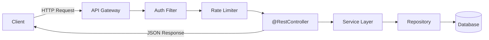
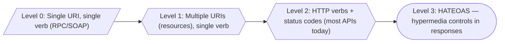
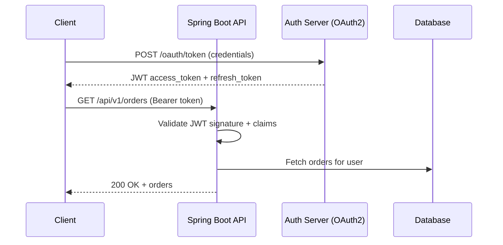

# REST API Best Practices

> Production-grade REST API design with Spring Boot. Internals, gotchas, and patterns from real-world APIs (Stripe, GitHub, Shopify).


```mermaid
flowchart LR
    Client -->|"HTTP Request"| Gateway["API Gateway"]
    Gateway --> Auth["Auth Filter"]
    Auth --> RateLimit["Rate Limiter"]
    RateLimit --> Controller["@RestController"]
    Controller --> Service["Service Layer"]
    Service --> Repo["Repository"]
    Repo --> DB[(Database)]
    Controller -->|"JSON Response"| Client
```

---

## Richardson Maturity Model

Most APIs claim to be "RESTful" but stop at Level 2. Know the levels — interviewers love this.


```mermaid
flowchart LR
    L0[/"Level 0: Single URI, single verb (RPC/SOAP)"/]
    L1{{"Level 1: Multiple URIs (resources), single verb"}}
    L2{{"Level 2: HTTP verbs + status codes (most APIs today)"}}
    L3(["Level 3: HATEOAS — hypermedia controls in responses"])
    L0 --> L1 --> L2 --> L3
```

| Level | What You Get | Example |
|-------|-------------|---------|
| 0 | Single endpoint, POST everything | `POST /api` with action in body |
| 1 | Resources with URIs | `POST /orders`, `POST /users` |
| 2 | Correct HTTP methods + status codes | `GET /orders/42` returns 200 |
| 3 | Hypermedia links guide the client | Response includes `_links` |

!!! info "Real World"
    Most production APIs (Stripe, GitHub, Twilio) live at Level 2. HATEOAS (Level 3) is rare outside enterprise. Spring HATEOAS exists, but adoption is low.

---

## URL Naming Conventions

### Golden Rules

1. **Nouns, not verbs** — the HTTP method IS the verb
2. **Plural nouns** — `/orders` not `/order`
3. **Kebab-case** — `/order-items` not `/orderItems`
4. **Hierarchy for relationships** — `/users/42/orders`
5. **Max 2 levels of nesting** — beyond that, use query params or top-level resources

| Bad | Good | Why |
|-----|------|-----|
| `GET /getUsers` | `GET /users` | Method already says GET |
| `POST /createOrder` | `POST /orders` | Redundant verb |
| `DELETE /user/1/remove` | `DELETE /users/1` | URL verb is noise |
| `/users/1/orders/5/items/3/reviews` | `/reviews?itemId=3` | Too deep |
| `/user` | `/users` | Always plural |

### Actions That Don't Map to CRUD

Some operations are inherently RPC-like. Use a verb sub-resource:

```
POST /orders/99/cancel
POST /users/42/activate
POST /payments/123/refund
POST /reports/generate
```

!!! tip "Convention"
    Stripe uses this pattern extensively: `POST /v1/charges/{id}/refund`. It is pragmatic and widely accepted.

---

## HTTP Methods and Idempotency

| Method | Semantics | Idempotent | Safe | Has Body |
|--------|-----------|:----------:|:----:|:--------:|
| GET | Read resource(s) | Yes | Yes | No |
| POST | Create / trigger action | No | No | Yes |
| PUT | Full replacement | Yes | No | Yes |
| PATCH | Partial update | No* | No | Yes |
| DELETE | Remove resource | Yes | No | No |

!!! warning "PATCH Idempotency Gotcha"
    `PATCH /users/1 {"age": 30}` looks idempotent, but `PATCH /users/1 {"balance": "+10"}` is NOT — it increments each time. PATCH is not guaranteed idempotent by the HTTP spec.

!!! danger "PUT Pitfall"
    `PUT` means **full replacement**. If you send `PUT /users/1 {"name": "Alice"}` without the `email` field, the email becomes `null`. Many teams accidentally use PUT when they mean PATCH.

### Idempotency Keys (Stripe Pattern)

For non-idempotent operations (payments, order creation), use an `Idempotency-Key` header to prevent duplicate processing on retries:

```java
@PostMapping("/payments")
public ResponseEntity<PaymentDto> createPayment(
        @RequestHeader("Idempotency-Key") String idempotencyKey,
        @Valid @RequestBody PaymentRequest request) {

    // Check cache first — return stored response if key exists
    return paymentCache.findByKey(idempotencyKey)
        .map(ResponseEntity::ok)
        .orElseGet(() -> {
            PaymentDto result = paymentService.process(request);
            paymentCache.store(idempotencyKey, result, Duration.ofHours(24));
            return ResponseEntity.status(CREATED).body(result);
        });
}
```

---

## HTTP Status Codes

### Success (2xx)

| Code | When | Spring Boot |
|------|------|-------------|
| 200 OK | GET, PUT, PATCH succeeded | `ResponseEntity.ok(body)` |
| 201 Created | POST created a resource | `ResponseEntity.created(uri).body(dto)` |
| 202 Accepted | Async job started (not done yet) | `ResponseEntity.accepted().body(jobStatus)` |
| 204 No Content | DELETE succeeded, nothing to return | `ResponseEntity.noContent().build()` |

### Client Errors (4xx)

| Code | When | Common Mistake |
|------|------|----------------|
| 400 Bad Request | Malformed JSON, missing required field | Using 400 for everything |
| 401 Unauthorized | No credentials or expired token | Confusing with 403 |
| 403 Forbidden | Authenticated but lacks permission | Should never leak resource existence |
| 404 Not Found | Resource does not exist | Returning 200 with empty body |
| 405 Method Not Allowed | POST to a GET-only endpoint | - |
| 409 Conflict | Duplicate email, optimistic lock failure | Using 400 instead |
| 422 Unprocessable Entity | Valid JSON but violates business rule | Not using at all |
| 429 Too Many Requests | Rate limit exceeded | Missing `Retry-After` header |

### Server Errors (5xx)

| Code | When |
|------|------|
| 500 Internal Server Error | Unhandled exception (your bug) |
| 502 Bad Gateway | Upstream service returned garbage |
| 503 Service Unavailable | Overloaded or in maintenance |
| 504 Gateway Timeout | Upstream took too long |

!!! danger "Never Expose Stack Traces"
    A 500 response should return a generic message in production. Stack traces leak internal architecture to attackers. Use `@RestControllerAdvice` to catch everything.

---

## Request/Response Design

### DTOs Over Entities

Never expose JPA entities directly. They leak internal schema, cause lazy-loading exceptions, and create security holes (mass assignment).

```java
// Request DTO — only fields the client can set
public record CreateProductRequest(
    @NotBlank String name,
    @Positive BigDecimal price,
    @NotNull Long categoryId
) {}

// Response DTO — only fields the client should see
public record ProductResponse(
    Long id,
    String name,
    BigDecimal price,
    String categoryName,
    Instant createdAt
) {}
```

!!! warning "Mass Assignment Attack"
    If you bind request JSON directly to a JPA entity, an attacker can send `{"role": "ADMIN"}` and escalate privileges. Always use separate DTOs.

### Response Envelope Pattern

Wrap responses in a consistent envelope for metadata:

```json
{
  "data": { "id": 42, "name": "Wireless Mouse", "price": 29.99 },
  "meta": { "requestId": "req_abc123", "timestamp": "2025-03-15T10:30:00Z" }
}
```

### HATEOAS (Level 3 REST)

The response tells the client what it can do next:

```java
@GetMapping("/{id}")
public EntityModel<OrderResponse> getOrder(@PathVariable Long id) {
    OrderResponse order = orderService.findById(id);
    return EntityModel.of(order,
        linkTo(methodOn(OrderController.class).getOrder(id)).withSelfRel(),
        linkTo(methodOn(OrderController.class).cancelOrder(id)).withRel("cancel"),
        linkTo(methodOn(PaymentController.class).getPayment(order.paymentId())).withRel("payment")
    );
}
```

Response:

```json
{
  "id": 99,
  "status": "PENDING",
  "total": 149.99,
  "_links": {
    "self": { "href": "/api/v1/orders/99" },
    "cancel": { "href": "/api/v1/orders/99/cancel" },
    "payment": { "href": "/api/v1/payments/pay_abc" }
  }
}
```

---

## Pagination

### Offset-Based vs Cursor-Based

| | Offset (`?page=5&size=20`) | Cursor (`?after=abc123&limit=20`) |
|---|---|---|
| Pros | Simple, random access | Stable with real-time inserts/deletes |
| Cons | Skips/duplicates on concurrent writes, slow at high offsets (DB does `OFFSET 10000`) | No random access, no "jump to page 5" |
| Use When | Admin dashboards, moderate data | Feeds, infinite scroll, large datasets |

!!! info "Why High Offsets Are Slow"
    `SELECT * FROM products OFFSET 100000 LIMIT 20` — the DB still scans 100,000 rows to skip them. Cursor pagination uses `WHERE id > :lastId LIMIT 20` which uses an index seek.

### Spring Boot Offset Pagination

```java
@GetMapping("/products")
public ResponseEntity<Page<ProductResponse>> listProducts(
        @PageableDefault(size = 20, sort = "createdAt", direction = DESC) Pageable pageable) {
    return ResponseEntity.ok(productService.findAll(pageable));
}
```

Request: `GET /api/v1/products?page=0&size=20&sort=price,asc`

### Spring Boot Cursor Pagination

```java
@GetMapping("/feed")
public ResponseEntity<CursorPage<PostResponse>> getFeed(
        @RequestParam(required = false) String after,
        @RequestParam(defaultValue = "20") int limit) {

    List<Post> posts = (after == null)
        ? postRepo.findTopByOrderByCreatedAtDesc(Limit.of(limit + 1))
        : postRepo.findByIdLessThanOrderByCreatedAtDesc(decodeCursor(after), Limit.of(limit + 1));

    boolean hasMore = posts.size() > limit;
    if (hasMore) posts = posts.subList(0, limit);

    String nextCursor = hasMore ? encodeCursor(posts.getLast().getId()) : null;
    return ResponseEntity.ok(new CursorPage<>(posts.stream().map(this::toDto).toList(), nextCursor));
}
```

---

## Filtering, Sorting, Searching

### Filtering

Use query params. Keep it flat and composable:

```
GET /api/v1/products?category=electronics&minPrice=10&maxPrice=100&inStock=true
```

Spring Boot with Specification pattern:

```java
@GetMapping("/products")
public Page<ProductResponse> search(
        @RequestParam(required = false) String category,
        @RequestParam(required = false) BigDecimal minPrice,
        @RequestParam(required = false) BigDecimal maxPrice,
        @RequestParam(required = false) Boolean inStock,
        Pageable pageable) {

    Specification<Product> spec = Specification.where(null);
    if (category != null) spec = spec.and(hasCategory(category));
    if (minPrice != null) spec = spec.and(priceGreaterThan(minPrice));
    if (maxPrice != null) spec = spec.and(priceLessThan(maxPrice));
    if (inStock != null) spec = spec.and(isInStock(inStock));

    return productRepo.findAll(spec, pageable).map(mapper::toResponse);
}
```

### Sorting

```
GET /api/v1/products?sort=price,asc&sort=name,desc
```

Spring's `Pageable` handles multi-field sorting automatically from query params.

### Full-Text Search

```
GET /api/v1/products?q=wireless+mouse
```

For simple cases, use `LIKE` or PostgreSQL `tsvector`. For production search, offload to Elasticsearch/OpenSearch and expose a `/search` endpoint.

---

## Versioning Strategies

| Strategy | Example | Pros | Cons |
|----------|---------|------|------|
| URI Path | `/api/v1/users` | Explicit, cacheable, easy to route | URL changes |
| Custom Header | `X-API-Version: 2` | Clean URLs | Hidden, not cacheable |
| Media Type | `Accept: application/vnd.app.v2+json` | RESTful purist choice | Complex, tooling issues |
| Query Param | `?version=2` | Simple | Ugly, caching issues |

=== "URI Path (Recommended)"

    ```java
    @RestController
    @RequestMapping("/api/v1/orders")
    public class OrderControllerV1 {
        @GetMapping("/{id}")
        public OrderV1Response getOrder(@PathVariable Long id) { ... }
    }

    @RestController
    @RequestMapping("/api/v2/orders")
    public class OrderControllerV2 {
        @GetMapping("/{id}")
        public OrderV2Response getOrder(@PathVariable Long id) { ... }
    }
    ```

=== "Media Type"

    ```java
    @GetMapping(value = "/{id}", produces = "application/vnd.myapp.v2+json")
    public OrderV2Response getOrderV2(@PathVariable Long id) { ... }
    ```

=== "Header-Based"

    ```java
    @GetMapping(value = "/{id}", headers = "X-API-Version=2")
    public OrderV2Response getOrderV2(@PathVariable Long id) { ... }
    ```

!!! tip "Industry Choice"
    Stripe, Google, and GitHub all use URI path versioning. It is the most debuggable (visible in logs, browser, curl).

---

## Error Handling — RFC 7807 Problem Details

Spring Boot 3+ supports RFC 7807 natively. No more custom error formats.

### Standard Error Response

```json
{
  "type": "https://api.shopify.example/errors/out-of-stock",
  "title": "Product Out of Stock",
  "status": 409,
  "detail": "Product 'Wireless Mouse' (SKU: WM-001) has 0 units available",
  "instance": "/api/v1/orders",
  "timestamp": "2025-03-15T10:30:00Z",
  "errors": [
    { "field": "items[0].quantity", "message": "requested 5 but only 0 available" }
  ]
}
```

### Spring Boot 3 Implementation

```java
@RestControllerAdvice
public class GlobalExceptionHandler extends ResponseEntityExceptionHandler {

    @ExceptionHandler(ResourceNotFoundException.class)
    public ProblemDetail handleNotFound(ResourceNotFoundException ex, HttpServletRequest req) {
        ProblemDetail pd = ProblemDetail.forStatusAndDetail(HttpStatus.NOT_FOUND, ex.getMessage());
        pd.setTitle("Resource Not Found");
        pd.setType(URI.create("https://api.example.com/errors/not-found"));
        pd.setInstance(URI.create(req.getRequestURI()));
        pd.setProperty("timestamp", Instant.now());
        return pd;
    }

    @ExceptionHandler(MethodArgumentNotValidException.class)
    public ProblemDetail handleValidation(MethodArgumentNotValidException ex) {
        ProblemDetail pd = ProblemDetail.forStatusAndDetail(HttpStatus.BAD_REQUEST, "Validation failed");
        pd.setTitle("Validation Error");

        List<Map<String, String>> fieldErrors = ex.getBindingResult().getFieldErrors().stream()
            .map(fe -> Map.of("field", fe.getField(), "message", fe.getDefaultMessage()))
            .toList();
        pd.setProperty("errors", fieldErrors);
        return pd;
    }

    @ExceptionHandler(OptimisticLockingFailureException.class)
    public ProblemDetail handleConflict(OptimisticLockingFailureException ex) {
        ProblemDetail pd = ProblemDetail.forStatusAndDetail(HttpStatus.CONFLICT, ex.getMessage());
        pd.setTitle("Conflict — Resource Modified");
        pd.setProperty("suggestion", "Re-fetch the resource and retry your update");
        return pd;
    }

    // Catch-all: never leak stack traces
    @ExceptionHandler(Exception.class)
    public ProblemDetail handleUnexpected(Exception ex) {
        log.error("Unhandled exception", ex);
        return ProblemDetail.forStatusAndDetail(
            HttpStatus.INTERNAL_SERVER_ERROR, "An unexpected error occurred");
    }
}
```

!!! tip "Enable RFC 7807 Globally"
    In `application.yml`:
    ```yaml
    spring:
      mvc:
        problemdetails:
          enabled: true
    ```

---

## Rate Limiting

### Response Headers (Industry Standard)

```
HTTP/1.1 200 OK
X-RateLimit-Limit: 1000
X-RateLimit-Remaining: 742
X-RateLimit-Reset: 1623456789

HTTP/1.1 429 Too Many Requests
Retry-After: 30
X-RateLimit-Limit: 1000
X-RateLimit-Remaining: 0
```

### Spring Boot with Bucket4j

```java
@Component
public class RateLimitFilter extends OncePerRequestFilter {

    private final Map<String, Bucket> buckets = new ConcurrentHashMap<>();

    @Override
    protected void doFilterInternal(HttpServletRequest req, HttpServletResponse res,
                                     FilterChain chain) throws ServletException, IOException {
        String clientId = resolveClientId(req);
        Bucket bucket = buckets.computeIfAbsent(clientId, this::createBucket);
        ConsumptionProbe probe = bucket.tryConsumeAndReturnRemaining(1);

        res.setHeader("X-RateLimit-Limit", "100");
        res.setHeader("X-RateLimit-Remaining", String.valueOf(probe.getRemainingTokens()));

        if (probe.isConsumed()) {
            chain.doFilter(req, res);
        } else {
            res.setStatus(HttpStatus.TOO_MANY_REQUESTS.value());
            res.setHeader("Retry-After", String.valueOf(probe.getNanosToWaitForRefill() / 1_000_000_000));
            res.getWriter().write("{\"title\":\"Rate Limit Exceeded\",\"status\":429}");
        }
    }

    private Bucket createBucket(String key) {
        return Bucket.builder()
            .addLimit(Bandwidth.classic(100, Refill.intervally(100, Duration.ofMinutes(1))))
            .build();
    }
}
```

!!! info "Production Rate Limiting"
    For distributed systems, use Redis-backed rate limiting (Spring Cloud Gateway has built-in `RequestRateLimiter` filter with Redis). Single-node `ConcurrentHashMap` only works for single-instance deployments.

---

## Content Negotiation

Spring Boot auto-negotiates based on the `Accept` header. Add XML support with one dependency:

```xml
<!-- pom.xml -->
<dependency>
    <groupId>com.fasterxml.jackson.dataformat</groupId>
    <artifactId>jackson-dataformat-xml</artifactId>
</dependency>
```

```java
@GetMapping(value = "/{id}", produces = {
    MediaType.APPLICATION_JSON_VALUE,
    MediaType.APPLICATION_XML_VALUE
})
public ProductResponse getProduct(@PathVariable Long id) {
    return productService.findById(id);
}
```

Request with `Accept: application/xml` returns XML. Default is JSON.

!!! warning "Content-Type vs Accept"
    `Content-Type` = "I am sending you this format" (request body). `Accept` = "I want the response in this format". Mixing these up is a common interview mistake.

---

## API Documentation — SpringDoc / OpenAPI

### Setup

```xml
<dependency>
    <groupId>org.springdoc</groupId>
    <artifactId>springdoc-openapi-starter-webmvc-ui</artifactId>
    <version>2.5.0</version>
</dependency>
```

```yaml
# application.yml
springdoc:
  api-docs:
    path: /api-docs
  swagger-ui:
    path: /swagger-ui.html
    operations-sorter: method
```

### Annotating Endpoints

```java
@Operation(summary = "Create a new order", description = "Places an order for the authenticated user")
@ApiResponses({
    @ApiResponse(responseCode = "201", description = "Order created"),
    @ApiResponse(responseCode = "400", description = "Invalid request body"),
    @ApiResponse(responseCode = "409", description = "Insufficient stock")
})
@PostMapping("/orders")
public ResponseEntity<OrderResponse> createOrder(
        @Valid @RequestBody @io.swagger.v3.oas.annotations.parameters.RequestBody(
            description = "Order details") CreateOrderRequest request) {
    // ...
}
```

!!! tip "Documentation as Code"
    SpringDoc generates the OpenAPI spec from your code. Keep annotations close to controller methods. The Swagger UI at `/swagger-ui.html` is auto-generated — no separate YAML file needed.

---

## Security Best Practices

### Authentication Flow


```mermaid
sequenceDiagram
    participant Client
    participant API as Spring Boot API
    participant Auth as Auth Server (OAuth2)
    participant DB as Database

    Client->>Auth: POST /oauth/token (credentials)
    Auth-->>Client: JWT access_token + refresh_token
    Client->>API: GET /api/v1/orders (Bearer token)
    API->>API: Validate JWT signature + claims
    API->>DB: Fetch orders for user
    API-->>Client: 200 OK + orders
```

### Security Checklist

| Practice | Implementation |
|----------|---------------|
| Always HTTPS | Redirect HTTP -> HTTPS at load balancer |
| Use short-lived JWTs | 15 min access token + refresh token |
| Validate all input | `@Valid` + Bean Validation + custom validators |
| Rate limit auth endpoints | Stricter limits on `/login`, `/register` |
| CORS restrictions | Explicit allowed origins, never `*` in production |
| No sensitive data in URLs | Tokens/passwords in headers or body only |
| Audit logging | Log who did what, when, from where |

### CORS Configuration

```java
@Configuration
public class CorsConfig {

    @Bean
    public WebMvcConfigurer corsConfigurer() {
        return new WebMvcConfigurer() {
            @Override
            public void addCorsMappings(CorsRegistry registry) {
                registry.addMapping("/api/**")
                    .allowedOrigins("https://myapp.com", "https://admin.myapp.com")
                    .allowedMethods("GET", "POST", "PUT", "PATCH", "DELETE")
                    .allowedHeaders("Authorization", "Content-Type")
                    .exposedHeaders("X-RateLimit-Remaining")
                    .maxAge(3600);
            }
        };
    }
}
```

### Input Validation

```java
public record CreateUserRequest(
    @NotBlank @Size(min = 2, max = 50)
    String name,

    @NotBlank @Email
    String email,

    @NotBlank @Size(min = 8, max = 100)
    @Pattern(regexp = "^(?=.*[A-Z])(?=.*[0-9])(?=.*[!@#$%]).+$",
             message = "must contain uppercase, digit, and special char")
    String password,

    @Past
    LocalDate dateOfBirth
) {}
```

!!! danger "SQL Injection Still Happens"
    Never concatenate user input into queries. Use `@Query` with `:namedParams` or Spring Data derived methods. JPA parameterized queries handle escaping.

---

## Complete Controller Example (E-Commerce)

Putting it all together — a production-style controller:

```java
@RestController
@RequestMapping("/api/v1/products")
@RequiredArgsConstructor
@Tag(name = "Products", description = "Product catalog management")
public class ProductController {

    private final ProductService productService;

    @GetMapping
    @Operation(summary = "List products with filtering and pagination")
    public ResponseEntity<Page<ProductResponse>> listProducts(
            @RequestParam(required = false) String category,
            @RequestParam(required = false) BigDecimal minPrice,
            @RequestParam(required = false) BigDecimal maxPrice,
            @RequestParam(required = false) String q,
            @PageableDefault(size = 20, sort = "createdAt", direction = DESC) Pageable pageable) {
        return ResponseEntity.ok(productService.search(category, minPrice, maxPrice, q, pageable));
    }

    @GetMapping("/{id}")
    @Operation(summary = "Get product by ID")
    public ResponseEntity<ProductResponse> getProduct(@PathVariable Long id) {
        return ResponseEntity.ok(productService.findById(id));
    }

    @PostMapping
    @PreAuthorize("hasRole('ADMIN')")
    @Operation(summary = "Create a new product (admin only)")
    public ResponseEntity<ProductResponse> createProduct(
            @Valid @RequestBody CreateProductRequest request) {
        ProductResponse created = productService.create(request);
        URI location = ServletUriComponentsBuilder.fromCurrentRequest()
            .path("/{id}").buildAndExpand(created.id()).toUri();
        return ResponseEntity.created(location).body(created);
    }

    @PutMapping("/{id}")
    @PreAuthorize("hasRole('ADMIN')")
    public ResponseEntity<ProductResponse> replaceProduct(
            @PathVariable Long id,
            @Valid @RequestBody UpdateProductRequest request) {
        return ResponseEntity.ok(productService.replace(id, request));
    }

    @PatchMapping("/{id}")
    @PreAuthorize("hasRole('ADMIN')")
    public ResponseEntity<ProductResponse> updateProduct(
            @PathVariable Long id,
            @Valid @RequestBody PatchProductRequest request) {
        return ResponseEntity.ok(productService.patch(id, request));
    }

    @DeleteMapping("/{id}")
    @PreAuthorize("hasRole('ADMIN')")
    @ResponseStatus(HttpStatus.NO_CONTENT)
    public void deleteProduct(@PathVariable Long id) {
        productService.delete(id);
    }
}
```

---

## Interview Questions & Answers

??? question "1. What is the Richardson Maturity Model?"
    Four levels of REST maturity. Level 0: single URI, single verb (RPC). Level 1: resources with URIs. Level 2: proper HTTP verbs and status codes. Level 3: HATEOAS with hypermedia links. Most production APIs (Stripe, GitHub) target Level 2. Level 3 adds discoverability but is rarely implemented due to complexity and client coupling.

??? question "2. PUT vs PATCH — when do you use each?"
    PUT = full replacement. You must send ALL fields; missing ones become null. PATCH = partial update, only send changed fields. Gotcha: PUT is always idempotent, PATCH is NOT guaranteed idempotent (e.g., `{"balance": "+10"}`). Use PATCH for typical "update this field" operations. Use PUT when the client owns the full representation.

??? question "3. How do you make POST idempotent?"
    Use an `Idempotency-Key` header. The client generates a unique key (UUID). Server stores the key + response. On retry with the same key, return the cached response instead of processing again. Stripe popularized this pattern. Store keys in Redis with a TTL (24h is typical).

??? question "4. What is the difference between 401 and 403?"
    401 Unauthorized = not authenticated (who are you? show credentials). 403 Forbidden = authenticated but not authorized (I know who you are, you cannot do this). On a 401, the client should re-authenticate. On a 403, re-authenticating will not help — the user lacks the required role/permission.

??? question "5. Offset pagination vs cursor pagination — tradeoffs?"
    Offset: simple, supports "jump to page N", but breaks with concurrent writes (skipped/duplicate items) and degrades at high offsets (DB scans all skipped rows). Cursor: stable under concurrent writes, fast at any depth (uses index seek), but no random page access. Use offset for admin dashboards; cursor for user-facing feeds and infinite scroll.

??? question "6. How does Spring Boot 3 handle RFC 7807 Problem Details?"
    Spring Boot 3 has native support. Return `ProblemDetail` from exception handlers. Set `spring.mvc.problemdetails.enabled=true`. The response automatically includes `type`, `title`, `status`, `detail`, `instance`. You can add custom properties via `setProperty()`. Extend `ResponseEntityExceptionHandler` in your `@RestControllerAdvice` for consistent error formatting.

??? question "7. How do you prevent mass assignment vulnerabilities?"
    Never bind request JSON directly to JPA entities. Use separate request DTOs with only the fields the client is allowed to set. The DTO is validated with Bean Validation, then mapped to the entity in the service layer. This prevents attackers from injecting fields like `role` or `isAdmin` that exist on the entity but should not be client-settable.

??? question "8. Why is URI path versioning preferred over header versioning?"
    URI path (`/api/v1/`) is visible in logs, browser address bars, curl commands, and cache keys. Header versioning hides the version, making debugging harder. URI path works with all HTTP caches (CDNs, proxies) without custom config. Downside: version is part of the URL, so URL changes on version bump — but in practice this is manageable.

??? question "9. How do you implement rate limiting in a distributed system?"
    Use a centralized store (Redis) with a sliding window or token bucket algorithm. Spring Cloud Gateway has a built-in `RequestRateLimiter` filter backed by Redis. Return `429 Too Many Requests` with `Retry-After` and `X-RateLimit-*` headers. For per-user limits, key on the authenticated user ID; for anonymous, key on IP (but beware shared IPs behind NAT/CDN).

??? question "10. What is content negotiation and how does Spring handle it?"
    The client specifies desired response format via the `Accept` header. Spring Boot resolves the best matching `HttpMessageConverter`. JSON is the default (Jackson). Add `jackson-dataformat-xml` for XML support. Use `produces` in `@GetMapping` to restrict formats. Custom media types (e.g., `application/vnd.app.v2+json`) enable media-type versioning.

??? question "11. How do you design a search/filter API that scales?"
    Flat query parameters for simple filters (`?status=active&minPrice=10`). Use Spring Data Specifications for composable, type-safe queries. For full-text search, offload to Elasticsearch. Always combine filters with pagination. Add index hints for common query patterns. Avoid allowing arbitrary `ORDER BY` — whitelist sortable fields to prevent index misses.

??? question "12. What HTTP status code do you return for validation errors vs business rule violations?"
    400 Bad Request for syntactic/structural issues (malformed JSON, missing required fields, type mismatches). 422 Unprocessable Entity for semantic/business rule violations (valid JSON but "cannot place order — insufficient balance"). In practice, many APIs use 400 for both — the key is consistent, structured error bodies with field-level details.

??? question "13. How do you secure a REST API beyond authentication?"
    Input validation (Bean Validation + custom). Rate limiting (per-user and per-endpoint). CORS restrictions (explicit origins, never `*`). HTTPS everywhere. Short-lived tokens (15 min JWT + refresh). Audit logging. No sensitive data in URLs or logs. OWASP headers (X-Content-Type-Options, Strict-Transport-Security). SQL injection prevention via parameterized queries. Principle of least privilege on endpoints (`@PreAuthorize`).

??? question "14. When should you use 202 Accepted?"
    When the server has accepted the request but processing is not yet complete. Classic examples: video transcoding, report generation, bulk imports. Return a 202 with a body containing a job ID and a status-check URL (`Location: /api/v1/jobs/abc123`). The client polls or uses webhooks to get the final result. Never return 200 and pretend async work is done.

??? question "15. What is HATEOAS and is it worth implementing?"
    HATEOAS = responses include links to available actions (like HTML links for machines). Benefit: client decouples from URL structure; the API becomes self-documenting. Cost: extra complexity, larger payloads, clients rarely use it dynamically. Verdict: valuable for public APIs with many consumers (reduces breaking changes). Overkill for internal microservice-to-microservice calls where both sides are under your control.
