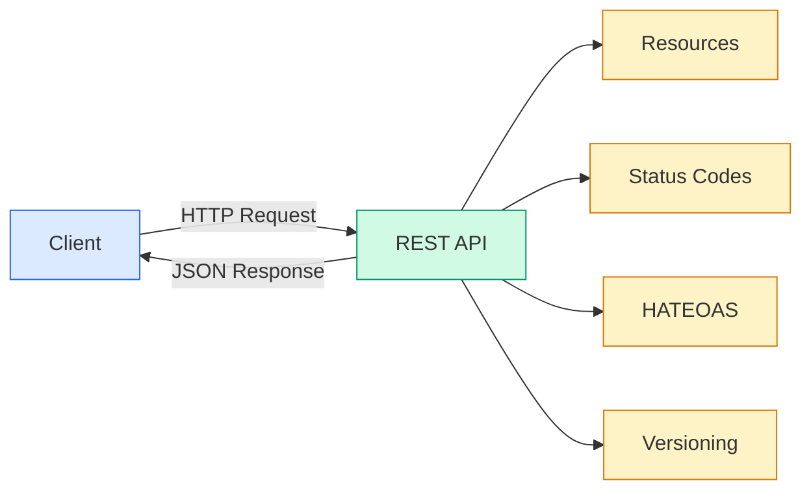
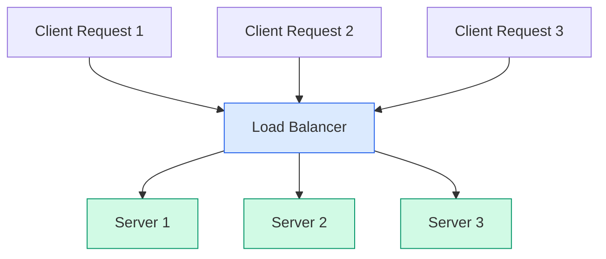

# 🌐 REST API Best Practices

> **Design APIs like a FAANG engineer — naming conventions, status codes, pagination, error handling, and more.**


```mermaid
flowchart LR
    A["Client"] -->|HTTP Request| B["REST API"]
    B -->|JSON Response| A
    B --> C["Resources"]
    B --> D["Status Codes"]
    B --> E["HATEOAS"]
    B --> F["Versioning"]

    style A fill:#DBEAFE,stroke:#2563EB
    style B fill:#D1FAE5,stroke:#059669
    style C fill:#FEF3C7,stroke:#D97706
    style D fill:#FEF3C7,stroke:#D97706
    style E fill:#FEF3C7,stroke:#D97706
    style F fill:#FEF3C7,stroke:#D97706
```

---

## 🧠 What is REST?

!!! abstract "REST = Representational State Transfer"
    REST is an architectural style for building APIs that uses HTTP methods to perform CRUD operations on **resources** (represented as URLs). A RESTful API is **stateless** — each request contains all information needed to process it.

### Stateless Architecture


```mermaid
flowchart TD
    A["Client Request 1"] --> LB["Load Balancer"]
    B["Client Request 2"] --> LB
    C["Client Request 3"] --> LB
    LB --> S1["Server 1"]
    LB --> S2["Server 2"]
    LB --> S3["Server 3"]

    style LB fill:#DBEAFE,stroke:#2563EB
    style S1 fill:#D1FAE5,stroke:#059669
    style S2 fill:#D1FAE5,stroke:#059669
    style S3 fill:#D1FAE5,stroke:#059669
```

!!! tip "Why Stateless?"
    - **Scalable** — Any server can handle any request
    - **Available** — If a server fails, traffic routes elsewhere
    - **Simple** — No session state to synchronize

---

## 📝 HTTP Methods

| Method | Purpose | Idempotent | Safe | Request Body |
|--------|---------|:----------:|:----:|:------------:|
| **GET** | Retrieve resource(s) | ✅ | ✅ | No |
| **POST** | Create a resource | ❌ | ❌ | Yes |
| **PUT** | Full update (replace) | ✅ | ❌ | Yes |
| **PATCH** | Partial update | ❌ | ❌ | Yes |
| **DELETE** | Remove a resource | ✅ | ❌ | No |

!!! tip "Idempotent = Same result no matter how many times you call it"
    - `PUT /users/1 {name: "John"}` — always results in the same state
    - `POST /users {name: "John"}` — creates a NEW user each time
    - `DELETE /users/1` — first call deletes, subsequent calls return 404 (same final state)

### Spring Boot Controller Example

```java
@RestController
@RequestMapping("/api/v1/users")
@RequiredArgsConstructor
public class UserController {

    private final UserService userService;

    @GetMapping
    public ResponseEntity<Page<UserDto>> getUsers(
            @RequestParam(defaultValue = "0") int page,
            @RequestParam(defaultValue = "20") int size) {
        return ResponseEntity.ok(userService.findAll(PageRequest.of(page, size)));
    }

    @GetMapping("/{id}")
    public ResponseEntity<UserDto> getUser(@PathVariable Long id) {
        return ResponseEntity.ok(userService.findById(id));
    }

    @PostMapping
    public ResponseEntity<UserDto> createUser(@Valid @RequestBody CreateUserRequest request) {
        UserDto created = userService.create(request);
        URI location = URI.create("/api/v1/users/" + created.getId());
        return ResponseEntity.created(location).body(created);
    }

    @PutMapping("/{id}")
    public ResponseEntity<UserDto> updateUser(
            @PathVariable Long id,
            @Valid @RequestBody UpdateUserRequest request) {
        return ResponseEntity.ok(userService.update(id, request));
    }

    @PatchMapping("/{id}")
    public ResponseEntity<UserDto> patchUser(
            @PathVariable Long id,
            @RequestBody Map<String, Object> updates) {
        return ResponseEntity.ok(userService.patch(id, updates));
    }

    @DeleteMapping("/{id}")
    public ResponseEntity<Void> deleteUser(@PathVariable Long id) {
        userService.delete(id);
        return ResponseEntity.noContent().build();
    }
}
```

---

## 📊 HTTP Status Codes

### Success (2xx)

| Code | Meaning | When to Use |
|------|---------|-------------|
| `200 OK` | Request succeeded | GET, PUT, PATCH responses |
| `201 Created` | Resource created | POST (include `Location` header) |
| `202 Accepted` | Processing started | Async operations |
| `204 No Content` | Success, no body | DELETE, PUT with no response body |

### Client Errors (4xx)

| Code | Meaning | When to Use |
|------|---------|-------------|
| `400 Bad Request` | Invalid input | Validation failure, malformed JSON |
| `401 Unauthorized` | Not authenticated | Missing or invalid credentials |
| `403 Forbidden` | Not authorized | Authenticated but lacks permission |
| `404 Not Found` | Resource doesn't exist | Invalid ID or path |
| `405 Method Not Allowed` | Wrong HTTP method | POST to a GET-only endpoint |
| `409 Conflict` | State conflict | Duplicate resource, version mismatch |
| `422 Unprocessable Entity` | Semantic error | Valid JSON but business rule violation |
| `429 Too Many Requests` | Rate limited | Include `Retry-After` header |

### Server Errors (5xx)

| Code | Meaning | When to Use |
|------|---------|-------------|
| `500 Internal Server Error` | Unexpected failure | Unhandled exceptions |
| `502 Bad Gateway` | Upstream failure | Downstream service unavailable |
| `503 Service Unavailable` | Temporarily down | Maintenance, overloaded |

---

## 🏷️ Naming Conventions

!!! tip "Golden Rules"
    1. **Use nouns, not verbs** — resources are things, not actions
    2. **Use plural nouns** — `/users` not `/user`
    3. **Use kebab-case** — `/order-items` not `/orderItems`
    4. **Use hierarchy for relationships** — `/users/42/orders`

| ❌ Bad | ✅ Good | Why |
|--------|---------|-----|
| `/getUsers` | `/users` | HTTP method already implies GET |
| `/createUser` | `POST /users` | Verb is redundant with HTTP method |
| `/user/1/delete` | `DELETE /users/1` | Use HTTP method, not URL verb |
| `/getUserOrders` | `/users/1/orders` | Use hierarchy |
| `/user` | `/users` | Always plural |

### Special Actions (RPC-style exceptions)

Some operations don't map cleanly to CRUD. Use a verb sub-resource:

```
POST /users/42/activate
POST /orders/99/cancel
POST /reports/generate
```

---

## 📖 Versioning Strategies

=== "URI Path (Most Common)"

    ```
    GET /api/v1/users
    GET /api/v2/users
    ```

    ```java
    @RestController
    @RequestMapping("/api/v1/users")
    public class UserControllerV1 { }

    @RestController
    @RequestMapping("/api/v2/users")
    public class UserControllerV2 { }
    ```

=== "Request Header"

    ```
    GET /api/users
    Accept: application/vnd.myapp.v2+json
    ```

    ```java
    @GetMapping(value = "/users", headers = "X-API-Version=2")
    public List<UserV2Dto> getUsersV2() { }
    ```

=== "Query Parameter"

    ```
    GET /api/users?version=2
    ```

    ```java
    @GetMapping(value = "/users", params = "version=2")
    public List<UserV2Dto> getUsersV2() { }
    ```

!!! tip "Recommendation"
    **URI Path versioning** is the most explicit, cacheable, and widely used in industry (Google, Stripe, GitHub).

---

## 📄 Pagination

### Request

```
GET /api/v1/users?page=0&size=20&sort=createdAt,desc
```

### Response (Spring Data Style)

```json
{
  "content": [
    {"id": 1, "name": "Alice"},
    {"id": 2, "name": "Bob"}
  ],
  "page": {
    "number": 0,
    "size": 20,
    "totalElements": 156,
    "totalPages": 8
  }
}
```

### Spring Boot Implementation

```java
@GetMapping
public ResponseEntity<Page<UserDto>> getUsers(
        @PageableDefault(size = 20, sort = "createdAt", direction = Sort.Direction.DESC)
        Pageable pageable) {
    return ResponseEntity.ok(userService.findAll(pageable));
}
```

---

## ❌ Error Handling (RFC 7807 — Problem Details)

!!! abstract "Standard Error Format"
    RFC 7807 defines a standard JSON format for error responses, supported natively in Spring Boot 3+.

### Error Response Structure

```json
{
  "type": "https://api.myapp.com/errors/validation-failed",
  "title": "Validation Failed",
  "status": 400,
  "detail": "The request body contains invalid fields",
  "instance": "/api/v1/users",
  "errors": [
    {
      "field": "email",
      "message": "must be a valid email address"
    },
    {
      "field": "age",
      "message": "must be greater than 0"
    }
  ]
}
```

### Spring Boot 3 Implementation

```java
@RestControllerAdvice
public class GlobalExceptionHandler extends ResponseEntityExceptionHandler {

    @ExceptionHandler(ResourceNotFoundException.class)
    public ProblemDetail handleNotFound(ResourceNotFoundException ex) {
        ProblemDetail problem = ProblemDetail.forStatusAndDetail(
            HttpStatus.NOT_FOUND, ex.getMessage());
        problem.setTitle("Resource Not Found");
        problem.setType(URI.create("https://api.myapp.com/errors/not-found"));
        return problem;
    }

    @ExceptionHandler(ConstraintViolationException.class)
    public ProblemDetail handleValidation(ConstraintViolationException ex) {
        ProblemDetail problem = ProblemDetail.forStatusAndDetail(
            HttpStatus.BAD_REQUEST, "Validation failed");
        problem.setTitle("Validation Error");

        List<Map<String, String>> errors = ex.getConstraintViolations().stream()
            .map(v -> Map.of(
                "field", v.getPropertyPath().toString(),
                "message", v.getMessage()))
            .toList();

        problem.setProperty("errors", errors);
        return problem;
    }
}
```

---

## 🔗 HATEOAS (Hypermedia as the Engine of Application State)

!!! abstract "What is HATEOAS?"
    The API response includes **links** telling the client what actions are available next — no need to hardcode URLs.

```json
{
  "id": 42,
  "name": "John Doe",
  "email": "john@example.com",
  "_links": {
    "self": { "href": "/api/v1/users/42" },
    "orders": { "href": "/api/v1/users/42/orders" },
    "update": { "href": "/api/v1/users/42", "method": "PUT" },
    "delete": { "href": "/api/v1/users/42", "method": "DELETE" }
  }
}
```

### Spring HATEOAS Example

```java
@GetMapping("/{id}")
public EntityModel<UserDto> getUser(@PathVariable Long id) {
    UserDto user = userService.findById(id);

    return EntityModel.of(user,
        linkTo(methodOn(UserController.class).getUser(id)).withSelfRel(),
        linkTo(methodOn(UserController.class).getUsers(Pageable.unpaged())).withRel("users"),
        linkTo(methodOn(OrderController.class).getOrdersByUser(id)).withRel("orders")
    );
}
```

---

## 🔄 Content Negotiation

Allow clients to specify desired response format:

```java
@GetMapping(value = "/{id}", produces = {
    MediaType.APPLICATION_JSON_VALUE,
    MediaType.APPLICATION_XML_VALUE
})
public UserDto getUser(@PathVariable Long id) {
    return userService.findById(id);
}
```

**Client specifies format via `Accept` header:**

```
GET /api/v1/users/42
Accept: application/json

GET /api/v1/users/42
Accept: application/xml
```

---

## 🛡️ Idempotency

!!! warning "Why Idempotency Matters"
    Network failures happen. If a client retries a request, will it cause duplicate side effects?

### Idempotency Key Pattern

```java
@PostMapping("/payments")
public ResponseEntity<PaymentDto> createPayment(
        @RequestHeader("Idempotency-Key") String idempotencyKey,
        @Valid @RequestBody PaymentRequest request) {

    // Check if this key was already processed
    Optional<Payment> existing = paymentService.findByIdempotencyKey(idempotencyKey);
    if (existing.isPresent()) {
        return ResponseEntity.ok(toDto(existing.get())); // Return cached response
    }

    Payment payment = paymentService.process(request, idempotencyKey);
    return ResponseEntity.status(HttpStatus.CREATED).body(toDto(payment));
}
```

---

## 🚦 Rate Limiting

Include rate limit info in response headers:

```
HTTP/1.1 200 OK
X-RateLimit-Limit: 100
X-RateLimit-Remaining: 87
X-RateLimit-Reset: 1623456789

HTTP/1.1 429 Too Many Requests
Retry-After: 60
```

---

## 📋 Complete Best Practices Checklist

| Practice | Description |
|----------|-------------|
| Use nouns, not verbs | `/users` not `/getUsers` |
| Use plural resources | `/orders` not `/order` |
| Use proper HTTP methods | GET=read, POST=create, PUT=replace, PATCH=update, DELETE=remove |
| Return proper status codes | 201 for created, 204 for deleted, 404 for not found |
| Version your API | `/api/v1/...` |
| Paginate collections | `?page=0&size=20` |
| Support filtering/sorting | `?status=active&sort=name,asc` |
| Use Problem Details for errors | RFC 7807 format |
| Implement rate limiting | 429 + Retry-After header |
| Use HTTPS always | Never expose plain HTTP |
| Document with OpenAPI/Swagger | Auto-generate from code |
| Use idempotency keys | For non-idempotent operations |

---

## 🎯 Interview Questions & Answers

??? question "1. What makes an API RESTful?"
    A RESTful API follows REST principles: uses HTTP methods correctly, is stateless, identifies resources via URIs, uses standard status codes, and supports content negotiation. Bonus: uses HATEOAS for discoverability.

??? question "2. What is the difference between PUT and PATCH?"
    **PUT** replaces the entire resource (send ALL fields — missing fields become null). **PATCH** updates only the specified fields (partial update). PUT is idempotent; PATCH is not necessarily idempotent.

??? question "3. What does idempotent mean?"
    An operation is idempotent if making the same request multiple times produces the same result as making it once. GET, PUT, DELETE are idempotent. POST is NOT idempotent (each call may create a new resource).

??? question "4. How do you handle errors in a REST API?"
    Use appropriate HTTP status codes (4xx for client errors, 5xx for server errors) and return structured error bodies following RFC 7807 (Problem Details). Include: type, title, status, detail, and optionally field-level errors.

??? question "5. What is HATEOAS?"
    Hypermedia as the Engine of Application State. The API response includes links to related resources and available actions, allowing clients to navigate the API dynamically without hardcoded URLs. It's the highest maturity level (Level 3) of the Richardson Maturity Model.

??? question "6. How do you version a REST API?"
    Three strategies: **URI path** (`/api/v1/users` — most common), **Header** (`Accept: application/vnd.app.v2+json`), **Query param** (`?version=2`). URI path is simplest and most cacheable.

??? question "7. What is the difference between 401 and 403?"
    **401 Unauthorized** = not authenticated (who are you?). **403 Forbidden** = authenticated but not authorized (I know who you are, but you cannot do this). 401 means "log in again"; 403 means "you do not have permission."

??? question "8. How should you implement pagination?"
    Use query parameters (`?page=0&size=20&sort=field,direction`). Return metadata with the response: current page, total elements, total pages. Spring Data's `Pageable` + `Page<T>` handles this out of the box.
