# Spring Security Filter Chain Internals

> "Security is not a product, but a chain of decisions — each filter in the chain is a gate that either lets the request pass or stops it dead."

---

!!! danger "Real Incident: Auth Bypass via Misconfigured Filter Order"
    A production e-commerce platform suffered a **complete admin panel breach** because a developer added a custom JWT filter **after** the `AuthorizationFilter`. Requests to `/admin/**` reached the authorization check *before* the JWT was validated, so the `SecurityContextHolder` was empty and the `AnonymousAuthenticationFilter` marked every request as "anonymous." Combined with a misconfigured `.requestMatchers("/admin/**").permitAll()` (meant for the health endpoint), unauthenticated users accessed order data for 48 hours before detection. **Filter order is not optional — it is your security posture.**

---

## The Big Picture

Every HTTP request to a Spring Boot application passes through a layered filter architecture before reaching your controller. Understanding this architecture is the key to diagnosing security issues.

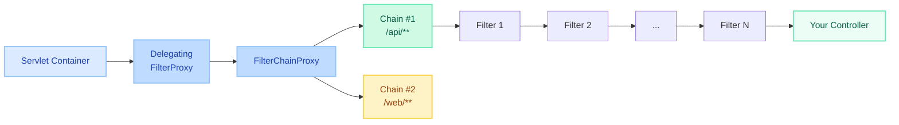

**Three-Layer Delegation:**

1. **Servlet Container** registers a standard `javax.servlet.Filter` named `springSecurityFilterChain`
2. **DelegatingFilterProxy** (the registered filter) delegates to a Spring bean — `FilterChainProxy`
3. **FilterChainProxy** iterates through its list of `SecurityFilterChain` beans, finds the first one whose `matches(request)` returns true, and invokes that chain's filters in order

---

## How Spring Security Integrates with Servlet Filters

### DelegatingFilterProxy

The bridge between the Servlet container (which knows nothing about Spring) and the Spring ApplicationContext.

```java
// Registered in web.xml or via SpringBootServletInitializer
// Looks up a Spring bean by name and delegates doFilter() to it
public class DelegatingFilterProxy extends GenericFilterBean {
    private volatile Filter delegate; // the FilterChainProxy bean

    @Override
    public void doFilter(ServletRequest req, ServletResponse res, FilterChain chain) {
        delegate.doFilter(req, res, chain);
    }
}
```

**Why it exists:** Servlet containers initialize filters *before* the Spring context is ready. `DelegatingFilterProxy` defers the actual lookup until the first request.

### FilterChainProxy

The `springSecurityFilterChain` bean. It holds an ordered list of `SecurityFilterChain` instances.

```java
public class FilterChainProxy extends GenericFilterBean {
    private List<SecurityFilterChain> filterChains;

    @Override
    public void doFilter(ServletRequest req, ServletResponse res, FilterChain chain) {
        // Find FIRST matching chain
        List<Filter> filters = getFilters((HttpServletRequest) req);
        // Execute those filters in order via VirtualFilterChain
        new VirtualFilterChain(chain, filters).doFilter(req, res);
    }
}
```

### SecurityFilterChain Interface

```java
public interface SecurityFilterChain {
    boolean matches(HttpServletRequest request);  // Does this chain handle this request?
    List<Filter> getFilters();                    // Ordered list of security filters
}
```

### Multiple SecurityFilterChain Beans

```java
@Configuration
@EnableWebSecurity
public class MultiChainConfig {

    @Bean
    @Order(1)  // Evaluated FIRST
    public SecurityFilterChain apiChain(HttpSecurity http) throws Exception {
        return http
            .securityMatcher("/api/**")
            .csrf(csrf -> csrf.disable())
            .sessionManagement(s -> s.sessionCreationPolicy(SessionCreationPolicy.STATELESS))
            .authorizeHttpRequests(auth -> auth.anyRequest().authenticated())
            .oauth2ResourceServer(oauth2 -> oauth2.jwt(Customizer.withDefaults()))
            .build();
    }

    @Bean
    @Order(2)  // Evaluated SECOND
    public SecurityFilterChain webChain(HttpSecurity http) throws Exception {
        return http
            .securityMatcher("/web/**")
            .authorizeHttpRequests(auth -> auth.anyRequest().authenticated())
            .formLogin(Customizer.withDefaults())
            .build();
    }
}
```

!!! warning "Order Matters"
    `FilterChainProxy` uses the **first matching** `SecurityFilterChain`. A chain with `securityMatcher("/**")` at `@Order(1)` will swallow ALL requests, making subsequent chains unreachable.

### Delegation Layers Diagram

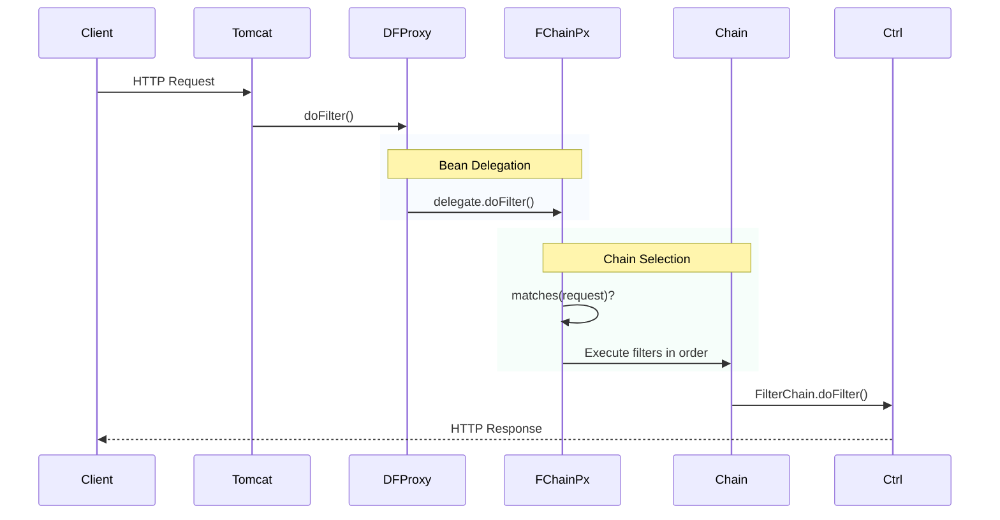

---

## The Default Filter Chain (All Filters in Order)

When you configure a standard `SecurityFilterChain`, Spring Security registers these filters in this exact order:

| # | Filter | Purpose |
|---|--------|---------|
| 1 | `DisableEncodeUrlFilter` | Prevents session ID from being appended to URLs (security risk) |
| 2 | `WebAsyncManagerIntegrationFilter` | Propagates SecurityContext to async threads spawned by Spring MVC |
| 3 | `SecurityContextHolderFilter` | Loads/saves SecurityContext between requests (replaced `SecurityContextPersistenceFilter` in 6.x) |
| 4 | `HeaderWriterFilter` | Adds security headers (X-Frame-Options, X-Content-Type-Options, etc.) |
| 5 | `CorsFilter` | Handles CORS preflight (OPTIONS) and adds Access-Control-* headers |
| 6 | `CsrfFilter` | Validates CSRF token on state-changing requests (POST, PUT, DELETE) |
| 7 | `LogoutFilter` | Intercepts logout URL, invalidates session, clears SecurityContext |
| 8 | `UsernamePasswordAuthenticationFilter` | Processes form login POST to `/login` |
| 9 | `DefaultLoginPageGeneratingFilter` | Generates the default `/login` HTML page |
| 10 | `DefaultLogoutPageGeneratingFilter` | Generates the default `/logout` confirmation page |
| 11 | `BasicAuthenticationFilter` | Processes `Authorization: Basic ...` header |
| 12 | `RequestCacheAwareFilter` | Restores the original request after login redirect |
| 13 | `SecurityContextHolderAwareRequestFilter` | Wraps request to provide `isUserInRole()`, `getRemoteUser()` |
| 14 | `AnonymousAuthenticationFilter` | Sets anonymous Authentication if none exists yet |
| 15 | `ExceptionTranslationFilter` | Catches security exceptions and translates to HTTP responses |
| 16 | `AuthorizationFilter` | Final check — evaluates access rules (replaced `FilterSecurityInterceptor` in 6.x) |

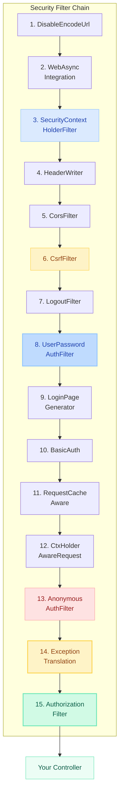

!!! tip "Interview Insight"
    When asked "What happens before your controller handles a request?", walk through these filters. Mention that `ExceptionTranslationFilter` sits *before* `AuthorizationFilter` specifically so it can catch `AccessDeniedException` and `AuthenticationException` thrown by the authorization check.

---

## Authentication Flow

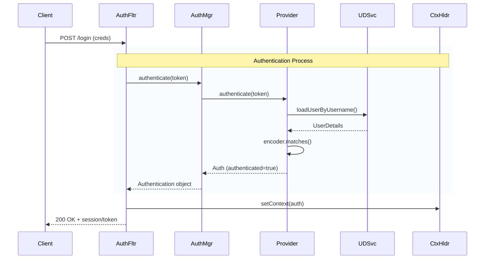

**Key components:**

- **AuthenticationManager** — single method: `authenticate(Authentication)`. Default impl: `ProviderManager`
- **ProviderManager** — iterates through a list of `AuthenticationProvider` instances until one supports the token
- **AuthenticationProvider** — does the actual verification (e.g., `DaoAuthenticationProvider` uses `UserDetailsService` + `PasswordEncoder`)
- **UserDetailsService** — loads user from DB/LDAP/etc. Returns `UserDetails`

```java
// The contract
public interface AuthenticationManager {
    Authentication authenticate(Authentication authentication)
        throws AuthenticationException;
}

// Default implementation
public class ProviderManager implements AuthenticationManager {
    private List<AuthenticationProvider> providers;

    public Authentication authenticate(Authentication auth) {
        for (AuthenticationProvider provider : providers) {
            if (provider.supports(auth.getClass())) {
                return provider.authenticate(auth);
            }
        }
        throw new ProviderNotFoundException("No provider for " + auth.getClass());
    }
}
```

---

## Authorization Flow

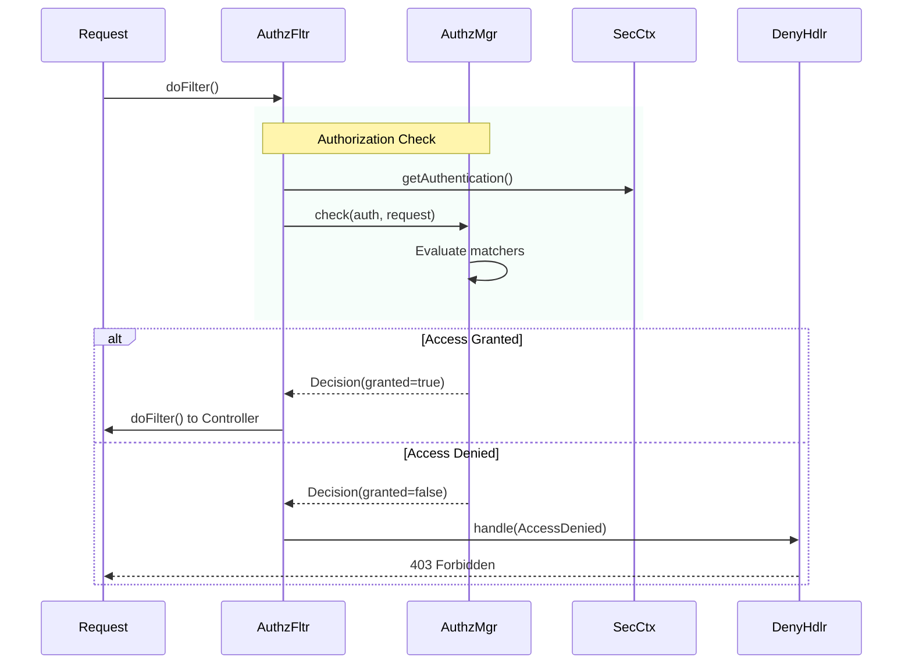

**AuthorizationManager (Spring Security 6):**

```java
public interface AuthorizationManager<T> {
    AuthorizationDecision check(Supplier<Authentication> authentication, T object);
}

// Used by AuthorizationFilter
// Replaces the older AccessDecisionManager/Voter pattern
```

**Common implementations:**

| AuthorizationManager | Use Case |
|---------------------|----------|
| `RequestMatcherDelegatingAuthorizationManager` | URL-based rules (default) |
| `AuthorityAuthorizationManager` | `hasRole()`, `hasAuthority()` |
| `AuthenticatedAuthorizationManager` | `authenticated()`, `permitAll()` |

---

## SecurityContext & SecurityContextHolder

The `SecurityContextHolder` is how Spring Security makes the current user's `Authentication` available anywhere in the application.

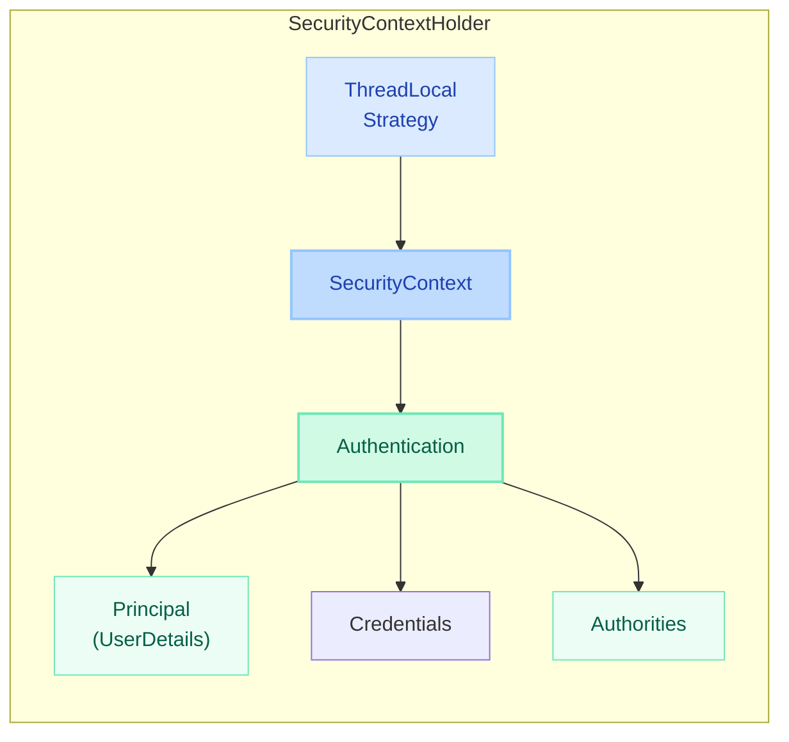

### Strategy Modes

| Mode | When to Use |
|------|-------------|
| `MODE_THREADLOCAL` (default) | Standard servlet requests — one thread per request |
| `MODE_INHERITABLETHREADLOCAL` | When spawning child threads via `@Async` (propagates context) |
| `MODE_GLOBAL` | Standalone apps (desktop, batch) where all threads share one context |

```java
// Set globally at startup
SecurityContextHolder.setStrategyName(SecurityContextHolder.MODE_INHERITABLETHREADLOCAL);

// Or via system property
-Dspring.security.strategy=MODE_INHERITABLETHREADLOCAL
```

### SecurityContextRepository (How Context Survives Between Requests)

```java
public interface SecurityContextRepository {
    SecurityContext loadContext(HttpServletRequest request);
    void saveContext(SecurityContext context, HttpServletRequest req, HttpServletResponse res);
}
```

| Implementation | Storage |
|----------------|---------|
| `HttpSessionSecurityContextRepository` | HTTP Session (default for form login) |
| `RequestAttributeSecurityContextRepository` | Request attribute only (stateless — no persistence) |
| `DelegatingSecurityContextRepository` | Tries multiple repos in order (Spring 6 default) |

!!! tip "Interview Insight"
    "How does Spring Security maintain state between requests?" Answer: `SecurityContextHolderFilter` loads the context from `SecurityContextRepository` at the start of each request and saves it back at the end. For stateless APIs (JWT), you use `RequestAttributeSecurityContextRepository` — the context lives only for the duration of the request.

---

## Custom Filter Implementation

### OncePerRequestFilter (Preferred Base Class)

```java
public class JwtAuthenticationFilter extends OncePerRequestFilter {

    private final JwtDecoder jwtDecoder;
    private final UserDetailsService userDetailsService;

    @Override
    protected void doFilterInternal(HttpServletRequest request,
                                     HttpServletResponse response,
                                     FilterChain filterChain)
            throws ServletException, IOException {

        String header = request.getHeader("Authorization");

        if (header == null || !header.startsWith("Bearer ")) {
            filterChain.doFilter(request, response);  // Let other filters handle it
            return;
        }

        String token = header.substring(7);
        try {
            Jwt jwt = jwtDecoder.decode(token);
            String username = jwt.getSubject();
            UserDetails userDetails = userDetailsService.loadUserByUsername(username);

            UsernamePasswordAuthenticationToken auth =
                new UsernamePasswordAuthenticationToken(
                    userDetails, null, userDetails.getAuthorities());
            auth.setDetails(new WebAuthenticationDetailsSource().buildDetails(request));

            SecurityContextHolder.getContext().setAuthentication(auth);
        } catch (JwtException e) {
            // Don't set authentication — let downstream filters handle as anonymous
            logger.debug("JWT validation failed: {}", e.getMessage());
        }

        filterChain.doFilter(request, response);
    }

    @Override
    protected boolean shouldNotFilter(HttpServletRequest request) {
        return request.getServletPath().startsWith("/public/");
    }
}
```

### Registering Custom Filters

```java
@Bean
public SecurityFilterChain filterChain(HttpSecurity http) throws Exception {
    return http
        // Add BEFORE UsernamePasswordAuthenticationFilter
        .addFilterBefore(jwtFilter, UsernamePasswordAuthenticationFilter.class)
        // Add AFTER a specific filter
        .addFilterAfter(auditFilter, AuthorizationFilter.class)
        // Add AT the position of (replaces conceptually)
        .addFilterAt(customAuthFilter, UsernamePasswordAuthenticationFilter.class)
        .build();
}
```

### Common Custom Filter Positions

| Position | Filter Type | Use Case |
|----------|-------------|----------|
| Before `UsernamePasswordAuthenticationFilter` | JWT / API Key filter | Authenticate stateless requests before form login kicks in |
| After `SecurityContextHolderFilter` | Tenant resolver filter | Set tenant context based on header/subdomain |
| After `AuthorizationFilter` | Audit logging filter | Log all authorized access for compliance |
| Before `CorsFilter` | Request sanitization | Strip malicious headers before CORS processing |

### JWT Filter Sequence Diagram

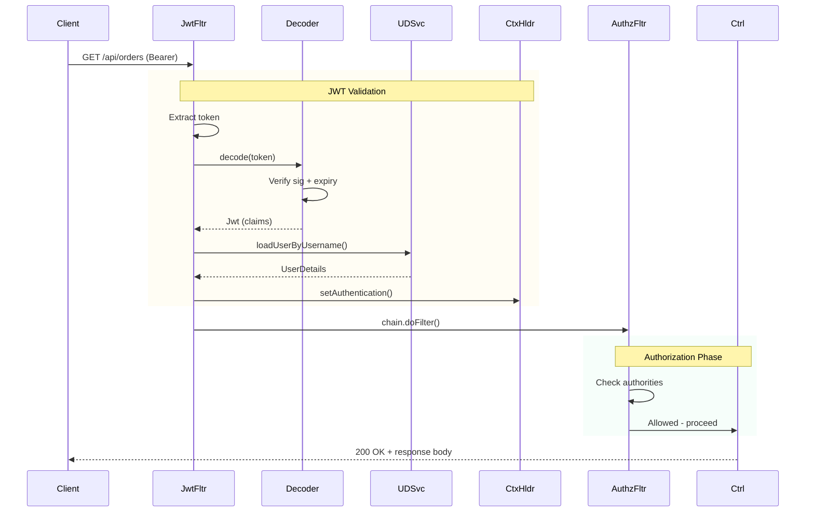

---

## Multiple Security Filter Chains

Use `securityMatcher()` to scope a chain to specific URL patterns:

```java
@Configuration
@EnableWebSecurity
public class SecurityConfig {

    // Chain 1: Stateless API (JWT)
    @Bean
    @Order(1)
    public SecurityFilterChain apiSecurityChain(HttpSecurity http) throws Exception {
        return http
            .securityMatcher("/api/**")
            .csrf(csrf -> csrf.disable())
            .sessionManagement(s -> s.sessionCreationPolicy(SessionCreationPolicy.STATELESS))
            .authorizeHttpRequests(auth -> auth
                .requestMatchers("/api/public/**").permitAll()
                .anyRequest().authenticated()
            )
            .oauth2ResourceServer(oauth2 -> oauth2.jwt(Customizer.withDefaults()))
            .build();
    }

    // Chain 2: Web app (session-based)
    @Bean
    @Order(2)
    public SecurityFilterChain webSecurityChain(HttpSecurity http) throws Exception {
        return http
            .securityMatcher("/web/**", "/login", "/logout")
            .authorizeHttpRequests(auth -> auth
                .requestMatchers("/web/public/**").permitAll()
                .anyRequest().authenticated()
            )
            .formLogin(form -> form
                .loginPage("/login")
                .defaultSuccessUrl("/web/dashboard")
            )
            .build();
    }

    // Chain 3: Actuator (basic auth, internal only)
    @Bean
    @Order(3)
    public SecurityFilterChain actuatorChain(HttpSecurity http) throws Exception {
        return http
            .securityMatcher("/actuator/**")
            .authorizeHttpRequests(auth -> auth.anyRequest().hasRole("OPS"))
            .httpBasic(Customizer.withDefaults())
            .build();
    }
}
```

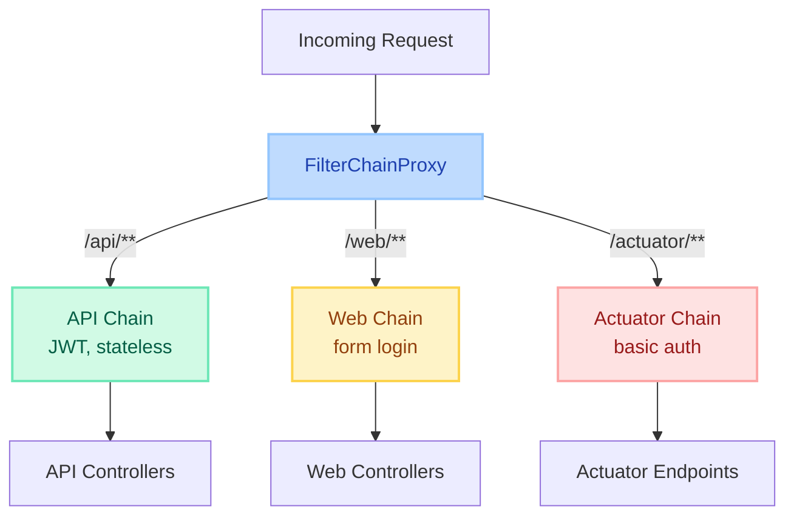

---

## OAuth2 / JWT Resource Server Flow

### Resource Server Filter Chain

When your app acts as a **Resource Server** (validates JWTs issued by an Authorization Server):

```java
@Bean
public SecurityFilterChain resourceServerChain(HttpSecurity http) throws Exception {
    return http
        .csrf(csrf -> csrf.disable())
        .sessionManagement(s -> s.sessionCreationPolicy(SessionCreationPolicy.STATELESS))
        .authorizeHttpRequests(auth -> auth
            .requestMatchers("/api/public/**").permitAll()
            .requestMatchers("/api/admin/**").hasAuthority("SCOPE_admin")
            .anyRequest().authenticated()
        )
        .oauth2ResourceServer(oauth2 -> oauth2
            .jwt(jwt -> jwt
                .decoder(jwtDecoder())
                .jwtAuthenticationConverter(jwtAuthConverter())
            )
        )
        .build();
}

@Bean
public JwtDecoder jwtDecoder() {
    return NimbusJwtDecoder.withJwkSetUri("https://auth.example.com/.well-known/jwks.json")
        .build();
}

@Bean
public JwtAuthenticationConverter jwtAuthConverter() {
    JwtGrantedAuthoritiesConverter grantedAuthoritiesConverter = new JwtGrantedAuthoritiesConverter();
    grantedAuthoritiesConverter.setAuthorityPrefix("ROLE_");
    grantedAuthoritiesConverter.setAuthoritiesClaimName("roles");

    JwtAuthenticationConverter converter = new JwtAuthenticationConverter();
    converter.setJwtGrantedAuthoritiesConverter(grantedAuthoritiesConverter);
    return converter;
}
```

### BearerTokenAuthenticationFilter

This filter (added automatically by `.oauth2ResourceServer()`) replaces your custom JWT filter. It:

1. Extracts the Bearer token from the `Authorization` header
2. Creates a `BearerTokenAuthenticationToken`
3. Delegates to `AuthenticationManager` → `JwtAuthenticationProvider`
4. `JwtAuthenticationProvider` uses `JwtDecoder` to validate and `JwtAuthenticationConverter` to build the `Authentication`

### JWT Validation Flow

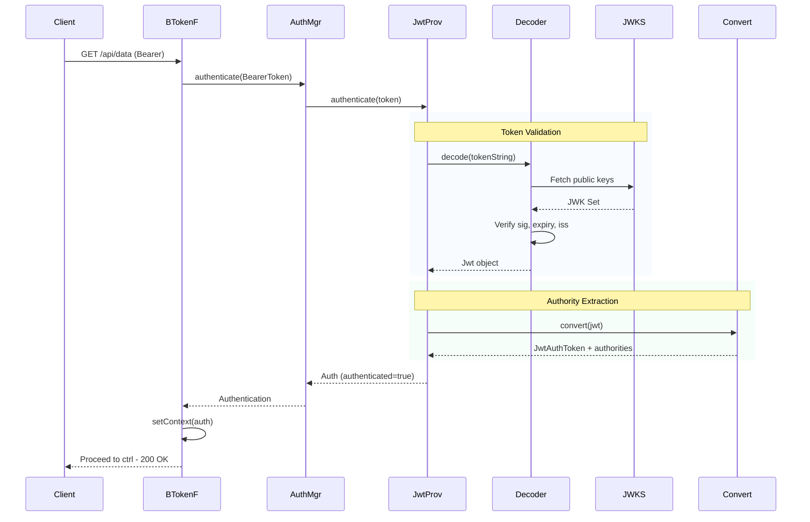

---

## Exception Handling in the Filter Chain

### ExceptionTranslationFilter

This filter wraps the `AuthorizationFilter` and catches two types of exceptions:

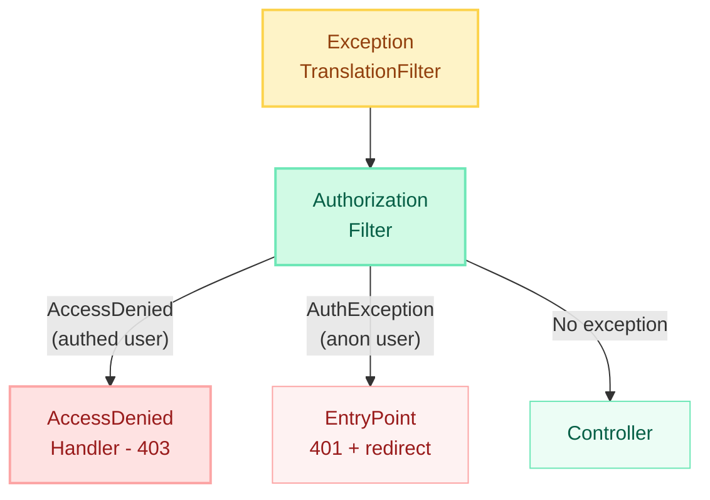

**Key distinction:**

| Exception | When | Default Response |
|-----------|------|------------------|
| `AuthenticationException` | Anonymous user accessing protected resource | 401 + redirect to `/login` (or WWW-Authenticate header) |
| `AccessDeniedException` | Authenticated user lacking required authority | 403 Forbidden |

### Custom Exception Handling

```java
@Bean
public SecurityFilterChain filterChain(HttpSecurity http) throws Exception {
    return http
        .exceptionHandling(ex -> ex
            .authenticationEntryPoint((request, response, authException) -> {
                response.setContentType("application/json");
                response.setStatus(HttpServletResponse.SC_UNAUTHORIZED);
                response.getWriter().write("""
                    {"error": "unauthorized", "message": "Authentication required"}
                    """);
            })
            .accessDeniedHandler((request, response, accessDeniedException) -> {
                response.setContentType("application/json");
                response.setStatus(HttpServletResponse.SC_FORBIDDEN);
                response.getWriter().write("""
                    {"error": "forbidden", "message": "Insufficient privileges"}
                    """);
            })
        )
        .build();
}
```

---

## CSRF Protection

### How It Works

The `CsrfFilter` generates a unique token per session and validates it on every state-changing request (POST, PUT, DELETE, PATCH).

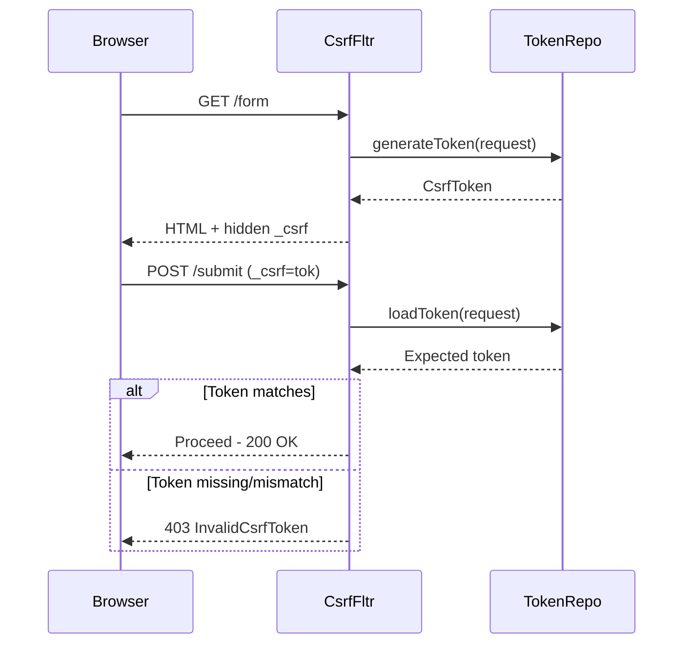

### CsrfTokenRepository Implementations

| Implementation | Storage | Use Case |
|---------------|---------|----------|
| `HttpSessionCsrfTokenRepository` | Server session | Traditional web apps (default) |
| `CookieCsrfTokenRepository` | Cookie (XSRF-TOKEN) | SPA frontends (Angular/React read the cookie) |

```java
// For SPA frontends
.csrf(csrf -> csrf
    .csrfTokenRepository(CookieCsrfTokenRepository.withHttpOnlyFalse())
    .csrfTokenRequestHandler(new XorCsrfTokenRequestAttributeHandler())
)
```

### When to Disable CSRF

| Scenario | CSRF Needed? | Reason |
|----------|--------------|--------|
| Stateless API with JWT | No | No cookies = no CSRF risk |
| Browser app with sessions | **Yes** | Cookie-based auth is vulnerable |
| API with session cookies | **Yes** | Browsers auto-attach cookies |

```java
// Safe: stateless JWT API
.csrf(csrf -> csrf.disable())
.sessionManagement(s -> s.sessionCreationPolicy(SessionCreationPolicy.STATELESS))

// Selective disable (only for specific paths)
.csrf(csrf -> csrf
    .ignoringRequestMatchers("/api/webhooks/**", "/api/public/**")
)
```

### BREACH Attack Mitigation

Spring Security 6 uses `XorCsrfTokenRequestAttributeHandler` by default to XOR-mask the token on each response. This prevents BREACH attacks (compression side-channel) by ensuring the token looks different in every response even though it validates to the same value.

---

## CORS Configuration

### CorsConfigurationSource

```java
@Bean
public CorsConfigurationSource corsConfigurationSource() {
    CorsConfiguration config = new CorsConfiguration();
    config.setAllowedOrigins(List.of("https://app.example.com", "https://admin.example.com"));
    config.setAllowedMethods(List.of("GET", "POST", "PUT", "DELETE", "OPTIONS"));
    config.setAllowedHeaders(List.of("Authorization", "Content-Type", "X-Request-Id"));
    config.setExposedHeaders(List.of("X-Total-Count"));
    config.setAllowCredentials(true);
    config.setMaxAge(3600L);

    UrlBasedCorsConfigurationSource source = new UrlBasedCorsConfigurationSource();
    source.registerCorsConfiguration("/api/**", config);
    return source;
}

@Bean
public SecurityFilterChain filterChain(HttpSecurity http) throws Exception {
    return http
        .cors(cors -> cors.configurationSource(corsConfigurationSource()))
        .build();
}
```

### Per-Endpoint vs Global

=== "Global (SecurityFilterChain)"

    ```java
    // Applies to ALL paths matching the CorsConfigurationSource pattern
    .cors(cors -> cors.configurationSource(corsConfigurationSource()))
    ```

=== "Per-Controller (@CrossOrigin)"

    ```java
    @RestController
    @CrossOrigin(origins = "https://app.example.com")
    public class OrderController {
        // CORS headers added only for this controller
    }
    ```

!!! warning "CORS + Spring Security"
    You MUST configure CORS in the `SecurityFilterChain` (not just `@CrossOrigin`) because the `CorsFilter` needs to handle preflight `OPTIONS` requests **before** authentication filters reject them as unauthenticated.

---

## Debugging Tips

### Enable Security Debug Logging

```java
@EnableWebSecurity(debug = true)  // NEVER in production!
public class SecurityConfig { }
```

This prints:
- Which `SecurityFilterChain` matched
- All filters in the matched chain
- The request details

### Log Filter Chain via Properties

```yaml
logging:
  level:
    org.springframework.security: DEBUG
    org.springframework.security.web.FilterChainProxy: TRACE
```

### Programmatic Filter Chain Inspection

```java
@Component
public class SecurityFilterChainLogger implements CommandLineRunner {

    @Autowired
    private List<SecurityFilterChain> chains;

    @Override
    public void run(String... args) {
        chains.forEach(chain -> {
            System.out.println("=== Filter Chain ===");
            chain.getFilters().forEach(filter ->
                System.out.println("  " + filter.getClass().getSimpleName())
            );
        });
    }
}
```

### Common Debugging Scenarios

| Symptom | Likely Cause | Check |
|---------|--------------|-------|
| 403 on every request | CSRF token missing | Disable CSRF or send token |
| 401 when token is valid | Filter order wrong — auth filter runs after AuthorizationFilter | Print filter chain |
| CORS preflight fails | `OPTIONS` rejected by auth | Ensure `.cors()` is configured |
| SecurityContext null in `@Async` | ThreadLocal not propagated | Use `MODE_INHERITABLETHREADLOCAL` or `DelegatingSecurityContextExecutor` |
| Multiple chains, wrong one matches | `@Order` / `securityMatcher` misconfigured | Enable TRACE logging |

---

## Spring Security 5.x vs 6.x Configuration

=== "Spring Security 5.x (Deprecated)"

    ```java
    @Configuration
    @EnableWebSecurity
    public class SecurityConfig extends WebSecurityConfigurerAdapter {

        @Override
        protected void configure(HttpSecurity http) throws Exception {
            http
                .authorizeRequests()
                    .antMatchers("/api/public/**").permitAll()
                    .antMatchers("/api/admin/**").hasRole("ADMIN")
                    .anyRequest().authenticated()
                .and()
                .httpBasic();
        }

        @Override
        protected void configure(AuthenticationManagerBuilder auth) throws Exception {
            auth.userDetailsService(userDetailsService)
                .passwordEncoder(passwordEncoder());
        }

        @Bean
        @Override
        public AuthenticationManager authenticationManagerBean() throws Exception {
            return super.authenticationManagerBean();
        }
    }
    ```

=== "Spring Security 6.x (Current)"

    ```java
    @Configuration
    @EnableWebSecurity
    public class SecurityConfig {

        @Bean
        public SecurityFilterChain filterChain(HttpSecurity http) throws Exception {
            return http
                .authorizeHttpRequests(auth -> auth
                    .requestMatchers("/api/public/**").permitAll()
                    .requestMatchers("/api/admin/**").hasRole("ADMIN")
                    .anyRequest().authenticated()
                )
                .httpBasic(Customizer.withDefaults())
                .build();
        }

        @Bean
        public AuthenticationManager authManager(AuthenticationConfiguration config)
                throws Exception {
            return config.getAuthenticationManager();
        }

        @Bean
        public UserDetailsService userDetailsService() {
            return username -> userRepository.findByUsername(username)
                .orElseThrow(() -> new UsernameNotFoundException(username));
        }

        @Bean
        public PasswordEncoder passwordEncoder() {
            return new BCryptPasswordEncoder();
        }
    }
    ```

### Key Migration Changes

| 5.x | 6.x | Why |
|-----|-----|-----|
| `WebSecurityConfigurerAdapter` | `SecurityFilterChain` bean | Component-based config, testable, multiple chains |
| `authorizeRequests()` | `authorizeHttpRequests()` | Uses `AuthorizationManager` (simplified) |
| `antMatchers()` | `requestMatchers()` | Auto-selects MVC or Ant matchers |
| `FilterSecurityInterceptor` | `AuthorizationFilter` | Simpler, no voter pattern |
| `SecurityContextPersistenceFilter` | `SecurityContextHolderFilter` | Explicit save (no auto-save on every request) |
| `.and()` chaining | Lambda DSL only | Cleaner, IDE-friendly |

!!! tip "Interview Insight"
    "What changed between Spring Security 5 and 6?" Lead with: the shift from inheritance (`WebSecurityConfigurerAdapter`) to composition (`SecurityFilterChain` beans), the new `AuthorizationManager` replacing voters, and explicit context saving.

---

## Quick Recall Table

| Concept | Key Class | One-Liner |
|---------|-----------|-----------|
| Servlet→Spring bridge | `DelegatingFilterProxy` | Registered in servlet container, delegates to Spring bean |
| Central dispatcher | `FilterChainProxy` | Holds all `SecurityFilterChain` beans, picks first match |
| Chain definition | `SecurityFilterChain` | `matches(request)` + ordered filter list |
| Auth orchestrator | `AuthenticationManager` | Single `authenticate()` method, delegates to providers |
| Auth logic | `AuthenticationProvider` | Actual credential verification |
| User loader | `UserDetailsService` | `loadUserByUsername()` → `UserDetails` |
| Context storage | `SecurityContextHolder` | ThreadLocal holding the current `Authentication` |
| Context persistence | `SecurityContextRepository` | Saves/loads context between requests (session or request-scoped) |
| Exception translation | `ExceptionTranslationFilter` | Catches AuthN/AuthZ exceptions → 401 or 403 |
| URL authorization | `AuthorizationFilter` | Evaluates request against access rules |
| CSRF | `CsrfFilter` + `CsrfTokenRepository` | Token-based protection against cross-site request forgery |
| JWT resource server | `BearerTokenAuthenticationFilter` | Extracts + validates Bearer token |

---

## Interview Answer Template

!!! abstract "How to Structure Filter Chain Answers"

    **Pattern:** Architecture → Flow → Configuration → Gotchas

    **Example question:** "Explain how Spring Security processes an HTTP request."

    **Strong answer structure:**

    1. **Architecture** (10 seconds): "Every request passes through `DelegatingFilterProxy` → `FilterChainProxy` → a matched `SecurityFilterChain` containing ~15 ordered filters."

    2. **Key Filters** (20 seconds): "The important ones are `SecurityContextHolderFilter` (loads auth state), the authentication filters (validates credentials), `ExceptionTranslationFilter` (translates exceptions to HTTP responses), and `AuthorizationFilter` (enforces access rules)."

    3. **Flow** (20 seconds): "For JWT: the `BearerTokenAuthenticationFilter` extracts the token, delegates to `JwtAuthenticationProvider` which uses `JwtDecoder` to verify the signature and expiry, then sets the `Authentication` in `SecurityContextHolder`. The `AuthorizationFilter` then checks if the user's authorities satisfy the endpoint's access rules."

    4. **Gotcha** (10 seconds): "Filter order is critical — a custom filter placed after `AuthorizationFilter` won't populate the `SecurityContext` in time. Also, in Spring Security 6, context saving is explicit — you must call `securityContextRepository.saveContext()` in custom filters."

---

!!! tip "Top Interview Questions on This Topic"
    - What is the role of `DelegatingFilterProxy` vs `FilterChainProxy`?
    - How do multiple `SecurityFilterChain` beans work together?
    - Where would you place a custom JWT filter and why?
    - What is the difference between `AuthenticationException` and `AccessDeniedException` handling?
    - Why does Spring Security 6 use `SecurityContextHolderFilter` instead of `SecurityContextPersistenceFilter`?
    - When should you disable CSRF and why?
    - How do you propagate `SecurityContext` to async threads?
