# Spring Security Filter Chain — The Complete Deep Dive

The filter chain is THE most important concept in Spring Security. Every authentication, every authorization, every CORS check — it all happens through filters. When your JWT isn't being validated, or your CORS headers aren't showing up, or you're getting 403s you can't explain — it's always a filter chain issue. Let me take you inside the machine that processes every single HTTP request in your Spring application.

---

!!! danger "⚠️ What breaks"
    A production e-commerce platform suffered a **complete admin panel breach** because a developer added a custom JWT filter **after** the `AuthorizationFilter`. The `SecurityContextHolder` was empty when authorization ran, so `AnonymousAuthenticationFilter` marked every request as anonymous. Combined with a copy-paste `.requestMatchers("/admin/**").permitAll()` (intended for health checks), unauthenticated users accessed order data for 48 hours. **Filter order is not optional — it IS your security posture.**

---

## What is the Security Filter Chain?

Here's what most tutorials get wrong: they tell you Spring Security "intercepts requests." That's like saying an engine "makes the car go." True, but useless when something breaks. Let me show you exactly what happens.

### The Three-Layer Delegation

When a request hits your Spring Boot app, it passes through three layers before any security logic runs:

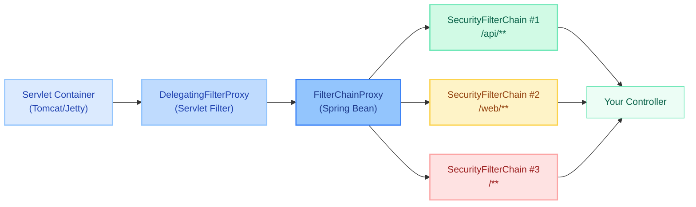

**Layer 1 — DelegatingFilterProxy:** The Servlet container (Tomcat, Jetty, Undertow) knows nothing about Spring. It only knows `javax.servlet.Filter`. So Spring registers a plain servlet filter called `springSecurityFilterChain`. This is `DelegatingFilterProxy` — its only job is to look up a Spring bean by name and forward `doFilter()` calls to it.

**Layer 2 — FilterChainProxy:** This is the Spring bean that `DelegatingFilterProxy` delegates to. It holds an ordered list of `SecurityFilterChain` instances and picks the first one whose `matches(request)` returns `true`.

**Layer 3 — SecurityFilterChain:** The actual list of security filters that process the request. Each chain can have different filters — JWT for APIs, form login for web pages, basic auth for actuator endpoints.

!!! tip "💡 One-liner for interviews"
    "DelegatingFilterProxy bridges the Servlet world to Spring. FilterChainProxy selects the right SecurityFilterChain. The chain's filters do the actual security work."

### Why This Delegation Exists

The Servlet container initializes filters **before** the Spring ApplicationContext is ready. If Spring Security registered its beans directly as servlet filters, they'd fail because dependencies (DataSource, UserDetailsService, etc.) aren't available yet. `DelegatingFilterProxy` solves this by deferring the bean lookup until the first request arrives — by then, Spring is fully initialized.

```java
// Simplified DelegatingFilterProxy — the bridge
public class DelegatingFilterProxy extends GenericFilterBean {
    private volatile Filter delegate; // Lazily resolved to FilterChainProxy

    @Override
    public void doFilter(ServletRequest req, ServletResponse res, FilterChain chain) {
        if (delegate == null) {
            delegate = applicationContext.getBean("springSecurityFilterChain", Filter.class);
        }
        delegate.doFilter(req, res, chain);
    }
}
```

```java
// FilterChainProxy — the dispatcher
public class FilterChainProxy extends GenericFilterBean {
    private List<SecurityFilterChain> filterChains;

    @Override
    public void doFilter(ServletRequest req, ServletResponse res, FilterChain chain) {
        HttpServletRequest request = (HttpServletRequest) req;
        // Find FIRST matching chain (order matters!)
        for (SecurityFilterChain securityChain : filterChains) {
            if (securityChain.matches(request)) {
                List<Filter> filters = securityChain.getFilters();
                new VirtualFilterChain(chain, filters).doFilter(req, res);
                return;
            }
        }
        // No chain matched — proceed without security filters
        chain.doFilter(req, res);
    }
}
```

```java
// SecurityFilterChain — the contract
public interface SecurityFilterChain {
    boolean matches(HttpServletRequest request);  // Does this chain handle this URL?
    List<Filter> getFilters();                    // The ordered security filters
}
```

### Multiple SecurityFilterChains (Order Matters!)

You can define multiple `SecurityFilterChain` beans. `FilterChainProxy` evaluates them in `@Order` sequence and uses the **first match**. This is how you apply different security policies to different parts of your app.

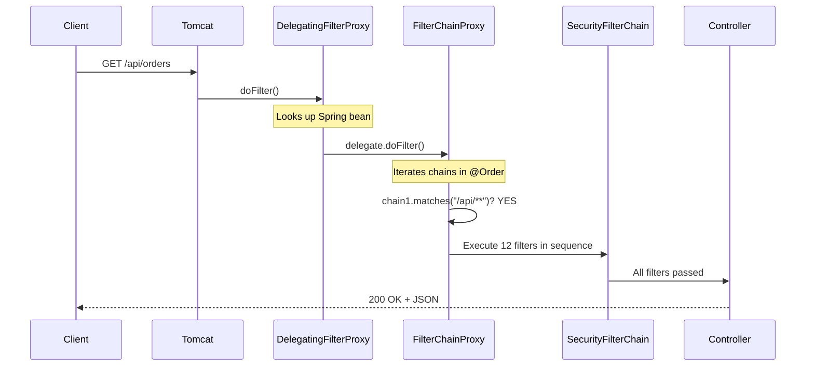

!!! question "❓ Counter-questions"
    **Q: "Can you have zero SecurityFilterChains?"**
    A: Yes — if no `SecurityFilterChain` bean exists, `FilterChainProxy` has an empty list and all requests pass through without security. But `@EnableWebSecurity` auto-configures a default chain, so you'd have to actively remove it.

    **Q: "What if two chains have the same @Order?"**
    A: Undefined behavior — Spring doesn't guarantee ordering for same-priority beans. Always use distinct `@Order` values.

    **Q: "What if NO chain matches a request?"**
    A: The request proceeds through the servlet filter chain without any Spring Security filters. Effectively unsecured.

---

## The Default Filter Order (Complete List)

When you create a `SecurityFilterChain` with standard configuration, Spring Security registers these filters in **exactly this order**. Every filter has a specific position — you cannot rearrange the defaults.

| # | Filter | What It Does (1 sentence) | Position Constant |
|---|--------|---------------------------|-------------------|
| 1 | `DisableEncodeUrlFilter` | Prevents session IDs from being appended to URLs (which would leak them in Referer headers) | FIRST |
| 2 | `WebAsyncManagerIntegrationFilter` | Propagates SecurityContext to async threads spawned by Spring MVC's `@Async` | 0 |
| 3 | `SecurityContextHolderFilter` | Loads SecurityContext from repository at request start; saves it at request end | 100 |
| 4 | `HeaderWriterFilter` | Writes security response headers (X-Frame-Options, X-Content-Type-Options, HSTS, etc.) | 200 |
| 5 | `CorsFilter` | Handles CORS preflight (OPTIONS) requests and adds Access-Control-* headers | 300 |
| 6 | `CsrfFilter` | Validates CSRF token on state-changing requests (POST, PUT, DELETE, PATCH) | 400 |
| 7 | `LogoutFilter` | Intercepts the logout URL, invalidates session, clears SecurityContext | 500 |
| 8 | `OAuth2AuthorizationRequestRedirectFilter` | Redirects to OAuth2 provider's authorization endpoint (login with Google/GitHub) | 600 |
| 9 | `UsernamePasswordAuthenticationFilter` | Processes form login POST requests (extracts username/password from form body) | 700 |
| 10 | `DefaultLoginPageGeneratingFilter` | Auto-generates the `/login` HTML page when no custom login page is configured | 800 |
| 11 | `DefaultLogoutPageGeneratingFilter` | Auto-generates the `/logout` confirmation page | 850 |
| 12 | `BearerTokenAuthenticationFilter` | Extracts and validates Bearer JWT tokens from Authorization header | 900 |
| 13 | `BasicAuthenticationFilter` | Decodes and validates `Authorization: Basic base64(user:pass)` header | 1000 |
| 14 | `RequestCacheAwareFilter` | Restores the original pre-login request after a redirect-to-login-and-back flow | 1100 |
| 15 | `SecurityContextHolderAwareRequestFilter` | Wraps HttpServletRequest to provide `isUserInRole()`, `getRemoteUser()`, `getUserPrincipal()` | 1200 |
| 16 | `AnonymousAuthenticationFilter` | If no Authentication exists yet, creates an anonymous one (prevents NPEs downstream) | 1300 |
| 17 | `ExceptionTranslationFilter` | Wraps AuthorizationFilter — catches security exceptions and translates to 401/403 | 1400 |
| 18 | `AuthorizationFilter` | The final gatekeeper — evaluates URL-based authorization rules | 1500 |

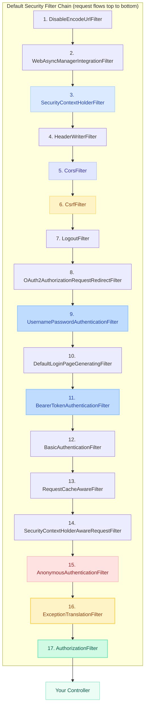

!!! example "🎯 Interview Tip"
    You don't need to memorize all 18 filters. Know these 5 cold: **SecurityContextHolderFilter** (loads/saves auth state), **CsrfFilter** (blocks forged requests), **UsernamePasswordAuthenticationFilter** (form login), **ExceptionTranslationFilter** (catches exceptions, decides 401 vs 403), **AuthorizationFilter** (enforces access rules). Then know WHERE to place custom filters relative to these.

---

## Deep Dive: Critical Filters

### SecurityContextHolderFilter (Position 3)

**What it does:** Loads the `SecurityContext` (containing the current user's `Authentication`) from a `SecurityContextRepository` at the start of every request, and saves it back at the end.

**When it fires:** Every single request. Always. No exceptions.

**What happens if removed:** The `SecurityContextHolder` is always empty. No request will ever be "authenticated" — even if you just logged in successfully, the next request won't know about it.

**How to customize:** Swap the `SecurityContextRepository` implementation.

```java
// How it works internally (simplified)
public class SecurityContextHolderFilter extends GenericFilterBean {
    private SecurityContextRepository securityContextRepository;

    @Override
    public void doFilter(ServletRequest req, ServletResponse res, FilterChain chain) {
        HttpServletRequest request = (HttpServletRequest) req;

        // LOAD context at request start
        SecurityContext context = securityContextRepository.loadContext(request);
        SecurityContextHolder.setContext(context);

        try {
            chain.doFilter(req, res); // Continue to next filter
        } finally {
            // SAVE context at request end (Spring Security 6 — explicit save)
            securityContextRepository.saveContext(
                SecurityContextHolder.getContext(), request, (HttpServletResponse) res);
            SecurityContextHolder.clearContext(); // Prevent ThreadLocal leaks
        }
    }
}
```

**Repository implementations:**

| Implementation | Storage | Use Case |
|----------------|---------|----------|
| `HttpSessionSecurityContextRepository` | HTTP Session | Traditional web apps with session cookies |
| `RequestAttributeSecurityContextRepository` | Request attribute only | Stateless APIs — context dies with the request |
| `DelegatingSecurityContextRepository` | Tries multiple repos | Spring Security 6 default (tries session, falls back to request) |

!!! warning "🔥 Production War Story"
    A team migrated from Spring Security 5 to 6 and their custom JWT filter stopped working. In 5.x, `SecurityContextPersistenceFilter` automatically saved the context after every request. In 6.x, `SecurityContextHolderFilter` requires **explicit saves**. Their JWT filter set the Authentication but never called `securityContextRepository.saveContext()`. For stateless APIs this was fine (context only needed for the current request), but their WebSocket handlers (which span multiple requests) lost auth state on every message.

---

### UsernamePasswordAuthenticationFilter (Position 9)

**What it does:** Intercepts form login POST requests, extracts username and password from request parameters, and delegates authentication to `AuthenticationManager`.

**When it fires:** Only on POST requests to the configured login URL (default: `/login`). Ignores everything else.

**What happens if removed:** Form-based login stops working. The `/login` form submits but nothing processes the credentials.

**How to customize:** Override `attemptAuthentication()`, configure success/failure handlers.

```java
// Simplified internal logic
public class UsernamePasswordAuthenticationFilter extends AbstractAuthenticationProcessingFilter {

    public UsernamePasswordAuthenticationFilter() {
        super(new AntPathRequestMatcher("/login", "POST")); // Only POST /login
    }

    @Override
    public Authentication attemptAuthentication(HttpServletRequest request,
                                                 HttpServletResponse response) {
        String username = request.getParameter("username");
        String password = request.getParameter("password");

        UsernamePasswordAuthenticationToken token =
            new UsernamePasswordAuthenticationToken(username, password);

        return this.getAuthenticationManager().authenticate(token);
    }
}
```

**The authentication delegation chain:**

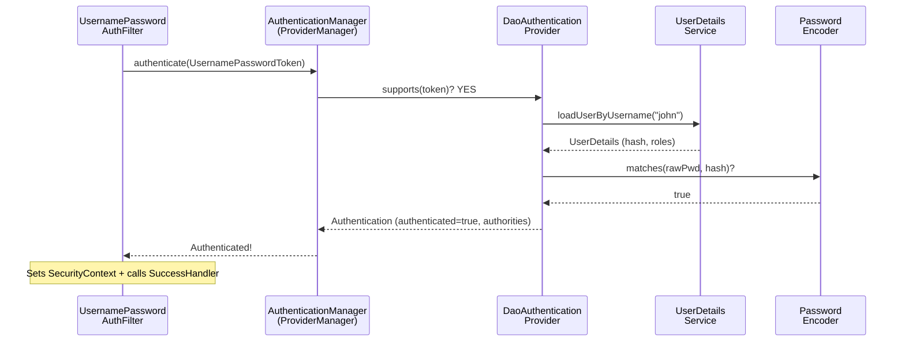

!!! tip "💡 One-liner for interviews"
    "UsernamePasswordAuthenticationFilter only fires on POST /login. It creates an unauthenticated token, hands it to AuthenticationManager which iterates providers, and DaoAuthenticationProvider does the actual password check via PasswordEncoder.matches()."

---

### BasicAuthenticationFilter (Position 12)

**What it does:** Extracts and decodes the `Authorization: Basic base64(username:password)` header, then delegates to `AuthenticationManager`.

**When it fires:** On any request with an `Authorization: Basic ...` header. Unlike form login, it's not path-specific.

**What happens if removed:** HTTP Basic authentication stops working. Requests with Basic headers pass through as unauthenticated.

**How to customize:** Configure a custom `AuthenticationEntryPoint` for the 401 challenge response.

```java
// Core logic (simplified)
public class BasicAuthenticationFilter extends OncePerRequestFilter {

    @Override
    protected void doFilterInternal(HttpServletRequest request,
                                     HttpServletResponse response,
                                     FilterChain chain) {
        String header = request.getHeader("Authorization");

        if (header == null || !header.startsWith("Basic ")) {
            chain.doFilter(request, response); // Not Basic auth — skip
            return;
        }

        // Decode Base64 → "username:password"
        byte[] decoded = Base64.getDecoder().decode(header.substring(6));
        String[] credentials = new String(decoded).split(":", 2);

        UsernamePasswordAuthenticationToken token =
            new UsernamePasswordAuthenticationToken(credentials[0], credentials[1]);

        try {
            Authentication result = authenticationManager.authenticate(token);
            SecurityContextHolder.getContext().setAuthentication(result);
        } catch (AuthenticationException e) {
            SecurityContextHolder.clearContext();
            authenticationEntryPoint.commence(request, response, e); // 401 + WWW-Authenticate
            return;
        }

        chain.doFilter(request, response);
    }
}
```

!!! danger "⚠️ What breaks"
    Basic auth sends credentials in **every request** (Base64 is encoding, NOT encryption). If you use Basic auth without HTTPS, credentials are visible in plain text on the network. This is the #1 security mistake with Basic auth.

---

### ExceptionTranslationFilter (Position 16)

**What it does:** Sits directly before `AuthorizationFilter` and catches security exceptions thrown by it. Translates them into appropriate HTTP responses.

**When it fires:** It always fires — but only acts when `AuthorizationFilter` (or filters after it) throws an exception.

**What happens if removed:** Security exceptions bubble up as 500 Internal Server Error instead of proper 401/403 responses.

**How to customize:** Configure `AuthenticationEntryPoint` (for 401) and `AccessDeniedHandler` (for 403).

**The critical decision — 401 vs 403:**

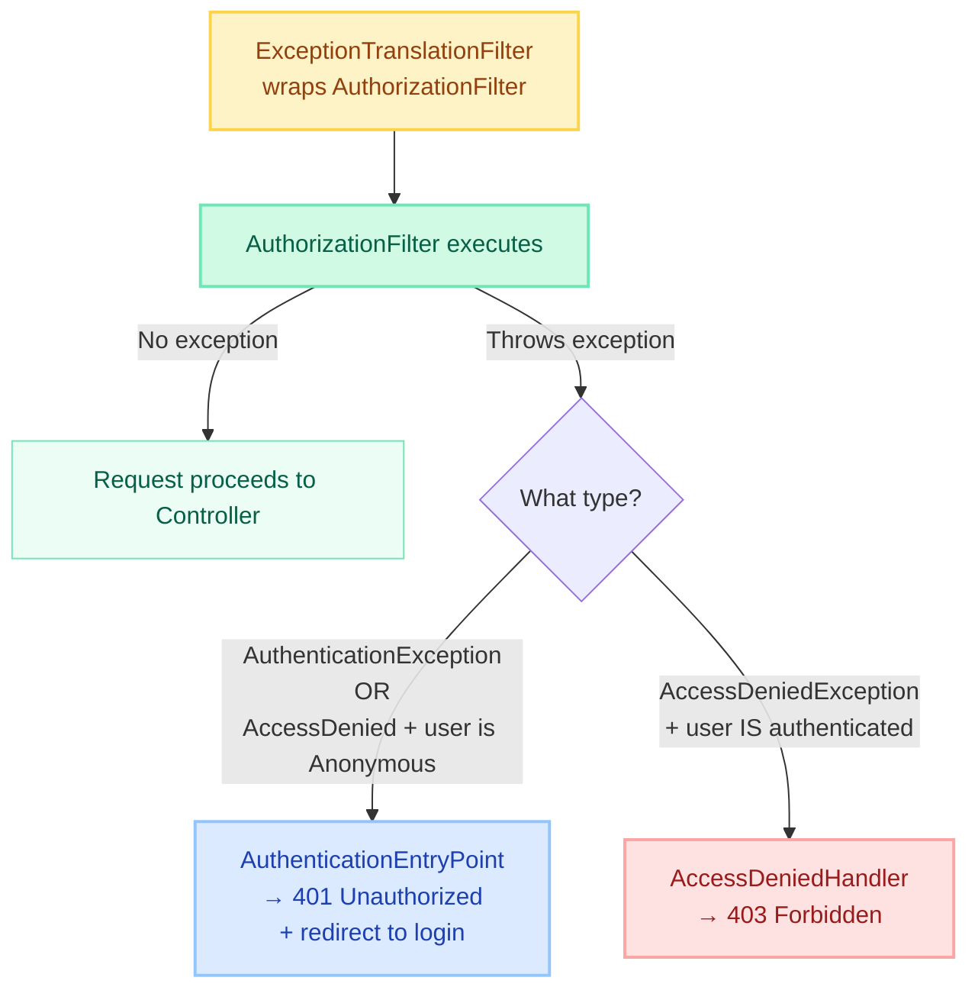

```java
// Simplified internal logic
public class ExceptionTranslationFilter extends GenericFilterBean {

    private AuthenticationEntryPoint authenticationEntryPoint;
    private AccessDeniedHandler accessDeniedHandler;

    @Override
    public void doFilter(ServletRequest req, ServletResponse res, FilterChain chain) {
        try {
            chain.doFilter(req, res); // This calls AuthorizationFilter
        } catch (AuthenticationException ex) {
            // User is not authenticated at all — challenge them
            sendStartAuthentication(request, response, ex);
        } catch (AccessDeniedException ex) {
            Authentication auth = SecurityContextHolder.getContext().getAuthentication();
            if (isAnonymous(auth)) {
                // Anonymous user → treat as authentication required (401)
                sendStartAuthentication(request, response, new InsufficientAuthenticationException("Full auth required"));
            } else {
                // Authenticated user lacking permissions → 403
                accessDeniedHandler.handle(request, response, ex);
            }
        }
    }
}
```

!!! example "🎯 Interview Tip"
    "How does Spring Security decide between 401 and 403?" — The `ExceptionTranslationFilter` checks: if the user is anonymous (or throws `AuthenticationException`), it's 401 with a challenge. If the user IS authenticated but lacks permissions (`AccessDeniedException` from a real user), it's 403.

---

### AuthorizationFilter (Position 17 — The Final Gatekeeper)

**What it does:** Evaluates the request against your configured authorization rules (`requestMatchers(...).hasRole(...)`, etc.) using `AuthorizationManager`.

**When it fires:** Every request that reaches this point in the chain. It's the last filter before your controller.

**What happens if removed:** No URL-based access control. Every authenticated (or anonymous) request reaches your controller regardless of roles/permissions.

**How to customize:** Define rules via `authorizeHttpRequests()` in your `SecurityFilterChain` configuration.

```java
// Simplified — the new AuthorizationFilter (Spring Security 6)
public class AuthorizationFilter extends GenericFilterBean {

    private AuthorizationManager<HttpServletRequest> authorizationManager;

    @Override
    public void doFilter(ServletRequest req, ServletResponse res, FilterChain chain) {
        HttpServletRequest request = (HttpServletRequest) req;
        Authentication authentication = SecurityContextHolder.getContext().getAuthentication();

        AuthorizationDecision decision = authorizationManager.check(
            () -> authentication, request);

        if (decision != null && !decision.isGranted()) {
            throw new AccessDeniedException("Access Denied");
        }

        chain.doFilter(req, res); // Authorized — proceed to controller
    }
}
```

**AuthorizationManager vs old FilterSecurityInterceptor:**

| Aspect | FilterSecurityInterceptor (5.x) | AuthorizationFilter (6.x) |
|--------|--------------------------------|--------------------------|
| Pattern | AccessDecisionManager + Voters | Single AuthorizationManager |
| Complexity | 3 classes (Manager, Voter, Config) | 1 interface |
| Method security | Separate interceptor | Same pattern, unified |
| Result | Boolean grant/deny | `AuthorizationDecision` object |

!!! tip "💡 One-liner for interviews"
    "AuthorizationFilter replaced FilterSecurityInterceptor in Spring Security 6. It uses a single AuthorizationManager instead of the old Voter pattern — simpler, more testable, and the same pattern works for both URL and method security."

---

## Custom Filters: Production Implementations

### JWT Authentication Filter (Complete with Error Handling)

This is the filter you'll write most often in real projects. It extracts a JWT from the Authorization header, validates it, and populates the SecurityContext.

```java
@Component
@RequiredArgsConstructor
public class JwtAuthenticationFilter extends OncePerRequestFilter {

    private final JwtDecoder jwtDecoder;
    private final UserDetailsService userDetailsService;

    private static final Logger log = LoggerFactory.getLogger(JwtAuthenticationFilter.class);

    @Override
    protected void doFilterInternal(HttpServletRequest request,
                                     HttpServletResponse response,
                                     FilterChain filterChain)
            throws ServletException, IOException {

        String header = request.getHeader(HttpHeaders.AUTHORIZATION);

        // No token? Let downstream filters handle (might be anonymous or other auth)
        if (header == null || !header.startsWith("Bearer ")) {
            filterChain.doFilter(request, response);
            return;
        }

        String token = header.substring(7);

        try {
            // Validate token (signature, expiry, issuer, audience)
            Jwt jwt = jwtDecoder.decode(token);

            // Extract user identity
            String username = jwt.getSubject();
            UserDetails userDetails = userDetailsService.loadUserByUsername(username);

            // Build authenticated token with authorities
            UsernamePasswordAuthenticationToken authentication =
                new UsernamePasswordAuthenticationToken(
                    userDetails,
                    null,  // Credentials cleared — we've already validated
                    userDetails.getAuthorities()
                );
            authentication.setDetails(new WebAuthenticationDetailsSource().buildDetails(request));

            // Set in SecurityContext — AuthorizationFilter will see this
            SecurityContextHolder.getContext().setAuthentication(authentication);

            log.debug("JWT authenticated user: {} with roles: {}",
                username, userDetails.getAuthorities());

        } catch (JwtException e) {
            // Token invalid — don't set auth, let ExceptionTranslationFilter handle as 401
            log.debug("JWT validation failed: {}", e.getMessage());
            SecurityContextHolder.clearContext();
        } catch (UsernameNotFoundException e) {
            // Token valid but user no longer exists in DB
            log.warn("JWT subject not found in database: {}", e.getMessage());
            SecurityContextHolder.clearContext();
        }

        filterChain.doFilter(request, response);
    }

    @Override
    protected boolean shouldNotFilter(HttpServletRequest request) {
        String path = request.getServletPath();
        // Skip JWT processing for public endpoints (performance optimization)
        return path.startsWith("/api/public/") ||
               path.startsWith("/actuator/health") ||
               path.equals("/api/auth/login");
    }
}
```

---

### API Key Filter (Service-to-Service Communication)

For internal microservice calls where issuing JWTs is overkill — validate a pre-shared API key from a header.

```java
@Component
@RequiredArgsConstructor
public class ApiKeyAuthenticationFilter extends OncePerRequestFilter {

    private final ApiKeyRepository apiKeyRepository; // DB of valid keys + their permissions

    private static final String API_KEY_HEADER = "X-API-Key";
    private static final Logger log = LoggerFactory.getLogger(ApiKeyAuthenticationFilter.class);

    @Override
    protected void doFilterInternal(HttpServletRequest request,
                                     HttpServletResponse response,
                                     FilterChain filterChain)
            throws ServletException, IOException {

        String apiKey = request.getHeader(API_KEY_HEADER);

        if (apiKey == null || apiKey.isBlank()) {
            filterChain.doFilter(request, response); // Not an API key request
            return;
        }

        Optional<ApiKeyEntity> keyEntity = apiKeyRepository.findByKeyHash(
            DigestUtils.sha256Hex(apiKey) // Never store raw keys!
        );

        if (keyEntity.isPresent() && keyEntity.get().isActive()) {
            ApiKeyEntity key = keyEntity.get();

            // Create authentication with service identity
            List<GrantedAuthority> authorities = key.getScopes().stream()
                .map(scope -> new SimpleGrantedAuthority("SCOPE_" + scope))
                .collect(Collectors.toList());

            ApiKeyAuthenticationToken auth = new ApiKeyAuthenticationToken(
                key.getServiceName(), authorities);
            auth.setDetails(new WebAuthenticationDetailsSource().buildDetails(request));

            SecurityContextHolder.getContext().setAuthentication(auth);
            log.info("API key authenticated service: {}", key.getServiceName());
        } else {
            log.warn("Invalid or inactive API key attempted from IP: {}",
                request.getRemoteAddr());
            // Don't reject here — let downstream filters/authorization handle it
        }

        filterChain.doFilter(request, response);
    }

    @Override
    protected boolean shouldNotFilter(HttpServletRequest request) {
        // Only check API key for internal service endpoints
        return !request.getServletPath().startsWith("/internal/");
    }
}
```

---

### Rate Limiting Filter (Per-User Request Throttling)

Protect your API from abuse with a token bucket rate limiter per user identity.

```java
@Component
@RequiredArgsConstructor
public class RateLimitingFilter extends OncePerRequestFilter {

    private final RateLimiterService rateLimiterService; // Backed by Redis or Bucket4j

    @Override
    protected void doFilterInternal(HttpServletRequest request,
                                     HttpServletResponse response,
                                     FilterChain filterChain)
            throws ServletException, IOException {

        String clientId = resolveClientId(request);

        RateLimitResult result = rateLimiterService.tryConsume(clientId);

        // Always set rate limit headers (even on success)
        response.setHeader("X-RateLimit-Limit", String.valueOf(result.getLimit()));
        response.setHeader("X-RateLimit-Remaining", String.valueOf(result.getRemaining()));
        response.setHeader("X-RateLimit-Reset", String.valueOf(result.getResetEpochSeconds()));

        if (!result.isAllowed()) {
            response.setStatus(HttpStatus.TOO_MANY_REQUESTS.value());
            response.setContentType(MediaType.APPLICATION_JSON_VALUE);
            response.getWriter().write("""
                {"error": "rate_limit_exceeded",
                 "message": "Too many requests. Retry after %d seconds.",
                 "retry_after": %d}
                """.formatted(result.getRetryAfterSeconds(), result.getRetryAfterSeconds()));
            return; // Short-circuit — don't call further filters
        }

        filterChain.doFilter(request, response);
    }

    private String resolveClientId(HttpServletRequest request) {
        Authentication auth = SecurityContextHolder.getContext().getAuthentication();
        if (auth != null && auth.isAuthenticated() && !(auth instanceof AnonymousAuthenticationToken)) {
            return "user:" + auth.getName();
        }
        // Fall back to IP for unauthenticated requests
        return "ip:" + request.getRemoteAddr();
    }
}
```

---

### Tenant Resolution Filter (Multi-Tenant Header Extraction)

For SaaS applications where the tenant is identified by a header or subdomain.

```java
@Component
@RequiredArgsConstructor
public class TenantResolutionFilter extends OncePerRequestFilter {

    private final TenantRepository tenantRepository;

    private static final String TENANT_HEADER = "X-Tenant-ID";

    @Override
    protected void doFilterInternal(HttpServletRequest request,
                                     HttpServletResponse response,
                                     FilterChain filterChain)
            throws ServletException, IOException {

        String tenantId = resolveTenantId(request);

        if (tenantId == null) {
            response.setStatus(HttpServletResponse.SC_BAD_REQUEST);
            response.getWriter().write("""
                {"error": "missing_tenant", "message": "X-Tenant-ID header is required"}
                """);
            return;
        }

        if (!tenantRepository.exists(tenantId)) {
            response.setStatus(HttpServletResponse.SC_NOT_FOUND);
            response.getWriter().write("""
                {"error": "invalid_tenant", "message": "Tenant not found"}
                """);
            return;
        }

        // Set in ThreadLocal — available throughout the request
        TenantContext.setCurrentTenant(tenantId);

        try {
            filterChain.doFilter(request, response);
        } finally {
            TenantContext.clear(); // Prevent ThreadLocal leaks!
        }
    }

    private String resolveTenantId(HttpServletRequest request) {
        // Strategy 1: Header
        String fromHeader = request.getHeader(TENANT_HEADER);
        if (fromHeader != null) return fromHeader;

        // Strategy 2: Subdomain (tenant1.app.example.com)
        String host = request.getServerName();
        if (host.contains(".app.example.com")) {
            return host.split("\\.")[0];
        }

        return null;
    }

    @Override
    protected boolean shouldNotFilter(HttpServletRequest request) {
        // Health checks don't need tenant context
        return request.getServletPath().startsWith("/actuator/");
    }
}
```

---

### Request Logging Filter (Correlation ID Injection)

Inject a correlation ID for distributed tracing and log every request/response pair.

```java
@Component
public class RequestLoggingFilter extends OncePerRequestFilter {

    private static final String CORRELATION_HEADER = "X-Correlation-ID";
    private static final Logger log = LoggerFactory.getLogger(RequestLoggingFilter.class);

    @Override
    protected void doFilterInternal(HttpServletRequest request,
                                     HttpServletResponse response,
                                     FilterChain filterChain)
            throws ServletException, IOException {

        // Use incoming correlation ID or generate new one
        String correlationId = request.getHeader(CORRELATION_HEADER);
        if (correlationId == null || correlationId.isBlank()) {
            correlationId = UUID.randomUUID().toString();
        }

        // Add to MDC for structured logging
        MDC.put("correlationId", correlationId);
        // Add to response headers for client tracing
        response.setHeader(CORRELATION_HEADER, correlationId);

        long startTime = System.currentTimeMillis();

        try {
            log.info("→ {} {} from {} | User: {}",
                request.getMethod(), request.getRequestURI(),
                request.getRemoteAddr(), getCurrentUser());

            filterChain.doFilter(request, response);

        } finally {
            long duration = System.currentTimeMillis() - startTime;
            log.info("← {} {} | Status: {} | Duration: {}ms",
                request.getMethod(), request.getRequestURI(),
                response.getStatus(), duration);
            MDC.clear();
        }
    }

    private String getCurrentUser() {
        Authentication auth = SecurityContextHolder.getContext().getAuthentication();
        return (auth != null && auth.isAuthenticated()) ? auth.getName() : "anonymous";
    }
}
```

---

## Where to Place Custom Filters

This is where most developers make mistakes. Place your filter in the wrong position and it either never fires, fires too late, or breaks the entire chain.

### addFilterBefore() vs addFilterAfter() vs addFilterAt()

```java
@Bean
public SecurityFilterChain filterChain(HttpSecurity http) throws Exception {
    return http
        // BEFORE: Your filter runs first, then the reference filter
        .addFilterBefore(jwtFilter, UsernamePasswordAuthenticationFilter.class)

        // AFTER: The reference filter runs first, then yours
        .addFilterAfter(auditFilter, AuthorizationFilter.class)

        // AT: Your filter runs at the SAME position (doesn't replace — both execute!)
        .addFilterAt(customAuthFilter, UsernamePasswordAuthenticationFilter.class)
        .build();
}
```

!!! danger "⚠️ What breaks"
    `addFilterAt()` does NOT replace the original filter — both will execute at that position. If you want to replace `UsernamePasswordAuthenticationFilter` with your custom auth filter, you must also disable form login: `.formLogin(form -> form.disable())`.

### Decision Flowchart for Filter Placement

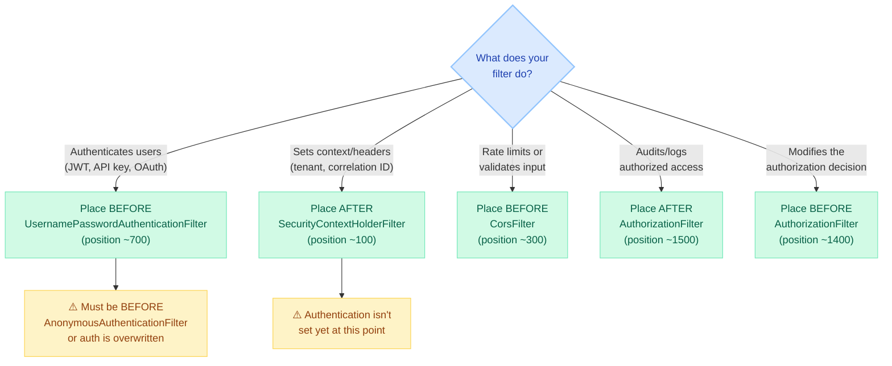

### Common Filter Position Mistakes

| Mistake | What Happens | Fix |
|---------|-------------|-----|
| JWT filter AFTER `AnonymousAuthenticationFilter` | Anonymous auth is already set; your JWT auth gets ignored | Place BEFORE `UsernamePasswordAuthenticationFilter` |
| Tenant filter BEFORE `SecurityContextHolderFilter` | SecurityContext not loaded yet; can't check user's tenant permissions | Place AFTER `SecurityContextHolderFilter` |
| Rate limiter AFTER `AuthorizationFilter` | Unauthorized requests still count against rate limit | Place BEFORE authentication filters |
| Logging filter AT position of another filter | Both filters run; duplicate processing | Use `addFilterBefore` or `addFilterAfter` instead |

---

## Multiple SecurityFilterChains: Real-World Configuration

Here's a production-grade configuration with four separate chains — each with different auth mechanisms, session policies, and filter sets.

```java
@Configuration
@EnableWebSecurity
public class SecurityConfig {

    // ═══════════════════════════════════════════════════════════
    // Chain 1: Health & public endpoints — NO SECURITY AT ALL
    // ═══════════════════════════════════════════════════════════
    @Bean
    @Order(0)
    public SecurityFilterChain healthChain(HttpSecurity http) throws Exception {
        return http
            .securityMatcher("/actuator/health", "/actuator/info", "/api/public/**")
            .authorizeHttpRequests(auth -> auth.anyRequest().permitAll())
            .csrf(csrf -> csrf.disable())
            .sessionManagement(s -> s.sessionCreationPolicy(SessionCreationPolicy.STATELESS))
            .build();
    }

    // ═══════════════════════════════════════════════════════════
    // Chain 2: REST API — Stateless JWT authentication
    // ═══════════════════════════════════════════════════════════
    @Bean
    @Order(1)
    public SecurityFilterChain apiChain(HttpSecurity http,
                                         JwtAuthenticationFilter jwtFilter) throws Exception {
        return http
            .securityMatcher("/api/**")
            .csrf(csrf -> csrf.disable()) // Stateless = no CSRF
            .sessionManagement(s -> s.sessionCreationPolicy(SessionCreationPolicy.STATELESS))
            .addFilterBefore(jwtFilter, UsernamePasswordAuthenticationFilter.class)
            .authorizeHttpRequests(auth -> auth
                .requestMatchers("/api/auth/**").permitAll()
                .requestMatchers("/api/admin/**").hasRole("ADMIN")
                .requestMatchers("/api/reports/**").hasAnyRole("ADMIN", "ANALYST")
                .anyRequest().authenticated()
            )
            .exceptionHandling(ex -> ex
                .authenticationEntryPoint((req, res, e) -> {
                    res.setStatus(401);
                    res.setContentType("application/json");
                    res.getWriter().write("""
                        {"error": "unauthorized", "message": "Bearer token required"}""");
                })
                .accessDeniedHandler((req, res, e) -> {
                    res.setStatus(403);
                    res.setContentType("application/json");
                    res.getWriter().write("""
                        {"error": "forbidden", "message": "Insufficient permissions"}""");
                })
            )
            .build();
    }

    // ═══════════════════════════════════════════════════════════
    // Chain 3: Web application — Session-based form login
    // ═══════════════════════════════════════════════════════════
    @Bean
    @Order(2)
    public SecurityFilterChain webChain(HttpSecurity http) throws Exception {
        return http
            .securityMatcher("/web/**", "/login", "/logout", "/css/**", "/js/**")
            .authorizeHttpRequests(auth -> auth
                .requestMatchers("/css/**", "/js/**", "/login").permitAll()
                .requestMatchers("/web/admin/**").hasRole("ADMIN")
                .anyRequest().authenticated()
            )
            .formLogin(form -> form
                .loginPage("/login")
                .loginProcessingUrl("/login")
                .defaultSuccessUrl("/web/dashboard")
                .failureUrl("/login?error=true")
            )
            .logout(logout -> logout
                .logoutUrl("/logout")
                .logoutSuccessUrl("/login?logout=true")
                .invalidateHttpSession(true)
                .deleteCookies("JSESSIONID")
            )
            .csrf(Customizer.withDefaults()) // CSRF enabled for browser forms
            .build();
    }

    // ═══════════════════════════════════════════════════════════
    // Chain 4: Actuator/monitoring — HTTP Basic for ops team
    // ═══════════════════════════════════════════════════════════
    @Bean
    @Order(3)
    public SecurityFilterChain actuatorChain(HttpSecurity http) throws Exception {
        return http
            .securityMatcher("/actuator/**")
            .authorizeHttpRequests(auth -> auth.anyRequest().hasRole("OPS"))
            .httpBasic(basic -> basic
                .realmName("Actuator")
                .authenticationEntryPoint(new BasicAuthenticationEntryPoint() {{
                    setRealmName("Actuator");
                }})
            )
            .sessionManagement(s -> s.sessionCreationPolicy(SessionCreationPolicy.STATELESS))
            .csrf(csrf -> csrf.disable())
            .build();
    }
}
```

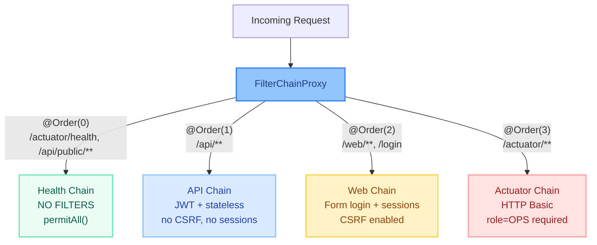

!!! warning "🔥 Production War Story"
    A team had `@Order(1)` on their web chain matching `/**` and `@Order(2)` on their API chain matching `/api/**`. The web chain swallowed ALL requests (including API calls) because `/**` matches everything and it had lower order number. Their API returned HTML login pages instead of JSON 401s. Rule: **always put more specific matchers at lower order numbers**.

---

## Real-World Architecture: JWT + API Key Hybrid

Many production systems need to support both user-initiated (JWT) and service-to-service (API Key) authentication on the same endpoints.

```java
@Configuration
@EnableWebSecurity
public class HybridAuthConfig {

    @Bean
    @Order(1)
    public SecurityFilterChain hybridApiChain(HttpSecurity http,
                                               JwtAuthenticationFilter jwtFilter,
                                               ApiKeyAuthenticationFilter apiKeyFilter)
            throws Exception {
        return http
            .securityMatcher("/api/**")
            .csrf(csrf -> csrf.disable())
            .sessionManagement(s -> s.sessionCreationPolicy(SessionCreationPolicy.STATELESS))
            // API key filter runs FIRST — if key present, authenticates as service
            .addFilterBefore(apiKeyFilter, UsernamePasswordAuthenticationFilter.class)
            // JWT filter runs SECOND — if Bearer token present, authenticates as user
            .addFilterBefore(jwtFilter, UsernamePasswordAuthenticationFilter.class)
            .authorizeHttpRequests(auth -> auth
                .requestMatchers("/api/internal/**").hasAuthority("SCOPE_internal")
                .requestMatchers("/api/admin/**").hasRole("ADMIN")
                .anyRequest().authenticated()
            )
            .build();
    }
}
```

The key insight: both filters check if auth is already set. If the API key filter authenticates first, the JWT filter sees an existing Authentication and skips. This gives you a natural priority chain.

---

## OAuth2 Login Flow Through Filters

When you configure `.oauth2Login()`, Spring Security adds these additional filters:

```java
@Bean
public SecurityFilterChain oauth2Chain(HttpSecurity http) throws Exception {
    return http
        .authorizeHttpRequests(auth -> auth.anyRequest().authenticated())
        .oauth2Login(oauth2 -> oauth2
            .authorizationEndpoint(a -> a.baseUri("/oauth2/authorize"))
            .redirectionEndpoint(r -> r.baseUri("/oauth2/callback/*"))
            .userInfoEndpoint(u -> u.userService(customOAuth2UserService()))
        )
        .build();
}
```

**What filters get added:**

| Filter | Role in OAuth2 Flow |
|--------|-------------------|
| `OAuth2AuthorizationRequestRedirectFilter` | Intercepts `/oauth2/authorize/{provider}`, builds the authorization URL, redirects to Google/GitHub |
| `OAuth2LoginAuthenticationFilter` | Intercepts the callback URL with the auth code, exchanges it for tokens, loads user info |

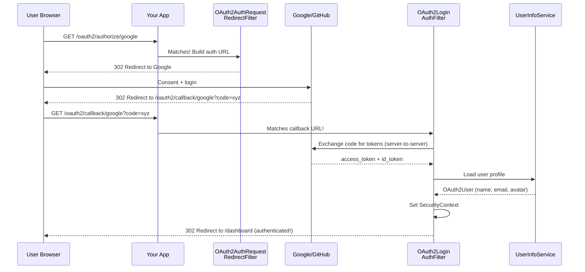

---

## SecurityFilterChain vs WebSecurityConfigurerAdapter

### The Old Way (Spring Security 5.x — DEPRECATED)

```java
// ❌ Don't write new code like this
@Configuration
@EnableWebSecurity
public class SecurityConfig extends WebSecurityConfigurerAdapter {

    @Override
    protected void configure(HttpSecurity http) throws Exception {
        http
            .authorizeRequests()
                .antMatchers("/api/public/**").permitAll()
                .antMatchers("/api/admin/**").hasRole("ADMIN")
                .anyRequest().authenticated()
            .and()
            .httpBasic()
            .and()
            .csrf().disable();
    }

    @Override
    protected void configure(AuthenticationManagerBuilder auth) throws Exception {
        auth.userDetailsService(userDetailsService)
            .passwordEncoder(new BCryptPasswordEncoder());
    }

    @Bean
    @Override
    public AuthenticationManager authenticationManagerBean() throws Exception {
        return super.authenticationManagerBean();
    }
}
```

### The New Way (Spring Security 6.x — Current)

```java
// ✅ Modern component-based configuration
@Configuration
@EnableWebSecurity
public class SecurityConfig {

    @Bean
    public SecurityFilterChain filterChain(HttpSecurity http) throws Exception {
        return http
            .authorizeHttpRequests(auth -> auth
                .requestMatchers("/api/public/**").permitAll()
                .requestMatchers("/api/admin/**").hasRole("ADMIN")
                .anyRequest().authenticated()
            )
            .httpBasic(Customizer.withDefaults())
            .csrf(csrf -> csrf.disable())
            .build();
    }

    @Bean
    public AuthenticationManager authManager(AuthenticationConfiguration config)
            throws Exception {
        return config.getAuthenticationManager();
    }

    @Bean
    public UserDetailsService userDetailsService(UserRepository userRepo) {
        return username -> userRepo.findByUsername(username)
            .orElseThrow(() -> new UsernameNotFoundException("User not found: " + username));
    }

    @Bean
    public PasswordEncoder passwordEncoder() {
        return new BCryptPasswordEncoder();
    }
}
```

### Migration Cheat Sheet

| Spring Security 5.x | Spring Security 6.x | Why Changed |
|---------------------|---------------------|-------------|
| `extends WebSecurityConfigurerAdapter` | `SecurityFilterChain` bean method | Composition > Inheritance. Testable. Multiple chains. |
| `authorizeRequests()` | `authorizeHttpRequests()` | New `AuthorizationManager` API (simpler than Voters) |
| `antMatchers("/path")` | `requestMatchers("/path")` | Auto-selects MVC vs Ant matcher based on classpath |
| `.and()` chaining | Lambda DSL only | Cleaner, IDE autocomplete-friendly |
| `FilterSecurityInterceptor` | `AuthorizationFilter` | Simplified — no more AccessDecisionManager/Voters |
| `SecurityContextPersistenceFilter` | `SecurityContextHolderFilter` | Explicit save (no auto-save preventing stateless bugs) |
| Auto-save SecurityContext | Must explicitly save | Prevents accidental session creation in stateless APIs |

!!! example "🎯 Interview Tip"
    "What changed between Spring Security 5 and 6?" — Three big things: (1) Inheritance to composition — no more `WebSecurityConfigurerAdapter`, just `@Bean` methods. (2) New `AuthorizationManager` replaces the complex Voter pattern. (3) Explicit context saving — `SecurityContextHolderFilter` won't auto-save, preventing subtle bugs in stateless APIs where sessions were accidentally created.

---

## Debugging the Filter Chain

When something goes wrong (and it will), here's your debugging toolkit.

### Enable Security Debug Logging

=== "application.yml"

    ```yaml
    logging:
      level:
        org.springframework.security: DEBUG
        org.springframework.security.web.FilterChainProxy: TRACE
        org.springframework.security.web.access: TRACE
        org.springframework.security.authentication: TRACE
    ```

=== "@EnableWebSecurity(debug = true)"

    ```java
    @EnableWebSecurity(debug = true)  // ⚠️ NEVER IN PRODUCTION — logs headers including auth tokens!
    @Configuration
    public class SecurityConfig { }
    ```

    This prints for every request:
    ```
    Request received for GET '/api/orders':
    servletPath:/api/orders
    headers:
      Authorization: Bearer eyJhbG...
    Security filter chain: [
      DisableEncodeUrlFilter
      WebAsyncManagerIntegrationFilter
      SecurityContextHolderFilter
      ...
      AuthorizationFilter
    ]
    ```

### Reading the Debug Output (Pattern Recognition)

| Log Pattern | What It Means | Action |
|-------------|---------------|--------|
| `"Security filter chain: []"` | No chain matched this URL | Check `securityMatcher()` patterns |
| `"Did not match request to..."` repeated | Multiple chains rejecting | Your URL doesn't match ANY chain |
| `"Anonymous user is not authorized"` | AnonymousAuthFilter set auth before your filter | Your auth filter is in wrong position |
| `"Failed to authorize ... with authorization manager"` | AuthorizationFilter denied | Check role/authority mapping |
| `"SecurityContext is empty"` | No filter populated the context | Auth filter didn't fire or threw silently |

### Programmatic Filter Chain Inspector

Drop this bean into your app to see exactly what filters are registered in what order:

```java
@Component
@Slf4j
public class FilterChainInspector implements CommandLineRunner {

    @Autowired
    private List<SecurityFilterChain> filterChains;

    @Override
    public void run(String... args) {
        log.info("╔══════════════════════════════════════════════════╗");
        log.info("║       SECURITY FILTER CHAIN CONFIGURATION       ║");
        log.info("╚══════════════════════════════════════════════════╝");

        for (int i = 0; i < filterChains.size(); i++) {
            SecurityFilterChain chain = filterChains.get(i);
            log.info("━━━ Chain {} ({} filters) ━━━", i + 1, chain.getFilters().size());
            for (int j = 0; j < chain.getFilters().size(); j++) {
                log.info("  {}. {}", j + 1,
                    chain.getFilters().get(j).getClass().getSimpleName());
            }
        }
    }
}
```

### Custom Debug Filter (Nuclear Option)

When nothing else works, add a temporary filter that logs everything:

```java
// TEMPORARY — remove before merging to main!
public class SecurityDebugFilter extends OncePerRequestFilter {

    private static final Logger log = LoggerFactory.getLogger(SecurityDebugFilter.class);

    @Override
    protected void doFilterInternal(HttpServletRequest request,
                                     HttpServletResponse response,
                                     FilterChain chain) throws ServletException, IOException {
        Authentication before = SecurityContextHolder.getContext().getAuthentication();
        log.debug("BEFORE chain — Auth: {}, Path: {} {}",
            before != null ? before.getClass().getSimpleName() + "(" + before.getName() + ")" : "NULL",
            request.getMethod(), request.getRequestURI());

        chain.doFilter(request, response);

        Authentication after = SecurityContextHolder.getContext().getAuthentication();
        log.debug("AFTER chain — Auth: {}, Status: {}",
            after != null ? after.getClass().getSimpleName() + "(" + after.getName() + ")" : "NULL",
            response.getStatus());
    }
}
```

### Common Debugging Scenarios

| Symptom | Root Cause | How to Fix |
|---------|-----------|------------|
| 403 on every POST request | CSRF token missing | Either disable CSRF (stateless API) or include `_csrf` parameter/header |
| 401 when JWT token is valid | JWT filter placed AFTER AnonymousAuthFilter | Move JWT filter BEFORE `UsernamePasswordAuthenticationFilter` |
| CORS preflight returns 401/403 | OPTIONS request rejected by auth filters | Configure `.cors()` in SecurityFilterChain — it processes OPTIONS before auth |
| SecurityContext null in `@Async` method | ThreadLocal doesn't propagate to child threads | Use `MODE_INHERITABLETHREADLOCAL` or wrap executor with `DelegatingSecurityContextExecutor` |
| Login succeeds but next request is anonymous | SecurityContext not saved (Spring 6) | Ensure `SecurityContextRepository` is configured; call `saveContext()` explicitly |
| Multiple chains — wrong one matches | `@Order` too broad or `securityMatcher` overlap | Put most specific matcher at lowest order; enable TRACE logging |
| Custom filter executes twice | Filter registered as both Spring bean AND in chain | Exclude from auto-registration with `FilterRegistrationBean.setEnabled(false)` |

!!! warning "🔥 Production War Story"
    A team spent 3 days debugging "random 403s." Their JWT filter was a `@Component` (Spring auto-registered it as a servlet filter) AND they added it to the SecurityFilterChain. Result: it ran twice — once as a servlet filter (before Spring Security) where SecurityContext save didn't work properly, and once in the correct position. Fix: add `FilterRegistrationBean<JwtFilter>` with `setEnabled(false)` to prevent double-registration.

```java
// Prevent Spring Boot from auto-registering your filter as a servlet filter
@Bean
public FilterRegistrationBean<JwtAuthenticationFilter> jwtFilterRegistration(
        JwtAuthenticationFilter filter) {
    FilterRegistrationBean<JwtAuthenticationFilter> registration = new FilterRegistrationBean<>(filter);
    registration.setEnabled(false); // Don't register as servlet filter — only use in SecurityFilterChain
    return registration;
}
```

---

## CSRF Protection Deep Dive

### How CsrfFilter Works

The `CsrfFilter` generates a unique token per session and validates it on every state-changing request.

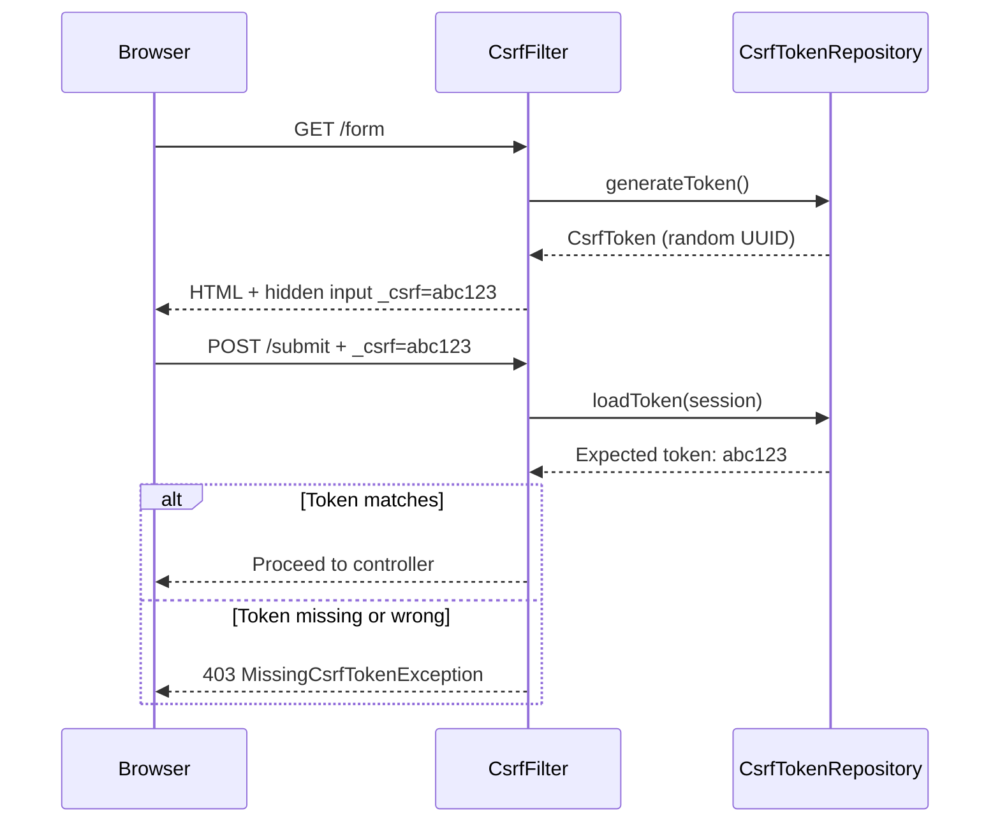

### When to Disable CSRF

| Scenario | Disable CSRF? | Reason |
|----------|:---:|--------|
| Stateless JWT API (no cookies) | Yes | No cookies = no CSRF vulnerability. Tokens are in Authorization header. |
| Browser SPA with session cookies | **NO** | Browser auto-sends cookies; CSRF attack possible |
| SPA with JWT in localStorage | Yes | No cookies involved (but XSS risk instead) |
| Server-rendered forms | **NO** | Classic CSRF scenario — always protect |
| Webhook endpoints | Yes (for those paths) | External services can't provide your CSRF token |

```java
// Selective CSRF — disable for API, enable for web forms
.csrf(csrf -> csrf
    .ignoringRequestMatchers("/api/**", "/webhooks/**")
    // Web paths still protected
)
```

---

## CORS Configuration (The Right Way)

The `CorsFilter` must process OPTIONS preflight requests **before** authentication filters reject them.

```java
@Bean
public CorsConfigurationSource corsConfigurationSource() {
    CorsConfiguration config = new CorsConfiguration();
    config.setAllowedOrigins(List.of(
        "https://app.example.com",
        "https://admin.example.com"
    ));
    config.setAllowedMethods(List.of("GET", "POST", "PUT", "DELETE", "PATCH", "OPTIONS"));
    config.setAllowedHeaders(List.of("Authorization", "Content-Type", "X-Request-ID"));
    config.setExposedHeaders(List.of("X-Total-Count", "X-Correlation-ID"));
    config.setAllowCredentials(true);
    config.setMaxAge(3600L); // Cache preflight for 1 hour

    UrlBasedCorsConfigurationSource source = new UrlBasedCorsConfigurationSource();
    source.registerCorsConfiguration("/api/**", config);
    return source;
}

@Bean
public SecurityFilterChain apiChain(HttpSecurity http) throws Exception {
    return http
        .cors(cors -> cors.configurationSource(corsConfigurationSource()))
        // ... rest of config
        .build();
}
```

!!! danger "⚠️ What breaks"
    If you configure CORS only with `@CrossOrigin` annotations on controllers but don't configure it in the SecurityFilterChain, preflight OPTIONS requests will be rejected with 401/403 because they hit authentication filters before reaching your controller. The `CorsFilter` in the security chain handles OPTIONS **before** auth filters fire.

---

## SecurityContext & ThreadLocal Strategies

The `SecurityContextHolder` uses a `ThreadLocal` strategy to make the current user's `Authentication` available anywhere in the request processing thread.

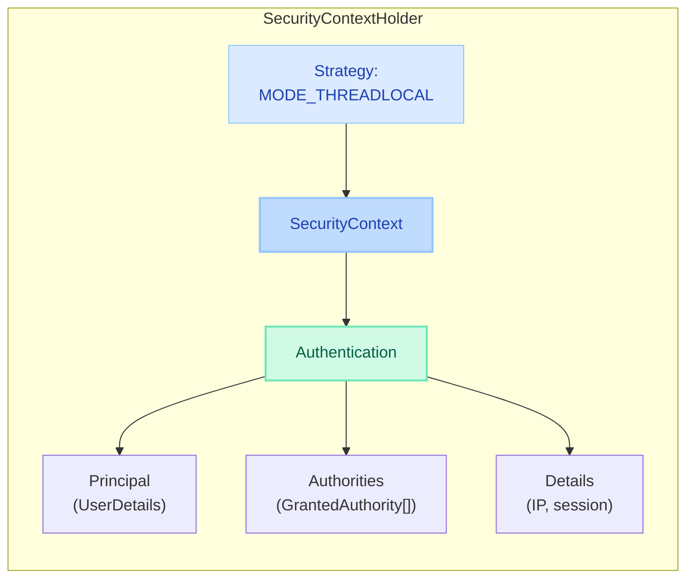

### Strategy Modes

| Mode | Behavior | Use Case |
|------|----------|----------|
| `MODE_THREADLOCAL` (default) | Context bound to current thread only | Standard servlet requests |
| `MODE_INHERITABLETHREADLOCAL` | Context propagated to child threads | `@Async` methods, parallel streams |
| `MODE_GLOBAL` | Single context for entire JVM | Desktop apps, batch jobs |

```java
// Propagate SecurityContext to @Async methods
@Configuration
@EnableAsync
public class AsyncConfig implements AsyncConfigurer {

    @Override
    public Executor getAsyncExecutor() {
        ThreadPoolTaskExecutor executor = new ThreadPoolTaskExecutor();
        executor.setCorePoolSize(10);
        executor.setMaxPoolSize(50);
        executor.initialize();
        // Wrap to propagate SecurityContext to async threads
        return new DelegatingSecurityContextExecutor(executor);
    }
}
```

!!! question "❓ Counter-questions"
    **Q: "Why not always use MODE_INHERITABLETHREADLOCAL?"**
    A: Thread pools reuse threads. If thread A handles user X's request, then serves user Y's request without clearing, user Y could inherit user X's context. `MODE_THREADLOCAL` + explicit `DelegatingSecurityContextExecutor` is safer because it copies the context explicitly at task submission time.

---

## Common Interview Questions (With Answers)

### What is DelegatingFilterProxy and why does it exist?

!!! tip "💡 One-liner for interviews"
    "DelegatingFilterProxy is a servlet filter that delegates to a Spring bean. It exists because the Servlet container initializes filters before Spring starts — so it acts as a lazy bridge, deferring bean lookup until the first request when Spring is ready."

---

### How many filter chains can you have? How is the right one selected?

!!! tip "💡 One-liner for interviews"
    "You can have as many SecurityFilterChain beans as you need. FilterChainProxy iterates them in @Order and uses the FIRST one whose securityMatcher matches the request URL. Order matters — a catch-all at @Order(1) blocks everything else."

---

### Where would you add a JWT filter and why?

!!! tip "💡 One-liner for interviews"
    "Before UsernamePasswordAuthenticationFilter. This ensures the JWT is validated and SecurityContext is populated before any other authentication mechanism tries to run, and critically, before AnonymousAuthenticationFilter marks the request as anonymous."

---

### What's the difference between AuthorizationFilter and FilterSecurityInterceptor?

!!! tip "💡 One-liner for interviews"
    "AuthorizationFilter (6.x) uses a single AuthorizationManager interface instead of the old AccessDecisionManager + Voter chain. It's simpler, more testable, and the same pattern works for both URL and method security. The Voter pattern required implementing three interfaces — now it's just one."

---

### How does ExceptionTranslationFilter decide between 401 and 403?

!!! tip "💡 One-liner for interviews"
    "If the exception is AuthenticationException OR AccessDeniedException from an anonymous user — it's 401 (challenge to authenticate). If it's AccessDeniedException from an already-authenticated user who simply lacks permissions — it's 403 (forbidden, no retry will help)."

---

### How do you skip security for certain endpoints?

=== "Option 1: Separate chain with permitAll"

    ```java
    @Bean
    @Order(0) // Evaluated FIRST
    public SecurityFilterChain publicChain(HttpSecurity http) throws Exception {
        return http
            .securityMatcher("/api/public/**", "/health")
            .authorizeHttpRequests(auth -> auth.anyRequest().permitAll())
            .csrf(csrf -> csrf.disable())
            .build();
    }
    ```

=== "Option 2: WebSecurityCustomizer (skips filter chain entirely)"

    ```java
    @Bean
    public WebSecurityCustomizer webSecurityCustomizer() {
        // These paths bypass the ENTIRE security filter chain — no filters at all
        return web -> web.ignoring()
            .requestMatchers("/static/**", "/favicon.ico");
    }
    ```

=== "Option 3: permitAll() within a chain"

    ```java
    .authorizeHttpRequests(auth -> auth
        .requestMatchers("/api/public/**").permitAll() // Filters still run, just no auth required
        .anyRequest().authenticated()
    )
    ```

!!! danger "⚠️ What breaks"
    `web.ignoring()` completely bypasses the security filter chain — no CORS headers, no security headers, no CSRF protection. Use it ONLY for truly static resources. For API endpoints that should be public but still need CORS/headers, use `permitAll()` within a chain.

---

### How do you propagate SecurityContext to async threads?

```java
// Option 1: DelegatingSecurityContextExecutor (recommended)
@Bean
public Executor taskExecutor() {
    return new DelegatingSecurityContextExecutor(
        Executors.newFixedThreadPool(10));
}

// Option 2: @Async with SecurityContextHolder strategy
// Set at app startup:
SecurityContextHolder.setStrategyName(SecurityContextHolder.MODE_INHERITABLETHREADLOCAL);

// Option 3: Manual propagation
CompletableFuture.supplyAsync(() -> {
    SecurityContext context = SecurityContextHolder.getContext(); // Captured in parent
    SecurityContextHolder.setContext(context); // Set in child
    try {
        return doWork();
    } finally {
        SecurityContextHolder.clearContext();
    }
}, executor);
```

---

## Quick Reference: The Full Picture

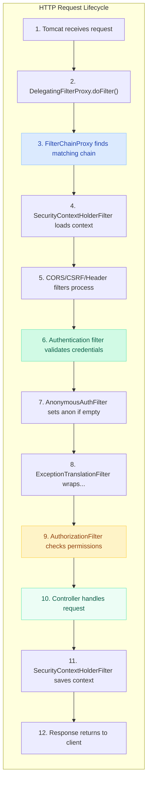

### Concept → Class → Purpose (Memory Table)

| Concept | Key Class | What to Say in Interviews |
|---------|-----------|---------------------------|
| Servlet→Spring bridge | `DelegatingFilterProxy` | Lazy-loads Spring bean; exists because Servlet init beats Spring init |
| Central dispatcher | `FilterChainProxy` | Holds all chains, uses first match, delegates to VirtualFilterChain |
| Chain definition | `SecurityFilterChain` | `matches(request)` + ordered filter list |
| Auth orchestrator | `AuthenticationManager` | Single `authenticate()` method; default impl is `ProviderManager` |
| Auth verification | `AuthenticationProvider` | Does actual credential check (DB lookup + password match) |
| User loading | `UserDetailsService` | `loadUserByUsername()` — the DB query |
| Password safety | `PasswordEncoder` | BCrypt by default; `matches(raw, encoded)` |
| Context storage | `SecurityContextHolder` | ThreadLocal<SecurityContext> — per-request auth state |
| Context persistence | `SecurityContextRepository` | Session or request-scoped — how auth survives between requests |
| 401 vs 403 | `ExceptionTranslationFilter` | Anonymous + denied = 401; Authenticated + denied = 403 |
| URL authorization | `AuthorizationFilter` | Final gatekeeper; uses `AuthorizationManager.check()` |
| CSRF | `CsrfFilter` | Token per session; validates on POST/PUT/DELETE |
| JWT resource server | `BearerTokenAuthenticationFilter` | Spring's built-in JWT filter — extracts Bearer, validates, sets auth |

---

## Interview Answer Template

!!! abstract "How to Structure Any Filter Chain Answer"

    **Pattern:** Architecture → Flow → Configuration → Gotcha

    **Example: "Explain how Spring Security processes an HTTP request."**

    1. **Architecture** (10s): "Every request passes through DelegatingFilterProxy → FilterChainProxy → a matched SecurityFilterChain. The proxy bridges Servlet and Spring worlds; FilterChainProxy selects the first matching chain by URL pattern."

    2. **Key Filters** (20s): "The chain has ~16 ordered filters. The critical ones: SecurityContextHolderFilter loads auth state, authentication filters validate credentials, AnonymousAuthFilter fills empty context, ExceptionTranslationFilter translates exceptions to HTTP codes, and AuthorizationFilter enforces access rules."

    3. **Concrete Flow** (20s): "For a JWT API: my custom JwtFilter extracts the Bearer token, validates signature and expiry via JwtDecoder, loads UserDetails, and sets Authentication in SecurityContextHolder. AuthorizationFilter then checks if the user's authorities satisfy the endpoint's rules."

    4. **Gotcha** (10s): "Filter order is critical — JWT filter must be before AnonymousAuthFilter or the context is overwritten. In Spring Security 6, context saving is explicit — forgetting to save causes stateful apps to lose auth between requests."

---

!!! question "❓ Counter-questions"
    **To ask the interviewer back:**

    - "In your system, do you use a single SecurityFilterChain or multiple? I've found that separating API and web chains avoids a lot of CSRF/session confusion."
    - "Do you use Spring's built-in `BearerTokenAuthenticationFilter` or a custom JWT filter? I've seen tradeoffs with both approaches."
    - "How do you handle token refresh — silent refresh in a filter, or a dedicated /refresh endpoint?"

    These show you've built real systems, not just read docs.

---

## Final Checklist: Can You Draw This From Memory?

After reading this page, you should be able to:

- [ ] Draw the 3-layer delegation: Servlet Container → DelegatingFilterProxy → FilterChainProxy → SecurityFilterChain
- [ ] Name the 5 critical filters and their positions (Context, Auth, Anonymous, Exception, Authorization)
- [ ] Explain WHY `ExceptionTranslationFilter` sits before `AuthorizationFilter`
- [ ] Know where to place a custom JWT filter and articulate why that position
- [ ] Configure multiple SecurityFilterChains with different auth mechanisms
- [ ] Debug a 403 by enabling TRACE logging and reading the output
- [ ] Explain the 401 vs 403 decision logic
- [ ] Describe what changed from Spring Security 5 to 6 (three key changes)
- [ ] Implement a production JWT filter with proper error handling
- [ ] Prevent the double-registration bug with `FilterRegistrationBean`
