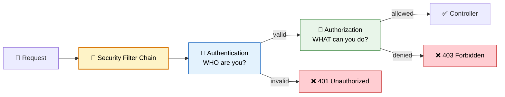
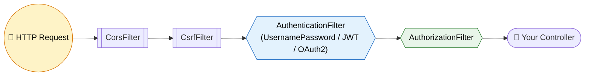
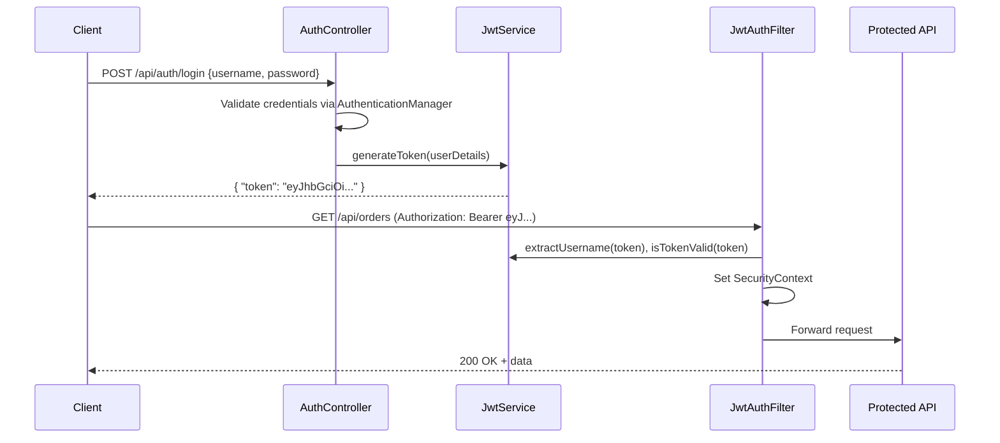

# Spring Security

> **Authentication, authorization, and filter chain internals for Spring Boot 3 / Spring Security 6.**

---

!!! abstract "Real-World Analogy"
    Think of a **nightclub**. The bouncer at the door checks your ID (**authentication** — are you who you claim to be?). Once inside, your wristband color determines access (**authorization** — VIP area? Backstage?). Spring Security is both the bouncer AND the wristband system for your application.



---

## Filter Chain Architecture

Spring Security is a servlet filter chain that intercepts every HTTP request before it reaches your controller.



Key points:

- `DelegatingFilterProxy` bridges the Servlet container to Spring's `FilterChainProxy`.
- `FilterChainProxy` holds one or more `SecurityFilterChain` beans.
- Each `SecurityFilterChain` matches a request pattern and applies its ordered list of filters.
- Filter order matters. Spring applies filters in a fixed sequence: CORS -> CSRF -> Authentication -> Authorization.

!!! warning "Multiple SecurityFilterChain Beans"
    When you define multiple `SecurityFilterChain` beans, **the `@Order` annotation determines which chain matches first**. A chain with a broader pattern registered before a specific chain will swallow requests intended for the specific chain.

---

## SecurityFilterChain Configuration (Spring Security 6)

Spring Security 6 removed `WebSecurityConfigurerAdapter`. Configuration is now purely component-based.

```java
@Configuration
@EnableWebSecurity
public class SecurityConfig {

    @Bean
    public SecurityFilterChain filterChain(HttpSecurity http) throws Exception {
        return http
            .csrf(csrf -> csrf.disable())
            .authorizeHttpRequests(auth -> auth
                .requestMatchers("/api/public/**", "/actuator/health").permitAll()
                .requestMatchers("/api/admin/**").hasRole("ADMIN")
                .requestMatchers("/api/orders/**").hasAnyRole("USER", "ADMIN")
                .anyRequest().authenticated()
            )
            .sessionManagement(session ->
                session.sessionCreationPolicy(SessionCreationPolicy.STATELESS))
            .httpBasic(Customizer.withDefaults())
            .build();
    }

    @Bean
    public PasswordEncoder passwordEncoder() {
        return new BCryptPasswordEncoder();
    }
}
```

!!! tip "Default Behavior"
    Adding `spring-boot-starter-security` immediately secures ALL endpoints. A generated password prints to logs. Every request requires login until you define a custom `SecurityFilterChain`.

---

## Authentication vs Authorization

| | Authentication | Authorization |
|---|---|---|
| **Question** | WHO are you? | WHAT can you do? |
| **When** | First (login) | After authentication |
| **Failure** | 401 Unauthorized | 403 Forbidden |
| **Mechanism** | Password, JWT, OAuth2 | Roles, Permissions, Scopes |
| **Spring class** | `AuthenticationManager` | `AuthorizationManager` |

---

## Authentication Approaches

### Form Login

Default for browser-based apps. Spring generates a login page at `/login`.

```java
@Bean
public SecurityFilterChain formLoginChain(HttpSecurity http) throws Exception {
    return http
        .authorizeHttpRequests(auth -> auth.anyRequest().authenticated())
        .formLogin(form -> form
            .loginPage("/custom-login")
            .defaultSuccessUrl("/dashboard")
            .failureUrl("/custom-login?error=true")
        )
        .logout(logout -> logout.logoutSuccessUrl("/custom-login?logout"))
        .build();
}
```

### HTTP Basic

Sends credentials in `Authorization: Basic base64(user:pass)` header on every request. No session. Good for service-to-service calls.

```java
@Bean
public SecurityFilterChain basicAuthChain(HttpSecurity http) throws Exception {
    return http
        .authorizeHttpRequests(auth -> auth.anyRequest().authenticated())
        .httpBasic(Customizer.withDefaults())
        .sessionManagement(s -> s.sessionCreationPolicy(SessionCreationPolicy.STATELESS))
        .build();
}
```

### Database-Backed Users (Production)

```java
@Service
public class CustomUserDetailsService implements UserDetailsService {

    private final UserRepository userRepository;

    @Override
    public UserDetails loadUserByUsername(String username) throws UsernameNotFoundException {
        AppUser user = userRepository.findByUsername(username)
            .orElseThrow(() -> new UsernameNotFoundException("User not found: " + username));

        return User.builder()
            .username(user.getUsername())
            .password(user.getPassword())  // already BCrypt encoded in DB
            .roles(user.getRoles().toArray(String[]::new))
            .build();
    }
}
```

### OAuth2 Login (Social Login)

```java
@Bean
public SecurityFilterChain oauth2LoginChain(HttpSecurity http) throws Exception {
    return http
        .authorizeHttpRequests(auth -> auth.anyRequest().authenticated())
        .oauth2Login(Customizer.withDefaults())
        .build();
}
```

`application.yml`:

```yaml
spring:
  security:
    oauth2:
      client:
        registration:
          google:
            client-id: ${GOOGLE_CLIENT_ID}
            client-secret: ${GOOGLE_CLIENT_SECRET}
            scope: openid, profile, email
```

Spring auto-configures the redirect URI at `/login/oauth2/code/google`.

---

## JWT Token-Based Authentication (Full Flow)



### Step 1 — JwtService

```java
@Service
public class JwtService {

    @Value("${jwt.secret}")
    private String secret;

    private static final long EXPIRATION_MS = 86400000; // 24h

    public String generateToken(UserDetails userDetails) {
        return Jwts.builder()
            .subject(userDetails.getUsername())
            .issuedAt(new Date())
            .expiration(new Date(System.currentTimeMillis() + EXPIRATION_MS))
            .signWith(getSigningKey())
            .compact();
    }

    public String extractUsername(String token) {
        return extractClaim(token, Claims::getSubject);
    }

    public boolean isTokenValid(String token, UserDetails userDetails) {
        String username = extractUsername(token);
        return username.equals(userDetails.getUsername()) && !isTokenExpired(token);
    }

    private boolean isTokenExpired(String token) {
        return extractClaim(token, Claims::getExpiration).before(new Date());
    }

    private <T> T extractClaim(String token, Function<Claims, T> resolver) {
        Claims claims = Jwts.parser()
            .verifyWith(getSigningKey())
            .build()
            .parseSignedClaims(token)
            .getPayload();
        return resolver.apply(claims);
    }

    private SecretKey getSigningKey() {
        return Keys.hmacShaKeyFor(Decoders.BASE64.decode(secret));
    }
}
```

### Step 2 — JWT Authentication Filter

```java
@Component
@RequiredArgsConstructor
public class JwtAuthenticationFilter extends OncePerRequestFilter {

    private final JwtService jwtService;
    private final UserDetailsService userDetailsService;

    @Override
    protected void doFilterInternal(HttpServletRequest request,
            HttpServletResponse response, FilterChain chain) throws Exception {

        String header = request.getHeader("Authorization");
        if (header == null || !header.startsWith("Bearer ")) {
            chain.doFilter(request, response);
            return;
        }

        String token = header.substring(7);
        String username = jwtService.extractUsername(token);

        if (username != null && SecurityContextHolder.getContext().getAuthentication() == null) {
            UserDetails userDetails = userDetailsService.loadUserByUsername(username);

            if (jwtService.isTokenValid(token, userDetails)) {
                UsernamePasswordAuthenticationToken authToken =
                    new UsernamePasswordAuthenticationToken(
                        userDetails, null, userDetails.getAuthorities());
                authToken.setDetails(new WebAuthenticationDetailsSource().buildDetails(request));
                SecurityContextHolder.getContext().setAuthentication(authToken);
            }
        }
        chain.doFilter(request, response);
    }
}
```

### Step 3 — Auth Controller (Login Endpoint)

```java
@RestController
@RequestMapping("/api/auth")
@RequiredArgsConstructor
public class AuthController {

    private final AuthenticationManager authenticationManager;
    private final JwtService jwtService;
    private final UserDetailsService userDetailsService;

    @PostMapping("/login")
    public ResponseEntity<TokenResponse> login(@RequestBody LoginRequest request) {
        authenticationManager.authenticate(
            new UsernamePasswordAuthenticationToken(request.username(), request.password()));

        UserDetails user = userDetailsService.loadUserByUsername(request.username());
        String token = jwtService.generateToken(user);
        return ResponseEntity.ok(new TokenResponse(token));
    }
}
```

### Step 4 — SecurityFilterChain for JWT

```java
@Configuration
@EnableWebSecurity
@RequiredArgsConstructor
public class JwtSecurityConfig {

    private final JwtAuthenticationFilter jwtFilter;

    @Bean
    public SecurityFilterChain jwtFilterChain(HttpSecurity http) throws Exception {
        return http
            .csrf(csrf -> csrf.disable())
            .sessionManagement(s -> s.sessionCreationPolicy(SessionCreationPolicy.STATELESS))
            .authorizeHttpRequests(auth -> auth
                .requestMatchers("/api/auth/**").permitAll()
                .anyRequest().authenticated()
            )
            .addFilterBefore(jwtFilter, UsernamePasswordAuthenticationFilter.class)
            .build();
    }

    @Bean
    public AuthenticationManager authenticationManager(AuthenticationConfiguration config)
            throws Exception {
        return config.getAuthenticationManager();
    }
}
```

---

## SecurityContext and ThreadLocal

Spring stores the authenticated user in a `SecurityContext` held in a `ThreadLocal` via `SecurityContextHolder`.

```java
// Anywhere in your code — get current user
Authentication auth = SecurityContextHolder.getContext().getAuthentication();
String username = auth.getName();
Collection<? extends GrantedAuthority> roles = auth.getAuthorities();
```

How it works:

1. Filter authenticates the request and calls `SecurityContextHolder.getContext().setAuthentication(...)`.
2. The `SecurityContext` is bound to the current thread via `ThreadLocal`.
3. After the request completes, `SecurityContextPersistenceFilter` clears the context.

!!! danger "Async Gotcha"
    `ThreadLocal` does not propagate to child threads. For `@Async` methods, configure `SecurityContextHolder.setStrategyName(SecurityContextHolder.MODE_INHERITABLETHREADLOCAL)` or use `DelegatingSecurityContextExecutorService`.

---

## Authorization

### URL-Level (in SecurityFilterChain)

```java
.authorizeHttpRequests(auth -> auth
    .requestMatchers(HttpMethod.GET, "/api/products/**").permitAll()
    .requestMatchers("/api/admin/**").hasRole("ADMIN")
    .requestMatchers("/api/reports/**").hasAnyAuthority("REPORT_READ", "ADMIN")
    .anyRequest().authenticated()
)
```

### Method-Level (@PreAuthorize, @Secured)

Requires `@EnableMethodSecurity` on a `@Configuration` class.

```java
@Configuration
@EnableMethodSecurity  // activates @PreAuthorize, @PostAuthorize, @Secured
public class MethodSecurityConfig {}
```

```java
@RestController
@RequestMapping("/api/orders")
public class OrderController {

    @GetMapping
    @PreAuthorize("hasRole('USER')")
    public List<Order> getMyOrders() { ... }

    @DeleteMapping("/{id}")
    @PreAuthorize("hasRole('ADMIN') or @orderSecurity.isOwner(#id)")
    public void deleteOrder(@PathVariable Long id) { ... }

    @GetMapping("/admin")
    @Secured("ROLE_ADMIN")  // simpler — no SpEL, just role names
    public List<Order> adminView() { ... }
}
```

| Annotation | SpEL Support | Use Case |
|---|---|---|
| `@PreAuthorize` | Yes | Complex rules, parameter access |
| `@PostAuthorize` | Yes | Filter return value |
| `@Secured` | No | Simple role checks |
| `@RolesAllowed` | No | JSR-250 standard |

### Role Hierarchy

```java
@Bean
public RoleHierarchy roleHierarchy() {
    return RoleHierarchyImpl.fromHierarchy("""
        ROLE_ADMIN > ROLE_MANAGER
        ROLE_MANAGER > ROLE_USER
        ROLE_USER > ROLE_GUEST
    """);
}
```

With this hierarchy, `ADMIN` implicitly has all permissions of `MANAGER`, `USER`, and `GUEST`.

---

## Password Encoding

| Algorithm | Status | Notes |
|---|---|---|
| **BCrypt** | Recommended | Adaptive cost factor, built-in salt |
| Argon2 | Good | Memory-hard, resistant to GPU attacks |
| SCrypt | Good | Memory-hard alternative |
| MD5 / SHA-256 | Broken | Fast = brute-forceable. No salt. Never use for passwords. |
| Plain text | Dangerous | Only for tests with `{noop}` prefix |

```java
@Bean
public PasswordEncoder passwordEncoder() {
    return new BCryptPasswordEncoder(12); // cost factor 12 (default 10)
}
```

!!! danger "Why MD5/SHA is Bad"
    MD5 and SHA are designed to be **fast**. An attacker with a GPU can compute billions of MD5 hashes per second. BCrypt is intentionally **slow** (tunable via cost factor) and includes a per-password salt, making rainbow tables useless.

The `PasswordEncoder` interface:

```java
public interface PasswordEncoder {
    String encode(CharSequence rawPassword);
    boolean matches(CharSequence rawPassword, String encodedPassword);
    default boolean upgradeEncoding(String encodedPassword) { return false; }
}
```

Spring also supports a **delegating encoder** for migrating between algorithms:

```java
@Bean
public PasswordEncoder passwordEncoder() {
    return PasswordEncoderFactories.createDelegatingPasswordEncoder();
    // Stores as: {bcrypt}$2a$10$... or {argon2}...
}
```

---

## CSRF (Cross-Site Request Forgery)

**What it is:** An attacker tricks a logged-in user's browser into making unwanted requests to your server. The browser automatically attaches session cookies, so the server thinks the request is legitimate.

**When to disable:**

- Stateless APIs using JWT (no cookies = no CSRF risk)
- Service-to-service communication

**When to keep enabled:**

- Browser apps using session cookies
- Form-based login

```java
// Disable for stateless REST API
.csrf(csrf -> csrf.disable())

// Enable with cookie-based token (for SPAs)
.csrf(csrf -> csrf
    .csrfTokenRepository(CookieCsrfTokenRepository.withHttpOnlyFalse())
    .csrfTokenRequestHandler(new SpaCsrfTokenRequestHandler())
)
```

!!! info "SPAs Need Different Handling"
    Single-page apps cannot use the default `HttpSession`-based CSRF token. Use `CookieCsrfTokenRepository` which sets the token in a cookie (`XSRF-TOKEN`). The SPA reads this cookie and sends it back as a header (`X-XSRF-TOKEN`). Since a cross-origin attacker cannot read cookies due to same-origin policy, this remains secure.

---

## CORS (Cross-Origin Resource Sharing)

```java
@Bean
public CorsConfigurationSource corsConfigurationSource() {
    CorsConfiguration config = new CorsConfiguration();
    config.setAllowedOrigins(List.of("http://localhost:3000", "https://myapp.com"));
    config.setAllowedMethods(List.of("GET", "POST", "PUT", "DELETE", "OPTIONS"));
    config.setAllowedHeaders(List.of("Authorization", "Content-Type"));
    config.setExposedHeaders(List.of("X-Total-Count"));
    config.setAllowCredentials(true);
    config.setMaxAge(3600L);

    UrlBasedCorsConfigurationSource source = new UrlBasedCorsConfigurationSource();
    source.registerCorsConfiguration("/api/**", config);
    return source;
}
```

Apply in the filter chain:

```java
.cors(cors -> cors.configurationSource(corsConfigurationSource()))
```

!!! warning "Common CORS Mistakes"
    - Using `allowedOrigins("*")` with `allowCredentials(true)` — **this is illegal** and will throw an error. Use `allowedOriginPatterns("*")` instead.
    - Forgetting to allow `OPTIONS` method — browsers send preflight `OPTIONS` requests.
    - Not exposing custom headers — the browser hides non-standard response headers unless listed in `exposedHeaders`.
    - Defining CORS at the controller level (`@CrossOrigin`) but also in the filter chain — they can conflict.

---

## OAuth2 Resource Server (Validating External JWTs)

When your API validates tokens issued by an external Identity Provider (Keycloak, Auth0, Okta):

```java
@Bean
public SecurityFilterChain resourceServerChain(HttpSecurity http) throws Exception {
    return http
        .authorizeHttpRequests(auth -> auth
            .requestMatchers("/api/public/**").permitAll()
            .anyRequest().authenticated()
        )
        .oauth2ResourceServer(oauth2 -> oauth2
            .jwt(jwt -> jwt.jwtAuthenticationConverter(jwtAuthConverter()))
        )
        .build();
}

// Map JWT claims to Spring authorities
@Bean
public JwtAuthenticationConverter jwtAuthConverter() {
    JwtGrantedAuthoritiesConverter grantedAuthorities = new JwtGrantedAuthoritiesConverter();
    grantedAuthorities.setAuthorityPrefix("ROLE_");
    grantedAuthorities.setAuthoritiesClaimName("roles"); // custom claim in token

    JwtAuthenticationConverter converter = new JwtAuthenticationConverter();
    converter.setJwtGrantedAuthoritiesConverter(grantedAuthorities);
    return converter;
}
```

`application.yml`:

```yaml
spring:
  security:
    oauth2:
      resourceserver:
        jwt:
          issuer-uri: https://your-keycloak.com/realms/myrealm
          # OR specify the JWKS endpoint directly:
          # jwk-set-uri: https://your-keycloak.com/realms/myrealm/protocol/openid-connect/certs
```

Spring automatically fetches the public keys from the IdP's JWKS endpoint and validates token signatures.

---

## Securing a REST API with JWT from Scratch

A complete minimal setup. Four files.

=== "pom.xml (dependencies)"

    ```xml
    <dependencies>
        <dependency>
            <groupId>org.springframework.boot</groupId>
            <artifactId>spring-boot-starter-security</artifactId>
        </dependency>
        <dependency>
            <groupId>org.springframework.boot</groupId>
            <artifactId>spring-boot-starter-web</artifactId>
        </dependency>
        <dependency>
            <groupId>io.jsonwebtoken</groupId>
            <artifactId>jjwt-api</artifactId>
            <version>0.12.5</version>
        </dependency>
        <dependency>
            <groupId>io.jsonwebtoken</groupId>
            <artifactId>jjwt-impl</artifactId>
            <version>0.12.5</version>
            <scope>runtime</scope>
        </dependency>
        <dependency>
            <groupId>io.jsonwebtoken</groupId>
            <artifactId>jjwt-jackson</artifactId>
            <version>0.12.5</version>
            <scope>runtime</scope>
        </dependency>
    </dependencies>
    ```

=== "SecurityConfig.java"

    ```java
    @Configuration
    @EnableWebSecurity
    @EnableMethodSecurity
    @RequiredArgsConstructor
    public class SecurityConfig {

        private final JwtAuthenticationFilter jwtFilter;

        @Bean
        public SecurityFilterChain filterChain(HttpSecurity http) throws Exception {
            return http
                .csrf(csrf -> csrf.disable())
                .cors(cors -> cors.configurationSource(corsSource()))
                .sessionManagement(s -> s.sessionCreationPolicy(SessionCreationPolicy.STATELESS))
                .authorizeHttpRequests(auth -> auth
                    .requestMatchers("/api/auth/**").permitAll()
                    .requestMatchers("/api/admin/**").hasRole("ADMIN")
                    .anyRequest().authenticated()
                )
                .addFilterBefore(jwtFilter, UsernamePasswordAuthenticationFilter.class)
                .build();
        }

        @Bean
        public AuthenticationManager authManager(AuthenticationConfiguration config) throws Exception {
            return config.getAuthenticationManager();
        }

        @Bean
        public PasswordEncoder passwordEncoder() {
            return new BCryptPasswordEncoder();
        }

        private CorsConfigurationSource corsSource() {
            CorsConfiguration config = new CorsConfiguration();
            config.setAllowedOriginPatterns(List.of("*"));
            config.setAllowedMethods(List.of("GET", "POST", "PUT", "DELETE"));
            config.setAllowedHeaders(List.of("*"));
            config.setAllowCredentials(true);
            UrlBasedCorsConfigurationSource source = new UrlBasedCorsConfigurationSource();
            source.registerCorsConfiguration("/**", config);
            return source;
        }
    }
    ```

=== "JwtAuthenticationFilter.java"

    ```java
    @Component
    @RequiredArgsConstructor
    public class JwtAuthenticationFilter extends OncePerRequestFilter {

        private final JwtService jwtService;
        private final UserDetailsService userDetailsService;

        @Override
        protected void doFilterInternal(HttpServletRequest request,
                HttpServletResponse response, FilterChain chain) throws Exception {

            String header = request.getHeader("Authorization");
            if (header == null || !header.startsWith("Bearer ")) {
                chain.doFilter(request, response);
                return;
            }

            String token = header.substring(7);
            String username = jwtService.extractUsername(token);

            if (username != null
                    && SecurityContextHolder.getContext().getAuthentication() == null) {
                UserDetails user = userDetailsService.loadUserByUsername(username);
                if (jwtService.isTokenValid(token, user)) {
                    var authToken = new UsernamePasswordAuthenticationToken(
                        user, null, user.getAuthorities());
                    authToken.setDetails(
                        new WebAuthenticationDetailsSource().buildDetails(request));
                    SecurityContextHolder.getContext().setAuthentication(authToken);
                }
            }
            chain.doFilter(request, response);
        }
    }
    ```

=== "AuthController.java"

    ```java
    @RestController
    @RequestMapping("/api/auth")
    @RequiredArgsConstructor
    public class AuthController {

        private final AuthenticationManager authManager;
        private final JwtService jwtService;
        private final UserDetailsService userDetailsService;

        @PostMapping("/login")
        public Map<String, String> login(@RequestBody LoginRequest req) {
            authManager.authenticate(
                new UsernamePasswordAuthenticationToken(req.username(), req.password()));
            UserDetails user = userDetailsService.loadUserByUsername(req.username());
            return Map.of("token", jwtService.generateToken(user));
        }
    }

    record LoginRequest(String username, String password) {}
    ```

Test it:

```bash
# Login
curl -X POST http://localhost:8080/api/auth/login \
  -H "Content-Type: application/json" \
  -d '{"username":"admin","password":"admin123"}'

# Use the token
curl http://localhost:8080/api/orders \
  -H "Authorization: Bearer eyJhbGciOi..."
```

---

## Gotchas and Common Pitfalls

!!! danger "Order of SecurityFilterChain beans matters"
    If you define multiple `SecurityFilterChain` beans, annotate them with `@Order`. The first chain whose `requestMatchers` match wins. Without explicit ordering, Spring picks an arbitrary order and your specific chains may never execute.

!!! danger "@PreAuthorize needs @EnableMethodSecurity"
    Without `@EnableMethodSecurity` on a configuration class, `@PreAuthorize` annotations are silently ignored. Your endpoints appear open.

!!! danger "CSRF disabled for APIs but enabled for forms"
    If your app serves both a REST API and server-rendered forms, use **two SecurityFilterChain beans**: one for `/api/**` (CSRF disabled, stateless) and one for everything else (CSRF enabled, session-based).

!!! warning "hasRole() vs hasAuthority()"
    `hasRole("ADMIN")` expects the authority `ROLE_ADMIN` (adds the prefix automatically). `hasAuthority("ADMIN")` expects the authority string exactly as stored. Mixing them up leads to silent 403s.

---

## Interview Questions

??? question "1. How does the Spring Security filter chain work?"
    Spring Security registers a `DelegatingFilterProxy` in the servlet container. This delegates to `FilterChainProxy`, which holds one or more `SecurityFilterChain` instances. Each chain has a `RequestMatcher` and an ordered list of filters. Filters run in sequence: CORS, CSRF, authentication (extracts credentials, creates `Authentication` object), exception handling, authorization (checks roles/permissions). The chain short-circuits on failure (401/403).

??? question "2. Session-based vs token-based authentication?"
    **Session-based:** Server creates an `HttpSession`, stores a session ID in a cookie. On each request the server looks up the session. Drawback: requires sticky sessions or shared session store for horizontal scaling. **Token-based (JWT):** Server issues a signed token at login. Client sends it in the `Authorization` header. Server validates the signature without any stored state. Scales horizontally by default. Drawback: tokens cannot be revoked without a blocklist.

??? question "3. What is CSRF and when should you disable it?"
    CSRF is an attack where a malicious site submits a form to your server while the victim's browser automatically includes session cookies. It only works when authentication relies on cookies. Disable CSRF for stateless APIs that authenticate via `Authorization` headers (JWT/API keys) because there are no cookies to exploit. Keep CSRF enabled for any endpoint that accepts form submissions from a browser using session cookies.

??? question "4. How does @PreAuthorize work internally?"
    Spring creates an AOP proxy around the bean. Before method invocation, `AuthorizationManagerBeforeMethodInterceptor` evaluates the SpEL expression against the current `SecurityContext`. The expression has access to method parameters (via `#paramName`), the `principal`, and any Spring bean (via `@beanName.method()`). If evaluation returns false, an `AccessDeniedException` is thrown (403). Requires `@EnableMethodSecurity`.

??? question "5. How does Spring know who the current user is?"
    The `SecurityContextHolder` stores the `SecurityContext` in a `ThreadLocal`. After authentication, the filter sets `SecurityContextHolder.getContext().setAuthentication(authObj)`. Any downstream code on the same thread can read it. For async execution, you must propagate the context explicitly (e.g., `DelegatingSecurityContextExecutor`).

??? question "6. What happens when you add spring-boot-starter-security with no configuration?"
    Spring auto-configures a `SecurityFilterChain` that requires authentication for all endpoints, generates a random password (printed to console), creates a single user named `user`, enables form login and HTTP Basic, enables CSRF, and configures default CORS (deny all cross-origin).

??? question "7. How do you secure multiple URL patterns differently?"
    Define multiple `SecurityFilterChain` beans with different `@Order` values. Each bean calls `securityMatcher(pattern)` to scope which requests it handles. Example: one chain for `/api/**` (stateless, JWT) and another for `/web/**` (session-based, form login).

??? question "8. Explain the PasswordEncoder interface and why BCrypt is preferred."
    `PasswordEncoder` defines `encode()` and `matches()`. BCrypt is preferred because it is intentionally slow (configurable cost factor), includes a per-hash random salt (preventing rainbow tables), and increases in cost as hardware improves. MD5/SHA are designed for speed, making them trivially brute-forceable.

??? question "9. How do you handle JWT token expiration and refresh?"
    Issue a short-lived access token (15-30 min) and a long-lived refresh token (7-30 days). Store the refresh token server-side (DB or Redis). When the access token expires, the client sends the refresh token to a `/auth/refresh` endpoint. The server validates the refresh token, issues a new access token. If the refresh token is compromised, it can be revoked from the store.

??? question "10. What is the difference between @Secured and @PreAuthorize?"
    `@Secured` does simple role-based checks — no SpEL, just a list of role strings. `@PreAuthorize` supports full SpEL expressions: you can reference method parameters (`#id`), call bean methods (`@service.check(#id)`), combine conditions (`and`, `or`), and access the `authentication` object. Prefer `@PreAuthorize` for anything beyond trivial role checks.

??? question "11. How does OAuth2 Resource Server validate tokens?"
    Spring fetches the public keys from the IdP's JWKS endpoint (derived from `issuer-uri` via `.well-known/openid-configuration`). On each request, it extracts the JWT, verifies the signature against the cached public key, checks `exp`/`iss`/`aud` claims, and converts claims to `GrantedAuthority` objects. No call to the IdP per request — just local cryptographic verification.

??? question "12. How do you test secured endpoints?"
    Use `@WithMockUser(roles = "ADMIN")` for unit tests. For integration tests, use `MockMvc` with `.with(SecurityMockMvcRequestPostProcessors.jwt())` or inject a real token from an embedded auth server. For `@PreAuthorize` tests, call the service method directly with a mocked `SecurityContext`.

??? question "13. What is the role of AuthenticationManager and ProviderManager?"
    `AuthenticationManager` is the top-level interface with a single `authenticate()` method. `ProviderManager` is its default implementation. It iterates through a list of `AuthenticationProvider` instances (DAO, LDAP, OAuth2) until one supports the given `Authentication` type and successfully authenticates. If none succeed, it throws `AuthenticationException`.

??? question "14. How do CORS preflight requests interact with Spring Security?"
    Browsers send an `OPTIONS` preflight request before cross-origin requests with custom headers. If Spring Security requires authentication for all requests, the preflight (which carries no credentials) gets a 401. Fix: ensure `.cors()` is configured in the `SecurityFilterChain` — Spring places the `CorsFilter` **before** the authentication filter, so preflights are handled without authentication.
