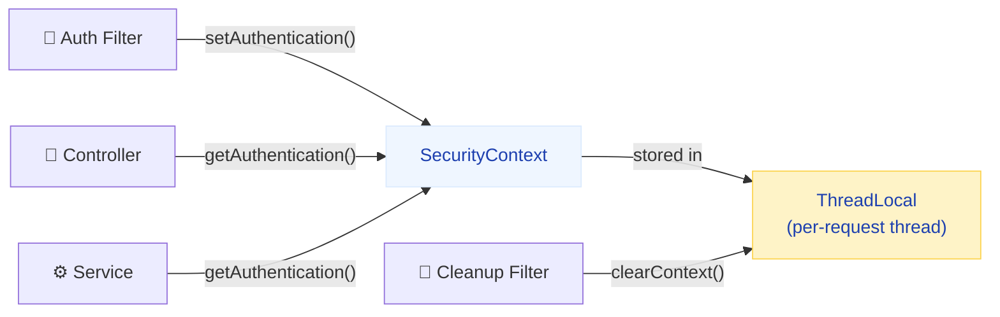
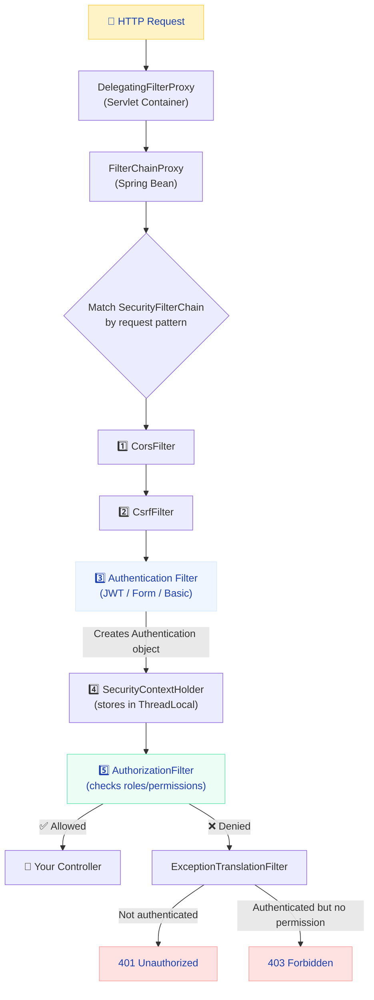
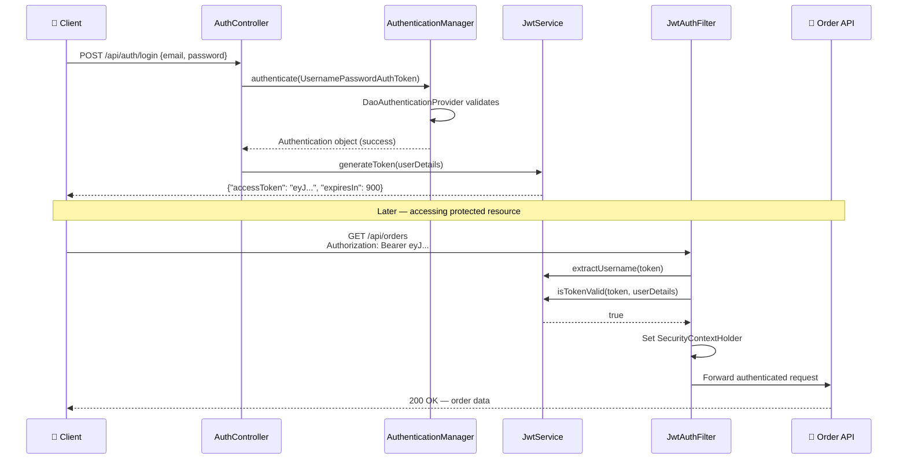
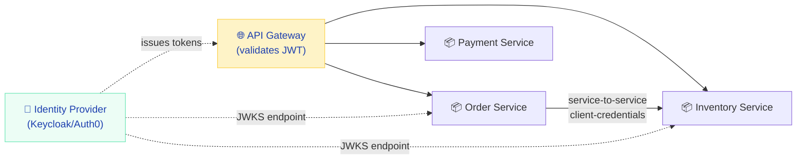

# Spring Security — Authentication, JWT, OAuth2 & Filter Chain Explained

Spring Security is that module everyone copies from Stack Overflow without understanding. In interviews, 90% of candidates can't explain how a request gets authenticated end-to-end. They paste a `SecurityFilterChain` bean, slap `@PreAuthorize` on a method, and pray it works. Let me take you through it the way I'd explain it to a teammate before their Amazon interview — starting from first principles, building up to production-grade JWT auth, and covering every gotcha I've seen trip up senior engineers.

---

## Authentication vs Authorization

The most confused concept in security interviews. Every candidate says "authentication is who you are, authorization is what you can do" — but few can explain the *mechanics*.

!!! tip "💡 One-liner for interviews"
    Authentication verifies identity (401 on failure). Authorization verifies permissions (403 on failure). Authentication always happens first.

Think of a bank. Authentication is the teller checking your ID before opening the vault door. Authorization is the vault having different compartments — your key only opens *your* safe deposit box, not the bank manager's.

| | Authentication | Authorization |
|---|---|---|
| **Question answered** | WHO are you? | WHAT can you access? |
| **When it happens** | First — on login or token validation | After authentication succeeds |
| **Failure response** | 401 Unauthorized | 403 Forbidden |
| **Mechanisms** | Password, JWT, OAuth2, SAML, X.509 | Roles, Permissions, Scopes, SpEL |
| **Spring entry point** | `AuthenticationManager` | `AuthorizationManager` |
| **Storage** | `SecurityContextHolder` (ThreadLocal) | `GrantedAuthority` collection |

!!! danger "⚠️ What breaks"
    Returning 403 when you mean 401 is the #1 mistake. If the user isn't authenticated at all, it's 401. If they ARE authenticated but lack permissions, it's 403. Getting this wrong confuses frontend developers and breaks retry logic in mobile apps.

!!! question "❓ Counter-questions"
    **Q: Can authorization happen without authentication?**
    A: Yes — anonymous access is a form of authorization. Spring Security has an `AnonymousAuthenticationFilter` that creates a dummy `Authentication` object with `ROLE_ANONYMOUS`, so authorization rules can still be evaluated.

---

## SecurityContext & SecurityContextHolder

**What it does:** Stores the currently authenticated user's info so any code in your application can access it without passing it around as a parameter.

**Why it exists:** HTTP is stateless. Once a filter authenticates a request, downstream code (controllers, services, repositories) needs to know WHO made the request. Without a centralized holder, you'd pass `Authentication` objects through every method signature.

**How it works internally:**



```java
// Anywhere in your code — get the current authenticated user
Authentication auth = SecurityContextHolder.getContext().getAuthentication();
String username = auth.getName();
Collection<? extends GrantedAuthority> authorities = auth.getAuthorities();
Object principal = auth.getPrincipal(); // usually UserDetails
```

!!! tip "💡 One-liner for interviews"
    SecurityContextHolder uses ThreadLocal to bind the authenticated principal to the current thread, making it available anywhere in the request processing pipeline without explicit parameter passing.

!!! danger "⚠️ What breaks"
    **Async methods lose context.** `@Async` spawns a new thread. ThreadLocal doesn't propagate to child threads. Your `@Async` service method will see `null` authentication. Fix: use `DelegatingSecurityContextExecutorService` or set `SecurityContextHolder.setStrategyName(MODE_INHERITABLETHREADLOCAL)`.

!!! warning "🔥 Production War Story"
    A team had intermittent "user sees another user's data" bugs in production. Root cause: they were using a thread pool for async processing, and the SecurityContext from a previous request was still attached to recycled threads. The cleanup filter only clears context on the request thread, not pool threads. Fix: always explicitly clear context in pooled thread tasks, or use `DelegatingSecurityContextRunnable`.

---

## UserDetails & UserDetailsService

**What it does:** The contract Spring Security uses to load user information from your data store during authentication.

**Why it exists:** Spring Security doesn't know if your users are in PostgreSQL, MongoDB, LDAP, or an external API. `UserDetailsService` is the adapter pattern — you implement one method, and Spring Security can authenticate against ANY user store.

```java
public interface UserDetailsService {
    UserDetails loadUserByUsername(String username) throws UsernameNotFoundException;
}

public interface UserDetails extends Serializable {
    Collection<? extends GrantedAuthority> getAuthorities();
    String getPassword();
    String getUsername();
    boolean isAccountNonExpired();
    boolean isAccountNonLocked();
    boolean isCredentialsNonExpired();
    boolean isEnabled();
}
```

**Production implementation for an e-commerce platform:**

```java
@Service
@RequiredArgsConstructor
public class EcommerceUserDetailsService implements UserDetailsService {

    private final UserRepository userRepository;

    @Override
    @Transactional(readOnly = true)
    public UserDetails loadUserByUsername(String email) throws UsernameNotFoundException {
        AppUser user = userRepository.findByEmail(email)
            .orElseThrow(() -> new UsernameNotFoundException(
                "No account found with email: " + email));

        if (!user.isEmailVerified()) {
            throw new DisabledException("Email not verified for: " + email);
        }

        return User.builder()
            .username(user.getEmail())
            .password(user.getPasswordHash())  // BCrypt-encoded in DB
            .roles(user.getRoles().stream()
                .map(Role::getName)
                .toArray(String[]::new))
            .accountLocked(user.getFailedLoginAttempts() >= 5)
            .build();
    }
}
```

!!! example "🎯 Interview Tip"
    When asked "how does Spring Security load users?", walk through the chain: `AuthenticationManager` → `ProviderManager` → `DaoAuthenticationProvider` → calls YOUR `UserDetailsService.loadUserByUsername()` → gets `UserDetails` back → compares password using `PasswordEncoder.matches()`. This shows you understand the full delegation chain, not just the interface.

!!! danger "⚠️ What breaks"
    **Timing attacks on username enumeration.** If `loadUserByUsername` throws fast for "user not found" but takes longer for "wrong password" (because BCrypt comparison is slow), attackers can enumerate valid usernames. Spring's `DaoAuthenticationProvider` mitigates this by ALWAYS running `passwordEncoder.matches()` against a dummy value even when the user isn't found.

---

## PasswordEncoder

**What it does:** Hashes passwords for storage and verifies passwords during login.

**Why it exists:** Storing plaintext passwords is criminally negligent. Even encrypted passwords are vulnerable if the encryption key is compromised. Hashing is one-way — even if the database leaks, attackers can't reverse the hashes (with proper algorithms).

| Algorithm | Speed | Status | Notes |
|---|---|---|---|
| **BCrypt** | ~100ms/hash | ✅ Recommended | Adaptive cost factor, built-in salt, 60-char output |
| **Argon2id** | Configurable | ✅ Best (if you can tune) | Memory-hard, resistant to GPU/ASIC attacks |
| **SCrypt** | Configurable | ✅ Good | Memory-hard alternative to Argon2 |
| PBKDF2 | Configurable | ⚠️ Acceptable | NIST approved, but CPU-only hardness |
| SHA-256 | ~1μs/hash | ❌ Dead | No salt, no cost factor, GPU does billions/sec |
| MD5 | ~0.5μs/hash | ❌ Dead | Collision attacks proven since 2004 |

```java
@Bean
public PasswordEncoder passwordEncoder() {
    return new BCryptPasswordEncoder(12); // cost factor 12 = ~250ms per hash
    // Default is 10 (~100ms). Each increment doubles the time.
    // 12 is sweet spot: fast enough for login, slow enough to deter brute-force
}
```

**Migration strategy (legacy system with MD5 passwords):**

```java
@Bean
public PasswordEncoder passwordEncoder() {
    // DelegatingPasswordEncoder supports multiple formats
    // New passwords: {bcrypt}$2a$12$...
    // Legacy passwords: {MD5}5f4dcc3b5aa765d61d8327deb882cf99
    Map<String, PasswordEncoder> encoders = Map.of(
        "bcrypt", new BCryptPasswordEncoder(12),
        "MD5", new MessageDigestPasswordEncoder("MD5")  // deprecated but needed for migration
    );
    DelegatingPasswordEncoder delegate = new DelegatingPasswordEncoder("bcrypt", encoders);
    delegate.setDefaultPasswordEncoderForMatches(new BCryptPasswordEncoder(12));
    return delegate;
}
```

!!! tip "💡 One-liner for interviews"
    BCrypt is preferred because it's intentionally slow (tunable cost factor), includes a per-hash random salt (defeating rainbow tables), and its cost can increase with hardware improvements — unlike MD5/SHA which are designed to be fast.

!!! question "❓ Counter-questions"
    **Q: Why not just add a salt to SHA-256?**
    A: Salting prevents rainbow tables but doesn't prevent brute-force. SHA-256 is still blazing fast (~10 billion hashes/sec on a modern GPU). BCrypt with cost=12 limits an attacker to ~50 hashes/sec on the same hardware. That's the difference between cracking a password in seconds vs centuries.

---

## GrantedAuthority vs Role — The ROLE_ Prefix Confusion

**What it does:** `GrantedAuthority` is the interface representing a permission. A Role is just a `GrantedAuthority` with a `ROLE_` prefix convention.

**Why the confusion exists:** Spring Security has TWO methods — `hasRole("ADMIN")` and `hasAuthority("ROLE_ADMIN")` — that do THE SAME THING. The `hasRole()` method auto-prepends `ROLE_`. This is legacy design that still trips up experienced developers.

```java
// These are EQUIVALENT:
.requestMatchers("/admin/**").hasRole("ADMIN")        // adds ROLE_ prefix internally
.requestMatchers("/admin/**").hasAuthority("ROLE_ADMIN")  // uses exact string

// This is for fine-grained permissions WITHOUT the prefix:
.requestMatchers("/reports/**").hasAuthority("REPORT_EXPORT")  // no prefix added
```

| Method | Prefix behavior | Use case |
|---|---|---|
| `hasRole("ADMIN")` | Auto-prepends `ROLE_` | Role-based access (coarse-grained) |
| `hasAuthority("ROLE_ADMIN")` | Exact string match | When you want explicit control |
| `hasAuthority("REPORT_EXPORT")` | Exact string match | Permission-based access (fine-grained) |

!!! danger "⚠️ What breaks"
    You store authorities as `ADMIN` in the database. You use `hasRole("ADMIN")` in your config. Spring looks for `ROLE_ADMIN`. Your user has `ADMIN`. Access denied — silent 403. Either store `ROLE_ADMIN` in DB, or use `hasAuthority("ADMIN")` in config. Pick one convention and stick with it.

---

## The Security Filter Chain — How a Request Gets Authenticated

This is the #1 interview question: *"Walk me through what happens when an HTTP request hits a Spring Security-protected endpoint."*



**The complete filter order (Spring Security 6):**

1. **ChannelProcessingFilter** — Redirects HTTP to HTTPS if required
2. **CorsFilter** — Handles preflight OPTIONS requests
3. **CsrfFilter** — Validates CSRF tokens on state-changing requests
4. **LogoutFilter** — Intercepts `/logout` URL
5. **UsernamePasswordAuthenticationFilter** — Form login processing
6. **BasicAuthenticationFilter** — HTTP Basic header processing
7. **BearerTokenAuthenticationFilter** — JWT/OAuth2 token processing
8. **SecurityContextHolderFilter** — Persists SecurityContext between requests
9. **ExceptionTranslationFilter** — Converts security exceptions to HTTP responses
10. **AuthorizationFilter** — Final gatekeeper, evaluates access rules

!!! tip "💡 One-liner for interviews"
    Spring Security is a chain of servlet filters managed by `FilterChainProxy`. Each filter has a single responsibility. Authentication filters create an `Authentication` object stored in ThreadLocal. The `AuthorizationFilter` (always last) checks if that Authentication has the required authorities. If not, `ExceptionTranslationFilter` translates the exception into 401 or 403.

!!! example "🎯 Interview Tip"
    When explaining the filter chain, mention that `DelegatingFilterProxy` is the bridge between the Servlet container (Tomcat) and Spring's IoC container. This is what lets Spring-managed beans participate in the servlet filter pipeline. It's a subtle but impressive detail that shows you understand the bootstrapping.

---

## SecurityFilterChain Configuration (Spring Boot 3 / Spring Security 6)

Spring Security 6 removed `WebSecurityConfigurerAdapter`. If an interviewer's example uses `extends WebSecurityConfigurerAdapter`, politely mention it's deprecated since Spring Security 5.7 and removed in 6.0. The modern approach is component-based.

```java
@Configuration
@EnableWebSecurity
@EnableMethodSecurity
public class SecurityConfig {

    @Bean
    public SecurityFilterChain filterChain(HttpSecurity http) throws Exception {
        return http
            .csrf(csrf -> csrf.disable())  // stateless API — no cookies, no CSRF risk
            .sessionManagement(session ->
                session.sessionCreationPolicy(SessionCreationPolicy.STATELESS))
            .authorizeHttpRequests(auth -> auth
                .requestMatchers("/api/auth/**", "/actuator/health").permitAll()
                .requestMatchers("/api/admin/**").hasRole("ADMIN")
                .requestMatchers("/api/orders/**").hasAnyRole("USER", "ADMIN")
                .anyRequest().authenticated()
            )
            .httpBasic(Customizer.withDefaults())
            .build();
    }

    @Bean
    public PasswordEncoder passwordEncoder() {
        return new BCryptPasswordEncoder(12);
    }
}
```

!!! warning "🔥 Production War Story"
    A team had two `SecurityFilterChain` beans: one for `/api/**` (JWT, stateless) and one for `/admin/**` (form login, sessions). They forgot `@Order` annotations. Spring picked the API chain first (broader matcher). Admin pages got 401 because the JWT filter rejected session-based requests. Fix: always use `@Order` with multiple chains, AND use `securityMatcher()` to scope each chain.

```java
// Correct multi-chain configuration
@Bean
@Order(1)  // evaluated first — more specific
public SecurityFilterChain adminChain(HttpSecurity http) throws Exception {
    return http
        .securityMatcher("/admin/**")
        .authorizeHttpRequests(auth -> auth.anyRequest().hasRole("ADMIN"))
        .formLogin(Customizer.withDefaults())
        .build();
}

@Bean
@Order(2)  // evaluated second — broader catch-all
public SecurityFilterChain apiChain(HttpSecurity http) throws Exception {
    return http
        .securityMatcher("/api/**")
        .csrf(csrf -> csrf.disable())
        .sessionManagement(s -> s.sessionCreationPolicy(SessionCreationPolicy.STATELESS))
        .authorizeHttpRequests(auth -> auth.anyRequest().authenticated())
        .addFilterBefore(jwtFilter, UsernamePasswordAuthenticationFilter.class)
        .build();
}
```

---

## Authentication Mechanisms

### Form Login (Session-Based)

**When to use:** Server-rendered web apps (Thymeleaf, JSP), admin dashboards, internal tools.

**When NOT to use:** SPAs (React/Angular), mobile backends, microservice-to-microservice calls.

```java
@Bean
public SecurityFilterChain formLoginChain(HttpSecurity http) throws Exception {
    return http
        .authorizeHttpRequests(auth -> auth
            .requestMatchers("/login", "/css/**", "/js/**").permitAll()
            .anyRequest().authenticated()
        )
        .formLogin(form -> form
            .loginPage("/login")             // custom login page
            .loginProcessingUrl("/perform-login")  // form action URL
            .defaultSuccessUrl("/dashboard", true)
            .failureUrl("/login?error=true")
            .usernameParameter("email")      // if form field isn't "username"
        )
        .rememberMe(remember -> remember
            .key("uniqueAndSecretKey")
            .tokenValiditySeconds(7 * 24 * 3600)  // 7 days
        )
        .logout(logout -> logout
            .logoutUrl("/perform-logout")
            .logoutSuccessUrl("/login?logout")
            .deleteCookies("JSESSIONID", "remember-me")
        )
        .build();
}
```

### HTTP Basic

**When to use:** Service-to-service calls within a trusted network, actuator endpoints, quick prototyping.

**When NEVER to use:** Browser-facing APIs (credentials in every request, no logout mechanism, base64 is NOT encryption).

```java
@Bean
public SecurityFilterChain basicAuthChain(HttpSecurity http) throws Exception {
    return http
        .authorizeHttpRequests(auth -> auth.anyRequest().authenticated())
        .httpBasic(Customizer.withDefaults())
        .sessionManagement(s -> s.sessionCreationPolicy(SessionCreationPolicy.STATELESS))
        .build();
}
```

### JWT Authentication — Complete Production Implementation

This is what 80% of Spring Security interviews focus on. Here's a full implementation for an e-commerce platform.



=== "JwtService.java"

    ```java
    @Service
    public class JwtService {

        @Value("${app.jwt.secret}")
        private String secret;

        @Value("${app.jwt.expiration-ms:900000}")  // 15 minutes default
        private long accessTokenExpiration;

        @Value("${app.jwt.refresh-expiration-ms:604800000}")  // 7 days
        private long refreshTokenExpiration;

        public String generateAccessToken(UserDetails userDetails) {
            Map<String, Object> claims = Map.of(
                "roles", userDetails.getAuthorities().stream()
                    .map(GrantedAuthority::getAuthority)
                    .toList()
            );
            return buildToken(claims, userDetails.getUsername(), accessTokenExpiration);
        }

        public String generateRefreshToken(UserDetails userDetails) {
            return buildToken(Map.of(), userDetails.getUsername(), refreshTokenExpiration);
        }

        private String buildToken(Map<String, Object> extraClaims, String subject, long expiration) {
            return Jwts.builder()
                .claims(extraClaims)
                .subject(subject)
                .issuedAt(new Date())
                .expiration(new Date(System.currentTimeMillis() + expiration))
                .signWith(getSigningKey())
                .compact();
        }

        public String extractUsername(String token) {
            return extractClaim(token, Claims::getSubject);
        }

        public boolean isTokenValid(String token, UserDetails userDetails) {
            String username = extractUsername(token);
            return username.equals(userDetails.getUsername()) && !isTokenExpired(token);
        }

        private boolean isTokenExpired(String token) {
            return extractClaim(token, Claims::getExpiration).before(new Date());
        }

        private <T> T extractClaim(String token, Function<Claims, T> resolver) {
            Claims claims = Jwts.parser()
                .verifyWith(getSigningKey())
                .build()
                .parseSignedClaims(token)
                .getPayload();
            return resolver.apply(claims);
        }

        private SecretKey getSigningKey() {
            return Keys.hmacShaKeyFor(Decoders.BASE64.decode(secret));
        }
    }
    ```

=== "JwtAuthenticationFilter.java"

    ```java
    @Component
    @RequiredArgsConstructor
    public class JwtAuthenticationFilter extends OncePerRequestFilter {

        private static final Logger log = LoggerFactory.getLogger(JwtAuthenticationFilter.class);

        private final JwtService jwtService;
        private final UserDetailsService userDetailsService;

        @Override
        protected void doFilterInternal(HttpServletRequest request,
                HttpServletResponse response, FilterChain chain)
                throws ServletException, IOException {

            String header = request.getHeader("Authorization");

            if (header == null || !header.startsWith("Bearer ")) {
                chain.doFilter(request, response);
                return;  // not a JWT request — let other filters handle it
            }

            String token = header.substring(7);

            try {
                String username = jwtService.extractUsername(token);

                // Only authenticate if not already authenticated (idempotency)
                if (username != null &&
                        SecurityContextHolder.getContext().getAuthentication() == null) {

                    UserDetails userDetails = userDetailsService.loadUserByUsername(username);

                    if (jwtService.isTokenValid(token, userDetails)) {
                        UsernamePasswordAuthenticationToken authToken =
                            new UsernamePasswordAuthenticationToken(
                                userDetails, null, userDetails.getAuthorities());
                        authToken.setDetails(
                            new WebAuthenticationDetailsSource().buildDetails(request));
                        SecurityContextHolder.getContext().setAuthentication(authToken);
                    }
                }
            } catch (ExpiredJwtException ex) {
                log.debug("Expired JWT for request: {}", request.getRequestURI());
            } catch (MalformedJwtException | SignatureException ex) {
                log.warn("Invalid JWT: {}", ex.getMessage());
            } catch (Exception ex) {
                log.error("JWT processing failed", ex);
            }

            // ALWAYS continue the filter chain
            // Unauthenticated requests will be rejected by AuthorizationFilter with 401
            chain.doFilter(request, response);
        }

        @Override
        protected boolean shouldNotFilter(HttpServletRequest request) {
            // Skip JWT processing for public endpoints (optimization)
            String path = request.getRequestURI();
            return path.startsWith("/api/auth/") || path.startsWith("/actuator/");
        }
    }
    ```

=== "AuthController.java"

    ```java
    @RestController
    @RequestMapping("/api/auth")
    @RequiredArgsConstructor
    public class AuthController {

        private final AuthenticationManager authenticationManager;
        private final JwtService jwtService;
        private final UserDetailsService userDetailsService;
        private final RefreshTokenService refreshTokenService;

        @PostMapping("/login")
        public ResponseEntity<AuthResponse> login(@Valid @RequestBody LoginRequest request) {
            authenticationManager.authenticate(
                new UsernamePasswordAuthenticationToken(
                    request.email(), request.password()));

            UserDetails user = userDetailsService.loadUserByUsername(request.email());
            String accessToken = jwtService.generateAccessToken(user);
            String refreshToken = jwtService.generateRefreshToken(user);

            // Store refresh token server-side for revocation capability
            refreshTokenService.save(user.getUsername(), refreshToken);

            return ResponseEntity.ok(new AuthResponse(accessToken, refreshToken, 900));
        }

        @PostMapping("/refresh")
        public ResponseEntity<AuthResponse> refresh(@RequestBody RefreshRequest request) {
            String refreshToken = request.refreshToken();

            // Validate refresh token exists in DB (not revoked)
            if (!refreshTokenService.isValid(refreshToken)) {
                return ResponseEntity.status(HttpStatus.UNAUTHORIZED).build();
            }

            String username = jwtService.extractUsername(refreshToken);
            UserDetails user = userDetailsService.loadUserByUsername(username);

            if (!jwtService.isTokenValid(refreshToken, user)) {
                return ResponseEntity.status(HttpStatus.UNAUTHORIZED).build();
            }

            // Rotate refresh token (invalidate old, issue new)
            refreshTokenService.revoke(refreshToken);
            String newAccessToken = jwtService.generateAccessToken(user);
            String newRefreshToken = jwtService.generateRefreshToken(user);
            refreshTokenService.save(username, newRefreshToken);

            return ResponseEntity.ok(new AuthResponse(newAccessToken, newRefreshToken, 900));
        }

        @PostMapping("/logout")
        public ResponseEntity<Void> logout(@RequestBody RefreshRequest request) {
            refreshTokenService.revoke(request.refreshToken());
            return ResponseEntity.noContent().build();
        }
    }

    record LoginRequest(@Email String email, @NotBlank String password) {}
    record RefreshRequest(@NotBlank String refreshToken) {}
    record AuthResponse(String accessToken, String refreshToken, int expiresInSeconds) {}
    ```

=== "SecurityConfig.java"

    ```java
    @Configuration
    @EnableWebSecurity
    @EnableMethodSecurity
    @RequiredArgsConstructor
    public class SecurityConfig {

        private final JwtAuthenticationFilter jwtFilter;

        @Bean
        public SecurityFilterChain filterChain(HttpSecurity http) throws Exception {
            return http
                .csrf(csrf -> csrf.disable())
                .cors(cors -> cors.configurationSource(corsSource()))
                .sessionManagement(session ->
                    session.sessionCreationPolicy(SessionCreationPolicy.STATELESS))
                .exceptionHandling(ex -> ex
                    .authenticationEntryPoint((req, res, authEx) -> {
                        res.setContentType("application/json");
                        res.setStatus(HttpServletResponse.SC_UNAUTHORIZED);
                        res.getWriter().write(
                            """
                            {"error": "unauthorized", "message": "Authentication required"}
                            """);
                    })
                    .accessDeniedHandler((req, res, accessEx) -> {
                        res.setContentType("application/json");
                        res.setStatus(HttpServletResponse.SC_FORBIDDEN);
                        res.getWriter().write(
                            """
                            {"error": "forbidden", "message": "Insufficient permissions"}
                            """);
                    })
                )
                .authorizeHttpRequests(auth -> auth
                    .requestMatchers("/api/auth/**").permitAll()
                    .requestMatchers("/actuator/health", "/actuator/info").permitAll()
                    .requestMatchers("/api/admin/**").hasRole("ADMIN")
                    .requestMatchers(HttpMethod.GET, "/api/products/**").permitAll()
                    .requestMatchers("/api/orders/**").hasAnyRole("USER", "ADMIN")
                    .anyRequest().authenticated()
                )
                .addFilterBefore(jwtFilter, UsernamePasswordAuthenticationFilter.class)
                .build();
        }

        @Bean
        public AuthenticationManager authenticationManager(
                AuthenticationConfiguration config) throws Exception {
            return config.getAuthenticationManager();
        }

        @Bean
        public PasswordEncoder passwordEncoder() {
            return new BCryptPasswordEncoder(12);
        }

        @Value("${app.cors.allowed-origins}")
        private List<String> allowedOrigins;

        private CorsConfigurationSource corsSource() {
            CorsConfiguration config = new CorsConfiguration();
            config.setAllowedOrigins(allowedOrigins);
            config.setAllowedMethods(List.of("GET", "POST", "PUT", "DELETE", "OPTIONS"));
            config.setAllowedHeaders(List.of("Authorization", "Content-Type"));
            config.setExposedHeaders(List.of("X-Total-Count"));
            config.setAllowCredentials(true);
            config.setMaxAge(3600L);
            UrlBasedCorsConfigurationSource source = new UrlBasedCorsConfigurationSource();
            source.registerCorsConfiguration("/api/**", config);
            return source;
        }
    }
    ```

### OAuth2 / OpenID Connect

**When to use:** Social login (Google, GitHub), enterprise SSO (Okta, Auth0, Keycloak), when you don't want to manage passwords.

**Grant types and when to use each:**

| Grant Type | Use Case | Security Level |
|---|---|---|
| **Authorization Code + PKCE** | SPAs, mobile apps, server-side apps | ✅ Highest |
| Authorization Code (no PKCE) | Server-side only (confidential clients) | ✅ High |
| Client Credentials | Machine-to-machine (no user involved) | ✅ High |
| ~~Implicit~~ | Deprecated. Never use. | ❌ Insecure |
| ~~Resource Owner Password~~ | Deprecated. Legacy migration only. | ❌ Insecure |

```java
// OAuth2 Login — server-side app acting as OAuth2 client
@Bean
public SecurityFilterChain oauth2LoginChain(HttpSecurity http) throws Exception {
    return http
        .authorizeHttpRequests(auth -> auth.anyRequest().authenticated())
        .oauth2Login(oauth2 -> oauth2
            .userInfoEndpoint(userInfo -> userInfo
                .userService(customOAuth2UserService())  // map provider claims to your user model
            )
            .successHandler((req, res, auth) -> res.sendRedirect("/dashboard"))
        )
        .build();
}
```

```yaml
# application.yml
spring:
  security:
    oauth2:
      client:
        registration:
          google:
            client-id: ${GOOGLE_CLIENT_ID}
            client-secret: ${GOOGLE_CLIENT_SECRET}
            scope: openid, profile, email
          github:
            client-id: ${GITHUB_CLIENT_ID}
            client-secret: ${GITHUB_CLIENT_SECRET}
            scope: user:email
```

**OAuth2 Resource Server (validating external JWTs):**

```java
// Your API validates tokens issued by Keycloak/Auth0/Okta
@Bean
public SecurityFilterChain resourceServerChain(HttpSecurity http) throws Exception {
    return http
        .authorizeHttpRequests(auth -> auth
            .requestMatchers("/api/public/**").permitAll()
            .anyRequest().authenticated()
        )
        .oauth2ResourceServer(oauth2 -> oauth2
            .jwt(jwt -> jwt.jwtAuthenticationConverter(jwtAuthConverter()))
        )
        .build();
}

@Bean
public JwtAuthenticationConverter jwtAuthConverter() {
    JwtGrantedAuthoritiesConverter authoritiesConverter = new JwtGrantedAuthoritiesConverter();
    authoritiesConverter.setAuthorityPrefix("ROLE_");
    authoritiesConverter.setAuthoritiesClaimName("roles");  // custom claim from your IdP

    JwtAuthenticationConverter converter = new JwtAuthenticationConverter();
    converter.setJwtGrantedAuthoritiesConverter(authoritiesConverter);
    return converter;
}
```

!!! tip "💡 One-liner for interviews"
    OAuth2 Login makes your app the CLIENT that redirects users to an external IdP. OAuth2 Resource Server makes your app the API that validates tokens issued by an external IdP. They solve different problems and can coexist.

---

## Authorization — URL-Level vs Method-Level

### URL-Based (SecurityFilterChain)

Rules are evaluated top-to-bottom. **First match wins.**

```java
.authorizeHttpRequests(auth -> auth
    // Public endpoints — NO authentication required
    .requestMatchers(HttpMethod.GET, "/api/products/**").permitAll()
    .requestMatchers("/api/auth/**").permitAll()

    // Admin only
    .requestMatchers("/api/admin/**").hasRole("ADMIN")

    // Specific HTTP method + role
    .requestMatchers(HttpMethod.DELETE, "/api/orders/**").hasRole("ADMIN")
    .requestMatchers("/api/orders/**").hasAnyRole("USER", "ADMIN")

    // Fine-grained authority (no ROLE_ prefix)
    .requestMatchers("/api/reports/export").hasAuthority("REPORT_EXPORT")

    // Everything else — must be authenticated (deny by default)
    .anyRequest().authenticated()
)
```

!!! danger "⚠️ What breaks"
    **Order matters!** If you put `.anyRequest().authenticated()` BEFORE `.requestMatchers("/api/auth/**").permitAll()`, your login endpoint requires authentication. Spring evaluates rules sequentially. Also: `antMatchers` (Spring Security 5) was renamed to `requestMatchers` (Spring Security 6). Using the old name on a new version gives compilation errors.

### Method-Level Security

Requires `@EnableMethodSecurity` on a configuration class. This uses AOP proxies.

```java
@RestController
@RequestMapping("/api/orders")
@RequiredArgsConstructor
public class OrderController {

    private final OrderService orderService;

    @GetMapping
    @PreAuthorize("hasRole('USER')")
    public List<OrderDto> getMyOrders(@AuthenticationPrincipal UserDetails user) {
        return orderService.findByUsername(user.getUsername());
    }

    @GetMapping("/{id}")
    @PreAuthorize("hasRole('ADMIN') or @orderSecurity.isOwner(#id, authentication)")
    public OrderDto getOrder(@PathVariable Long id) {
        return orderService.findById(id);
    }

    @DeleteMapping("/{id}")
    @PreAuthorize("hasRole('ADMIN')")
    public void deleteOrder(@PathVariable Long id) {
        orderService.delete(id);
    }

    @GetMapping("/admin/all")
    @Secured("ROLE_ADMIN")  // simpler — no SpEL, just role strings
    public List<OrderDto> adminViewAll() {
        return orderService.findAll();
    }
}
```

**Custom security expression bean:**

```java
@Component("orderSecurity")
@RequiredArgsConstructor
public class OrderSecurityEvaluator {

    private final OrderRepository orderRepository;

    public boolean isOwner(Long orderId, Authentication authentication) {
        return orderRepository.findById(orderId)
            .map(order -> order.getUsername().equals(authentication.getName()))
            .orElse(false);
    }
}
```

| Annotation | SpEL | Use Case | Requires |
|---|---|---|---|
| `@PreAuthorize` | ✅ Yes | Complex rules, parameter access, bean calls | `@EnableMethodSecurity` |
| `@PostAuthorize` | ✅ Yes | Filter AFTER execution (check return value) | `@EnableMethodSecurity` |
| `@PostFilter` | ✅ Yes | Filter collections (remove items user can't see) | `@EnableMethodSecurity` |
| `@Secured` | ❌ No | Simple role check, no expressions | `@EnableMethodSecurity(securedEnabled = true)` |
| `@RolesAllowed` | ❌ No | JSR-250 standard (Jakarta EE compatible) | `@EnableMethodSecurity(jsr250Enabled = true)` |

!!! question "❓ Counter-questions"
    **Q: What's the difference between @Secured and @PreAuthorize?**
    A: `@Secured` does a simple role list check — `@Secured({"ROLE_ADMIN", "ROLE_MANAGER"})` means "any of these roles". No SpEL, no parameter access, no boolean logic. `@PreAuthorize` supports full SpEL: `@PreAuthorize("hasRole('ADMIN') and #userId == authentication.principal.id")`. Use `@PreAuthorize` for anything beyond trivial role checks.

!!! danger "⚠️ What breaks"
    **@PreAuthorize silently ignored:** If you forget `@EnableMethodSecurity`, all `@PreAuthorize` annotations are completely ignored. Your endpoints appear wide open. No warning, no error. This is a security vulnerability hiding in plain sight.

    **Proxy-based gotcha:** `@PreAuthorize` on a private method or a method called internally (self-invocation) won't work — Spring AOP proxies only intercept external calls. If `methodA()` calls `methodB()` within the same class, and `@PreAuthorize` is on `methodB()`, it's bypassed.

### Role Hierarchy

```java
@Bean
public RoleHierarchy roleHierarchy() {
    return RoleHierarchyImpl.fromHierarchy("""
        ROLE_ADMIN > ROLE_MANAGER
        ROLE_MANAGER > ROLE_USER
        ROLE_USER > ROLE_GUEST
    """);
}
```

With this hierarchy, an ADMIN user implicitly has all permissions of MANAGER, USER, and GUEST without explicitly assigning all roles.

---

## CORS Configuration

**What it does:** Controls which domains can make JavaScript requests to your API from a browser.

**Why it exists:** The Same-Origin Policy blocks cross-origin requests by default. Without CORS, your React app on `localhost:3000` can't call your Spring API on `localhost:8080`.

**How it works:** Browser sends a preflight `OPTIONS` request with `Origin` header. Server responds with `Access-Control-Allow-Origin`. If the origin is allowed, the browser proceeds with the actual request. If not, the browser blocks the response (the server still processes the request!).

```java
@Bean
public CorsConfigurationSource corsConfigurationSource() {
    CorsConfiguration config = new CorsConfiguration();
    config.setAllowedOrigins(List.of(
        "https://shop.myapp.com",
        "https://admin.myapp.com"
    ));
    config.setAllowedMethods(List.of("GET", "POST", "PUT", "DELETE", "OPTIONS"));
    config.setAllowedHeaders(List.of("Authorization", "Content-Type", "X-Request-ID"));
    config.setExposedHeaders(List.of("X-Total-Count", "X-Page-Number"));
    config.setAllowCredentials(true);
    config.setMaxAge(3600L);  // cache preflight for 1 hour

    UrlBasedCorsConfigurationSource source = new UrlBasedCorsConfigurationSource();
    source.registerCorsConfiguration("/api/**", config);
    return source;
}
```

!!! danger "⚠️ What breaks"
    - `allowedOrigins("*")` + `allowCredentials(true)` = **IllegalArgumentException**. The spec forbids this. Use `allowedOriginPatterns("*")` if you truly need wildcard with credentials (DON'T in production).
    - Forgetting `OPTIONS` in allowed methods — browsers send preflight requests that get 403.
    - CORS filter running AFTER authentication filter — preflight (no credentials) gets 401. Spring places `CorsFilter` before auth if you configure `.cors()` in the chain.
    - Defining CORS at controller level (`@CrossOrigin`) AND in SecurityFilterChain — they can conflict unpredictably.

!!! warning "🔥 Production War Story"
    A team deployed a new frontend domain and forgot to add it to CORS allowed origins. The API worked perfectly from Postman (no CORS enforcement outside browsers) but the frontend showed a cryptic "Network Error" with no useful error message. Took 2 hours to debug because the actual CORS error was buried in the browser console — the `fetch()` API doesn't surface CORS failures in the response. Lesson: always test from an actual browser with the correct origin.

---

## CSRF Protection

**What it does:** Prevents attackers from tricking a user's browser into making unwanted requests to your server using the user's existing session cookie.

**Why it exists:** If your app uses cookies for authentication (session-based), any website can include an `` or `<form>` pointing to your server. The browser automatically attaches cookies. Without CSRF tokens, the server can't distinguish legitimate requests from forged ones.

**When to disable:**

- Stateless APIs using JWT in `Authorization` header (no cookies = no CSRF risk)
- Service-to-service communication
- APIs that NEVER use cookies for auth

**When to keep enabled:**

- Any app using session cookies (form login, remember-me)
- Server-rendered pages with forms

```java
// Stateless API — disable safely
.csrf(csrf -> csrf.disable())

// SPA with cookie-based sessions — use cookie token repository
.csrf(csrf -> csrf
    .csrfTokenRepository(CookieCsrfTokenRepository.withHttpOnlyFalse())
    .csrfTokenRequestHandler(new SpaCsrfTokenRequestHandler())
)
```

!!! tip "💡 One-liner for interviews"
    Disable CSRF for stateless JWT APIs because the attack vector requires cookies — if auth is in the Authorization header, browsers can't be tricked into sending it. Keep CSRF for any endpoint authenticated via cookies.

---

## Session Management

```java
.sessionManagement(session -> session
    // No session for JWT APIs
    .sessionCreationPolicy(SessionCreationPolicy.STATELESS)

    // OR: limit concurrent sessions (form login)
    .maximumSessions(1)
    .maxSessionsPreventsLogin(true)  // reject new login (vs expiring old session)
    .expiredUrl("/login?expired")
)

// Session fixation protection (on by default)
.sessionManagement(session -> session
    .sessionFixation().changeSessionId()  // default — migrates session on login
)
```

| Policy | Behavior | Use Case |
|---|---|---|
| `STATELESS` | Never creates/uses HttpSession | JWT/token APIs |
| `IF_REQUIRED` | Creates session only if needed (default) | Form login |
| `NEVER` | Won't create, but uses if one exists | Hybrid apps |
| `ALWAYS` | Always creates session | Rarely needed |

!!! question "❓ Counter-questions"
    **Q: What is session fixation attack?**
    A: Attacker obtains a valid session ID (e.g., from a URL), tricks victim into authenticating with that session, then uses the now-authenticated session. Fix: Spring changes the session ID after successful authentication (default behavior with `changeSessionId()`).

---

## Security Headers

Spring Security sets protective headers by default:

| Header | Default Value | Purpose |
|---|---|---|
| `X-Content-Type-Options` | `nosniff` | Prevents MIME-type sniffing |
| `X-Frame-Options` | `DENY` | Prevents clickjacking |
| `X-XSS-Protection` | `0` | Disabled (CSP is better) |
| `Strict-Transport-Security` | 31536000 (1 year) | Forces HTTPS |
| `Cache-Control` | `no-cache, no-store` | Prevents sensitive data caching |

```java
.headers(headers -> headers
    .contentSecurityPolicy(csp -> csp
        .policyDirectives("default-src 'self'; script-src 'self' https://cdn.example.com"))
    .frameOptions(frame -> frame.sameOrigin())  // allow iframes from same origin
    .httpStrictTransportSecurity(hsts -> hsts
        .includeSubDomains(true)
        .maxAgeInSeconds(31536000))
)
```

---

## JWT vs Session — The Tradeoff Table

This is a guaranteed interview question. Know the tradeoffs cold.

| Aspect | Session-Based | JWT (Stateless) |
|---|---|---|
| **Storage** | Server-side (memory/Redis) | Client-side (token) |
| **Scalability** | Needs shared session store or sticky sessions | Scales horizontally by default |
| **Revocation** | Instant (delete session from store) | Hard (need blocklist until expiry) |
| **Size** | Cookie: ~32 bytes (session ID) | Token: 800+ bytes (claims + signature) |
| **Security** | CSRF vulnerable, XSS safe (httpOnly cookie) | CSRF safe, XSS vulnerable (if stored in localStorage) |
| **Mobile friendly** | Poor (cookie handling varies) | Excellent (header-based) |
| **Microservices** | Poor (shared session store couples services) | Excellent (each service validates independently) |
| **Logout** | Trivial | Complex (token still valid until expiry) |

!!! example "🎯 Interview Tip"
    Don't just list differences — recommend the right choice for the scenario. "For a monolithic e-commerce site with server-rendered pages, sessions are simpler and more secure. For a microservices architecture with a React frontend and mobile app, JWT with short-lived access tokens and refresh token rotation is the right choice."

---

## Securing Microservices



**Pattern: Gateway validates, services trust**

1. API Gateway validates the JWT (signature, expiration, issuer)
2. Gateway forwards request with validated claims in headers
3. Downstream services trust the gateway (internal network)
4. Service-to-service calls use Client Credentials grant (no user involved)

**Pattern: Each service validates independently**

1. Each service has the IdP's public key (from JWKS endpoint)
2. Each service validates the JWT independently
3. More secure (zero-trust) but slightly more latency

!!! tip "💡 One-liner for interviews"
    In microservices, use an external IdP (Keycloak/Auth0) as the single source of truth. The API Gateway handles user-facing JWT validation. Service-to-service calls use the OAuth2 Client Credentials flow — no user context, just machine identity.

---

## Common Interview Questions — Deep Answers

??? question "How does Spring Security authenticate a request end-to-end?"
    1. Request hits `DelegatingFilterProxy` (servlet filter registered by Spring Boot)
    2. Delegates to `FilterChainProxy` which selects the matching `SecurityFilterChain`
    3. Filters execute in order. The authentication filter (e.g., `JwtAuthenticationFilter`) extracts credentials
    4. Filter calls `AuthenticationManager.authenticate()` with an `Authentication` token
    5. `ProviderManager` (the default impl) iterates through `AuthenticationProvider` list
    6. `DaoAuthenticationProvider` calls `UserDetailsService.loadUserByUsername()`
    7. Provider compares passwords using `PasswordEncoder.matches()`
    8. On success, returns a fully populated `Authentication` object with authorities
    9. Filter stores it in `SecurityContextHolder.getContext().setAuthentication(auth)`
    10. `AuthorizationFilter` (last filter) evaluates access rules against the stored Authentication
    11. If authorized, request reaches the controller. If not, `ExceptionTranslationFilter` sends 401/403.

??? question "How to implement custom authentication (e.g., API key auth)?"
    Create a custom filter extending `OncePerRequestFilter`. Extract the API key from the header. Look up the key in your database. If valid, create an `Authentication` object and set it in `SecurityContextHolder`. Register the filter with `addFilterBefore()`. No need to implement `AuthenticationProvider` for simple token lookup — that's only needed if you want to plug into the `AuthenticationManager` framework.

??? question "JWT vs Session — when would you choose sessions over JWT?"
    Choose sessions when: (1) you need instant revocation (ban a user immediately), (2) you have a monolithic app (no distributed session problem), (3) you serve server-rendered pages (CSRF protection works naturally), (4) token size matters (session cookie is 32 bytes vs 800+ byte JWT). Choose JWT when: (1) microservices architecture, (2) mobile/SPA clients, (3) you need to scale horizontally without shared state, (4) you need to pass user claims between services.

??? question "How do you handle JWT token expiration and refresh?"
    Issue short-lived access tokens (15 min) and longer-lived refresh tokens (7 days). Store refresh tokens server-side (Redis/DB) for revocation. When access token expires, client hits `/auth/refresh` with the refresh token. Server validates refresh token against the store, issues new access + refresh tokens (rotation), invalidates the old refresh token. If a refresh token is used twice (token theft detected), invalidate ALL tokens for that user.

??? question "What happens when you add spring-boot-starter-security with zero configuration?"
    Spring auto-configures: (1) ALL endpoints require authentication, (2) a random password prints to console, (3) a single user `user` is created in memory, (4) form login enabled at `/login`, (5) HTTP Basic enabled, (6) CSRF protection enabled, (7) security headers set (X-Frame-Options, HSTS, etc.), (8) session fixation protection enabled. This "secure by default" philosophy forces you to explicitly opt-in to any relaxation.

??? question "How do CORS preflight requests interact with Spring Security?"
    Browser sends `OPTIONS` request with no credentials. If Spring Security requires auth for all requests, the preflight gets 401 and the actual request never fires. Fix: configure `.cors()` in your `SecurityFilterChain` — this registers `CorsFilter` BEFORE authentication filters. The CorsFilter handles OPTIONS requests and returns immediately with CORS headers, never hitting the auth filter. Alternative: `.requestMatchers(HttpMethod.OPTIONS, "/**").permitAll()` but the `.cors()` approach is cleaner.

??? question "Explain AuthenticationManager, ProviderManager, and AuthenticationProvider."
    `AuthenticationManager` is the interface — one method: `authenticate(Authentication)`. `ProviderManager` is the default implementation — it holds a list of `AuthenticationProvider` instances. When `authenticate()` is called, ProviderManager iterates through providers. Each provider declares which `Authentication` type it supports (via `supports(Class)`). The first provider that supports the type AND successfully authenticates wins. If all providers fail, `ProviderManager` can optionally delegate to a parent `AuthenticationManager`. Common providers: `DaoAuthenticationProvider` (username/password), `JwtAuthenticationProvider` (JWT), `OidcAuthorizationCodeAuthenticationProvider` (OAuth2).

??? question "How do you test secured endpoints?"
    **Unit tests:** `@WithMockUser(roles = "ADMIN")` on test methods — injects a mock Authentication into SecurityContext. **Integration tests with MockMvc:** `.with(SecurityMockMvcRequestPostProcessors.jwt().authorities(new SimpleGrantedAuthority("ROLE_ADMIN")))`. **Method security tests:** Call the service method directly with a mocked SecurityContext using `@WithMockUser`. **Full integration:** Use Testcontainers with a real Keycloak instance, obtain a real token, pass it in the Authorization header.

---

## What Breaks — The Debugging Guide

### 403 vs 401 Confusion

**Symptom:** You get 403 Forbidden when you expect 401 Unauthorized (or vice versa).

**Root cause:** Spring Security returns 403 by default when authorization fails, even for unauthenticated users, because `AnonymousAuthenticationFilter` creates a dummy anonymous authentication. So the user IS "authenticated" (as anonymous) but lacks permission = 403.

**Fix:** Configure `ExceptionHandling` to return 401 for `AuthenticationException`:

```java
.exceptionHandling(ex -> ex
    .authenticationEntryPoint(new HttpStatusEntryPoint(HttpStatus.UNAUTHORIZED))
)
```

### Filter Order Bugs

**Symptom:** JWT filter doesn't seem to run, or runs but authentication isn't recognized.

**Root cause:** You registered the filter at the wrong position. If your JWT filter runs AFTER `AuthorizationFilter`, authorization is already denied before your filter authenticates.

**Fix:** Always use `addFilterBefore(jwtFilter, UsernamePasswordAuthenticationFilter.class)` — this places your filter in the authentication phase, before authorization happens.

### CORS + Security Conflict

**Symptom:** Preflight requests get 401. Everything works from Postman but not from the browser.

**Root cause:** Security filters run before CORS is handled. The `OPTIONS` preflight carries no auth credentials.

**Fix:** Add `.cors(cors -> cors.configurationSource(yourSource))` to the SecurityFilterChain. This ensures `CorsFilter` is registered before auth filters.

### @PreAuthorize Not Working

**Symptom:** `@PreAuthorize` annotations are completely ignored. Endpoints are open to everyone.

**Root causes (in order of likelihood):**

1. Missing `@EnableMethodSecurity` on a `@Configuration` class
2. Method is `private` (AOP proxy can't intercept)
3. Self-invocation: calling the annotated method from another method in the same class
4. Using `@PreAuthorize` on a class not managed by Spring (not a bean)

!!! danger "⚠️ What breaks"
    The proxy issue is the most insidious. If `OrderService.processOrder()` internally calls `this.validatePermission()` which has `@PreAuthorize`, the security check is BYPASSED because `this` is the actual object, not the proxy. Fix: inject the bean into itself (`@Lazy private OrderService self;`) and call `self.validatePermission()`, or extract to a separate bean.

### hasRole() Silent 403

**Symptom:** User has the correct role but gets 403. No error in logs.

**Root cause:** Authority stored as `"ADMIN"` but you're using `hasRole("ADMIN")` which looks for `"ROLE_ADMIN"`.

**Fix:** Either store `"ROLE_ADMIN"` in your database, OR use `hasAuthority("ADMIN")` in your config. Pick one convention project-wide.

---

## Production Checklist

Before deploying Spring Security to production, verify:

- [ ] HTTPS enforced (redirect HTTP to HTTPS or reject)
- [ ] CORS restricted to specific origins (not `*`)
- [ ] CSRF enabled for cookie-based auth, disabled for token-based
- [ ] Passwords hashed with BCrypt (cost >= 10) or Argon2id
- [ ] JWT secrets in a secrets manager (not application.yml)
- [ ] Access tokens are short-lived (15-30 min)
- [ ] Refresh token rotation implemented (detect token reuse)
- [ ] Rate limiting on `/auth/login` (prevent brute force)
- [ ] Account lockout after N failed attempts
- [ ] Security headers configured (CSP, HSTS, X-Frame-Options)
- [ ] `@EnableMethodSecurity` is present (verify with a test!)
- [ ] No `permitAll()` on sensitive endpoints by accident
- [ ] Custom `AuthenticationEntryPoint` returns proper 401 JSON (not HTML)
- [ ] Actuator endpoints secured (especially `/actuator/env`, `/actuator/heapdump`)
- [ ] Dependencies scanned for CVEs (OWASP dependency-check or Snyk)

---

## Quick Reference — Annotations Cheat Sheet

```java
// ═══════════════════════════════════════════
// METHOD-LEVEL SECURITY
// ═══════════════════════════════════════════

@PreAuthorize("hasRole('ADMIN')")                         // role check
@PreAuthorize("hasAuthority('ORDER_DELETE')")              // permission check
@PreAuthorize("#userId == authentication.principal.id")    // parameter binding
@PreAuthorize("@myBean.hasAccess(#id, authentication)")   // bean method call
@PreAuthorize("hasRole('ADMIN') and #amount < 10000")     // compound expression

@PostAuthorize("returnObject.owner == authentication.name")  // check return value
@PostFilter("filterObject.owner == authentication.name")     // filter collection

@Secured({"ROLE_ADMIN", "ROLE_MANAGER"})  // simple OR role check (no SpEL)
@RolesAllowed({"ADMIN", "MANAGER"})       // JSR-250 standard

// ═══════════════════════════════════════════
// INJECTING CURRENT USER
// ═══════════════════════════════════════════

@AuthenticationPrincipal UserDetails user       // inject principal in controller
@CurrentSecurityContext SecurityContext ctx      // inject full security context

// ═══════════════════════════════════════════
// CONFIGURATION
// ═══════════════════════════════════════════

@EnableWebSecurity          // enables Spring Security filter chain
@EnableMethodSecurity       // enables @PreAuthorize, @PostAuthorize
@EnableMethodSecurity(securedEnabled = true)    // also enables @Secured
@EnableMethodSecurity(jsr250Enabled = true)     // also enables @RolesAllowed
```

---

## See Also

- [JWT](../security/JWT.md) — Token structure, signing algorithms, and validation deep-dive
- [OAuth 2.0](../security/oauth.md) — Authorization flows, grant types, and PKCE
- [Filters, Interceptors & AOP](filters-interceptors-aop.md) — Request processing pipeline layers
