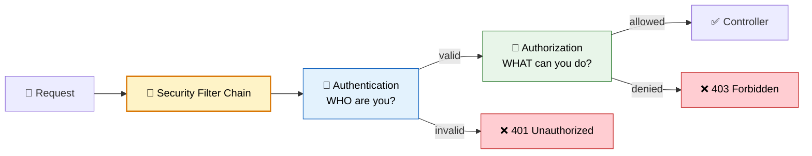
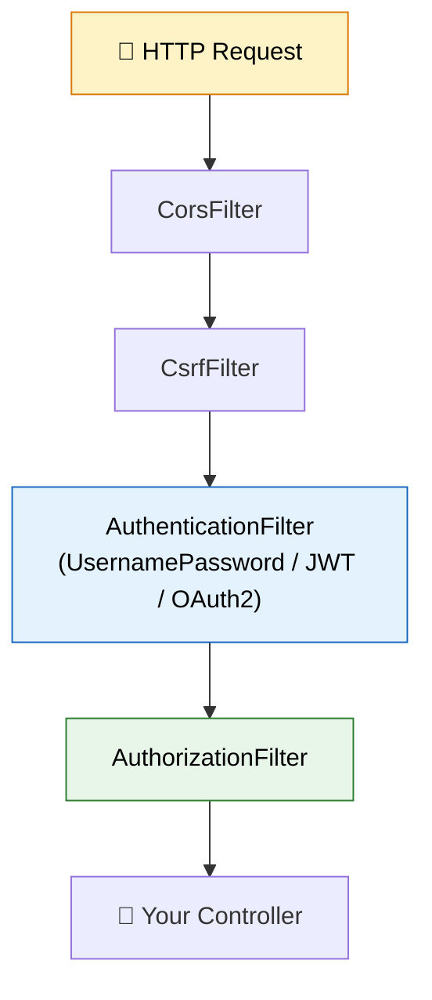

# 🔐 Spring Security

> **Secure your application with authentication and authorization — protect APIs, manage users, and control access.**

---

!!! abstract "Real-World Analogy"
    Think of a **nightclub**. The bouncer at the door checks your ID (**authentication** — are you who you claim to be?). Once inside, your wristband color determines access (**authorization** — VIP area? Backstage?). Spring Security is both the bouncer AND the wristband system for your application.



---

## 🏗️ How Spring Security Works

### The Filter Chain

Every HTTP request passes through a chain of security filters:



---

## 🔧 Basic Security Configuration

### Dependencies

```xml
<dependency>
    <groupId>org.springframework.boot</groupId>
    <artifactId>spring-boot-starter-security</artifactId>
</dependency>
```

!!! tip "Default Behavior"
    Adding this dependency immediately secures ALL endpoints. You'll see a generated password in logs. Every request requires login.

### Custom Security Config (Spring Boot 3)

```java
@Configuration
@EnableWebSecurity
public class SecurityConfig {

    @Bean
    public SecurityFilterChain filterChain(HttpSecurity http) throws Exception {
        return http
            .csrf(csrf -> csrf.disable())  // Disable for REST APIs
            .authorizeHttpRequests(auth -> auth
                .requestMatchers("/api/public/**", "/actuator/health").permitAll()
                .requestMatchers("/api/admin/**").hasRole("ADMIN")
                .requestMatchers("/api/orders/**").hasAnyRole("USER", "ADMIN")
                .anyRequest().authenticated()
            )
            .sessionManagement(session -> 
                session.sessionCreationPolicy(SessionCreationPolicy.STATELESS))
            .httpBasic(Customizer.withDefaults())
            .build();
    }

    @Bean
    public PasswordEncoder passwordEncoder() {
        return new BCryptPasswordEncoder();
    }
}
```

---

## 👤 Authentication Approaches

### 1. In-Memory Users (Development)

```java
@Bean
public UserDetailsService userDetailsService(PasswordEncoder encoder) {
    UserDetails user = User.builder()
        .username("user")
        .password(encoder.encode("password"))
        .roles("USER")
        .build();

    UserDetails admin = User.builder()
        .username("admin")
        .password(encoder.encode("admin123"))
        .roles("USER", "ADMIN")
        .build();

    return new InMemoryUserDetailsManager(user, admin);
}
```

### 2. Database Users (Production)

```java
@Service
public class CustomUserDetailsService implements UserDetailsService {

    private final UserRepository userRepository;

    @Override
    public UserDetails loadUserByUsername(String username) throws UsernameNotFoundException {
        User user = userRepository.findByUsername(username)
            .orElseThrow(() -> new UsernameNotFoundException("User not found: " + username));

        return org.springframework.security.core.userdetails.User.builder()
            .username(user.getUsername())
            .password(user.getPassword())  // Already BCrypt encoded
            .roles(user.getRoles().toArray(String[]::new))
            .build();
    }
}
```

### 3. JWT Authentication (Stateless APIs)

```java
@Component
public class JwtAuthenticationFilter extends OncePerRequestFilter {

    private final JwtService jwtService;
    private final UserDetailsService userDetailsService;

    @Override
    protected void doFilterInternal(HttpServletRequest request, 
            HttpServletResponse response, FilterChain chain) throws Exception {
        
        String header = request.getHeader("Authorization");
        if (header == null || !header.startsWith("Bearer ")) {
            chain.doFilter(request, response);
            return;
        }

        String token = header.substring(7);
        String username = jwtService.extractUsername(token);

        if (username != null && SecurityContextHolder.getContext().getAuthentication() == null) {
            UserDetails userDetails = userDetailsService.loadUserByUsername(username);
            
            if (jwtService.isTokenValid(token, userDetails)) {
                UsernamePasswordAuthenticationToken authToken = 
                    new UsernamePasswordAuthenticationToken(userDetails, null, userDetails.getAuthorities());
                SecurityContextHolder.getContext().setAuthentication(authToken);
            }
        }
        chain.doFilter(request, response);
    }
}
```

```java
// Add JWT filter to the chain
@Bean
public SecurityFilterChain filterChain(HttpSecurity http) throws Exception {
    return http
        .csrf(csrf -> csrf.disable())
        .sessionManagement(s -> s.sessionCreationPolicy(SessionCreationPolicy.STATELESS))
        .authorizeHttpRequests(auth -> auth
            .requestMatchers("/api/auth/**").permitAll()
            .anyRequest().authenticated()
        )
        .addFilterBefore(jwtFilter, UsernamePasswordAuthenticationFilter.class)
        .build();
}
```

---

## 🔒 Method-Level Security

```java
@Configuration
@EnableMethodSecurity
public class MethodSecurityConfig {}

@RestController
@RequestMapping("/api/orders")
public class OrderController {

    @GetMapping
    @PreAuthorize("hasRole('USER')")
    public List<Order> getMyOrders() { ... }

    @DeleteMapping("/{id}")
    @PreAuthorize("hasRole('ADMIN') or @orderSecurity.isOwner(#id)")
    public void deleteOrder(@PathVariable Long id) { ... }

    @GetMapping("/admin")
    @PreAuthorize("hasAuthority('SCOPE_admin:read')")
    public List<Order> adminView() { ... }
}
```

---

## 🔑 Authentication vs Authorization

| | Authentication | Authorization |
|---|---|---|
| **Question** | WHO are you? | WHAT can you do? |
| **When** | First (login) | After authentication |
| **Failure** | 401 Unauthorized | 403 Forbidden |
| **Mechanism** | Password, JWT, OAuth2 | Roles, Permissions, Scopes |
| **Spring** | `AuthenticationManager` | `@PreAuthorize`, `hasRole()` |

---

## 🛡️ CORS Configuration

```java
@Bean
public CorsConfigurationSource corsConfigurationSource() {
    CorsConfiguration config = new CorsConfiguration();
    config.setAllowedOrigins(List.of("http://localhost:3000", "https://myapp.com"));
    config.setAllowedMethods(List.of("GET", "POST", "PUT", "DELETE"));
    config.setAllowedHeaders(List.of("*"));
    config.setAllowCredentials(true);

    UrlBasedCorsConfigurationSource source = new UrlBasedCorsConfigurationSource();
    source.registerCorsConfiguration("/api/**", config);
    return source;
}
```

---

## 🎯 Interview Questions

??? question "1. How does Spring Security work internally?"
    Spring Security uses a **filter chain**. Every request passes through security filters (CORS, CSRF, Authentication, Authorization). The `AuthenticationFilter` validates credentials and creates an `Authentication` object stored in `SecurityContext`. The `AuthorizationFilter` checks if the authenticated user has permission to access the resource.

??? question "2. What's the difference between @Secured, @PreAuthorize, and @RolesAllowed?"
    `@Secured("ROLE_ADMIN")` — simple role check, Spring-specific. `@PreAuthorize("hasRole('ADMIN') and #id == principal.id")` — powerful SpEL expressions, most flexible. `@RolesAllowed("ADMIN")` — JSR-250 standard, simple role check. Use `@PreAuthorize` for complex rules.

??? question "3. How do you implement JWT authentication?"
    Create a custom filter that: extracts the token from the `Authorization: Bearer <token>` header, validates the signature and expiry, loads the user details, and sets the `SecurityContext`. Add this filter before `UsernamePasswordAuthenticationFilter` in the chain.

??? question "4. Session-based vs Token-based auth?"
    **Session-based**: server stores state (session ID in cookie), works for monoliths, doesn't scale horizontally without sticky sessions. **Token-based (JWT)**: stateless, server only validates token signature, scales easily across multiple instances, ideal for microservices.

??? question "5. What is CSRF and when to disable it?"
    Cross-Site Request Forgery — an attack where a malicious site makes requests on behalf of an authenticated user. Disable CSRF for stateless REST APIs (no cookies = no CSRF risk). Keep it enabled for browser-based apps that use session cookies.

