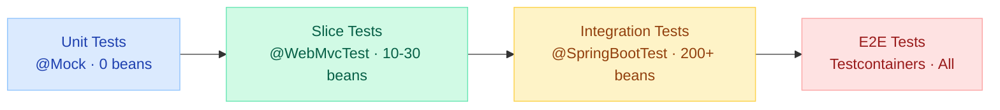
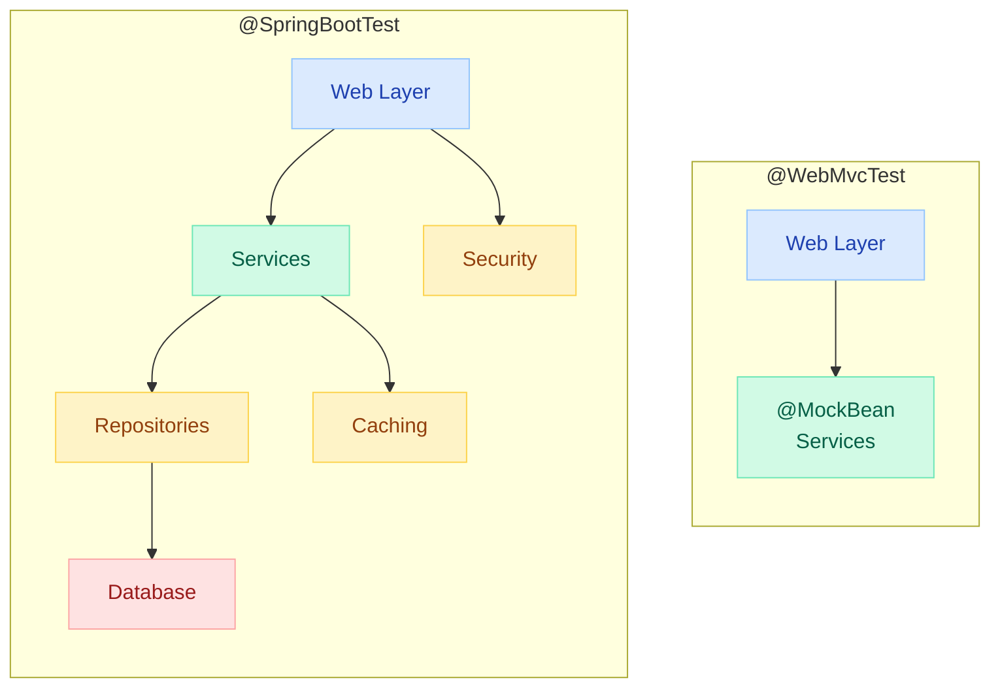
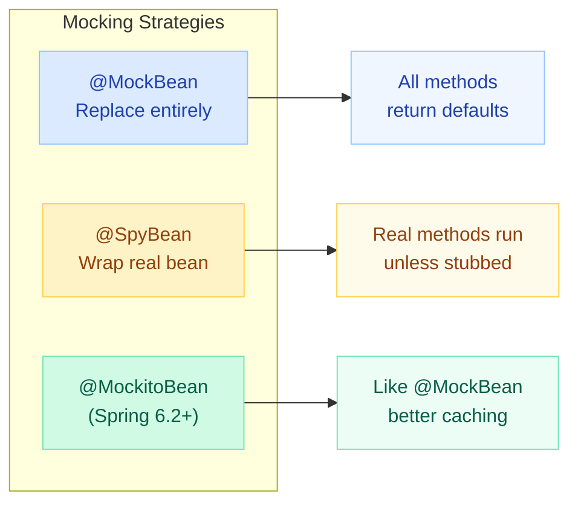

# Spring Boot Slice Testing & MockMvc

> **Full @SpringBootTest takes ~15 min on large apps. Slice tests give the same confidence for a single layer in ~30 seconds.**

---

!!! success "Why Slice Testing?"
    Slice annotations load **only the beans for one layer** — web, JPA, JSON, or REST client. You get a real Spring context without the cost of booting everything. Faster feedback, faster CI, faster deployments.

---

## Testing Pyramid — Where Slices Fit



| Layer | Annotation | Startup Time | Beans Loaded |
|---|---|---|---|
| Unit | None (Mockito) | ~50ms | 0 |
| **Slice** | `@WebMvcTest`, `@DataJpaTest` | ~2-5s | 10-30 |
| Integration | `@SpringBootTest` | ~15-60s | 200+ |
| E2E | `@SpringBootTest` + Testcontainers | ~30-90s | All + infra |

---

## @SpringBootTest vs Slice Annotations



| Aspect | @SpringBootTest | Slice Annotations |
|---|---|---|
| Context size | Full application context | Only layer-specific beans |
| Startup time | 15-60 seconds | 2-5 seconds |
| Dependencies | Real beans or @MockBean | @MockBean for adjacent layers |
| Database | Real or embedded | Embedded (JPA) or none (Web) |
| Use case | End-to-end integration | Single-layer verification |
| Context caching | Hard to reuse (large) | Easy to reuse (small) |

---

## @WebMvcTest — Controller Layer Only

### What It Loads

| Loaded | NOT Loaded |
|---|---|
| `@Controller`, `@RestController` | `@Service`, `@Component` |
| `@ControllerAdvice` | `@Repository` |
| `@JsonComponent` | `DataSource`, JPA |
| `Filter`, `WebMvcConfigurer` | Schedulers, Listeners |
| `MockMvc` (auto-configured) | Caches, Message Brokers |

### Basic Setup

```java
@WebMvcTest(OrderController.class)  // only this controller
class OrderControllerSliceTest {

    @Autowired
    private MockMvc mockMvc;  // auto-injected

    @MockBean
    private OrderService orderService;  // mock the service layer

    @MockBean
    private InventoryService inventoryService;  // mock all injected deps
}
```

!!! tip "Specify the controller"
    Always use `@WebMvcTest(YourController.class)`. Without a value, Spring scans **all** controllers — defeating the purpose of slicing.

---

## MockMvc Deep Dive

MockMvc simulates HTTP without a real server. No port, no network overhead.

### perform() — Building Requests

```java
// GET with params and headers
mockMvc.perform(get("/api/orders")
        .param("status", "PENDING")
        .param("page", "0")
        .header("Authorization", "Bearer token-123")
        .accept(MediaType.APPLICATION_JSON))

// POST with JSON body
mockMvc.perform(post("/api/orders")
        .contentType(MediaType.APPLICATION_JSON)
        .content("""
            {"userId":"user-1","items":["laptop"],"amount":999.99}
            """))

// PUT with path variable
mockMvc.perform(put("/api/orders/{id}", "order-1")
        .contentType(MediaType.APPLICATION_JSON)
        .content("""
            {"status":"SHIPPED"}
            """))

// DELETE
mockMvc.perform(delete("/api/orders/{id}", "order-1"))

// PATCH
mockMvc.perform(patch("/api/orders/{id}", "order-1")
        .contentType("application/json-patch+json")
        .content("""
            [{"op":"replace","path":"/status","value":"CANCELLED"}]
            """))
```

### andExpect() — Response Assertions

```java
mockMvc.perform(get("/api/orders/order-1"))
    // Status
    .andExpect(status().isOk())
    .andExpect(status().is(200))

    // Headers
    .andExpect(header().string("Content-Type", "application/json"))
    .andExpect(header().exists("X-Request-Id"))

    // JSON Path assertions
    .andExpect(jsonPath("$.id").value("order-1"))
    .andExpect(jsonPath("$.amount").value(29.99))
    .andExpect(jsonPath("$.items").isArray())
    .andExpect(jsonPath("$.items.length()").value(3))
    .andExpect(jsonPath("$.items[0].name").value("laptop"))
    .andExpect(jsonPath("$.status").value("PENDING"))

    // Existence & type checks
    .andExpect(jsonPath("$.createdAt").exists())
    .andExpect(jsonPath("$.deletedAt").doesNotExist())
    .andExpect(jsonPath("$.amount").isNumber())
    .andExpect(jsonPath("$.active").isBoolean())

    // Content matchers
    .andExpect(content().contentType(MediaType.APPLICATION_JSON))
    .andExpect(content().json("""
        {"id":"order-1","status":"PENDING"}
        """, false));  // false = lenient (extra fields OK)
```

### Multipart File Upload

```java
@Test
void shouldUploadFile() throws Exception {
    MockMultipartFile file = new MockMultipartFile(
        "document",           // param name
        "report.pdf",         // original filename
        "application/pdf",    // content type
        "PDF content".getBytes()
    );

    MockMultipartFile metadata = new MockMultipartFile(
        "metadata",
        "",
        "application/json",
        """
        {"category":"reports","tags":["Q4","finance"]}
        """.getBytes()
    );

    mockMvc.perform(multipart("/api/documents/upload")
            .file(file)
            .file(metadata)
            .header("Authorization", "Bearer token"))
        .andExpect(status().isCreated())
        .andExpect(jsonPath("$.documentId").exists())
        .andExpect(jsonPath("$.size").value(11));
}
```

### Security Context with MockMvc

```java
@WebMvcTest(AdminController.class)
@Import(SecurityConfig.class)
class AdminControllerSecurityTest {

    @Autowired
    private MockMvc mockMvc;

    @MockBean
    private AdminService adminService;

    @Test
    void shouldReject_whenNoAuth() throws Exception {
        mockMvc.perform(get("/api/admin/users"))
            .andExpect(status().isUnauthorized());
    }

    @Test
    @WithMockUser(roles = "ADMIN")
    void shouldAllow_whenAdmin() throws Exception {
        mockMvc.perform(get("/api/admin/users"))
            .andExpect(status().isOk());
    }

    @Test
    @WithMockUser(roles = "USER")
    void shouldForbid_whenNotAdmin() throws Exception {
        mockMvc.perform(get("/api/admin/users"))
            .andExpect(status().isForbidden());
    }

    @Test
    void shouldAuthenticate_withCustomUser() throws Exception {
        mockMvc.perform(get("/api/admin/users")
                .with(user("admin@example.com")
                    .roles("ADMIN")
                    .password("secret")))
            .andExpect(status().isOk());
    }

    @Test
    void shouldValidate_csrfToken() throws Exception {
        mockMvc.perform(post("/api/admin/users")
                .with(csrf())
                .with(user("admin").roles("ADMIN"))
                .contentType(MediaType.APPLICATION_JSON)
                .content("""
                    {"username":"newuser","email":"new@example.com"}
                    """))
            .andExpect(status().isCreated());
    }
}
```

---

## @DataJpaTest — Repository Layer Only

### What It Loads

- JPA repositories, `EntityManager`, `TestEntityManager`
- Flyway / Liquibase migrations
- Embedded database (H2 by default)
- `@Entity` classes

### What It Excludes

- Controllers, Services, Security, Caching, Scheduling, Message Listeners

### In-Memory DB + TestEntityManager

```java
@DataJpaTest
@ActiveProfiles("test")
class OrderRepositorySliceTest {

    @Autowired
    private TestEntityManager entityManager;

    @Autowired
    private OrderRepository orderRepository;

    @Test
    void findByStatus_shouldReturnMatchingOrders() {
        // Arrange — use TestEntityManager (not the repo under test)
        Order pending = new Order(null, "user-1", BigDecimal.TEN, OrderStatus.PENDING);
        Order shipped = new Order(null, "user-2", BigDecimal.ONE, OrderStatus.SHIPPED);
        entityManager.persistAndFlush(pending);
        entityManager.persistAndFlush(shipped);

        // Act
        List<Order> result = orderRepository.findByStatus(OrderStatus.PENDING);

        // Assert
        assertThat(result).hasSize(1);
        assertThat(result.get(0).getUserId()).isEqualTo("user-1");
    }

    @Test
    void shouldAutoGenerateId() {
        Order order = new Order(null, "user-1", BigDecimal.TEN, OrderStatus.PENDING);
        Order saved = entityManager.persistAndFlush(order);

        assertThat(saved.getId()).isNotNull();
    }
}
```

### Automatic Rollback

!!! info "Every @DataJpaTest is @Transactional"
    Each test runs in a transaction that **rolls back** automatically. No manual cleanup needed. Tests are isolated by default.

### Using Real Database with Testcontainers

```java
@DataJpaTest
@AutoConfigureTestDatabase(replace = AutoConfigureTestDatabase.Replace.NONE)
@Testcontainers
class OrderRepositoryPostgresTest {

    @Container
    static PostgreSQLContainer<?> postgres =
        new PostgreSQLContainer<>("postgres:16-alpine");

    @DynamicPropertySource
    static void props(DynamicPropertyRegistry registry) {
        registry.add("spring.datasource.url", postgres::getJdbcUrl);
        registry.add("spring.datasource.username", postgres::getUsername);
        registry.add("spring.datasource.password", postgres::getPassword);
    }

    @Autowired
    private OrderRepository orderRepository;

    @Test
    void shouldWorkWithPostgresSpecificFeatures() {
        // Native queries, JSONB, arrays — all work here
        Order order = orderRepository.save(
            new Order(null, "user-1", BigDecimal.TEN, OrderStatus.PENDING));
        assertThat(order.getId()).isNotNull();
    }
}
```

---

## @WebFluxTest — Reactive Controller Layer

Loads reactive controllers, `WebFluxConfigurer`, `@ControllerAdvice`, codecs.
Does NOT load services, repositories, or blocking components.

```java
@WebFluxTest(ReactiveOrderController.class)
class ReactiveOrderControllerTest {

    @Autowired
    private WebTestClient webTestClient;

    @MockBean
    private ReactiveOrderService orderService;

    @Test
    void getOrder_shouldReturnOrder() {
        when(orderService.findById("order-1"))
            .thenReturn(Mono.just(new Order("order-1", "user-1", BigDecimal.TEN)));

        webTestClient.get().uri("/api/orders/order-1")
            .accept(MediaType.APPLICATION_JSON)
            .exchange()
            .expectStatus().isOk()
            .expectBody()
            .jsonPath("$.id").isEqualTo("order-1")
            .jsonPath("$.amount").isEqualTo(10);
    }

    @Test
    void getAllOrders_shouldStreamResults() {
        when(orderService.findAll())
            .thenReturn(Flux.just(
                new Order("o-1", "user-1", BigDecimal.TEN),
                new Order("o-2", "user-2", BigDecimal.ONE)));

        webTestClient.get().uri("/api/orders")
            .accept(MediaType.APPLICATION_NDJSON)
            .exchange()
            .expectStatus().isOk()
            .expectBodyList(Order.class)
            .hasSize(2);
    }

    @Test
    void createOrder_shouldReturn201() {
        Order newOrder = new Order("o-new", "user-1", BigDecimal.TEN);
        when(orderService.create(any())).thenReturn(Mono.just(newOrder));

        webTestClient.post().uri("/api/orders")
            .contentType(MediaType.APPLICATION_JSON)
            .bodyValue("""
                {"userId":"user-1","amount":10}
                """)
            .exchange()
            .expectStatus().isCreated()
            .expectBody()
            .jsonPath("$.id").isEqualTo("o-new");
    }
}
```

---

## @RestClientTest — MockRestServiceServer

Tests your REST client classes (services that call external APIs) without making real HTTP calls.

```java
@RestClientTest(PaymentGatewayClient.class)
class PaymentGatewayClientTest {

    @Autowired
    private PaymentGatewayClient client;

    @Autowired
    private MockRestServiceServer server;

    @Autowired
    private ObjectMapper objectMapper;

    @Test
    void chargeCard_shouldReturnTransactionId() throws Exception {
        // Arrange — stub the external API
        String responseBody = """
            {"transactionId":"txn-123","status":"SUCCESS"}
            """;
        server.expect(requestTo("/api/v1/charges"))
            .andExpect(method(HttpMethod.POST))
            .andExpect(header("Authorization", "Bearer api-key-123"))
            .andExpect(jsonPath("$.amount").value(29.99))
            .andRespond(withSuccess(responseBody, MediaType.APPLICATION_JSON));

        // Act
        PaymentResult result = client.chargeCard(
            new ChargeRequest("card-456", new BigDecimal("29.99"), "USD"));

        // Assert
        assertThat(result.getTransactionId()).isEqualTo("txn-123");
        assertThat(result.getStatus()).isEqualTo("SUCCESS");
        server.verify();  // ensures the expected request was made
    }

    @Test
    void chargeCard_whenGatewayReturns500_shouldThrow() {
        server.expect(requestTo("/api/v1/charges"))
            .andRespond(withServerError());

        assertThatThrownBy(() ->
            client.chargeCard(new ChargeRequest("card-456", BigDecimal.TEN, "USD")))
            .isInstanceOf(PaymentGatewayException.class)
            .hasMessageContaining("Gateway error");
    }

    @Test
    void chargeCard_whenTimeout_shouldThrow() {
        server.expect(requestTo("/api/v1/charges"))
            .andRespond(request -> {
                throw new SocketTimeoutException("Read timed out");
            });

        assertThatThrownBy(() ->
            client.chargeCard(new ChargeRequest("card-456", BigDecimal.TEN, "USD")))
            .isInstanceOf(PaymentGatewayException.class);
    }
}
```

---

## @JsonTest — JacksonTester

Tests JSON serialization and deserialization in isolation. Loads `ObjectMapper`, `@JsonComponent`, Jackson modules.

```java
@JsonTest
class OrderJsonTest {

    @Autowired
    private JacksonTester<Order> json;

    @Autowired
    private JacksonTester<List<Order>> jsonList;

    @Test
    void shouldSerialize() throws Exception {
        Order order = new Order("o-1", "user-1",
            new BigDecimal("29.99"), OrderStatus.PENDING);

        JsonContent<Order> result = json.write(order);

        assertThat(result)
            .extractingJsonPathStringValue("$.id").isEqualTo("o-1")
            .extractingJsonPathNumberValue("$.amount").isEqualTo(29.99)
            .extractingJsonPathStringValue("$.status").isEqualTo("PENDING");

        // Verify fields are NOT serialized (e.g., @JsonIgnore)
        assertThat(result).doesNotHaveJsonPath("$.internalNotes");
    }

    @Test
    void shouldDeserialize() throws Exception {
        String content = """
            {
              "id": "o-1",
              "userId": "user-1",
              "amount": 29.99,
              "status": "PENDING"
            }
            """;

        Order order = json.parseObject(content);

        assertThat(order.getId()).isEqualTo("o-1");
        assertThat(order.getAmount()).isEqualByComparingTo("29.99");
        assertThat(order.getStatus()).isEqualTo(OrderStatus.PENDING);
    }

    @Test
    void shouldHandleCustomDateFormat() throws Exception {
        String content = """
            {"id":"o-1","createdAt":"2025-01-15T10:30:00Z"}
            """;

        Order order = json.parseObject(content);
        assertThat(order.getCreatedAt())
            .isEqualTo(Instant.parse("2025-01-15T10:30:00Z"));
    }
}
```

---

## Other Slice Annotations

| Annotation | What It Tests | Beans Loaded | Typical Assertion |
|---|---|---|---|
| `@WebMvcTest` | Controllers (Servlet) | Controllers, Filters, MockMvc | HTTP status, JSON body |
| `@WebFluxTest` | Controllers (Reactive) | Reactive Controllers, WebTestClient | Reactive responses |
| `@DataJpaTest` | JPA Repositories | Entities, Repos, EntityManager | Query results, mappings |
| `@DataMongoTest` | MongoDB Repositories | MongoTemplate, Repos | Document queries |
| `@DataR2dbcTest` | Reactive SQL Repositories | R2DBC Repos, DatabaseClient | Reactive DB operations |
| `@DataRedisTest` | Redis Repositories | RedisTemplate, Repos | Key-value operations |
| `@DataNeo4jTest` | Neo4j Repositories | Neo4jTemplate, Repos | Graph queries |
| `@DataCassandraTest` | Cassandra Repositories | CassandraTemplate | Wide-column queries |
| `@DataElasticsearchTest` | Elasticsearch Repos | ElasticsearchTemplate | Search queries |
| `@JdbcTest` | JDBC (no JPA) | JdbcTemplate, DataSource | Raw SQL queries |
| `@JooqTest` | jOOQ queries | DSLContext | Type-safe SQL |
| `@JsonTest` | JSON serialization | ObjectMapper, JacksonTester | JSON structure |
| `@RestClientTest` | REST clients | MockRestServiceServer | External API calls |
| `@GraphQlTest` | GraphQL controllers | GraphQlTester | GraphQL queries |

---

## WireMock for External HTTP

WireMock is a more powerful alternative to `MockRestServiceServer` — it starts a real HTTP server and stubs responses. Ideal for testing HTTP clients, retries, timeouts, and error scenarios.

```java
@SpringBootTest
@WireMockTest(httpPort = 8089)
class PaymentServiceWireMockTest {

    @Autowired
    private PaymentService paymentService;

    @Test
    void shouldProcessPayment_whenGatewayReturnsSuccess() {
        // Stub external API
        stubFor(post(urlEqualTo("/api/v1/charges"))
            .withHeader("Content-Type", equalTo("application/json"))
            .withRequestBody(matchingJsonPath("$.amount", equalTo("29.99")))
            .willReturn(aResponse()
                .withStatus(200)
                .withHeader("Content-Type", "application/json")
                .withBody("""
                    {"transactionId":"txn-abc","status":"SUCCESS"}
                    """)));

        PaymentResult result = paymentService.charge("card-1", new BigDecimal("29.99"));

        assertThat(result.getTransactionId()).isEqualTo("txn-abc");
        verify(postRequestedFor(urlEqualTo("/api/v1/charges"))
            .withHeader("Authorization", matching("Bearer .*")));
    }

    @Test
    void shouldRetry_whenGatewayReturns503() {
        // First call: 503, Second call: 200
        stubFor(post(urlEqualTo("/api/v1/charges"))
            .inScenario("retry")
            .whenScenarioStateIs(STARTED)
            .willReturn(aResponse().withStatus(503))
            .willSetStateTo("RETRIED"));

        stubFor(post(urlEqualTo("/api/v1/charges"))
            .inScenario("retry")
            .whenScenarioStateIs("RETRIED")
            .willReturn(aResponse()
                .withStatus(200)
                .withBody("""
                    {"transactionId":"txn-retry","status":"SUCCESS"}
                    """)));

        PaymentResult result = paymentService.charge("card-1", BigDecimal.TEN);

        assertThat(result.getTransactionId()).isEqualTo("txn-retry");
        verify(2, postRequestedFor(urlEqualTo("/api/v1/charges")));
    }

    @Test
    void shouldTimeout_whenGatewayIsSlow() {
        stubFor(post(urlEqualTo("/api/v1/charges"))
            .willReturn(aResponse()
                .withFixedDelay(5000)  // 5-second delay
                .withStatus(200)));

        assertThatThrownBy(() ->
            paymentService.charge("card-1", BigDecimal.TEN))
            .isInstanceOf(PaymentTimeoutException.class);
    }
}
```

### WireMock vs MockRestServiceServer

| Feature | MockRestServiceServer | WireMock |
|---|---|---|
| Real HTTP server | No (intercepts RestTemplate) | Yes (localhost:port) |
| Works with WebClient | Limited | Full support |
| Retry/timeout testing | Difficult | Built-in (delays, faults) |
| Scenario support | No | Yes (stateful stubs) |
| Request verification | Basic | Advanced (patterns, count) |
| Setup complexity | Low | Medium |

---

## @MockBean vs @SpyBean vs @MockitoBean



| Annotation | Behavior | Context Cache | Use When |
|---|---|---|---|
| `@MockBean` | Replaces bean with Mockito mock | Busts cache per unique set | You want to control all interactions |
| `@SpyBean` | Wraps real bean; real methods run unless stubbed | Busts cache per unique set | You need real behavior + selective overrides |
| `@MockitoBean` (Spring 6.2+) | Same as @MockBean | Better cache reuse | Spring Boot 3.4+ projects |

### @MockBean — Full Replacement

```java
@WebMvcTest(OrderController.class)
class OrderControllerTest {

    @MockBean
    private OrderService orderService;  // all methods return null/0/empty

    @Test
    void test() {
        when(orderService.findById("o-1")).thenReturn(new Order(...));
        // Only stubbed methods return values
    }
}
```

### @SpyBean — Partial Mocking

```java
@SpringBootTest
class NotificationServiceTest {

    @SpyBean
    private NotificationService notificationService;

    @Autowired
    private OrderService orderService;

    @Test
    void shouldSendNotification_butSkipEmail() {
        // Real methods run, except we stub the email sender
        doNothing().when(notificationService).sendEmail(any());

        orderService.completeOrder("order-1");

        // Verify real method was called
        verify(notificationService).notifyUser("order-1");
        // But email was suppressed
        verify(notificationService).sendEmail(any());
    }
}
```

### @MockitoBean (Spring Boot 3.4+)

```java
@WebMvcTest(OrderController.class)
class OrderControllerModernTest {

    @MockitoBean  // preferred in Spring Boot 3.4+
    private OrderService orderService;

    @Autowired
    private MockMvc mockMvc;

    @Test
    void test() {
        when(orderService.findById("o-1")).thenReturn(new Order(...));
        // Behaves like @MockBean but with improved context caching
    }
}
```

!!! warning "@MockBean is deprecated in Spring Boot 3.4+"
    Spring Boot 3.4 introduced `@MockitoBean` and `@MockitoSpyBean` as replacements. They provide better context caching semantics. Migrate when upgrading.

---

## Quick Recall

| Question | Answer |
|---|---|
| What does @WebMvcTest load? | Controllers, @ControllerAdvice, filters, converters, MockMvc |
| What does @WebMvcTest exclude? | @Service, @Repository, @Component, DataSource, JPA |
| How to test file upload? | `MockMultipartFile` + `multipart()` |
| How to test secured endpoints? | `@WithMockUser` or `.with(user(...))` |
| @DataJpaTest default DB? | H2 in-memory |
| @DataJpaTest transactional? | Yes, auto-rollback after each test |
| Use real DB in @DataJpaTest? | `@AutoConfigureTestDatabase(replace = NONE)` + Testcontainers |
| @RestClientTest purpose? | Test REST clients without real HTTP |
| WireMock vs MockRestServiceServer? | WireMock = real HTTP server, supports retries/timeouts |
| @MockBean vs @SpyBean? | MockBean = full mock; SpyBean = real bean with selective stubs |
| @MockitoBean advantage? | Better context cache reuse (Spring Boot 3.4+) |
| MockMvc without server? | Yes, simulates servlet dispatch — no port, no network |

---

## Interview Template

??? question "1. What is slice testing and why use it?"
    Slice testing loads **only one layer** of your application (web, data, JSON). It uses annotations like `@WebMvcTest` and `@DataJpaTest` to boot a minimal Spring context. Benefits: 10x faster startup than `@SpringBootTest`, isolates the layer under test, forces clean architecture by proving layers work independently.

??? question "2. What does MockMvc test without starting a server?"
    MockMvc dispatches requests through the Spring MVC `DispatcherServlet` without opening a network port. It tests: request mapping, parameter binding, validation, serialization, content negotiation, error handling, filters, and interceptors — all at servlet speed (~ms per test).

??? question "3. How does @WebMvcTest differ from @SpringBootTest(webEnvironment=MOCK)?"
    `@WebMvcTest` loads ONLY web-layer beans (controllers, filters, advice). `@SpringBootTest(MOCK)` loads the ENTIRE application context but mocks the servlet environment. `@WebMvcTest` is faster because it skips services, repositories, caches, and all non-web auto-configuration.

??? question "4. How do you test multipart file uploads with MockMvc?"
    Create a `MockMultipartFile` with name, filename, content type, and bytes. Use `mockMvc.perform(multipart("/endpoint").file(mockFile))` to simulate the upload. Assert status and response body as usual.

??? question "5. How does @DataJpaTest achieve test isolation?"
    Each test runs inside a transaction that is **rolled back** after completion. The embedded database is reset between test classes. `TestEntityManager` provides a separate persistence path from the repository under test, preventing false positives.

??? question "6. When would you use WireMock over MockRestServiceServer?"
    WireMock when: testing WebClient (not just RestTemplate), verifying retry logic, simulating network delays/timeouts, testing circuit breaker behavior, or needing stateful scenarios. MockRestServiceServer when: simple RestTemplate stubbing is sufficient and you want minimal setup.

??? question "7. Why does @MockBean bust the application context cache?"
    Spring caches application contexts by their configuration fingerprint. Each unique combination of `@MockBean` declarations creates a different fingerprint. 10 test classes with different mock sets = 10 separate context startups. Solution: standardize mock sets or use `@MockitoBean` (Spring 6.2+).

??? question "8. What is @SpyBean used for?"
    `@SpyBean` wraps a real bean with Mockito spy behavior. Real methods execute unless explicitly stubbed. Use it when you need the actual bean logic but want to override one method (e.g., skip email sending) or verify a method was called.

??? question "9. How do you test Spring Security with @WebMvcTest?"
    Three approaches: (1) `@WithMockUser(roles="ADMIN")` on the test method, (2) `.with(user("admin").roles("ADMIN"))` in the request builder, (3) `@WithSecurityContext` with a custom factory for complex auth objects. Always `@Import(SecurityConfig.class)` if security is not auto-loaded.

??? question "10. What is the difference between @MockitoBean and @MockBean?"
    Functionally identical — both replace a bean with a Mockito mock. The difference is context caching: `@MockitoBean` (Spring Boot 3.4+) has smarter cache key computation, leading to better context reuse across test classes. `@MockBean` is deprecated as of Spring Boot 3.4.
