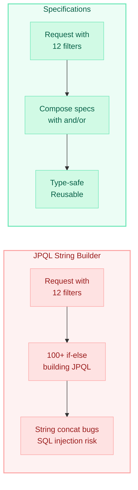
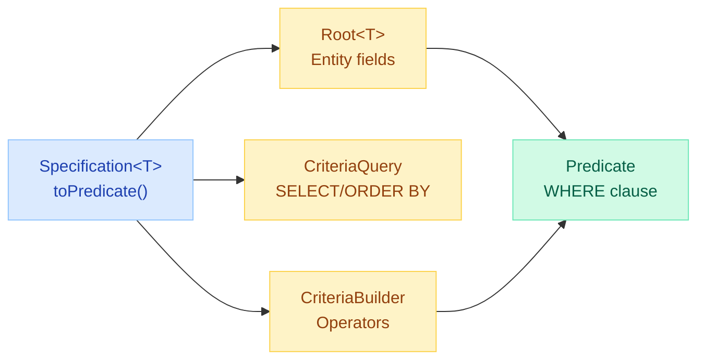
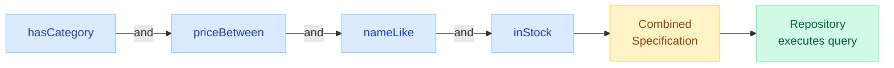
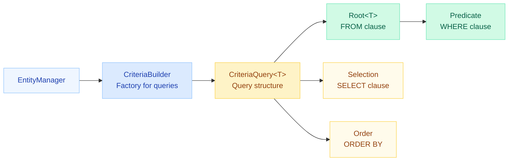
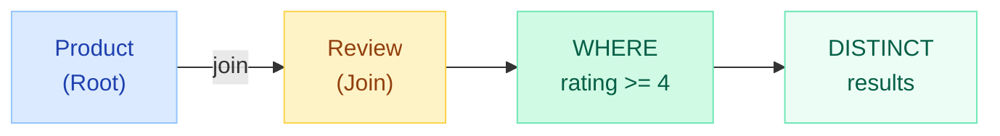
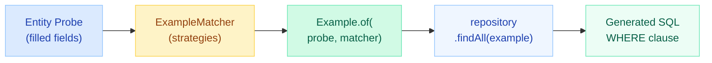
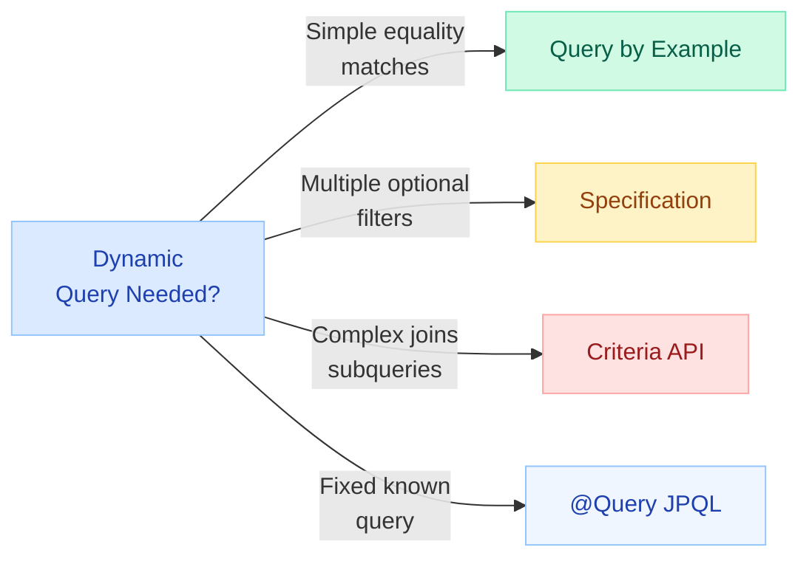

# JPA Specifications, Criteria API & Query by Example

> **Build dynamic, type-safe queries without drowning in string concatenation. Replace 100-line if-else JPQL builders with composable predicates.**

---

!!! danger "The Problem: JPQL String Soup"
    A search endpoint with 12 optional filters results in **100+ lines of if-else** building a JPQL string. Every new filter means more branches, more string bugs, more untestable code. It ships broken every sprint.



---

## Specifications (Spring Data JPA)

The `Specification<T>` interface wraps a single predicate. You compose multiple specifications to build complex queries dynamically.

### The Interface

```java
@FunctionalInterface
public interface Specification<T> {
    Predicate toPredicate(Root<T> root,
                          CriteriaQuery<?> query,
                          CriteriaBuilder cb);
}
```



### Enable with JpaSpecificationExecutor

```java
public interface ProductRepository extends JpaRepository<Product, Long>,
                                           JpaSpecificationExecutor<Product> {
}
```

`JpaSpecificationExecutor<T>` adds:

| Method | Description |
|--------|-------------|
| `findOne(Specification<T>)` | Returns `Optional<T>` |
| `findAll(Specification<T>)` | Returns `List<T>` |
| `findAll(Specification<T>, Pageable)` | Paginated results |
| `findAll(Specification<T>, Sort)` | Sorted results |
| `count(Specification<T>)` | Count matching |
| `exists(Specification<T>)` | Boolean check |

---

### Writing Individual Specs

```java
public class ProductSpecs {

    public static Specification<Product> hasCategory(String category) {
        return (root, query, cb) ->
            cb.equal(root.get("category"), category);
    }

    public static Specification<Product> priceBetween(BigDecimal min, BigDecimal max) {
        return (root, query, cb) ->
            cb.between(root.get("price"), min, max);
    }

    public static Specification<Product> nameLike(String keyword) {
        return (root, query, cb) ->
            cb.like(cb.lower(root.get("name")),
                    "%" + keyword.toLowerCase() + "%");
    }

    public static Specification<Product> inStock() {
        return (root, query, cb) ->
            cb.greaterThan(root.get("stockQuantity"), 0);
    }
}
```

---

### Composing Specs: and(), or(), not()

```java
@Service
public class ProductSearchService {

    private final ProductRepository repo;

    public Page<Product> search(ProductSearchRequest req, Pageable pageable) {

        Specification<Product> spec = Specification.where(null); // start empty

        if (req.getCategory() != null) {
            spec = spec.and(ProductSpecs.hasCategory(req.getCategory()));
        }
        if (req.getMinPrice() != null && req.getMaxPrice() != null) {
            spec = spec.and(ProductSpecs.priceBetween(
                req.getMinPrice(), req.getMaxPrice()));
        }
        if (req.getKeyword() != null) {
            spec = spec.and(ProductSpecs.nameLike(req.getKeyword()));
        }
        if (req.isInStockOnly()) {
            spec = spec.and(ProductSpecs.inStock());
        }

        return repo.findAll(spec, pageable);
    }
}
```



!!! tip "Null-safe composition"
    `Specification.where(null)` is the identity spec (no filtering). Chaining `.and(null)` is also safe — Spring ignores null specs. This eliminates the need for `if (spec == null)` checks.

---

### Reusable Spec Builder Pattern

```java
public class SpecBuilder<T> {

    private Specification<T> spec = Specification.where(null);

    public SpecBuilder<T> and(boolean condition, Supplier<Specification<T>> s) {
        if (condition) {
            spec = spec.and(s.get());
        }
        return this;
    }

    public SpecBuilder<T> or(boolean condition, Supplier<Specification<T>> s) {
        if (condition) {
            spec = spec.or(s.get());
        }
        return this;
    }

    public Specification<T> build() {
        return spec;
    }
}
```

Usage:

```java
Specification<Product> spec = new SpecBuilder<Product>()
    .and(req.getCategory() != null,
         () -> ProductSpecs.hasCategory(req.getCategory()))
    .and(req.getMinPrice() != null,
         () -> ProductSpecs.priceBetween(req.getMinPrice(), req.getMaxPrice()))
    .and(req.getKeyword() != null,
         () -> ProductSpecs.nameLike(req.getKeyword()))
    .build();
```

---

## Criteria API

The JPA Criteria API is the foundation under Specifications. Use it directly when you need full control (subqueries, multiselect, group by).

### Core Components



### Basic Criteria Query

```java
@Repository
public class ProductCriteriaRepo {

    @PersistenceContext
    private EntityManager em;

    public List<Product> search(String name, String category, BigDecimal maxPrice) {

        CriteriaBuilder cb = em.getCriteriaBuilder();
        CriteriaQuery<Product> cq = cb.createQuery(Product.class);
        Root<Product> root = cq.from(Product.class);

        List<Predicate> predicates = new ArrayList<>();

        if (name != null) {
            predicates.add(cb.like(cb.lower(root.get("name")),
                "%" + name.toLowerCase() + "%"));
        }
        if (category != null) {
            predicates.add(cb.equal(root.get("category"), category));
        }
        if (maxPrice != null) {
            predicates.add(cb.lessThanOrEqualTo(root.get("price"), maxPrice));
        }

        cq.where(predicates.toArray(new Predicate[0]));
        cq.orderBy(cb.asc(root.get("name")));

        return em.createQuery(cq).getResultList();
    }
}
```

---

### Type-Safe Queries with Metamodel

The JPA metamodel generates `_` classes at compile time, eliminating magic strings.

```java
// Generated: Product_.java
@StaticMetamodel(Product.class)
public abstract class Product_ {
    public static volatile SingularAttribute<Product, Long> id;
    public static volatile SingularAttribute<Product, String> name;
    public static volatile SingularAttribute<Product, String> category;
    public static volatile SingularAttribute<Product, BigDecimal> price;
    public static volatile SingularAttribute<Product, Integer> stockQuantity;
}
```

```java
// Usage — compile-time checked!
predicates.add(cb.equal(root.get(Product_.category), category));
predicates.add(cb.lessThan(root.get(Product_.price), maxPrice));
```

!!! success "Why Metamodel?"
    Without it, `root.get("priec")` compiles fine but fails at runtime. With `Product_.price`, the typo is caught at compile time.

Enable in Maven:

```xml
<dependency>
    <groupId>org.hibernate.orm</groupId>
    <artifactId>hibernate-jpamodelgen</artifactId>
    <scope>provided</scope>
</dependency>
```

---

### Dynamic WHERE Clauses

```java
public List<Product> dynamicSearch(Map<String, Object> filters) {

    CriteriaBuilder cb = em.getCriteriaBuilder();
    CriteriaQuery<Product> cq = cb.createQuery(Product.class);
    Root<Product> root = cq.from(Product.class);

    List<Predicate> predicates = new ArrayList<>();

    filters.forEach((field, value) -> {
        if (value instanceof String s) {
            predicates.add(cb.like(cb.lower(root.get(field)),
                "%" + s.toLowerCase() + "%"));
        } else if (value instanceof Number n) {
            predicates.add(cb.equal(root.get(field), n));
        }
    });

    cq.where(cb.and(predicates.toArray(new Predicate[0])));
    return em.createQuery(cq).getResultList();
}
```

---

### Joins and Subqueries

```java
// Find products that have at least one review with rating >= 4
public List<Product> highlyRated() {

    CriteriaBuilder cb = em.getCriteriaBuilder();
    CriteriaQuery<Product> cq = cb.createQuery(Product.class);
    Root<Product> product = cq.from(Product.class);

    // JOIN
    Join<Product, Review> review = product.join("reviews", JoinType.INNER);
    cq.where(cb.greaterThanOrEqualTo(review.get("rating"), 4));
    cq.distinct(true);

    return em.createQuery(cq).getResultList();
}

// Subquery: products priced above average
public List<Product> aboveAveragePrice() {

    CriteriaBuilder cb = em.getCriteriaBuilder();
    CriteriaQuery<Product> cq = cb.createQuery(Product.class);
    Root<Product> product = cq.from(Product.class);

    // Subquery for average price
    Subquery<Double> avgSubquery = cq.subquery(Double.class);
    Root<Product> subRoot = avgSubquery.from(Product.class);
    avgSubquery.select(cb.avg(subRoot.get("price")));

    cq.where(cb.greaterThan(product.get("price"), avgSubquery));

    return em.createQuery(cq).getResultList();
}
```



---

## Query by Example (QBE)

QBE lets you create a query from a populated entity instance. Zero boilerplate for simple searches.

### Basic Usage

```java
// Create a "probe" — an entity with fields set to desired values
Product probe = new Product();
probe.setCategory("Electronics");
probe.setBrand("Samsung");

Example<Product> example = Example.of(probe);
List<Product> results = productRepository.findAll(example);
// Generates: WHERE category = 'Electronics' AND brand = 'Samsung'
```

### ExampleMatcher (Matching Strategies)

```java
ExampleMatcher matcher = ExampleMatcher.matching()
    // Global settings
    .withIgnoreCase()                          // case-insensitive
    .withStringMatcher(StringMatcher.CONTAINING) // LIKE %value%
    // Per-field overrides
    .withMatcher("name", match -> match.startsWith())
    .withMatcher("description", match -> match.contains())
    // Ignore specific paths
    .withIgnorePaths("id", "createdDate", "price");

Product probe = new Product();
probe.setName("Galaxy");
probe.setCategory("Electronics");

Example<Product> example = Example.of(probe, matcher);
List<Product> results = productRepository.findAll(example);
```

| Matcher Strategy | SQL Equivalent |
|-----------------|---------------|
| `DEFAULT` (exact) | `= 'value'` |
| `STARTING` | `LIKE 'value%'` |
| `ENDING` | `LIKE '%value'` |
| `CONTAINING` | `LIKE '%value%'` |
| `REGEX` | Provider-specific regex |



---

### When QBE Is Sufficient vs When You Need Specifications

| Use QBE When | Use Specifications When |
|------|------|
| All filters are equality or simple string matches | You need `>`, `<`, `BETWEEN`, `IN` |
| No range queries needed | Complex OR logic across groups |
| No nested property joins | Joins across entities |
| Quick admin search UI | Production search with pagination |
| Prototype / internal tool | Reusable, testable query components |

!!! warning "QBE Limitations"
    - No support for `OR` at the top level (all conditions are ANDed)
    - No range queries (`price > 100`)
    - No nested property constraints (`order.customer.name`)
    - Null fields are ignored (you cannot query for `WHERE field IS NULL`)

---

## Comparison Table

| Feature | Specification | Criteria API | QBE | @Query (JPQL) | Native @Query |
|---------|:---:|:---:|:---:|:---:|:---:|
| **Dynamic filters** | Excellent | Excellent | Limited | Poor | Poor |
| **Type safety** | With metamodel | With metamodel | Partial | None | None |
| **Composability** | and/or/not | Manual | None | None | None |
| **Readability** | High | Low (verbose) | Very high | High | Medium |
| **Range queries** | Yes | Yes | No | Yes | Yes |
| **Joins** | Yes | Yes | No | Yes | Yes |
| **Subqueries** | Yes | Yes | No | Yes | Yes |
| **Learning curve** | Medium | High | Low | Low | Low |
| **Reusability** | Excellent | Moderate | Low | None | None |
| **Pagination** | Built-in | Manual | Built-in | Built-in | Built-in |
| **Best for** | Search APIs | Complex reports | Simple search | Fixed queries | DB-specific |



---

## Quick Recall

| Concept | One-liner |
|---------|-----------|
| `Specification<T>` | Functional interface wrapping a single `Predicate` |
| `toPredicate()` | The single method: takes Root, CriteriaQuery, CriteriaBuilder |
| `JpaSpecificationExecutor` | Mixin interface enabling spec-based queries |
| `Specification.where(null)` | Identity spec, safe starting point for composition |
| `.and() / .or() / .not()` | Spec composition operators |
| `CriteriaBuilder` | Factory for predicates, expressions, queries |
| `Root<T>` | Represents the FROM entity, access fields |
| `Metamodel (_classes)` | Compile-time field references, eliminates magic strings |
| `Example.of(probe, matcher)` | QBE: query from populated entity + match strategy |
| `ExampleMatcher` | Configures case, string matching, ignored paths |

---

## Interview Template

???+ example "Q: How do you build dynamic search queries in Spring Data JPA?"
    **Answer framework:**

    1. **State the problem:** Building JPQL strings with if-else is brittle, untestable, and a SQL injection risk.

    2. **Introduce Specifications:**
        - Implement `Specification<T>` as small, single-responsibility predicates
        - Compose with `.and()`, `.or()`, `.not()`
        - Repository extends `JpaSpecificationExecutor<T>`

    3. **Show composition:**
        ```java
        Specification<Product> spec = Specification.where(null)
            .and(hasCategory("Electronics"))
            .and(priceBetween(100, 500))
            .and(inStock());
        repo.findAll(spec, pageable);
        ```

    4. **Mention alternatives:**
        - QBE for simple equality-only searches
        - Criteria API for complex joins/subqueries/aggregations
        - `@Query` for fixed, known queries

    5. **Production tips:**
        - Use metamodel for type safety
        - Create a reusable `SpecBuilder` utility
        - Always combine with `Pageable`
        - Specs are unit-testable in isolation

???+ example "Q: When would you use Criteria API over Specifications?"
    **Answer:**

    - Specifications are preferred for 90% of search use cases (simpler, composable, integrates with Spring Data)
    - Use Criteria API directly when you need:
        - Multiselect / projections (`cq.multiselect(...)`)
        - Group by / having clauses
        - Subqueries within predicates
        - Tuple queries for reporting
    - In practice, you can still use Specifications for subqueries by accessing the `CriteriaQuery` parameter in `toPredicate()`

???+ example "Q: What are the limitations of Query by Example?"
    **Answer:**

    - Only supports AND (no OR at top level)
    - No range queries (no `>`, `<`, `BETWEEN`)
    - No nested joins (`order.customer.city`)
    - Cannot match on null (nulls are ignored, not queried)
    - Best for: admin panels, quick prototypes, simple filter forms
    - Graduate to Specifications when requirements grow
