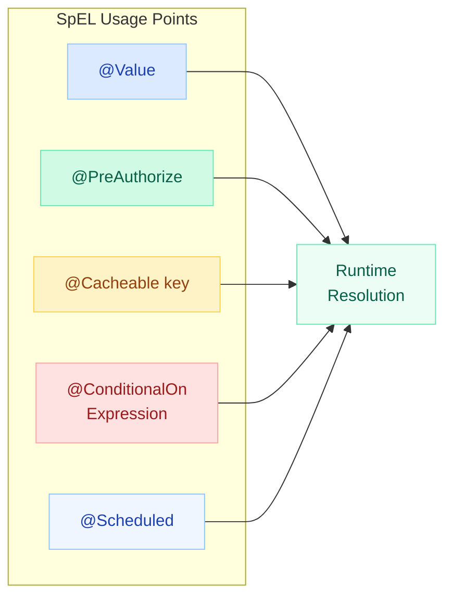
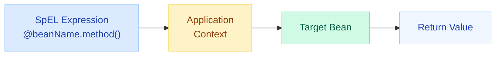
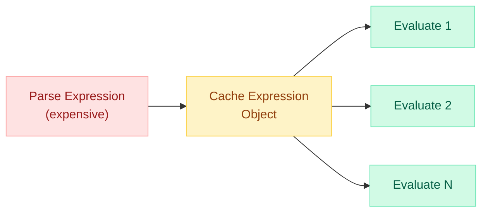
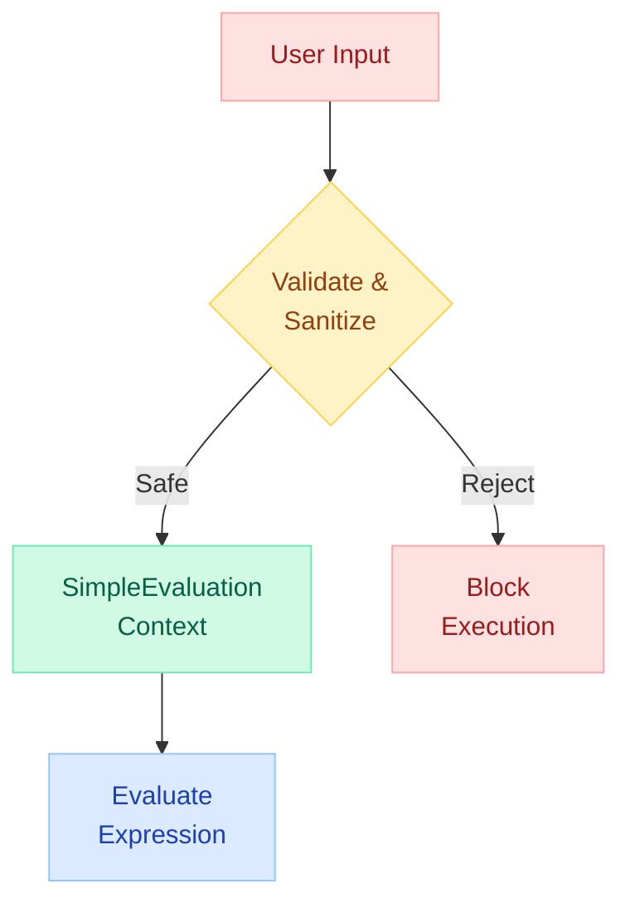

# Spring Expression Language (SpEL)

> A powerful expression language for querying and manipulating objects at runtime. SpEL supports property access, method invocation, string templating, and conditional logic -- all within Spring annotations and XML configuration.

---

!!! danger "SpEL Injection Vulnerability"
    **Never** evaluate user-supplied input as a SpEL expression. If an attacker controls the expression string, they can execute arbitrary code on the server (Remote Code Execution). Always treat SpEL expressions as code, not data.

    ```java
    // VULNERABLE -- user input evaluated as SpEL
    ExpressionParser parser = new SpelExpressionParser();
    Expression exp = parser.parseExpression(userInput); // RCE!
    Object result = exp.getValue();
    ```

---

## Where SpEL Is Used in Spring



| Annotation | SpEL Usage | Example |
|---|---|---|
| `@Value` | Inject config or computed values | `@Value("#{systemProperties['user.home']}")` |
| `@PreAuthorize` | Method-level security expressions | `@PreAuthorize("hasRole('ADMIN')")` |
| `@Cacheable` | Dynamic cache key generation | `@Cacheable(key = "#user.id")` |
| `@ConditionalOnExpression` | Conditional bean registration | `@ConditionalOnExpression("${feature.enabled:false}")` |
| `@Scheduled` | Dynamic cron/delay from properties | `@Scheduled(cron = "#{@cronConfig.expression}")` |

---

## Basic Syntax

### Literals

```java
@Value("#{42}")              // int
@Value("#{'Hello World'}")   // String
@Value("#{true}")            // boolean
@Value("#{3.14}")            // double
@Value("#{null}")            // null
```

### Property References

```java
@Value("#{systemProperties['java.version']}")
private String javaVersion;

@Value("#{environment['SPRING_PROFILES_ACTIVE']}")
private String activeProfile;
```

### Operators

| Category | Operators | Example |
|---|---|---|
| Arithmetic | `+`, `-`, `*`, `/`, `%`, `^` | `#{2 + 3}` |
| Relational | `==`, `!=`, `<`, `>`, `<=`, `>=` | `#{age > 18}` |
| Logical | `and`, `or`, `not`, `!` | `#{active and verified}` |
| Instanceof | `instanceof` | `#{item instanceof T(String)}` |
| Regex | `matches` | `#{email matches '[a-z]+@.+'}` |

### Method Calls

```java
@Value("#{'hello world'.toUpperCase()}")
private String upper;  // "HELLO WORLD"

@Value("#{'spring framework'.split(' ').length}")
private int wordCount;  // 2
```

---

## Object Navigation

### Property Access

```java
// Nested property access
@Value("#{employee.address.city}")
private String city;

// Array/List indexing
@Value("#{cities[0]}")
private String firstCity;

// Map access
@Value("#{settings['timeout']}")
private int timeout;
```

### Null-Safe Operator (?.)

Avoids `NullPointerException` -- returns `null` if any part of the chain is null.

```java
@Value("#{employee?.address?.city}")
private String city;  // null if employee or address is null
```

### Collection Selection (?[])

Filters a collection based on a predicate (like Java Stream `filter()`).

```java
// Select all active users
@Value("#{users.?[active == true]}")
private List<User> activeUsers;

// First match (.^[])
@Value("#{users.^[age > 30]}")
private User firstOver30;

// Last match (.$[])
@Value("#{users.$[age > 30]}")
private User lastOver30;
```

### Collection Projection (![])

Transforms each element (like Java Stream `map()`).

```java
// Extract all names from user list
@Value("#{users.![name]}")
private List<String> userNames;

// Extract nested property
@Value("#{orders.![item.price]}")
private List<Double> prices;
```

---

## T() Operator -- Static Methods and Fields

The `T()` operator references a Java type, granting access to static methods and constants.

```java
// Static method call
@Value("#{T(java.lang.Math).random()}")
private double randomValue;

// Static field
@Value("#{T(java.lang.Integer).MAX_VALUE}")
private int maxInt;

// Enum reference
@Value("#{T(com.app.enums.Status).ACTIVE}")
private Status activeStatus;

// Utility method
@Value("#{T(java.util.UUID).randomUUID().toString()}")
private String uuid;
```

!!! warning "Security Risk with T()"
    `T(java.lang.Runtime).getRuntime().exec('...')` -- if user input is evaluated as SpEL, the T() operator enables arbitrary command execution. This is the primary SpEL injection vector.

---

## Bean References (@beanName)

Reference any Spring bean by name using the `@` prefix.

```java
@Value("#{@userService.getDefaultUser()}")
private User defaultUser;

@Value("#{@configProperties.maxRetries}")
private int maxRetries;

// In @PreAuthorize
@PreAuthorize("@securityService.canAccess(#id)")
public Resource getResource(Long id) { ... }
```



---

## Templated Expressions ("#{...}")

SpEL expressions are embedded inside `#{}` delimiters within annotation strings.

```java
// Mix literal text with SpEL
@Value("Server running on #{@serverConfig.host}:#{@serverConfig.port}")
private String serverInfo;

// Conditional value
@Value("#{${feature.enabled} ? 'Feature ON' : 'Feature OFF'}")
private String featureStatus;

// Property with default
@Value("#{${app.timeout:5000}}")
private int timeout;
```

!!! info "`${}` vs `#{}`"
    - `${property.name}` -- property placeholder (resolved by `PropertySourcesPlaceholderConfigurer`)
    - `#{expression}` -- SpEL expression (resolved by `SpelExpressionParser`)
    - Can be combined: `#{'${app.name}'.toUpperCase()}`

---

## Collection Filtering and Transformation

### Programmatic Usage

```java
ExpressionParser parser = new SpelExpressionParser();
StandardEvaluationContext context = new StandardEvaluationContext();
context.setVariable("users", userList);

// Filter: users older than 25
List<User> filtered = parser.parseExpression(
    "#users.?[age > 25]"
).getValue(context, List.class);

// Project: extract emails
List<String> emails = parser.parseExpression(
    "#users.![email]"
).getValue(context, List.class);

// Combined: emails of active users over 25
List<String> result = parser.parseExpression(
    "#users.?[age > 25 and active].![email]"
).getValue(context, List.class);
```

### In Annotations

```java
@Cacheable(
    value = "reports",
    key = "#departments.?[active].![id].toString()"
)
public List<Report> getReports(List<Department> departments) { ... }
```

---

## Ternary and Elvis Operators

### Ternary Operator

```java
@Value("#{${server.port} > 8080 ? 'non-standard' : 'standard'}")
private String portCategory;

@PreAuthorize("#user.role == 'ADMIN' ? true : #user.id == #resourceOwnerId")
public void updateResource(User user, Long resourceOwnerId) { ... }
```

### Elvis Operator (?:)

Returns the left operand if non-null, otherwise the right operand (like null-coalescing).

```java
@Value("#{${app.name} ?: 'DefaultApp'}")
private String appName;

@Value("#{@configService.getTimeout() ?: 5000}")
private int timeout;

// Chained Elvis
@Value("#{${primary.url} ?: ${fallback.url} ?: 'http://localhost'}")
private String serviceUrl;
```

---

## Security Expressions

Spring Security provides built-in SpEL expressions for authorization decisions.

```java
// Role-based
@PreAuthorize("hasRole('ADMIN')")
public void deleteUser(Long id) { ... }

// Authority-based
@PreAuthorize("hasAuthority('USER_DELETE')")
public void removeUser(Long id) { ... }

// Multiple roles
@PreAuthorize("hasAnyRole('ADMIN', 'MODERATOR')")
public void banUser(Long id) { ... }

// Access principal
@PreAuthorize("#username == principal.username")
public UserProfile getProfile(String username) { ... }

// Complex expression
@PreAuthorize("hasRole('ADMIN') or (#order.userId == principal.id)")
public void cancelOrder(Order order) { ... }

// Post-filter results
@PostFilter("filterObject.owner == principal.username")
public List<Document> getAllDocuments() { ... }
```

| Expression | Purpose |
|---|---|
| `hasRole('X')` | User has role (auto-prefixes ROLE_) |
| `hasAuthority('X')` | User has exact authority string |
| `hasAnyRole('X','Y')` | User has any of the listed roles |
| `isAuthenticated()` | User is not anonymous |
| `isAnonymous()` | User is anonymous |
| `principal` | Current `UserDetails` object |
| `authentication` | Full `Authentication` object |
| `permitAll` | Always true |
| `denyAll` | Always false |

---

## Custom Functions and Variables

### Built-in Variables

| Variable | Meaning |
|---|---|
| `#root` | The root evaluation context object |
| `#this` | Current object being evaluated (changes in selections/projections) |

```java
// #this in collection selection
@Value("#{numbers.?[#this > 5]}")
private List<Integer> greaterThanFive;

// #root for disambiguation
@Value("#{#root.systemProperties['os.name']}")
private String osName;
```

### Registering Custom Functions

```java
@Configuration
public class SpelConfig {

    @Bean
    public StandardEvaluationContext evaluationContext() {
        StandardEvaluationContext context = new StandardEvaluationContext();

        // Register static method as function
        context.registerFunction("reverseString",
            StringUtils.class.getDeclaredMethod("reverse", String.class));

        // Register variable
        context.setVariable("appVersion", "3.2.1");

        return context;
    }
}
```

```java
// Usage
ExpressionParser parser = new SpelExpressionParser();
String reversed = parser.parseExpression(
    "#reverseString('hello')"
).getValue(context, String.class);  // "olleh"
```

### Custom Security Expressions

```java
@Component("auth")
public class AuthExpressions {

    public boolean isOwner(Long resourceId, Authentication authentication) {
        User user = (User) authentication.getPrincipal();
        return resourceRepository.findById(resourceId)
            .map(r -> r.getOwnerId().equals(user.getId()))
            .orElse(false);
    }
}

// Usage
@PreAuthorize("@auth.isOwner(#id, authentication)")
public void deleteResource(Long id) { ... }
```

---

## Performance Considerations

!!! tip "Parse Once, Evaluate Many"
    SpEL parsing is expensive. If evaluating the same expression repeatedly, parse it once and cache the `Expression` object.

```java
// BAD -- parses on every call
public String evaluate(String input) {
    ExpressionParser parser = new SpelExpressionParser();
    return parser.parseExpression("'Hello ' + #name")
        .getValue(context, String.class);
}

// GOOD -- parse once, evaluate many
private static final ExpressionParser PARSER = new SpelExpressionParser();
private static final Expression GREETING_EXPR =
    PARSER.parseExpression("'Hello ' + #name");

public String evaluate(String name) {
    StandardEvaluationContext ctx = new StandardEvaluationContext();
    ctx.setVariable("name", name);
    return GREETING_EXPR.getValue(ctx, String.class);
}
```



### Performance Tips

| Practice | Reason |
|---|---|
| Cache `Expression` objects | Avoid repeated parsing overhead |
| Use `SimpleEvaluationContext` | Restricted context; faster and safer than `StandardEvaluationContext` |
| Avoid SpEL in hot loops | Even cached expressions have evaluation cost |
| Prefer `${}` over `#{}` for simple property lookup | Property placeholders are resolved at startup; SpEL evaluates at runtime |
| Limit collection operations | `?[]` and `![]` iterate the entire collection each time |

---

## Security: SpEL Injection Prevention

### The Attack

```java
// Attacker-controlled input
String userInput = "T(java.lang.Runtime).getRuntime().exec('rm -rf /')";

// Vulnerable code
ExpressionParser parser = new SpelExpressionParser();
Object result = parser.parseExpression(userInput).getValue();
// Server compromised
```

### Prevention Strategies



**1. Never evaluate user input as SpEL**

```java
// WRONG -- user controls expression
parser.parseExpression(request.getParameter("filter")).getValue();

// RIGHT -- user provides values, you control the expression
context.setVariable("userFilter", request.getParameter("filter"));
parser.parseExpression("#users.?[name == #userFilter]").getValue(context);
```

**2. Use SimpleEvaluationContext (restricted)**

```java
// Restricts: no type references, no bean references, no constructors
SimpleEvaluationContext context = SimpleEvaluationContext
    .forReadOnlyDataBinding()
    .withInstanceMethods()
    .build();

// T(java.lang.Runtime) will FAIL in this context
```

**3. Whitelist allowed expressions**

```java
private static final Set<String> ALLOWED_FIELDS =
    Set.of("name", "email", "age", "status");

public Object evaluateSafely(String field) {
    if (!ALLOWED_FIELDS.contains(field)) {
        throw new IllegalArgumentException("Field not allowed: " + field);
    }
    return parser.parseExpression(field).getValue(context);
}
```

**4. Never expose SpEL in error messages**

```java
// WRONG -- leaks internal structure
catch (SpelEvaluationException e) {
    return ResponseEntity.badRequest().body(e.getMessage());
}

// RIGHT -- generic error
catch (SpelEvaluationException e) {
    log.warn("SpEL evaluation failed", e);
    return ResponseEntity.badRequest().body("Invalid expression");
}
```

---

## Quick Recall

| Topic | Key Point |
|---|---|
| Delimiters | `#{}` for SpEL, `${}` for property placeholder |
| Null-safe | `?.` returns null instead of throwing NPE |
| Selection | `?[]` filters, `.^[]` first match, `.$[]` last match |
| Projection | `![]` maps/transforms each element |
| T() | Access static methods/fields; major injection vector |
| Bean ref | `@beanName` references Spring beans in expressions |
| Elvis | `?:` null-coalescing operator |
| #root / #this | Root context vs current iteration element |
| Performance | Parse once, cache `Expression`, evaluate many times |
| Security | Never evaluate user input; use `SimpleEvaluationContext` |
| @PreAuthorize | SpEL-powered method security; access `principal`, `authentication` |

---

## Interview Questions

??? question "1. What is SpEL and where is it used in Spring?"
    SpEL (Spring Expression Language) is a powerful expression language that supports querying and manipulating objects at runtime. It is used in `@Value` annotations for dynamic property injection, `@PreAuthorize`/`@PostAuthorize` for method security, `@Cacheable`/`@CacheEvict` for dynamic key generation, `@ConditionalOnExpression` for conditional bean creation, and `@Scheduled` for dynamic scheduling. It can also be used programmatically via `SpelExpressionParser`.

??? question "2. What is the difference between ${} and #{} in Spring?"
    `${}` is a property placeholder resolved at bean creation time by `PropertySourcesPlaceholderConfigurer`. It simply looks up a value from property sources. `#{}` is a SpEL expression evaluated by the SpEL engine. It supports method calls, conditional logic, type references, and bean references. You can nest them: `#{'${app.name}'.toUpperCase()}` -- the property is resolved first, then the SpEL expression is evaluated.

??? question "3. How does the null-safe operator work in SpEL?"
    The `?.` operator short-circuits to `null` if the left side is null, preventing `NullPointerException`. For example, `employee?.address?.city` returns null if either `employee` or `address` is null. Without it, `employee.address.city` throws NPE if `address` is null.

??? question "4. Explain collection selection and projection in SpEL."
    Selection (`?[]`) filters a collection: `users.?[age > 25]` returns all users older than 25. Projection (`![]`) transforms each element: `users.![name]` extracts a list of names. They can be chained: `users.?[active].![email]` gets emails of all active users. `.^[]` and `.$[]` select the first and last match respectively.

??? question "5. What is SpEL injection and how do you prevent it?"
    SpEL injection occurs when user-controlled input is evaluated as a SpEL expression. An attacker can use `T(java.lang.Runtime).getRuntime().exec(...)` to execute arbitrary OS commands. Prevention: (1) Never pass user input to `parseExpression()`. (2) Use `SimpleEvaluationContext` which disables type references and bean access. (3) Treat user input as variable values, not expressions. (4) Whitelist allowed fields/operations.

??? question "6. How does @PreAuthorize use SpEL?"
    `@PreAuthorize` evaluates a SpEL expression before method execution. The security context provides built-in variables: `principal` (current user), `authentication` (full auth object), and functions like `hasRole()`, `hasAuthority()`, `isAuthenticated()`. Method parameters are accessible via `#paramName`. You can reference beans with `@beanName.method()` for custom authorization logic.

??? question "7. What is the T() operator and why is it a security concern?"
    `T()` references a Java type, enabling access to static methods and fields: `T(Math).random()`, `T(Integer).MAX_VALUE`. It is a security concern because it can access any class on the classpath, including `Runtime`, `ProcessBuilder`, and `Class.forName()`. If combined with user input in SpEL evaluation, it enables Remote Code Execution.

??? question "8. How do you optimize SpEL performance?"
    (1) Parse expressions once and cache the `Expression` object -- parsing involves tokenization and AST construction. (2) Use `SimpleEvaluationContext` instead of `StandardEvaluationContext` for restricted, faster evaluation. (3) Prefer `${}` property placeholders over `#{}` for simple lookups since they resolve at startup. (4) Avoid SpEL in tight loops. (5) Be cautious with collection operations (`?[]`, `![]`) on large datasets.

??? question "9. What is the Elvis operator in SpEL?"
    The Elvis operator `?:` is a shorthand for a ternary null check. `${app.name} ?: 'default'` returns the left operand if non-null, otherwise the right operand. Named after Elvis Presley's hairstyle resembling `?:`. It is useful for providing fallback values without verbose null checks.

??? question "10. How can you register custom functions in SpEL?"
    Register a static method using `context.registerFunction("name", Method)`. The method must be static. Once registered, invoke it with `#functionName(args)`. Alternatively, set variables with `context.setVariable("name", object)` and call methods on them. For Spring Security, define a bean and reference it with `@beanName.method()` in `@PreAuthorize` expressions.
