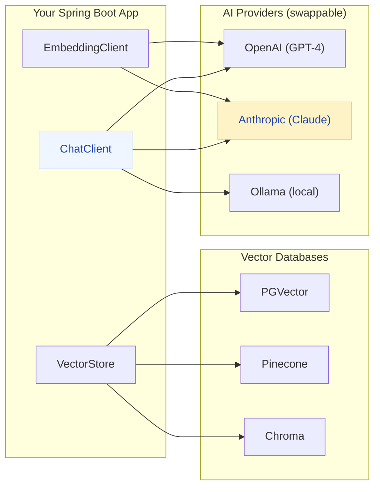
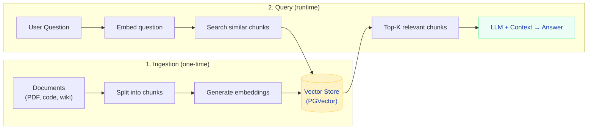

# Spring AI — Build AI-Powered Applications

> **Integrate LLMs, embeddings, vector databases, and AI agents into Spring Boot with the same familiar programming model you already know.**

---

!!! abstract "Real-World Analogy"
    Spring AI does for AI what Spring Data JPA did for databases. Instead of manually crafting HTTP calls to OpenAI, managing token limits, parsing JSON responses, and implementing retry logic — you get a clean abstraction: inject a `ChatClient`, call `.prompt("...")`, and get a response. Switch from OpenAI to Anthropic by changing one property.



---

## Getting Started

### Dependencies

```xml
<!-- Spring AI BOM -->
<dependencyManagement>
    <dependencies>
        <dependency>
            <groupId>org.springframework.ai</groupId>
            <artifactId>spring-ai-bom</artifactId>
            <version>1.0.0</version>
            <type>pom</type>
            <scope>import</scope>
        </dependency>
    </dependencies>
</dependencyManagement>

<!-- Choose your provider -->
<dependency>
    <groupId>org.springframework.ai</groupId>
    <artifactId>spring-ai-openai-spring-boot-starter</artifactId>
</dependency>
<!-- OR -->
<dependency>
    <groupId>org.springframework.ai</groupId>
    <artifactId>spring-ai-anthropic-spring-boot-starter</artifactId>
</dependency>
```

### Configuration

```yaml
spring:
  ai:
    openai:
      api-key: ${OPENAI_API_KEY}
      chat:
        options:
          model: gpt-4o
          temperature: 0.7
          max-tokens: 2000
    # OR Anthropic
    anthropic:
      api-key: ${ANTHROPIC_API_KEY}
      chat:
        options:
          model: claude-sonnet-4-20250514
          max-tokens: 4096
```

---

## ChatClient — Conversational AI

### Basic Usage

```java
@RestController
@RequiredArgsConstructor
public class AIChatController {

    private final ChatClient chatClient;

    @GetMapping("/ai/chat")
    public String chat(@RequestParam String message) {
        return chatClient.prompt()
            .user(message)
            .call()
            .content();
    }
}
```

### System Prompts & Context

```java
@Service
public class CodeReviewService {

    private final ChatClient chatClient;

    public CodeReviewResponse reviewCode(String code, String language) {
        return chatClient.prompt()
            .system("""
                You are a senior {language} code reviewer. 
                Focus on: security vulnerabilities, performance issues, 
                and adherence to SOLID principles.
                Respond in JSON format with fields: issues[], suggestions[], score (1-10).
                """)
            .user("Review this code:\n```%s\n%s\n```".formatted(language, code))
            .call()
            .entity(CodeReviewResponse.class);  // auto-maps JSON to Java object!
    }
}
```

### Streaming Responses

```java
@GetMapping(value = "/ai/stream", produces = MediaType.TEXT_EVENT_STREAM_VALUE)
public Flux<String> streamChat(@RequestParam String message) {
    return chatClient.prompt()
        .user(message)
        .stream()
        .content();  // tokens streamed as they're generated
}
```

---

## RAG — Retrieval Augmented Generation

The killer pattern: give the AI context from YOUR data (docs, code, databases) so it answers accurately instead of hallucinating.



### Implementation

```java
@Service
@RequiredArgsConstructor
public class DocumentQAService {

    private final ChatClient chatClient;
    private final VectorStore vectorStore;

    // Ingest documents (run once or on upload)
    public void ingestDocuments(List<Document> documents) {
        // Spring AI handles chunking + embedding + storage
        vectorStore.add(documents);
    }

    // Answer questions using your documents
    public String askQuestion(String question) {
        // 1. Find relevant documents
        List<Document> relevant = vectorStore.similaritySearch(
            SearchRequest.query(question).withTopK(5)
        );

        // 2. Build context from retrieved docs
        String context = relevant.stream()
            .map(Document::getContent)
            .collect(Collectors.joining("\n\n"));

        // 3. Ask LLM with context
        return chatClient.prompt()
            .system("""
                Answer the user's question based ONLY on the provided context.
                If the context doesn't contain the answer, say "I don't know."
                
                Context:
                {context}
                """)
            .user(question)
            .call()
            .content();
    }
}
```

### Vector Store Configuration (PGVector)

```yaml
spring:
  ai:
    vectorstore:
      pgvector:
        index-type: HNSW
        distance-type: COSINE_DISTANCE
        dimensions: 1536          # matches OpenAI embedding dimensions
  datasource:
    url: jdbc:postgresql://localhost:5432/myapp
```

---

## Function Calling — AI That Takes Actions

Let the AI call YOUR Java methods when it needs to perform actions.

```java
// Define functions the AI can call
@Configuration
public class AIFunctionConfig {

    @Bean
    @Description("Get the current weather for a city")
    public Function<WeatherRequest, WeatherResponse> getWeather() {
        return request -> weatherService.getWeather(request.city());
    }

    @Bean
    @Description("Search the product catalog by keyword and category")
    public Function<ProductSearchRequest, List<Product>> searchProducts() {
        return request -> productService.search(request.keyword(), request.category());
    }

    @Bean
    @Description("Place an order for a customer")
    public Function<OrderRequest, OrderConfirmation> placeOrder() {
        return request -> orderService.create(request);
    }
}
```

```java
// The AI decides WHEN to call functions based on user intent
@GetMapping("/ai/assistant")
public String assistant(@RequestParam String message) {
    return chatClient.prompt()
        .user(message)
        .functions("getWeather", "searchProducts", "placeOrder")
        .call()
        .content();
}

// User: "What's the weather in NYC and find me a rain jacket under $50"
// AI calls: getWeather("NYC") → searchProducts("rain jacket", "outerwear")
// AI responds: "It's 45°F and rainy in NYC. Here are rain jackets under $50: ..."
```

---

## AI Agents with Spring AI

Autonomous agents that plan, reason, and execute multi-step tasks.

```java
@Service
public class CustomerSupportAgent {

    private final ChatClient chatClient;
    private final OrderRepository orderRepo;
    private final RefundService refundService;

    public String handleTicket(String customerMessage, String customerId) {
        return chatClient.prompt()
            .system("""
                You are a customer support agent for an e-commerce platform.
                You can look up orders, initiate refunds, and escalate issues.
                Be empathetic and concise. Follow company policy.
                Customer ID: {customerId}
                """)
            .user(customerMessage)
            .functions("lookupOrder", "initiateRefund", "escalateToHuman")
            .advisors(new MessageChatMemoryAdvisor(chatMemory))  // conversation memory
            .call()
            .content();
    }
}
```

---

## Structured Output — Type-Safe AI Responses

```java
// Define your response type
public record SentimentAnalysis(
    String sentiment,       // "positive", "negative", "neutral"
    double confidence,      // 0.0 - 1.0
    List<String> keywords,  // extracted keywords
    String summary          // one-line summary
) {}

// Get structured, type-safe output
@GetMapping("/ai/analyze")
public SentimentAnalysis analyzeSentiment(@RequestParam String review) {
    return chatClient.prompt()
        .user("Analyze the sentiment of this review: " + review)
        .call()
        .entity(SentimentAnalysis.class);  // auto-maps to Java record!
}
```

---

## Provider Comparison

| Feature | OpenAI | Anthropic (Claude) | Ollama (Local) |
|---------|--------|-------------------|----------------|
| Best model | GPT-4o | Claude Opus 4 | Llama 3, Mistral |
| Streaming | Yes | Yes | Yes |
| Function calling | Yes | Yes | Model-dependent |
| Vision (images) | Yes | Yes | Some models |
| Embeddings | Yes | No (use separate) | Yes |
| Cost | $$$ | $$$ | Free (your hardware) |
| Privacy | Cloud | Cloud | Fully local |
| Spring AI support | Full | Full | Full |

---

## Interview Questions

??? question "What is RAG and why would you use it over fine-tuning?"

    **Answer:** RAG (Retrieval Augmented Generation) gives the AI relevant context from your documents at query time, without modifying the model. Fine-tuning permanently alters the model's weights.

    **Use RAG when:** Your data changes frequently, you need citations/sources, you want to control what the AI knows, or you have a small dataset.
    
    **Use fine-tuning when:** You need the AI to learn a specific style/format, perform a specialized task the base model struggles with, or you need faster inference (no retrieval step).

??? question "How does Spring AI handle provider switching?"

    **Answer:** Spring AI uses a common `ChatClient` interface. Switching providers means changing the starter dependency and configuration properties — your application code doesn't change. This is the same abstraction pattern as Spring Data (switch from PostgreSQL to MongoDB by changing the driver, not the repository code).

??? question "What are the security concerns with function calling?"

    **Answer:** The AI decides WHICH functions to call and with WHAT arguments based on user input. Risks:
    
    - **Prompt injection** — malicious user input tricks the AI into calling destructive functions
    - **Over-permissioning** — giving the AI access to functions it shouldn't have
    - **Input validation** — the AI may pass unexpected arguments
    
    **Mitigations:** Validate all function inputs, use least-privilege (only expose safe functions), implement approval workflows for destructive actions, and log all function calls.
