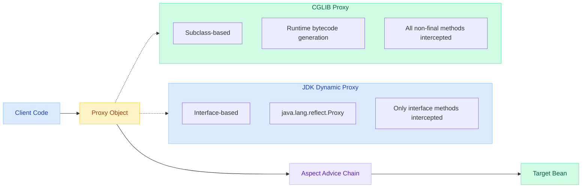
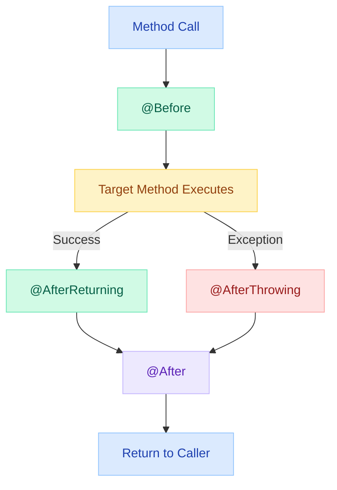
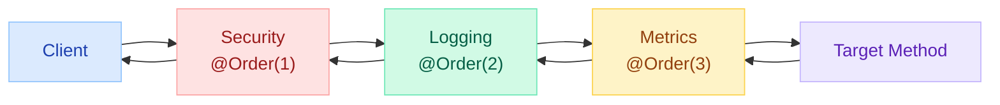
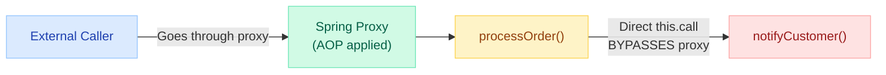

# Spring AOP Deep Dive — Pointcuts, Advice & Proxy Mechanics

> **Production Incident:** A team added `@Transactional` to a method called internally within the same class. Transactions silently stopped working. No errors, no logs — just data corruption discovered 3 days later. Understanding proxy mechanics would have prevented this.

---

!!! abstract "Why This Matters"
    Spring AOP is the engine behind `@Transactional`, `@Cacheable`, `@Async`, `@Secured`, and custom cross-cutting concerns. Every senior Java engineer must understand how proxies intercept calls and where they silently fail.

---

## Proxy Types: JDK Dynamic Proxy vs CGLIB

Spring AOP creates proxies to intercept method calls. The proxy type determines what can be advised.



| Feature | JDK Dynamic Proxy | CGLIB Proxy |
|---|---|---|
| **Mechanism** | Implements target's interfaces | Generates subclass of target |
| **Requirement** | Target must implement an interface | Target class must not be `final` |
| **Performance** | Slightly faster for interface calls | Slightly slower (bytecode generation at startup) |
| **Limitation** | Cannot proxy non-interface methods | Cannot proxy `final` methods or `final` classes |
| **Spring Boot Default** | Used when target has interface & `proxyTargetClass=false` | **Default since Spring Boot 2.x** (`proxyTargetClass=true`) |
| **Package** | `java.lang.reflect.Proxy` | `org.springframework.cglib` |

### Forcing Proxy Type

```java
// Force CGLIB (default in Spring Boot)
@EnableAspectJAutoProxy(proxyTargetClass = true)

// Force JDK dynamic proxy (interface-based only)
@EnableAspectJAutoProxy(proxyTargetClass = false)
```

### Checking Proxy Type at Runtime

```java
@Autowired
private OrderService orderService;

public void checkProxy() {
    System.out.println(orderService.getClass().getName());
    // com.app.service.OrderService$$EnhancerBySpringCGLIB$$abc123

    System.out.println(AopUtils.isAopProxy(orderService));      // true
    System.out.println(AopUtils.isCglibProxy(orderService));    // true
    System.out.println(AopUtils.isJdkDynamicProxy(orderService)); // false
}
```

---

## Pointcut Expressions in Detail

Pointcut expressions define WHERE advice is applied. Spring AOP supports a subset of AspectJ pointcut designators.

### Pointcut Designator Reference

| Designator | Matches | Example |
|---|---|---|
| `execution` | Method execution (most common) | `execution(* com.app.service.*.*(..))` |
| `within` | All methods in a class/package | `within(com.app.service..*)` |
| `@annotation` | Methods with a specific annotation | `@annotation(com.app.Loggable)` |
| `@within` | All methods in annotated classes | `@within(org.springframework.stereotype.Service)` |
| `args` | Methods with specific argument types | `args(String, ..)` |
| `@args` | Methods whose arguments have annotations | `@args(com.app.Validated)` |
| `bean` | Specific Spring bean by name (Spring-only) | `bean(orderService)` |
| `this` | Proxy object type | `this(com.app.service.OrderService)` |
| `target` | Target object type | `target(com.app.service.OrderService)` |

### execution() Syntax Breakdown

```
execution(modifiers? return-type declaring-type?.method-name(params) throws?)
```



```mermaid
flowchart LR
    E["execution("] --> M["public"]
    M --> R["String"]
    R --> D["com.app.service.OrderService"]
    D --> N[".placeOrder"]
    N --> P["(OrderRequest, ..)"]
    P --> T[") throws OrderException"]

    style E fill:#DBEAFE,stroke:#93C5FD,color:#1E40AF
    style M fill:#D1FAE5,stroke:#6EE7B7,color:#065F46
    style R fill:#D1FAE5,stroke:#6EE7B7,color:#065F46
    style D fill:#FEF3C7,stroke:#FCD34D,color:#92400E
    style N fill:#EDE9FE,stroke:#C4B5FD,color:#5B21B6
    style P fill:#FEE2E2,stroke:#FCA5A5,color:#991B1B
    style T fill:#FEE2E2,stroke:#FCA5A5,color:#991B1B
```

### Common Pointcut Patterns

```java
@Aspect
@Component
public class PointcutLibrary {

    // All public methods in service package
    @Pointcut("execution(public * com.app.service.*.*(..))")
    public void allServiceMethods() {}

    // All methods in any class annotated with @Service
    @Pointcut("within(@org.springframework.stereotype.Service *)")
    public void withinServiceClasses() {}

    // Methods annotated with custom @Loggable
    @Pointcut("@annotation(com.app.annotation.Loggable)")
    public void loggableMethods() {}

    // Methods with first argument of type Long
    @Pointcut("execution(* com.app..*(Long, ..))")
    public void methodsWithLongFirstArg() {}

    // All repository methods (by bean naming)
    @Pointcut("bean(*Repository)")
    public void repositoryBeans() {}

    // Combine pointcuts with logical operators
    @Pointcut("allServiceMethods() && !loggableMethods()")
    public void serviceMethodsExceptLoggable() {}

    // All methods in a subpackage (recursive)
    @Pointcut("within(com.app..*)")
    public void withinApp() {}
}
```

### Wildcard Reference

| Pattern | Meaning |
|---|---|
| `*` | Any single element (return type, class, method name) |
| `..` | Any number of elements (subpackages or parameters) |
| `+` | Any subclass of a type |

---

## All Advice Types with Code

### @Before — Execute Before Target Method

```java
@Aspect
@Component
public class ValidationAspect {

    @Before("execution(* com.app.service.*.create*(..)) && args(request,..)")
    public void validateInput(JoinPoint jp, Object request) {
        if (request == null) {
            throw new IllegalArgumentException(
                "Null request for: " + jp.getSignature().getName());
        }
        log.info("Validated input for {}", jp.getSignature().toShortString());
    }
}
```

### @AfterReturning — Execute After Successful Return

```java
@Aspect
@Component
public class AuditAspect {

    @AfterReturning(
        pointcut = "execution(* com.app.service.PaymentService.process*(..))",
        returning = "result"
    )
    public void auditPayment(JoinPoint jp, PaymentResult result) {
        auditService.log(
            jp.getSignature().getName(),
            result.getTransactionId(),
            result.getAmount()
        );
    }
}
```

### @AfterThrowing — Execute on Exception

```java
@Aspect
@Component
public class ExceptionMonitoringAspect {

    @AfterThrowing(
        pointcut = "within(com.app.service..*)",
        throwing = "ex"
    )
    public void monitorExceptions(JoinPoint jp, Exception ex) {
        log.error("Exception in {}: {}",
            jp.getSignature().toShortString(), ex.getMessage());
        metricsService.incrementCounter("service.exceptions",
            "method", jp.getSignature().getName(),
            "exception", ex.getClass().getSimpleName());
    }
}
```

### @After — Execute Always (Like Finally)

```java
@Aspect
@Component
public class ResourceCleanupAspect {

    @After("execution(* com.app.service.FileService.*(..))")
    public void cleanupResources(JoinPoint jp) {
        MDC.remove("operationId");
        TempFileHolder.clear();
        log.debug("Cleaned up after {}", jp.getSignature().getName());
    }
}
```

### @Around — Full Control (Most Powerful)

```java
@Aspect
@Component
public class PerformanceAspect {

    @Around("@annotation(com.app.annotation.Timed)")
    public Object measureExecutionTime(ProceedingJoinPoint pjp) throws Throwable {
        String methodName = pjp.getSignature().toShortString();
        long start = System.nanoTime();

        try {
            Object result = pjp.proceed(); // Execute target method
            return result;
        } catch (Exception e) {
            log.error("Exception in {}: {}", methodName, e.getMessage());
            throw e;
        } finally {
            long duration = (System.nanoTime() - start) / 1_000_000;
            log.info("{} executed in {} ms", methodName, duration);
            meterRegistry.timer("method.execution",
                "method", methodName).record(duration, TimeUnit.MILLISECONDS);
        }
    }
}
```

### Advice Execution Order



---

## Aspect Ordering with @Order

When multiple aspects apply to the same join point, use `@Order` to control execution order.

```java
@Aspect
@Component
@Order(1) // Executes FIRST (outermost)
public class SecurityAspect {
    @Before("execution(* com.app.service.*.*(..))")
    public void checkSecurity(JoinPoint jp) {
        // Security check runs first
    }
}

@Aspect
@Component
@Order(2) // Executes SECOND
public class LoggingAspect {
    @Before("execution(* com.app.service.*.*(..))")
    public void logEntry(JoinPoint jp) {
        // Logging runs after security
    }
}

@Aspect
@Component
@Order(3) // Executes THIRD (innermost)
public class MetricsAspect {
    @Around("execution(* com.app.service.*.*(..))")
    public Object recordMetrics(ProceedingJoinPoint pjp) throws Throwable {
        // Metrics wraps closest to target
        return pjp.proceed();
    }
}
```



!!! warning "Order Rules"
    - Lower `@Order` value = higher priority (executes first on entry, last on exit)
    - `@Before` advice: lower order runs first
    - `@After`/`@AfterReturning` advice: lower order runs LAST
    - `@Around` advice: lower order wraps outermost

---

## The Self-Invocation Problem

!!! danger "Critical Interview Topic"
    This is the #1 AOP pitfall in Spring. Internal method calls bypass the proxy entirely.

### The Problem

```java
@Service
public class OrderService {

    @Transactional
    public void processOrder(Order order) {
        // Called from outside -- PROXY intercepts, transaction works
        saveOrder(order);
        notifyCustomer(order); // Internal call -- bypasses proxy!
    }

    @Transactional(propagation = Propagation.REQUIRES_NEW)
    public void notifyCustomer(Order order) {
        // This @Transactional is IGNORED when called internally!
        emailService.send(order.getCustomerEmail(), "Order confirmed");
    }
}
```

### Why It Happens



When `processOrder()` calls `this.notifyCustomer()`, it invokes the method directly on the target object, not through the proxy. The proxy never sees the internal call.

### Solutions

=== "Solution 1: Self-Injection"

    ```java
    @Service
    public class OrderService {

        @Autowired
        private OrderService self; // Inject proxy of itself

        @Transactional
        public void processOrder(Order order) {
            saveOrder(order);
            self.notifyCustomer(order); // Goes through proxy!
        }

        @Transactional(propagation = Propagation.REQUIRES_NEW)
        public void notifyCustomer(Order order) {
            emailService.send(order.getCustomerEmail(), "Order confirmed");
        }
    }
    ```

=== "Solution 2: ApplicationContext"

    ```java
    @Service
    public class OrderService implements ApplicationContextAware {

        private ApplicationContext ctx;

        @Override
        public void setApplicationContext(ApplicationContext ctx) {
            this.ctx = ctx;
        }

        @Transactional
        public void processOrder(Order order) {
            saveOrder(order);
            ctx.getBean(OrderService.class).notifyCustomer(order);
        }
    }
    ```

=== "Solution 3: Separate Service (Recommended)"

    ```java
    @Service
    public class OrderService {

        @Autowired
        private NotificationService notificationService;

        @Transactional
        public void processOrder(Order order) {
            saveOrder(order);
            notificationService.notifyCustomer(order); // Different bean
        }
    }

    @Service
    public class NotificationService {

        @Transactional(propagation = Propagation.REQUIRES_NEW)
        public void notifyCustomer(Order order) {
            emailService.send(order.getCustomerEmail(), "Order confirmed");
        }
    }
    ```

---

## Performance Implications

| Concern | Impact | Mitigation |
|---|---|---|
| Proxy creation overhead | One-time cost at startup | Negligible for most apps |
| Method interception | ~1-3 microseconds per call | Avoid on tight loops |
| Reflection in JoinPoint | `getArgs()` boxes primitives | Cache results if called repeatedly |
| CGLIB subclass generation | Increases metaspace usage | Monitor with `-XX:MaxMetaspaceSize` |
| Complex pointcut evaluation | Evaluated on every call | Use narrow pointcuts, avoid `within(..)` on large packages |

### Benchmarks (Approximate)

```
Direct method call:     ~2 ns
CGLIB proxy call:       ~50 ns (no advice)
CGLIB + @Before:        ~200 ns
CGLIB + @Around:        ~300 ns
CGLIB + 3 aspects:      ~800 ns
```

!!! tip "Performance Best Practice"
    For hot paths (called millions of times/second), consider direct code over AOP. For service-layer methods (called hundreds of times/second), AOP overhead is negligible.

---

## Real-World Use Cases

### 1. Retry Logic with @Around

```java
@Aspect
@Component
public class RetryAspect {

    @Around("@annotation(retryable)")
    public Object retry(ProceedingJoinPoint pjp, Retryable retryable) throws Throwable {
        int attempts = 0;
        Exception lastException = null;

        while (attempts < retryable.maxAttempts()) {
            try {
                return pjp.proceed();
            } catch (Exception e) {
                lastException = e;
                attempts++;
                if (attempts < retryable.maxAttempts()) {
                    Thread.sleep(retryable.backoffMs() * attempts);
                    log.warn("Retry attempt {} for {}",
                        attempts, pjp.getSignature().toShortString());
                }
            }
        }
        throw lastException;
    }
}

@Target(ElementType.METHOD)
@Retention(RetentionPolicy.RUNTIME)
public @interface Retryable {
    int maxAttempts() default 3;
    long backoffMs() default 1000;
}

// Usage
@Retryable(maxAttempts = 3, backoffMs = 500)
public ExternalResponse callExternalApi(String payload) {
    return restClient.post(payload);
}
```

### 2. Rate Limiting

```java
@Aspect
@Component
public class RateLimitAspect {

    private final Map<String, RateLimiter> limiters = new ConcurrentHashMap<>();

    @Around("@annotation(rateLimit)")
    public Object enforceRateLimit(ProceedingJoinPoint pjp, RateLimit rateLimit)
            throws Throwable {
        String key = pjp.getSignature().toShortString();
        RateLimiter limiter = limiters.computeIfAbsent(key,
            k -> RateLimiter.create(rateLimit.permitsPerSecond()));

        if (!limiter.tryAcquire(rateLimit.timeoutMs(), TimeUnit.MILLISECONDS)) {
            throw new RateLimitExceededException("Rate limit exceeded for " + key);
        }
        return pjp.proceed();
    }
}
```

### 3. Method-Level Caching with Custom Key

```java
@Aspect
@Component
public class CacheAspect {

    @Around("@annotation(cached)")
    public Object cache(ProceedingJoinPoint pjp, Cached cached) throws Throwable {
        String key = buildCacheKey(pjp, cached.keyExpression());
        Object cachedValue = cacheManager.get(cached.cacheName(), key);

        if (cachedValue != null) {
            log.debug("Cache hit: {} -> {}", cached.cacheName(), key);
            return cachedValue;
        }

        Object result = pjp.proceed();
        cacheManager.put(cached.cacheName(), key, result, cached.ttlSeconds());
        return result;
    }
}
```

### 4. Distributed Tracing Context Propagation

```java
@Aspect
@Component
@Order(0)
public class TracingAspect {

    @Around("within(com.app.service..*)")
    public Object propagateTrace(ProceedingJoinPoint pjp) throws Throwable {
        Span span = tracer.nextSpan()
            .name(pjp.getSignature().toShortString())
            .start();

        try (Tracer.SpanInScope ws = tracer.withSpanInScope(span)) {
            return pjp.proceed();
        } catch (Exception e) {
            span.error(e);
            throw e;
        } finally {
            span.end();
        }
    }
}
```

---

## Common Pitfalls

| Pitfall | Symptom | Fix |
|---|---|---|
| Self-invocation | `@Transactional`/`@Cacheable` silently ignored | Inject self or use separate beans |
| Private methods | Advice never fires | AOP only works on public/protected methods (CGLIB) |
| Final methods/classes | Advice never fires with CGLIB | Remove `final` or use JDK proxy with interfaces |
| Wrong pointcut | Advice doesn't match | Test with `@Before` first; use IDE pointcut testing |
| Missing `@Component` on Aspect | Aspect not registered | Add `@Component` or define as `@Bean` |
| `proceed()` not called in `@Around` | Target method never executes | Always call `pjp.proceed()` unless intentionally blocking |
| Advice on non-Spring beans | No proxy created | Only Spring-managed beans get proxied |
| Late advice registration | Aspect applied after bean creation | Ensure aspect is in component-scanned package |

---

## Interview Questions

??? question "Q: What is the difference between JDK Dynamic Proxy and CGLIB proxy in Spring AOP?"
    **JDK Dynamic Proxy** creates a proxy that implements the same interfaces as the target. It uses `java.lang.reflect.Proxy` and `InvocationHandler`. It can only proxy interface methods.

    **CGLIB proxy** generates a runtime subclass of the target class using bytecode generation. It can proxy any non-final method, even without interfaces. Spring Boot 2.x+ defaults to CGLIB.

    Key difference: JDK proxy requires an interface; CGLIB does not. CGLIB cannot proxy final methods/classes. JDK proxy is slightly faster for interface-based calls; CGLIB is more flexible.

??? question "Q: Why does @Transactional not work when a method calls another @Transactional method in the same class?"
    This is the self-invocation problem. Spring AOP is proxy-based. When method A in a bean calls method B in the same bean, the call goes through `this` reference (the actual object), not through the proxy. Since the proxy never intercepts the call, no AOP advice (including `@Transactional`) is applied.

    Solutions: (1) Inject the bean into itself (`@Autowired private MyService self`), (2) Use `ApplicationContext.getBean()`, (3) Extract the method to a separate bean (recommended for clean design).

??? question "Q: Explain the execution order when multiple @Around aspects are applied to the same method."
    Multiple aspects execute in an onion/layered fashion. The aspect with the lowest `@Order` value wraps outermost. For `@Around`:

    1. Outermost `@Around` (lowest order) enters first
    2. Calls `proceed()` which enters the next aspect
    3. Innermost aspect calls `proceed()` which invokes the target
    4. Target returns, innermost aspect completes
    5. Outermost aspect completes last

    Think of it like nested function calls or middleware layers.

??? question "Q: What pointcut expression would you use to intercept all public methods in classes annotated with @Service that take a String as the first argument?"
    ```java
    @Pointcut("execution(public * *(String, ..)) && @within(org.springframework.stereotype.Service)")
    ```
    Or equivalently:
    ```java
    @Pointcut("within(@org.springframework.stereotype.Service *) && execution(public * *(String, ..))")
    ```

??? question "Q: How would you implement a custom annotation that measures and logs method execution time?"
    1. Create annotation: `@Target(METHOD) @Retention(RUNTIME) public @interface Timed {}`
    2. Create aspect with `@Around("@annotation(com.app.Timed)")` advice
    3. In the advice: record `System.nanoTime()` before `proceed()`, compute duration after, log it
    4. The aspect must be `@Component` and Spring must scan it
    5. Limitation: only works on Spring-managed bean methods called externally (not self-invocation)

---

## Quick Recall

| Concept | Key Point |
|---|---|
| **Default Proxy (Boot 2.x+)** | CGLIB (subclass-based) |
| **JDK Proxy requirement** | Target must implement interface |
| **Most common pointcut** | `execution(* com.app.service.*.*(..))` |
| **Most powerful advice** | `@Around` (controls proceed/return/throw) |
| **Self-invocation fix** | Inject self, or extract to separate bean |
| **@Order direction** | Lower value = outermost (executes first) |
| **Cannot proxy** | `final` methods, `final` classes, `private` methods |
| **Performance overhead** | ~200-800 ns per advised call (negligible for services) |
| **Weaving type** | Runtime (proxy-based) — not compile-time like full AspectJ |

---

## See Also

- [Spring AOP Basics](aop.md) — Introduction to AOP concepts
- [Filters vs Interceptors vs AOP](filters-interceptors-aop.md) — Choosing the right interception layer
- [Transactions](transactions.md) — How `@Transactional` relies on AOP proxies
- [Bean Lifecycle & Scopes](bean-lifecycle.md) — Understanding when proxies are created
- [Design Patterns in Spring](design-patterns.md) — Proxy pattern and other patterns used internally
