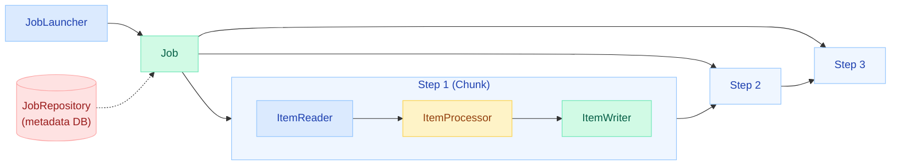
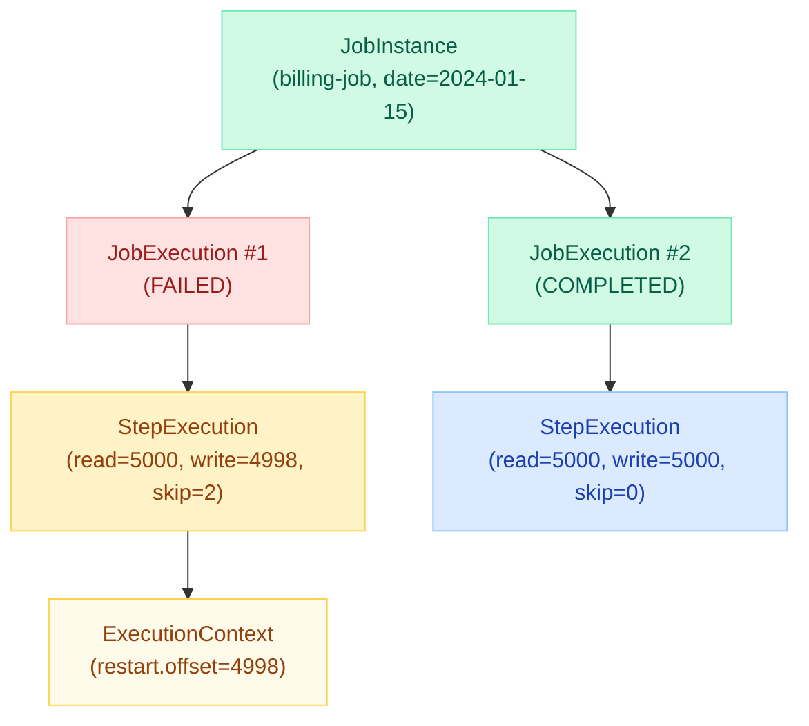
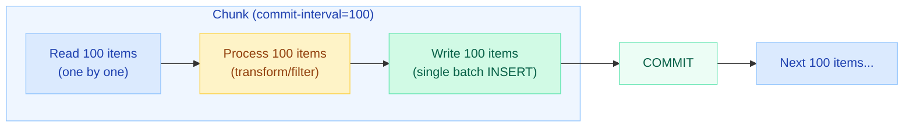
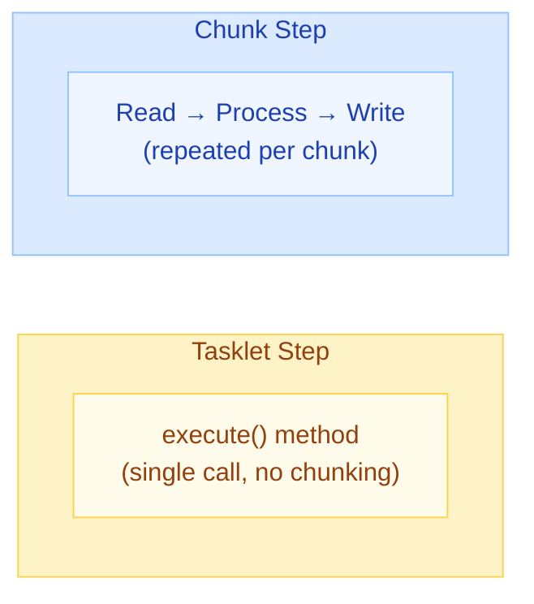
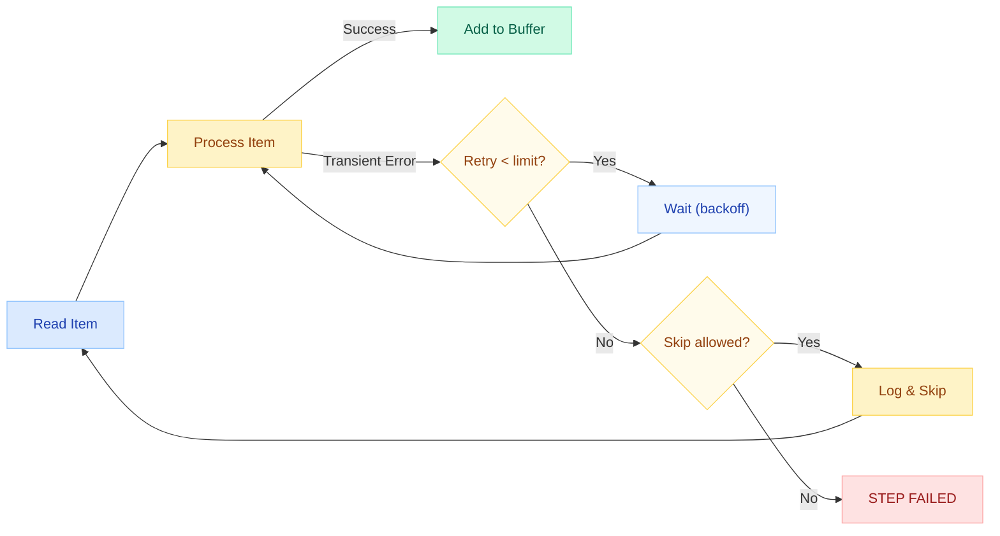
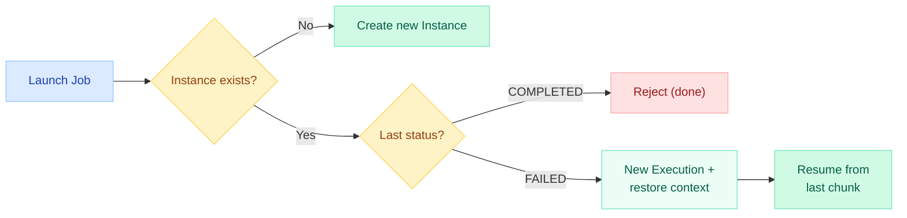
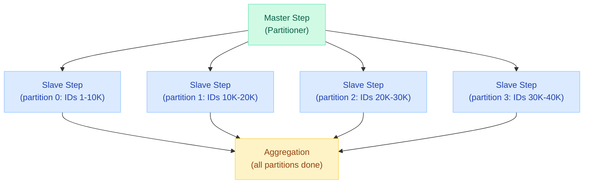

# Spring Batch

> **Enterprise-grade batch processing framework — handles restart, retry, skip, and chunk-based transactions for millions of records.**

---

!!! danger "Real Incident: Billing System Processing 10M Records Nightly"
    A billing team had a nightly job processing 10 million invoice records. Without Spring Batch, a failure at record 7M meant re-processing all 10M from scratch — taking 6+ hours and missing SLA windows. After adopting Spring Batch with chunk-oriented processing, the job restarts from the exact failed chunk. Skip policies handle poison records, retry handles transient DB timeouts, and the job completes within the 4-hour window every night.



---

## Core Concepts

| Concept | Description |
|---------|-------------|
| **Job** | A complete batch process (e.g., "nightly billing"). Contains one or more Steps. |
| **Step** | A single phase within a Job. Can be chunk-oriented or a Tasklet. |
| **JobInstance** | A logical run of a Job (identified by Job name + JobParameters). |
| **JobExecution** | A single attempt to run a JobInstance. A failed instance can have multiple executions. |
| **StepExecution** | A single attempt to run a Step. Tracks read/write/skip counts. |
| **ExecutionContext** | Key-value store for persisting state between restarts (step-level or job-level). |
| **JobRepository** | Persists all metadata (executions, statuses, context) to a database for restart/recovery. |
| **JobLauncher** | Entry point to start a Job with given parameters. |



---

## Chunk-Oriented Processing

The core processing model. Reads items one at a time, processes them, then writes in **chunks** (batches). Each chunk = one transaction.



### Configuration

```java
@Bean
public Step invoiceStep(JobRepository jobRepository,
                        PlatformTransactionManager txManager) {
    return new StepBuilder("invoiceStep", jobRepository)
        .<RawInvoice, ProcessedInvoice>chunk(100, txManager)  // commit-interval = 100
        .reader(invoiceReader())
        .processor(invoiceProcessor())
        .writer(invoiceWriter())
        .faultTolerant()
        .skipLimit(10)
        .skip(InvalidRecordException.class)
        .retryLimit(3)
        .retry(TransientDataAccessException.class)
        .build();
}
```

**Key Parameters:**

| Parameter | Purpose | Example |
|-----------|---------|---------|
| `chunk(size)` | Items per transaction (commit-interval) | `chunk(100)` |
| `skipLimit` | Max items to skip before failing | `skipLimit(10)` |
| `retryLimit` | Max retries per item | `retryLimit(3)` |
| `processorNonTransactional()` | Don't re-process on retry (use cached result) | For expensive processing |

---

## Tasklet vs Chunk Step



| Aspect | Tasklet | Chunk-Oriented |
|--------|---------|----------------|
| **Use case** | Simple one-shot tasks (cleanup, archival, file move) | Processing large datasets item-by-item |
| **Transaction** | Single transaction for entire step | One transaction per chunk |
| **Restartability** | You manage state manually | Framework tracks offset automatically |
| **Interface** | `Tasklet.execute(StepContribution, ChunkContext)` | `ItemReader<T>`, `ItemProcessor<I,O>`, `ItemWriter<O>` |
| **Return** | `RepeatStatus.FINISHED` or `CONTINUABLE` | Ends when reader returns `null` |

### Tasklet Example

```java
@Bean
public Step cleanupStep(JobRepository jobRepository,
                        PlatformTransactionManager txManager) {
    return new StepBuilder("cleanupStep", jobRepository)
        .tasklet((contribution, chunkContext) -> {
            // Delete temp files older than 7 days
            FileUtils.cleanDirectory(tempDir);
            return RepeatStatus.FINISHED;
        }, txManager)
        .build();
}
```

---

## Built-in ItemReaders

### FlatFileItemReader (CSV/Fixed-Width)

```java
@Bean
public FlatFileItemReader<Invoice> csvReader() {
    return new FlatFileItemReaderBuilder<Invoice>()
        .name("invoiceCsvReader")
        .resource(new ClassPathResource("invoices.csv"))
        .delimited()
        .names("id", "customerId", "amount", "dueDate")
        .targetType(Invoice.class)
        .linesToSkip(1)  // skip header
        .build();
}
```

### JdbcCursorItemReader (Streaming from DB)

```java
@Bean
public JdbcCursorItemReader<Invoice> cursorReader(DataSource dataSource) {
    return new JdbcCursorItemReaderBuilder<Invoice>()
        .name("invoiceCursorReader")
        .dataSource(dataSource)
        .sql("SELECT id, customer_id, amount, status FROM invoices WHERE status = 'PENDING'")
        .rowMapper(new BeanPropertyRowMapper<>(Invoice.class))
        .fetchSize(500)       // JDBC fetch size (not chunk size)
        .saveState(true)      // persist cursor position for restart
        .build();
}
```

### JpaPagingItemReader (Paginated JPA Queries)

```java
@Bean
public JpaPagingItemReader<Invoice> jpaPagingReader(EntityManagerFactory emf) {
    return new JpaPagingItemReaderBuilder<Invoice>()
        .name("invoiceJpaReader")
        .entityManagerFactory(emf)
        .queryString("SELECT i FROM Invoice i WHERE i.status = :status")
        .parameterValues(Map.of("status", "PENDING"))
        .pageSize(200)        // items per page (usually = chunk size)
        .saveState(true)
        .build();
}
```

| Reader | Best For | Tradeoff |
|--------|----------|----------|
| **FlatFileItemReader** | CSV/TSV/fixed-width files | Fast but limited to file sources |
| **JdbcCursorItemReader** | Large DB result sets | Holds DB cursor open (connection tied up) |
| **JpaPagingItemReader** | JPA entities with pagination | No open cursor; offset-based (can miss rows if data changes) |
| **StaxEventItemReader** | XML files | SAX-based streaming, low memory |
| **JsonItemReader** | JSON arrays | Jackson-based streaming |
| **KafkaItemReader** | Kafka topic partitions | Reads from specific offsets |

---

## Built-in ItemWriters

### FlatFileItemWriter (CSV Output)

```java
@Bean
public FlatFileItemWriter<ProcessedInvoice> csvWriter() {
    return new FlatFileItemWriterBuilder<ProcessedInvoice>()
        .name("invoiceCsvWriter")
        .resource(new FileSystemResource("output/processed-invoices.csv"))
        .delimited()
        .names("id", "customerId", "amount", "processedDate")
        .headerCallback(writer -> writer.write("ID,Customer,Amount,Processed"))
        .build();
}
```

### JdbcBatchItemWriter (Bulk JDBC Inserts)

```java
@Bean
public JdbcBatchItemWriter<ProcessedInvoice> jdbcWriter(DataSource dataSource) {
    return new JdbcBatchItemWriterBuilder<ProcessedInvoice>()
        .dataSource(dataSource)
        .sql("INSERT INTO processed_invoices (id, customer_id, amount, status) " +
             "VALUES (:id, :customerId, :amount, :status)")
        .beanMapped()         // uses BeanPropertySqlParameterSource
        .assertUpdates(true)  // fail if expected row count doesn't match
        .build();
}
```

### JpaItemWriter (JPA Persistence)

```java
@Bean
public JpaItemWriter<ProcessedInvoice> jpaWriter(EntityManagerFactory emf) {
    JpaItemWriter<ProcessedInvoice> writer = new JpaItemWriter<>();
    writer.setEntityManagerFactory(emf);
    writer.setUsePersist(true);  // persist vs merge
    return writer;
}
```

| Writer | Best For | Tradeoff |
|--------|----------|----------|
| **FlatFileItemWriter** | Generating CSV/TSV reports | Fast, no DB overhead |
| **JdbcBatchItemWriter** | Bulk inserts/updates | Fastest DB writes (batch SQL) |
| **JpaItemWriter** | When you need JPA lifecycle (listeners, cascades) | Slower than raw JDBC; entity management overhead |
| **CompositeItemWriter** | Writing to multiple destinations | Delegates to a list of writers |
| **KafkaItemWriter** | Publishing to Kafka | Converts items to Kafka messages |

---

## Skip and Retry Policies

### Skip Policy

Skips bad records instead of failing the entire job.

```java
@Bean
public Step resilientStep(JobRepository jobRepository,
                          PlatformTransactionManager txManager) {
    return new StepBuilder("resilientStep", jobRepository)
        .<Input, Output>chunk(100, txManager)
        .reader(reader())
        .processor(processor())
        .writer(writer())
        .faultTolerant()
        // Skip configuration
        .skipLimit(50)                              // max total skips
        .skip(ValidationException.class)            // skip this exception
        .skip(FlatFileParseException.class)
        .noSkip(DatabaseException.class)            // never skip this
        // Custom skip policy for complex logic
        .skipPolicy(new CustomSkipPolicy())
        .listener(new SkipListener<Input, Output>() {
            @Override
            public void onSkipInRead(Throwable t) {
                log.warn("Skipped record during read: {}", t.getMessage());
            }
            @Override
            public void onSkipInProcess(Input item, Throwable t) {
                log.warn("Skipped item {}: {}", item.getId(), t.getMessage());
                deadLetterService.save(item, t);
            }
        })
        .build();
}
```

### Retry Policy

Retries transient failures with configurable backoff.

```java
@Bean
public Step retryStep(JobRepository jobRepository,
                      PlatformTransactionManager txManager) {
    return new StepBuilder("retryStep", jobRepository)
        .<Input, Output>chunk(100, txManager)
        .reader(reader())
        .processor(processor())
        .writer(writer())
        .faultTolerant()
        // Retry configuration
        .retryLimit(3)
        .retry(TransientDataAccessException.class)
        .retry(OptimisticLockingFailureException.class)
        .noRetry(NonTransientDataAccessException.class)
        // Backoff policy
        .backOffPolicy(new ExponentialBackOffPolicy() {{
            setInitialInterval(1000);   // 1s
            setMultiplier(2.0);         // 1s → 2s → 4s
            setMaxInterval(10000);      // cap at 10s
        }})
        .listener(new RetryListener() {
            @Override
            public <T, E extends Throwable> void onError(
                    RetryContext context, RetryCallback<T, E> callback, Throwable t) {
                log.warn("Retry attempt #{} failed: {}",
                    context.getRetryCount(), t.getMessage());
            }
        })
        .build();
}
```



---

## Job Restart and Recovery

Spring Batch persists all execution state to the **JobRepository** (typically a relational database). This enables:

1. **Restart from failure point** — A failed job picks up where it left off
2. **Prevent duplicate runs** — Same JobInstance cannot run concurrently
3. **Audit trail** — Full history of all executions

### How Restart Works



### Configuration

```java
@Bean
public Job billingJob(JobRepository jobRepository, Step invoiceStep, Step reportStep) {
    return new JobBuilder("billingJob", jobRepository)
        .start(invoiceStep)
        .next(reportStep)
        .preventRestart()      // set to prevent restart (default: restartable)
        .incrementer(new RunIdIncrementer())  // allows re-running same params
        .listener(new JobExecutionListener() {
            @Override
            public void afterJob(JobExecution jobExecution) {
                if (jobExecution.getStatus() == BatchStatus.COMPLETED) {
                    notificationService.sendSuccess();
                }
            }
        })
        .build();
}
```

### JobRepository Schema (auto-created tables)

| Table | Purpose |
|-------|---------|
| `BATCH_JOB_INSTANCE` | One row per unique Job + parameters |
| `BATCH_JOB_EXECUTION` | One row per attempt (status, start/end time) |
| `BATCH_JOB_EXECUTION_PARAMS` | Parameters for each execution |
| `BATCH_STEP_EXECUTION` | Per-step metrics (read, write, skip, commit counts) |
| `BATCH_STEP_EXECUTION_CONTEXT` | Serialized state for restart |
| `BATCH_JOB_EXECUTION_CONTEXT` | Job-level serialized state |

---

## Partitioning for Parallel Processing

Split work across multiple threads/processes for horizontal scaling.



### Implementation

```java
// Partitioner — splits work into ranges
@Bean
public Partitioner invoicePartitioner(DataSource dataSource) {
    ColumnRangePartitioner partitioner = new ColumnRangePartitioner();
    partitioner.setColumn("id");
    partitioner.setTable("invoices");
    partitioner.setDataSource(dataSource);
    return partitioner;
}

// Master Step
@Bean
public Step masterStep(JobRepository jobRepository,
                       Step slaveStep,
                       Partitioner partitioner) {
    return new StepBuilder("masterStep", jobRepository)
        .partitioner("slaveStep", partitioner)
        .step(slaveStep)
        .gridSize(8)                          // number of partitions
        .taskExecutor(new SimpleAsyncTaskExecutor())  // parallel execution
        .build();
}

// Slave Step — each partition runs independently
@Bean
@StepScope
public JdbcCursorItemReader<Invoice> partitionedReader(
        @Value("#{stepExecutionContext['minValue']}") Long minId,
        @Value("#{stepExecutionContext['maxValue']}") Long maxId,
        DataSource dataSource) {
    return new JdbcCursorItemReaderBuilder<Invoice>()
        .name("partitionedReader")
        .dataSource(dataSource)
        .sql("SELECT * FROM invoices WHERE id BETWEEN ? AND ?")
        .preparedStatementSetter(ps -> {
            ps.setLong(1, minId);
            ps.setLong(2, maxId);
        })
        .rowMapper(new BeanPropertyRowMapper<>(Invoice.class))
        .build();
}
```

### Scaling Strategies Compared

| Strategy | How It Works | Best For |
|----------|-------------|----------|
| **Multi-threaded Step** | Multiple threads share one reader | Thread-safe readers only |
| **Partitioning** | Each partition has its own reader | Large datasets, DB range queries |
| **Remote Chunking** | Master reads, slaves process+write | CPU-intensive processing |
| **Remote Partitioning** | Partitions run on remote workers | Distributed across nodes |
| **AsyncItemProcessor** | Process items asynchronously | Slow I/O in processor |

---

## Scheduling: Triggering Batch Jobs

### @Scheduled Trigger

```java
@Component
@RequiredArgsConstructor
public class BatchScheduler {

    private final JobLauncher jobLauncher;
    private final Job billingJob;

    @Scheduled(cron = "0 0 2 * * *")  // Every day at 2 AM
    public void runBillingJob() throws Exception {
        JobParameters params = new JobParametersBuilder()
            .addLocalDate("runDate", LocalDate.now())
            .addLong("runId", System.currentTimeMillis())  // unique per run
            .toJobParameters();

        JobExecution execution = jobLauncher.run(billingJob, params);
        log.info("Job finished with status: {}", execution.getStatus());
    }
}
```

### Quartz Integration

```java
@Configuration
public class QuartzBatchConfig {

    @Bean
    public JobDetail billingJobDetail() {
        return JobBuilder.newJob(BatchJobLauncherDetail.class)
            .withIdentity("billingJob")
            .storeDurably()
            .usingJobData("jobName", "billingJob")
            .build();
    }

    @Bean
    public Trigger billingTrigger(JobDetail billingJobDetail) {
        return TriggerBuilder.newTrigger()
            .forJob(billingJobDetail)
            .withIdentity("billingTrigger")
            .withSchedule(CronScheduleBuilder
                .cronSchedule("0 0 2 * * ?")
                .withMisfireHandlingInstructionFireAndProceed())
            .build();
    }
}
```

| Approach | Pros | Cons |
|----------|------|------|
| `@Scheduled` | Simple, no extra deps | No persistence, no cluster-awareness |
| **Quartz** | Persistent, clustered, misfire handling | Extra complexity, needs DB tables |
| **Spring Cloud Task** | Cloud-native, short-lived containers | Requires Spring Cloud ecosystem |
| **Kubernetes CronJob** | Infrastructure-level scheduling | Less visibility into job internals |

---

## Spring Batch 5 Changes (Spring Boot 3)

### Key Migration Points

| Change | Spring Batch 4 | Spring Batch 5 |
|--------|----------------|----------------|
| **Namespace** | `javax.*` | `jakarta.*` |
| **Builder API** | `StepBuilderFactory`, `JobBuilderFactory` | Direct `StepBuilder`, `JobBuilder` (factories removed) |
| **Job Repository** | Auto-configured from `@EnableBatchProcessing` | Needs explicit `@EnableBatchProcessing` or Boot auto-config |
| **Transaction Manager** | Provided by `@EnableBatchProcessing` | Must pass to `chunk()` explicitly |
| **Default DB** | Required (H2 in dev) | Can use embedded in-memory (no DB required for simple jobs) |
| **Java version** | Java 8+ | Java 17+ |
| **Observation API** | Micrometer metrics only | Full Micrometer Observation (traces + metrics) |

### Spring Batch 5 Job Example

```java
@Configuration
@EnableBatchProcessing
public class BatchConfig {

    @Bean
    public Job billingJob(JobRepository jobRepository,
                          Step processStep,
                          Step cleanupStep) {
        return new JobBuilder("billingJob", jobRepository)
            .start(processStep)
            .next(cleanupStep)
            .build();
    }

    @Bean
    public Step processStep(JobRepository jobRepository,
                            PlatformTransactionManager transactionManager) {
        return new StepBuilder("processStep", jobRepository)
            .<Invoice, ProcessedInvoice>chunk(200, transactionManager)
            .reader(reader())
            .processor(processor())
            .writer(writer())
            .build();
    }
}
```

### application.yml for Spring Batch 5

```yaml
spring:
  batch:
    jdbc:
      initialize-schema: always   # create batch tables on startup
      table-prefix: BATCH_        # default prefix
    job:
      enabled: false              # don't auto-run on startup (use scheduler)
  datasource:
    url: jdbc:postgresql://localhost:5432/billing
    username: batch_user
    password: ${BATCH_DB_PASSWORD}
```

---

## Quick Recall

| Topic | Key Point |
|-------|-----------|
| Core unit | **Chunk** = read N items + process + write in one transaction |
| Restart | JobRepository persists ExecutionContext; resume from last committed chunk |
| Skip | `skipLimit(N)` + `.skip(Exception.class)` — bad records don't kill the job |
| Retry | `retryLimit(N)` + backoff — transient failures recover automatically |
| Scaling | Partitioning (data ranges) > Multi-threaded (shared reader) for large datasets |
| Tasklet vs Chunk | Tasklet = one-shot logic; Chunk = item-by-item pipeline |
| Spring Batch 5 | No more factory beans; pass `JobRepository` + `TransactionManager` explicitly |
| Scheduling | `@Scheduled` for simple; Quartz for clustered; K8s CronJob for cloud-native |
| State tracking | `BATCH_STEP_EXECUTION_CONTEXT` stores reader offsets for restart |
| Idempotency | Use `JobParameters` (e.g., date) to identify instances; same params = same instance |

---

## Interview Deep-Dive Template

??? tip "Tell me about Spring Batch architecture and how chunk-oriented processing works."
    **Architecture:** Spring Batch is built around Jobs containing Steps. Each Step has a reader-processor-writer pipeline. The JobRepository persists all execution metadata to a relational database, enabling restart and audit.

    **Chunk Processing:** Items are read one-by-one until the commit-interval (chunk size) is reached. Then the entire chunk is processed and written in a single transaction. If the transaction fails, only that chunk rolls back — previous chunks are already committed.

    **Key insight:** The chunk size is a tuning knob — larger chunks mean fewer commits (faster) but more work lost on failure. Typical values: 100-1000 depending on item size and processing time.

??? tip "How does Spring Batch handle failure and restart?"
    **Restart Mechanism:** The JobRepository stores the ExecutionContext after each chunk commit. This context includes the reader's current position (e.g., file line number, DB cursor offset). On restart, the framework restores this context and resumes from the last committed position.

    **Skip vs Retry:** Skip is for data quality issues (bad records you want to ignore). Retry is for transient infrastructure issues (DB timeouts, network blips). You configure both together: retry first, then skip if retries are exhausted.

    **Real-world setup:** `retryLimit(3)` with exponential backoff for transient DB exceptions, plus `skipLimit(100)` with a SkipListener that writes failed records to a dead-letter table for manual review.

??? tip "How would you scale a Spring Batch job processing 100M records?"
    **Partitioning approach:** Use a `ColumnRangePartitioner` to split the data by ID ranges. Each partition gets its own reader and runs in a separate thread. With `gridSize(16)` and 16 available cores, you get near-linear scaling.

    **Why not multi-threaded step?** A multi-threaded step shares one reader across threads. Most readers (JdbcCursorItemReader, FlatFileItemReader) are NOT thread-safe. You'd need to synchronize reads, creating a bottleneck.

    **Remote partitioning:** For truly massive datasets, partition work across multiple JVMs using Spring Cloud Task or a message broker (RabbitMQ/Kafka) to distribute partitions to worker nodes.

??? tip "What changed in Spring Batch 5 and how do you migrate?"
    **Factory removal:** `JobBuilderFactory` and `StepBuilderFactory` are gone. You now inject `JobRepository` directly and pass it to `new JobBuilder("name", jobRepository)`. Similarly, `PlatformTransactionManager` must be passed explicitly to `chunk()`.

    **Jakarta namespace:** All `javax.batch.*` references move to `jakarta.batch.*`. This is part of the broader Spring Boot 3 / Jakarta EE migration.

    **Observation support:** Spring Batch 5 integrates with Micrometer Observation API, giving you distributed traces across job/step boundaries out of the box — useful for correlating batch processing with downstream service calls.
