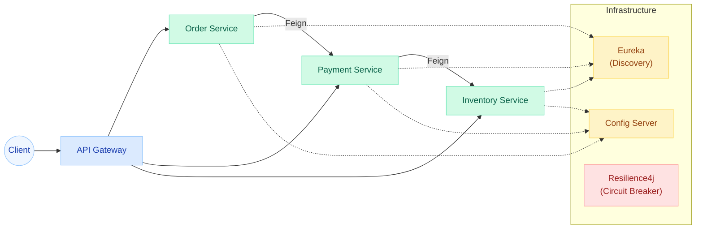
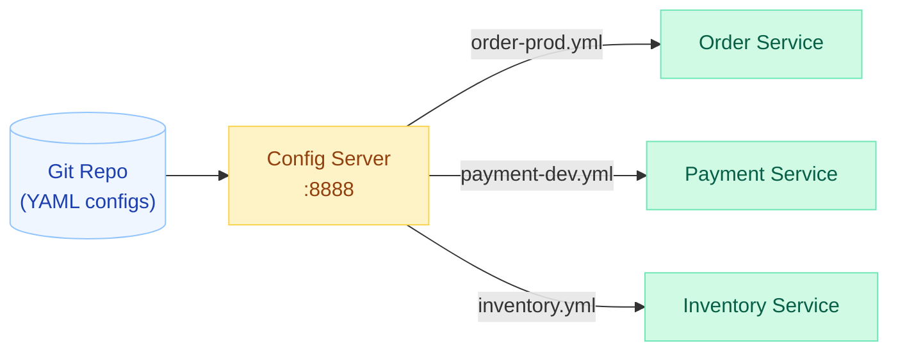
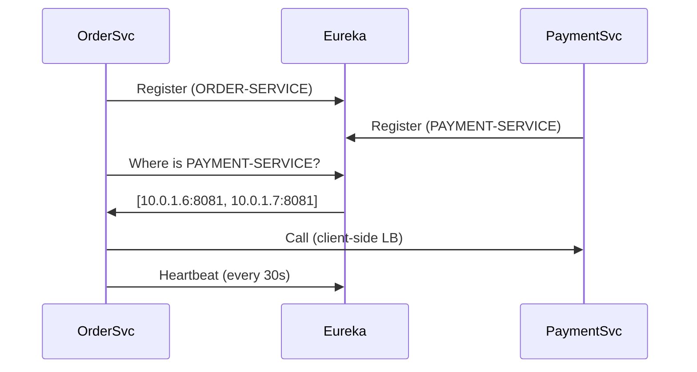
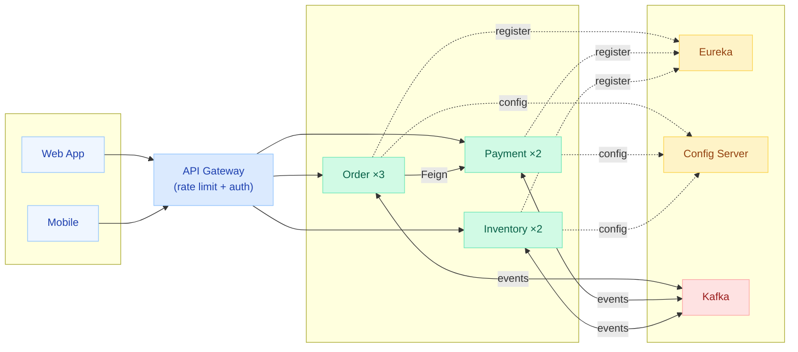

# Spring Cloud Ecosystem

> **The toolkit that turns a collection of Spring Boot apps into a resilient, self-healing distributed system.**

---

!!! abstract "Real-World Analogy"
    If Spring Boot is a single **car**, Spring Cloud is the entire **highway system** — traffic signals (API Gateway), GPS navigation (Service Discovery), radio towers (Config Server), breakdown services (Circuit Breakers), and toll booths (Load Balancers). Each car runs independently, but the highway infrastructure makes them work together.



---

## Spring Cloud Gateway

The modern API Gateway for Spring microservices (replaced Zuul).

### Why Not Just a Load Balancer?

| Feature | Nginx/HAProxy | Spring Cloud Gateway |
|---------|--------------|---------------------|
| Routing | Static config | Dynamic, predicate-based |
| Filters | Limited | Custom Java logic (auth, rate limit, transform) |
| Service Discovery | Manual upstream list | Auto-discovers via Eureka/Consul |
| Circuit Breaking | No | Built-in with Resilience4j |
| Rate Limiting | Plugin/module | First-class with Redis backend |
| WebSocket support | Yes | Yes (reactive, non-blocking) |

### Configuration

```yaml
spring:
  cloud:
    gateway:
      routes:
        - id: order-service
          uri: lb://ORDER-SERVICE        # lb:// = load-balanced via discovery
          predicates:
            - Path=/api/orders/**
            - Method=GET,POST
            - Header=X-Request-Source, mobile
          filters:
            - StripPrefix=1              # /api/orders/123 → /orders/123
            - AddRequestHeader=X-Gateway, true
            - name: CircuitBreaker
              args:
                name: orderCB
                fallbackUri: forward:/fallback/orders
            - name: RequestRateLimiter
              args:
                redis-rate-limiter.replenishRate: 100
                redis-rate-limiter.burstCapacity: 200

        - id: payment-service
          uri: lb://PAYMENT-SERVICE
          predicates:
            - Path=/api/payments/**
          filters:
            - StripPrefix=1
            - name: Retry
              args:
                retries: 3
                statuses: BAD_GATEWAY,SERVICE_UNAVAILABLE
```

### Custom Filter (Authentication)

```java
@Component
public class AuthFilter implements GatewayFilterFactory<AuthFilter.Config> {

    @Override
    public GatewayFilter apply(Config config) {
        return (exchange, chain) -> {
            String token = exchange.getRequest().getHeaders().getFirst("Authorization");
            if (token == null || !token.startsWith("Bearer ")) {
                exchange.getResponse().setStatusCode(HttpStatus.UNAUTHORIZED);
                return exchange.getResponse().setComplete();
            }
            // Validate JWT, add user info to headers
            String userId = jwtService.extractUserId(token.substring(7));
            ServerHttpRequest modified = exchange.getRequest().mutate()
                .header("X-User-Id", userId)
                .build();
            return chain.filter(exchange.mutate().request(modified).build());
        };
    }

    public static class Config {}
}
```

---

## OpenFeign — Declarative REST Client

Write HTTP calls like local method calls. No RestTemplate boilerplate.

```java
// Define the client (interface only — Spring implements it)
@FeignClient(name = "payment-service", fallback = PaymentFallback.class)
public interface PaymentClient {

    @PostMapping("/payments")
    PaymentResponse createPayment(@RequestBody PaymentRequest request);

    @GetMapping("/payments/{id}")
    PaymentResponse getPayment(@PathVariable("id") Long paymentId);

    @GetMapping("/payments")
    List<PaymentResponse> getPaymentsByOrder(@RequestParam("orderId") Long orderId);
}

// Fallback for circuit breaker
@Component
public class PaymentFallback implements PaymentClient {
    @Override
    public PaymentResponse createPayment(PaymentRequest request) {
        return PaymentResponse.pending("Payment service unavailable");
    }
    // ... other fallback methods
}
```

```java
// Usage — inject like any Spring bean
@Service
@RequiredArgsConstructor
public class OrderService {
    private final PaymentClient paymentClient;  // auto-injected!

    public Order placeOrder(OrderRequest request) {
        Order order = orderRepository.save(new Order(request));
        PaymentResponse payment = paymentClient.createPayment(
            new PaymentRequest(order.getId(), order.getTotal())
        );
        order.setPaymentId(payment.getId());
        return orderRepository.save(order);
    }
}
```

### Configuration

```yaml
spring:
  cloud:
    openfeign:
      client:
        config:
          default:
            connect-timeout: 5000
            read-timeout: 10000
            logger-level: BASIC
          payment-service:
            connect-timeout: 3000
            read-timeout: 5000

# Enable circuit breaker for Feign clients
resilience4j:
  circuitbreaker:
    instances:
      payment-service:
        sliding-window-size: 10
        failure-rate-threshold: 50
        wait-duration-in-open-state: 10s
```

!!! tip "OpenFeign vs WebClient vs RestTemplate"
    | Client | Blocking? | Best For | Style |
    |--------|-----------|----------|-------|
    | **OpenFeign** | Yes (blocking) | Service-to-service calls in Spring Cloud | Declarative (interface) |
    | **WebClient** | No (reactive) | High-throughput, non-blocking I/O | Functional/fluent |
    | **RestTemplate** | Yes (deprecated) | Legacy code only | Imperative |

---

## Config Server — Centralized Configuration

Externalize configuration for all microservices into a single Git repo.



### Server Setup

```java
@SpringBootApplication
@EnableConfigServer
public class ConfigServerApplication {
    public static void main(String[] args) {
        SpringApplication.run(ConfigServerApplication.class, args);
    }
}
```

```yaml
# Config Server application.yml
server:
  port: 8888
spring:
  cloud:
    config:
      server:
        git:
          uri: https://github.com/your-org/config-repo
          default-label: main
          search-paths: '{application}'  # folder per service
```

### Client Setup

```yaml
# order-service bootstrap.yml
spring:
  application:
    name: order-service
  config:
    import: configserver:http://config-server:8888
  cloud:
    config:
      fail-fast: true
      retry:
        max-attempts: 5
```

### Dynamic Refresh (No Restart!)

```java
@RefreshScope  // beans in this scope recreated on /actuator/refresh
@RestController
public class FeatureFlagController {

    @Value("${feature.new-checkout:false}")
    private boolean newCheckoutEnabled;

    @GetMapping("/features/checkout")
    public boolean isNewCheckoutEnabled() {
        return newCheckoutEnabled;
    }
}
```

```bash
# Trigger refresh (via Spring Cloud Bus for all instances)
POST /actuator/busrefresh
```

---

## Service Discovery — Eureka

Services register themselves and find each other without hardcoded URLs.



### Eureka Server

```java
@SpringBootApplication
@EnableEurekaServer
public class EurekaServerApplication {
    public static void main(String[] args) {
        SpringApplication.run(EurekaServerApplication.class, args);
    }
}
```

### Eureka Client (every service)

```yaml
eureka:
  client:
    service-url:
      defaultZone: http://eureka-server:8761/eureka/
  instance:
    prefer-ip-address: true
    lease-renewal-interval-in-seconds: 30
    lease-expiration-duration-in-seconds: 90
```

!!! warning "Eureka vs Kubernetes"
    If you're on Kubernetes, you may not need Eureka at all — Kubernetes Service + DNS provides service discovery natively. Use **Spring Cloud Kubernetes** instead:
    ```yaml
    spring:
      cloud:
        kubernetes:
          discovery:
            enabled: true
    ```

---

## Spring Cloud Stream — Event-Driven Messaging

Abstraction layer over Kafka/RabbitMQ — swap brokers without code changes.

```java
// Producer — just return the event
@Bean
public Supplier<OrderCreatedEvent> orderCreated() {
    return () -> new OrderCreatedEvent(orderId, amount);
}

// Consumer — just accept the event
@Bean
public Consumer<OrderCreatedEvent> processOrder() {
    return event -> {
        log.info("Processing order: {}", event.getOrderId());
        inventoryService.reserve(event.getItems());
    };
}

// Processor — transform events
@Bean
public Function<OrderCreatedEvent, PaymentRequest> orderToPayment() {
    return event -> new PaymentRequest(event.getOrderId(), event.getAmount());
}
```

```yaml
spring:
  cloud:
    stream:
      bindings:
        orderCreated-out-0:
          destination: orders-topic
          content-type: application/json
        processOrder-in-0:
          destination: orders-topic
          group: inventory-group    # consumer group for at-least-once
      kafka:
        binder:
          brokers: kafka:9092
```

---

## Putting It All Together — Architecture



---

## Interview Questions

??? question "Spring Cloud Gateway vs Netflix Zuul — what changed?"

    **Answer:** Zuul 1 was blocking (servlet-based, one thread per request). Spring Cloud Gateway is built on **Project Reactor + Netty** (non-blocking, event-loop model). It handles thousands of concurrent connections with far fewer threads. Zuul 2 was non-blocking too, but Netflix didn't open-source it fully, so Spring built their own.

    **Key difference:** Gateway supports WebSocket, reactive filters, and integrates natively with Resilience4j. Zuul is deprecated in Spring Cloud.

??? question "How does service discovery work without Eureka in Kubernetes?"

    **Answer:** Kubernetes provides native service discovery via DNS. Each `Service` resource gets a DNS entry (`payment-service.default.svc.cluster.local`). Spring Cloud Kubernetes integrates with the K8s API to discover pods directly. You lose Eureka's self-preservation mode but gain the simplicity of K8s-native networking.

??? question "What happens if Config Server is down when a service starts?"

    **Answer:** By default, the service fails to start (`fail-fast: true`). With retry configured, it attempts multiple times. Best practice: cache the last known config locally, or use `optional:configserver:` prefix so the service can start with local defaults and refresh later.

??? question "OpenFeign vs WebClient — when would you choose each?"

    **Answer:** 
    
    - **OpenFeign** when: synchronous service-to-service calls, you want clean interface-based contracts, and you're in a blocking (servlet) stack
    - **WebClient** when: you're on WebFlux, need non-blocking I/O, fan-out to multiple services concurrently, or need streaming responses
    
    **Gotcha:** Don't use OpenFeign in a WebFlux application — it blocks the event loop. Use WebClient or the new `@HttpExchange` declarative client.
