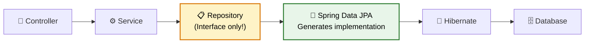
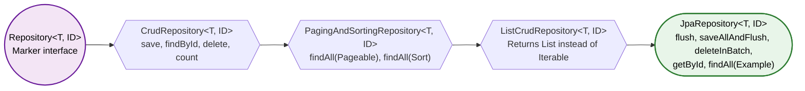
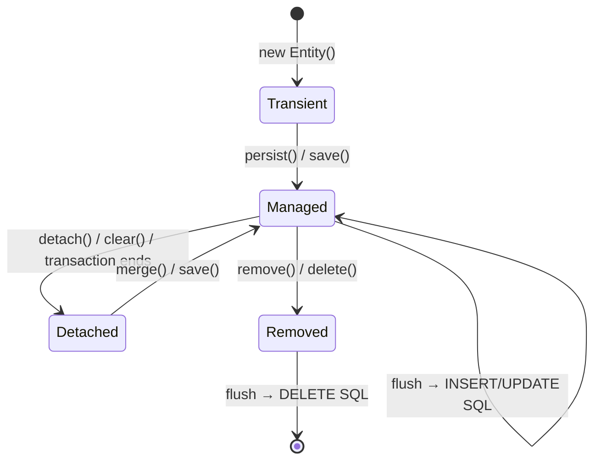
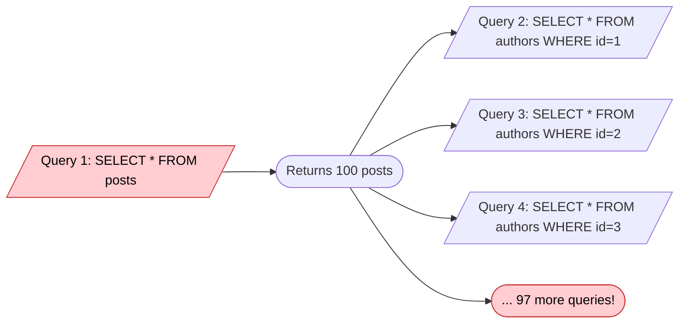

# Spring Data JPA

> **Zero SQL for common operations. Custom queries when you need them. Production-grade data handling.**

---

!!! abstract "Real-World Analogy"
    Think of a **personal assistant**. Instead of going to the store yourself (writing SQL), you tell your assistant "get me all orders from last week sorted by price" and they handle the logistics. Spring Data JPA is that assistant — you define **what** you want, it handles **how**.



---

## Repository Hierarchy

Spring Data builds repositories in layers. Each layer adds capabilities.



| Interface | Key Methods | Use When |
|-----------|------------|----------|
| `Repository` | None (marker) | You want only custom-declared methods |
| `CrudRepository` | `save`, `findById`, `existsById`, `delete`, `count` | Basic CRUD is enough |
| `PagingAndSortingRepository` | `findAll(Pageable)`, `findAll(Sort)` | You need pagination without JPA extras |
| `JpaRepository` | `flush`, `saveAllAndFlush`, `deleteAllInBatch`, `getReferenceById` | Most production apps — use this |

!!! tip "ListCrudRepository vs CrudRepository"
    `CrudRepository.findAll()` returns `Iterable`. `ListCrudRepository.findAll()` returns `List`. `JpaRepository` extends both — you always get `List`.

---

## Blog API Example — Entity Mapping

We will build a blog API with **Posts**, **Comments**, and **Tags** to demonstrate every JPA feature.

```java
@Entity
@Table(name = "posts")
@EntityListeners(AuditingEntityListener.class)
public class Post {

    @Id
    @GeneratedValue(strategy = GenerationType.IDENTITY)
    private Long id;

    @Column(nullable = false, length = 200)
    private String title;

    @Column(columnDefinition = "TEXT")
    private String content;

    @Enumerated(EnumType.STRING)
    private PostStatus status; // DRAFT, PUBLISHED, ARCHIVED

    @ManyToOne(fetch = FetchType.LAZY)
    @JoinColumn(name = "author_id", nullable = false)
    private Author author;

    @OneToMany(mappedBy = "post", cascade = CascadeType.ALL, orphanRemoval = true)
    @BatchSize(size = 25)
    private List<Comment> comments = new ArrayList<>();

    @ManyToMany
    @JoinTable(
        name = "post_tags",
        joinColumns = @JoinColumn(name = "post_id"),
        inverseJoinColumns = @JoinColumn(name = "tag_id")
    )
    private Set<Tag> tags = new HashSet<>();

    @Version
    private Integer version;

    @CreatedDate
    private LocalDateTime createdAt;

    @LastModifiedDate
    private LocalDateTime updatedAt;

    @CreatedBy
    private String createdBy;

    @LastModifiedBy
    private String modifiedBy;
}
```

### Relationship Types

| Annotation | Meaning | Example | Default Fetch |
|-----------|---------|---------|---------------|
| `@OneToOne` | 1:1 | Post ↔ PostMetadata | EAGER |
| `@OneToMany` | 1:N | Post → Comments | LAZY |
| `@ManyToOne` | N:1 | Comment → Post | EAGER |
| `@ManyToMany` | N:N | Post ↔ Tags | LAZY |

!!! warning "Always override @ManyToOne to LAZY"
    Default is EAGER. This silently causes N+1 queries. Always set `fetch = FetchType.LAZY`.

---

## Entity Lifecycle

Every JPA entity exists in one of four states. Understanding transitions is critical for debugging.



| State | In Persistence Context? | Has DB Row? | Dirty Checking? |
|-------|------------------------|-------------|-----------------|
| **Transient** | No | No | No |
| **Managed** | Yes | Yes (after flush) | Yes — changes auto-detected |
| **Detached** | No | Yes | No — changes invisible to JPA |
| **Removed** | Yes (marked for removal) | Yes (until flush) | No |

**What happens at each flush:**

- **Managed + new** → `INSERT` SQL generated
- **Managed + dirty** → `UPDATE` SQL generated (dirty checking compares field snapshot)
- **Removed** → `DELETE` SQL generated
- **Detached** → Nothing. JPA does not track it.

!!! danger "Gotcha: save() on a detached entity"
    `save()` calls `merge()` when the entity has an ID. Merge copies state into a **new managed instance**. The original object stays detached. If you modify the original after `save()`, those changes are lost.

    ```java
    Post detached = postRepository.findById(1L).get();
    entityManager.detach(detached); // now detached
    detached.setTitle("New Title");
    Post managed = postRepository.save(detached); // merge → new managed copy
    detached.setContent("Oops"); // THIS CHANGE IS LOST
    ```

---

## Query Derivation Mechanism

Spring Data parses method names at startup using a simple algorithm:

1. Strip prefix (`find...By`, `read...By`, `query...By`, `count...By`, `exists...By`, `delete...By`)
2. Split remaining text on property boundaries using camelCase
3. Match keywords (`And`, `Or`, `Between`, `LessThan`, `OrderBy`, etc.)
4. Resolve property paths against the entity metamodel
5. Generate JPQL at application context refresh time

```java
public interface PostRepository extends JpaRepository<Post, Long> {

    // Derived queries
    List<Post> findByStatus(PostStatus status);
    List<Post> findByAuthorIdAndStatus(Long authorId, PostStatus status);
    Optional<Post> findByTitle(String title);
    List<Post> findByCreatedAtAfter(LocalDateTime date);
    List<Post> findByTitleContainingIgnoreCase(String keyword);
    long countByStatus(PostStatus status);
    boolean existsByTitleAndAuthorId(String title, Long authorId);
    List<Post> findTop5ByStatusOrderByCreatedAtDesc(PostStatus status);
    void deleteByStatusAndCreatedAtBefore(PostStatus status, LocalDateTime date);
}
```

### Derived Query Keyword Reference

| Keyword | SQL Equivalent | Example |
|---------|---------------|---------|
| `findBy` | `WHERE` | `findByName(String name)` |
| `And` | `AND` | `findByNameAndAge(...)` |
| `Or` | `OR` | `findByNameOrEmail(...)` |
| `Between` | `BETWEEN` | `findByAgeBetween(int s, int e)` |
| `LessThan` / `LessThanEqual` | `<` / `<=` | `findByAgeLessThan(int age)` |
| `GreaterThan` / `GreaterThanEqual` | `>` / `>=` | `findByAgeGreaterThan(int age)` |
| `Like` | `LIKE` | `findByNameLike(String pattern)` |
| `Containing` | `LIKE %x%` | `findByNameContaining(String s)` |
| `StartingWith` | `LIKE x%` | `findByNameStartingWith(String s)` |
| `In` | `IN (...)` | `findByStatusIn(List<Status> s)` |
| `IsNull` / `IsNotNull` | `IS NULL` | `findByDeletedAtIsNull()` |
| `OrderBy` | `ORDER BY` | `findByStatusOrderByCreatedAtDesc(...)` |
| `Top` / `First` | `LIMIT` | `findTop5ByOrderByCreatedAtDesc()` |
| `Distinct` | `DISTINCT` | `findDistinctByStatus(...)` |

!!! info "How derivation works internally"
    At application startup, `PartTree` class parses the method name into a tree of `OrPart` → `Part` nodes. Each `Part` maps to a JPA Criteria predicate. The `JpaQueryCreator` walks this tree and builds either JPQL or a `CriteriaQuery`. If parsing fails, startup fails fast with `QueryCreationException`.

---

## @Query — JPQL and Native SQL

When method names get unwieldy, use explicit queries.

=== "JPQL"

    ```java
    @Query("SELECT p FROM Post p WHERE p.author.email = :email AND p.status = :status")
    List<Post> findPublishedByAuthorEmail(
        @Param("email") String email, 
        @Param("status") PostStatus status
    );

    @Query("SELECT p FROM Post p JOIN p.tags t WHERE t.name = :tagName")
    List<Post> findByTagName(@Param("tagName") String tagName);

    @Query("SELECT new com.blog.dto.PostSummary(p.id, p.title, p.createdAt, p.author.name) "
         + "FROM Post p WHERE p.status = 'PUBLISHED'")
    List<PostSummary> findPublishedSummaries();
    ```

=== "Native SQL"

    ```java
    @Query(value = """
        SELECT p.* FROM posts p
        INNER JOIN post_tags pt ON p.id = pt.post_id
        GROUP BY p.id
        HAVING COUNT(pt.tag_id) > :minTags
        ORDER BY p.created_at DESC
        LIMIT :limit
        """, nativeQuery = true)
    List<Post> findPostsWithManyTags(@Param("minTags") int minTags, @Param("limit") int limit);
    ```

=== "Modifying Queries"

    ```java
    @Modifying(clearAutomatically = true)
    @Query("UPDATE Post p SET p.status = :status WHERE p.createdAt < :date AND p.status = 'DRAFT'")
    int bulkArchiveStaleDrafts(@Param("status") PostStatus status, @Param("date") LocalDateTime date);

    @Modifying
    @Query("DELETE FROM Post p WHERE p.status = 'ARCHIVED' AND p.createdAt < :cutoff")
    int purgeOldArchived(@Param("cutoff") LocalDateTime cutoff);
    ```

!!! warning "clearAutomatically = true"
    `@Modifying` queries bypass the persistence context. Managed entities become stale. Set `clearAutomatically = true` to evict the L1 cache after execution.

---

## Specifications — Dynamic Queries

When query logic depends on runtime conditions (search filters, optional params), Specifications beat string concatenation.

Your repository must extend `JpaSpecificationExecutor<T>`.

```java
public interface PostRepository extends JpaRepository<Post, Long>, JpaSpecificationExecutor<Post> {}
```

```java
public class PostSpecifications {

    public static Specification<Post> hasStatus(PostStatus status) {
        return (root, query, cb) -> 
            status == null ? null : cb.equal(root.get("status"), status);
    }

    public static Specification<Post> titleContains(String keyword) {
        return (root, query, cb) -> 
            keyword == null ? null : cb.like(cb.lower(root.get("title")), "%" + keyword.toLowerCase() + "%");
    }

    public static Specification<Post> createdAfter(LocalDateTime date) {
        return (root, query, cb) -> 
            date == null ? null : cb.greaterThan(root.get("createdAt"), date);
    }

    public static Specification<Post> hasTag(String tagName) {
        return (root, query, cb) -> {
            if (tagName == null) return null;
            Join<Post, Tag> tags = root.join("tags");
            return cb.equal(tags.get("name"), tagName);
        };
    }
}
```

```java
// Service layer — combine dynamically based on user input
Specification<Post> spec = Specification
    .where(hasStatus(filter.getStatus()))
    .and(titleContains(filter.getKeyword()))
    .and(createdAfter(filter.getFromDate()))
    .and(hasTag(filter.getTag()));

Page<Post> results = postRepository.findAll(spec, pageable);
```

!!! tip "Returning null from a Specification predicate"
    When a `Specification` returns `null`, Spring Data ignores it. This is how you make filters optional without `if/else` branching.

---

## Projections

Fetching entire entities when you need 3 columns wastes bandwidth and memory. Projections solve this.

=== "Interface-Based (Closed)"

    ```java
    public interface PostSummaryView {
        Long getId();
        String getTitle();
        LocalDateTime getCreatedAt();

        @Value("#{target.author.name}")
        String getAuthorName();
    }

    // Repository
    List<PostSummaryView> findByStatus(PostStatus status);
    ```

=== "Class-Based (DTO)"

    ```java
    public record PostSummary(Long id, String title, LocalDateTime createdAt, String authorName) {}

    @Query("SELECT new com.blog.dto.PostSummary(p.id, p.title, p.createdAt, p.author.name) FROM Post p")
    List<PostSummary> findAllSummaries();
    ```

=== "Dynamic Projections"

    ```java
    <T> List<T> findByStatus(PostStatus status, Class<T> type);

    // Usage
    List<PostSummaryView> summaries = repo.findByStatus(PUBLISHED, PostSummaryView.class);
    List<Post> full = repo.findByStatus(PUBLISHED, Post.class);
    ```

!!! info "Projections prevent N+1"
    Interface and DTO projections generate `SELECT` with only the declared columns. No lazy-loading traps. No unnecessary joins. Use them for read-only queries.

---

## Pagination and Sorting

### Pageable, Page, and Slice

```java
// Repository
Page<Post> findByStatus(PostStatus status, Pageable pageable);
Slice<Post> findByAuthorId(Long authorId, Pageable pageable);
```

| Type | Count Query? | Use Case |
|------|-------------|----------|
| `Page<T>` | Yes — executes `SELECT COUNT(*)` | Need total count (admin dashboards, numbered pagination) |
| `Slice<T>` | No | Infinite scroll / "Load More" button — cheaper |
| `List<T>` | No | You just want sorted/limited results |

```java
// Service
Pageable pageable = PageRequest.of(0, 20, Sort.by(Sort.Direction.DESC, "createdAt"));
Page<Post> page = postRepository.findByStatus(PostStatus.PUBLISHED, pageable);

page.getContent();       // List<Post> for current page
page.getTotalElements(); // Total rows matching query
page.getTotalPages();    // ceil(totalElements / pageSize)
page.getNumber();        // Current page (0-indexed)
page.hasNext();          // More pages available?
page.isLast();           // Is this the last page?
```

```java
// Controller
@GetMapping("/posts")
public Page<PostSummary> getPosts(
        @RequestParam(defaultValue = "0") int page,
        @RequestParam(defaultValue = "20") int size,
        @RequestParam(defaultValue = "createdAt") String sortBy,
        @RequestParam(defaultValue = "desc") String direction) {

    Sort sort = direction.equalsIgnoreCase("asc")
        ? Sort.by(sortBy).ascending()
        : Sort.by(sortBy).descending();

    return postService.getPublishedPosts(PageRequest.of(page, size, sort));
}
```

!!! warning "Count query cost"
    `Page` fires an extra `SELECT COUNT(*)`. On tables with millions of rows and complex WHERE clauses, this is expensive. Use `Slice` or a custom `@Query` with `countQuery` to optimize:
    ```java
    @Query(value = "SELECT p FROM Post p WHERE p.status = :status",
           countQuery = "SELECT COUNT(p.id) FROM Post p WHERE p.status = :status")
    Page<Post> findByStatus(@Param("status") PostStatus status, Pageable pageable);
    ```

---

## N+1 Problem — Detection and Fixes

The most common JPA performance killer.



**1 query for posts + N queries for each post's author = N+1 problem.**

### How to Detect

1. Enable SQL logging: `spring.jpa.show-sql=true` + `logging.level.org.hibernate.SQL=DEBUG`
2. Use `spring.jpa.properties.hibernate.generate_statistics=true` — logs query count per session
3. Integration test with assertion: `assertThat(queryCount).isLessThanOrEqualTo(3)`
4. Libraries: [datasource-proxy](https://github.com/ttddyy/datasource-proxy) for query counting in tests

### Three Fixes

=== "JOIN FETCH (JPQL)"

    ```java
    @Query("SELECT p FROM Post p JOIN FETCH p.author JOIN FETCH p.comments WHERE p.status = :status")
    List<Post> findByStatusWithDetails(@Param("status") PostStatus status);
    ```

    Generates a single SQL with `INNER JOIN`. All data in one roundtrip.

    !!! danger "JOIN FETCH + Pagination = trouble"
        Hibernate cannot paginate in SQL when `JOIN FETCH` is used on a collection. It fetches ALL rows and paginates in memory. Use `@EntityGraph` or `@BatchSize` for paginated collection fetches.

=== "@EntityGraph"

    ```java
    @EntityGraph(attributePaths = {"author", "tags"})
    Page<Post> findByStatus(PostStatus status, Pageable pageable);

    // Named entity graph (defined on entity)
    @NamedEntityGraph(name = "Post.detail",
        attributeNodes = {
            @NamedAttributeNode("author"),
            @NamedAttributeNode("comments"),
            @NamedAttributeNode("tags")
        })
    @Entity
    public class Post { ... }

    @EntityGraph("Post.detail")
    Optional<Post> findDetailById(Long id);
    ```

    Generates `LEFT JOIN` by default. Works with pagination for `@ManyToOne` / `@OneToOne`.

=== "@BatchSize"

    ```java
    @Entity
    public class Post {
        @OneToMany(mappedBy = "post", fetch = FetchType.LAZY)
        @BatchSize(size = 25) // Fetches comments for 25 posts at once
        private List<Comment> comments;
    }

    // Or globally in application.properties:
    // spring.jpa.properties.hibernate.default_batch_fetch_size=25
    ```

    Instead of N queries, fires `ceil(N/25)` queries with `WHERE post_id IN (?, ?, ..., ?)`.

    Best for: collections you sometimes access but do not always need eagerly.

---

## LazyInitializationException

```
org.hibernate.LazyInitializationException: could not initialize proxy - no Session
```

**Why it happens:** You access a lazy-loaded relationship after the persistence context (Hibernate Session) is closed. Typically outside a `@Transactional` boundary or after the controller serializes the response.

### Fixes

| Approach | Pros | Cons |
|----------|------|------|
| **JOIN FETCH** in repository | Explicit, efficient | Requires custom query per use case |
| **@EntityGraph** | Declarative, clean | Can over-fetch |
| **DTO Projection** | No lazy proxies at all | More boilerplate |
| **Open-in-View** (default ON) | Zero effort | Anti-pattern in production — holds DB connection through view rendering |
| `@Transactional` on service method | Simple | Does not work if accessed after service returns |

!!! danger "spring.jpa.open-in-view=true (default)"
    Spring Boot enables Open Session in View by default. The Hibernate session stays open until the HTTP response is written. This masks LazyInitializationException but holds a database connection for the entire request lifecycle, including view rendering and JSON serialization. Disable in production:
    ```properties
    spring.jpa.open-in-view=false
    ```

**Best practice:** Always fetch what you need in the service layer using JOIN FETCH or projections. Never rely on Open-in-View.

---

## Custom Repository Implementations

When `JpaRepository` and `@Query` are not enough — native JDBC, complex joins, stored procedures.

```java
// 1. Define custom interface
public interface PostRepositoryCustom {
    List<Post> fullTextSearch(String query);
    void bulkInsert(List<Post> posts);
}

// 2. Implement it (naming convention: {RepositoryName}Impl)
@Repository
public class PostRepositoryImpl implements PostRepositoryCustom {

    @PersistenceContext
    private EntityManager em;

    @Override
    public List<Post> fullTextSearch(String query) {
        return em.createNativeQuery(
            "SELECT * FROM posts WHERE to_tsvector('english', title || ' ' || content) @@ plainto_tsquery(:q)",
            Post.class)
            .setParameter("q", query)
            .getResultList();
    }

    @Override
    public void bulkInsert(List<Post> posts) {
        int batchSize = 50;
        for (int i = 0; i < posts.size(); i++) {
            em.persist(posts.get(i));
            if (i % batchSize == 0 && i > 0) {
                em.flush();
                em.clear();
            }
        }
    }
}

// 3. Extend in main repository
public interface PostRepository extends JpaRepository<Post, Long>, PostRepositoryCustom {
    // all derived + custom methods available
}
```

!!! tip "Naming convention is mandatory"
    The implementation class must be named `{RepositoryInterface}Impl`. Spring Data scans for this suffix. You can change it via `@EnableJpaRepositories(repositoryImplementationPostfix = "CustomImpl")`.

---

## Optimistic vs Pessimistic Locking

### Optimistic Locking — @Version

Assumes conflicts are rare. Checks at commit time.

```java
@Entity
public class Post {
    @Version
    private Integer version; // auto-incremented on each UPDATE
}
```

Hibernate generates: `UPDATE posts SET title=?, version=? WHERE id=? AND version=?`

If another transaction already incremented the version → `OptimisticLockException`.

```java
@Service
public class PostService {

    @Retryable(value = OptimisticLockException.class, maxAttempts = 3)
    @Transactional
    public Post updateTitle(Long id, String newTitle) {
        Post post = postRepository.findById(id).orElseThrow();
        post.setTitle(newTitle);
        return postRepository.save(post);
    }
}
```

### Pessimistic Locking — @Lock

Assumes conflicts are likely. Acquires DB-level lock immediately.

```java
public interface PostRepository extends JpaRepository<Post, Long> {

    @Lock(LockModeType.PESSIMISTIC_WRITE)
    @Query("SELECT p FROM Post p WHERE p.id = :id")
    Optional<Post> findByIdForUpdate(@Param("id") Long id);

    @Lock(LockModeType.PESSIMISTIC_READ)
    Optional<Post> findWithSharedLockById(Long id);
}
```

| Lock Type | SQL | Blocks |
|-----------|-----|--------|
| `PESSIMISTIC_READ` | `SELECT ... FOR SHARE` | Other writers |
| `PESSIMISTIC_WRITE` | `SELECT ... FOR UPDATE` | All readers and writers |
| `OPTIMISTIC` | Version check at commit | Nothing — detects after the fact |

!!! info "When to use which"
    **Optimistic**: High-read, low-write scenarios (blog posts, user profiles). No DB lock held.  
    **Pessimistic**: Financial operations, inventory, counters — where lost updates are unacceptable and retry is costly.

---

## Auditing

Track who changed what and when. Requires `@EnableJpaAuditing`.

```java
@Configuration
@EnableJpaAuditing
public class JpaConfig {

    @Bean
    public AuditorAware<String> auditorProvider() {
        return () -> Optional.ofNullable(
            SecurityContextHolder.getContext().getAuthentication())
            .map(Authentication::getName);
    }
}
```

```java
@MappedSuperclass
@EntityListeners(AuditingEntityListener.class)
public abstract class Auditable {

    @CreatedDate
    @Column(updatable = false)
    private LocalDateTime createdAt;

    @LastModifiedDate
    private LocalDateTime updatedAt;

    @CreatedBy
    @Column(updatable = false)
    private String createdBy;

    @LastModifiedBy
    private String modifiedBy;
}

@Entity
public class Post extends Auditable {
    // inherits all audit fields
}
```

| Annotation | Populated When | Requirements |
|-----------|---------------|--------------|
| `@CreatedDate` | Entity first persisted | `@EnableJpaAuditing` + `@EntityListeners` |
| `@LastModifiedDate` | Entity updated | Same |
| `@CreatedBy` | Entity first persisted | `AuditorAware` bean |
| `@LastModifiedBy` | Entity updated | `AuditorAware` bean |

---

## Gotchas and Common Pitfalls

!!! danger "save() on detached entity — merge vs persist"
    `SimpleJpaRepository.save()` checks `isNew()`. If the entity has an ID, it calls `entityManager.merge()` — not `persist()`. Merge returns a **new managed copy**. The original stays detached. Always use the returned reference.

!!! warning "deleteById does NOT throw on missing ID"
    `deleteById(999L)` does nothing if ID 999 does not exist. No exception. If you need to verify existence first:
    ```java
    if (!repo.existsById(id)) throw new EntityNotFoundException("Post not found: " + id);
    repo.deleteById(id);
    ```

!!! warning "Flush timing surprises"
    Hibernate flushes before: (1) transaction commit, (2) any JPQL/native query execution, (3) explicit `flush()` call. A `@Modifying` query triggers a flush of pending changes before it runs. This can cause unexpected constraint violations mid-transaction.

!!! danger "equals/hashCode on entities"
    Never use `@Data` (Lombok) on entities. Auto-generated `equals/hashCode` using all fields breaks with lazy proxies and detached objects. Use business key or just `id` (with null-safety).

!!! warning "@Transactional on private methods"
    Spring AOP proxies only intercept public methods. `@Transactional` on a private method is silently ignored. The same applies to self-invocation (calling `this.method()` within the same class).

---

## Interview Questions

??? question "1. What is the difference between findById and getReferenceById (getById)?"
    `findById(id)` executes `SELECT` immediately and returns `Optional<T>`. Returns empty Optional if not found. `getReferenceById(id)` returns a **lazy proxy** — no SQL until you access a field. Throws `EntityNotFoundException` on access if the row does not exist. Use `getReferenceById` when you only need to set a foreign key reference without loading the full entity.

??? question "2. How does query derivation work internally?"
    At startup, Spring Data's `RepositoryFactorySupport` creates a proxy for each repository interface. For each method without `@Query`, the `PartTree` parser splits the method name by keywords (`findBy`, `And`, `Or`, `OrderBy`, etc.) into a parse tree. `JpaQueryCreator` converts this tree into a `CriteriaQuery`. The generated query is validated against the entity metamodel. If any property name is invalid, startup fails with `PropertyReferenceException`.

??? question "3. What is the N+1 problem and give 3 ways to fix it?"
    When you load N entities and each entity triggers a separate query to load a lazy relationship, you get 1 + N queries. Fix with: (1) `JOIN FETCH` in JPQL to load relationships in one query, (2) `@EntityGraph` to declaratively specify eager attributes per query, (3) `@BatchSize` to batch lazy loads into groups using `IN` clause. Bonus: use DTO projections to avoid loading relationships altogether.

??? question "4. Difference between FetchType.LAZY vs EAGER?"
    **LAZY**: proxy placeholder; SQL fires only on field access. Default for `@OneToMany` and `@ManyToMany`. **EAGER**: loaded immediately with parent in same or separate query. Default for `@ManyToOne` and `@OneToOne`. Always prefer LAZY and fetch explicitly when needed. EAGER cannot be overridden per-query — you are stuck with it everywhere.

??? question "5. What is dirty checking in JPA?"
    Within a transaction, Hibernate snapshots entity state on load. At flush time, it compares current field values to the snapshot. Changed fields generate an UPDATE. You do not need to call `save()` on a managed entity — the change is detected automatically. This only works for managed entities inside an active persistence context.

??? question "6. Difference between save() and saveAndFlush()?"
    `save()` marks the entity for persistence; SQL may be delayed until transaction commit or next query. `saveAndFlush()` immediately executes SQL and syncs with the database. Use `saveAndFlush()` when you need the generated ID right away, want to catch constraint violations early, or need the data visible to native queries in the same transaction.

??? question "7. How do you handle optimistic locking?"
    Add `@Version` (Integer or Long) to the entity. Hibernate appends `AND version = ?` to every UPDATE. If another transaction incremented the version first, `OptimisticLockException` is thrown. Handle it by retrying (with `@Retryable`) or returning a conflict response to the client. Never catch and silently ignore it.

??? question "8. What is the difference between Page and Slice?"
    `Page` extends `Slice`. Both contain a chunk of data. The difference: `Page` executes an additional `COUNT(*)` query to know the total elements and total pages. `Slice` only knows if there is a next page (fetches `pageSize + 1` rows). Use `Slice` for infinite scroll UIs where total count is irrelevant and expensive.

??? question "9. Why does LazyInitializationException happen and how do you fix it?"
    It occurs when you access a lazy proxy after the Hibernate Session is closed (outside `@Transactional`). Fixes: (1) fetch eagerly in the query with JOIN FETCH or @EntityGraph, (2) use DTO projection so no proxy exists, (3) ensure access happens inside the transactional boundary. Avoid relying on Open-in-View in production.

??? question "10. How do Specifications compare to @Query?"
    `@Query` is static — defined at compile time. Specifications are dynamic — composed at runtime based on conditions. Use `@Query` for fixed, known queries. Use Specifications for search/filter endpoints where combinations of criteria vary per request. Specifications implement the Criteria API under the hood.

??? question "11. Explain the difference between CrudRepository, PagingAndSortingRepository, and JpaRepository."
    `CrudRepository` provides basic CRUD: `save`, `findById`, `findAll`, `delete`, `count`. `PagingAndSortingRepository` adds `findAll(Pageable)` and `findAll(Sort)`. `JpaRepository` adds JPA-specific operations: `flush()`, `saveAllAndFlush()`, `deleteAllInBatch()` (single DELETE SQL vs N deletes), `getReferenceById()`, and query-by-example. Use `JpaRepository` unless you have a reason to restrict the API surface.

??? question "12. What happens when you call deleteById on a non-existent ID?"
    Nothing. No exception. `SimpleJpaRepository.deleteById()` calls `findById()` first. If the entity is not found, it calls `delete()` on the `EmptyOptional` path which is a no-op. If you need guaranteed existence, call `existsById()` first or use `delete(findById(id).orElseThrow())`.

??? question "13. What is the purpose of @Modifying and when is clearAutomatically needed?"
    `@Modifying` marks a `@Query` as an INSERT/UPDATE/DELETE (not a SELECT). Without it, Spring Data assumes the query returns data. `clearAutomatically = true` evicts the persistence context after execution — necessary because bulk updates bypass managed entities, leaving them stale. Without clearing, subsequent reads from the same transaction return outdated cached state.

??? question "14. How do custom repository implementations work?"
    Define a separate interface (e.g., `PostRepositoryCustom`) with your methods. Create a class named `PostRepositoryImpl` implementing it — inject `EntityManager` for raw JPA/JDBC. Then extend the custom interface in your main repository: `PostRepository extends JpaRepository<Post, Long>, PostRepositoryCustom`. Spring Data detects the `Impl` suffix and delegates calls to your implementation.

---

## Complete Blog API Example

Tying it all together — a service demonstrating pagination, specifications, entity graphs, and auditing.

```java
@Service
@RequiredArgsConstructor
@Transactional(readOnly = true)
public class PostService {

    private final PostRepository postRepository;

    public Page<PostSummaryView> searchPosts(PostSearchFilter filter, Pageable pageable) {
        Specification<Post> spec = Specification
            .where(PostSpecifications.hasStatus(PostStatus.PUBLISHED))
            .and(PostSpecifications.titleContains(filter.getKeyword()))
            .and(PostSpecifications.createdAfter(filter.getFromDate()))
            .and(PostSpecifications.hasTag(filter.getTag()));

        return postRepository.findAll(spec, pageable)
            .map(post -> new PostSummaryView(post.getId(), post.getTitle(), 
                post.getCreatedAt(), post.getAuthor().getName()));
    }

    public PostDetailDto getPostDetail(Long id) {
        Post post = postRepository.findDetailById(id) // @EntityGraph loads author + comments + tags
            .orElseThrow(() -> new PostNotFoundException(id));
        return PostDetailDto.from(post);
    }

    @Transactional
    public Post createPost(CreatePostRequest request) {
        Author author = authorRepository.getReferenceById(request.getAuthorId()); // no SELECT, just proxy
        Post post = new Post();
        post.setTitle(request.getTitle());
        post.setContent(request.getContent());
        post.setStatus(PostStatus.DRAFT);
        post.setAuthor(author);
        request.getTagIds().stream()
            .map(tagRepository::getReferenceById)
            .forEach(post.getTags()::add);
        return postRepository.save(post); // persist — entity is new
    }

    @Transactional
    @Retryable(value = OptimisticLockException.class, maxAttempts = 3)
    public Post publishPost(Long id) {
        Post post = postRepository.findById(id).orElseThrow();
        post.setStatus(PostStatus.PUBLISHED); // dirty checking handles UPDATE
        return post; // no explicit save needed — entity is managed
    }
}
```

---
