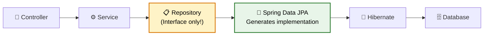
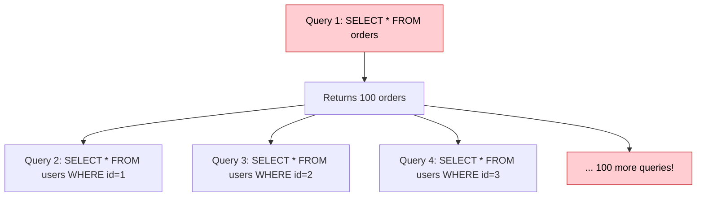

# 🗄️ Spring Data JPA

> **Simplify database access — write zero SQL for common operations, custom queries when you need them, and production-grade data handling.**

---

!!! abstract "Real-World Analogy"
    Think of a **personal assistant**. Instead of going to the store yourself (writing SQL), you tell your assistant "get me all orders from last week sorted by price" and they handle the logistics. Spring Data JPA is that assistant — you define **what** you want, it handles **how**.



---

## 🏗️ Entity Mapping

```java
@Entity
@Table(name = "orders")
public class Order {

    @Id
    @GeneratedValue(strategy = GenerationType.IDENTITY)
    private Long id;

    @Column(nullable = false)
    private String orderNumber;

    @Enumerated(EnumType.STRING)
    private OrderStatus status;

    @ManyToOne(fetch = FetchType.LAZY)
    @JoinColumn(name = "user_id")
    private User user;

    @OneToMany(mappedBy = "order", cascade = CascadeType.ALL, orphanRemoval = true)
    private List<OrderItem> items = new ArrayList<>();

    @Column(precision = 10, scale = 2)
    private BigDecimal totalAmount;

    @CreationTimestamp
    private LocalDateTime createdAt;

    @UpdateTimestamp
    private LocalDateTime updatedAt;
}
```

### Relationship Types

| Annotation | Meaning | Example |
|---|---|---|
| `@OneToOne` | 1:1 | User ↔ Profile |
| `@OneToMany` | 1:N | Order → OrderItems |
| `@ManyToOne` | N:1 | OrderItem → Order |
| `@ManyToMany` | N:N | Student ↔ Course |

---

## 📋 Repository Interface

```java
public interface OrderRepository extends JpaRepository<Order, Long> {

    // Derived query methods — Spring generates SQL from method name!
    List<Order> findByStatus(OrderStatus status);
    List<Order> findByUserIdAndStatus(Long userId, OrderStatus status);
    Optional<Order> findByOrderNumber(String orderNumber);
    List<Order> findByCreatedAtAfter(LocalDateTime date);
    List<Order> findByTotalAmountGreaterThanOrderByCreatedAtDesc(BigDecimal amount);
    long countByStatus(OrderStatus status);
    boolean existsByOrderNumber(String orderNumber);
    void deleteByStatus(OrderStatus status);

    // Custom JPQL query
    @Query("SELECT o FROM Order o WHERE o.user.email = :email AND o.status = :status")
    List<Order> findUserOrdersByStatus(@Param("email") String email, @Param("status") OrderStatus status);

    // Native SQL query
    @Query(value = "SELECT * FROM orders WHERE total_amount > :amount LIMIT :limit", nativeQuery = true)
    List<Order> findExpensiveOrders(@Param("amount") BigDecimal amount, @Param("limit") int limit);

    // Modifying queries
    @Modifying
    @Query("UPDATE Order o SET o.status = :status WHERE o.createdAt < :date AND o.status = 'PENDING'")
    int bulkUpdateStaleOrders(@Param("status") OrderStatus status, @Param("date") LocalDateTime date);
}
```

### Derived Query Keyword Reference

| Keyword | SQL | Example |
|---|---|---|
| `findBy` | `WHERE` | `findByName(String name)` |
| `And` | `AND` | `findByNameAndAge(...)` |
| `Or` | `OR` | `findByNameOrEmail(...)` |
| `Between` | `BETWEEN` | `findByAgeBetween(int s, int e)` |
| `LessThan` | `<` | `findByAgeLessThan(int age)` |
| `GreaterThan` | `>` | `findByAgeGreaterThan(int age)` |
| `Like` | `LIKE` | `findByNameLike(String pattern)` |
| `Containing` | `LIKE %x%` | `findByNameContaining(String s)` |
| `In` | `IN` | `findByStatusIn(List<Status> s)` |
| `OrderBy` | `ORDER BY` | `findByStatusOrderByCreatedAtDesc(...)` |
| `Top/First` | `LIMIT` | `findTop5ByOrderByCreatedAtDesc()` |

---

## 📄 Pagination & Sorting

```java
// Repository method
Page<Order> findByStatus(OrderStatus status, Pageable pageable);

// Service usage
Pageable pageable = PageRequest.of(0, 20, Sort.by("createdAt").descending());
Page<Order> page = orderRepository.findByStatus(OrderStatus.CONFIRMED, pageable);

// Page metadata
page.getContent();       // List<Order> for this page
page.getTotalElements(); // Total across all pages
page.getTotalPages();    // Total number of pages
page.getNumber();        // Current page number
page.hasNext();          // Is there a next page?
```

```java
// Controller with pagination
@GetMapping
public Page<OrderResponse> getOrders(
        @RequestParam(defaultValue = "0") int page,
        @RequestParam(defaultValue = "20") int size,
        @RequestParam(defaultValue = "createdAt") String sortBy,
        @RequestParam(defaultValue = "desc") String direction) {

    Sort sort = direction.equalsIgnoreCase("asc") 
        ? Sort.by(sortBy).ascending() 
        : Sort.by(sortBy).descending();
    
    Pageable pageable = PageRequest.of(page, size, sort);
    return orderService.getOrders(pageable);
}
```

---

## ⚡ N+1 Problem & Solutions

The most common JPA performance issue:



**1 query for orders + N queries for each order's user = N+1 problem**

### Solutions

=== "JOIN FETCH (JPQL)"

    ```java
    @Query("SELECT o FROM Order o JOIN FETCH o.user JOIN FETCH o.items WHERE o.status = :status")
    List<Order> findByStatusWithDetails(@Param("status") OrderStatus status);
    ```

=== "@EntityGraph"

    ```java
    @EntityGraph(attributePaths = {"user", "items"})
    List<Order> findByStatus(OrderStatus status);
    ```

=== "Batch Fetching"

    ```java
    @Entity
    public class Order {
        @ManyToOne(fetch = FetchType.LAZY)
        @BatchSize(size = 25)  // Fetch 25 users at a time instead of 1
        private User user;
    }
    ```

---

## 🔍 Specifications (Dynamic Queries)

Build complex, dynamic queries programmatically:

```java
public class OrderSpecifications {

    public static Specification<Order> hasStatus(OrderStatus status) {
        return (root, query, cb) -> cb.equal(root.get("status"), status);
    }

    public static Specification<Order> createdAfter(LocalDateTime date) {
        return (root, query, cb) -> cb.greaterThan(root.get("createdAt"), date);
    }

    public static Specification<Order> amountGreaterThan(BigDecimal amount) {
        return (root, query, cb) -> cb.greaterThan(root.get("totalAmount"), amount);
    }
}

// Usage — combine dynamically
Specification<Order> spec = Specification
    .where(hasStatus(OrderStatus.CONFIRMED))
    .and(createdAfter(lastWeek))
    .and(amountGreaterThan(new BigDecimal("100")));

List<Order> orders = orderRepository.findAll(spec);
```

---

## 🔄 Auditing

Automatically track who created/modified records and when:

```java
@Configuration
@EnableJpaAuditing
public class JpaConfig {
    @Bean
    public AuditorAware<String> auditorProvider() {
        return () -> Optional.ofNullable(SecurityContextHolder.getContext()
            .getAuthentication().getName());
    }
}

@Entity
@EntityListeners(AuditingEntityListener.class)
public class Order {
    @CreatedDate
    private LocalDateTime createdAt;

    @LastModifiedDate
    private LocalDateTime updatedAt;

    @CreatedBy
    private String createdBy;

    @LastModifiedBy
    private String modifiedBy;
}
```

---

## 🎯 Interview Questions

??? question "1. What is the N+1 problem and how do you solve it?"
    When you load N entities and each entity lazily loads a relationship, causing N additional queries. Fix with: `JOIN FETCH` in JPQL, `@EntityGraph` annotation, or `@BatchSize` to batch lazy loads. Always check generated SQL with `spring.jpa.show-sql=true` in dev.

??? question "2. Difference between FetchType.LAZY vs EAGER?"
    **LAZY**: relationship loaded only when accessed (default for collections). **EAGER**: loaded immediately with the parent entity (default for @ManyToOne). Always prefer LAZY and use JOIN FETCH when you need the data — EAGER causes unnecessary queries.

??? question "3. What is the difference between JpaRepository, CrudRepository, and PagingAndSortingRepository?"
    `CrudRepository` — basic CRUD (save, findById, delete). `PagingAndSortingRepository` extends it with pagination and sorting. `JpaRepository` extends both with JPA-specific features (flush, batch delete, Example queries). Use `JpaRepository` for most cases.

??? question "4. How does dirty checking work in JPA?"
    Within a transaction, JPA tracks all managed entities. When the transaction commits, Hibernate compares current state to the snapshot taken at load time. If any field changed, it auto-generates an UPDATE query — you don't need to call `save()` explicitly.

??? question "5. What is the difference between save() and saveAndFlush()?"
    `save()` — marks entity for persistence, actual SQL may be delayed until transaction commits. `saveAndFlush()` — immediately executes the SQL and syncs with DB. Use `saveAndFlush()` when you need the generated ID immediately or want to catch DB constraints early.

??? question "6. How do you handle optimistic locking?"
    Add `@Version` field to your entity. JPA automatically adds `WHERE version = ?` to UPDATE queries. If another transaction modified the row first, it throws `OptimisticLockException`. Catch it and retry or inform the user of the conflict.

