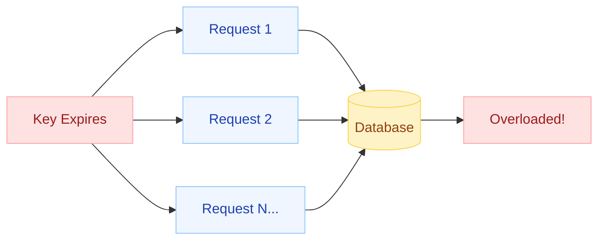
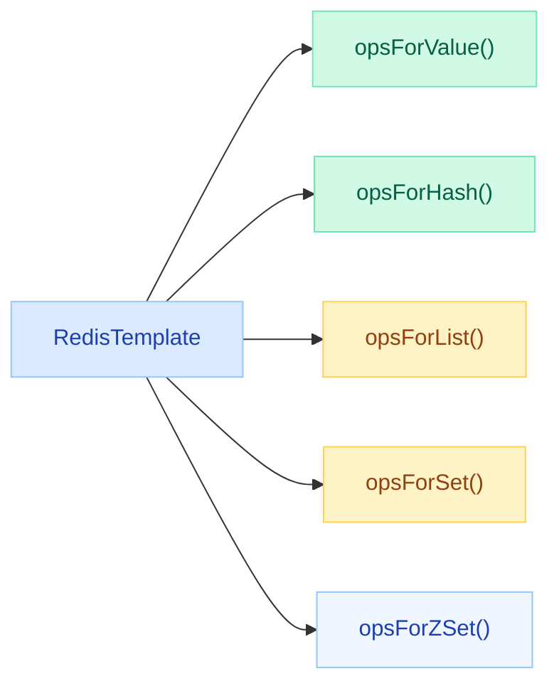
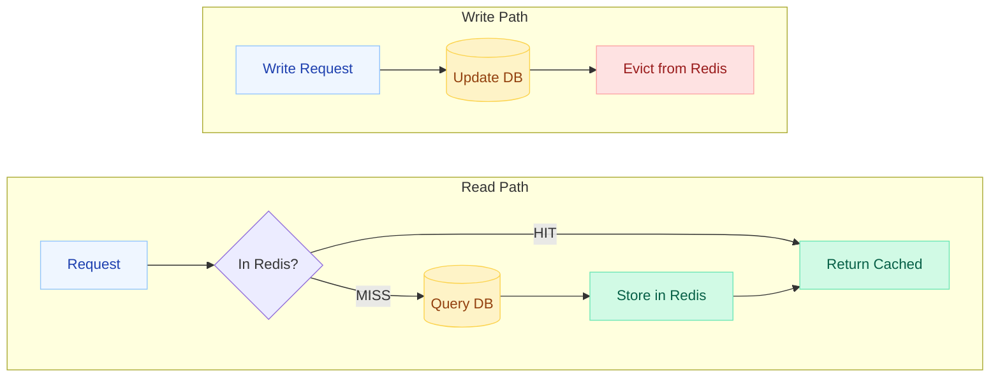
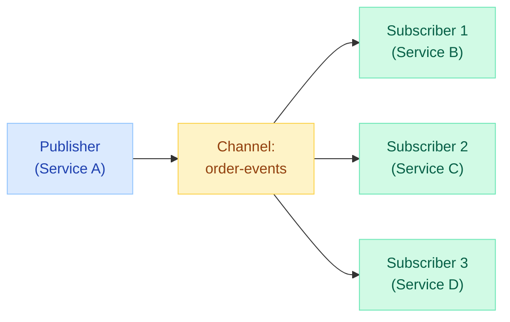
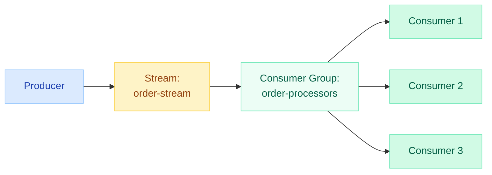
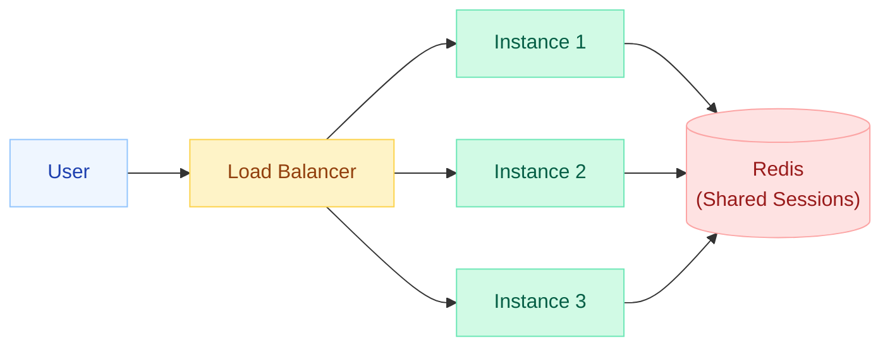

# Spring Data Redis

> Your most popular cache key just expired. 10,000 requests simultaneously hit the database to rebuild it. The database buckles. This is a cache stampede — and Redis is both the cause and the cure.

---

!!! danger "Cache Stampede Scenario"
    A hot key with 50K requests/sec expires at T=0. Every request sees a cache miss. All 50K requests slam the database in the same second. DB CPU spikes to 100%. Latency explodes. Cascading failures begin. **Fix:** distributed locking on cache population, jittered TTLs, or pre-emptive refresh before expiry.



---

## Connection: Lettuce vs Jedis

Spring Data Redis supports two client libraries. Lettuce is the default since Spring Boot 2.x.

| Aspect | Lettuce | Jedis |
|---|---|---|
| **Connection model** | Single shared connection (Netty-based) | Connection pool (one connection per thread) |
| **Thread safety** | Fully thread-safe | NOT thread-safe (needs pooling) |
| **Non-blocking** | Yes (async + reactive support) | No (synchronous only) |
| **Reactive support** | Native (`Mono`/`Flux` via `ReactiveRedisTemplate`) | None |
| **Connection pooling** | Optional (for blocking commands) | Required (`commons-pool2`) |
| **Cluster support** | Full (auto-discovery, topology refresh) | Full |
| **Sentinel support** | Full | Full |
| **Performance** | Excellent (fewer connections, less overhead) | Good (needs tuning pool size) |
| **Default in Spring Boot** | Yes (since 2.0) | No (must exclude Lettuce, add Jedis) |
| **Dependency** | `io.lettuce:lettuce-core` | `redis.clients:jedis` |

```yaml
# Default — Lettuce (no extra config needed)
spring:
  data:
    redis:
      host: localhost
      port: 6379
      password: ${REDIS_PASSWORD}
      timeout: 2000ms
      lettuce:
        pool:
          max-active: 16
          max-idle: 8
          min-idle: 2
          max-wait: 500ms
```

```yaml
# Switch to Jedis
spring:
  data:
    redis:
      host: localhost
      port: 6379
      jedis:
        pool:
          max-active: 16
          max-idle: 8
          min-idle: 2
```

!!! tip "When to Choose Jedis"
    Only if you have a legacy codebase already using Jedis, or you need pipeline-heavy batch operations where Jedis has marginal edge. For everything else, Lettuce wins.

---

## RedisTemplate Operations

`RedisTemplate` is the central class for Redis interactions. It provides type-safe operations for each Redis data structure.



### Configuration

```java
@Configuration
public class RedisConfig {

    @Bean
    public RedisTemplate<String, Object> redisTemplate(RedisConnectionFactory factory) {
        RedisTemplate<String, Object> template = new RedisTemplate<>();
        template.setConnectionFactory(factory);
        template.setKeySerializer(new StringRedisSerializer());
        template.setValueSerializer(new GenericJackson2JsonRedisSerializer());
        template.setHashKeySerializer(new StringRedisSerializer());
        template.setHashValueSerializer(new GenericJackson2JsonRedisSerializer());
        template.afterPropertiesSet();
        return template;
    }
}
```

### opsForValue() — Strings

```java
@Autowired private RedisTemplate<String, Object> redisTemplate;

// SET with TTL
redisTemplate.opsForValue().set("user:1001", user, Duration.ofMinutes(30));

// GET
User user = (User) redisTemplate.opsForValue().get("user:1001");

// SET if absent (distributed flag)
Boolean wasSet = redisTemplate.opsForValue().setIfAbsent("lock:order:123", "locked", Duration.ofSeconds(10));

// Increment (atomic counter)
Long views = redisTemplate.opsForValue().increment("page:views:home");
```

### opsForHash() — Hash Maps

```java
// Store user profile as hash fields
HashOperations<String, String, Object> hashOps = redisTemplate.opsForHash();
hashOps.put("user:1001", "name", "Alice");
hashOps.put("user:1001", "email", "alice@example.com");
hashOps.put("user:1001", "loginCount", 42);

// Get single field
String name = (String) hashOps.get("user:1001", "name");

// Get all fields
Map<String, Object> profile = hashOps.entries("user:1001");

// Increment a field
hashOps.increment("user:1001", "loginCount", 1);
```

### opsForList() — Lists (Queues/Stacks)

```java
ListOperations<String, Object> listOps = redisTemplate.opsForList();

// Push to queue (FIFO)
listOps.rightPush("notifications:user:1001", notification);

// Pop from queue
Object item = listOps.leftPop("notifications:user:1001");

// Blocking pop (worker pattern)
Object item = listOps.leftPop("task-queue", Duration.ofSeconds(5));

// Get range
List<Object> recent = listOps.range("audit:log", 0, 99); // last 100
```

### opsForSet() — Sets (Unique Collections)

```java
SetOperations<String, Object> setOps = redisTemplate.opsForSet();

// Track unique visitors
setOps.add("visitors:2024-01-15", "user:1001", "user:1002", "user:1003");

// Check membership
Boolean visited = setOps.isMember("visitors:2024-01-15", "user:1001");

// Intersection (users who visited BOTH pages)
Set<Object> both = setOps.intersect("visitors:page-a", "visitors:page-b");

// Cardinality
Long uniqueVisitors = setOps.size("visitors:2024-01-15");
```

### opsForZSet() — Sorted Sets (Leaderboards/Rankings)

```java
ZSetOperations<String, Object> zSetOps = redisTemplate.opsForZSet();

// Add scores
zSetOps.add("leaderboard:game1", "player:alice", 2500.0);
zSetOps.add("leaderboard:game1", "player:bob", 3100.0);

// Top 10 players (highest score first)
Set<Object> top10 = zSetOps.reverseRange("leaderboard:game1", 0, 9);

// Get rank (0-based, highest first)
Long rank = zSetOps.reverseRank("leaderboard:game1", "player:alice");

// Increment score
zSetOps.incrementScore("leaderboard:game1", "player:alice", 100.0);

// Range by score
Set<Object> eliteePlayers = zSetOps.rangeByScore("leaderboard:game1", 3000, Double.MAX_VALUE);
```

---

## Serialization Strategies

Choosing the right serializer impacts performance, debugging, and cross-service compatibility.

| Serializer | Format | Human-Readable | Performance | Cross-Language | Class Evolution |
|---|---|---|---|---|---|
| `StringRedisSerializer` | UTF-8 string | Yes | Fastest | Yes | N/A (strings only) |
| `JdkSerializationRedisSerializer` | Java binary | No | Fast | No (Java only) | Fragile (`serialVersionUID`) |
| `Jackson2JsonRedisSerializer` | JSON (typed) | Yes | Medium | Yes | Good (add fields OK) |
| `GenericJackson2JsonRedisSerializer` | JSON + `@class` | Yes | Medium | Partial | Good |

### JdkSerializationRedisSerializer

The default. Stores Java's native serialized bytes.

```java
// Default — avoid in production
template.setValueSerializer(new JdkSerializationRedisSerializer());
// Redis stores: \xAC\xED\x00\x05sr\x00\x1Bcom.example.User...
```

!!! warning "Why to Avoid JDK Serialization"
    - Binary, unreadable in `redis-cli`
    - Breaks when class structure changes (add/remove fields)
    - Java-only (no polyglot support)
    - Security risk (deserialization gadget chains)

### Jackson2JsonRedisSerializer

Type-specific. You declare the target class.

```java
Jackson2JsonRedisSerializer<User> serializer = new Jackson2JsonRedisSerializer<>(User.class);
template.setValueSerializer(serializer);
// Redis stores: {"id":1,"name":"Alice","email":"alice@example.com"}
```

### GenericJackson2JsonRedisSerializer

Stores `@class` metadata so it can deserialize any type.

```java
template.setValueSerializer(new GenericJackson2JsonRedisSerializer());
// Redis stores: {"@class":"com.example.User","id":1,"name":"Alice",...}
```

### StringRedisSerializer

For keys and simple string values. Always use for keys.

```java
template.setKeySerializer(new StringRedisSerializer());
template.setHashKeySerializer(new StringRedisSerializer());
```

!!! tip "Recommended Setup"
    - **Keys:** `StringRedisSerializer` (always)
    - **Values:** `GenericJackson2JsonRedisSerializer` (debuggable, evolvable)
    - **Hash keys:** `StringRedisSerializer`
    - **Hash values:** `GenericJackson2JsonRedisSerializer`

---

## @Cacheable / @CacheEvict / @CachePut with Redis

Spring's cache abstraction works seamlessly with Redis as the backing store.

### Enable Caching

```java
@SpringBootApplication
@EnableCaching
public class Application { }
```

### @Cacheable — Read-Through Cache

```java
@Cacheable(value = "users", key = "#id", unless = "#result == null")
public User findById(Long id) {
    log.info("Cache MISS — querying database for user {}", id);
    return userRepository.findById(id).orElse(null);
}
```

### @CachePut — Write-Through Cache

```java
@CachePut(value = "users", key = "#user.id")
public User update(User user) {
    return userRepository.save(user);  // always executes, updates cache
}
```

### @CacheEvict — Invalidation

```java
@CacheEvict(value = "users", key = "#id")
public void delete(Long id) {
    userRepository.deleteById(id);
}

@CacheEvict(value = "users", allEntries = true)
@Scheduled(fixedRate = 3600000)
public void evictAllUsers() {
    log.info("Evicted entire users cache");
}
```

### Combining Annotations

```java
@Caching(
    evict = { @CacheEvict(value = "userList", allEntries = true) },
    put = { @CachePut(value = "users", key = "#result.id") }
)
public User create(CreateUserRequest request) {
    return userRepository.save(mapToEntity(request));
}
```

---

## Cache Configuration (TTL, Prefix, Null Values)

```java
@Configuration
@EnableCaching
public class RedisCacheConfig {

    @Bean
    public RedisCacheManager cacheManager(RedisConnectionFactory factory) {
        ObjectMapper mapper = new ObjectMapper();
        mapper.registerModule(new JavaTimeModule());
        mapper.activateDefaultTyping(
            mapper.getPolymorphicTypeValidator(),
            ObjectMapper.DefaultTyping.NON_FINAL);

        RedisCacheConfiguration defaults = RedisCacheConfiguration.defaultCacheConfig()
            .entryTtl(Duration.ofMinutes(30))
            .computePrefixWith(cacheName -> "myapp:" + cacheName + ":")
            .disableCachingNullValues()
            .serializeKeysWith(SerializationPair.fromSerializer(new StringRedisSerializer()))
            .serializeValuesWith(SerializationPair.fromSerializer(
                new GenericJackson2JsonRedisSerializer(mapper)));

        Map<String, RedisCacheConfiguration> perCacheTtl = Map.of(
            "users", defaults.entryTtl(Duration.ofMinutes(15)),
            "products", defaults.entryTtl(Duration.ofHours(2)),
            "sessions", defaults.entryTtl(Duration.ofMinutes(5)),
            "static-config", defaults.entryTtl(Duration.ofDays(1))
        );

        return RedisCacheManager.builder(factory)
            .cacheDefaults(defaults)
            .withInitialCacheConfigurations(perCacheTtl)
            .transactionAware()
            .build();
    }
}
```

### Cache-Aside Pattern Flow



### Null Value Caching

```java
// Option 1: Disable globally
RedisCacheConfiguration.defaultCacheConfig().disableCachingNullValues();

// Option 2: Per-method using unless
@Cacheable(value = "users", key = "#id", unless = "#result == null")
public User findById(Long id) { ... }

// Option 3: Cache a sentinel value (prevents stampede on non-existent keys)
@Cacheable(value = "users", key = "#id")
public Optional<User> findById(Long id) {
    return userRepository.findById(id);  // caches Optional.empty()
}
```

---

## Redis Repository (@RedisHash)

Spring Data Redis supports repository-style CRUD using Redis Hashes as the storage format.

### Entity Definition

```java
@RedisHash(value = "sessions", timeToLive = 1800)  // TTL = 30 minutes
public class Session {

    @Id
    private String id;

    @Indexed  // enables findByUserId queries
    private String userId;

    @Indexed
    private String email;

    private Map<String, Object> attributes;

    private Instant createdAt;

    @TimeToLive  // dynamic TTL (overrides class-level)
    private Long expiration;
}
```

### Repository Interface

```java
public interface SessionRepository extends CrudRepository<Session, String> {

    List<Session> findByUserId(String userId);

    List<Session> findByEmail(String email);
}
```

### Usage

```java
@Service
@RequiredArgsConstructor
public class SessionService {

    private final SessionRepository sessionRepository;

    public Session create(String userId, String email) {
        Session session = new Session();
        session.setId(UUID.randomUUID().toString());
        session.setUserId(userId);
        session.setEmail(email);
        session.setCreatedAt(Instant.now());
        session.setExpiration(1800L);  // 30 minutes
        return sessionRepository.save(session);
    }

    public List<Session> getActiveSessions(String userId) {
        return sessionRepository.findByUserId(userId);
    }
}
```

### How Redis Stores It

```
# Hash: sessions:abc-123-def
HGETALL sessions:abc-123-def
1) "_class" -> "com.example.Session"
2) "userId" -> "user:1001"
3) "email" -> "alice@example.com"
4) "createdAt" -> "2024-01-15T10:30:00Z"

# Index (Set): sessions:userId:user:1001
SMEMBERS sessions:userId:user:1001
1) "abc-123-def"

# TTL
TTL sessions:abc-123-def → 1800
```

!!! info "@Indexed Creates Secondary Indexes"
    Redis does not natively support queries by field. `@Indexed` creates a Redis Set that maps field values to entity IDs. This enables `findByField()` queries but adds write overhead (maintaining index sets).

### @TimeToLive

```java
// Class-level: static TTL for all entities
@RedisHash(value = "cache-entry", timeToLive = 600)
public class CacheEntry { ... }

// Field-level: dynamic TTL per entity
@TimeToLive
private Long ttl;  // seconds remaining; -1 = no expiry

// Method-level
@TimeToLive
public long getTimeToLive() {
    return isPremiumUser ? 7200L : 3600L;
}
```

---

## Pub/Sub with Redis

Redis Pub/Sub enables real-time messaging between application instances. Messages are fire-and-forget (no persistence).



### Publisher

```java
@Service
@RequiredArgsConstructor
public class OrderEventPublisher {

    private final RedisTemplate<String, Object> redisTemplate;

    public void publishOrderCreated(Order order) {
        OrderEvent event = new OrderEvent("CREATED", order.getId(), Instant.now());
        redisTemplate.convertAndSend("order-events", event);
    }

    public void publishOrderCancelled(Long orderId) {
        OrderEvent event = new OrderEvent("CANCELLED", orderId, Instant.now());
        redisTemplate.convertAndSend("order-events", event);
    }
}
```

### Subscriber (MessageListener)

```java
@Component
@Slf4j
public class OrderEventSubscriber implements MessageListener {

    private final ObjectMapper objectMapper;

    public OrderEventSubscriber(ObjectMapper objectMapper) {
        this.objectMapper = objectMapper;
    }

    @Override
    public void onMessage(Message message, byte[] pattern) {
        try {
            OrderEvent event = objectMapper.readValue(message.getBody(), OrderEvent.class);
            log.info("Received order event: {} for order {}", event.type(), event.orderId());
            
            switch (event.type()) {
                case "CREATED" -> handleOrderCreated(event);
                case "CANCELLED" -> handleOrderCancelled(event);
            }
        } catch (Exception e) {
            log.error("Failed to process order event", e);
        }
    }
}
```

### Listener Container Configuration

```java
@Configuration
public class RedisPubSubConfig {

    @Bean
    public RedisMessageListenerContainer listenerContainer(
            RedisConnectionFactory factory,
            OrderEventSubscriber orderSubscriber,
            InventoryEventSubscriber inventorySubscriber) {

        RedisMessageListenerContainer container = new RedisMessageListenerContainer();
        container.setConnectionFactory(factory);

        // Subscribe to specific channels
        container.addMessageListener(orderSubscriber, new ChannelTopic("order-events"));

        // Pattern subscription (wildcard)
        container.addMessageListener(inventorySubscriber, new PatternTopic("inventory.*"));

        container.setErrorHandler(e -> log.error("Pub/Sub error", e));
        return container;
    }
}
```

!!! warning "Pub/Sub Limitations"
    - **No persistence** — if subscriber is down, messages are lost
    - **No acknowledgment** — publisher does not know if message was delivered
    - **No replay** — late subscribers miss historical messages
    - **Use Redis Streams** for durable, replayable messaging

---

## Redis Streams for Event Sourcing

Redis Streams provide durable, append-only logs with consumer groups — similar to Kafka but lighter weight.



### Producing Events

```java
@Service
@RequiredArgsConstructor
public class OrderStreamProducer {

    private final RedisTemplate<String, Object> redisTemplate;

    public RecordId publishOrderEvent(OrderEvent event) {
        Map<String, Object> fields = Map.of(
            "type", event.type(),
            "orderId", event.orderId().toString(),
            "amount", event.amount().toString(),
            "timestamp", event.timestamp().toString()
        );

        StringRecord record = StreamRecords.string(fields).withStreamKey("order-stream");
        return redisTemplate.opsForStream().add(record);
    }
}
```

### Consuming with Consumer Groups

```java
@Configuration
public class RedisStreamConfig {

    @Bean
    public StreamMessageListenerContainer<String, MapRecord<String, String, String>> streamContainer(
            RedisConnectionFactory factory) {

        var options = StreamMessageListenerContainer.StreamMessageListenerContainerOptions.builder()
            .pollTimeout(Duration.ofSeconds(2))
            .batchSize(10)
            .build();

        var container = StreamMessageListenerContainer.create(factory, options);

        // Create consumer group (idempotent)
        try {
            factory.getConnection().streamCommands()
                .xGroupCreate("order-stream".getBytes(), "order-processors", 
                    ReadOffset.from("0"), true);
        } catch (Exception e) {
            // Group already exists
        }

        container.receive(
            Consumer.from("order-processors", "consumer-1"),
            StreamOffset.create("order-stream", ReadOffset.lastConsumed()),
            new OrderStreamListener()
        );

        container.start();
        return container;
    }
}
```

### Stream Listener

```java
@Component
@Slf4j
public class OrderStreamListener implements StreamListener<String, MapRecord<String, String, String>> {

    @Autowired private RedisTemplate<String, Object> redisTemplate;

    @Override
    public void onMessage(MapRecord<String, String, String> message) {
        Map<String, String> fields = message.getValue();
        log.info("Processing stream message {}: type={}, orderId={}",
            message.getId(), fields.get("type"), fields.get("orderId"));

        try {
            processEvent(fields);
            // Acknowledge message
            redisTemplate.opsForStream().acknowledge("order-stream", "order-processors", message.getId());
        } catch (Exception e) {
            log.error("Failed to process message {}", message.getId(), e);
            // Message remains in PEL (Pending Entries List) for retry
        }
    }
}
```

### Streams vs Pub/Sub

| Feature | Pub/Sub | Streams |
|---|---|---|
| Persistence | No (fire-and-forget) | Yes (append-only log) |
| Consumer groups | No | Yes |
| Message acknowledgment | No | Yes (ACK) |
| Replay/rewind | No | Yes (read from any offset) |
| Backpressure | No | Yes (consumer controls pace) |
| Use case | Real-time notifications | Event sourcing, task queues |

---

## Distributed Locking with Redis

### Redisson (Recommended)

Redisson provides production-grade distributed locks with automatic renewal (watchdog).

```xml
<dependency>
    <groupId>org.redisson</groupId>
    <artifactId>redisson-spring-boot-starter</artifactId>
    <version>3.27.0</version>
</dependency>
```

```java
@Service
@RequiredArgsConstructor
public class InventoryService {

    private final RedissonClient redisson;

    public boolean reserveStock(String productId, int quantity) {
        RLock lock = redisson.getLock("lock:inventory:" + productId);

        try {
            // Wait up to 5s to acquire, auto-release after 30s
            if (lock.tryLock(5, 30, TimeUnit.SECONDS)) {
                try {
                    int available = getStock(productId);
                    if (available >= quantity) {
                        decrementStock(productId, quantity);
                        return true;
                    }
                    return false;
                } finally {
                    lock.unlock();
                }
            }
            throw new LockAcquisitionException("Could not acquire inventory lock");
        } catch (InterruptedException e) {
            Thread.currentThread().interrupt();
            throw new RuntimeException("Lock acquisition interrupted", e);
        }
    }
}
```

### Spring Integration RedisLockRegistry

Lighter alternative built into Spring Integration.

```xml
<dependency>
    <groupId>org.springframework.integration</groupId>
    <artifactId>spring-integration-redis</artifactId>
</dependency>
```

```java
@Configuration
public class LockConfig {

    @Bean
    public RedisLockRegistry redisLockRegistry(RedisConnectionFactory factory) {
        return new RedisLockRegistry(factory, "my-app-locks", Duration.ofSeconds(30).toMillis());
    }
}
```

```java
@Service
@RequiredArgsConstructor
public class PaymentService {

    private final RedisLockRegistry lockRegistry;

    public PaymentResult processPayment(String orderId, BigDecimal amount) {
        Lock lock = lockRegistry.obtain("payment:" + orderId);

        try {
            if (lock.tryLock(5, TimeUnit.SECONDS)) {
                try {
                    // Critical section — only one instance processes this payment
                    return executePayment(orderId, amount);
                } finally {
                    lock.unlock();
                }
            }
            throw new PaymentLockException("Could not acquire payment lock for " + orderId);
        } catch (InterruptedException e) {
            Thread.currentThread().interrupt();
            throw new RuntimeException(e);
        }
    }
}
```

### Lock Comparison

| Feature | Redisson | RedisLockRegistry |
|---|---|---|
| Auto-renewal (watchdog) | Yes (extends lease automatically) | No |
| Reentrant locks | Yes | Yes |
| Fair locks | Yes | No |
| Read/write locks | Yes | No |
| RedLock algorithm | Yes (multi-master) | No |
| Complexity | Heavy (full Redisson dependency) | Lightweight |
| Best for | Mission-critical distributed locks | Simple mutual exclusion |

---

## Session Management (Spring Session + Redis)

Store HTTP sessions in Redis for horizontal scaling. Any instance can serve any request.



### Setup

```xml
<dependency>
    <groupId>org.springframework.session</groupId>
    <artifactId>spring-session-data-redis</artifactId>
</dependency>
```

```yaml
spring:
  session:
    store-type: redis
    redis:
      namespace: myapp:sessions
      flush-mode: on-save        # or immediate
      cleanup-cron: "0 * * * * *"  # cleanup expired every minute
    timeout: 30m
```

### Configuration

```java
@Configuration
@EnableRedisHttpSession(maxInactiveIntervalInSeconds = 1800)
public class SessionConfig {

    @Bean
    public CookieSerializer cookieSerializer() {
        DefaultCookieSerializer serializer = new DefaultCookieSerializer();
        serializer.setCookieName("SESSIONID");
        serializer.setDomainNamePattern("^.+?\\.(\\w+\\.[a-z]+)$");
        serializer.setSameSite("Lax");
        serializer.setUseSecureCookie(true);
        return serializer;
    }
}
```

### Usage

```java
@RestController
@RequestMapping("/api")
public class CartController {

    @PostMapping("/cart/add")
    public ResponseEntity<Void> addToCart(HttpSession session, @RequestBody CartItem item) {
        List<CartItem> cart = (List<CartItem>) session.getAttribute("cart");
        if (cart == null) cart = new ArrayList<>();
        cart.add(item);
        session.setAttribute("cart", cart);
        return ResponseEntity.ok().build();
    }

    @GetMapping("/cart")
    public List<CartItem> getCart(HttpSession session) {
        List<CartItem> cart = (List<CartItem>) session.getAttribute("cart");
        return cart != null ? cart : List.of();
    }
}
```

### What Redis Stores

```
# Session hash
HGETALL myapp:sessions:sessions:abc-123
1) "creationTime"    -> "1705312200000"
2) "lastAccessedTime" -> "1705313400000"
3) "maxInactiveInterval" -> "1800"
4) "sessionAttr:cart" -> "[{\"productId\":\"SKU-001\",\"qty\":2}]"
```

!!! tip "Sticky Sessions Not Required"
    With Redis-backed sessions, you can remove load balancer session affinity. Any instance deserializes the session from Redis. This enables true horizontal scaling and seamless rolling deployments.

---

## Quick Recall

| Concept | Key Point |
|---|---|
| **Lettuce vs Jedis** | Lettuce: thread-safe, async, default. Jedis: connection-per-thread, sync only |
| **RedisTemplate** | Central class; ops for each data structure (value, hash, list, set, zset) |
| **Serialization** | Use `StringRedisSerializer` for keys, `GenericJackson2Json` for values |
| **@Cacheable** | Read-through; skips method on cache hit |
| **@CacheEvict** | Removes entry on write/delete |
| **TTL config** | Per-cache via `RedisCacheConfiguration` map in `RedisCacheManager` |
| **@RedisHash** | Repository-style CRUD stored as Redis hashes |
| **@Indexed** | Creates secondary index (Redis Set) for field queries |
| **@TimeToLive** | Dynamic TTL per entity instance |
| **Pub/Sub** | Fire-and-forget messaging; no persistence |
| **Streams** | Durable append-only log with consumer groups and ACK |
| **Redisson lock** | Distributed lock with watchdog auto-renewal |
| **RedisLockRegistry** | Lightweight lock from Spring Integration |
| **Spring Session** | Stores HTTP sessions in Redis for horizontal scaling |
| **Cache stampede** | Use locking, jittered TTL, or pre-emptive refresh |

---

## Interview Questions

??? question "1. What is the difference between Lettuce and Jedis?"
    **Lettuce** is Netty-based, thread-safe, supports async/reactive operations, and shares a single connection across threads. **Jedis** is synchronous, not thread-safe, and requires connection pooling (one connection per thread). Lettuce is the default in Spring Boot since 2.0. Choose Jedis only for legacy compatibility or specific pipeline-heavy workloads.

??? question "2. How do you solve the cache stampede problem?"
    When a hot key expires, thousands of requests simultaneously miss the cache and hammer the database. Solutions: (1) **Distributed lock** — only one thread rebuilds, others wait. (2) **Jittered TTL** — randomize expiry to spread rebuilds. (3) **Pre-emptive refresh** — background thread rebuilds before actual expiry. (4) **Logical expiry** — store TTL in the value, serve stale data while one thread refreshes.

??? question "3. Why should you avoid JdkSerializationRedisSerializer?"
    It produces unreadable binary data, breaks on class changes (serialVersionUID mismatch), is Java-only (no polyglot), is larger than necessary, and has security vulnerabilities (deserialization attacks). Use `GenericJackson2JsonRedisSerializer` for human-readable, evolvable, cross-language JSON.

??? question "4. What is the difference between Redis Pub/Sub and Redis Streams?"
    **Pub/Sub**: fire-and-forget, no persistence, no consumer groups, no acknowledgment. If a subscriber is down, messages are lost. **Streams**: durable append-only log, supports consumer groups with message acknowledgment, replay from any offset, and backpressure. Use Pub/Sub for ephemeral notifications; Streams for reliable event processing.

??? question "5. How does @RedisHash differ from using RedisTemplate directly?"
    `@RedisHash` provides a repository abstraction (CrudRepository) that maps Java objects to Redis Hashes automatically. It handles ID generation, TTL management, and secondary indexes via `@Indexed`. `RedisTemplate` gives lower-level control over any Redis data structure. Use `@RedisHash` for simple CRUD; `RedisTemplate` for complex operations (sorted sets, streams, pub/sub).

??? question "6. How does Spring Session with Redis enable horizontal scaling?"
    Sessions are stored in Redis instead of server memory. Any application instance can serve any request by reading the session from Redis. This eliminates the need for sticky sessions on the load balancer. Enables zero-downtime rolling deployments since new instances immediately access existing sessions.

??? question "7. How does Redisson's watchdog prevent lock expiry during long operations?"
    Redisson's watchdog is a background thread that periodically extends the lock's TTL (default every 10 seconds, extending to 30 seconds). If the JVM crashes, the watchdog dies with it, and the lock expires naturally after the lease period. This prevents both premature lock release and zombie locks.

??? question "8. What happens to @Indexed fields in a Redis Repository?"
    `@Indexed` creates a Redis Set for each unique field value, mapping to entity IDs. For `@Indexed String userId`, Redis stores a Set at `sessions:userId:user:1001` containing all session IDs for that user. This enables `findByUserId()` queries. Trade-off: additional write overhead maintaining index sets, and indexes are not automatically cleaned on TTL expiry.

??? question "9. How do you configure per-cache TTL in Spring Data Redis?"
    Create a `Map<String, RedisCacheConfiguration>` where each entry specifies the cache name and its TTL. Pass this map to `RedisCacheManager.builder().withInitialCacheConfigurations(map)`. You can also set a default TTL via `.cacheDefaults()`. Each cache independently manages its own expiry.

??? question "10. When should you use Redis Streams vs Apache Kafka?"
    **Redis Streams**: simpler setup, sub-millisecond latency, good for moderate throughput (tens of thousands msg/sec), data fits in memory, already have Redis. **Kafka**: massive throughput (millions msg/sec), persistent storage on disk, log compaction, complex routing, cross-datacenter replication. Use Redis Streams for lightweight event sourcing; Kafka for enterprise-grade event-driven architectures.

??? question "11. What serialization strategy do you recommend for RedisTemplate?"
    Keys: always `StringRedisSerializer` (human-readable, works with `redis-cli`). Values: `GenericJackson2JsonRedisSerializer` for debuggability, class evolution tolerance, and cross-language compatibility. Hash keys: `StringRedisSerializer`. Hash values: `GenericJackson2JsonRedisSerializer`. Avoid JDK serialization in production.

??? question "12. How do you handle Redis connection failures gracefully?"
    (1) Configure connection timeouts and command timeouts. (2) Use circuit breakers (Resilience4j) to fail fast. (3) Fall through to database on cache miss (degrade gracefully). (4) Configure Lettuce's built-in reconnection with exponential backoff. (5) Monitor connection pool metrics. (6) For sessions, configure a fallback to in-memory sessions.
