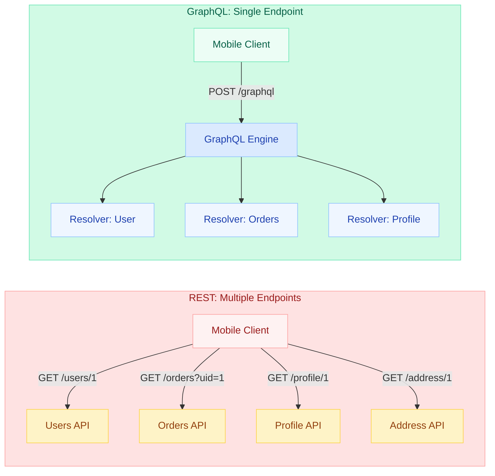
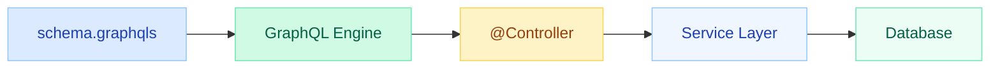
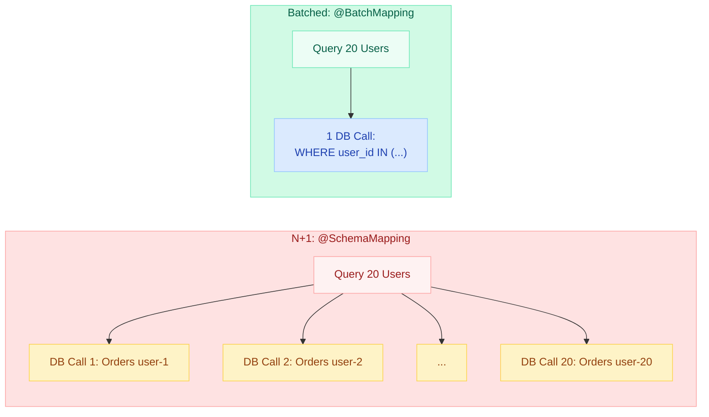
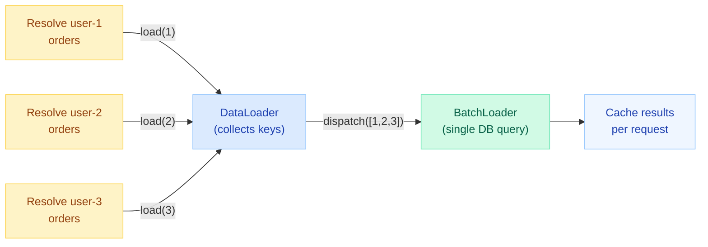
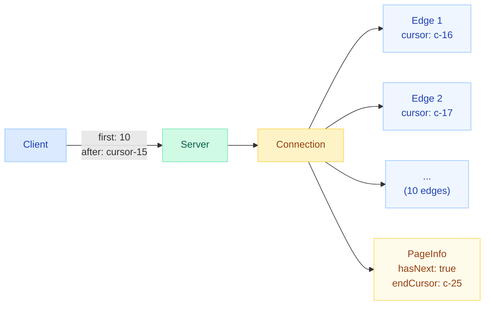

# GraphQL with Spring

> A REST API returns 50 fields for a User endpoint. Your mobile app needs 3. Every screen requires 4 separate calls. Bandwidth bleeds, latency stacks, and your backend team maintains 12 "slim" DTOs per entity. GraphQL eliminates this: one query, exact data, zero waste.

---

## GraphQL vs REST — The Architecture Shift



| Aspect | REST | GraphQL |
|---|---|---|
| **Requests for one screen** | 4 separate calls | 1 query |
| **Data transferred** | 50 fields x 4 responses | Only requested fields |
| **New client need** | New endpoint or DTO | Same schema, different query |
| **Versioning** | `/v1/`, `/v2/` URL paths | Deprecate fields, add new ones |
| **Caching** | HTTP cache per URL | Normalized client cache (Apollo) |

---

## Spring for GraphQL — Schema-First Approach

Spring for GraphQL (since Spring Boot 3.x) follows a **schema-first** philosophy: you define your API contract in `.graphqls` files, then implement resolvers in Java.



### Dependency Setup

```xml
<dependency>
    <groupId>org.springframework.boot</groupId>
    <artifactId>spring-boot-starter-graphql</artifactId>
</dependency>
<dependency>
    <groupId>org.springframework.boot</groupId>
    <artifactId>spring-boot-starter-web</artifactId>
</dependency>
```

```yaml
spring:
  graphql:
    graphiql:
      enabled: true        # GraphiQL UI at /graphiql
    schema:
      locations: classpath:graphql/   # Where .graphqls files live
      printer:
        enabled: true      # Expose schema at /graphql/schema
```

---

## Schema Definition (.graphqls Files)

Place schema files in `src/main/resources/graphql/`. Spring merges all `.graphqls` files automatically.

### Types

```graphql
type User {
    id: ID!
    name: String!
    email: String!
    role: Role!
    orders: [Order!]!
    profile: Profile
    createdAt: String!
}

type Order {
    id: ID!
    status: OrderStatus!
    total: Float!
    items: [OrderItem!]!
    createdAt: String!
}

type Profile {
    bio: String
    avatarUrl: String
    socialLinks: [String!]
}

enum Role {
    ADMIN
    USER
    MODERATOR
}

enum OrderStatus {
    PENDING
    CONFIRMED
    SHIPPED
    DELIVERED
    CANCELLED
}
```

### Queries

```graphql
type Query {
    user(id: ID!): User
    users(page: Int = 0, size: Int = 20): UserConnection!
    searchUsers(name: String!): [User!]!
}
```

### Mutations

```graphql
type Mutation {
    createUser(input: CreateUserInput!): User!
    updateUser(id: ID!, input: UpdateUserInput!): User!
    deleteUser(id: ID!): Boolean!
    placeOrder(input: PlaceOrderInput!): Order!
}

input CreateUserInput {
    name: String!
    email: String!
    role: Role = USER
}

input UpdateUserInput {
    name: String
    email: String
    role: Role
}

input PlaceOrderInput {
    userId: ID!
    items: [OrderItemInput!]!
}

input OrderItemInput {
    productId: ID!
    quantity: Int!
}
```

### Subscriptions

```graphql
type Subscription {
    orderStatusChanged(userId: ID!): Order!
    newNotification(userId: ID!): Notification!
}

type Notification {
    id: ID!
    message: String!
    type: NotificationType!
    createdAt: String!
}

enum NotificationType {
    ORDER_UPDATE
    PROMOTION
    SYSTEM
}
```

---

## @Controller with Mapping Annotations

Spring for GraphQL uses familiar `@Controller` classes with specialized mapping annotations.

### @QueryMapping

```java
@Controller
@RequiredArgsConstructor
public class UserController {

    private final UserService userService;

    @QueryMapping
    public User user(@Argument ID id) {
        return userService.findById(id);
    }

    @QueryMapping
    public List<User> searchUsers(@Argument String name) {
        return userService.searchByName(name);
    }
}
```

### @MutationMapping

```java
@Controller
@RequiredArgsConstructor
public class UserMutationController {

    private final UserService userService;

    @MutationMapping
    public User createUser(@Argument CreateUserInput input) {
        return userService.create(input);
    }

    @MutationMapping
    public User updateUser(@Argument ID id, @Argument UpdateUserInput input) {
        return userService.update(id, input);
    }

    @MutationMapping
    public boolean deleteUser(@Argument ID id) {
        return userService.delete(id);
    }
}
```

### @SubscriptionMapping

```java
@Controller
@RequiredArgsConstructor
public class OrderSubscriptionController {

    private final OrderEventPublisher orderEventPublisher;

    @SubscriptionMapping
    public Flux<Order> orderStatusChanged(@Argument ID userId) {
        return orderEventPublisher.getOrderUpdates(userId);
    }

    @SubscriptionMapping
    public Flux<Notification> newNotification(@Argument ID userId) {
        return orderEventPublisher.getNotifications(userId);
    }
}
```

!!! info "Method Naming Convention"
    The method name must match the schema field name. `@QueryMapping` on `user()` maps to `Query.user`. You can override with `@QueryMapping("customName")`.

---

## @SchemaMapping and @BatchMapping

### @SchemaMapping — Resolving Nested Fields

When a `User` has an `orders` field, Spring needs to know how to fetch it. `@SchemaMapping` connects a field on a parent type to a resolver method.

```java
@Controller
@RequiredArgsConstructor
public class UserFieldController {

    private final OrderService orderService;
    private final ProfileService profileService;

    @SchemaMapping(typeName = "User", field = "orders")
    public List<Order> orders(User user) {
        return orderService.findByUserId(user.getId());
    }

    @SchemaMapping(typeName = "User", field = "profile")
    public Profile profile(User user) {
        return profileService.findByUserId(user.getId());
    }
}
```

!!! danger "N+1 Problem"
    If you query 20 users with their orders, `@SchemaMapping` fires 20 separate DB calls. This is the GraphQL N+1 problem. The solution: `@BatchMapping`.

### @BatchMapping — Solving N+1

`@BatchMapping` receives ALL parent objects at once, allowing a single batch query.

```java
@Controller
@RequiredArgsConstructor
public class UserBatchController {

    private final OrderService orderService;
    private final ProfileService profileService;

    @BatchMapping(typeName = "User", field = "orders")
    public Map<User, List<Order>> orders(List<User> users) {
        List<Long> userIds = users.stream()
            .map(User::getId)
            .toList();

        // Single query: SELECT * FROM orders WHERE user_id IN (?, ?, ...)
        Map<Long, List<Order>> ordersByUserId = orderService.findByUserIds(userIds);

        return users.stream()
            .collect(Collectors.toMap(
                Function.identity(),
                user -> ordersByUserId.getOrDefault(user.getId(), List.of())
            ));
    }

    @BatchMapping(typeName = "User", field = "profile")
    public Map<User, Profile> profile(List<User> users) {
        List<Long> userIds = users.stream()
            .map(User::getId)
            .toList();

        Map<Long, Profile> profilesByUserId = profileService.findByUserIds(userIds);

        return users.stream()
            .collect(Collectors.toMap(
                Function.identity(),
                user -> profilesByUserId.get(user.getId())
            ));
    }
}
```



---

## DataFetcher and DataLoader

For even more control, Spring for GraphQL integrates with the DataLoader pattern from the GraphQL Java library.

### DataLoader — Batching + Caching

DataLoader collects individual load requests within a single execution, then dispatches them as one batch. It also caches results within the request scope.

```java
@Configuration
public class DataLoaderConfig {

    @Bean
    public BatchLoaderRegistry batchLoaderRegistry(
            OrderService orderService,
            ProfileService profileService) {

        BatchLoaderRegistry registry = new DefaultBatchLoaderRegistry();

        // Register a batch loader for orders
        registry.forTypePair(Long.class, List.class)
            .withName("ordersLoader")
            .registerMappedBatchLoader((userIds, env) -> {
                Map<Long, List<Order>> ordersByUser = orderService.findByUserIds(userIds);
                return Mono.just(ordersByUser);
            });

        return registry;
    }
}
```

### Using DataLoader in a Controller

```java
@Controller
public class UserFieldController {

    @SchemaMapping(typeName = "User", field = "orders")
    public CompletableFuture<List<Order>> orders(
            User user, DataLoader<Long, List<Order>> ordersLoader) {
        return ordersLoader.load(user.getId());
    }
}
```

### How DataLoader Works Internally



| Feature | @BatchMapping | DataLoader |
|---|---|---|
| **Simplicity** | Higher (annotation-based) | Lower (manual config) |
| **Caching** | No per-request cache | Caches within request |
| **Control** | Less | Full control over dispatch |
| **Async** | Returns Map | Returns CompletableFuture |
| **Use when** | Simple batch scenarios | Complex graphs, deep nesting |

!!! tip "@BatchMapping vs DataLoader"
    Start with `@BatchMapping`. It handles 90% of N+1 cases. Upgrade to DataLoader only when you need per-request caching or complex dispatch timing.

---

## Error Handling

### @GraphQlExceptionHandler

Spring for GraphQL provides a structured way to handle errors and return them in the GraphQL `errors` array.

```java
@ControllerAdvice
public class GraphQlExceptionAdvice {

    @GraphQlExceptionHandler
    public GraphQlError handleNotFound(EntityNotFoundException ex) {
        return GraphQlError.newError()
            .errorType(ErrorType.NOT_FOUND)
            .message(ex.getMessage())
            .build();
    }

    @GraphQlExceptionHandler
    public GraphQlError handleValidation(ValidationException ex) {
        return GraphQlError.newError()
            .errorType(ErrorType.BAD_REQUEST)
            .message(ex.getMessage())
            .extensions(Map.of("field", ex.getField()))
            .build();
    }

    @GraphQlExceptionHandler
    public GraphQlError handleUnauthorized(AccessDeniedException ex) {
        return GraphQlError.newError()
            .errorType(ErrorType.UNAUTHORIZED)
            .message("Access denied")
            .build();
    }

    @GraphQlExceptionHandler
    public GraphQlError handleGeneric(Exception ex) {
        log.error("Unexpected GraphQL error", ex);
        return GraphQlError.newError()
            .errorType(ErrorType.INTERNAL_ERROR)
            .message("Internal server error")
            .build();
    }
}
```

### Error Response Format

GraphQL errors follow a standard structure:

```json
{
  "data": { "user": null },
  "errors": [
    {
      "message": "User not found with id: 42",
      "locations": [{ "line": 2, "column": 3 }],
      "path": ["user"],
      "extensions": {
        "classification": "NOT_FOUND"
      }
    }
  ]
}
```

### Partial Results

Unlike REST (all-or-nothing), GraphQL can return **partial data**. If one field resolver fails, other fields still resolve successfully.

```java
@SchemaMapping(typeName = "User", field = "orders")
public List<Order> orders(User user) {
    try {
        return orderService.findByUserId(user.getId());
    } catch (ServiceUnavailableException ex) {
        // Return empty + add error to response
        throw new GraphqlErrorException.Builder()
            .message("Order service temporarily unavailable")
            .errorClassification(ErrorType.INTERNAL_ERROR)
            .build();
    }
    // User data still returned; orders field is null with error
}
```

---

## Security Integration

### Method-Level Security

```java
@Controller
@RequiredArgsConstructor
public class AdminController {

    private final UserService userService;

    @PreAuthorize("hasRole('ADMIN')")
    @QueryMapping
    public List<User> allUsers() {
        return userService.findAll();
    }

    @PreAuthorize("hasRole('ADMIN')")
    @MutationMapping
    public boolean deleteUser(@Argument ID id) {
        return userService.delete(id);
    }

    @PreAuthorize("#id == authentication.principal.id or hasRole('ADMIN')")
    @QueryMapping
    public User user(@Argument ID id) {
        return userService.findById(id);
    }
}
```

### Authentication Context in Resolvers

```java
@Controller
@RequiredArgsConstructor
public class ProfileController {

    private final ProfileService profileService;

    @QueryMapping
    public Profile myProfile(
            @AuthenticationPrincipal UserDetails principal) {
        return profileService.findByUsername(principal.getUsername());
    }

    @MutationMapping
    public Profile updateMyProfile(
            @Argument UpdateProfileInput input,
            @AuthenticationPrincipal UserDetails principal) {
        return profileService.update(principal.getUsername(), input);
    }
}
```

### Security Configuration

```java
@Configuration
@EnableMethodSecurity
public class SecurityConfig {

    @Bean
    public SecurityFilterChain filterChain(HttpSecurity http) throws Exception {
        return http
            .csrf(csrf -> csrf.disable())
            .authorizeHttpRequests(auth -> auth
                .requestMatchers("/graphiql").permitAll()
                .requestMatchers("/graphql").authenticated()
            )
            .oauth2ResourceServer(oauth2 -> oauth2.jwt(Customizer.withDefaults()))
            .build();
    }
}
```

!!! warning "GraphQL and Authorization Granularity"
    A single `/graphql` endpoint serves all queries. You cannot rely on URL-based authorization. Use **field-level** security via `@PreAuthorize` or custom directives. Never expose admin fields without method security.

---

## Pagination — Connection/Edge/Node Pattern

The Relay-style cursor-based pagination is the standard for GraphQL APIs.

### Schema

```graphql
type Query {
    users(first: Int, after: String, last: Int, before: String): UserConnection!
}

type UserConnection {
    edges: [UserEdge!]!
    pageInfo: PageInfo!
    totalCount: Int!
}

type UserEdge {
    node: User!
    cursor: String!
}

type PageInfo {
    hasNextPage: Boolean!
    hasPreviousPage: Boolean!
    startCursor: String
    endCursor: String
}
```

### Controller Implementation

```java
@Controller
@RequiredArgsConstructor
public class UserPaginationController {

    private final UserService userService;

    @QueryMapping
    public Connection<User> users(
            @Argument int first,
            @Argument String after) {

        String decodedCursor = after != null
            ? new String(Base64.getDecoder().decode(after))
            : null;

        Slice<User> slice = userService.findUsers(decodedCursor, first);

        List<Edge<User>> edges = slice.getContent().stream()
            .map(user -> new DefaultEdge<>(
                user,
                ConnectionCursor.from(
                    Base64.getEncoder().encodeToString(user.getId().toString().getBytes())
                )
            ))
            .toList();

        PageInfo pageInfo = new DefaultPageInfo(
            edges.isEmpty() ? null : edges.get(0).getCursor(),
            edges.isEmpty() ? null : edges.get(edges.size() - 1).getCursor(),
            after != null,
            slice.hasNext()
        );

        return new DefaultConnection<>(edges, pageInfo);
    }
}
```

### Client Query Example

```graphql
query {
    users(first: 10, after: "Y3Vyc29yOjE1") {
        edges {
            node {
                id
                name
                email
            }
            cursor
        }
        pageInfo {
            hasNextPage
            endCursor
        }
        totalCount
    }
}
```



!!! tip "Cursor vs Offset Pagination"
    **Offset** (`page=3&size=20`): simple but breaks when data inserts/deletes between pages. **Cursor** (`after=abc123`): stable regardless of inserts/deletes, works well with infinite scroll. GraphQL community strongly prefers cursor-based.

---

## Testing: GraphQlTester and HttpGraphQlTester

### Unit Testing with GraphQlTester

```java
@GraphQlTest(UserController.class)
class UserControllerTest {

    @Autowired
    private GraphQlTester graphQlTester;

    @MockBean
    private UserService userService;

    @Test
    void shouldReturnUser() {
        User user = new User(1L, "Alice", "alice@test.com", Role.USER);
        when(userService.findById(1L)).thenReturn(user);

        graphQlTester.document("""
                query {
                    user(id: 1) {
                        id
                        name
                        email
                    }
                }
            """)
            .execute()
            .path("user.name").entity(String.class).isEqualTo("Alice")
            .path("user.email").entity(String.class).isEqualTo("alice@test.com");
    }

    @Test
    void shouldReturnErrorForMissingUser() {
        when(userService.findById(99L)).thenThrow(new EntityNotFoundException("Not found"));

        graphQlTester.document("""
                query {
                    user(id: 99) { id name }
                }
            """)
            .execute()
            .errors()
            .expect(error -> error.getMessage().contains("Not found"));
    }
}
```

### Integration Testing with HttpGraphQlTester

```java
@SpringBootTest(webEnvironment = WebEnvironment.RANDOM_PORT)
@AutoConfigureHttpGraphQlTester
class UserIntegrationTest {

    @Autowired
    private HttpGraphQlTester httpGraphQlTester;

    @Test
    void shouldCreateAndQueryUser() {
        // Create
        httpGraphQlTester.document("""
                mutation {
                    createUser(input: { name: "Bob", email: "bob@test.com" }) {
                        id
                        name
                    }
                }
            """)
            .execute()
            .path("createUser.name").entity(String.class).isEqualTo("Bob");

        // Query
        httpGraphQlTester.document("""
                query {
                    searchUsers(name: "Bob") {
                        id
                        name
                        email
                    }
                }
            """)
            .execute()
            .path("searchUsers[0].name").entity(String.class).isEqualTo("Bob");
    }

    @Test
    void shouldPaginate() {
        httpGraphQlTester.document("""
                query {
                    users(first: 5) {
                        edges {
                            node { id name }
                            cursor
                        }
                        pageInfo {
                            hasNextPage
                            endCursor
                        }
                    }
                }
            """)
            .execute()
            .path("users.edges").entityList(Object.class).hasSizeGreaterThan(0)
            .path("users.pageInfo.hasNextPage").entity(Boolean.class).isEqualTo(true);
    }
}
```

### Testing Subscriptions

```java
@GraphQlTest(OrderSubscriptionController.class)
class SubscriptionTest {

    @Autowired
    private GraphQlTester graphQlTester;

    @MockBean
    private OrderEventPublisher publisher;

    @Test
    void shouldStreamOrderUpdates() {
        Order order = new Order(1L, OrderStatus.SHIPPED, 99.99);
        when(publisher.getOrderUpdates(1L)).thenReturn(Flux.just(order));

        graphQlTester.document("""
                subscription {
                    orderStatusChanged(userId: 1) {
                        id
                        status
                    }
                }
            """)
            .executeSubscription()
            .toFlux("orderStatusChanged", Order.class)
            .as(StepVerifier::create)
            .expectNextMatches(o -> o.getStatus() == OrderStatus.SHIPPED)
            .verifyComplete();
    }
}
```

---

## Quick Recall

| Concept | Key Point |
|---|---|
| **Schema-first** | Define `.graphqls` files first, implement resolvers in Java |
| **@QueryMapping** | Maps to `Query` type fields in schema |
| **@MutationMapping** | Maps to `Mutation` type fields |
| **@SubscriptionMapping** | Returns `Flux<T>` for real-time streaming |
| **@SchemaMapping** | Resolves nested fields on parent types |
| **@BatchMapping** | Solves N+1 by receiving all parents at once |
| **DataLoader** | Batching + per-request caching for deep graphs |
| **Error handling** | `@GraphQlExceptionHandler` returns structured errors |
| **Security** | `@PreAuthorize` on resolvers, not on URLs |
| **Pagination** | Connection/Edge/Node pattern with cursors |
| **Testing** | `@GraphQlTest` + `GraphQlTester` for unit; `HttpGraphQlTester` for integration |

---

## Interview Template

??? question "1. Why choose Spring for GraphQL over building a REST API?"
    GraphQL solves over-fetching (REST returns unused fields), under-fetching (multiple round trips), and endpoint explosion (custom DTOs per client). Spring for GraphQL provides schema-first design, annotation-based resolvers (`@QueryMapping`, `@MutationMapping`), built-in N+1 solution (`@BatchMapping`), and seamless Spring Security integration. Use it when multiple clients need different data shapes from the same domain.

??? question "2. How does @BatchMapping solve the N+1 problem?"
    Without batching, fetching 20 users with orders triggers 20 separate DB queries (one per user). `@BatchMapping` collects all parent objects into a `List<User>`, so you execute ONE query (`WHERE user_id IN (...)`) and return a `Map<User, List<Order>>`. Spring dispatches results to the correct parent. This is the equivalent of DataLoader in other GraphQL frameworks.

??? question "3. Explain the Connection/Edge/Node pagination pattern."
    Standard Relay-style pagination. `Connection` wraps a list of `Edges` + `PageInfo`. Each `Edge` has a `node` (the actual data) and a `cursor` (opaque pointer). `PageInfo` has `hasNextPage`, `hasPreviousPage`, `startCursor`, `endCursor`. Client passes `first: 10, after: "cursor"` for forward pagination. Unlike offset-based, cursor-based pagination is stable under concurrent inserts/deletes.

??? question "4. How do you handle errors in Spring GraphQL?"
    Use `@GraphQlExceptionHandler` in a `@ControllerAdvice`. Map domain exceptions to `GraphQlError` with appropriate `ErrorType` (NOT_FOUND, BAD_REQUEST, UNAUTHORIZED). GraphQL supports partial results: if one field fails, other fields still resolve. The response includes both `data` (partial) and `errors` array. Never expose stack traces to clients.

??? question "5. How do you secure a GraphQL API?"
    Since there is only one URL (`/graphql`), URL-based security is insufficient. Apply `@PreAuthorize` or `@Secured` at the resolver method level. Access `@AuthenticationPrincipal` in resolver parameters. Configure `SecurityFilterChain` to require authentication for `/graphql` but allow `/graphiql` in dev. For field-level authorization, use custom directives or check permissions inside resolvers.

??? question "6. What is the difference between @SchemaMapping and @BatchMapping?"
    `@SchemaMapping` resolves one parent at a time: for 20 users, it fires 20 times. `@BatchMapping` receives all 20 parents in a single invocation, enabling one batch query. Use `@SchemaMapping` for fields that do not cause N+1 (e.g., computed fields). Use `@BatchMapping` for any field that triggers a DB or service call per parent.

??? question "7. How do subscriptions work in Spring GraphQL?"
    Annotate a method with `@SubscriptionMapping` returning `Flux<T>`. The framework establishes a WebSocket connection (using `graphql-ws` protocol). The server pushes events as the Flux emits. Common patterns: use `Sinks.Many` or Spring Application Events to publish updates, and filter the flux by user ID in the resolver.

??? question "8. Explain DataLoader batching and caching."
    DataLoader collects individual `load(key)` calls within a single GraphQL execution, then dispatches them as one batch (`loadMany`). Results are cached per-request (not globally) so the same entity requested in two different parts of the query only hits the DB once. In Spring, register via `BatchLoaderRegistry` and inject `DataLoader<K,V>` into resolver methods.
