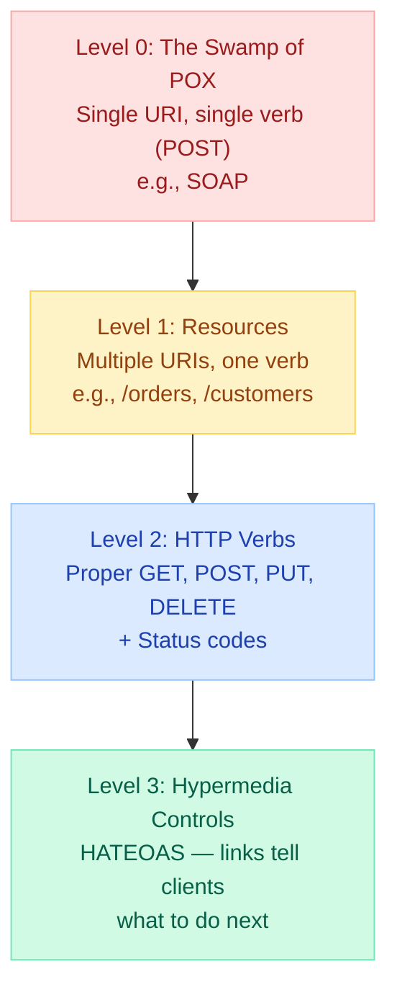
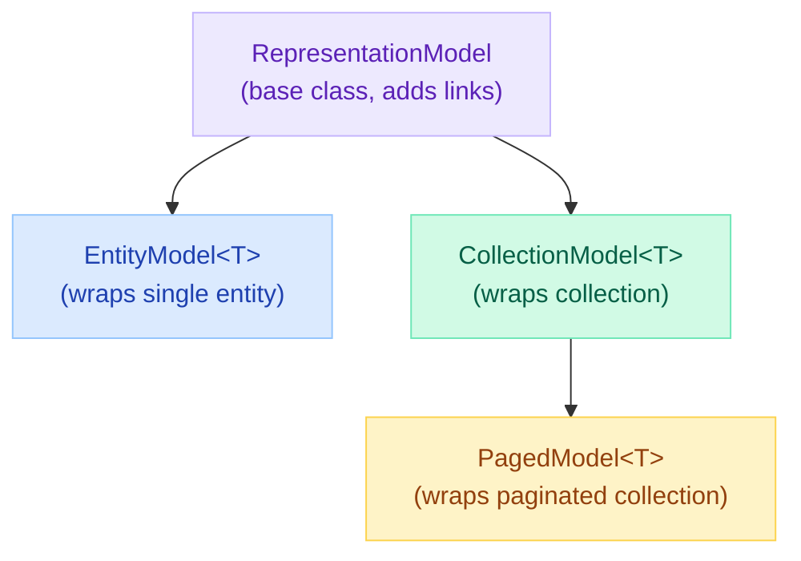
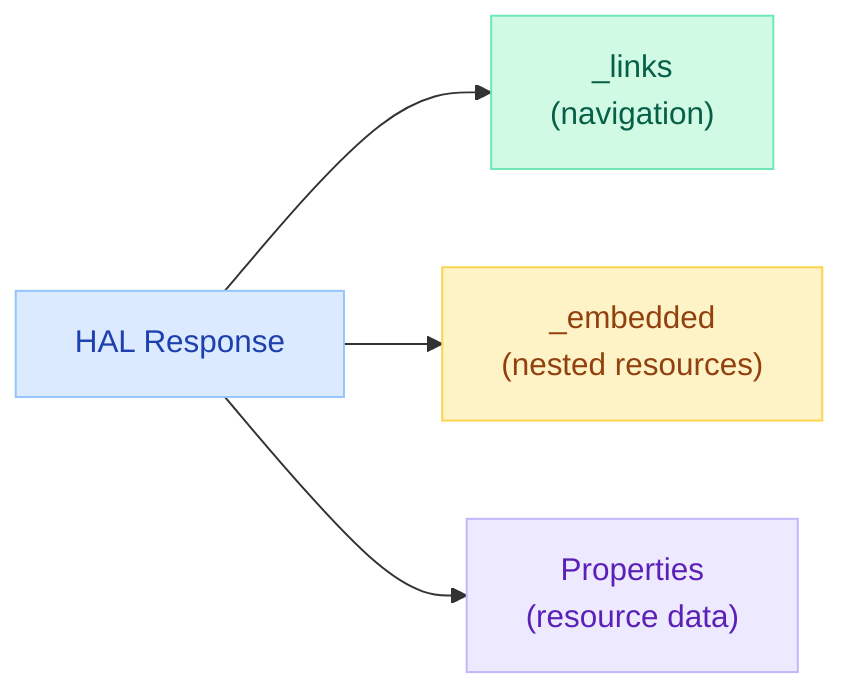

# Spring HATEOAS — Hypermedia-Driven REST APIs

> **The Problem:** Your REST API returns flat JSON. Clients hardcode URLs, break on every path change, and have no idea what actions are available. HATEOAS makes APIs self-documenting and evolvable — clients follow links instead of constructing URLs.

---

!!! abstract "Real-World Analogy"
    A website is HATEOAS. You land on a homepage and click links to navigate. You never type URLs manually. Each page tells you what you can do next. HATEOAS brings this same discoverability to REST APIs.

---

## Richardson Maturity Model

Leonard Richardson defined four levels of REST maturity. HATEOAS is Level 3 — the highest level.



| Level | Description | Example |
|---|---|---|
| **0** | Single endpoint, POST everything | `POST /api` with action in body |
| **1** | Individual resources with URIs | `GET /orders/123` |
| **2** | HTTP verbs + status codes | `DELETE /orders/123` returns `204` |
| **3** | Hypermedia links in responses | Response includes `_links` with available actions |

---

## What is HATEOAS?

**H**ypermedia **A**s **T**he **E**ngine **O**f **A**pplication **S**tate

The principle: API responses include links that tell the client what transitions (actions) are available from the current state.

### Without HATEOAS

```json
{
  "id": 123,
  "status": "PENDING",
  "total": 99.99,
  "customerId": 456
}
```

Client must know: How do I cancel? How do I pay? What URL to use? What method?

### With HATEOAS

```json
{
  "id": 123,
  "status": "PENDING",
  "total": 99.99,
  "customerId": 456,
  "_links": {
    "self": { "href": "/api/orders/123" },
    "cancel": { "href": "/api/orders/123/cancel", "method": "POST" },
    "pay": { "href": "/api/orders/123/payment", "method": "POST" },
    "customer": { "href": "/api/customers/456" }
  }
}
```

Client discovers: I can cancel, pay, or view customer. No hardcoded URLs needed.

---

## Spring HATEOAS Core Classes



| Class | Purpose | Use When |
|---|---|---|
| `RepresentationModel` | Base class; extend to add links to custom models | Building custom representation classes |
| `EntityModel<T>` | Wraps a single domain object with links | Returning a single resource |
| `CollectionModel<T>` | Wraps a collection of entities with links | Returning a list of resources |
| `PagedModel<T>` | Extends CollectionModel with pagination metadata | Paginated collections |
| `Link` | Represents a hypermedia link (rel + href) | Building individual links |
| `Links` | Collection of Link objects | Grouping related links |

---

## Setting Up Spring HATEOAS

### Dependency

```xml
<dependency>
    <groupId>org.springframework.boot</groupId>
    <artifactId>spring-boot-starter-hateoas</artifactId>
</dependency>
```

### Domain Model

```java
@Entity
public class Order {
    @Id @GeneratedValue
    private Long id;
    private String description;
    private BigDecimal total;

    @Enumerated(EnumType.STRING)
    private OrderStatus status; // PENDING, PAID, SHIPPED, CANCELLED

    @ManyToOne
    private Customer customer;

    // getters, setters, constructors
}

public enum OrderStatus {
    PENDING, PAID, SHIPPED, DELIVERED, CANCELLED
}
```

---

## Building Links with WebMvcLinkBuilder

`WebMvcLinkBuilder` generates links by pointing to controller methods — fully type-safe and refactoring-friendly.

```java
import static org.springframework.hateoas.server.mvc.WebMvcLinkBuilder.*;

@Component
public class OrderModelAssembler implements RepresentationModelAssembler<Order, EntityModel<Order>> {

    @Override
    public EntityModel<Order> toModel(Order order) {
        EntityModel<Order> model = EntityModel.of(order);

        // Self link (always present)
        model.add(linkTo(methodOn(OrderController.class).getOrder(order.getId()))
            .withSelfRel());

        // Collection link
        model.add(linkTo(methodOn(OrderController.class).getAllOrders())
            .withRel("orders"));

        // Conditional links based on state
        if (order.getStatus() == OrderStatus.PENDING) {
            model.add(linkTo(methodOn(OrderController.class).cancelOrder(order.getId()))
                .withRel("cancel"));
            model.add(linkTo(methodOn(OrderController.class).payOrder(order.getId(), null))
                .withRel("pay"));
        }

        if (order.getStatus() == OrderStatus.PAID) {
            model.add(linkTo(methodOn(OrderController.class).shipOrder(order.getId()))
                .withRel("ship"));
        }

        // Related resource link
        if (order.getCustomer() != null) {
            model.add(linkTo(methodOn(CustomerController.class)
                .getCustomer(order.getCustomer().getId()))
                .withRel("customer"));
        }

        return model;
    }
}
```

### Key `WebMvcLinkBuilder` Methods

| Method | Purpose | Example |
|---|---|---|
| `linkTo(Class)` | Link to controller class | `linkTo(OrderController.class)` |
| `methodOn(Class)` | Type-safe method reference | `methodOn(OrderController.class).getOrder(id)` |
| `withSelfRel()` | Creates `self` relation | Standard self-referencing link |
| `withRel("name")` | Creates named relation | `withRel("cancel")`, `withRel("customer")` |
| `slash("path")` | Append path segment | `linkTo(OrderController.class).slash(id)` |
| `afford()` | Add affordance (HTTP method hint) | See Affordances section |

---

## Full CRUD Controller with Hypermedia Links

```java
@RestController
@RequestMapping("/api/orders")
public class OrderController {

    private final OrderService orderService;
    private final OrderModelAssembler assembler;
    private final PagedResourcesAssembler<Order> pagedAssembler;

    public OrderController(OrderService orderService,
                           OrderModelAssembler assembler,
                           PagedResourcesAssembler<Order> pagedAssembler) {
        this.orderService = orderService;
        this.assembler = assembler;
        this.pagedAssembler = pagedAssembler;
    }

    // GET /api/orders/{id}
    @GetMapping("/{id}")
    public EntityModel<Order> getOrder(@PathVariable Long id) {
        Order order = orderService.findById(id)
            .orElseThrow(() -> new OrderNotFoundException(id));
        return assembler.toModel(order);
    }

    // GET /api/orders
    @GetMapping
    public CollectionModel<EntityModel<Order>> getAllOrders() {
        List<EntityModel<Order>> orders = orderService.findAll().stream()
            .map(assembler::toModel)
            .toList();

        return CollectionModel.of(orders,
            linkTo(methodOn(OrderController.class).getAllOrders()).withSelfRel(),
            linkTo(methodOn(OrderController.class).createOrder(null)).withRel("create"));
    }

    // GET /api/orders/paged?page=0&size=20
    @GetMapping("/paged")
    public PagedModel<EntityModel<Order>> getOrdersPaged(Pageable pageable) {
        Page<Order> page = orderService.findAll(pageable);
        return pagedAssembler.toModel(page, assembler);
    }

    // POST /api/orders
    @PostMapping
    public ResponseEntity<EntityModel<Order>> createOrder(
            @RequestBody @Valid OrderRequest request) {
        Order order = orderService.create(request);
        EntityModel<Order> model = assembler.toModel(order);

        return ResponseEntity
            .created(model.getRequiredLink(IanaLinkRelations.SELF).toUri())
            .body(model);
    }

    // POST /api/orders/{id}/cancel
    @PostMapping("/{id}/cancel")
    public ResponseEntity<EntityModel<Order>> cancelOrder(@PathVariable Long id) {
        Order order = orderService.cancel(id);
        return ResponseEntity.ok(assembler.toModel(order));
    }

    // POST /api/orders/{id}/payment
    @PostMapping("/{id}/payment")
    public ResponseEntity<EntityModel<Order>> payOrder(
            @PathVariable Long id,
            @RequestBody PaymentRequest payment) {
        Order order = orderService.pay(id, payment);
        return ResponseEntity.ok(assembler.toModel(order));
    }

    // POST /api/orders/{id}/ship
    @PostMapping("/{id}/ship")
    public ResponseEntity<EntityModel<Order>> shipOrder(@PathVariable Long id) {
        Order order = orderService.ship(id);
        return ResponseEntity.ok(assembler.toModel(order));
    }
}
```

### Response Example (PENDING order)

```json
{
  "id": 123,
  "description": "Electronics bundle",
  "total": 299.99,
  "status": "PENDING",
  "_links": {
    "self": { "href": "http://localhost:8080/api/orders/123" },
    "orders": { "href": "http://localhost:8080/api/orders" },
    "cancel": { "href": "http://localhost:8080/api/orders/123/cancel" },
    "pay": { "href": "http://localhost:8080/api/orders/123/payment" },
    "customer": { "href": "http://localhost:8080/api/customers/456" }
  }
}
```

### Response Example (PAID order — different links!)

```json
{
  "id": 123,
  "description": "Electronics bundle",
  "total": 299.99,
  "status": "PAID",
  "_links": {
    "self": { "href": "http://localhost:8080/api/orders/123" },
    "orders": { "href": "http://localhost:8080/api/orders" },
    "ship": { "href": "http://localhost:8080/api/orders/123/ship" },
    "customer": { "href": "http://localhost:8080/api/customers/456" }
  }
}
```

Notice: `cancel` and `pay` links disappeared, `ship` appeared. The API itself communicates valid state transitions.

---

## HAL Format (application/hal+json)

Spring HATEOAS defaults to **HAL** (Hypertext Application Language) format. HAL uses `_links` and `_embedded` keys.



### Collection Response in HAL

```json
{
  "_embedded": {
    "orderList": [
      {
        "id": 1,
        "total": 99.99,
        "status": "PENDING",
        "_links": {
          "self": { "href": "/api/orders/1" },
          "cancel": { "href": "/api/orders/1/cancel" }
        }
      },
      {
        "id": 2,
        "total": 149.99,
        "status": "SHIPPED",
        "_links": {
          "self": { "href": "/api/orders/2" }
        }
      }
    ]
  },
  "_links": {
    "self": { "href": "/api/orders" },
    "create": { "href": "/api/orders" }
  }
}
```

### Paginated Response in HAL

```json
{
  "_embedded": {
    "orderList": [ /* items */ ]
  },
  "_links": {
    "self": { "href": "/api/orders/paged?page=1&size=20" },
    "first": { "href": "/api/orders/paged?page=0&size=20" },
    "prev": { "href": "/api/orders/paged?page=0&size=20" },
    "next": { "href": "/api/orders/paged?page=2&size=20" },
    "last": { "href": "/api/orders/paged?page=5&size=20" }
  },
  "page": {
    "size": 20,
    "totalElements": 112,
    "totalPages": 6,
    "number": 1
  }
}
```

### Other Media Types

| Media Type | Format | Spring Support |
|---|---|---|
| `application/hal+json` | HAL (default) | Built-in |
| `application/hal-forms+json` | HAL-FORMS (with templates) | `spring-hateoas` |
| `application/vnd.collection+json` | Collection+JSON | Requires config |
| `application/uber+json` | UBER | Requires config |

---

## Affordances

Affordances describe WHAT you can DO with a link — the HTTP method, expected input, and media type. They extend links with metadata about supported operations.

```java
@GetMapping("/{id}")
public EntityModel<Order> getOrder(@PathVariable Long id) {
    Order order = orderService.findById(id).orElseThrow();

    Link selfLink = linkTo(methodOn(OrderController.class).getOrder(id))
        .withSelfRel()
        .andAffordance(afford(methodOn(OrderController.class).updateOrder(id, null)))
        .andAffordance(afford(methodOn(OrderController.class).cancelOrder(id)));

    return EntityModel.of(order, selfLink);
}
```

### HAL-FORMS Response with Affordances

```json
{
  "id": 123,
  "status": "PENDING",
  "_links": {
    "self": { "href": "/api/orders/123" }
  },
  "_templates": {
    "default": {
      "method": "PUT",
      "properties": [
        { "name": "description", "type": "text" },
        { "name": "total", "type": "number" }
      ]
    },
    "cancel": {
      "method": "POST",
      "target": "/api/orders/123/cancel",
      "properties": []
    }
  }
}
```

---

## Custom RepresentationModel

For complex resources, extend `RepresentationModel` directly:

```java
public class OrderSummaryModel extends RepresentationModel<OrderSummaryModel> {

    private final Long orderId;
    private final String status;
    private final BigDecimal total;
    private final String customerName;
    private final int itemCount;

    public OrderSummaryModel(Order order) {
        this.orderId = order.getId();
        this.status = order.getStatus().name();
        this.total = order.getTotal();
        this.customerName = order.getCustomer().getName();
        this.itemCount = order.getItems().size();
    }

    // getters...
}

// In controller
@GetMapping("/{id}/summary")
public OrderSummaryModel getOrderSummary(@PathVariable Long id) {
    Order order = orderService.findById(id).orElseThrow();
    OrderSummaryModel model = new OrderSummaryModel(order);

    model.add(linkTo(methodOn(OrderController.class).getOrder(id)).withRel("full"));
    model.add(linkTo(methodOn(OrderController.class).getOrderSummary(id)).withSelfRel());

    return model;
}
```

---

## Link Relations (IANA Standard)

Spring HATEOAS provides `IanaLinkRelations` constants for standard relation types:

| Relation | Meaning | Constant |
|---|---|---|
| `self` | The resource itself | `IanaLinkRelations.SELF` |
| `next` | Next page in collection | `IanaLinkRelations.NEXT` |
| `prev` | Previous page | `IanaLinkRelations.PREV` |
| `first` | First page | `IanaLinkRelations.FIRST` |
| `last` | Last page | `IanaLinkRelations.LAST` |
| `edit` | Editable form of resource | `IanaLinkRelations.EDIT` |
| `collection` | Parent collection | `IanaLinkRelations.COLLECTION` |
| `item` | Individual item in collection | `IanaLinkRelations.ITEM` |

Custom relations use `LinkRelation.of("cancel")` or simply string `"cancel"`.

---

## Testing HATEOAS Endpoints

```java
@WebMvcTest(OrderController.class)
class OrderControllerTest {

    @Autowired private MockMvc mockMvc;
    @MockBean private OrderService orderService;
    @Autowired private OrderModelAssembler assembler;

    @Test
    void shouldIncludeCancelLinkForPendingOrder() throws Exception {
        Order order = new Order(1L, "Test", BigDecimal.TEN, OrderStatus.PENDING);
        when(orderService.findById(1L)).thenReturn(Optional.of(order));

        mockMvc.perform(get("/api/orders/1").accept(MediaTypes.HAL_JSON))
            .andExpect(status().isOk())
            .andExpect(jsonPath("$.status").value("PENDING"))
            .andExpect(jsonPath("$._links.self.href").value(containsString("/orders/1")))
            .andExpect(jsonPath("$._links.cancel.href").value(containsString("/orders/1/cancel")))
            .andExpect(jsonPath("$._links.pay.href").exists());
    }

    @Test
    void shouldNotIncludeCancelLinkForShippedOrder() throws Exception {
        Order order = new Order(1L, "Test", BigDecimal.TEN, OrderStatus.SHIPPED);
        when(orderService.findById(1L)).thenReturn(Optional.of(order));

        mockMvc.perform(get("/api/orders/1").accept(MediaTypes.HAL_JSON))
            .andExpect(status().isOk())
            .andExpect(jsonPath("$._links.cancel").doesNotExist())
            .andExpect(jsonPath("$._links.ship").doesNotExist());
    }
}
```

---

## When to Use vs When It's Overkill

### Use HATEOAS When

| Scenario | Why |
|---|---|
| Public/external APIs | Clients you don't control need discoverability |
| Long-lived APIs | URL changes won't break clients following links |
| Complex state machines | Available actions depend on resource state |
| API-first companies | Evolvable APIs reduce version churn |
| Microservices with many consumers | Self-documenting reduces support burden |

### Skip HATEOAS When

| Scenario | Why |
|---|---|
| Internal service-to-service | Tight coupling is OK; overhead isn't worth it |
| Single frontend team | They know the API; links add payload bloat |
| Simple CRUD APIs | No complex state transitions to express |
| High-throughput APIs | Extra link serialization adds latency |
| Mobile apps with offline mode | Clients cache URLs anyway |
| GraphQL APIs | GraphQL has its own navigation model |

!!! tip "Pragmatic Approach"
    Most teams benefit from Level 2 (proper HTTP verbs + status codes) without full Level 3. Add HATEOAS selectively to resources with complex state machines (orders, workflows, approvals).

---

## Interview Questions

??? question "Q: What is HATEOAS and what problem does it solve?"
    HATEOAS (Hypermedia As The Engine Of Application State) is a REST architectural constraint where API responses include hyperlinks that indicate available actions from the current state.

    Problems it solves: (1) Clients don't hardcode URLs — they follow links, so server can change URL structure without breaking clients. (2) Clients discover available operations from the response — no out-of-band documentation needed. (3) State-dependent actions are explicit — a SHIPPED order won't have a "cancel" link.

    Example: An order response includes `_links.cancel` only when cancellation is possible. The client enables/disables the cancel button based on link presence, not status field parsing.

??? question "Q: Explain the Richardson Maturity Model levels 0 through 3."
    - **Level 0 (Swamp of POX)**: Single endpoint, single verb. Everything is POST to `/api`. Like RPC over HTTP (SOAP).
    - **Level 1 (Resources)**: Multiple URIs representing resources (`/orders/123`, `/customers/456`). Still may use only POST.
    - **Level 2 (HTTP Verbs)**: Proper use of GET, POST, PUT, DELETE + correct status codes (201 Created, 404 Not Found, 204 No Content). This is where most "REST" APIs stop.
    - **Level 3 (HATEOAS)**: Responses include hypermedia links indicating available state transitions. True REST per Roy Fielding's thesis.

    Most production APIs are Level 2. Level 3 adds discoverability and evolvability but at the cost of payload size and implementation complexity.

??? question "Q: How does Spring HATEOAS handle conditional links based on resource state?"
    In the `RepresentationModelAssembler.toModel()` method, you add links conditionally based on entity state:

    ```java
    if (order.getStatus() == OrderStatus.PENDING) {
        model.add(linkTo(methodOn(Controller.class).cancel(id)).withRel("cancel"));
    }
    ```

    This means: (1) PENDING orders get `cancel` and `pay` links. (2) PAID orders get `ship` link. (3) SHIPPED orders get `track` link. (4) CANCELLED/DELIVERED orders get no action links.

    The client uses link presence to determine available UI actions — no switch/case on status field needed. If the API adds a new action later, old clients simply ignore the unknown link relation.

??? question "Q: What is the difference between EntityModel, CollectionModel, and RepresentationModel in Spring HATEOAS?"
    - **`RepresentationModel`**: Base class that holds links. Extend it to create custom model classes with embedded link support.
    - **`EntityModel<T>`**: Wraps a single domain object (T) and adds `_links`. Use for single-resource endpoints (GET /orders/123).
    - **`CollectionModel<T>`**: Wraps a collection of EntityModels and adds collection-level `_links`. Use for list endpoints (GET /orders).
    - **`PagedModel<T>`**: Extends CollectionModel with pagination metadata (page number, total elements) and navigation links (next, prev, first, last).

    Rule of thumb: `EntityModel` for one, `CollectionModel` for many, `PagedModel` for paginated many.

---

## Quick Recall

| Concept | Key Point |
|---|---|
| **HATEOAS** | Responses include links to available actions |
| **Richardson Level 3** | Hypermedia controls — highest REST maturity |
| **HAL format** | `_links` + `_embedded` — default in Spring HATEOAS |
| **EntityModel** | Wraps single entity with links |
| **CollectionModel** | Wraps list with collection-level links |
| **WebMvcLinkBuilder** | Type-safe link generation from controller methods |
| **Affordances** | Describe HTTP methods and input types for links |
| **Conditional links** | Add links based on resource state in assembler |
| **When to use** | Public APIs, complex state machines, long-lived APIs |
| **When to skip** | Internal APIs, simple CRUD, high-throughput, GraphQL |

---

## See Also

- [REST API Best Practices](restapibestpractices.md) — Foundation for Level 2 REST
- [Spring MVC Request Lifecycle](mvc-request-lifecycle.md) — How requests reach controllers
- [Pagination & Sorting](pagination-sorting.md) — PagedModel integration
- [OpenAPI & Swagger](openapi-swagger.md) — Alternative API documentation approach
- [API Design](../apidesign/apidesign.md) — System design perspective on API design
