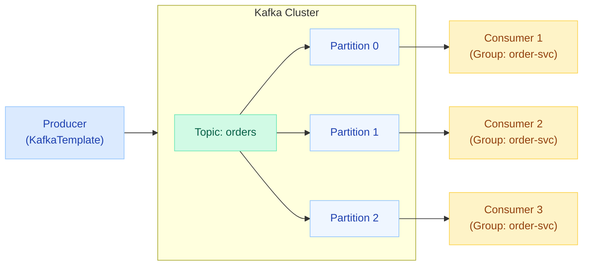
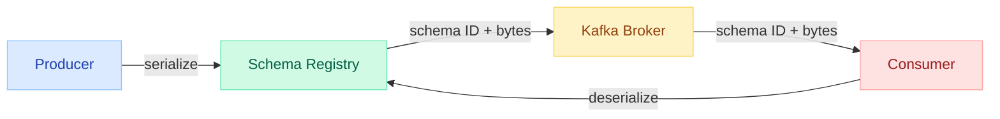
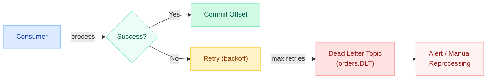
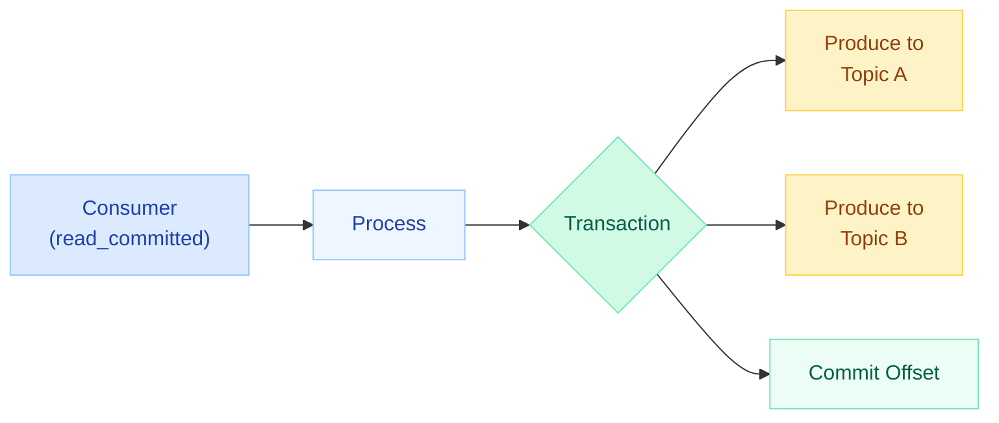

# Spring Kafka Integration

> **Building event-driven microservices with Apache Kafka and Spring Boot — producers, consumers, error handling, and exactly-once delivery.**

---

!!! danger "Real Incident: Consumer Lag Spike Causing Message Loss"
    A payments team enabled `enable.auto.commit=true` (the default). Under load, consumer lag spiked — offsets were committed **before** processing completed. When consumers restarted, they skipped thousands of unprocessed payment events. The fix: switch to `AckMode.MANUAL` and commit offsets only after successful processing. Auto-commit + slow processing = silent data loss.



---

## KafkaTemplate — Producing Messages

The primary abstraction for sending messages to Kafka.

### Basic Usage

```java
@Service
@RequiredArgsConstructor
public class OrderEventPublisher {

    private final KafkaTemplate<String, OrderEvent> kafkaTemplate;

    // Simple send — fire and forget
    public void publishOrderCreated(OrderEvent event) {
        kafkaTemplate.send("order-events", event.getOrderId(), event);
    }

    // Send to default topic (configured via spring.kafka.template.default-topic)
    public void publishDefault(OrderEvent event) {
        kafkaTemplate.sendDefault(event.getOrderId(), event);
    }

    // Full control with ProducerRecord
    public void publishWithHeaders(OrderEvent event) {
        ProducerRecord<String, OrderEvent> record = new ProducerRecord<>(
            "order-events",       // topic
            null,                 // partition (null = let partitioner decide)
            event.getOrderId(),   // key
            event,                // value
            List.of(new RecordHeader("event-type", "ORDER_CREATED".getBytes()))
        );
        kafkaTemplate.send(record);
    }

    // With callback — non-blocking confirmation
    public void publishWithCallback(OrderEvent event) {
        CompletableFuture<SendResult<String, OrderEvent>> future =
            kafkaTemplate.send("order-events", event.getOrderId(), event);

        future.whenComplete((result, ex) -> {
            if (ex != null) {
                log.error("Failed to send event: {}", event.getOrderId(), ex);
                // trigger retry or dead-letter
            } else {
                RecordMetadata metadata = result.getRecordMetadata();
                log.info("Sent to partition={} offset={}",
                    metadata.partition(), metadata.offset());
            }
        });
    }

    // Blocking send — wait for broker acknowledgment
    public void publishBlocking(OrderEvent event) throws Exception {
        SendResult<String, OrderEvent> result =
            kafkaTemplate.send("order-events", event.getOrderId(), event)
                .get(10, TimeUnit.SECONDS);  // blocks until ack
        log.info("Confirmed offset: {}", result.getRecordMetadata().offset());
    }
}
```

### Producer Configuration

```yaml
spring:
  kafka:
    bootstrap-servers: localhost:9092
    producer:
      key-serializer: org.apache.kafka.common.serialization.StringSerializer
      value-serializer: org.springframework.kafka.support.serializer.JsonSerializer
      acks: all                    # wait for all replicas
      retries: 3
      properties:
        enable.idempotence: true   # prevents duplicate sends on retry
        max.in.flight.requests.per.connection: 5
    template:
      default-topic: order-events
```

---

## @KafkaListener — Consuming Messages

### Basic Listener

```java
@Component
@Slf4j
public class OrderEventConsumer {

    @KafkaListener(
        topics = "order-events",
        groupId = "order-processing-group",
        concurrency = "3"  // 3 consumer threads
    )
    public void handleOrderEvent(OrderEvent event) {
        log.info("Processing order: {}", event.getOrderId());
        orderService.process(event);
    }
}
```

### Advanced Listener Options

```java
@Component
public class AdvancedConsumer {

    // Multiple topics
    @KafkaListener(topics = {"order-events", "payment-events"})
    public void multiTopic(ConsumerRecord<String, ?> record) {
        log.info("Topic={} Partition={} Offset={} Key={}",
            record.topic(), record.partition(), record.offset(), record.key());
    }

    // Custom container factory (for different deserialization or concurrency)
    @KafkaListener(
        topics = "payment-events",
        containerFactory = "paymentListenerFactory",
        groupId = "payment-group"
    )
    public void handlePayment(PaymentEvent event) {
        paymentService.process(event);
    }

    // Topic pattern matching
    @KafkaListener(topicPattern = "order-.*")
    public void handleAllOrderTopics(ConsumerRecord<String, String> record) {
        // matches order-created, order-updated, order-cancelled, etc.
    }

    // With message headers
    @KafkaListener(topics = "order-events", groupId = "audit-group")
    public void withHeaders(
            @Payload OrderEvent event,
            @Header(KafkaHeaders.RECEIVED_PARTITION) int partition,
            @Header(KafkaHeaders.OFFSET) long offset,
            @Header(KafkaHeaders.RECEIVED_TIMESTAMP) long timestamp) {
        log.info("Event from partition={} offset={} ts={}", partition, offset, timestamp);
    }
}
```

### Custom Container Factory

```java
@Configuration
public class KafkaConsumerConfig {

    @Bean
    public ConcurrentKafkaListenerContainerFactory<String, PaymentEvent>
            paymentListenerFactory(ConsumerFactory<String, PaymentEvent> cf) {

        ConcurrentKafkaListenerContainerFactory<String, PaymentEvent> factory =
            new ConcurrentKafkaListenerContainerFactory<>();
        factory.setConsumerFactory(cf);
        factory.setConcurrency(5);
        factory.getContainerProperties().setAckMode(ContainerProperties.AckMode.MANUAL);
        factory.setCommonErrorHandler(new DefaultErrorHandler(
            new DeadLetterPublishingRecoverer(kafkaTemplate),
            new FixedBackOff(1000L, 3)  // 1s interval, 3 retries
        ));
        return factory;
    }
}
```

---

## Serialization & Deserialization

### JSON Serialization (Default Approach)

```yaml
spring:
  kafka:
    producer:
      value-serializer: org.springframework.kafka.support.serializer.JsonSerializer
    consumer:
      value-deserializer: org.springframework.kafka.support.serializer.JsonDeserializer
      properties:
        spring.json.trusted.packages: "com.example.events.*"
        spring.json.type.mapping: >
          orderEvent:com.example.events.OrderEvent,
          paymentEvent:com.example.events.PaymentEvent
```

### Custom Serde

```java
public class OrderEventSerde implements Serializer<OrderEvent>, Deserializer<OrderEvent> {

    private final ObjectMapper mapper = new ObjectMapper();

    @Override
    public byte[] serialize(String topic, OrderEvent data) {
        try {
            return mapper.writeValueAsBytes(data);
        } catch (JsonProcessingException e) {
            throw new SerializationException("Error serializing OrderEvent", e);
        }
    }

    @Override
    public OrderEvent deserialize(String topic, byte[] data) {
        try {
            return mapper.readValue(data, OrderEvent.class);
        } catch (IOException e) {
            throw new SerializationException("Error deserializing OrderEvent", e);
        }
    }
}
```

### Schema Registry (Avro)

```yaml
spring:
  kafka:
    producer:
      value-serializer: io.confluent.kafka.serializers.KafkaAvroSerializer
    consumer:
      value-deserializer: io.confluent.kafka.serializers.KafkaAvroDeserializer
    properties:
      schema.registry.url: http://localhost:8081
      specific.avro.reader: true
```



---

## Error Handling & Dead Letter Topics

### DefaultErrorHandler with Retry

```java
@Configuration
public class KafkaErrorConfig {

    @Bean
    public DefaultErrorHandler errorHandler(KafkaTemplate<String, Object> template) {
        // Publish failed messages to DLT after retries exhausted
        DeadLetterPublishingRecoverer recoverer =
            new DeadLetterPublishingRecoverer(template,
                (record, ex) -> new TopicPartition(
                    record.topic() + ".DLT", record.partition()));

        // Exponential backoff: 1s, 2s, 4s — then DLT
        ExponentialBackOff backOff = new ExponentialBackOff(1000L, 2.0);
        backOff.setMaxElapsedTime(10000L);  // max 10s total

        DefaultErrorHandler handler = new DefaultErrorHandler(recoverer, backOff);

        // Don't retry on these — send straight to DLT
        handler.addNotRetryableExceptions(
            DeserializationException.class,
            ValidationException.class
        );

        return handler;
    }
}
```

### DLT Pattern Flow



### DLT Consumer (Reprocessing)

```java
@KafkaListener(topics = "order-events.DLT", groupId = "dlt-processor")
public void processDlt(
        ConsumerRecord<String, OrderEvent> record,
        @Header(KafkaHeaders.DLT_EXCEPTION_MESSAGE) String errorMsg,
        @Header(KafkaHeaders.DLT_ORIGINAL_TOPIC) String originalTopic) {

    log.error("DLT received: topic={} key={} error={}",
        originalTopic, record.key(), errorMsg);

    // Alert ops team, store for manual review, or attempt reprocessing
    alertService.notifyDltMessage(record, errorMsg);
}
```

---

## Exactly-Once Semantics (EOS)

### Idempotent Producer

Prevents duplicates caused by producer retries.

```yaml
spring:
  kafka:
    producer:
      properties:
        enable.idempotence: true           # assigns PID + sequence number
        max.in.flight.requests.per.connection: 5
        acks: all
```

### Transactional Producer + Consumer (Read-Process-Write)

```java
@Configuration
public class KafkaTransactionConfig {

    @Bean
    public ProducerFactory<String, Object> producerFactory() {
        Map<String, Object> props = new HashMap<>();
        props.put(ProducerConfig.BOOTSTRAP_SERVERS_CONFIG, "localhost:9092");
        props.put(ProducerConfig.TRANSACTIONAL_ID_CONFIG, "order-tx-");
        props.put(ProducerConfig.ENABLE_IDEMPOTENCE_CONFIG, true);

        DefaultKafkaProducerFactory<String, Object> factory =
            new DefaultKafkaProducerFactory<>(props);
        factory.setTransactionIdPrefix("order-tx-");
        return factory;
    }
}
```

```java
@Service
@RequiredArgsConstructor
public class TransactionalOrderProcessor {

    private final KafkaTemplate<String, Object> kafkaTemplate;

    // Everything inside executeInTransaction is atomic
    public void processAndForward(OrderEvent event) {
        kafkaTemplate.executeInTransaction(ops -> {
            // Consume → process → produce in one transaction
            OrderConfirmation confirmation = orderService.confirm(event);
            ops.send("order-confirmations", event.getOrderId(), confirmation);
            ops.send("inventory-updates", event.getOrderId(),
                new InventoryDeduction(event.getItems()));
            return null;
        });
    }
}
```

```yaml
spring:
  kafka:
    consumer:
      isolation-level: read_committed    # only read committed transactional messages
    producer:
      transaction-id-prefix: order-tx-
```



---

## Batch Listening

Process messages in batches for higher throughput.

```java
@Configuration
public class BatchConsumerConfig {

    @Bean
    public ConcurrentKafkaListenerContainerFactory<String, OrderEvent>
            batchFactory(ConsumerFactory<String, OrderEvent> cf) {

        ConcurrentKafkaListenerContainerFactory<String, OrderEvent> factory =
            new ConcurrentKafkaListenerContainerFactory<>();
        factory.setConsumerFactory(cf);
        factory.setBatchListener(true);  // enable batch mode
        factory.setConcurrency(3);
        return factory;
    }
}
```

```java
@Component
public class BatchOrderConsumer {

    @KafkaListener(
        topics = "order-events",
        groupId = "batch-order-group",
        containerFactory = "batchFactory"
    )
    public void handleBatch(List<OrderEvent> events) {
        log.info("Received batch of {} events", events.size());

        // Process all at once — e.g., bulk insert
        orderRepository.saveAll(
            events.stream().map(this::toEntity).toList()
        );
    }

    // With full ConsumerRecords for metadata access
    @KafkaListener(
        topics = "payment-events",
        groupId = "batch-payment-group",
        containerFactory = "batchFactory"
    )
    public void handleBatchWithMetadata(
            List<ConsumerRecord<String, PaymentEvent>> records) {
        records.forEach(r ->
            log.info("partition={} offset={} key={}",
                r.partition(), r.offset(), r.key())
        );
    }
}
```

```yaml
spring:
  kafka:
    consumer:
      max-poll-records: 500        # max records per poll()
    listener:
      type: batch                  # global batch mode
```

---

## Manual Acknowledgment

Full control over when offsets are committed.

```java
@Configuration
public class ManualAckConfig {

    @Bean
    public ConcurrentKafkaListenerContainerFactory<String, OrderEvent>
            manualAckFactory(ConsumerFactory<String, OrderEvent> cf) {

        ConcurrentKafkaListenerContainerFactory<String, OrderEvent> factory =
            new ConcurrentKafkaListenerContainerFactory<>();
        factory.setConsumerFactory(cf);
        factory.getContainerProperties().setAckMode(ContainerProperties.AckMode.MANUAL);
        return factory;
    }
}
```

```java
@KafkaListener(
    topics = "payment-events",
    groupId = "payment-manual-group",
    containerFactory = "manualAckFactory"
)
public void processPayment(
        ConsumerRecord<String, PaymentEvent> record,
        Acknowledgment ack) {

    try {
        paymentService.process(record.value());
        ack.acknowledge();  // commit offset only after success
    } catch (RetriableException e) {
        // Don't ack — message will be re-delivered
        ack.nack(Duration.ofSeconds(5));  // retry after 5s
    }
}
```

| AckMode | Behavior |
|---------|----------|
| `BATCH` | Commit after all records in poll() processed (default) |
| `RECORD` | Commit after each record |
| `MANUAL` | You call `ack.acknowledge()` |
| `MANUAL_IMMEDIATE` | Commit immediately when you ack (no batching) |
| `COUNT` | Commit after N records |
| `TIME` | Commit after N milliseconds |

---

## Kafka Streams with Spring

### StreamsBuilder Configuration

```java
@Configuration
@EnableKafkaStreams
public class KafkaStreamsConfig {

    @Bean(name = KafkaStreamsDefaultConfiguration.DEFAULT_STREAMS_CONFIG_BEAN_NAME)
    public KafkaStreamsConfiguration streamsConfig() {
        Map<String, Object> props = new HashMap<>();
        props.put(StreamsConfig.APPLICATION_ID_CONFIG, "order-streams-app");
        props.put(StreamsConfig.BOOTSTRAP_SERVERS_CONFIG, "localhost:9092");
        props.put(StreamsConfig.DEFAULT_KEY_SERDE_CLASS_CONFIG, Serdes.StringSerde.class);
        props.put(StreamsConfig.DEFAULT_VALUE_SERDE_CLASS_CONFIG, Serdes.StringSerde.class);
        props.put(StreamsConfig.PROCESSING_GUARANTEE_CONFIG, StreamsConfig.EXACTLY_ONCE_V2);
        return new KafkaStreamsConfiguration(props);
    }
}
```

### Stream Topology

```java
@Component
public class OrderStreamTopology {

    @Autowired
    public void buildPipeline(StreamsBuilder builder) {
        // Real-time order aggregation by customer
        KStream<String, OrderEvent> orders = builder.stream(
            "order-events",
            Consumed.with(Serdes.String(), new JsonSerde<>(OrderEvent.class))
        );

        // Count orders per customer in 5-minute windows
        KTable<Windowed<String>, Long> orderCounts = orders
            .groupBy((key, order) -> order.getCustomerId())
            .windowedBy(TimeWindows.ofSizeWithNoGrace(Duration.ofMinutes(5)))
            .count(Materialized.as("order-counts-store"));

        // Detect high-value orders and route to priority topic
        orders
            .filter((key, order) -> order.getTotal().compareTo(BigDecimal.valueOf(1000)) > 0)
            .to("high-value-orders",
                Produced.with(Serdes.String(), new JsonSerde<>(OrderEvent.class)));

        // Join orders with payments
        KStream<String, PaymentEvent> payments = builder.stream("payment-events");
        orders.join(
            payments,
            (order, payment) -> new OrderPaymentPair(order, payment),
            JoinWindows.ofTimeDifferenceWithNoGrace(Duration.ofMinutes(10)),
            StreamJoined.with(Serdes.String(),
                new JsonSerde<>(OrderEvent.class),
                new JsonSerde<>(PaymentEvent.class))
        ).to("order-payment-joined");
    }
}
```

---

## Testing

### @EmbeddedKafka (Lightweight, No Docker)

```java
@SpringBootTest
@EmbeddedKafka(
    partitions = 3,
    topics = {"order-events", "order-events.DLT"},
    brokerProperties = {"listeners=PLAINTEXT://localhost:9092"}
)
class OrderEventFlowTest {

    @Autowired
    private KafkaTemplate<String, OrderEvent> kafkaTemplate;

    @Autowired
    private OrderEventConsumer consumer;

    @Test
    void shouldProcessOrderEvent() throws Exception {
        OrderEvent event = new OrderEvent("order-123", "user-1",
            List.of(new OrderItem("SKU-001", 2)));

        kafkaTemplate.send("order-events", event.getOrderId(), event).get();

        // Wait for async consumer
        await().atMost(Duration.ofSeconds(10))
            .untilAsserted(() ->
                verify(orderService).process(argThat(e ->
                    e.getOrderId().equals("order-123"))));
    }
}
```

### Testcontainers Approach (Production-Like)

```java
@SpringBootTest
@Testcontainers
class KafkaIntegrationTest {

    @Container
    static KafkaContainer kafka = new KafkaContainer(
        DockerImageName.parse("confluentinc/cp-kafka:7.5.0"))
        .withKraft();  // KRaft mode — no ZooKeeper needed

    @DynamicPropertySource
    static void kafkaProperties(DynamicPropertyRegistry registry) {
        registry.add("spring.kafka.bootstrap-servers", kafka::getBootstrapServers);
    }

    @Autowired
    private KafkaTemplate<String, OrderEvent> kafkaTemplate;

    @Test
    void shouldConsumeAndProcessEvent() {
        OrderEvent event = new OrderEvent("order-456", "user-2",
            List.of(new OrderItem("SKU-002", 1)));

        kafkaTemplate.send("order-events", event.getOrderId(), event);

        await().atMost(Duration.ofSeconds(15))
            .untilAsserted(() ->
                assertThat(orderRepository.findById("order-456")).isPresent());
    }
}
```

| Approach | Pros | Cons |
|----------|------|------|
| `@EmbeddedKafka` | Fast, no Docker needed | Not 100% production-like |
| Testcontainers | Real Kafka, production parity | Slower startup, needs Docker |

---

## Configuration Properties Reference

| Property | Default | Description |
|----------|---------|-------------|
| `spring.kafka.bootstrap-servers` | `localhost:9092` | Broker addresses |
| `spring.kafka.consumer.group-id` | — | Consumer group identifier |
| `spring.kafka.consumer.auto-offset-reset` | `latest` | Where to start: `earliest`, `latest`, `none` |
| `spring.kafka.consumer.enable-auto-commit` | `true` | Auto-commit offsets (disable for manual ack) |
| `spring.kafka.consumer.max-poll-records` | `500` | Max records per poll |
| `spring.kafka.consumer.isolation-level` | `read_uncommitted` | `read_committed` for EOS |
| `spring.kafka.producer.acks` | `1` | `0`, `1`, or `all` |
| `spring.kafka.producer.retries` | `2147483647` | Retry count |
| `spring.kafka.producer.transaction-id-prefix` | — | Enables transactional producer |
| `spring.kafka.listener.concurrency` | `1` | Number of consumer threads |
| `spring.kafka.listener.type` | `single` | `single` or `batch` |
| `spring.kafka.listener.ack-mode` | `BATCH` | When offsets are committed |
| `spring.kafka.streams.application-id` | — | Kafka Streams app identifier |

---

## Quick Recall

| Concept | Key Point |
|---------|-----------|
| KafkaTemplate | send(), sendDefault(), executeInTransaction() |
| @KafkaListener | topics, groupId, concurrency, containerFactory |
| Serialization | JsonSerializer default; Avro + Schema Registry for contracts |
| Error Handling | DefaultErrorHandler + DeadLetterPublishingRecoverer |
| Exactly-Once | idempotent producer + transactional-id + read_committed |
| Batch Listening | setBatchListener(true), List<> parameter |
| Manual Ack | AckMode.MANUAL, call ack.acknowledge() |
| Kafka Streams | @EnableKafkaStreams, StreamsBuilder, KTable/KStream |
| Testing | @EmbeddedKafka (fast) vs Testcontainers (real) |
| DLT Pattern | topic.DLT, max retries then recover, alert on DLT messages |

---

## Interview Quick-Fire Template

??? note "Q: How do you prevent message loss in Spring Kafka?"
    1. Disable auto-commit (`enable.auto.commit=false`)
    2. Use `AckMode.MANUAL` — commit offsets only after processing
    3. Set `acks=all` on producer — wait for all replicas
    4. Enable idempotent producer to handle retry duplicates
    5. Implement DLT for poison pills that cannot be processed

??? note "Q: Explain exactly-once semantics in Spring Kafka."
    Exactly-once = idempotent producer + transactional producer/consumer:
    
    - **Idempotent producer**: Kafka assigns a PID + sequence number, deduplicates on broker side
    - **Transactional producer**: wraps produce + offset commit in one atomic transaction
    - **Consumer isolation**: `read_committed` ensures consumers only see committed messages
    - **Spring**: set `transaction-id-prefix` and use `kafkaTemplate.executeInTransaction()`

??? note "Q: How does the Dead Letter Topic pattern work?"
    1. Consumer fails to process a message
    2. `DefaultErrorHandler` retries with backoff (e.g., 1s, 2s, 4s)
    3. After max retries, `DeadLetterPublishingRecoverer` sends to `topic.DLT`
    4. A separate DLT consumer handles alerting, logging, or manual reprocessing
    5. Non-retriable exceptions (deserialization, validation) skip retries — go straight to DLT

??? note "Q: When would you use batch listening vs single?"
    - **Batch**: high-throughput scenarios (analytics, bulk writes, ETL pipelines). Process hundreds of records per poll, amortize DB round-trips
    - **Single**: when each message needs individual error handling, ordering matters at record level, or processing is complex per message
    - **Trade-off**: batch is faster but harder to pinpoint which record failed

??? note "Q: How do you handle consumer rebalancing?"
    - Set `session.timeout.ms` and `heartbeat.interval.ms` appropriately
    - Use `ConsumerRebalanceListener` to commit offsets and clean up state
    - Consider static group membership (`group.instance.id`) to reduce rebalances
    - Use cooperative sticky assignor (`partition.assignment.strategy`) for incremental rebalancing
